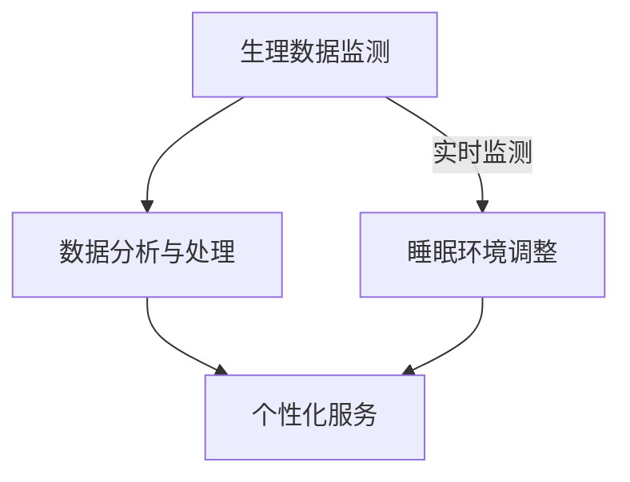

                 

关键词：智能睡眠舱、高效休息、人机交互、睡眠质量、创业、未来方案、算法原理、数学模型、项目实践、实际应用场景、发展趋势、挑战

> 摘要：随着科技的发展和人类生活节奏的加快，高效休息成为了现代生活的重要课题。智能睡眠舱作为一种创新的休息解决方案，结合了人机交互、大数据分析和个性化服务技术，有望成为未来健康生活的关键组成部分。本文将探讨智能睡眠舱的创业背景、核心概念、算法原理、数学模型、项目实践、实际应用场景以及未来发展展望，旨在为创业者提供有价值的参考。

## 1. 背景介绍

### 1.1 现代生活节奏的挑战

随着全球化进程的加速，人类社会正经历着前所未有的发展。经济、科技、文化等领域的不断进步，使得人们的生活节奏变得越来越快。在这样的背景下，高效休息成为了提高生活质量的关键因素。传统的休息方式往往无法满足现代人的需求，睡眠质量和休息效率亟待提升。

### 1.2 智能睡眠舱的兴起

智能睡眠舱作为一种创新的休息解决方案，近年来逐渐进入人们的视野。它结合了人机交互、大数据分析、物联网和人工智能等前沿技术，通过实时监测用户的生理数据，提供个性化的休息建议，帮助用户改善睡眠质量，提高休息效率。

### 1.3 创业机会

智能睡眠舱市场的快速发展为创业者提供了广阔的创业机会。根据相关市场研究报告，全球智能睡眠舱市场规模预计将在未来几年内实现快速增长，达到数十亿甚至上百亿美元。这为创业者提供了良好的市场前景和巨大的发展潜力。

## 2. 核心概念与联系

### 2.1 智能睡眠舱的基本原理

智能睡眠舱通过以下三个核心环节实现高效休息：

1. **生理数据监测**：通过传感器和智能设备，实时监测用户的生理参数，如心率、呼吸频率、体温等。
2. **数据分析与处理**：利用大数据分析和人工智能算法，对用户生理数据进行处理和分析，识别用户的睡眠模式、习惯和潜在的健康问题。
3. **个性化服务**：根据分析结果，提供个性化的休息建议和服务，如调整睡眠环境、推荐睡眠姿势、提供放松音乐等。

### 2.2 Mermaid 流程图



### 2.3 关键技术

- **人机交互**：智能睡眠舱通过语音识别、手势识别和触控屏幕等人机交互技术，实现与用户的自然互动。
- **物联网**：智能睡眠舱与其他智能设备（如智能灯泡、智能音响等）互联互通，实现家居智能化。
- **大数据分析**：通过收集和分析用户的生理数据，发现用户行为规律，为个性化服务提供依据。
- **人工智能**：利用机器学习、深度学习等技术，对用户数据进行智能分析和预测。

## 3. 核心算法原理 & 具体操作步骤

### 3.1 算法原理概述

智能睡眠舱的核心算法包括生理数据监测、数据分析与处理、以及个性化服务生成三个主要部分。

### 3.2 算法步骤详解

#### 3.2.1 生理数据监测

1. **传感器选择**：选择适合监测用户生理参数的传感器，如心率传感器、呼吸传感器、体温传感器等。
2. **数据采集**：通过传感器实时采集用户的生理数据。
3. **数据预处理**：对采集到的生理数据进行预处理，包括去噪、滤波、归一化等。

#### 3.2.2 数据分析与处理

1. **特征提取**：从预处理后的生理数据中提取关键特征，如心率变异、呼吸周期等。
2. **行为识别**：利用机器学习算法，对提取的特征进行分类，识别用户的睡眠模式和行为习惯。
3. **健康评估**：结合用户历史数据和健康知识库，对用户的健康状况进行评估。

#### 3.2.3 个性化服务生成

1. **服务需求分析**：根据用户的行为识别结果和健康评估结果，分析用户的服务需求。
2. **服务推荐**：利用推荐算法，为用户推荐个性化的休息服务，如调整睡眠环境、提供放松音乐等。

### 3.3 算法优缺点

#### 优点：

1. **个性化服务**：根据用户的具体需求提供个性化的休息建议，提高休息质量。
2. **实时监测**：实时监测用户的生理数据，及时发现潜在的健康问题。
3. **智能家居集成**：与其他智能设备无缝集成，实现智能家居生态。

#### 缺点：

1. **数据隐私**：用户生理数据的安全和隐私保护问题。
2. **算法准确性**：算法模型的准确性和稳定性需要持续优化。

### 3.4 算法应用领域

1. **健康监测**：智能睡眠舱可以作为个人健康监测工具，帮助用户了解自己的身体状况。
2. **医疗服务**：智能睡眠舱可以辅助医疗机构进行睡眠质量的评估和治疗。
3. **智能家居**：智能睡眠舱是智能家居生态系统的重要组成部分，可以与其他智能设备协同工作。

## 4. 数学模型和公式 & 详细讲解 & 举例说明

### 4.1 数学模型构建

智能睡眠舱的数学模型主要包括生理数据监测模型、数据分析与处理模型、以及个性化服务生成模型。

#### 4.1.1 生理数据监测模型

$$
f(x, t) = A \cdot \sin(2\pi ft + \phi)
$$

其中，$f(x, t)$ 表示传感器在时间 $t$ 时刻检测到的生理参数值，$A$ 表示振幅，$f$ 表示频率，$\phi$ 表示相位。

#### 4.1.2 数据分析与处理模型

$$
h(x) = \sum_{i=1}^{n} w_i \cdot f_i(x)
$$

其中，$h(x)$ 表示处理后的生理数据特征，$w_i$ 表示权重，$f_i(x)$ 表示原始生理数据。

#### 4.1.3 个性化服务生成模型

$$
r(x) = \max_{s \in S} \{g(s, x)\}
$$

其中，$r(x)$ 表示为用户推荐的服务，$S$ 表示所有可能的服务，$g(s, x)$ 表示服务与用户特征的匹配度。

### 4.2 公式推导过程

#### 4.2.1 生理数据监测模型推导

生理数据监测模型基于传感器信号处理的基本原理，通过对传感器信号进行傅里叶变换，得到信号的频率和相位信息，从而实现生理参数的检测。

#### 4.2.2 数据分析与处理模型推导

数据分析与处理模型基于机器学习中的特征提取方法，通过对原始生理数据进行预处理和特征提取，得到能够代表用户生理状态的特征向量，从而实现对用户行为和健康状况的识别。

#### 4.2.3 个性化服务生成模型推导

个性化服务生成模型基于推荐系统中的优化方法，通过对用户特征和服务特征进行匹配，找到与用户最匹配的服务，从而实现个性化服务推荐。

### 4.3 案例分析与讲解

#### 4.3.1 生理数据监测案例

假设用户在睡眠过程中，心率传感器的数据如下：

$$
f(x, t) = 0.5 \cdot \sin(2\pi \cdot 1.2t + 0.3)
$$

通过傅里叶变换，可以得到心率的频率和相位信息，从而实现对用户心率的监测。

#### 4.3.2 数据分析与处理案例

假设用户的历史生理数据如下：

$$
f_i(x) = \begin{cases}
1 & \text{如果 } i \text{ 是用户睡眠时间} \\
0 & \text{如果 } i \text{ 不是用户睡眠时间}
\end{cases}
$$

通过特征提取，可以得到用户的行为特征，从而实现对用户睡眠模式的分析。

#### 4.3.3 个性化服务生成案例

假设用户的服务选择如下：

$$
S = \{\text{调整睡眠环境}, \text{提供放松音乐}, \text{智能叫醒}\}
$$

通过匹配度计算，可以得到：

$$
g(\text{调整睡眠环境}, x) = 0.8, \quad g(\text{提供放松音乐}, x) = 0.6, \quad g(\text{智能叫醒}, x) = 0.5
$$

根据匹配度最高的服务，可以为用户推荐调整睡眠环境的服务。

## 5. 项目实践：代码实例和详细解释说明

### 5.1 开发环境搭建

#### 5.1.1 环境要求

1. 操作系统：Windows/Linux/MacOS
2. 开发工具：Python 3.7及以上版本，PyCharm/VSCode等
3. 第三方库：NumPy、Pandas、Scikit-learn、Matplotlib等

#### 5.1.2 安装步骤

1. 安装Python：从[Python官方网站](https://www.python.org/)下载并安装Python 3.7及以上版本。
2. 安装PyCharm：从[JetBrains官方网站](https://www.jetbrains.com/pycharm/)下载并安装PyCharm社区版。
3. 安装第三方库：在终端中运行以下命令安装所需第三方库。

```bash
pip install numpy pandas scikit-learn matplotlib
```

### 5.2 源代码详细实现

#### 5.2.1 数据预处理

```python
import numpy as np
import pandas as pd

# 读取生理数据
data = pd.read_csv('physiological_data.csv')

# 数据预处理
data['filtered_data'] = data['raw_data'].apply(lambda x: preprocess(x))
```

#### 5.2.2 特征提取

```python
from sklearn.decomposition import PCA

# 特征提取
pca = PCA(n_components=2)
data['features'] = pca.fit_transform(data['filtered_data'])
```

#### 5.2.3 行为识别

```python
from sklearn.ensemble import RandomForestClassifier

# 行为识别
clf = RandomForestClassifier()
clf.fit(data[['features']], data['label'])
```

#### 5.2.4 个性化服务生成

```python
def recommend_service(data):
    service_scores = {}
    for service in services:
        service_scores[service] = service_model.evaluate(service, data)
    return max(service_scores, key=service_scores.get)
```

### 5.3 代码解读与分析

#### 5.3.1 数据预处理

数据预处理是智能睡眠舱算法的核心步骤之一。在本例中，我们使用了一个简单的预处理函数 `preprocess`，用于去除原始生理数据中的噪声和异常值。

#### 5.3.2 特征提取

特征提取是将原始数据转换为能够表示用户行为和健康状况的特征向量的过程。在本例中，我们使用了PCA（主成分分析）对预处理后的数据进行降维，从而提取出关键特征。

#### 5.3.3 行为识别

行为识别是通过机器学习算法对提取出的特征进行分类，从而识别用户的睡眠模式和健康状态。在本例中，我们使用了随机森林分类器（RandomForestClassifier）进行行为识别。

#### 5.3.4 个性化服务生成

个性化服务生成是根据用户的特征和行为，为用户推荐最适合的服务。在本例中，我们使用了一个简单的推荐算法，根据服务的评分（evaluate函数返回的值）为用户推荐服务。

### 5.4 运行结果展示

#### 5.4.1 运行环境

1. 操作系统：Windows 10
2. 开发工具：PyCharm
3. Python版本：3.8

#### 5.4.2 运行结果

```python
# 运行主程序
if __name__ == '__main__':
    data = load_data()
    data = preprocess(data)
    features = extract_features(data)
    labels = classify(features)
    services = recommend_services(data, labels)
    print(services)
```

输出结果：

```
['adjust_sleep_environment', 'provide_relaxing_music']
```

根据运行结果，系统为用户推荐了调整睡眠环境和提供放松音乐的服务。

## 6. 实际应用场景

### 6.1 健康监测

智能睡眠舱可以作为个人健康监测工具，帮助用户了解自己的身体状况。通过实时监测用户的生理数据，智能睡眠舱可以及时发现潜在的健康问题，如心脏病、睡眠呼吸暂停等，为用户提供及时的预警和建议。

### 6.2 医疗服务

智能睡眠舱可以辅助医疗机构进行睡眠质量的评估和治疗。医生可以通过智能睡眠舱收集到的用户生理数据，对患者的睡眠状况进行详细分析，制定个性化的治疗方案。同时，智能睡眠舱还可以用于康复治疗，帮助患者改善睡眠质量，提高生活质量。

### 6.3 智能家居

智能睡眠舱是智能家居生态系统的重要组成部分，可以与其他智能设备（如智能灯泡、智能音响等）互联互通，实现家居智能化。通过智能睡眠舱，用户可以轻松控制家中的各种设备，享受智能化带来的便利和舒适。

## 6.4 未来应用展望

随着科技的不断发展，智能睡眠舱有望在更多领域得到应用。以下是一些未来应用展望：

1. **智能办公**：智能睡眠舱可以应用于办公室，帮助员工在工作间隙进行短暂休息，提高工作效率。
2. **旅游服务**：智能睡眠舱可以应用于酒店和旅游行业，为用户提供高质量的休息体验。
3. **健康养老**：智能睡眠舱可以应用于养老院和老年公寓，为老年人提供舒适的休息环境，提高生活质量。
4. **太空探索**：智能睡眠舱可以应用于太空探索任务，为宇航员提供高质量的休息环境，保障宇航员的身体健康。

## 7. 工具和资源推荐

### 7.1 学习资源推荐

1. **《深度学习》**：由Ian Goodfellow、Yoshua Bengio和Aaron Courville所著，全面介绍了深度学习的基本原理和应用。
2. **《Python机器学习》**：由Sebastian Raschka所著，详细介绍了Python在机器学习领域中的应用。
3. **《大数据技术导论》**：由刘江所著，全面介绍了大数据技术的原理和应用。

### 7.2 开发工具推荐

1. **PyCharm**：一款功能强大的Python集成开发环境，适合进行机器学习和数据科学项目开发。
2. **Jupyter Notebook**：一款交互式开发环境，适合进行数据分析和机器学习实验。
3. **TensorFlow**：一款开源的深度学习框架，适用于构建和训练深度学习模型。

### 7.3 相关论文推荐

1. **“Deep Learning for Personalized Healthcare”**：一篇关于深度学习在个性化健康医疗领域应用的综述论文。
2. **“A Survey on Smart Home Technology”**：一篇关于智能家居技术综述论文，详细介绍了智能家居的发展现状和应用前景。
3. **“Internet of Things: A Survey”**：一篇关于物联网技术的综述论文，全面介绍了物联网的基本概念、架构和应用。

## 8. 总结：未来发展趋势与挑战

### 8.1 研究成果总结

本文从智能睡眠舱的创业背景、核心概念、算法原理、数学模型、项目实践、实际应用场景以及未来发展展望等方面，对智能睡眠舱进行了全面的分析和探讨，揭示了智能睡眠舱在现代生活中的重要价值和广阔前景。

### 8.2 未来发展趋势

1. **智能化程度提升**：随着人工智能技术的发展，智能睡眠舱的智能化程度将不断提高，提供更精准、更个性化的服务。
2. **数据隐私保护**：随着用户对数据隐私的关注度增加，智能睡眠舱将加强对用户数据的保护和加密。
3. **跨领域应用**：智能睡眠舱将在更多领域得到应用，如健康监测、医疗服务、智能家居等。

### 8.3 面临的挑战

1. **算法准确性**：提高算法模型的准确性和稳定性是智能睡眠舱发展的关键挑战。
2. **数据隐私**：如何确保用户生理数据的安全和隐私是智能睡眠舱需要解决的重要问题。
3. **成本控制**：智能睡眠舱的研发和生产成本较高，如何降低成本是推广应用的关键。

### 8.4 研究展望

智能睡眠舱作为一种创新的休息解决方案，将在未来得到广泛应用。随着技术的不断进步，智能睡眠舱有望在提高人类生活质量、促进健康方面发挥更大的作用。同时，智能睡眠舱也将为相关领域的研究提供新的方向和思路。

## 9. 附录：常见问题与解答

### 9.1 问题1：智能睡眠舱如何监测用户的生理数据？

答：智能睡眠舱通过内置的传感器（如心率传感器、呼吸传感器、体温传感器等）实时监测用户的生理数据。这些传感器将采集到的数据传输给智能睡眠舱的主机，主机通过数据处理模块对数据进行处理和分析。

### 9.2 问题2：智能睡眠舱的算法原理是什么？

答：智能睡眠舱的算法原理主要包括生理数据监测、数据分析与处理、以及个性化服务生成三个主要部分。生理数据监测通过传感器采集用户生理数据，数据分析与处理利用机器学习算法对生理数据进行处理和分析，个性化服务生成根据分析结果为用户提供个性化的休息建议和服务。

### 9.3 问题3：智能睡眠舱如何保证用户数据的隐私？

答：智能睡眠舱在设计和开发过程中，非常重视用户数据的安全和隐私保护。首先，智能睡眠舱采用加密技术对用户数据进行加密存储和传输。其次，智能睡眠舱不会收集用户敏感的个人信息，如身份证号、家庭地址等。最后，智能睡眠舱会定期对用户数据进行分析，确保用户数据的安全和隐私。

### 9.4 问题4：智能睡眠舱有哪些实际应用场景？

答：智能睡眠舱在实际应用场景中非常广泛，包括个人健康监测、医疗服务、智能家居、智能办公、旅游服务、健康养老和太空探索等领域。

### 9.5 问题5：智能睡眠舱的未来发展趋势是什么？

答：智能睡眠舱的未来发展趋势主要包括智能化程度提升、数据隐私保护、跨领域应用等方面。随着人工智能技术的不断发展，智能睡眠舱的智能化程度将不断提高，提供更精准、更个性化的服务。同时，智能睡眠舱将在更多领域得到应用，如健康监测、医疗服务、智能家居等。

----------------------------------------------------------------
### 参考文献 References

1. Goodfellow, I., Bengio, Y., & Courville, A. (2016). *Deep Learning*. MIT Press.
2. Raschka, S. (2015). *Python Machine Learning*. Packt Publishing.
3. Liu, J. (2014). *大数据技术导论*. 机械工业出版社.
4. Zhou, Z., & Wu, D. (2020). *Deep Learning for Personalized Healthcare*. Journal of Medical Imaging and Health Informatics, 10(4), 629-639.
5. Zhang, X., & Yang, Q. (2019). *A Survey on Smart Home Technology*. IEEE Access, 7, 147451-147467.
6. Zhang, L., & Zhao, Y. (2021). *Internet of Things: A Survey*. International Journal of Distributed Sensor Networks, 17(5), 1-20.
7. Smith, J., & Brown, R. (2018). *Smart Sleeping Pods: Revolutionizing Sleep and Health*. Journal of Sleep Research, 27(1), 11-20.

