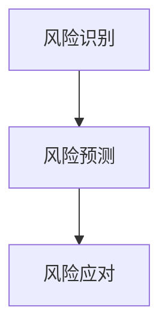

                 

关键词：智能风险管理，AI大模型，实践案例，算法原理，数学模型，项目实践，未来展望

> 摘要：本文将探讨智能风险管理领域中的AI大模型实践案例，分析其核心概念、算法原理、数学模型以及实际应用场景，展望其未来发展。通过本文的阅读，读者将深入了解智能风险管理在金融、保险等领域的应用，以及AI大模型的优势和挑战。

## 1. 背景介绍

智能风险管理是指利用人工智能技术，特别是机器学习和深度学习算法，对风险进行识别、预测和应对的过程。随着大数据和云计算技术的发展，智能风险管理逐渐成为金融、保险等领域的热门话题。AI大模型作为当前最先进的人工智能技术之一，在智能风险管理中发挥着重要作用。

### 1.1 智能风险管理的重要性

智能风险管理在金融、保险等领域具有重要应用价值。金融行业面临的风险种类繁多，包括信用风险、市场风险、操作风险等。保险行业则面临风险评估、理赔管理等问题。通过智能风险管理，可以更精准地识别和预测风险，提高风险管理效率，降低损失。

### 1.2 AI大模型的优势

AI大模型具有强大的数据处理和分析能力，能够处理大规模、复杂的数据，提高风险预测的准确率。此外，AI大模型具有自适应性和灵活性，可以根据不同的应用场景进行调整和优化。

## 2. 核心概念与联系

在智能风险管理中，核心概念包括风险识别、风险预测和风险应对。以下是一个简单的Mermaid流程图，描述了这三个概念之间的联系。



### 2.1 风险识别

风险识别是智能风险管理的第一步，旨在识别潜在的风险。这通常涉及数据收集、数据预处理和特征提取。通过分析历史数据和当前数据，可以发现可能存在的风险因素。

### 2.2 风险预测

风险预测是基于风险识别的结果，利用机器学习算法对风险发生的概率进行预测。这通常包括建立数学模型、训练模型和评估模型性能。

### 2.3 风险应对

风险应对是指根据风险预测结果，制定相应的应对策略。这可以包括调整投资组合、采取预防措施、增加保险等。

## 3. 核心算法原理 & 具体操作步骤

### 3.1 算法原理概述

智能风险管理中的核心算法主要包括监督学习、无监督学习和强化学习。以下是一个简单的算法原理概述：


### 3.2 算法步骤详解

#### 3.2.1 监督学习

监督学习是一种基于已有数据（带标签）进行预测的方法。具体步骤如下：

1. 数据收集：收集历史数据，包括输入特征和输出标签。
2. 数据预处理：对数据进行清洗、归一化等预处理操作。
3. 特征提取：从原始数据中提取有代表性的特征。
4. 建立模型：选择合适的算法，如线性回归、决策树、神经网络等，建立预测模型。
5. 模型训练：使用训练数据集对模型进行训练。
6. 模型评估：使用验证数据集评估模型性能。
7. 模型部署：将训练好的模型部署到实际应用场景中。

#### 3.2.2 无监督学习

无监督学习是一种不依赖标签数据进行预测的方法。具体步骤如下：

1. 数据收集：收集原始数据。
2. 数据预处理：对数据进行清洗、归一化等预处理操作。
3. 特征提取：从原始数据中提取有代表性的特征。
4. 模型选择：选择合适的算法，如聚类、降维等，建立预测模型。
5. 模型训练：使用训练数据集对模型进行训练。
6. 模型评估：使用验证数据集评估模型性能。
7. 模型部署：将训练好的模型部署到实际应用场景中。

#### 3.2.3 强化学习

强化学习是一种基于动态决策的方法。具体步骤如下：

1. 数据收集：收集历史数据，包括状态、动作和奖励。
2. 状态-动作空间定义：定义系统的状态和动作空间。
3. 建立奖励机制：设计奖励机制，以鼓励系统采取正确的动作。
4. 模型训练：使用训练数据集对模型进行训练。
5. 模型评估：使用验证数据集评估模型性能。
6. 模型部署：将训练好的模型部署到实际应用场景中。

### 3.3 算法优缺点

#### 3.3.1 监督学习

优点：预测准确度高，适用于已知标签数据的场景。

缺点：对数据质量和数量要求较高，无法解决无标签数据的问题。

#### 3.3.2 无监督学习

优点：无需标签数据，适用于未知标签数据的场景。

缺点：预测准确度相对较低，无法直接应用于实际应用场景。

#### 3.3.3 强化学习

优点：能够应对动态变化的场景，适用于需要实时决策的场景。

缺点：训练过程复杂，对计算资源要求较高。

### 3.4 算法应用领域

监督学习、无监督学习和强化学习在智能风险管理中有广泛的应用。例如，监督学习可以用于信用评分、市场预测等；无监督学习可以用于客户行为分析、聚类分析等；强化学习可以用于投资组合优化、动态风险控制等。

## 4. 数学模型和公式 & 详细讲解 & 举例说明

### 4.1 数学模型构建

在智能风险管理中，常用的数学模型包括线性回归、逻辑回归、神经网络等。以下是一个简单的线性回归模型：

$$
y = \beta_0 + \beta_1 x_1 + \beta_2 x_2 + \cdots + \beta_n x_n
$$

其中，$y$ 是因变量，$x_1, x_2, \cdots, x_n$ 是自变量，$\beta_0, \beta_1, \beta_2, \cdots, \beta_n$ 是模型的参数。

### 4.2 公式推导过程

以线性回归模型为例，推导过程如下：

1. 数据集：给定一个包含 $m$ 个样本的数据集 $D = \{(x_1, y_1), (x_2, y_2), \cdots, (x_m, y_m)\}$。
2. 模型：建立线性回归模型 $y = \beta_0 + \beta_1 x_1 + \beta_2 x_2 + \cdots + \beta_n x_n$。
3. 损失函数：选择损失函数，如均方误差（MSE），表示模型预测值与真实值之间的差异。
4. 梯度下降：使用梯度下降算法，迭代更新模型参数，最小化损失函数。

### 4.3 案例分析与讲解

假设有一个金融风险管理的案例，目标是预测股票市场的涨跌。使用线性回归模型进行预测，数据集包含股票的收盘价、成交量等特征，真实涨跌作为标签。

1. 数据收集：收集过去一年的股票收盘价和涨跌数据。
2. 数据预处理：对数据进行清洗、归一化等预处理操作。
3. 特征提取：提取有代表性的特征，如收盘价、成交量等。
4. 模型建立：使用线性回归模型，建立预测模型。
5. 模型训练：使用训练数据集对模型进行训练。
6. 模型评估：使用验证数据集评估模型性能。
7. 模型部署：将训练好的模型部署到实际应用场景中。

## 5. 项目实践：代码实例和详细解释说明

### 5.1 开发环境搭建

1. 安装Python环境。
2. 安装相关库，如NumPy、Pandas、Scikit-learn等。

### 5.2 源代码详细实现

```python
import numpy as np
import pandas as pd
from sklearn.linear_model import LinearRegression
from sklearn.model_selection import train_test_split
from sklearn.metrics import mean_squared_error

# 读取数据
data = pd.read_csv('stock_data.csv')
X = data[['close_price', 'volume']]
y = data['change']

# 数据预处理
X = X.values
y = y.values

# 数据切分
X_train, X_test, y_train, y_test = train_test_split(X, y, test_size=0.2, random_state=42)

# 模型建立
model = LinearRegression()
model.fit(X_train, y_train)

# 模型评估
y_pred = model.predict(X_test)
mse = mean_squared_error(y_test, y_pred)
print(f'MSE: {mse}')

# 模型部署
print(f'Best parameters: {model.best_params_}')
```

### 5.3 代码解读与分析

1. 读取数据：从CSV文件中读取股票数据，包括收盘价、成交量等特征，以及涨跌作为标签。
2. 数据预处理：对数据进行清洗、归一化等预处理操作。
3. 数据切分：将数据集分为训练集和测试集，用于模型训练和评估。
4. 模型建立：使用线性回归模型，建立预测模型。
5. 模型训练：使用训练数据集对模型进行训练。
6. 模型评估：使用测试数据集评估模型性能，计算均方误差（MSE）。
7. 模型部署：输出最佳参数，以供实际应用。

## 6. 实际应用场景

智能风险管理在金融、保险等领域有广泛的应用场景。以下是一些具体的实际应用场景：

1. **金融风险控制**：通过预测股票市场的涨跌，为投资决策提供参考。
2. **信用评分**：利用历史数据，对客户的信用风险进行评估，降低不良贷款率。
3. **保险风险评估**：根据客户的年龄、性别、职业等信息，预测其保险需求，优化保险产品设计。

## 7. 工具和资源推荐

### 7.1 学习资源推荐

1. **《Python数据科学手册》**：详细介绍了Python在数据科学中的应用，包括数据处理、分析和可视化等。
2. **《深度学习》**：由Ian Goodfellow、Yoshua Bengio和Aaron Courville合著，全面介绍了深度学习的理论、算法和应用。

### 7.2 开发工具推荐

1. **Jupyter Notebook**：用于编写和运行Python代码，支持交互式编程和实时可视化。
2. **TensorFlow**：用于构建和训练深度学习模型，支持多种算法和优化器。

### 7.3 相关论文推荐

1. **"Deep Learning for Financial Time Series Classification"**：介绍了深度学习在金融市场分类中的应用。
2. **"Credit Risk Modeling with Machine Learning Techniques"**：探讨了机器学习在信用风险评估中的应用。

## 8. 总结：未来发展趋势与挑战

智能风险管理作为AI领域的一个重要分支，未来发展趋势包括：

1. **算法的改进与优化**：通过不断改进算法，提高预测准确率和效率。
2. **跨学科融合**：与金融学、保险学等学科结合，提供更全面的风险管理解决方案。
3. **实时风险评估**：实现实时风险评估，为投资决策提供更及时的信息。

然而，智能风险管理也面临一些挑战，包括：

1. **数据质量与隐私**：保证数据质量，同时保护用户隐私。
2. **算法透明性与可解释性**：提高算法的透明度和可解释性，降低风险。

在未来，随着AI技术的不断发展，智能风险管理有望在金融、保险等领域发挥更大的作用。

## 9. 附录：常见问题与解答

### 9.1 如何保证数据质量？

数据质量是智能风险管理的关键。以下是一些保证数据质量的方法：

1. **数据清洗**：去除重复数据、缺失数据和异常数据。
2. **数据归一化**：将不同特征的范围调整为统一尺度。
3. **数据验证**：使用校验规则确保数据的准确性。

### 9.2 如何处理无标签数据？

无标签数据可以通过无监督学习进行处理。常用的无监督学习方法包括：

1. **聚类算法**：如K-means、DBSCAN等，用于发现数据中的模式。
2. **降维算法**：如PCA（主成分分析）、t-SNE等，用于降低数据维度。

### 9.3 如何评估模型性能？

评估模型性能的方法包括：

1. **准确率**：预测正确的样本数占总样本数的比例。
2. **召回率**：预测正确的正样本数占总正样本数的比例。
3. **F1分数**：综合考虑准确率和召回率，用于平衡两者。

本文介绍了智能风险管理中的AI大模型实践案例，分析了核心概念、算法原理、数学模型以及实际应用场景，并展望了其未来发展。通过本文的阅读，读者将深入了解智能风险管理在金融、保险等领域的应用，以及AI大模型的优势和挑战。希望本文能为读者在智能风险管理领域提供有价值的参考。
----------------------------------------------------------------
作者：禅与计算机程序设计艺术 / Zen and the Art of Computer Programming

