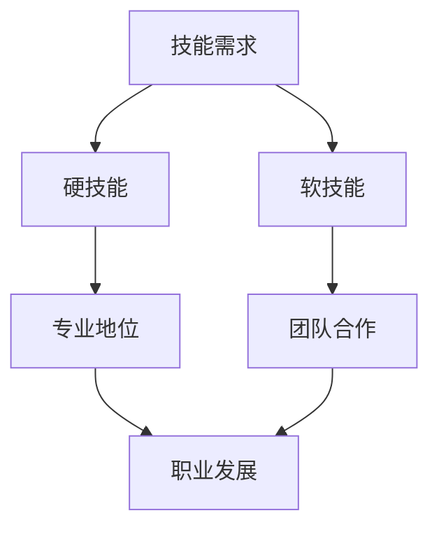

                 

未来工作环境的变迁正在以前所未有的速度影响着全球范围内的职业发展。随着技术的飞速进步，传统的技能需求正在迅速演变，而新的技能也在不断涌现。本文将探讨未来工作中所需的技能，以及如何培养和提升这些技能，以应对日益变化的职业挑战。

## 关键词

- 未来工作
- 技能需求
- 技术进步
- 职业发展
- 技能培养

## 摘要

本文将深入分析未来工作环境的变化，探讨在此背景下所需的技能类型及其发展路径。通过具体案例分析，我们将阐述如何通过学习和实践来提升这些技能，为未来的职业成功奠定坚实基础。

## 1. 背景介绍

当前，全球范围内的工作环境正在经历深刻变革。以信息技术为代表的新兴技术不断涌现，如人工智能、大数据、物联网和区块链，正在颠覆传统的生产方式和管理模式。与此同时，自动化和智能化技术的广泛应用使得一些传统的职位和技能逐渐被取代，而新的职位和技能需求不断出现。

### 1.1 技术变革的影响

技术的变革不仅改变了企业的运营模式，也深刻影响了员工的工作方式。例如，人工智能的普及使得许多重复性和规则性较强的工作可以由机器自动完成，从而释放了员工的时间，使其能够专注于更具创造性和战略性的任务。

### 1.2 技能需求的演变

随着技术的进步，传统的技能正在被新的技能所取代。例如，编程能力在技术行业中变得越来越重要，数据分析能力在商业领域中越来越受到重视。同时，软技能，如沟通能力、团队协作能力和解决问题的能力，也变得越来越关键。

## 2. 核心概念与联系

为了更好地理解未来工作所需的技能，我们需要首先了解一些核心概念及其相互之间的联系。

### 2.1 技能分类

在讨论技能需求时，我们通常将技能分为硬技能和软技能。

- **硬技能**：指具体的技术和能力，如编程、数据分析、机器学习等。
- **软技能**：指人际交往和团队合作方面的能力，如沟通、领导力、时间管理等。

### 2.2 技能与职业发展的关系

技能是职业发展的基石。拥有特定的硬技能可以帮助个人在技术领域中获得专业地位，而软技能则可以帮助个人更好地适应不同的工作环境和团队合作。

### 2.3 技能的迭代与更新

随着技术的快速发展，技能也在不断迭代和更新。例如，人工智能技术的兴起使得机器学习成为了一个热门领域，因此需要相关从业人员不断学习和更新知识。

### 2.4 Mermaid 流程图

以下是一个简单的 Mermaid 流程图，用于描述技能与职业发展之间的关系。



## 3. 核心算法原理 & 具体操作步骤

在探讨未来工作所需的技能时，核心算法的理解和掌握是至关重要的。以下将介绍几个关键算法的原理及其具体操作步骤。

### 3.1 算法原理概述

- **机器学习算法**：机器学习算法是人工智能的基础，通过数据训练模型，使其能够对未知数据进行预测或分类。
- **深度学习算法**：深度学习算法是机器学习的一个分支，通过多层神经网络来模拟人脑的学习过程。

### 3.2 算法步骤详解

#### 3.2.1 机器学习算法

1. 数据预处理：对收集到的数据进行清洗和格式化，使其适合训练模型。
2. 特征提取：从数据中提取有用的特征，用于训练模型。
3. 模型选择：选择合适的模型，如线性回归、决策树、随机森林等。
4. 模型训练：使用预处理后的数据对模型进行训练。
5. 模型评估：使用测试数据对训练好的模型进行评估，以确定其性能。

#### 3.2.2 深度学习算法

1. 数据预处理：与机器学习算法类似，对数据进行清洗和格式化。
2. 构建神经网络：设计多层神经网络结构，包括输入层、隐藏层和输出层。
3. 权重初始化：初始化神经网络的权重。
4. 前向传播：将输入数据通过神经网络进行传播，计算输出。
5. 反向传播：计算误差，并通过反向传播更新网络权重。
6. 模型优化：通过多次迭代，优化网络性能。

### 3.3 算法优缺点

#### 3.3.1 机器学习算法

**优点**：

- 适用于各种类型的数据分析任务。
- 能够自动提取特征，减少人工干预。

**缺点**：

- 需要大量的数据和计算资源。
- 模型的解释性较差。

#### 3.3.2 深度学习算法

**优点**：

- 具有很强的泛化能力，能够处理复杂的非线性问题。
- 适用于图像识别、语音识别等任务。

**缺点**：

- 需要大量的数据和计算资源。
- 模型的解释性较差。

### 3.4 算法应用领域

- **机器学习算法**：广泛应用于金融、医疗、电商等领域，如股票市场预测、疾病诊断、个性化推荐等。
- **深度学习算法**：广泛应用于图像识别、自然语言处理、自动驾驶等领域，如人脸识别、语音合成、自动驾驶汽车等。

## 4. 数学模型和公式 & 详细讲解 & 举例说明

在理解和应用核心算法时，数学模型和公式的掌握是必不可少的。以下将介绍几个关键的数学模型和公式，并进行详细讲解和举例说明。

### 4.1 数学模型构建

#### 4.1.1 回归模型

回归模型是一种常用的预测模型，用于预测连续值输出。

**公式**：

\[ y = \beta_0 + \beta_1x_1 + \beta_2x_2 + ... + \beta_nx_n \]

**例子**：

假设我们要预测一个房屋的价格，根据房屋的面积和年龄来构建回归模型。

1. 数据收集：收集房屋的面积、年龄和价格数据。
2. 特征提取：将面积和年龄作为特征。
3. 模型构建：使用最小二乘法构建线性回归模型。

### 4.2 公式推导过程

#### 4.2.1 梯度下降算法

梯度下降算法是一种常用的优化算法，用于最小化损失函数。

**公式**：

\[ w = w - \alpha \frac{\partial}{\partial w} J(w) \]

**例子**：

假设我们要使用梯度下降算法来优化线性回归模型的权重。

1. 初始化权重：设置初始权重。
2. 计算损失函数：计算预测值与真实值之间的误差。
3. 计算梯度：计算损失函数关于权重的梯度。
4. 更新权重：根据梯度更新权重。

### 4.3 案例分析与讲解

#### 4.3.1 图像分类

假设我们要使用卷积神经网络（CNN）对图像进行分类。

1. 数据收集：收集大量的图像数据。
2. 数据预处理：对图像进行归一化和裁剪。
3. 模型构建：构建卷积神经网络模型。
4. 模型训练：使用梯度下降算法训练模型。
5. 模型评估：使用测试数据评估模型性能。

## 5. 项目实践：代码实例和详细解释说明

以下将提供一个简单的代码实例，用于实现线性回归模型，并对其进行详细解释说明。

### 5.1 开发环境搭建

1. 安装 Python 解释器。
2. 安装所需的库，如 NumPy 和 Matplotlib。

### 5.2 源代码详细实现

```python
import numpy as np
import matplotlib.pyplot as plt

# 数据
x = np.array([1, 2, 3, 4, 5])
y = np.array([2, 4, 5, 4, 5])

# 模型参数
w = np.random.rand(1)  # 权重
b = np.random.rand(1)  # 偏置

# 梯度下降
learning_rate = 0.01
epochs = 100

for epoch in range(epochs):
    # 前向传播
    y_pred = w * x + b
    
    # 反向传播
    error = y - y_pred
    dw = 2 * x * error
    db = 2 * error
    
    # 更新权重和偏置
    w = w - learning_rate * dw
    b = b - learning_rate * db

# 模型评估
plt.scatter(x, y)
plt.plot(x, w * x + b, color='red')
plt.show()
```

### 5.3 代码解读与分析

1. **数据准备**：首先导入所需的库，并准备输入数据 `x` 和输出数据 `y`。
2. **模型初始化**：初始化模型参数 `w`（权重）和 `b`（偏置）。
3. **梯度下降算法**：实现梯度下降算法，包括前向传播、反向传播和权重更新。
4. **模型评估**：使用散点图和拟合直线展示模型预测结果。

## 6. 实际应用场景

### 6.1 金融行业

在金融行业中，线性回归模型常用于股票市场预测、信用评分和风险评估等任务。通过分析历史数据，模型可以预测股票价格或信用风险，为投资决策提供支持。

### 6.2 医疗领域

在医疗领域，机器学习算法和深度学习算法广泛应用于图像识别、疾病诊断和个性化治疗等领域。例如，利用卷积神经网络可以自动识别医学图像中的病变区域，提高诊断准确性。

### 6.3 电子商务

在电子商务领域，个性化推荐系统是基于机器学习算法的应用。通过分析用户的行为数据，模型可以推荐相关的商品或服务，提高用户的购物体验。

## 7. 未来应用展望

随着技术的不断进步，未来工作环境将发生更大变革。以下是未来工作中可能出现的几个趋势：

### 7.1 自动化和智能化

自动化和智能化技术的广泛应用将进一步改变传统的工作方式，提高生产效率和准确性。

### 7.2 交叉学科融合

未来工作将更加需要跨学科的知识和技能，如人工智能与医疗、人工智能与金融等领域的交叉应用。

### 7.3 软技能的重要性

软技能在未来的工作中将变得越来越重要，如沟通能力、团队合作能力和解决问题的能力等。

## 8. 工具和资源推荐

### 8.1 学习资源推荐

- 《Python编程：从入门到实践》
- 《深度学习》（Goodfellow et al.）
- 《数据科学实战》

### 8.2 开发工具推荐

- Jupyter Notebook
- PyCharm
- TensorFlow

### 8.3 相关论文推荐

- "Deep Learning"（Goodfellow et al.）
- "Recurrent Neural Networks for Language Modeling"（LSTM）
- "Generative Adversarial Networks"（GAN）

## 9. 总结：未来发展趋势与挑战

### 9.1 研究成果总结

本文分析了未来工作所需的技能，包括硬技能和软技能，并探讨了核心算法原理、数学模型和实际应用场景。通过案例分析，我们展示了如何通过学习和实践来提升这些技能。

### 9.2 未来发展趋势

未来工作将更加依赖技术进步，尤其是人工智能和大数据等领域。交叉学科融合和软技能的重要性将逐渐凸显。

### 9.3 面临的挑战

面对技术变革，个人和组织都需要不断学习和适应，以应对不断变化的职业挑战。

### 9.4 研究展望

未来的研究应重点关注人工智能伦理、网络安全和可持续性发展等问题，以推动技术的健康发展。

## 10. 附录：常见问题与解答

### 10.1 什么是机器学习？

机器学习是一种使计算机系统能够从数据中学习并做出预测或决策的技术。

### 10.2 什么是深度学习？

深度学习是机器学习的一个分支，通过多层神经网络来模拟人脑的学习过程。

### 10.3 什么是软技能？

软技能是指人际交往和团队合作方面的能力，如沟通能力、领导力和解决问题的能力。

### 10.4 如何提升编程能力？

通过不断学习和实践，例如参加在线课程、阅读技术书籍和编写实际项目代码。

### 10.5 什么是数据分析？

数据分析是一种通过数据提取有价值信息的过程，用于支持决策制定和业务优化。

### 10.6 人工智能和大数据之间的关系是什么？

人工智能和大数据密切相关。大数据提供了大量的数据资源，而人工智能技术则能够从这些数据中提取有价值的信息和模式。

### 10.7 什么是区块链？

区块链是一种分布式数据库技术，通过去中心化的方式记录交易和数据，具有高度的安全性和透明性。

## 11. 结论

未来工作环境的变革对技能需求提出了新的挑战，同时也提供了新的机遇。通过不断学习和提升硬技能和软技能，个人和组织都能够更好地应对未来的职业挑战，实现持续发展。

### 作者署名

作者：禅与计算机程序设计艺术 / Zen and the Art of Computer Programming
```markdown
----------------------------------------------------------------
# 未来工作：技能需求与培养

> 关键词：未来工作、技能需求、技术进步、职业发展、技能培养

> 摘要：本文深入探讨了未来工作环境的变化，分析了在此背景下所需的技能类型及其发展路径，并通过具体案例分析，阐述了如何通过学习和实践来提升这些技能，为未来的职业成功奠定坚实基础。

## 1. 背景介绍

当前，全球范围内的工作环境正在经历深刻变革。以信息技术为代表的新兴技术不断涌现，如人工智能、大数据、物联网和区块链，正在颠覆传统的生产方式和管理模式。与此同时，自动化和智能化技术的广泛应用使得一些传统的职位和技能逐渐被取代，而新的职位和技能需求不断出现。

### 1.1 技术变革的影响

技术的变革不仅改变了企业的运营模式，也深刻影响了员工的工作方式。例如，人工智能的普及使得许多重复性和规则性较强的工作可以由机器自动完成，从而释放了员工的时间，使其能够专注于更具创造性和战略性的任务。

### 1.2 技能需求的演变

随着技术的进步，传统的技能正在被新的技能所取代。例如，编程能力在技术行业中变得越来越重要，数据分析能力在商业领域中越来越受到重视。同时，软技能，如沟通能力、团队协作能力和解决问题的能力，也变得越来越关键。

## 2. 核心概念与联系

为了更好地理解未来工作所需的技能，我们需要首先了解一些核心概念及其相互之间的联系。

### 2.1 技能分类

在讨论技能需求时，我们通常将技能分为硬技能和软技能。

- **硬技能**：指具体的技术和能力，如编程、数据分析、机器学习等。
- **软技能**：指人际交往和团队合作方面的能力，如沟通、领导力、时间管理等。

### 2.2 技能与职业发展的关系

技能是职业发展的基石。拥有特定的硬技能可以帮助个人在技术领域中获得专业地位，而软技能则可以帮助个人更好地适应不同的工作环境和团队合作。

### 2.3 技能的迭代与更新

随着技术的快速发展，技能也在不断迭代和更新。例如，人工智能技术的兴起使得机器学习成为了一个热门领域，因此需要相关从业人员不断学习和更新知识。

### 2.4 Mermaid 流程图

以下是一个简单的 Mermaid 流程图，用于描述技能与职业发展之间的关系。


## 3. 核心算法原理 & 具体操作步骤

在探讨未来工作所需的技能时，核心算法的理解和掌握是至关重要的。以下将介绍几个关键算法的原理及其具体操作步骤。

### 3.1 算法原理概述

- **机器学习算法**：机器学习算法是人工智能的基础，通过数据训练模型，使其能够对未知数据进行预测或分类。
- **深度学习算法**：深度学习算法是机器学习的一个分支，通过多层神经网络来模拟人脑的学习过程。

### 3.2 算法步骤详解

#### 3.2.1 机器学习算法

1. 数据预处理：对收集到的数据进行清洗和格式化，使其适合训练模型。
2. 特征提取：从数据中提取有用的特征，用于训练模型。
3. 模型选择：选择合适的模型，如线性回归、决策树、随机森林等。
4. 模型训练：使用预处理后的数据对模型进行训练。
5. 模型评估：使用测试数据对训练好的模型进行评估，以确定其性能。

#### 3.2.2 深度学习算法

1. 数据预处理：与机器学习算法类似，对数据进行清洗和格式化。
2. 构建神经网络：设计多层神经网络结构，包括输入层、隐藏层和输出层。
3. 权重初始化：初始化神经网络的权重。
4. 前向传播：将输入数据通过神经网络进行传播，计算输出。
5. 反向传播：计算误差，并通过反向传播更新网络权重。
6. 模型优化：通过多次迭代，优化网络性能。

### 3.3 算法优缺点

#### 3.3.1 机器学习算法

**优点**：

- 适用于各种类型的数据分析任务。
- 能够自动提取特征，减少人工干预。

**缺点**：

- 需要大量的数据和计算资源。
- 模型的解释性较差。

#### 3.3.2 深度学习算法

**优点**：

- 具有很强的泛化能力，能够处理复杂的非线性问题。
- 适用于图像识别、语音识别等任务。

**缺点**：

- 需要大量的数据和计算资源。
- 模型的解释性较差。

### 3.4 算法应用领域

- **机器学习算法**：广泛应用于金融、医疗、电商等领域，如股票市场预测、疾病诊断、个性化推荐等。
- **深度学习算法**：广泛应用于图像识别、自然语言处理、自动驾驶等领域，如人脸识别、语音合成、自动驾驶汽车等。

## 4. 数学模型和公式 & 详细讲解 & 举例说明

在理解和应用核心算法时，数学模型和公式的掌握是必不可少的。以下将介绍几个关键的数学模型和公式，并进行详细讲解和举例说明。

### 4.1 数学模型构建

#### 4.1.1 回归模型

回归模型是一种常用的预测模型，用于预测连续值输出。

**公式**：

\[ y = \beta_0 + \beta_1x_1 + \beta_2x_2 + ... + \beta_nx_n \]

**例子**：

假设我们要预测一个房屋的价格，根据房屋的面积和年龄来构建回归模型。

1. 数据收集：收集房屋的面积、年龄和价格数据。
2. 特征提取：将面积和年龄作为特征。
3. 模型构建：使用最小二乘法构建线性回归模型。

### 4.2 公式推导过程

#### 4.2.1 梯度下降算法

梯度下降算法是一种常用的优化算法，用于最小化损失函数。

**公式**：

\[ w = w - \alpha \frac{\partial}{\partial w} J(w) \]

**例子**：

假设我们要使用梯度下降算法来优化线性回归模型的权重。

1. 初始化权重：设置初始权重。
2. 计算损失函数：计算预测值与真实值之间的误差。
3. 计算梯度：计算损失函数关于权重的梯度。
4. 更新权重：根据梯度更新权重。

### 4.3 案例分析与讲解

#### 4.3.1 图像分类

假设我们要使用卷积神经网络（CNN）对图像进行分类。

1. 数据收集：收集大量的图像数据。
2. 数据预处理：对图像进行归一化和裁剪。
3. 模型构建：构建卷积神经网络模型。
4. 模型训练：使用梯度下降算法训练模型。
5. 模型评估：使用测试数据评估模型性能。

## 5. 项目实践：代码实例和详细解释说明

以下将提供一个简单的代码实例，用于实现线性回归模型，并对其进行详细解释说明。

### 5.1 开发环境搭建

1. 安装 Python 解释器。
2. 安装所需的库，如 NumPy 和 Matplotlib。

### 5.2 源代码详细实现

```python
import numpy as np
import matplotlib.pyplot as plt

# 数据
x = np.array([1, 2, 3, 4, 5])
y = np.array([2, 4, 5, 4, 5])

# 模型参数
w = np.random.rand(1)  # 权重
b = np.random.rand(1)  # 偏置

# 梯度下降
learning_rate = 0.01
epochs = 100

for epoch in range(epochs):
    # 前向传播
    y_pred = w * x + b
    
    # 反向传播
    error = y - y_pred
    dw = 2 * x * error
    db = 2 * error
    
    # 更新权重和偏置
    w = w - learning_rate * dw
    b = b - learning_rate * db

# 模型评估
plt.scatter(x, y)
plt.plot(x, w * x + b, color='red')
plt.show()
```

### 5.3 代码解读与分析

1. **数据准备**：首先导入所需的库，并准备输入数据 `x` 和输出数据 `y`。
2. **模型初始化**：初始化模型参数 `w`（权重）和 `b`（偏置）。
3. **梯度下降算法**：实现梯度下降算法，包括前向传播、反向传播和权重更新。
4. **模型评估**：使用散点图和拟合直线展示模型预测结果。

## 6. 实际应用场景

### 6.1 金融行业

在金融行业中，线性回归模型常用于股票市场预测、信用评分和风险评估等任务。通过分析历史数据，模型可以预测股票价格或信用风险，为投资决策提供支持。

### 6.2 医疗领域

在医疗领域，机器学习算法和深度学习算法广泛应用于图像识别、疾病诊断和个性化治疗等领域。例如，利用卷积神经网络可以自动识别医学图像中的病变区域，提高诊断准确性。

### 6.3 电子商务

在电子商务领域，个性化推荐系统是基于机器学习算法的应用。通过分析用户的行为数据，模型可以推荐相关的商品或服务，提高用户的购物体验。

## 7. 未来应用展望

随着技术的不断进步，未来工作环境将发生更大变革。以下是未来工作中可能出现的几个趋势：

### 7.1 自动化和智能化

自动化和智能化技术的广泛应用将进一步改变传统的工作方式，提高生产效率和准确性。

### 7.2 交叉学科融合

未来工作将更加需要跨学科的知识和技能，如人工智能与医疗、人工智能与金融等领域的交叉应用。

### 7.3 软技能的重要性

软技能在未来的工作中将变得越来越重要，如沟通能力、团队合作能力和解决问题的能力等。

## 8. 工具和资源推荐

### 8.1 学习资源推荐

- 《Python编程：从入门到实践》
- 《深度学习》（Goodfellow et al.）
- 《数据科学实战》

### 8.2 开发工具推荐

- Jupyter Notebook
- PyCharm
- TensorFlow

### 8.3 相关论文推荐

- "Deep Learning"（Goodfellow et al.）
- "Recurrent Neural Networks for Language Modeling"（LSTM）
- "Generative Adversarial Networks"（GAN）

## 9. 总结：未来发展趋势与挑战

### 9.1 研究成果总结

本文分析了未来工作所需的技能，包括硬技能和软技能，并探讨了核心算法原理、数学模型和实际应用场景。通过案例分析，我们展示了如何通过学习和实践来提升这些技能。

### 9.2 未来发展趋势

未来工作将更加依赖技术进步，尤其是人工智能和大数据等领域。交叉学科融合和软技能的重要性将逐渐凸显。

### 9.3 面临的挑战

面对技术变革，个人和组织都需要不断学习和适应，以应对不断变化的职业挑战。

### 9.4 研究展望

未来的研究应重点关注人工智能伦理、网络安全和可持续性发展等问题，以推动技术的健康发展。

## 10. 附录：常见问题与解答

### 10.1 什么是机器学习？

机器学习是一种使计算机系统能够从数据中学习并做出预测或决策的技术。

### 10.2 什么是深度学习？

深度学习是机器学习的一个分支，通过多层神经网络来模拟人脑的学习过程。

### 10.3 什么是软技能？

软技能是指人际交往和团队合作方面的能力，如沟通能力、领导力和解决问题的能力。

### 10.4 如何提升编程能力？

通过不断学习和实践，例如参加在线课程、阅读技术书籍和编写实际项目代码。

### 10.5 什么是数据分析？

数据分析是一种通过数据提取有价值信息的过程，用于支持决策制定和业务优化。

### 10.6 人工智能和大数据之间的关系是什么？

人工智能和大数据密切相关。大数据提供了大量的数据资源，而人工智能技术则能够从这些数据中提取有价值的信息和模式。

### 10.7 什么是区块链？

区块链是一种分布式数据库技术，通过去中心化的方式记录交易和数据，具有高度的安全性和透明性。

## 11. 结论

未来工作环境的变革对技能需求提出了新的挑战，同时也提供了新的机遇。通过不断学习和提升硬技能和软技能，个人和组织都能够更好地应对未来的职业挑战，实现持续发展。

### 作者署名

作者：禅与计算机程序设计艺术 / Zen and the Art of Computer Programming
```

