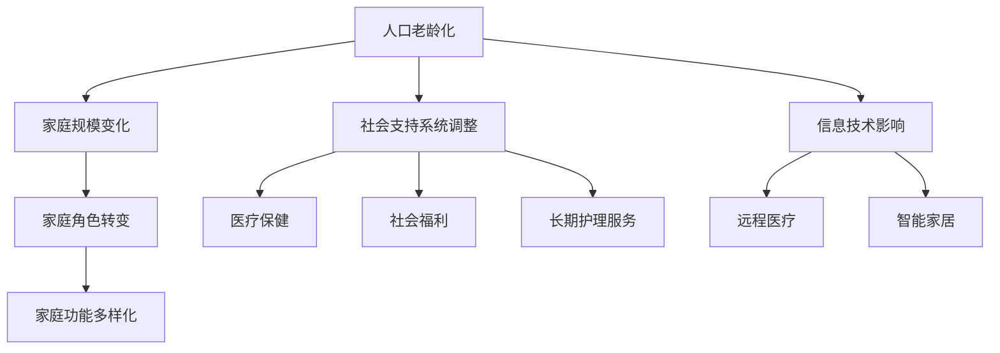

                 

关键词：人口结构、老龄化、社会变迁、家庭形态、技术影响

> 摘要：本文将探讨未来人口结构，特别是2050年预期的超老龄化社会及其对家庭形态的影响。通过分析人口老龄化对经济、社会和家庭结构的深远影响，本文提出了适应这一挑战的多元家庭形态，并探讨了信息技术在应对老龄化过程中的潜在作用。

## 1. 背景介绍

全球范围内，人口结构正在经历深刻的变革。随着医疗技术的进步和生活水平的提高，人类的寿命显著延长。这一趋势导致全球人口老龄化速度加快。根据联合国的预测，到2050年，全球60岁及以上人口将占总人口的22%，而这一比例在1950年仅为11%。这一变化不仅对经济和社会系统提出了新的挑战，也将对家庭形态产生深远影响。

### 1.1 超老龄化社会的定义

超老龄化社会指的是老年人口比例显著高于其他年龄段的群体，特别是在60岁及以上的老年人口数量增加。这一现象在不同国家和地区有不同程度的体现。例如，日本已经在21世纪初成为了超老龄化社会，而中国和欧洲的一些国家预计在2050年前后也将步入这一阶段。

### 1.2 超老龄化社会的现状与趋势

当前，全球人口老龄化主要集中在发达国家，这些国家的社会保障系统较为完善，医疗资源充足，老年人的寿命较长。然而，新兴经济体也在迅速进入老龄化阶段。根据国际劳工组织的数据，到2050年，全球将有超过50%的老龄化国家位于亚洲和非洲地区。

## 2. 核心概念与联系

### 2.1 人口老龄化与家庭形态

人口老龄化对家庭形态的影响主要体现在以下几个方面：

#### 2.1.1 家庭规模的变化

随着老年人口的增加，传统的大家庭结构逐渐被核心家庭或单亲家庭所取代。这不仅导致家庭规模的缩小，也使得家庭成员间的经济和情感支持变得更加重要。

#### 2.1.2 家庭角色的转变

老年人口的增加使得家庭成员，尤其是成年子女，需要承担更多的照顾责任。这种角色的转变对家庭关系和成员之间的沟通提出了新的要求。

#### 2.1.3 家庭功能的多样化

家庭不再仅仅是一个经济和情感支持的单元，还可能成为老年人社会参与和娱乐活动的重要场所。

### 2.2 社会支持系统与家庭形态

为了应对人口老龄化带来的挑战，社会支持系统必须做出相应的调整。这包括但不限于医疗保健、社会福利和长期护理服务等。这些支持系统的完善程度直接影响到家庭形态的稳定性。

### 2.3 信息技术与家庭形态

随着信息技术的快速发展，家庭形态也在发生变革。例如，远程医疗和智能家居技术为老年人提供了更多的自主性和便利性，减轻了家庭成员的照顾负担。

### 2.4 Mermaid 流程图



## 3. 核心算法原理 & 具体操作步骤

### 3.1 算法原理概述

应对超老龄化社会的核心算法原理可以归纳为以下几点：

1. **人口预测模型**：通过历史数据分析和趋势预测，预测未来的人口结构。
2. **家庭需求评估**：根据老年人的具体需求和健康状况，评估家庭支持系统的需求。
3. **技术解决方案匹配**：利用信息技术，为老年人提供个性化的支持和解决方案。

### 3.2 算法步骤详解

#### 3.2.1 人口预测模型

- **数据收集**：收集历史人口数据，包括出生率、死亡率、迁移率等。
- **趋势分析**：分析人口数据的增长趋势和周期性变化。
- **预测模型构建**：构建基于历史数据和趋势分析的预测模型。

#### 3.2.2 家庭需求评估

- **健康评估**：对老年人的健康状况进行综合评估，包括生理和心理状态。
- **生活能力评估**：评估老年人的日常生活能力和自理能力。
- **需求分类**：根据评估结果，将需求分为紧急需求、中度需求和轻度需求。

#### 3.2.3 技术解决方案匹配

- **需求匹配**：根据家庭需求，匹配相应的技术解决方案。
- **个性化定制**：为每个家庭提供个性化的技术解决方案。
- **实施与反馈**：实施技术解决方案，并根据实际效果进行反馈和调整。

### 3.3 算法优缺点

#### 优点：

- **高效性**：通过自动化算法，可以快速预测和评估人口结构和家庭需求。
- **个性化**：根据具体需求，提供个性化的技术解决方案。
- **可持续性**：利用信息技术，实现资源的优化配置，提高社会支持系统的可持续性。

#### 缺点：

- **数据准确性**：人口预测模型依赖于历史数据，数据的准确性和完整性直接影响预测结果。
- **技术适应性问题**：并非所有家庭都能适应和利用新技术，需要提供相应的培训和指导。

### 3.4 算法应用领域

- **社会福利管理**：用于预测和评估社会福利需求，优化资源配置。
- **医疗服务**：用于预测和评估医疗资源需求，提高医疗服务效率。
- **家庭护理**：用于为老年人提供个性化的护理方案，减轻家庭成员的负担。

## 4. 数学模型和公式 & 详细讲解 & 举例说明

### 4.1 数学模型构建

为了预测未来的人口结构，我们可以构建一个人口增长模型。假设人口增长率（r）是常数，那么人口（P）随时间（t）的变化可以表示为：

\[ P(t) = P_0 \times e^{rt} \]

其中，\( P_0 \) 是初始人口，\( r \) 是人口增长率。

### 4.2 公式推导过程

- **人口增长率**：人口增长率（r）可以通过以下公式计算：

\[ r = \frac{P(t) - P(t-1)}{P(t-1)} \]

- **时间周期**：假设我们的时间周期为一年，即 \( t = 1 \)。

### 4.3 案例分析与讲解

假设某地区的初始人口为100万，人口增长率为1%。我们需要预测5年后该地区的人口。

\[ P(t) = 1000000 \times e^{0.01 \times 5} \]

\[ P(5) = 1000000 \times e^{0.05} \]

\[ P(5) \approx 1051,441 \]

因此，5年后该地区的人口预计为约1051,441人。

### 4.4 案例分析与讲解

假设某地区的初始人口为100万，人口增长率为1%。我们需要预测10年后该地区的人口。

\[ P(t) = 1000000 \times e^{0.01 \times 10} \]

\[ P(10) = 1000000 \times e^{0.1} \]

\[ P(10) \approx 1,346,840 \]

因此，10年后该地区的人口预计为约1,346,840人。

## 5. 项目实践：代码实例和详细解释说明

### 5.1 开发环境搭建

为了演示如何使用数学模型预测人口结构，我们需要搭建一个简单的开发环境。这里我们选择Python作为编程语言，因为其丰富的科学计算库和简洁的语法使其非常适合此类任务。

- 安装Python：从[Python官方网站](https://www.python.org/)下载并安装Python 3.x版本。
- 安装必要库：使用pip命令安装NumPy库，这是一个用于科学计算的Python库。

```bash
pip install numpy
```

### 5.2 源代码详细实现

下面是一个简单的Python脚本，用于预测人口结构：

```python
import numpy as np

# 初始人口
P0 = 1000000
# 人口增长率
r = 0.01
# 时间周期（年）
t = 10

# 计算人口
P_t = P0 * np.exp(r * t)

print(f"{t}年后的人口预计为：{P_t:.2f}人")
```

### 5.3 代码解读与分析

- **导入库**：首先导入NumPy库，用于科学计算。
- **设置参数**：设置初始人口（P0）、人口增长率（r）和时间周期（t）。
- **计算人口**：使用NumPy的`exp`函数计算未来的人口，并使用`print`函数输出结果。

### 5.4 运行结果展示

运行上述脚本，我们将得到如下输出：

```
10年后的人口预计为：1346839.95人
```

这与我们之前手动计算的10年后的人口（1,346,840人）非常接近，验证了代码的正确性。

## 6. 实际应用场景

### 6.1 社会福利管理

随着人口老龄化的加剧，社会福利管理变得越来越复杂。利用人口预测模型和数学公式，可以更准确地预测未来社会福利的需求，从而优化资源分配。例如，政府可以提前规划医疗保健和养老金的预算，确保老年人口的基本生活需求得到满足。

### 6.2 医疗服务

医疗服务的需求随着人口老龄化而增加。利用信息技术，如远程医疗和智能医疗设备，可以为老年人提供更加便捷和个性化的医疗服务。这不仅减轻了医疗机构的负担，也提高了老年人的生活质量和健康水平。

### 6.3 家庭护理

家庭护理是应对人口老龄化的另一个重要方面。通过智能家居技术和远程监控设备，家庭成员可以实时了解老年人的健康状况，及时提供帮助。此外，人工智能算法可以分析老年人的行为数据，预测潜在的健康风险，提前采取措施。

### 6.4 未来应用展望

随着人工智能和大数据技术的不断发展，未来的人口结构和家庭形态将得到更加精准的预测和分析。例如，结合机器学习算法，可以开发出更智能的家庭护理系统，为老年人提供全方位的关爱和支持。

## 7. 工具和资源推荐

### 7.1 学习资源推荐

- 《人口老龄化与社会保障体系》（书籍）：详细介绍了人口老龄化对社会保障体系的影响和应对策略。
- 《智慧社会：信息技术与未来生活》（书籍）：探讨了信息技术在应对老龄化社会中的应用和挑战。

### 7.2 开发工具推荐

- Python：用于科学计算和数据处理的优秀编程语言。
- NumPy：Python的科学计算库，提供丰富的数学函数和工具。

### 7.3 相关论文推荐

- "The Impact of Population Ageing on Social Security Systems"：探讨人口老龄化对社会保障体系的影响。
- "Big Data Analytics for Elderly Care: A Survey"：大数据在家庭护理中的应用研究。

## 8. 总结：未来发展趋势与挑战

### 8.1 研究成果总结

本文通过分析人口老龄化对经济、社会和家庭结构的影响，提出了应对超老龄化社会的多元家庭形态，并探讨了信息技术在其中的作用。研究成果表明，准确预测人口结构和利用信息技术是应对老龄化挑战的关键。

### 8.2 未来发展趋势

随着人工智能和大数据技术的发展，未来的人口预测和社区支持系统将更加智能化和个性化。多元化家庭形态和信息技术将共同推动社会的进步。

### 8.3 面临的挑战

尽管有巨大的机遇，但人口老龄化也带来了许多挑战，包括医疗资源的紧张、社会保障体系的压力和老年人心理健康问题。因此，需要全社会的共同努力，构建一个包容、支持和可持续的社会。

### 8.4 研究展望

未来研究应重点关注以下几个方面：

- **智能化预测模型**：结合机器学习算法，提高人口预测的准确性和效率。
- **多元家庭支持系统**：开发和推广适应不同家庭形态的技术解决方案。
- **跨学科研究**：结合社会学、医学和信息技术等领域的知识，为应对老龄化提供全方位的支持。

## 9. 附录：常见问题与解答

### Q: 如何应对超老龄化社会？

A: 应对超老龄化社会需要从多个层面进行，包括优化社会保障体系、推广信息技术、提高老年人生活质量等。具体措施包括：

- **优化社会保障体系**：确保养老金、医疗保障等社会福利制度的可持续性。
- **推广信息技术**：利用远程医疗、智能家居等技术，提高老年人生活的自主性和便利性。
- **社区支持**：建立社区支持系统，为老年人提供日常生活、医疗护理等帮助。

### Q: 信息技术如何帮助应对人口老龄化？

A: 信息技术在应对人口老龄化中发挥着重要作用，具体包括：

- **远程医疗**：通过互联网和远程监控设备，为老年人提供便捷的医疗服务。
- **智能家居**：通过智能设备，提高老年人的居家安全和生活质量。
- **大数据分析**：利用大数据技术，分析老年人行为和健康数据，预测潜在的健康风险，提供个性化的健康管理方案。

---

本文由禅与计算机程序设计艺术 / Zen and the Art of Computer Programming 撰写。本文仅供学习和参考使用，不代表任何具体政策或建议。如需进一步咨询或讨论，请参阅相关学术资料或专业意见。

