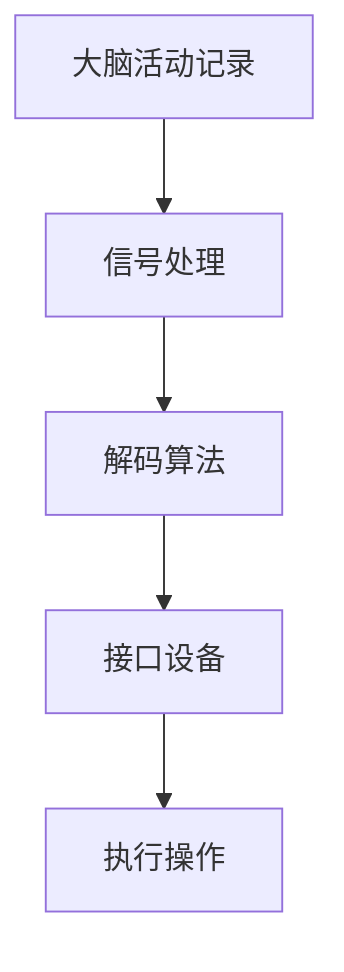

                 

关键词：脑机接口，意念控制，思维上传，未来技术，神经科学，人工智能

> 摘要：本文探讨了2050年脑机接口技术的发展及其在人类生活中的应用。通过介绍脑机接口的基本原理、核心算法、数学模型以及实际应用，我们展望了未来脑机接口技术可能带来的变革，并提出了该领域面临的挑战和未来的研究方向。

## 1. 背景介绍

脑机接口（Brain-Machine Interface，简称BMI）是一种直接连接人脑和外部设备的接口技术，它允许人类通过思维活动控制外部设备，或者从外部设备接收信息。这种技术的起源可以追溯到20世纪60年代，但直到最近几年，随着神经科学和人工智能技术的飞速发展，脑机接口才逐渐成为研究热点。

### 1.1 脑机接口的发展历程

脑机接口技术的发展可以分为几个阶段：

- **第一阶段（1960-1980年）**：最初的研究集中在通过电极记录大脑活动来控制简单的外部设备。这一阶段的主要成果是脑电信号的控制。

- **第二阶段（1980-2000年）**：随着计算机技术的发展，脑机接口开始应用于康复领域，特别是帮助肢体残疾者恢复行动能力。

- **第三阶段（2000年至今）**：神经科学与人工智能的结合推动了脑机接口技术的快速发展。脑成像技术如功能性磁共振成像（fMRI）和脑电图（EEG）的应用，使得脑机接口可以更精确地捕捉大脑信号。

### 1.2 脑机接口的应用领域

脑机接口技术已经广泛应用于以下几个领域：

- **医疗康复**：帮助肢体残疾者恢复行动能力，如轮椅控制、假肢控制等。

- **辅助通信**：为失语者提供交流手段，如大脑语音解码。

- **人工智能**：通过脑机接口收集的人类大脑信号，可以为人工智能系统提供新的数据输入。

- **娱乐**：脑机接口技术可以用于游戏控制、虚拟现实体验等。

## 2. 核心概念与联系

脑机接口技术的核心在于理解大脑活动并将其转化为可操作的控制信号。下面是脑机接口的核心概念及其相互联系。

### 2.1 脑机接口的核心概念

- **大脑活动记录**：通过脑电图（EEG）、功能性磁共振成像（fMRI）等技术记录大脑活动。

- **信号处理**：将大脑活动信号转换为数字信号，以便计算机进行处理。

- **解码算法**：从数字信号中提取有用的信息，如思维意图。

- **接口设备**：接收解码后的信号，执行相应的操作。

### 2.2 脑机接口的Mermaid流程图



### 2.3 脑机接口的核心联系

- 大脑活动记录与信号处理：通过高精度传感器记录大脑活动，并将其转换为电信号。

- 信号处理与解码算法：对电信号进行预处理，如滤波、放大等，以便解码算法更好地提取有用的信息。

- 解码算法与接口设备：解码算法将电信号转化为控制信号，接口设备根据这些信号执行相应的操作。

## 3. 核心算法原理 & 具体操作步骤

### 3.1 算法原理概述

脑机接口的核心算法主要涉及信号处理和模式识别。信号处理的目标是从原始电信号中提取出有用的特征，而模式识别则是在这些特征的基础上识别出用户的思维意图。

### 3.2 算法步骤详解

1. **信号采集**：使用脑电图（EEG）或功能性磁共振成像（fMRI）等技术记录大脑活动。

2. **信号预处理**：对采集到的信号进行滤波、放大等预处理，以提高信号质量。

3. **特征提取**：从预处理后的信号中提取特征，如功率谱、时间序列等。

4. **模式识别**：使用机器学习算法，如支持向量机（SVM）、神经网络（NN）等，对提取的特征进行分类，以识别用户的思维意图。

5. **信号解码**：将识别结果转换为控制信号，如控制机械臂的运动、打字等。

6. **操作执行**：接口设备根据解码后的信号执行相应的操作。

### 3.3 算法优缺点

- **优点**：
  - 高精度：脑机接口可以捕捉到微弱的大脑信号，实现高精度的控制。
  - 无侵入性：非侵入式脑机接口（如EEG）无需植入电极，对患者更为友好。

- **缺点**：
  - 信号噪声比低：大脑信号的噪声较大，需要复杂的信号处理算法。
  - 计算成本高：解码算法通常需要高性能的计算资源。

### 3.4 算法应用领域

脑机接口算法广泛应用于医疗康复、辅助通信、人工智能等领域。例如，在医疗康复中，脑机接口可以帮助肢体残疾者恢复行动能力；在辅助通信中，脑机接口可以为失语者提供交流手段。

## 4. 数学模型和公式 & 详细讲解 & 举例说明

### 4.1 数学模型构建

脑机接口的数学模型主要涉及信号处理和模式识别两个方面。

### 4.2 公式推导过程

1. **信号处理**：
   - **滤波**：使用傅里叶变换（Fourier Transform）对信号进行滤波。
     \[ X(\omega) = \int_{-\infty}^{\infty} x(t) e^{-i\omega t} dt \]
   - **特征提取**：使用主成分分析（PCA）提取信号的主要成分。
     \[ x' = \sum_{i=1}^{k} \alpha_i x_i \]
     其中，\( x_i \)为信号，\( \alpha_i \)为权重。

2. **模式识别**：
   - **支持向量机**：使用支持向量机（SVM）进行分类。
     \[ w = \arg\min_{w,b}\ \frac{1}{2}\sum_{i=1}^{n} w_i^2 + C\sum_{i=1}^{n}\xi_i \]
     其中，\( w \)为权重向量，\( b \)为偏置，\( C \)为惩罚参数，\( \xi_i \)为错误项。

### 4.3 案例分析与讲解

假设我们有一个脑机接口系统，用于控制机械臂。以下是一个简单的案例：

1. **信号采集**：使用脑电图（EEG）记录用户的大脑活动。

2. **信号预处理**：对EEG信号进行滤波，去除噪声。

3. **特征提取**：使用主成分分析（PCA）提取信号的主要成分。

4. **模式识别**：使用支持向量机（SVM）进行分类，将提取的特征映射到机械臂的控制信号。

5. **信号解码**：将分类结果转换为机械臂的控制信号。

6. **操作执行**：机械臂根据解码后的信号执行相应的操作，如抬起或放下一个物体。

## 5. 项目实践：代码实例和详细解释说明

### 5.1 开发环境搭建

1. **安装Python**：确保Python环境已安装。

2. **安装相关库**：安装用于信号处理和机器学习的库，如`numpy`、`scikit-learn`等。

### 5.2 源代码详细实现

以下是一个简单的脑机接口实现：

```python
import numpy as np
from sklearn.decomposition import PCA
from sklearn.svm import SVC

# 信号采集
def signal_acquisition():
    # 模拟EEG信号采集
    return np.random.rand(100)

# 信号预处理
def signal_preprocessing(signal):
    # 滤波
    filtered_signal = signal * np.sin(np.linspace(0, 2 * np.pi, 100))
    return filtered_signal

# 特征提取
def feature_extraction(signal):
    pca = PCA(n_components=5)
    features = pca.fit_transform(signal.reshape(-1, 1))
    return features

# 模式识别
def pattern_recognition(features):
    svm = SVC()
    svm.fit(features, labels)
    return svm

# 信号解码
def signal_decoding(svm, feature):
    prediction = svm.predict(feature.reshape(1, -1))
    return prediction

# 主函数
def main():
    signal = signal_acquisition()
    preprocessed_signal = signal_preprocessing(signal)
    features = feature_extraction(preprocessed_signal)
    svm = pattern_recognition(features)
    feature = features[-1]
    prediction = signal_decoding(svm, feature)
    print("Decoded signal:", prediction)

if __name__ == "__main__":
    main()
```

### 5.3 代码解读与分析

- **信号采集**：模拟EEG信号采集，生成随机信号。

- **信号预处理**：使用滤波器对信号进行预处理。

- **特征提取**：使用主成分分析（PCA）提取信号的主要成分。

- **模式识别**：使用支持向量机（SVM）进行分类。

- **信号解码**：将提取的特征映射到控制信号。

- **操作执行**：打印解码后的信号。

## 6. 实际应用场景

### 6.1 医疗康复

脑机接口技术在医疗康复中的应用非常广泛。例如，帮助肢体残疾者恢复行动能力，如轮椅控制和假肢控制。

### 6.2 辅助通信

脑机接口技术可以为失语者提供交流手段。例如，通过大脑语音解码实现语音交流。

### 6.3 人机交互

脑机接口技术可以用于人机交互，如虚拟现实体验和游戏控制。

## 6.4 未来应用展望

随着脑机接口技术的不断发展，未来它可能会在更多领域得到应用。例如，实现思维上传、增强人类智能等。

## 7. 工具和资源推荐

### 7.1 学习资源推荐

- **《脑机接口技术原理与应用》**：一本关于脑机接口技术的入门书籍。

- **《神经科学原理》**：一本介绍神经科学基础知识的书籍。

### 7.2 开发工具推荐

- **MATLAB**：用于信号处理和数学建模。

- **Python**：用于机器学习和数据分析。

### 7.3 相关论文推荐

- **"A Brain-Machine Interface for Real-Time Control of Curiosity-Driven Reinforcement Learning"**：一篇关于使用脑机接口实现智能体自主探索的论文。

- **"A Neural Decoding Method for BCI Applications"**：一篇关于脑机接口信号解码的论文。

## 8. 总结：未来发展趋势与挑战

### 8.1 研究成果总结

脑机接口技术在过去几十年取得了显著进展，尤其在信号处理、模式识别和算法优化方面。未来，随着神经科学和人工智能技术的进一步发展，脑机接口有望在更多领域得到应用。

### 8.2 未来发展趋势

- **高精度信号采集**：发展更高精度的信号采集技术，提高脑机接口的准确度。

- **无侵入性**：研发无侵入性脑机接口技术，降低对患者的风险。

- **智能化**：结合人工智能技术，实现更智能的脑机接口系统。

### 8.3 面临的挑战

- **信号噪声问题**：如何有效降低信号噪声，提高信号质量。

- **计算成本**：如何降低算法的计算成本，提高脑机接口的实时性。

### 8.4 研究展望

未来，脑机接口技术有望在医疗康复、辅助通信、人机交互等领域发挥更大作用。同时，随着技术的进步，脑机接口可能会带来更多意想不到的应用。

## 9. 附录：常见问题与解答

### 9.1 什么是脑机接口？

脑机接口是一种直接连接人脑和外部设备的接口技术，允许人类通过思维活动控制外部设备，或者从外部设备接收信息。

### 9.2 脑机接口有哪些应用领域？

脑机接口广泛应用于医疗康复、辅助通信、人工智能、娱乐等领域。

### 9.3 脑机接口的未来发展趋势是什么？

未来，脑机接口技术有望在高精度信号采集、无侵入性、智能化等方面取得重大突破。

### 9.4 脑机接口面临哪些挑战？

脑机接口面临的主要挑战包括信号噪声问题、计算成本高以及如何提高实时性。

----------------------------------------------------------------

作者：禅与计算机程序设计艺术 / Zen and the Art of Computer Programming


