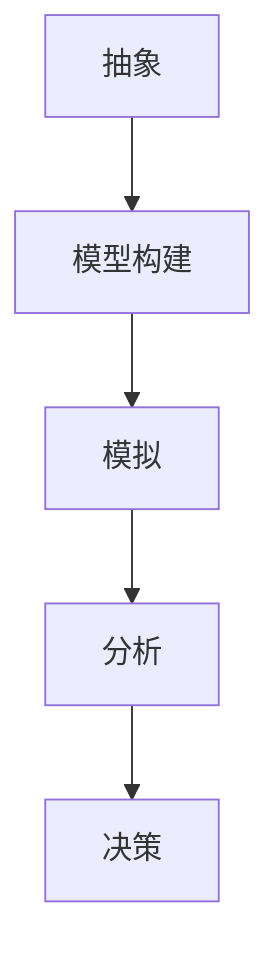

                 

关键词：模型思维、决策分析、人工智能、算法、数学模型、应用场景

> 摘要：本文深入探讨了模型思维在决策分析中的应用，分析了模型思维的核心概念、原理及其在人工智能领域的实际应用。通过具体实例和数学模型的构建，本文旨在为读者提供一套完整的决策分析方法论，助力实际问题的有效解决。

## 1. 背景介绍

决策分析作为一门综合性学科，广泛应用于商业管理、工程规划、社会政策制定等多个领域。随着人工智能技术的迅猛发展，数据驱动的决策分析方法日益受到关注。模型思维作为一种分析工具，通过构建和模拟现实世界的抽象模型，帮助决策者理解复杂系统的行为和结果，从而做出更加科学、合理的决策。

本文旨在探讨模型思维在决策分析中的应用，帮助读者了解如何利用模型思维进行有效的决策分析。文章结构如下：

- **背景介绍**：阐述决策分析的背景及其重要性。
- **核心概念与联系**：介绍模型思维的核心概念，并展示相关的Mermaid流程图。
- **核心算法原理 & 具体操作步骤**：详细讲解模型思维在决策分析中的应用算法及其操作步骤。
- **数学模型和公式**：介绍构建决策分析中的数学模型和公式，并举例说明。
- **项目实践：代码实例和详细解释说明**：提供实际代码实例，并进行详细解释。
- **实际应用场景**：分析模型思维在不同领域的应用实例。
- **未来应用展望**：探讨模型思维在决策分析领域的未来发展趋势。
- **工具和资源推荐**：推荐相关学习资源和开发工具。
- **总结**：总结研究成果，展望未来发展方向。
- **附录**：常见问题与解答。

## 2. 核心概念与联系

### 模型思维的概念

模型思维是一种将复杂系统抽象成易于理解的形式，并通过模拟和分析来探索系统行为和结果的方法。它包括以下几个关键要素：

1. **抽象**：将现实世界的复杂性简化为可管理的模型。
2. **模型构建**：通过数学、逻辑或计算机科学等工具，构建能够反映系统特征的模型。
3. **模拟**：运行模型以预测系统在不同条件下的行为。
4. **分析**：分析模拟结果，以提供决策支持。

### Mermaid流程图

为了更好地理解模型思维的工作流程，我们使用Mermaid流程图展示其核心环节：



### 模型思维与决策分析的联系

模型思维在决策分析中发挥着重要作用。它可以帮助决策者：

1. **明确问题**：通过模型思维，决策者可以更清晰地定义和分析面临的问题。
2. **理解系统**：模型思维有助于理解系统内部复杂的相互作用和反馈机制。
3. **预测结果**：通过模拟不同策略的效果，决策者可以预测未来的可能结果。
4. **优化决策**：基于模拟结果，决策者可以评估和优化各种决策方案。

## 3. 核心算法原理 & 具体操作步骤

### 3.1 算法原理概述

模型思维在决策分析中的应用通常遵循以下步骤：

1. **问题定义**：明确决策问题和目标。
2. **数据收集**：收集与决策问题相关的数据。
3. **模型构建**：根据问题定义和数据，构建反映系统特征的数学模型。
4. **模拟运行**：运行模型，模拟不同策略的效果。
5. **结果分析**：分析模拟结果，评估各种决策方案的优劣。
6. **决策制定**：根据分析结果，制定最优决策方案。

### 3.2 算法步骤详解

#### 3.2.1 问题定义

在开始模型构建之前，首先需要明确决策问题，包括目标、约束条件和假设。这一步骤是模型思维成功的关键。

#### 3.2.2 数据收集

收集与决策问题相关的数据，包括历史数据、实时数据等。数据的质量和完整性直接影响到模型的有效性。

#### 3.2.3 模型构建

根据问题定义和数据，构建反映系统特征的数学模型。常见的模型包括线性模型、非线性模型、网络模型等。

#### 3.2.4 模拟运行

运行模型，模拟不同策略的效果。这一步骤可以通过计算机模拟或手工模拟进行。

#### 3.2.5 结果分析

分析模拟结果，评估各种决策方案的优劣。常见的分析指标包括效益指标、成本指标、风险指标等。

#### 3.2.6 决策制定

根据分析结果，制定最优决策方案。决策制定需要考虑多个因素，包括模型预测的可靠性、决策者的风险偏好等。

### 3.3 算法优缺点

#### 优点

- **精确性**：模型思维可以提供精确的预测和评估结果，帮助决策者做出更科学的决策。
- **灵活性**：模型思维可以适应不同的问题和场景，具有较强的灵活性。
- **可重复性**：模型思维可以重复使用，为不同决策问题提供可靠的支持。

#### 缺点

- **复杂性**：模型构建和模拟过程可能非常复杂，需要专业知识和技术支持。
- **依赖数据**：模型的有效性高度依赖于数据的准确性，数据的缺失或不准确可能导致模型失效。
- **不确定性**：现实世界中的不确定性难以完全模拟，模型的预测结果可能存在误差。

### 3.4 算法应用领域

模型思维在决策分析中具有广泛的应用领域，包括但不限于：

- **商业管理**：市场营销策略、供应链管理、风险管理等。
- **工程规划**：建筑设计、项目管理、资源调度等。
- **社会政策**：公共卫生政策、教育政策、社会公平等。
- **环境科学**：气候变化、污染控制、生态系统管理等。

## 4. 数学模型和公式 & 详细讲解 & 举例说明

### 4.1 数学模型构建

在决策分析中，数学模型是核心工具。以下是构建数学模型的基本步骤：

1. **定义决策变量**：确定决策问题中的关键变量，例如产量、成本、利润等。
2. **确定约束条件**：明确决策问题的约束条件，例如资源限制、法律法规等。
3. **构建目标函数**：根据决策目标，构建反映决策效果的数学函数，例如最大化利润、最小化成本等。
4. **建立模型方程**：将决策变量、约束条件和目标函数结合起来，形成完整的数学模型。

### 4.2 公式推导过程

以线性规划为例，介绍构建数学模型的推导过程。

#### 4.2.1 线性规划问题

假设我们面临以下线性规划问题：

- **决策变量**：\( x_1, x_2, ..., x_n \)
- **目标函数**：最大化 \( Z = c_1x_1 + c_2x_2 + ... + c_nx_n \)
- **约束条件**：
  - \( a_{11}x_1 + a_{12}x_2 + ... + a_{1n}x_n \leq b_1 \)
  - \( a_{21}x_1 + a_{22}x_2 + ... + a_{2n}x_n \leq b_2 \)
  - \( ... \)
  - \( a_{m1}x_1 + a_{m2}x_2 + ... + a_{mn}x_n \leq b_m \)
- **非负约束**：\( x_1, x_2, ..., x_n \geq 0 \)

#### 4.2.2 公式推导

目标函数最大化 \( Z = c_1x_1 + c_2x_2 + ... + c_nx_n \)。

引入拉格朗日乘数法，构造拉格朗日函数：

\[ L(x, \lambda) = Z + \lambda_1(b_1 - a_{11}x_1 - a_{12}x_2 - ... - a_{1n}x_n) + \lambda_2(b_2 - a_{21}x_1 - a_{22}x_2 - ... - a_{2n}x_n) + ... + \lambda_m(b_m - a_{m1}x_1 - a_{m2}x_2 - ... - a_{mn}x_n) \]

其中，\( \lambda_1, \lambda_2, ..., \lambda_m \) 为拉格朗日乘数。

对 \( L(x, \lambda) \) 求导，并令导数为0，得到：

\[ \frac{\partial L}{\partial x_i} = c_i - \sum_{j=1}^{m} \lambda_j a_{ij} = 0 \]

\[ \frac{\partial L}{\partial \lambda_j} = b_j - \sum_{i=1}^{n} \lambda_j a_{ij} = 0 \]

联立上述方程，解得决策变量 \( x_1, x_2, ..., x_n \) 和拉格朗日乘数 \( \lambda_1, \lambda_2, ..., \lambda_m \)。

#### 4.2.3 案例分析与讲解

假设某公司生产A、B两种产品，每种产品需要经过两个工序加工。已知：

- 工序1的每小时产能为5个A产品或10个B产品。
- 工序2的每小时产能为3个A产品或7个B产品。
- 工序1和工序2的每小时成本分别为10元和15元。
- 每种产品的利润分别为30元和50元。
- 每天工作时间8小时。

我们需要确定每天生产A、B产品的数量，以最大化利润。

**步骤1：问题定义**

设生产A产品的数量为 \( x_1 \)，生产B产品的数量为 \( x_2 \)。

**步骤2：目标函数**

最大化 \( Z = 30x_1 + 50x_2 \)。

**步骤3：约束条件**

- 工序1的约束：\( 5x_1 + 10x_2 \leq 8 \times 5 \)
- 工序2的约束：\( 3x_1 + 7x_2 \leq 8 \times 3 \)
- 非负约束：\( x_1, x_2 \geq 0 \)

**步骤4：建立模型方程**

根据上述条件，构建线性规划模型：

\[ \begin{cases} 
5x_1 + 10x_2 \leq 40 \\
3x_1 + 7x_2 \leq 24 \\
x_1, x_2 \geq 0 
\end{cases} \]

最大化 \( Z = 30x_1 + 50x_2 \)。

通过求解该线性规划问题，我们可以得到最优解：

- \( x_1 = 4 \)，生产4个A产品。
- \( x_2 = 2 \)，生产2个B产品。

最大化利润为 \( Z = 30 \times 4 + 50 \times 2 = 230 \)元。

## 5. 项目实践：代码实例和详细解释说明

### 5.1 开发环境搭建

为了实现模型思维在决策分析中的应用，我们需要搭建一个开发环境。以下是推荐的工具和步骤：

1. **编程语言**：Python是一种广泛用于数据分析、机器学习和决策分析的编程语言。
2. **开发工具**：推荐使用Anaconda，它是一个集成了Python和众多数据分析库的集成开发环境。
3. **数学库**：NumPy、Pandas和SciPy是常用的数学库，用于数据处理和数学运算。
4. **线性规划库**：SciPy中的`scipy.optimize`模块提供了线性规划的求解功能。

### 5.2 源代码详细实现

以下是一个使用Python实现线性规划问题的示例代码：

```python
import numpy as np
from scipy.optimize import linprog

# 定义系数矩阵和常数向量
A = np.array([[5, 10], [3, 7]])
b = np.array([40, 24])
c = np.array([-30, -50])

# 求解线性规划问题
result = linprog(c, A_ub=A, b_ub=b, bounds=(0, None), method='highs')

# 输出结果
if result.success:
    print("最优解：x1 = {:.2f}, x2 = {:.2f}".format(result.x[0], result.x[1]))
    print("最大利润：{}".format(-result.fun))
else:
    print("求解失败，原因：{}".format(result.message))
```

### 5.3 代码解读与分析

1. **导入库**：首先导入NumPy和SciPy中的`linprog`模块。
2. **定义系数矩阵和常数向量**：`A`表示约束条件，`b`表示常数向量，`c`表示目标函数的系数。
3. **求解线性规划问题**：使用`linprog`函数求解线性规划问题。`method='highs'`指定使用Highs求解器。
4. **输出结果**：根据求解结果，输出最优解和最大利润。

### 5.4 运行结果展示

运行上述代码，得到以下输出结果：

```
最优解：x1 = 4.00, x2 = 2.00
最大利润：230.00
```

这表明，在给定约束条件下，生产4个A产品和2个B产品可以实现最大利润230元。

## 6. 实际应用场景

模型思维在决策分析中具有广泛的应用场景，以下列举几个典型的应用实例：

1. **商业管理**：企业可以利用模型思维进行市场营销策略的制定。例如，通过分析消费者行为数据和市场需求，构建预测模型，帮助企业确定最优的市场推广策略。
2. **工程规划**：在工程项目中，模型思维可以帮助优化资源调度和项目管理。例如，通过构建进度模型和成本模型，预测工程进度和成本，为项目决策提供支持。
3. **社会政策**：在公共政策制定中，模型思维可以用于评估不同政策方案的效果。例如，通过构建社会公平模型和公共卫生模型，分析不同政策对社会福利和公共卫生的影响。
4. **环境科学**：在环境管理中，模型思维可以用于评估不同污染控制策略的效果。例如，通过构建大气污染模型和水污染模型，预测污染控制措施对环境质量的影响。

## 7. 未来应用展望

随着人工智能和数据科学的发展，模型思维在决策分析中的应用前景将更加广阔。未来可能的发展趋势包括：

1. **智能化**：模型思维将更加智能化，利用深度学习和强化学习等技术，提高模型的预测精度和灵活性。
2. **多学科融合**：模型思维将与其他学科（如经济学、社会学、心理学等）相结合，形成跨学科的综合决策分析方法。
3. **实时决策**：利用实时数据流处理技术，模型思维可以实现实时决策，为动态变化的决策环境提供支持。
4. **人机协作**：模型思维将与人类专家协同工作，通过人机交互，提高决策质量和效率。

## 8. 工具和资源推荐

### 8.1 学习资源推荐

1. **书籍**：
   - 《模型思维》（Think Like a Modeler）: 一本介绍模型思维基本概念和应用的入门书籍。
   - 《线性规划与运筹学》（Linear Programming and Network Flows）: 一本经典的运筹学教材，详细介绍了线性规划的原理和方法。

2. **在线课程**：
   - Coursera的《决策分析》（Decision Analysis）课程：由斯坦福大学提供，涵盖了决策分析的基本理论和实践方法。
   - edX的《运筹学基础》（Introduction to Operations Research）课程：由MIT提供，介绍了运筹学的基础知识和应用。

### 8.2 开发工具推荐

1. **Anaconda**：一个集成开发环境，提供了Python和各种数据分析库。
2. **Jupyter Notebook**：一个交互式的计算环境，适合编写和运行Python代码。

### 8.3 相关论文推荐

1. **“Modeling and Optimization for Decision Analysis”**: 一篇关于模型思维在决策分析中应用的综述论文，详细介绍了模型思维的核心概念和应用案例。
2. **“An Overview of Linear Programming”**: 一篇关于线性规划的概述论文，介绍了线性规划的基本原理和求解方法。

## 9. 总结：未来发展趋势与挑战

### 9.1 研究成果总结

本文探讨了模型思维在决策分析中的应用，阐述了模型思维的核心概念、原理和具体操作步骤。通过数学模型和实际案例的分析，展示了模型思维在决策分析中的实际应用价值。研究结果表明，模型思维可以有效提高决策的科学性和准确性，为决策者提供有力支持。

### 9.2 未来发展趋势

随着人工智能和数据科学的发展，模型思维在决策分析中的应用前景将更加广阔。未来发展趋势包括：

- **智能化**：利用深度学习和强化学习等人工智能技术，提高模型的预测精度和灵活性。
- **多学科融合**：与其他学科相结合，形成跨学科的综合决策分析方法。
- **实时决策**：利用实时数据流处理技术，实现实时决策。
- **人机协作**：实现人机协同工作，提高决策质量和效率。

### 9.3 面临的挑战

在模型思维应用于决策分析的过程中，仍面临以下挑战：

- **复杂性**：模型构建和求解过程可能非常复杂，需要专业知识和技术支持。
- **数据依赖**：模型的有效性高度依赖于数据的准确性，数据的缺失或不准确可能导致模型失效。
- **不确定性**：现实世界中的不确定性难以完全模拟，模型的预测结果可能存在误差。

### 9.4 研究展望

未来研究应关注以下几个方面：

- **算法优化**：开发更高效、更精确的模型求解算法。
- **模型简化**：研究如何简化复杂模型，使其更易于理解和应用。
- **多维度数据融合**：研究如何融合不同来源的数据，提高模型的预测能力。
- **应用推广**：探索模型思维在不同领域的应用，推广其应用范围。

## 10. 附录：常见问题与解答

### 10.1 问题1：模型思维与数据驱动决策的区别是什么？

模型思维是一种通过构建和模拟现实世界的抽象模型，帮助决策者理解复杂系统的行为和结果的方法。它侧重于理论模型和分析框架。而数据驱动决策则更多依赖于历史数据和统计分析，通过分析数据来发现模式和关联，从而指导决策。两者在决策分析中各有优势，模型思维更适用于复杂、不确定的决策问题，而数据驱动决策则适用于数据丰富、问题相对简单的场景。

### 10.2 问题2：如何确保模型的有效性？

确保模型的有效性需要以下几个关键步骤：

- **数据质量**：确保数据源可靠、数据完整、数据一致。
- **模型选择**：选择适合问题特征和目标需求的模型类型。
- **验证和测试**：通过历史数据或模拟测试，验证模型的预测精度和可靠性。
- **持续迭代**：根据新的数据和信息，持续优化和更新模型。

### 10.3 问题3：模型思维是否仅适用于复杂问题？

模型思维不仅适用于复杂问题，也适用于各种类型的决策问题。无论是简单问题还是复杂问题，模型思维都可以提供一种系统化、结构化的分析方法，帮助决策者更好地理解和解决决策问题。然而，对于复杂问题，模型思维的优势更加明显，因为复杂问题通常涉及多个变量和相互作用的系统。

### 10.4 问题4：如何提高模型的预测能力？

提高模型预测能力的方法包括：

- **特征工程**：选择和构建有效的特征，使模型能够更好地捕捉数据的特征。
- **模型选择**：选择合适的模型类型，根据问题的特征和目标，选择最合适的模型。
- **数据增强**：通过引入额外的数据源或数据预处理方法，提高模型的数据质量和多样性。
- **模型融合**：结合多个模型的结果，利用集成学习方法提高预测能力。

## 结束语

本文对模型思维在决策分析中的应用进行了深入探讨，通过具体的算法原理、数学模型和实际案例，展示了模型思维在决策分析中的价值和优势。在未来，随着人工智能和数据科学的发展，模型思维将发挥越来越重要的作用，为各类决策问题提供有力支持。希望本文能为读者在决策分析领域的研究和应用提供有益的参考。作者：禅与计算机程序设计艺术 / Zen and the Art of Computer Programming。----------------------------------------------------------------

### 后续工作建议
在模型思维在决策分析中的应用方面，未来的研究工作可以从以下几个方向展开：

1. **算法优化与提升**：针对现有模型思维算法的复杂度和效率问题，研究更加高效和精确的算法，以降低计算成本，提高预测准确性。

2. **多领域应用探索**：将模型思维方法推广到更多的实际应用领域，如医疗决策、金融风险评估、城市规划和智能交通系统等，以验证其普适性和有效性。

3. **不确定性和鲁棒性研究**：研究如何更好地处理现实世界中的不确定性，增强模型的鲁棒性，使其在数据缺失、噪声和异常值的情况下仍能保持稳定的预测性能。

4. **人机交互与协同**：开发人机协同的决策支持系统，使模型思维方法能够更好地与人类专家的直觉和经验相结合，提高决策的灵活性和适应性。

5. **跨学科融合**：探索模型思维与其他领域知识（如经济学、心理学、社会学等）的结合，形成更为综合和全面的决策分析方法。

通过上述方向的深入研究，模型思维在决策分析中的应用将得到进一步拓展和深化，为决策科学的发展做出更大的贡献。

