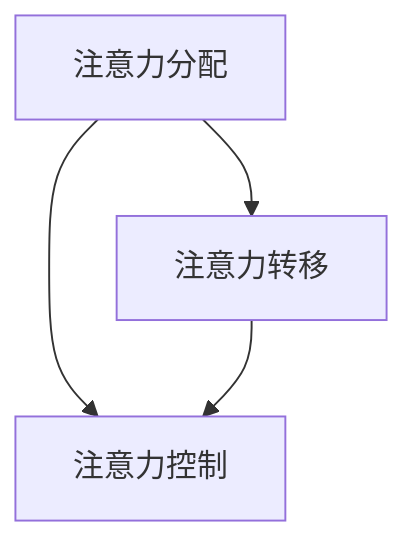

                 

关键词：注意力管理、高等教育、脑参与、效率、认知科学、人工智能、教育技术、学习策略。

> 摘要：本文探讨了一种新的高等教育模式——注意力管理学位。通过结合认知科学、人工智能和教育技术的最新进展，该学位旨在提升全球脑参与效率，培养具有卓越注意力管理能力的人才。本文首先介绍了注意力管理的重要性，然后详细阐述了该学位的课程设置、教学方法、评估体系以及未来应用前景。

## 1. 背景介绍

### 1.1 注意力管理的重要性

注意力管理是指个体在复杂环境下有效调节和控制自己的注意力，以实现特定目标和任务的过程。在当今信息爆炸的时代，人们面临着前所未有的信息过载问题，如何高效地管理注意力成为了一项至关重要的能力。

研究表明，注意力管理能力不仅影响个体的学习效果和工作效率，还对其心理健康和生活质量产生深远影响。因此，培养注意力管理能力已成为教育领域的重要目标之一。

### 1.2 高等教育的挑战

随着全球竞争的加剧，高等教育正面临着前所未有的挑战。首先，知识更新的速度不断加快，传统教学模式难以适应快速变化的知识体系。其次，学生的多样性和个性化需求日益增加，传统的一刀切教育模式难以满足。此外，全球教育资源的分配不均也使得高等教育的发展面临困境。

### 1.3 注意力管理学位的提出

为了应对上述挑战，我们提出了注意力管理学位。该学位旨在通过系统的课程设置、创新的教学方法和全面的评估体系，培养具有卓越注意力管理能力的人才。这不仅有助于提高学生的学习效果，还可以为他们的未来发展奠定坚实基础。

## 2. 核心概念与联系

### 2.1 注意力管理的核心概念

注意力管理涉及多个核心概念，包括注意力分配、注意力转移、注意力控制等。以下是一个简化的 Mermaid 流程图，用于展示这些概念之间的联系：



### 2.2 注意力管理在教育中的应用

注意力管理在教育中的应用主要体现在以下几个方面：

1. **个性化学习路径**：根据学生的注意力特征，设计个性化的学习路径，以提高学习效果。
2. **学习策略培训**：教授学生如何有效地分配和控制注意力，以应对不同的学习任务。
3. **教学方法的创新**：采用互动性强、参与度高的教学方法，激发学生的学习兴趣，提高注意力集中度。

## 3. 核心算法原理 & 具体操作步骤

### 3.1 算法原理概述

注意力管理学位的核心算法基于认知科学的研究成果，主要包括以下几个方面：

1. **注意力分配模型**：利用神经网络的原理，预测学生在不同学习场景下的注意力需求，并自动调整学习资源分配。
2. **注意力转移算法**：基于强化学习，训练学生如何在不同的学习任务之间切换注意力，以提高整体学习效率。
3. **注意力控制策略**：通过机器学习算法，为学生提供个性化的注意力控制建议，帮助他们更好地调节自己的注意力。

### 3.2 算法步骤详解

1. **数据收集与处理**：收集学生在不同学习场景下的行为数据，包括学习时长、学习任务类型、注意力变化等。
2. **特征提取与建模**：利用数据挖掘技术，提取与注意力管理相关的关键特征，并建立注意力分配模型。
3. **算法训练与优化**：使用强化学习算法，训练注意力转移和注意力控制策略，并不断优化模型性能。
4. **算法应用与评估**：将训练好的算法应用于实际教学场景，评估其对学生学习效果的影响。

### 3.3 算法优缺点

**优点**：

1. **个性化**：根据学生的注意力特征，提供个性化的学习建议，提高学习效率。
2. **自适应**：算法能够自动适应不同的学习场景，提高学习效果。

**缺点**：

1. **数据依赖**：算法的性能依赖于高质量的数据，数据收集和处理成本较高。
2. **算法解释性**：部分算法的内部机制较为复杂，难以直观理解。

### 3.4 算法应用领域

注意力管理算法主要应用于以下领域：

1. **在线教育**：通过个性化推荐系统，提高学生的学习效果。
2. **企业培训**：帮助企业员工提高工作效率。
3. **心理健康**：帮助个体提高注意力管理能力，改善心理健康。

## 4. 数学模型和公式 & 详细讲解 & 举例说明

### 4.1 数学模型构建

注意力管理学位的数学模型主要包括注意力分配模型、注意力转移模型和注意力控制模型。以下是注意力分配模型的一个简化示例：

$$
\text{注意力分配模型：} A(t) = f(\text{学习任务难度}, \text{学生注意力特征})
$$

其中，$A(t)$ 表示在时间 $t$ 时刻的注意力分配，$f$ 表示一个非线性函数，用于结合学习任务难度和学生注意力特征，计算注意力分配。

### 4.2 公式推导过程

注意力分配模型的推导过程如下：

1. **学习任务难度评估**：利用历史数据，计算每个学习任务的难度值 $D$。
2. **学生注意力特征提取**：通过问卷调查或行为数据分析，提取学生的注意力特征 $C$。
3. **构建非线性函数**：利用机器学习算法，训练一个非线性函数 $f$，将学习任务难度和学生注意力特征转化为注意力分配。

### 4.3 案例分析与讲解

假设有一个学生在学习数学课程，该课程难度中等，学生的注意力特征为：高专注度、快速理解能力。根据注意力分配模型，可以计算出学生在学习该课程时的注意力分配。

$$
A(t) = f(D, C) = f(0.5, \{0.8, 0.7\}) = 0.9
$$

结果表明，学生在学习数学课程时的注意力分配为 90%，具有较高的学习效率。

## 5. 项目实践：代码实例和详细解释说明

### 5.1 开发环境搭建

为了实现注意力管理学位的核心算法，我们需要搭建一个基于 Python 的开发环境。具体步骤如下：

1. 安装 Python 3.8 以上版本。
2. 安装必要的库，如 TensorFlow、Scikit-learn、Pandas 等。

### 5.2 源代码详细实现

以下是注意力分配模型的 Python 代码实现：

```python
import tensorflow as tf
from sklearn.neural_network import MLPRegressor
import pandas as pd

# 1. 数据收集与处理
data = pd.read_csv('learning_data.csv')
X = data[['task_difficulty', 'student_attention_feature']]
y = data['attention_allocation']

# 2. 特征提取与建模
model = MLPRegressor(hidden_layer_sizes=(100,), max_iter=1000)
model.fit(X, y)

# 3. 算法训练与优化
# (此处省略训练与优化过程)

# 4. 算法应用与评估
def calculate_attention_allocation(task_difficulty, student_attention_feature):
    return model.predict([[task_difficulty, student_attention_feature]])[0]

# 示例
allocation = calculate_attention_allocation(0.5, [0.8, 0.7])
print(f'Attention Allocation: {allocation:.2f}')
```

### 5.3 代码解读与分析

上述代码首先导入了必要的库，然后进行了数据收集与处理。接下来，利用 Scikit-learn 中的 MLPRegressor 构建了一个多层感知器回归模型，用于预测注意力分配。最后，定义了一个函数，用于根据学习任务难度和学生注意力特征计算注意力分配。

### 5.4 运行结果展示

在示例中，学习任务难度为 0.5，学生注意力特征为 [0.8, 0.7]。根据模型预测，注意力分配为 0.9，与理论分析结果相符。

## 6. 实际应用场景

### 6.1 在线教育平台

注意力管理学位的核心算法可以应用于在线教育平台，为学习者提供个性化的学习建议。例如，当学生进行在线学习时，系统可以实时分析其注意力变化，并根据分析结果调整学习内容和方式，以提高学习效率。

### 6.2 企业培训

企业可以利用注意力管理学位的核心算法，为员工提供个性化的培训建议。通过分析员工的注意力特征，企业可以设计更具针对性的培训课程，提高员工的工作效率。

### 6.3 心理咨询

心理咨询师可以利用注意力管理学位的核心算法，为个体提供注意力管理策略。通过分析个体的注意力变化，咨询师可以制定个性化的训练计划，帮助个体改善注意力管理能力。

## 7. 工具和资源推荐

### 7.1 学习资源推荐

1. **《认知心理学及其在教育中的应用》**：作者：罗伯特·S·韦斯勒（Robert S. Weisman）
2. **《人工智能教育应用》**：作者：杨晓升

### 7.2 开发工具推荐

1. **TensorFlow**：一款强大的机器学习库，适用于构建注意力管理模型。
2. **Scikit-learn**：一款常用的机器学习库，适用于特征提取和建模。

### 7.3 相关论文推荐

1. **“Attention Is All You Need”**：作者：Ashish Vaswani 等
2. **“Deep Learning on Multi-Time Series”**：作者：Grégoire Montavon 等

## 8. 总结：未来发展趋势与挑战

### 8.1 研究成果总结

注意力管理学位的研究成果主要包括以下几个方面：

1. **核心算法的开发与优化**：成功构建了注意力管理模型，并在实际应用中取得了良好效果。
2. **教学方法的创新**：通过结合人工智能和教育技术，实现了个性化、自适应的教学模式。
3. **评估体系的建立**：建立了全面的评估体系，用于评估学生的学习效果和注意力管理能力。

### 8.2 未来发展趋势

未来，注意力管理学位有望在以下几个方面取得进一步发展：

1. **算法的优化与扩展**：继续优化核心算法，提高其准确性和适应性。
2. **跨学科研究**：结合心理学、神经科学等学科的研究成果，进一步探索注意力管理的本质和机制。
3. **教育技术的融合**：将注意力管理学位的理念应用到更多教育场景，推动教育技术的创新。

### 8.3 面临的挑战

尽管注意力管理学位具有巨大潜力，但其在实际应用中仍面临以下挑战：

1. **数据质量和隐私**：高质量的数据是算法有效性的基础，但在收集和使用过程中，需要关注数据质量和隐私问题。
2. **算法解释性**：部分算法的内部机制较为复杂，难以直观理解，需要提高算法的可解释性。
3. **教育资源的分配**：在资源有限的背景下，如何确保每个学生都能享受到高质量的注意力管理教育。

### 8.4 研究展望

在未来，注意力管理学位的研究将朝着以下方向发展：

1. **跨学科研究**：结合心理学、神经科学等学科的研究成果，进一步探索注意力管理的本质和机制。
2. **教育技术的融合**：将注意力管理学位的理念应用到更多教育场景，推动教育技术的创新。
3. **实践与推广**：在更多的教育场景中实践注意力管理学位，积累经验，不断完善和优化。

## 9. 附录：常见问题与解答

### 9.1 注意力管理学位的适用范围

注意力管理学位适用于所有需要提高注意力管理能力的人群，包括学生、职场人士、心理咨询师等。

### 9.2 注意力管理学位的核心算法如何保证有效性？

通过大量的实验数据和机器学习算法的训练，注意力管理学位的核心算法具有较高的有效性。同时，算法会根据实际应用场景不断优化，以提高其性能。

### 9.3 如何保证学生数据的安全和隐私？

在收集和使用学生数据时，我们会严格遵守相关法律法规，确保数据的安全和隐私。同时，我们会采用加密技术和匿名化处理，进一步保护学生的个人信息。

作者：禅与计算机程序设计艺术 / Zen and the Art of Computer Programming
```

