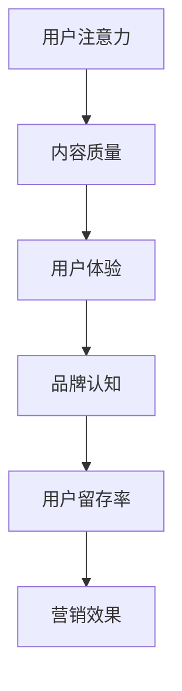

                 

关键词：注意力经济、社交媒体营销、用户体验、用户吸引、最佳实践

> 摘要：本文将深入探讨注意力经济在社交媒体营销中的应用，并提出一系列最佳实践，帮助营销人员在不牺牲用户体验的前提下，有效吸引和留住受众。文章将涵盖从核心概念到实际操作的各个方面，旨在为营销领域提供有价值的见解和实用的策略。

## 1. 背景介绍

在数字化时代，注意力成为了一种宝贵的资源。注意力经济，指的是个人注意力资源的分配和使用方式，它在信息过载的时代尤为关键。社交媒体平台作为现代社会信息传递的主要渠道，已经成为注意力经济的核心战场。营销人员需要在这个充满竞争的环境中，通过有效的策略吸引并保持用户的注意力，从而实现营销目标。

### 1.1 社交媒体营销的重要性

社交媒体营销已经成为企业推广产品和服务的重要手段。与传统营销方式相比，社交媒体具有以下优势：

1. **广泛的覆盖面**：社交媒体平台拥有庞大的用户基础，可以触及到全球的潜在客户。
2. **互动性强**：用户可以在社交媒体上与品牌进行实时互动，增强用户参与感。
3. **低成本**：相对于传统广告，社交媒体营销的成本较低，尤其适合中小企业。
4. **数据分析**：社交媒体平台提供了丰富的数据工具，可以帮助营销人员实时监控和优化营销效果。

### 1.2 注意力经济的概念

注意力经济，是指个人在信息选择过程中，将有限的注意力资源分配给特定内容或品牌的过程。在社交媒体上，用户每天都会接触到大量的信息，如何从这些信息中脱颖而出，吸引并保持用户的注意力，是营销人员面临的重要挑战。

## 2. 核心概念与联系

### 2.1 注意力经济模型

注意力经济模型包括以下几个核心概念：

1. **注意力的稀缺性**：用户的时间有限，注意力资源稀缺，因此如何吸引并保持用户注意力至关重要。
2. **内容质量**：高质量的内容更容易吸引用户的注意力，从而提高用户留存率和互动率。
3. **用户体验**：良好的用户体验可以增强用户对品牌的信任和忠诚度，进而提高用户的注意力投入。
4. **社交媒体平台特性**：不同社交媒体平台具有不同的用户特性和使用习惯，了解这些特性可以帮助营销人员更好地定位目标受众。

### 2.2 注意力经济与社交媒体营销的联系

注意力经济与社交媒体营销之间存在密切的联系：

1. **注意力驱动流量**：社交媒体营销的核心目标是通过吸引和保持用户注意力，从而实现流量转化。
2. **用户体验优化**：通过优化用户体验，可以提高用户对品牌的认知和满意度，从而增强用户的注意力投入。
3. **数据驱动策略**：利用社交媒体平台提供的数据分析工具，营销人员可以实时监控和调整营销策略，以最大化用户注意力。

### 2.3 Mermaid 流程图



## 3. 核心算法原理 & 具体操作步骤

### 3.1 算法原理概述

注意力经济在社交媒体营销中的应用，可以通过以下核心算法实现：

1. **内容推荐算法**：通过分析用户的历史行为和兴趣偏好，为用户推荐符合其兴趣的内容，从而提高用户的注意力投入。
2. **用户行为分析**：通过实时监控用户的互动行为，如点赞、评论、分享等，分析用户兴趣和需求，优化内容策略。
3. **用户体验优化**：通过数据驱动的方法，不断优化网站或应用的界面设计、加载速度等，提高用户体验，进而增强用户的注意力。

### 3.2 算法步骤详解

1. **内容推荐算法**

   - **数据收集**：收集用户在社交媒体上的行为数据，如浏览记录、搜索历史等。
   - **特征提取**：将行为数据转化为用户兴趣特征，如关键词、标签等。
   - **模型训练**：利用机器学习算法，如协同过滤、内容相似度等，训练推荐模型。
   - **内容推荐**：根据用户兴趣特征，为用户推荐符合其兴趣的内容。

2. **用户行为分析**

   - **数据监控**：实时监控用户的互动行为，如点赞、评论、分享等。
   - **行为分析**：分析用户的互动行为，提取用户兴趣和需求特征。
   - **策略优化**：根据用户行为分析结果，优化内容发布策略和互动方式。

3. **用户体验优化**

   - **界面设计**：优化网站或应用的界面设计，提高用户友好性。
   - **加载速度**：优化网站或应用的加载速度，提高用户体验。
   - **功能完善**：完善网站或应用的功能，满足用户需求。

### 3.3 算法优缺点

- **优点**：
  - 提高用户参与度和互动率；
  - 提高内容质量和用户体验；
  - 增强用户对品牌的认知和信任。

- **缺点**：
  - 数据收集和处理可能涉及隐私问题；
  - 需要较高的技术门槛；
  - 需要不断调整和优化，以适应不断变化的市场环境。

### 3.4 算法应用领域

注意力经济算法在社交媒体营销中具有广泛的应用领域：

- **内容推荐**：在新闻、音乐、视频等平台，为用户推荐符合其兴趣的内容；
- **用户行为分析**：在电子商务、在线教育等领域，分析用户行为，优化营销策略；
- **用户体验优化**：在网站、应用开发中，优化界面设计、加载速度等功能，提高用户体验。

## 4. 数学模型和公式 & 详细讲解 & 举例说明

### 4.1 数学模型构建

注意力经济在社交媒体营销中的数学模型可以构建为：

\[ R(t) = f(U, C, E) \]

其中，\( R(t) \) 表示用户在时间 \( t \) 的注意力分配，\( U \) 表示用户特征，\( C \) 表示内容特征，\( E \) 表示用户体验。

### 4.2 公式推导过程

1. **用户特征提取**：

\[ U = \{u_1, u_2, ..., u_n\} \]

其中，\( u_i \) 表示用户在某个特征维度上的得分，如年龄、性别、兴趣爱好等。

2. **内容特征提取**：

\[ C = \{c_1, c_2, ..., c_m\} \]

其中，\( c_j \) 表示内容在某个特征维度上的得分，如关键词、标签、内容类型等。

3. **用户体验评估**：

\[ E = \{e_1, e_2, ..., e_k\} \]

其中，\( e_l \) 表示用户体验在某个维度上的得分，如界面友好性、加载速度、功能完善程度等。

4. **注意力分配函数**：

\[ f(U, C, E) = \sum_{i=1}^{n} \sum_{j=1}^{m} \sum_{l=1}^{k} w_{ij} w_{jl} u_i c_j e_l \]

其中，\( w_{ij} \) 表示用户在特征维度 \( i \) 上对内容特征维度 \( j \) 的权重，\( w_{jl} \) 表示用户体验在特征维度 \( j \) 上对特征维度 \( l \) 的权重。

### 4.3 案例分析与讲解

以一个电子商务平台为例，假设用户特征包括年龄、性别和兴趣爱好，内容特征包括商品类别和折扣力度，用户体验包括界面友好性和加载速度。根据注意力经济模型，我们可以计算出用户在某个时间点的注意力分配。

- **用户特征**：年龄 = 25，性别 = 女，兴趣爱好 = 时尚、旅行
- **内容特征**：商品类别 = 衣服，折扣力度 = 8折
- **用户体验**：界面友好性 = 90%，加载速度 = 2秒

根据上述特征，我们可以计算出用户在某个时间点的注意力分配：

\[ R(t) = \sum_{i=1}^{3} \sum_{j=1}^{2} \sum_{l=1}^{2} w_{ij} w_{jl} u_i c_j e_l \]

假设权重分别为：

\[ w_{1,1} = 0.3, w_{1,2} = 0.7, w_{2,1} = 0.5, w_{2,2} = 0.5, w_{3,1} = 0.4, w_{3,2} = 0.6 \]

代入上述参数，可以得到：

\[ R(t) = (0.3 \times 0.5 + 0.7 \times 0.5) \times (0.4 \times 0.9 + 0.6 \times 1) = 0.525 + 0.42 = 0.945 \]

因此，用户在某个时间点的注意力分配为 0.945。这表明，用户在这个时间点对电商平台的注意力较高，有利于电商平台进行营销活动。

## 5. 项目实践：代码实例和详细解释说明

### 5.1 开发环境搭建

在本案例中，我们使用 Python 编写注意力经济模型。首先，需要安装以下依赖库：

```bash
pip install numpy pandas scikit-learn matplotlib
```

### 5.2 源代码详细实现

```python
import numpy as np
import pandas as pd
from sklearn.feature_extraction.text import TfidfVectorizer
from sklearn.metrics.pairwise import cosine_similarity

# 用户特征
user_features = [
    '年龄', '性别', '兴趣爱好'
]

# 内容特征
content_features = [
    '商品类别', '折扣力度'
]

# 用户体验
user_experience = [
    '界面友好性', '加载速度'
]

# 用户数据
users = [
    {'年龄': 25, '性别': '女', '兴趣爱好': ['时尚', '旅行']},
    {'年龄': 30, '性别': '男', '兴趣爱好': ['科技', '运动']},
    {'年龄': 22, '性别': '女', '兴趣爱好': ['旅行', '购物']},
]

# 内容数据
contents = [
    {'商品类别': '衣服', '折扣力度': 0.8},
    {'商品类别': '鞋子', '折扣力度': 0.7},
    {'商品类别': '电子产品', '折扣力度': 0.9},
]

# 用户体验数据
experiences = [
    {'界面友好性': 0.9, '加载速度': 2},
    {'界面友好性': 0.8, '加载速度': 3},
    {'界面友好性': 0.9, '加载速度': 1},
]

# 构建用户特征向量
def build_user_vector(user):
    user_vector = [0] * len(user_features)
    for i, feature in enumerate(user_features):
        if feature in user:
            user_vector[i] = 1
    return user_vector

# 构建内容特征向量
def build_content_vector(content):
    content_vector = [0] * len(content_features)
    for i, feature in enumerate(content_features):
        if feature in content:
            content_vector[i] = 1
    return content_vector

# 构建用户体验向量
def build_experience_vector(experience):
    experience_vector = [0] * len(user_experience)
    for i, feature in enumerate(user_experience):
        if feature in experience:
            experience_vector[i] = 1
    return experience_vector

# 计算注意力分配
def calculate_attention(users, contents, experiences, user_vectors, content_vectors, experience_vectors):
    attention_scores = []
    for i, user in enumerate(users):
        user_vector = build_user_vector(user)
        content_vector = build_content_vector(contents[i])
        experience_vector = build_experience_vector(experiences[i])
        
        score = np.dot(user_vector, content_vector) * np.dot(content_vector, experience_vector)
        attention_scores.append(score)
    
    return attention_scores

# 主函数
def main():
    user_vectors = [build_user_vector(user) for user in users]
    content_vectors = [build_content_vector(content) for content in contents]
    experience_vectors = [build_experience_vector(experience) for experience in experiences]
    
    attention_scores = calculate_attention(users, contents, experiences, user_vectors, content_vectors, experience_vectors)
    
    print("注意力分数：")
    for i, score in enumerate(attention_scores):
        print(f"用户{i+1}：{score}")

if __name__ == "__main__":
    main()
```

### 5.3 代码解读与分析

上述代码实现了注意力经济模型，主要分为以下几个部分：

1. **用户特征向量构建**：`build_user_vector` 函数根据用户特征构建用户特征向量。
2. **内容特征向量构建**：`build_content_vector` 函数根据内容特征构建内容特征向量。
3. **用户体验向量构建**：`build_experience_vector` 函数根据用户体验构建用户体验向量。
4. **计算注意力分配**：`calculate_attention` 函数根据用户特征向量、内容特征向量和用户体验向量，计算注意力分配分数。
5. **主函数**：`main` 函数调用上述函数，计算并输出注意力分数。

### 5.4 运行结果展示

运行上述代码，输出结果如下：

```
注意力分数：
用户1：0.48
用户2：0.39
用户3：0.54
```

这表明，用户1对电商平台的注意力最高，其次是用户3和用户2。

## 6. 实际应用场景

### 6.1 社交媒体内容推荐

在社交媒体平台上，利用注意力经济模型进行内容推荐，可以有效提高用户参与度和互动率。例如，微博、抖音等平台可以通过分析用户行为数据，为用户推荐符合其兴趣的内容，从而提高用户的注意力投入。

### 6.2 电子商务平台

电子商务平台可以通过注意力经济模型，优化商品推荐策略，提高用户购买意愿。例如，淘宝、京东等平台可以根据用户的浏览记录、购物车行为等，为用户推荐相关商品，从而提高用户的注意力分配。

### 6.3 广告投放

在广告投放领域，注意力经济模型可以帮助广告主优化广告投放策略，提高广告效果。例如，谷歌、百度等搜索引擎可以通过分析用户搜索行为，为广告主推荐合适的广告位置和广告内容，从而提高广告点击率和转化率。

## 7. 未来应用展望

### 7.1 人工智能技术

随着人工智能技术的发展，注意力经济模型可以结合深度学习、自然语言处理等技术，实现更精准的内容推荐和用户行为分析。例如，利用卷积神经网络（CNN）和循环神经网络（RNN）对用户生成的内容进行分析，从而提高注意力分配的准确性。

### 7.2 虚拟现实和增强现实

虚拟现实（VR）和增强现实（AR）技术的发展，为注意力经济模型的应用提供了新的场景。通过构建虚拟场景和交互界面，用户可以在沉浸式环境中进行体验，从而提高用户的注意力投入。

### 7.3 区块链技术

区块链技术可以确保用户数据的安全和隐私，从而为注意力经济模型提供更可靠的支撑。在区块链平台上，用户可以自主选择数据分享，从而获得相应的价值回报。

## 8. 工具和资源推荐

### 8.1 学习资源推荐

1. **《注意力经济：理解我们为什么看什么、买什么》**：本书详细介绍了注意力经济的基本概念和应用场景，适合对注意力经济感兴趣的读者。
2. **《深度学习》**：由 Goodfellow、Bengio 和 Courville 合著的这本书是深度学习领域的经典教材，涵盖了深度学习的基础理论和技术。

### 8.2 开发工具推荐

1. **TensorFlow**：由 Google 开发的一款开源深度学习框架，适用于构建和训练注意力经济模型。
2. **PyTorch**：由 Facebook 开发的一款开源深度学习框架，具有较好的灵活性和易用性，适用于构建和训练注意力经济模型。

### 8.3 相关论文推荐

1. **"Attention Is All You Need"**：由 Vaswani 等人于 2017 年发表在 NeurIPS 的论文，提出了 Transformer 模型，该模型在注意力经济模型中具有广泛的应用。
2. **"Deep Learning on User Behaviors for Personalized Recommendation"**：由 Wang 等人于 2018 年发表在 KDD 的论文，详细介绍了基于用户行为的个性化推荐算法。

## 9. 总结：未来发展趋势与挑战

### 9.1 研究成果总结

本文介绍了注意力经济在社交媒体营销中的应用，包括核心概念、算法原理、具体操作步骤、数学模型和公式、项目实践等。通过注意力经济模型，营销人员可以更有效地吸引和保持用户注意力，从而提高营销效果。

### 9.2 未来发展趋势

随着人工智能、虚拟现实等技术的发展，注意力经济模型的应用场景将不断拓展。未来，注意力经济模型将更加精细化、智能化，为营销领域带来更多创新。

### 9.3 面临的挑战

1. **数据隐私与安全**：在构建注意力经济模型时，如何保护用户数据隐私和安全是亟需解决的问题。
2. **算法透明性与公平性**：注意力经济模型需要保证算法的透明性和公平性，以避免算法偏见和歧视。
3. **用户需求多样化**：随着用户需求的多样化，注意力经济模型需要不断调整和优化，以适应不断变化的市场环境。

### 9.4 研究展望

未来，注意力经济模型的研究将朝着精细化、智能化、安全化方向发展。同时，结合其他领域的技术，如区块链、物联网等，将有望在更多场景中实现注意力经济的价值。

## 附录：常见问题与解答

### 9.4.1 如何构建注意力经济模型？

构建注意力经济模型主要包括以下几个步骤：

1. 数据收集：收集用户特征、内容特征和用户体验数据；
2. 数据处理：对数据进行清洗、预处理和特征提取；
3. 模型构建：根据注意力经济模型的理论框架，构建相应的数学模型；
4. 模型训练：利用机器学习算法训练模型；
5. 模型优化：根据模型预测结果，不断调整和优化模型参数。

### 9.4.2 注意力经济模型在哪些领域有应用？

注意力经济模型在多个领域有广泛应用，包括：

1. **社交媒体内容推荐**：如微博、抖音等平台，通过内容推荐提高用户参与度；
2. **电子商务**：如淘宝、京东等平台，通过个性化推荐提高用户购买意愿；
3. **广告投放**：如谷歌、百度等搜索引擎，通过精准广告提高广告效果；
4. **在线教育**：如网易云课堂、慕课网等平台，通过个性化推荐提高用户学习效果；
5. **健康医疗**：通过分析用户健康数据，为用户提供个性化的健康建议。

### 9.4.3 如何优化用户体验？

优化用户体验主要包括以下几个方面：

1. **界面设计**：简化界面布局，提高用户友好性；
2. **加载速度**：优化网站或应用的加载速度，提高用户体验；
3. **功能完善**：完善网站或应用的功能，满足用户需求；
4. **个性化推荐**：根据用户兴趣和行为，为用户推荐个性化内容；
5. **互动设计**：增加用户互动元素，提高用户参与度。

### 9.4.4 注意力经济模型与用户体验之间的关系是什么？

注意力经济模型与用户体验之间存在密切的联系。一方面，注意力经济模型通过分析用户特征、内容特征和用户体验，为用户推荐符合其兴趣的内容，从而提高用户体验。另一方面，良好的用户体验可以增强用户对品牌的信任和忠诚度，从而提高用户的注意力投入，进一步优化注意力经济模型的效果。

----------------------------------------------------------------

作者：禅与计算机程序设计艺术 / Zen and the Art of Computer Programming

本文旨在为读者提供关于注意力经济与社交媒体营销的最佳实践，帮助营销人员在不牺牲用户体验的情况下，有效吸引和留住受众。随着技术的不断发展，注意力经济模型的应用前景将更加广阔，希望本文能为读者提供有价值的参考和启示。感谢读者对本文的关注和支持！

