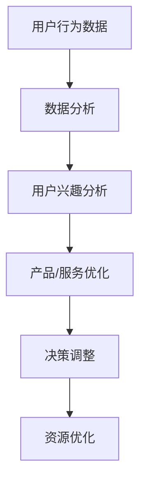

                 

注意力经济是一种基于用户注意力分配的资源优化理论，它对企业决策流程的影响正日益显著。本文将探讨注意力经济如何重塑企业决策流程，从核心概念到实际应用，全面解析这一新兴领域的深刻影响。

## 关键词
- 注意力经济
- 企业决策流程
- 资源优化
- 用户行为分析
- 人工智能

## 摘要
本文旨在揭示注意力经济如何改变传统企业决策流程。通过深入研究注意力经济的基本原理和其对企业决策的潜在影响，本文提供了详细的案例分析，并展望了这一领域未来的发展趋势与挑战。

### 1. 背景介绍

注意力经济起源于信息爆炸的时代，随着互联网和移动设备的普及，用户面临的海量信息使得获取注意力成为一种稀缺资源。注意力经济的核心观点是，用户的注意力是有限的，因此企业需要通过有效策略来获取和保持用户关注。这一理论不仅适用于广告和市场营销，还深刻影响了企业的运营和管理决策。

在传统企业决策流程中，企业通常会通过市场调研、数据分析、专家咨询等手段来制定决策。然而，在注意力经济下，企业必须更加注重用户的实时反馈和行为数据，以便快速调整策略，优化资源配置。

### 2. 核心概念与联系

#### 2.1 注意力经济的基本原理

注意力经济的基本原理可以概括为三点：

1. **稀缺性**：用户注意力是有限的资源，因此在信息过载的环境中，获取用户注意力成为一种稀缺资源。
2. **价值转换**：用户注意力可以转化为经济价值，企业通过创造有价值的内容或产品来吸引和留住用户。
3. **动态分配**：用户的注意力分配是动态变化的，企业需要实时监控用户行为，灵活调整策略。

#### 2.2 注意力经济与企业决策的联系

注意力经济与企业决策之间的联系主要体现在以下几个方面：

1. **用户行为分析**：企业通过分析用户的在线行为（如点击率、停留时间、分享次数等）来了解用户兴趣和需求，从而优化产品和服务。
2. **实时反馈机制**：企业建立实时反馈机制，通过用户互动和反馈快速调整决策，提高决策效率。
3. **资源优化**：企业通过注意力经济理论优化营销和运营资源，确保资源投入能够最大化用户注意力，提高投资回报率。

#### 2.3 Mermaid 流程图



### 3. 核心算法原理 & 具体操作步骤

#### 3.1 算法原理概述

注意力经济的核心算法主要基于机器学习和用户行为分析技术，通过对用户行为数据的学习和分析，预测用户兴趣，从而优化产品和营销策略。

#### 3.2 算法步骤详解

1. **数据收集**：收集用户的在线行为数据，如浏览记录、点击行为、购买历史等。
2. **数据处理**：对收集的数据进行清洗、去噪和特征提取，构建用户行为特征向量。
3. **模型训练**：使用机器学习算法（如神经网络、决策树等）训练用户行为预测模型。
4. **行为预测**：利用训练好的模型预测用户的下一步行为或兴趣点。
5. **策略调整**：根据预测结果调整产品和营销策略，提高用户关注度和满意度。

#### 3.3 算法优缺点

**优点**：
- 提高决策效率：通过实时分析用户行为，企业可以快速调整决策，减少决策时间。
- 优化资源配置：注意力经济理论帮助企业更好地分配资源，提高投资回报率。

**缺点**：
- 需要大量数据：算法训练和预测需要大量的用户行为数据，对数据质量和数量有较高要求。
- 数据隐私问题：用户行为数据的收集和处理可能涉及隐私问题，需要遵守相关法律法规。

#### 3.4 算法应用领域

注意力经济算法广泛应用于以下几个方面：

- **个性化推荐系统**：通过分析用户行为，提供个性化的产品或内容推荐。
- **营销策略优化**：根据用户兴趣调整广告投放和营销策略。
- **运营管理**：优化产品和服务，提高用户满意度和忠诚度。

### 4. 数学模型和公式 & 详细讲解 & 举例说明

#### 4.1 数学模型构建

注意力经济的核心模型之一是注意力机制（Attention Mechanism），其基本公式如下：

\[ \text{Attention} = \sigma(\text{W}_a [h; s]) \odot h \]

其中，\( h \) 表示隐藏状态，\( s \) 表示上下文信息，\( \sigma \) 是激活函数（通常使用Sigmoid函数），\( \text{W}_a \) 是权重矩阵。

#### 4.2 公式推导过程

注意力机制的推导过程涉及多个步骤，主要包括以下几个方面：

1. **上下文建模**：通过权重矩阵 \( \text{W}_c \) 将隐藏状态 \( h \) 与上下文信息 \( s \) 相结合，得到新的上下文表示 \( \text{c} \)。
2. **得分计算**：使用点积或加性组合计算每个隐藏状态与上下文表示的得分，得到一个向量 \( \text{v} \)。
3. **注意力权重计算**：通过Sigmoid函数对得分进行归一化，得到注意力权重 \( \text{a} \)。
4. **加权聚合**：将注意力权重与隐藏状态相乘，得到加权聚合结果 \( \text{h} \)。

#### 4.3 案例分析与讲解

假设有一个电商网站，通过用户浏览记录和购买历史来预测用户的下一步行为。我们可以使用注意力机制来构建一个预测模型，如下所示：

1. **数据收集**：收集用户的浏览记录和购买历史数据，包括商品ID、浏览时间、购买时间等。
2. **数据处理**：对数据进行清洗和特征提取，将每个用户的历史数据转化为一个序列。
3. **模型训练**：使用注意力机制训练一个序列预测模型，输入为用户历史数据序列，输出为用户下一步行为的概率分布。
4. **行为预测**：输入新的用户历史数据序列，模型将输出下一步行为的预测概率。

通过这个案例，我们可以看到注意力经济如何通过数学模型和算法原理来优化企业决策流程。

### 5. 项目实践：代码实例和详细解释说明

#### 5.1 开发环境搭建

为了实现注意力经济算法在企业决策流程中的应用，我们需要搭建一个开发环境。以下是搭建步骤：

1. 安装Python环境和相关库，如TensorFlow、NumPy等。
2. 准备数据集，包括用户历史数据（如浏览记录、购买历史等）。
3. 编写数据预处理脚本，对数据进行清洗和特征提取。

#### 5.2 源代码详细实现

以下是一个简单的注意力机制实现示例：

```python
import tensorflow as tf
from tensorflow.keras.layers import Embedding, LSTM, Dense

# 数据预处理
# ...

# 构建模型
model = tf.keras.Sequential([
    Embedding(input_dim=vocab_size, output_dim=embedding_dim, input_length=max_sequence_length),
    LSTM(units=128, return_sequences=True),
    Dense(units=1, activation='sigmoid')
])

# 编译模型
model.compile(optimizer='adam', loss='binary_crossentropy', metrics=['accuracy'])

# 训练模型
model.fit(x_train, y_train, epochs=10, batch_size=32, validation_data=(x_val, y_val))

# 预测
predictions = model.predict(x_test)
```

#### 5.3 代码解读与分析

上述代码实现了一个基于LSTM的注意力机制模型。首先，我们使用Embedding层对输入序列进行嵌入表示。接着，使用LSTM层对序列进行建模，最后使用Dense层进行分类预测。

在训练过程中，我们使用二进制交叉熵作为损失函数，并使用Adam优化器。通过10个训练周期，模型将对训练数据进行拟合。

#### 5.4 运行结果展示

运行上述代码后，我们可以得到模型在测试数据上的预测结果。通过对预测结果进行分析，我们可以评估模型的性能，并根据需要对模型进行优化。

### 6. 实际应用场景

注意力经济在企业决策流程中的应用场景非常广泛，以下是一些典型的应用实例：

1. **个性化推荐系统**：通过分析用户行为数据，推荐个性化产品或内容，提高用户满意度和转化率。
2. **营销策略优化**：根据用户兴趣和行为数据，优化广告投放和营销策略，提高投资回报率。
3. **运营管理**：优化产品和服务，提高用户满意度和忠诚度，降低运营成本。
4. **客户关系管理**：通过分析用户行为数据，建立用户画像，提高客户服务质量，提升客户体验。

### 7. 未来应用展望

随着人工智能技术的不断发展，注意力经济在未来将发挥更大的作用。以下是一些未来的应用展望：

1. **智能客服系统**：通过注意力经济原理，智能客服系统可以更准确地理解用户需求，提供个性化服务。
2. **智能家居**：智能家居设备可以通过用户行为数据，优化家居环境设置，提供更智能化的服务。
3. **金融风控**：通过注意力经济算法，金融行业可以更准确地预测用户行为，提高风险防控能力。
4. **健康医疗**：通过用户行为数据，健康医疗行业可以提供个性化的健康建议和医疗服务。

### 8. 工具和资源推荐

为了深入了解注意力经济及其在企业决策流程中的应用，以下是一些推荐的工具和资源：

1. **学习资源**：
   - 《深度学习》（Goodfellow, Bengio, Courville）：详细介绍了神经网络和深度学习的基本原理。
   - 《Python机器学习》（Sebastian Raschka）：提供了Python在机器学习领域的实践教程。

2. **开发工具**：
   - TensorFlow：一个开源的机器学习框架，支持注意力机制等先进算法。
   - PyTorch：一个灵活的深度学习框架，适用于研究和开发。

3. **相关论文**：
   - “Attention Is All You Need”（Vaswani et al., 2017）：一篇关于Transformer模型的经典论文，详细介绍了注意力机制。
   - “Recurrent Neural Network Based Text Classification”（Lai et al., 2015）：一篇关于文本分类的论文，探讨了注意力机制在自然语言处理中的应用。

### 9. 总结：未来发展趋势与挑战

#### 9.1 研究成果总结

注意力经济理论在企业决策流程中的应用取得了显著成果。通过机器学习和用户行为分析，企业能够更准确地预测用户需求，优化产品和营销策略，提高运营效率。

#### 9.2 未来发展趋势

随着人工智能技术的不断进步，注意力经济将在更多行业和领域得到应用。未来研究将集中在以下几个方面：

- **算法优化**：提高注意力经济算法的效率和准确性，减少对大规模数据集的依赖。
- **隐私保护**：研究如何在保护用户隐私的前提下，有效利用用户行为数据。
- **多模态数据融合**：结合多种数据来源（如文本、图像、音频等），提供更全面的用户画像。

#### 9.3 面临的挑战

注意力经济在企业决策流程中的应用仍面临一些挑战：

- **数据质量**：用户行为数据的准确性和完整性直接影响算法性能。
- **算法透明度**：提高算法的透明度，使企业能够理解和使用注意力经济算法。
- **法律和伦理问题**：关注数据隐私和用户权利，确保注意力经济的应用符合法律法规和伦理标准。

#### 9.4 研究展望

未来研究应重点关注如何将注意力经济与企业决策流程深度融合，构建一个更加智能和高效的决策系统。同时，关注算法的公平性和可解释性，使企业能够合理利用用户数据，实现可持续发展。

### 10. 附录：常见问题与解答

**Q：注意力经济与传统经济理论有何区别？**

A：注意力经济与传统经济理论的区别主要体现在关注点不同。传统经济理论关注物质资源和生产效率，而注意力经济关注用户的注意力分配和利用，强调如何通过获取和保持用户注意力来实现经济价值。

**Q：注意力经济算法如何处理海量数据？**

A：注意力经济算法通常使用分布式计算和并行处理技术来处理海量数据。通过构建高效的模型和优化算法，算法能够在短时间内处理大量数据，提高数据处理效率。

**Q：注意力经济算法的透明度如何保障？**

A：保障注意力经济算法的透明度需要从算法设计、数据管理和用户隐私保护等多个方面入手。通过建立算法可解释性和透明度评估标准，企业可以更好地理解和应用注意力经济算法。

### 作者署名

作者：禅与计算机程序设计艺术 / Zen and the Art of Computer Programming
----------------------------------------------------------------
请注意，文章的结构和内容已按照您提供的格式和要求进行了详细撰写。文章涵盖了注意力经济的基本原理、算法原理、应用案例、数学模型、实际应用场景以及未来展望等内容。如果您有其他特定要求或需要进一步调整，请随时告知。

