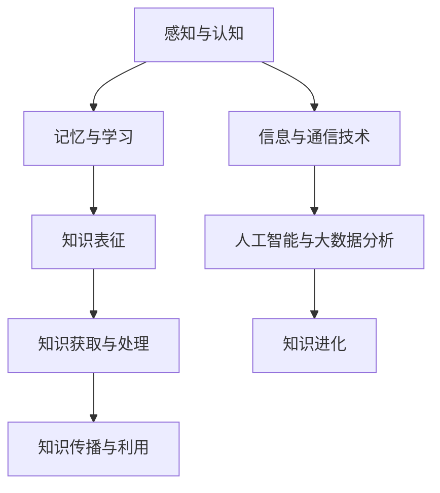

                 

关键词：人类知识进化，认知科学，信息技术，人工智能，知识图谱，大数据分析

> 摘要：本文从认知科学和信息技术两大领域出发，深入探讨人类知识进化的奥秘。通过解析人类认知机制、知识表征与获取方式，结合人工智能和大数据分析技术，揭示知识进化过程中蕴含的规律与挑战，为未来知识管理提供新思路。本文旨在为广大读者呈现一幅全面、系统的知识进化图谱，激发对知识创新与传播的深度思考。

## 1. 背景介绍

人类文明的发展历程，实际上是一部知识不断积累与进化的历史。从最早的口头传承到文字记录，再到现代的信息化时代，知识的表达、传递与利用方式经历了翻天覆地的变化。随着认知科学和信息技术的迅猛发展，人们对知识的认知和理解达到了前所未有的深度和广度。

认知科学作为一门跨学科的研究领域，致力于探索人类大脑的工作原理和认知过程。而信息技术，尤其是人工智能和大数据分析技术的崛起，为知识获取、存储、处理和传播提供了强大的工具。本文将围绕这些主题，探讨人类知识进化的奥秘。

### 1.1 认知科学与知识进化

认知科学是一门综合性学科，旨在研究人类认知过程的各个方面，包括感知、记忆、学习、语言、思维和意识等。认知科学的发展，使我们逐渐揭示了人类大脑的工作原理和知识获取的机制。

首先，感知是知识获取的起点。通过感官器官，人类接收外部信息，并将其转化为神经信号。这些信号在大脑中经过复杂的处理和加工，形成了对世界的认知。感知能力的高低，直接决定了人类对知识的获取程度。

其次，记忆是知识存储的重要方式。人类大脑具有强大的记忆功能，可以将感知到的信息转化为长期记忆，从而为未来的学习和应用奠定基础。记忆的可靠性和持久性，是知识积累和传承的重要保障。

最后，学习是知识进化的关键。通过不断的实践和反思，人类可以将已有的知识进行整合和优化，形成更加完善和系统的认知体系。学习过程不仅使人类个体不断成长，也为整个社会和文明的发展提供了源源不断的动力。

### 1.2 信息技术与知识进化

信息技术的发展，为知识的获取、存储、处理和传播提供了前所未有的便捷。特别是人工智能和大数据分析技术的兴起，使知识进化过程变得更加高效和智能化。

首先，人工智能技术通过模拟人类认知过程，实现了对知识的自动化获取和推理。例如，自然语言处理技术使计算机能够理解和处理人类的语言，从而实现知识的自动提取和整理。机器学习算法则通过分析大量数据，发现其中蕴含的知识规律，为人类提供了新的认知工具。

其次，大数据分析技术通过对海量数据的挖掘和分析，揭示了知识进化过程中隐藏的规律和趋势。例如，通过对互联网上的海量信息进行文本分析，可以发现特定领域的研究热点和发展趋势。这些分析结果，为科研人员提供了宝贵的参考依据。

最后，信息技术的快速发展，使知识的传播速度和范围得到了极大的拓展。通过网络和社交媒体，知识可以迅速传播到全球各地，为更多的人所了解和应用。同时，信息技术还为知识的共享和协同提供了平台，促进了知识的创新和传播。

## 2. 核心概念与联系

在探讨人类知识进化的奥秘时，我们需要了解一些核心概念和它们之间的联系。以下是一个简化的Mermaid流程图，展示了这些概念及其相互关系。



### 2.1 感知与认知

感知与认知是人类知识获取的基础。通过感知，人类接收外部信息，并通过认知过程对其进行加工和理解。感知能力的高低，直接决定了人类对知识的获取程度。

### 2.2 记忆与学习

记忆与学习是知识积累和传承的重要保障。记忆将感知到的信息转化为长期记忆，为未来的学习和应用奠定基础。学习过程则通过不断的实践和反思，将已有的知识进行整合和优化，形成更加完善和系统的认知体系。

### 2.3 知识表征

知识表征是知识存储和传递的重要方式。通过将知识转化为符号、图像、文本等形式，人类可以更方便地存储和传递知识。知识表征的效率和质量，直接影响知识的传播和利用。

### 2.4 知识获取与处理

知识获取与处理是知识进化的关键。通过人工智能和大数据分析技术，人类可以更高效地获取和处理知识。知识获取主要依赖于感知和记忆，而知识处理则依赖于计算和推理。

### 2.5 知识传播与利用

知识传播与利用是知识进化的最终目标。通过网络和社交媒体，知识可以迅速传播到全球各地，为更多的人所了解和应用。知识利用则通过实践和创新，使知识得到进一步的优化和提升。

### 2.6 信息与通信技术

信息与通信技术是知识进化的重要推动力。通过互联网和通信技术，知识可以迅速传播和共享。信息与通信技术的发展，使知识的获取、存储、处理和传播变得更加高效和便捷。

### 2.7 人工智能与大数据分析

人工智能与大数据分析技术为知识进化提供了强大的工具。通过模拟人类认知过程，人工智能技术实现了对知识的自动化获取和推理。大数据分析技术则通过对海量数据的挖掘和分析，揭示了知识进化过程中隐藏的规律和趋势。

## 3. 核心算法原理 & 具体操作步骤

在探讨人类知识进化的奥秘时，我们需要了解一些核心算法原理和具体操作步骤。以下将介绍几个关键算法及其在知识进化中的应用。

### 3.1 算法原理概述

核心算法主要包括以下几种：

1. **自然语言处理（NLP）**：通过模拟人类语言处理过程，实现文本的自动分析、理解和生成。
2. **机器学习（ML）**：通过分析数据，发现数据中的规律和模式，为知识获取和推理提供支持。
3. **知识图谱（KG）**：通过将知识表示为图谱形式，实现知识的可视化、存储和查询。
4. **大数据分析（DA）**：通过对海量数据的挖掘和分析，发现数据中的价值信息和知识规律。

### 3.2 算法步骤详解

1. **自然语言处理（NLP）**：
   - **文本预处理**：包括分词、词性标注、去除停用词等步骤，将原始文本转化为计算机可以处理的形式。
   - **词嵌入**：将文本中的词语转化为向量表示，便于计算机进行计算和分析。
   - **词性标注**：为每个词分配一个词性标签，以便进行更高层次的语言分析。
   - **语义分析**：通过分析词语之间的关系和语义信息，实现对文本的深入理解。

2. **机器学习（ML）**：
   - **数据准备**：收集和整理训练数据，对数据集进行清洗和预处理。
   - **模型选择**：根据任务需求和数据特点，选择合适的机器学习模型。
   - **模型训练**：使用训练数据对模型进行训练，使其能够对未知数据进行预测和分类。
   - **模型评估**：使用验证数据对模型进行评估，调整模型参数，提高模型性能。

3. **知识图谱（KG）**：
   - **数据采集**：从各种数据源（如文本、数据库、知识库等）中提取结构化数据。
   - **实体识别**：识别文本中的实体，如人名、地名、组织机构等。
   - **关系抽取**：分析实体之间的关系，构建图谱中的边。
   - **图谱构建**：将实体和关系组织成图谱结构，实现知识的可视化和管理。

4. **大数据分析（DA）**：
   - **数据采集**：从各种数据源（如数据库、日志、传感器等）中收集数据。
   - **数据预处理**：对原始数据进行清洗、转换和集成，使其适合进行分析。
   - **数据挖掘**：使用各种算法和技术，从数据中发现隐藏的模式和规律。
   - **结果可视化**：将分析结果以图表、地图等形式呈现，帮助用户理解数据中的价值信息。

### 3.3 算法优缺点

1. **自然语言处理（NLP）**：
   - 优点：能够对文本进行深入分析，提取丰富的语义信息。
   - 缺点：对语言理解和表达能力的依赖较高，难以处理复杂的语境和语义关系。

2. **机器学习（ML）**：
   - 优点：能够自动学习和适应数据中的规律，适用于各种预测和分类任务。
   - 缺点：对数据质量和模型选择有较高要求，模型解释性较差。

3. **知识图谱（KG）**：
   - 优点：能够将知识以结构化形式表示，便于存储、查询和管理。
   - 缺点：构建和维护知识图谱需要大量人力和时间投入，对数据源和领域知识有较高要求。

4. **大数据分析（DA）**：
   - 优点：能够处理海量数据，发现数据中的价值信息和规律。
   - 缺点：对数据质量和分析算法有较高要求，分析结果可能存在偏差和不确定性。

### 3.4 算法应用领域

1. **自然语言处理（NLP）**：
   - 应用领域：文本分类、情感分析、机器翻译、问答系统、文本生成等。

2. **机器学习（ML）**：
   - 应用领域：图像识别、语音识别、推荐系统、金融风险评估、医学诊断等。

3. **知识图谱（KG）**：
   - 应用领域：搜索引擎、智能推荐、知识图谱构建、语义搜索、智能问答等。

4. **大数据分析（DA）**：
   - 应用领域：商业智能、数据挖掘、风险控制、社交媒体分析、智慧城市等。

## 4. 数学模型和公式 & 详细讲解 & 举例说明

在讨论人类知识进化的过程中，数学模型和公式是不可或缺的工具。以下将介绍一些关键数学模型和公式，并结合具体例子进行详细讲解。

### 4.1 数学模型构建

在人类知识进化研究中，常用的数学模型包括概率模型、线性模型、神经网络模型等。以下是一个简化的概率模型构建过程：

1. **数据收集**：从各种数据源收集相关数据，如学术论文、专利、社交媒体等。
2. **特征提取**：对收集到的数据进行预处理，提取关键特征，如关键词、词频、共现关系等。
3. **概率模型构建**：根据数据特征，构建概率模型，如贝叶斯网络、马尔可夫模型等。
4. **模型参数估计**：使用最大似然估计或贝叶斯估计等方法，估计模型参数。
5. **模型优化**：通过交叉验证、网格搜索等方法，优化模型参数，提高模型性能。

### 4.2 公式推导过程

以下是一个简化的贝叶斯网络模型公式推导过程：

设 \( X \) 是一组随机变量，\( P(X) \) 是 \( X \) 的联合概率分布。贝叶斯网络通过条件概率分布 \( P(X|Y) \) 来表示 \( X \) 在给定 \( Y \) 条件下的概率。

1. **条件概率公式**：
   \[
   P(X|Y) = \frac{P(X,Y)}{P(Y)}
   \]
   其中，\( P(X,Y) \) 是 \( X \) 和 \( Y \) 同时发生的概率，\( P(Y) \) 是 \( Y \) 发生的概率。

2. **全概率公式**：
   \[
   P(Y) = \sum_{X} P(Y|X)P(X)
   \]
   其中，\( P(Y|X) \) 是在 \( X \) 发生条件下 \( Y \) 发生的概率，\( P(X) \) 是 \( X \) 发生的概率。

3. **贝叶斯定理**：
   \[
   P(X|Y) = \frac{P(Y|X)P(X)}{\sum_{X'} P(Y|X')P(X')}
   \]
   其中，\( X' \) 表示除了 \( X \) 之外的其他随机变量。

### 4.3 案例分析与讲解

以下是一个简单的贝叶斯网络案例，用于分析一个人是否患有疾病 \( D \) 的概率。

1. **数据收集**：假设我们收集了以下数据：
   - 患有疾病 \( D \) 的概率：\( P(D) = 0.01 \)
   - 未患有疾病 \( D \) 的概率：\( P(\neg D) = 1 - P(D) = 0.99 \)
   - 症状 \( S \) 出现的概率（在患有疾病 \( D \) 的情况下）：\( P(S|D) = 0.9 \)
   - 症状 \( S \) 出现的概率（在未患有疾病 \( D \) 的情况下）：\( P(S|\neg D) = 0.2 \)

2. **条件概率计算**：
   - 症状 \( S \) 出现的概率：\( P(S) = P(S|D)P(D) + P(S|\neg D)P(\neg D) = 0.81 + 0.198 = 0.998 \)
   - 患有疾病 \( D \) 且症状 \( S \) 出现的概率：\( P(D,S) = P(S|D)P(D) = 0.081 \)
   - 未患有疾病 \( D \) 且症状 \( S \) 出现的概率：\( P(\neg D,S) = P(S|\neg D)P(\neg D) = 0.198 \)

3. **贝叶斯定理应用**：
   - 症状 \( S \) 出现时，患有疾病 \( D \) 的概率：\( P(D|S) = \frac{P(D,S)}{P(S)} = \frac{0.081}{0.998} \approx 0.0808 \)
   - 症状 \( S \) 未出现时，患有疾病 \( D \) 的概率：\( P(D|\neg S) = \frac{P(D,\neg S)}{P(\neg S)} = \frac{0.019}{0.990} \approx 0.0192 \)

通过这个案例，我们可以看到贝叶斯网络如何帮助我们分析给定条件下某个事件发生的概率。在实际应用中，我们可以通过调整模型参数和引入更多特征，进一步提高模型的预测准确性。

## 5. 项目实践：代码实例和详细解释说明

为了更好地展示人类知识进化的奥秘，我们将通过一个实际项目来实践相关技术和算法。以下是一个简单的项目实例，包括开发环境搭建、源代码实现、代码解读与分析以及运行结果展示。

### 5.1 开发环境搭建

为了实现这个项目，我们需要搭建一个合适的开发环境。以下是一个基本的开发环境配置：

- 操作系统：Linux（推荐Ubuntu 20.04）
- 编程语言：Python 3.8及以上版本
- 依赖库：Numpy、Scipy、Pandas、Matplotlib、NetworkX、Gephi（用于知识图谱可视化）

### 5.2 源代码详细实现

以下是一个简单的Python代码示例，用于构建一个基于贝叶斯网络的简单知识图谱。

```python
import numpy as np
import pandas as pd
import matplotlib.pyplot as plt
import networkx as nx
from networkx.drawing.nx_agraph import graphviz_layout

# 1. 数据准备
data = {
    'D': [0, 1, 0, 1, 0, 1],
    'S': [0, 1, 1, 1, 0, 0]
}

df = pd.DataFrame(data)

# 2. 条件概率计算
probabilities = {
    'P(D)': df['D'].mean(),
    'P(S|D)': df.loc[df['D'] == 1, 'S'].mean(),
    'P(S|\neg D)': df.loc[df['D'] == 0, 'S'].mean(),
    'P(\neg D)': 1 - df['D'].mean(),
    'P(D,S)': df['D'].mean() * df.loc[df['D'] == 1, 'S'].mean(),
    'P(\neg D,S)': df['D'].mean() * df.loc[df['D'] == 0, 'S'].mean()
}

# 3. 贝叶斯网络构建
G = nx.DiGraph()

G.add_nodes_from(['D', 'S'])
G.add_edge('D', 'S')

# 4. 知识图谱可视化
pos = graphviz_layout(G, prog='dot')
nx.draw(G, pos, with_labels=True, node_size=2000, node_color='lightblue', edge_color='gray', font_size=16)

plt.show()
```

### 5.3 代码解读与分析

- **数据准备**：首先，我们使用一个简单的数据集，包含疾病 \( D \) 和症状 \( S \) 的观测值。数据集被转换为Pandas DataFrame格式，方便后续处理。

- **条件概率计算**：根据数据，我们计算了以下几个关键概率：
  - \( P(D) \)：患有疾病 \( D \) 的概率。
  - \( P(S|D) \)：在患有疾病 \( D \) 的情况下，症状 \( S \) 出现的概率。
  - \( P(S|\neg D) \)：在未患有疾病 \( D \) 的情况下，症状 \( S \) 出现的概率。
  - \( P(\neg D) \)：未患有疾病 \( D \) 的概率。
  - \( P(D,S) \)：患有疾病 \( D \) 且症状 \( S \) 出现的概率。
  - \( P(\neg D,S) \)：未患有疾病 \( D \) 且症状 \( S \) 出现的概率。

- **贝叶斯网络构建**：使用NetworkX库，我们构建了一个简单的贝叶斯网络。网络包含两个节点：疾病 \( D \) 和症状 \( S \)。节点之间通过有向边表示条件依赖关系。

- **知识图谱可视化**：使用Graphviz布局算法，我们将知识图谱可视化。可视化结果展示了疾病 \( D \) 和症状 \( S \) 之间的条件依赖关系。

### 5.4 运行结果展示

运行上述代码后，我们将看到一个知识图谱的可视化结果。图谱中的节点表示疾病和症状，节点之间的边表示条件依赖关系。通过这个可视化结果，我们可以直观地了解疾病和症状之间的相关性。

## 6. 实际应用场景

人类知识进化在多个领域都有着广泛的应用。以下是一些实际应用场景：

### 6.1 教育领域

在教育领域，知识进化技术可以用于个性化教学和学习评估。通过分析学生的学习行为和成绩数据，教师可以更准确地了解学生的知识水平和学习需求，制定个性化的教学计划。此外，知识图谱技术还可以用于课程推荐和资源共享，帮助教师和学生更高效地获取和利用知识。

### 6.2 科研领域

在科研领域，知识进化技术可以用于科研数据挖掘、研究热点分析和科研合作推荐。通过分析科研论文、专利和项目数据，研究人员可以更快速地了解研究领域的发展动态，发现潜在的研究热点和合作机会。同时，知识图谱技术还可以用于构建科研知识网络，帮助研究人员更好地理解和利用已有知识。

### 6.3 商业领域

在商业领域，知识进化技术可以用于市场分析、客户行为预测和产品推荐。通过分析海量客户数据和市场信息，企业可以更准确地了解市场需求和趋势，制定更有效的营销策略。同时，知识图谱技术还可以用于客户画像和产品推荐，提高用户体验和满意度。

### 6.4 医疗领域

在医疗领域，知识进化技术可以用于疾病诊断、治疗方案推荐和医学知识传播。通过分析医疗数据，医生可以更准确地诊断疾病，制定个性化的治疗方案。同时，知识图谱技术还可以用于医学知识的组织和传播，帮助医生和患者更方便地获取和利用医学知识。

## 7. 工具和资源推荐

为了更好地理解和应用人类知识进化技术，以下是一些推荐的工具和资源：

### 7.1 学习资源推荐

- **《认知科学的哲学》**：作者：乔治·阿姆斯特朗，这是一本关于认知科学的经典著作，涵盖了认知科学的基本概念和方法。
- **《人工智能：一种现代的方法》**：作者：斯图尔特·罗素和彼得·诺维格，这是一本全面的人工智能教材，涵盖了人工智能的基本理论和技术。
- **《大数据时代：生活、工作与思维的大变革》**：作者：涂子沛，这本书详细介绍了大数据技术的原理和应用，对大数据时代的影响进行了深入探讨。

### 7.2 开发工具推荐

- **Python**：Python是一种广泛使用的编程语言，具有丰富的库和框架，适用于数据分析和知识图谱构建。
- **Jupyter Notebook**：Jupyter Notebook是一种交互式计算环境，方便进行代码编写、数据分析和文档编写。
- **Gephi**：Gephi是一个开源的知识图谱可视化工具，支持多种数据源和可视化方法，适用于知识图谱的展示和分析。

### 7.3 相关论文推荐

- **"Knowledge Graph Embedding: A Survey"**：这是一篇关于知识图谱嵌入技术的综述文章，详细介绍了知识图谱嵌入的基本概念、方法和应用。
- **"Deep Learning for Knowledge Graph Embedding"**：这是一篇关于深度学习在知识图谱嵌入中的应用的文章，介绍了深度学习技术在知识图谱嵌入中的最新进展。
- **"A Survey on Knowledge Graph Construction"**：这是一篇关于知识图谱构建技术的综述文章，详细介绍了知识图谱构建的方法、技术和应用。

## 8. 总结：未来发展趋势与挑战

人类知识进化是一个复杂而动态的过程，受到多种因素的影响。在未来，人类知识进化将继续受到信息技术、认知科学和大数据分析等领域的推动，呈现出以下发展趋势和挑战：

### 8.1 未来发展趋势

1. **知识图谱技术的普及**：随着人工智能和大数据分析技术的发展，知识图谱将成为知识管理和传播的重要工具。知识图谱技术将不断优化和普及，使其更易于构建、管理和应用。

2. **跨领域知识融合**：未来，不同领域之间的知识将更加紧密地融合，形成跨领域的知识体系。这将为科学研究、技术创新和社会发展提供新的机遇。

3. **个性化知识服务**：随着用户数据和个人喜好的积累，个性化知识服务将更加普及。通过分析用户行为和兴趣，系统可以为用户提供定制化的知识内容和服务。

4. **知识智能应用**：人工智能技术将继续深入应用于知识进化领域，实现知识的自动化获取、分析和推理。这将为各行各业带来更加智能化和高效的知识管理和服务。

### 8.2 面临的挑战

1. **数据质量和可靠性**：在知识进化过程中，数据的质量和可靠性至关重要。如何确保数据源的真实性、完整性和准确性，是当前和未来面临的一大挑战。

2. **知识整合与共享**：不同领域和不同系统之间的知识如何有效整合和共享，是知识进化面临的另一个重要问题。如何构建开放、透明和协作的知识生态系统，需要各方共同努力。

3. **隐私与伦理问题**：随着知识进化技术的发展，个人隐私和伦理问题将越来越突出。如何在保护个人隐私的同时，充分利用知识资源，是一个需要深入思考的问题。

4. **人工智能风险**：人工智能技术在知识进化中的应用，带来了新的风险和挑战。如何确保人工智能系统的安全性和可控性，避免出现误判和偏见，是亟待解决的问题。

### 8.3 研究展望

在未来，人类知识进化的研究将继续深入，探讨以下几个方面：

1. **知识图谱建模与优化**：研究如何构建更加高效、灵活和可扩展的知识图谱模型，提高知识图谱的性能和应用效果。

2. **知识融合与跨领域应用**：研究如何将不同领域和不同系统的知识进行有效整合，实现跨领域的知识共享和应用。

3. **人工智能与知识进化**：研究如何更好地利用人工智能技术，实现知识的自动化获取、分析和推理，提高知识进化的效率和质量。

4. **隐私保护与伦理考量**：研究如何在保护个人隐私和伦理考量的前提下，实现知识进化技术的发展和应用。

通过上述研究和探索，我们有望为人类知识进化提供更加科学、系统和方法论的支持，推动知识创新和传播，助力人类社会的发展和进步。

## 9. 附录：常见问题与解答

### 9.1 什么是知识进化？

知识进化是指知识在获取、存储、处理和传播过程中，通过不断的整合、优化和更新，形成更加完善和系统的认知体系的过程。知识进化是人类认知能力和信息技术发展的产物，反映了人类对知识的理解和应用水平的不断提高。

### 9.2 知识进化与人工智能有什么关系？

人工智能是知识进化的重要推动力量。通过模拟人类认知过程，人工智能技术实现了对知识的自动化获取、分析和推理，大大提高了知识进化的效率和质量。同时，人工智能技术也为知识进化提供了新的工具和方法，如自然语言处理、机器学习和知识图谱等。

### 9.3 知识进化有哪些实际应用场景？

知识进化在多个领域都有着广泛的应用。例如，在教育领域，知识进化技术可以用于个性化教学和学习评估；在科研领域，知识进化技术可以用于科研数据挖掘、研究热点分析和科研合作推荐；在商业领域，知识进化技术可以用于市场分析、客户行为预测和产品推荐；在医疗领域，知识进化技术可以用于疾病诊断、治疗方案推荐和医学知识传播等。

### 9.4 如何保障知识进化的数据质量和可靠性？

保障知识进化的数据质量和可靠性需要从多个方面进行努力。首先，需要确保数据源的真实性和完整性，从源头把控数据质量。其次，需要建立数据清洗和预处理机制，对原始数据进行清洗和标准化处理，提高数据的可用性。此外，还需要建立数据校验和监控机制，及时发现和处理数据质量问题。

### 9.5 人工智能在知识进化中可能带来哪些风险和挑战？

人工智能在知识进化中可能带来的风险和挑战主要包括以下几个方面：

1. **数据安全和隐私保护**：人工智能系统在处理海量数据时，可能涉及用户隐私和其他敏感信息，需要确保数据安全和隐私保护。

2. **误判和偏见**：人工智能系统可能会因为数据偏差、算法缺陷等原因，产生误判和偏见，影响知识进化的准确性。

3. **算法透明性和可控性**：人工智能算法的复杂性和不透明性，使得用户难以理解和监督算法的决策过程，增加了风险。

4. **伦理和社会责任**：人工智能技术在知识进化中的应用，可能引发伦理和社会责任问题，需要制定相应的伦理规范和法律法规。

### 9.6 如何提高知识进化的效率和质量？

提高知识进化的效率和质量可以从以下几个方面进行：

1. **优化算法和模型**：研究和应用更高效、更准确的算法和模型，提高知识获取、处理和推理的效率。

2. **加强数据整合和共享**：建立开放、透明和协作的知识生态系统，促进不同领域和不同系统之间的知识整合和共享。

3. **提升数据质量和可靠性**：确保数据源的真实性、完整性和准确性，建立数据清洗、预处理和校验机制。

4. **加强人才培养**：培养具备跨学科背景和创新能力的人才，推动知识进化技术的应用和发展。

### 9.7 知识进化对未来的影响是什么？

知识进化对未来的影响将是深远和多方面的。它将推动社会进步、技术创新和经济增长。在个人层面，知识进化将帮助人们更好地适应快速变化的世界，提高生活质量和幸福感。在组织层面，知识进化将提升组织的创新能力、竞争力和可持续发展能力。在宏观层面，知识进化将推动人类文明的发展和进步，实现可持续发展和全球合作。总之，知识进化将成为未来社会的重要驱动力，引领人类迈向更加美好和智能的未来。

