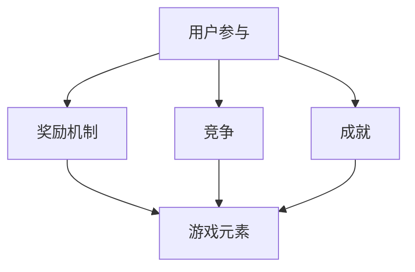

                 

 关键词：游戏化设计，用户参与，计算乐趣，用户体验，激励机制

> 摘要：本文将探讨游戏化设计在提升计算参与度和乐趣方面的应用。通过介绍核心概念、算法原理、数学模型以及实际案例，本文旨在为开发者提供一种全新的设计思路，以激发用户在计算过程中的积极参与和愉悦体验。

## 1. 背景介绍

在当今信息化社会，计算机技术已经深入到我们生活的方方面面。然而，对于很多用户来说，与计算机交互仍然是一个复杂而乏味的过程。如何提升用户在计算过程中的参与感和乐趣，成为了一个亟待解决的问题。游戏化设计（Gamification）作为一种创新的交互方式，为解决这个问题提供了新的思路。

游戏化设计将游戏的元素和机制应用于非游戏环境，通过奖励、竞争、成就等手段激发用户的参与热情和积极性。这种设计方法不仅适用于娱乐领域，还可以广泛应用于教育、商业、健康等多个领域，从而提升用户体验和满意度。

## 2. 核心概念与联系

### 2.1 核心概念

游戏化设计涉及多个核心概念，包括：

- **用户参与**：用户在计算过程中的积极参与和互动。
- **奖励机制**：通过奖励来激励用户行为。
- **竞争**：用户之间的互动和竞争。
- **成就**：用户在完成任务后获得的荣誉和成就感。
- **游戏元素**：游戏中的各种元素，如分数、等级、任务等。

### 2.2 联系与流程图

下面是一个简单的 Mermaid 流程图，展示了游戏化设计中的核心概念及其联系：



## 3. 核心算法原理 & 具体操作步骤

### 3.1 算法原理概述

游戏化设计的核心在于激励用户参与。这可以通过以下步骤实现：

1. **确定目标**：明确用户需要完成的任务或目标。
2. **设计奖励**：根据目标设计相应的奖励，如分数、等级、勋章等。
3. **建立反馈机制**：用户完成任务后及时给予反馈，增加参与感和乐趣。
4. **调整激励机制**：根据用户行为和反馈，不断调整奖励机制，以保持用户的兴趣和积极性。

### 3.2 算法步骤详解

#### 步骤1：确定目标

首先，开发者需要明确用户需要完成的任务或目标。这些目标可以是简单的任务，如回答问题、完成练习，也可以是复杂的任务，如编写程序、解决难题。

#### 步骤2：设计奖励

接下来，根据目标设计相应的奖励。奖励的设计需要符合用户的兴趣和需求，同时具有一定的吸引力。例如，可以设置不同等级的奖励，如完成基础任务获得普通奖励，完成高级任务获得特殊奖励。

#### 步骤3：建立反馈机制

用户完成任务后，系统需要及时给予反馈。这种反馈可以是直接的奖励，也可以是成就感的传递。例如，用户完成任务后，系统可以显示一条祝贺信息，或者为其升级、增加积分等。

#### 步骤4：调整激励机制

最后，根据用户的行为和反馈，不断调整奖励机制。这可以帮助保持用户的兴趣和积极性，防止用户流失。

### 3.3 算法优缺点

#### 优点

- **提升用户参与度**：通过奖励和反馈机制，可以大大提升用户的参与度和积极性。
- **增强用户满意度**：游戏化设计可以提供更加有趣、互动的体验，从而增强用户的满意度。
- **适用范围广泛**：游戏化设计不仅适用于游戏领域，还可以应用于教育、商业等多个领域。

#### 缺点

- **可能引发负面效应**：如果奖励机制设计不当，可能会导致用户产生依赖性、焦虑等负面情绪。
- **实施成本较高**：游戏化设计需要投入大量的人力和物力资源，实施成本较高。

### 3.4 算法应用领域

游戏化设计可以应用于多个领域，包括：

- **教育**：通过游戏化设计，可以提升学生的学习兴趣和参与度。
- **健康**：通过游戏化设计，可以激励用户坚持健康习惯，如锻炼、饮食管理等。
- **商业**：通过游戏化设计，可以提升用户对品牌的忠诚度和参与度。

## 4. 数学模型和公式

### 4.1 数学模型构建

在游戏化设计中，可以使用数学模型来描述用户的参与度和奖励机制。一个简单的模型可以表示为：

\[ P = f(R, C, A) \]

其中，\( P \) 代表用户的参与度，\( R \) 代表奖励，\( C \) 代表竞争，\( A \) 代表成就。

### 4.2 公式推导过程

根据上述模型，我们可以推导出以下公式：

\[ P = k \cdot R \cdot C \cdot A \]

其中，\( k \) 是一个常数，用于调整参与度的权重。

### 4.3 案例分析与讲解

假设有一个教育应用，目标是为用户提供学习机会。根据上述公式，我们可以设定奖励、竞争和成就的权重分别为 \( k_R = 0.5 \), \( k_C = 0.3 \), \( k_A = 0.2 \)。用户完成一次学习任务后，可以获取一定的积分，积分可以用来兑换奖品。

通过调整权重，我们可以平衡奖励、竞争和成就对用户参与度的影响。例如，如果用户更关注竞争，可以增加 \( k_C \) 的权重。

## 5. 项目实践：代码实例和详细解释说明

### 5.1 开发环境搭建

在开始项目实践之前，我们需要搭建一个开发环境。这里我们选择使用 Python 作为开发语言，并使用 Flask 框架构建 Web 应用。

### 5.2 源代码详细实现

下面是一个简单的 Flask 应用示例，用于实现游戏化设计：

```python
from flask import Flask, request, jsonify

app = Flask(__name__)

# 用户积分
users = {
    'user1': 100,
    'user2': 200,
}

# 完成任务后增加积分
@app.route('/complete_task', methods=['POST'])
def complete_task():
    user = request.json['user']
    points = request.json['points']
    users[user] += points
    return jsonify({'status': 'success', 'points': users[user]})

# 获取用户积分
@app.route('/get_points', methods=['GET'])
def get_points():
    user = request.args.get('user')
    return jsonify({'points': users.get(user, 0)})

if __name__ == '__main__':
    app.run(debug=True)
```

### 5.3 代码解读与分析

这个 Flask 应用包含两个主要的 API 接口：

1. **完成任务**：用户通过这个接口提交完成任务，系统会根据任务的难度为用户增加相应的积分。
2. **获取积分**：用户可以通过这个接口查询自己的当前积分。

通过这两个接口，我们可以实现一个简单的游戏化设计，激励用户完成任务。

### 5.4 运行结果展示

启动 Flask 应用后，用户可以通过 POST 请求完成任务，并获取积分：

```bash
$ curl -X POST -H "Content-Type: application/json" -d '{"user": "user1", "points": 50}' http://localhost:5000/complete_task
{"status": "success", "points": 150}

$ curl -X GET http://localhost:5000/get_points?user=user1
{"points": 150}
```

## 6. 实际应用场景

### 6.1 教育

在教育领域，游戏化设计可以用来激励学生学习。例如，通过设置任务、奖励和等级，学生可以更积极地参与学习过程。

### 6.2 健康

在健康领域，游戏化设计可以用来激励用户保持健康习惯。例如，通过记录用户的运动数据、提供奖励和排名，用户可以更积极地参与运动和健康管理。

### 6.3 商业

在商业领域，游戏化设计可以用来提升用户参与度和品牌忠诚度。例如，通过设置积分、奖励和竞赛，用户可以更积极地参与品牌活动和互动。

## 7. 工具和资源推荐

### 7.1 学习资源推荐

- 《游戏化设计：改变游戏规则》（Game Mechanics: How Games and Game Design Can Make Your Business or Product More Fun and Profitable）
- 《游戏化：变革游戏规则的艺术》（Gamification by Design: Implementing Game Mechanics in Web and Mobile Apps）

### 7.2 开发工具推荐

- **Flask**：Python Web 应用开发框架。
- **Django**：Python Web 应用开发框架。
- **React**：JavaScript 前端框架。

### 7.3 相关论文推荐

- Gamification Elements in Web-Based Educational Games
- Gamification in Education: A Systematic Review and Evaluation of the Literature
- The Game of Life: Using Game Mechanics to Improve Students' Motivation

## 8. 总结：未来发展趋势与挑战

### 8.1 研究成果总结

游戏化设计在提升用户参与度和满意度方面取得了显著成果。通过奖励、竞争和成就等手段，游戏化设计可以大大激发用户的积极性。

### 8.2 未来发展趋势

随着技术的不断进步，游戏化设计将变得更加智能化和个性化。例如，通过人工智能技术，系统可以更准确地预测用户行为，并为其提供个性化的奖励和挑战。

### 8.3 面临的挑战

尽管游戏化设计具有巨大潜力，但同时也面临一些挑战。例如，如何设计合理的奖励机制、如何避免用户产生依赖性等。

### 8.4 研究展望

未来，游戏化设计的研究将朝着更加智能化、个性化和多元化的方向发展。通过不断探索和创新，游戏化设计将为各个领域带来更多的机遇和挑战。

## 9. 附录：常见问题与解答

### 问题1：游戏化设计是否只适用于娱乐领域？

解答：游戏化设计不仅适用于娱乐领域，还可以广泛应用于教育、健康、商业等多个领域，为各个领域带来积极的变革。

### 问题2：如何设计合理的奖励机制？

解答：设计合理的奖励机制需要考虑用户的需求和兴趣。可以通过调研、用户测试等方法了解用户偏好，并根据这些信息设计奖励。

### 问题3：游戏化设计是否会导致用户产生依赖性？

解答：是的，如果奖励机制设计不当，用户可能会产生依赖性。因此，在设计奖励机制时，需要平衡奖励的吸引力和用户的长期健康。

---

作者：禅与计算机程序设计艺术 / Zen and the Art of Computer Programming

