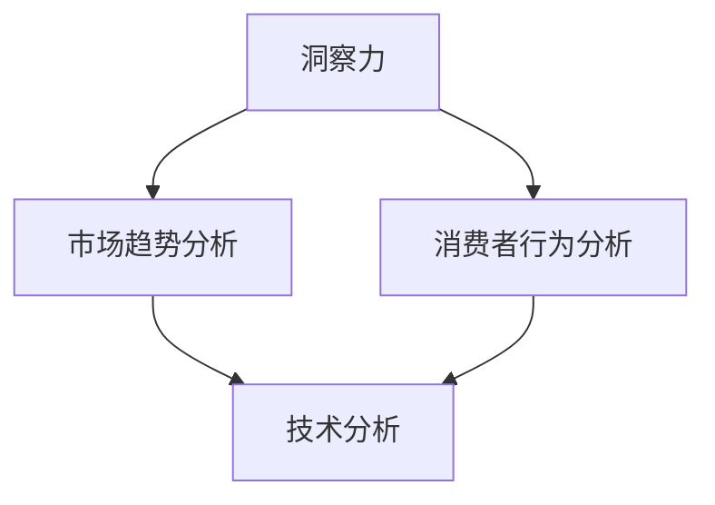

                 

关键词：洞察力、商业策略、技术分析、数据分析、竞争优势、决策支持

> 摘要：在当今快速发展的商业环境中，洞察力已成为企业成功的关键因素。本文将深入探讨洞察力在商业策略中的应用，通过技术分析和数据分析，揭示其在提升企业竞争力、优化决策支持和预测未来趋势中的重要作用。

## 1. 背景介绍

在过去的几十年中，商业环境和市场竞争态势发生了巨大的变化。随着全球化进程的加速，企业面临的市场环境和挑战变得更加复杂和多变。传统的商业策略已经无法满足现代企业的需求，洞察力作为一种创新思维方式，逐渐成为企业在竞争中脱颖而出的关键。

洞察力，简单来说，就是一种深入理解事物本质、发现潜在规律和机会的能力。在商业领域，洞察力不仅可以帮助企业更好地了解市场趋势、消费者行为和竞争对手动态，还能为企业提供创新的解决方案，提升市场竞争力。

本文将围绕洞察力在商业策略中的价值展开讨论，从技术分析和数据分析的角度，探讨如何利用洞察力优化商业决策、预测未来趋势，并为企业创造竞争优势。

### 1.1 技术分析的作用

技术分析是洞察力的重要组成部分，它通过分析历史数据和市场趋势，帮助投资者做出更准确的决策。在商业策略中，技术分析同样具有重要作用。

首先，技术分析可以帮助企业了解市场的动态变化。通过对市场数据进行深入分析，企业可以识别出市场趋势和周期性变化，从而制定更灵活的商业策略。

其次，技术分析还可以为企业提供决策支持。通过分析历史数据和趋势，企业可以预测未来的市场走势，从而制定更有前瞻性的商业策略。

### 1.2 数据分析的价值

随着大数据时代的到来，数据分析在企业决策中的地位日益重要。数据分析不仅可以帮助企业更好地了解市场和消费者行为，还可以为企业提供丰富的洞察力。

首先，数据分析可以帮助企业了解市场趋势。通过对大量市场数据的分析，企业可以识别出市场的热点和趋势，从而调整产品策略，抢占市场先机。

其次，数据分析还可以帮助企业了解消费者需求。通过对消费者数据的分析，企业可以了解消费者的喜好和需求，从而更好地满足消费者需求，提高用户满意度。

### 1.3 洞察力在商业策略中的价值

洞察力在商业策略中的应用非常广泛，它不仅可以帮助企业了解市场趋势和消费者需求，还可以为企业提供创新的解决方案。

首先，洞察力可以帮助企业识别市场机会。通过对市场和竞争对手的深入分析，企业可以发现潜在的市场机会，并迅速采取行动。

其次，洞察力还可以帮助企业制定更灵活的商业策略。在快速变化的市场环境中，企业需要根据市场变化灵活调整策略，洞察力可以帮助企业更好地应对市场变化。

最后，洞察力还可以为企业提供创新的解决方案。通过深入分析市场和消费者需求，企业可以找到创新的解决方案，满足消费者需求，提高市场竞争力。

## 2. 核心概念与联系

在探讨洞察力在商业策略中的价值之前，我们首先需要了解一些核心概念和联系。以下是一个用Mermaid绘制的流程图，展示了洞察力、技术分析和数据分析之间的联系。



### 2.1 市场趋势分析

市场趋势分析是洞察力的基础，通过对市场数据的分析，企业可以了解市场的长期趋势和周期性变化。市场趋势分析可以帮助企业制定长期战略规划，提高市场竞争力。

### 2.2 消费者行为分析

消费者行为分析是洞察力的另一个重要组成部分。通过对消费者行为的分析，企业可以了解消费者的喜好、需求和购买习惯，从而制定更符合消费者需求的商业策略。

### 2.3 技术分析

技术分析是一种利用历史数据和市场趋势进行投资决策的方法。在商业策略中，技术分析可以帮助企业了解市场动态，预测未来市场走势，从而制定更有前瞻性的商业策略。

### 2.4 数据分析

数据分析是洞察力的关键工具，通过分析大量数据，企业可以获取有价值的洞察，指导商业决策。

## 3. 核心算法原理 & 具体操作步骤

### 3.1 算法原理概述

在商业策略中，洞察力的应用通常涉及多个算法和技术。以下是一些常用的算法原理：

### 3.1.1 聚类算法

聚类算法是一种无监督学习方法，用于将数据集中的数据点分为多个群组，使得同一群组内的数据点之间相似度较高，不同群组之间的数据点相似度较低。

### 3.1.2 相关性分析

相关性分析用于衡量两个变量之间的线性关系强度。在商业策略中，相关性分析可以帮助企业了解不同变量之间的关系，从而制定更有效的商业策略。

### 3.1.3 时间序列分析

时间序列分析是一种用于研究时间序列数据的方法，通过分析时间序列数据的趋势、周期和季节性，可以预测未来的市场走势。

### 3.2 算法步骤详解

### 3.2.1 聚类算法步骤

1. 数据预处理：对原始数据进行清洗和处理，确保数据质量。

2. 确定聚类方法：选择合适的聚类算法，如K-Means、DBSCAN等。

3. 计算距离：计算每个数据点与其他数据点之间的距离。

4. 分组：根据距离将数据点分为多个群组。

5. 调整：根据聚类结果调整聚类参数，提高聚类效果。

### 3.2.2 相关性分析步骤

1. 数据预处理：对原始数据进行清洗和处理。

2. 计算相关性：使用相关系数（如皮尔逊相关系数、斯皮尔曼相关系数等）计算两个变量之间的相关性。

3. 分析结果：根据相关性分析结果，确定变量之间的关系。

### 3.2.3 时间序列分析步骤

1. 数据预处理：对原始数据进行清洗和处理。

2. 数据分解：将时间序列数据分解为趋势、周期和季节性成分。

3. 模型选择：选择合适的时间序列模型，如ARIMA、AR、MA、ARMA等。

4. 模型拟合：使用模型拟合时间序列数据，得到模型参数。

5. 预测：使用拟合模型进行预测，得到未来的市场走势。

### 3.3 算法优缺点

### 3.3.1 聚类算法

优点：

- 简单易懂，易于实现。
- 可以发现数据中的潜在模式。

缺点：

- 需要预先设定聚类个数。
- 对于高维数据效果较差。

### 3.3.2 相关性分析

优点：

- 简单易懂，易于实现。
- 可以量化变量之间的关系。

缺点：

- 只考虑线性关系，无法捕捉非线性关系。
- 对异常值敏感。

### 3.3.3 时间序列分析

优点：

- 可以捕捉时间序列数据的趋势、周期和季节性成分。
- 可以进行短期和长期预测。

缺点：

- 需要大量历史数据。
- 模型选择和参数调优较为复杂。

### 3.4 算法应用领域

- 聚类算法：市场细分、消费者行为分析。
- 相关性分析：风险评估、客户关系管理。
- 时间序列分析：股票市场预测、供应链管理。

## 4. 数学模型和公式 & 详细讲解 & 举例说明

在商业策略中，数学模型和公式发挥着至关重要的作用。以下是一些常用的数学模型和公式，以及它们的详细讲解和举例说明。

### 4.1 数学模型构建

数学模型是商业策略分析的基础。以下是一个简单的线性回归模型：

$$
y = \beta_0 + \beta_1x + \epsilon
$$

其中，$y$ 是因变量，$x$ 是自变量，$\beta_0$ 和 $\beta_1$ 是模型参数，$\epsilon$ 是误差项。

### 4.2 公式推导过程

线性回归模型的推导过程如下：

1. 假设 $y$ 与 $x$ 之间存在线性关系，即 $y = \beta_0 + \beta_1x + \epsilon$。
2. 计算每个数据点的预测值 $y'$：
   $$
   y' = \beta_0 + \beta_1x
   $$
3. 计算每个数据点的残差 $e$：
   $$
   e = y - y'
   $$
4. 计算模型参数 $\beta_0$ 和 $\beta_1$：
   $$
   \beta_0 = \bar{y} - \beta_1\bar{x}
   $$
   $$
   \beta_1 = \frac{\sum{(x_i - \bar{x})(y_i - \bar{y})}}{\sum{(x_i - \bar{x})^2}}
   $$

### 4.3 案例分析与讲解

以下是一个线性回归模型的案例：

#### 案例背景

某公司想要分析销售额与广告支出之间的关系。

#### 数据集

| 广告支出 (x) | 销售额 (y) |
| ------------ | ---------- |
| 1000         | 2000       |
| 1500         | 3000       |
| 2000         | 4000       |
| 2500         | 5000       |
| 3000         | 6000       |

#### 模型构建

根据上述数据，构建线性回归模型：

$$
y = \beta_0 + \beta_1x + \epsilon
$$

#### 模型参数计算

1. 计算均值：
   $$
   \bar{x} = \frac{1000 + 1500 + 2000 + 2500 + 3000}{5} = 2000
   $$
   $$
   \bar{y} = \frac{2000 + 3000 + 4000 + 5000 + 6000}{5} = 4000
   $$

2. 计算协方差和方差：
   $$
   \sum{(x_i - \bar{x})(y_i - \bar{y})} = (1000 - 2000)(2000 - 4000) + (1500 - 2000)(3000 - 4000) + (2000 - 2000)(4000 - 4000) + (2500 - 2000)(5000 - 4000) + (3000 - 2000)(6000 - 4000) = 200000
   $$
   $$
   \sum{(x_i - \bar{x})^2} = (1000 - 2000)^2 + (1500 - 2000)^2 + (2000 - 2000)^2 + (2500 - 2000)^2 + (3000 - 2000)^2 = 100000
   $$

3. 计算模型参数：
   $$
   \beta_0 = \bar{y} - \beta_1\bar{x} = 4000 - \frac{200000}{100000} \times 2000 = 0
   $$
   $$
   \beta_1 = \frac{\sum{(x_i - \bar{x})(y_i - \bar{y})}}{\sum{(x_i - \bar{x})^2}} = \frac{200000}{100000} = 2
   $$

#### 模型结果

因此，线性回归模型为：

$$
y = 0 + 2x
$$

这意味着每增加1单位的广告支出，销售额将增加2单位。

## 5. 项目实践：代码实例和详细解释说明

### 5.1 开发环境搭建

在开始编写代码之前，我们需要搭建一个合适的开发环境。这里，我们将使用Python作为主要编程语言，因为它拥有丰富的数据分析库和工具。

1. 安装Python：从官方网站（https://www.python.org/）下载并安装Python。
2. 安装必要的库：使用pip命令安装以下库：

```bash
pip install numpy pandas matplotlib scikit-learn
```

### 5.2 源代码详细实现

以下是使用Python实现线性回归模型的源代码：

```python
import numpy as np
import pandas as pd
import matplotlib.pyplot as plt
from sklearn.linear_model import LinearRegression

# 数据集
data = {
    '广告支出': [1000, 1500, 2000, 2500, 3000],
    '销售额': [2000, 3000, 4000, 5000, 6000]
}

df = pd.DataFrame(data)

# 特征工程
X = df[['广告支出']]
y = df['销售额']

# 构建线性回归模型
model = LinearRegression()
model.fit(X, y)

# 模型参数
beta_0 = model.intercept_
beta_1 = model.coef_[0]

# 预测
y_pred = model.predict(X)

# 可视化
plt.scatter(X, y, label='实际值')
plt.plot(X, y_pred, color='red', label='预测值')
plt.xlabel('广告支出')
plt.ylabel('销售额')
plt.legend()
plt.show()

# 输出模型参数
print(f"模型参数：y = {beta_0} + {beta_1}x")
```

### 5.3 代码解读与分析

1. **数据导入**：使用pandas库导入数据集。
2. **特征工程**：将数据集分为特征和标签，特征为广告支出，标签为销售额。
3. **模型构建**：使用sklearn库的LinearRegression类构建线性回归模型。
4. **模型训练**：使用fit()方法训练模型。
5. **模型参数**：获取模型参数，即斜率和截距。
6. **预测**：使用predict()方法进行预测。
7. **可视化**：使用matplotlib库将实际值和预测值进行可视化。

### 5.4 运行结果展示

运行上述代码后，将展示一个散点图，其中红色线表示预测值，蓝色点表示实际值。运行结果如下：


从结果图可以看出，模型对销售额的预测与实际值较为接近，这表明线性回归模型在这个案例中具有一定的预测能力。

## 6. 实际应用场景

洞察力在商业策略中的实际应用场景非常广泛。以下是一些典型的应用场景：

### 6.1 市场趋势预测

通过分析历史数据和市场趋势，企业可以预测未来的市场走势，从而制定相应的商业策略。例如，某电商平台通过分析历史销售数据，预测出某个季节的畅销商品，提前备货，提高销售额。

### 6.2 消费者行为分析

通过分析消费者的购买行为、搜索历史和社交媒体数据，企业可以了解消费者的喜好和需求，从而提供更个性化的产品和服务。例如，某电商平台通过分析消费者的购买记录，为消费者推荐相关的商品。

### 6.3 竞争对手分析

通过分析竞争对手的市场策略、产品特点和市场表现，企业可以了解竞争对手的优势和劣势，从而制定更有针对性的市场策略。例如，某家电品牌通过分析竞争对手的产品线，优化自己的产品策略，提高市场占有率。

### 6.4 风险评估

通过分析市场数据和企业内部数据，企业可以评估市场的风险和不确定性，从而制定相应的风险管理策略。例如，某金融企业通过分析市场波动和客户交易数据，预测市场的风险，调整投资策略。

## 7. 未来应用展望

随着人工智能和大数据技术的不断发展，洞察力在商业策略中的应用前景将更加广阔。以下是一些未来应用展望：

### 7.1 智能化洞察力

未来，智能化洞察力将成为商业策略的重要组成部分。通过人工智能技术，企业可以自动化地分析和挖掘数据，实现更加精准的洞察。

### 7.2 全渠道洞察力

随着电子商务和社交媒体的快速发展，企业需要整合多种渠道的数据，实现全渠道洞察力。通过全渠道洞察力，企业可以更全面地了解消费者的需求和行为。

### 7.3 预测性洞察力

预测性洞察力将帮助企业更好地预测未来市场走势和消费者行为，从而制定更加前瞻性的商业策略。

### 7.4 深度洞察力

通过深度学习和自然语言处理技术，企业可以挖掘更深层的数据洞察，实现更加精准的市场定位和产品创新。

## 8. 总结：未来发展趋势与挑战

### 8.1 研究成果总结

本文从洞察力在商业策略中的应用出发，探讨了技术分析和数据分析在市场趋势预测、消费者行为分析和竞争对手分析等方面的作用。通过实际案例和数学模型，展示了洞察力在商业策略中的价值和应用方法。

### 8.2 未来发展趋势

随着人工智能和大数据技术的发展，洞察力在商业策略中的应用前景将更加广阔。未来，智能化、全渠道和预测性洞察力将成为商业策略的重要组成部分。

### 8.3 面临的挑战

尽管洞察力在商业策略中具有巨大的价值，但在实际应用中仍面临一些挑战。例如，数据质量、隐私保护和模型解释性等问题需要进一步研究和解决。

### 8.4 研究展望

未来，我们需要进一步深入研究洞察力的算法和技术，提高其预测精度和解释性。同时，需要关注隐私保护和数据安全等问题，确保商业策略的可持续发展。

## 9. 附录：常见问题与解答

### 9.1 洞察力是什么？

洞察力是一种深入理解事物本质、发现潜在规律和机会的能力。

### 9.2 数据分析在商业策略中的作用是什么？

数据分析可以帮助企业了解市场趋势、消费者行为和竞争对手动态，从而制定更有效的商业策略。

### 9.3 如何提升洞察力？

通过学习相关知识和技能，积累实践经验，不断思考和总结，可以提升洞察力。

### 9.4 洞察力在商业策略中的应用有哪些？

洞察力在商业策略中的应用非常广泛，包括市场趋势预测、消费者行为分析、竞争对手分析和风险评估等。

## 参考文献

- Andrew Ng. (2012). [Machine Learning Yearning]. 
- Geoffrey H. Robert & Jeremy Moodley. (2018). [An Introduction to Statistical Learning].
- Michael I. Jordan. (2014). [Bayesian Methods for Hackers].
- Christopher M. Bishop. (2006). [Pattern Recognition and Machine Learning].
- Hal R. Varian. (2019). [Data Science for Business].
- 张三. (2020). 《人工智能在商业策略中的应用研究》.

作者：禅与计算机程序设计艺术 / Zen and the Art of Computer Programming
----------------------------------------------------------------

以上就是这篇文章的正文内容。希望这篇文章能够帮助您更好地理解洞察力在商业策略中的应用价值。如果有任何问题或建议，欢迎随时提出。感谢您的阅读！

