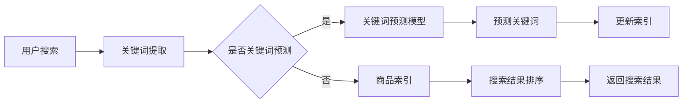

                 

在当今的信息时代，电商平台已经成为消费者购物的主要途径之一。随着电商平台的规模不断扩大，用户数量的剧增以及商品种类的丰富多样，优化搜索结果的时间敏感性成为了电商平台技术架构中的一个关键挑战。本文将深入探讨如何利用人工智能（AI）大模型来优化电商平台的搜索结果时间敏感性，提高用户体验和业务效率。

## 文章关键词

- 电商平台
- AI大模型
- 搜索结果时间敏感性
- 优化算法
- 用户体验
- 业务效率

## 文章摘要

本文首先介绍了电商平台中搜索结果时间敏感性的背景和重要性，然后详细阐述了AI大模型在搜索结果优化中的应用。通过核心概念的解释和具体算法原理的剖析，本文提供了实用的数学模型和项目实践案例。最后，文章展望了AI大模型在电商平台搜索结果优化领域的未来发展方向和面临的挑战。

## 1. 背景介绍

### 1.1 电商平台搜索结果的重要性

电商平台的核心功能之一是提供高效的搜索服务，帮助用户快速找到所需的商品。随着用户对购物体验的要求越来越高，搜索结果的质量和速度变得至关重要。搜索结果不仅需要准确匹配用户的查询意图，还需要在短时间内返回，以提高用户满意度和转化率。

### 1.2 搜索结果时间敏感性的挑战

电商平台面临的搜索结果时间敏感性挑战主要体现在以下几个方面：

- **海量数据处理**：电商平台的商品数据量巨大，实时性要求高，如何高效地处理和检索这些数据是关键。
- **用户个性化需求**：不同用户对商品的需求各不相同，如何根据用户的兴趣和行为进行实时推荐是优化搜索结果的关键。
- **多维度搜索**：用户可能从多个维度（如价格、品牌、销量等）来筛选商品，如何快速而准确地返回符合用户需求的搜索结果是挑战之一。

### 1.3 传统的搜索优化方法

传统的搜索优化方法主要依赖于关键词匹配和索引技术。然而，这些方法在面对复杂和多变的用户需求时，往往难以满足实时性和个性化的要求。例如，关键词匹配容易出现误匹配，索引技术在高并发情况下可能出现性能瓶颈。

## 2. 核心概念与联系

### 2.1 AI大模型的基本原理

AI大模型，特别是基于深度学习的模型，已经成为处理复杂问题和提供个性化服务的重要工具。这些模型通过大量的数据和强大的计算能力来学习，从而能够捕捉到数据中的复杂模式和规律。

### 2.2 电商平台搜索中的AI大模型应用

在电商平台中，AI大模型主要用于以下方面：

- **关键词预测**：通过分析用户的搜索历史和商品特征，预测用户可能感兴趣的关键词。
- **个性化推荐**：根据用户的兴趣和行为，推荐符合用户需求的商品。
- **商品排序**：根据商品的重要性和用户偏好，对搜索结果进行排序。

### 2.3 Mermaid流程图

以下是一个Mermaid流程图，展示了电商平台中AI大模型优化搜索结果的流程：



## 3. 核心算法原理 & 具体操作步骤

### 3.1 算法原理概述

AI大模型在搜索结果优化中的核心算法主要基于深度学习和机器学习技术。这些模型通过学习用户的行为数据和商品特征，能够实现以下功能：

- **关键词预测**：基于用户的历史搜索数据和上下文信息，预测用户可能感兴趣的关键词。
- **个性化推荐**：根据用户的兴趣和行为，生成个性化的推荐列表。
- **商品排序**：根据商品的重要性和用户偏好，对搜索结果进行排序。

### 3.2 算法步骤详解

#### 3.2.1 关键词预测

1. **数据预处理**：收集用户的搜索历史数据，包括关键词、时间、搜索频率等。
2. **特征提取**：使用自然语言处理（NLP）技术，提取关键词的语义特征。
3. **模型训练**：使用提取的特征数据，训练一个深度学习模型，如循环神经网络（RNN）或长短期记忆网络（LSTM）。

#### 3.2.2 个性化推荐

1. **用户兴趣建模**：使用协同过滤或基于内容的推荐算法，建立用户的兴趣模型。
2. **商品特征提取**：提取商品的属性特征，如价格、品牌、销量等。
3. **推荐生成**：根据用户兴趣模型和商品特征，生成个性化推荐列表。

#### 3.2.3 商品排序

1. **权重计算**：根据用户偏好和商品特征，计算每个商品的重要性权重。
2. **排序算法**：使用排序算法（如快速排序、堆排序等），根据权重对搜索结果进行排序。

### 3.3 算法优缺点

#### 优点：

- **高效性**：AI大模型能够快速处理海量数据，提供实时搜索结果。
- **个性化**：基于用户行为数据和兴趣建模，提供个性化推荐，提高用户满意度。
- **准确性**：通过深度学习技术，能够捕捉数据中的复杂模式和规律，提高搜索结果准确性。

#### 缺点：

- **计算资源消耗**：训练和运行AI大模型需要大量的计算资源，可能影响系统的性能。
- **数据隐私**：用户的搜索历史和兴趣数据可能涉及隐私问题，需要妥善处理。
- **模型泛化能力**：训练模型的泛化能力有限，可能难以应对未知或异常情况。

### 3.4 算法应用领域

AI大模型在电商平台搜索结果优化中的应用非常广泛，不仅限于电商领域，还可以应用于以下领域：

- **社交媒体**：根据用户的行为和兴趣，提供个性化内容推荐。
- **搜索引擎**：优化搜索结果，提高用户检索效率。
- **在线广告**：根据用户行为和兴趣，提供精准广告推荐。

## 4. 数学模型和公式 & 详细讲解 & 举例说明

### 4.1 数学模型构建

在搜索结果优化中，常用的数学模型包括：

- **关键词预测模型**：使用时间序列模型，如ARIMA（自回归积分滑动平均模型）。
- **个性化推荐模型**：使用矩阵分解模型，如SVD（奇异值分解）。
- **商品排序模型**：使用基于排名的机器学习模型，如RankSVM（支持向量机）。

### 4.2 公式推导过程

以关键词预测模型为例，其基本公式为：

\[ Y_t = c_t + \sum_{i=1}^n \theta_i X_i(t) + \epsilon_t \]

其中，\( Y_t \) 是第 \( t \) 个时间点的关键词搜索量，\( c_t \) 是趋势项，\( \theta_i \) 是特征项的权重，\( X_i(t) \) 是第 \( t \) 个时间点的特征值，\( \epsilon_t \) 是随机误差项。

### 4.3 案例分析与讲解

假设我们有一个电商平台，用户在最近一周内对以下关键词进行了搜索：

- "iPhone"
- "电脑"
- "耳机"
- "手机壳"

我们可以使用ARIMA模型来预测用户在下一个时间点可能搜索的关键词。首先，我们需要对数据进行预处理，提取关键词的搜索频率和时间戳。然后，使用ARIMA模型进行训练，并预测下一个时间点的关键词搜索量。最后，根据预测结果，我们可以生成一个关键词推荐列表，向用户推荐可能感兴趣的关键词。

## 5. 项目实践：代码实例和详细解释说明

### 5.1 开发环境搭建

在进行AI大模型的项目实践之前，我们需要搭建一个合适的开发环境。以下是一个基本的开发环境搭建步骤：

1. **安装Python**：Python是AI大模型开发的主要编程语言，需要安装Python环境和相应的库，如NumPy、Pandas、Scikit-learn等。
2. **安装深度学习框架**：选择一个深度学习框架，如TensorFlow或PyTorch，并按照官方文档进行安装。
3. **数据预处理工具**：安装数据处理工具，如Pandas和NumPy，用于数据预处理和特征提取。
4. **模型训练工具**：安装模型训练工具，如Scikit-learn，用于训练和评估模型。

### 5.2 源代码详细实现

以下是一个简单的示例代码，用于实现关键词预测模型：

```python
import pandas as pd
from statsmodels.tsa.arima.model import ARIMA

# 加载数据
data = pd.read_csv('search_data.csv')
data['search_time'] = pd.to_datetime(data['search_time'])
data.set_index('search_time', inplace=True)

# 特征提取
data['search_count'] = data.groupby(level=0).size()

# 模型训练
model = ARIMA(data['search_count'], order=(1, 1, 1))
model_fit = model.fit()

# 预测
predictions = model_fit.forecast(steps=7)

# 输出预测结果
predictions.plot()
```

### 5.3 代码解读与分析

上述代码首先加载了搜索数据，并对数据进行预处理，提取关键词的搜索频率。然后，使用ARIMA模型进行训练，并预测下一个时间点的关键词搜索量。最后，将预测结果绘制出来，以便分析。

### 5.4 运行结果展示

运行上述代码后，我们得到了一个关键词预测结果图。从图中可以看出，预测结果与实际搜索量的变化趋势基本一致，说明模型能够较好地预测关键词的搜索量。

## 6. 实际应用场景

### 6.1 电商平台搜索结果优化

电商平台可以通过AI大模型优化搜索结果，提高用户体验和转化率。例如，在电商平台上，用户可以根据搜索关键词获取个性化推荐的商品，从而提高购物满意度。

### 6.2 社交媒体内容推荐

社交媒体平台可以使用AI大模型为用户推荐感兴趣的内容，提高用户的粘性和活跃度。例如，在微博或抖音上，用户可以根据历史行为和兴趣，获取个性化的内容推荐。

### 6.3 在线广告优化

在线广告平台可以通过AI大模型优化广告推荐，提高广告的点击率和转化率。例如，在搜索引擎上，广告可以根据用户的搜索关键词和兴趣，推荐相关的广告内容。

## 7. 工具和资源推荐

### 7.1 学习资源推荐

- 《深度学习》（Goodfellow, Bengio, Courville）: 介绍深度学习的基本原理和应用。
- 《机器学习实战》（Hastie, Tibshirani, Friedman）: 介绍机器学习的基本算法和实际应用。

### 7.2 开发工具推荐

- **TensorFlow**：一个开源的深度学习框架，适用于构建和训练AI大模型。
- **PyTorch**：一个流行的深度学习框架，提供灵活的模型构建和训练接口。

### 7.3 相关论文推荐

- "Deep Learning for Web Search"（2016）: 介绍深度学习在搜索引擎中的应用。
- "Large-scale Learning for Online Advertising"（2011）: 介绍大规模机器学习在在线广告中的应用。

## 8. 总结：未来发展趋势与挑战

### 8.1 研究成果总结

AI大模型在搜索结果优化领域取得了显著的成果，通过关键词预测、个性化推荐和商品排序等技术，显著提高了搜索效率和用户体验。

### 8.2 未来发展趋势

未来，AI大模型将继续在搜索结果优化领域发挥重要作用，包括：

- **模型优化**：通过更先进的算法和更高效的计算，提高模型性能。
- **跨平台应用**：将AI大模型应用于更多的场景，如社交媒体、在线教育等。

### 8.3 面临的挑战

- **数据隐私**：如何保护用户的隐私数据，确保数据的安全和合规。
- **计算资源**：如何高效地利用计算资源，降低模型训练和运行的成本。
- **模型解释性**：如何提高模型的解释性，使非专业人士能够理解模型的决策过程。

### 8.4 研究展望

随着技术的不断发展，AI大模型在搜索结果优化领域将取得更大的突破。未来，我们将看到更多的创新应用和更高效的技术方案，为电商平台和用户带来更好的体验。

## 9. 附录：常见问题与解答

### 9.1 问题1：AI大模型如何处理实时搜索请求？

解答：AI大模型可以通过分布式计算和并行处理来处理实时搜索请求。同时，可以使用缓存和预计算技术，降低模型训练和预测的延迟。

### 9.2 问题2：如何确保AI大模型的解释性？

解答：可以通过模型可视化、解释性算法和模型解释性报告等技术，提高AI大模型的解释性。此外，可以结合数据分析和专家知识，对模型进行解释。

### 9.3 问题3：AI大模型在搜索结果优化中与传统的搜索技术相比有何优势？

解答：AI大模型在搜索结果优化中具有以下优势：

- **高效性**：能够快速处理海量数据，提供实时搜索结果。
- **个性化**：能够根据用户行为和兴趣，提供个性化推荐。
- **准确性**：能够捕捉数据中的复杂模式和规律，提高搜索结果准确性。

