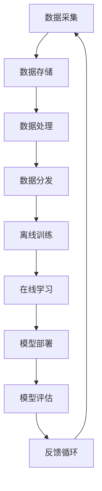

                 

关键词：电商平台、AI大模型、离线训练、在线学习、数据流架构、深度学习、实时推荐、分布式计算

> 摘要：本文将探讨电商平台中AI大模型的应用，从离线训练到在线学习的过程，以及其背后的技术原理和实际操作步骤。我们将深入分析数据流架构的设计、深度学习算法的选择和实现，以及如何利用这些技术提升电商平台的用户体验和运营效率。

## 1. 背景介绍

随着互联网的快速发展，电商平台已经成为商业活动的重要载体。用户规模的不断增长和业务需求的日益复杂，使得电商平台在数据量和数据处理能力上面临巨大的挑战。为了应对这些挑战，人工智能（AI）技术逐渐成为电商平台的核心竞争力之一。

AI大模型在电商平台的运用主要体现在以下几个方面：

- **个性化推荐**：通过用户行为数据和商品属性数据，AI大模型可以生成个性化的推荐列表，提高用户满意度和转化率。
- **商品搜索优化**：利用AI大模型对搜索查询进行语义理解，提高搜索结果的准确性和相关性。
- **广告投放优化**：通过AI大模型分析用户行为和兴趣，实现精准的广告投放，提高广告效果和ROI。
- **智能客服**：利用AI大模型实现自然语言处理，提升客服效率和用户体验。

然而，AI大模型的应用不仅需要大量的数据支持，还需要高效的算法和强大的计算能力。从离线训练到在线学习，如何有效地利用这些技术，是电商平台面临的重大课题。

## 2. 核心概念与联系

### 数据流架构

数据流架构是电商平台AI大模型应用的基础。它涉及到数据的采集、存储、处理和分发等环节，包括以下几个方面：

1. **数据采集**：通过用户行为数据和商品属性数据，为AI大模型提供训练素材。
2. **数据存储**：采用分布式数据库或数据湖，存储海量数据，确保数据的安全和可靠性。
3. **数据处理**：利用ETL（Extract, Transform, Load）工具，对原始数据进行清洗、转换和加载，生成高质量的数据集。
4. **数据分发**：通过数据流框架，将处理后的数据分发到AI大模型训练平台，支持离线训练和在线学习。

### 深度学习算法

深度学习算法是AI大模型的核心。它通过多层神经网络，对大量数据进行自动特征提取和模式识别，从而实现智能化的决策。以下是几种常见的深度学习算法：

1. **卷积神经网络（CNN）**：适用于图像和语音处理，通过卷积层提取图像或语音的特征。
2. **循环神经网络（RNN）**：适用于序列数据，通过循环层对历史信息进行记忆和利用。
3. ** Transformer模型**：适用于自然语言处理，通过自注意力机制实现全局信息的有效融合。
4. **生成对抗网络（GAN）**：适用于图像生成和图像修复，通过生成器和判别器的对抗训练实现高质量图像生成。

### 算法原理和架构的 Mermaid 流程图



## 3. 核心算法原理 & 具体操作步骤

### 3.1 算法原理概述

AI大模型的核心是深度学习算法，其基本原理是通过多层神经网络对数据进行自动特征提取和模式识别。具体来说，深度学习算法包括以下几个关键组成部分：

1. **输入层**：接收外部输入数据，如用户行为数据和商品属性数据。
2. **隐藏层**：通过激活函数和权重调整，对输入数据进行特征提取和变换。
3. **输出层**：将隐藏层的输出映射到目标输出，如推荐列表、搜索结果或广告投放策略。
4. **损失函数**：评估模型预测值与真实值之间的差距，指导模型的权重调整。
5. **优化器**：调整模型权重，以最小化损失函数。

### 3.2 算法步骤详解

1. **数据预处理**：对采集到的原始数据进行清洗、标准化和编码，确保数据质量。
2. **模型搭建**：根据应用场景选择合适的深度学习算法，搭建多层神经网络。
3. **模型训练**：利用处理后的数据集，通过反向传播算法训练模型，调整权重。
4. **模型评估**：使用验证集和测试集评估模型性能，确保模型泛化能力。
5. **模型优化**：根据评估结果调整模型参数，提高模型性能。
6. **模型部署**：将训练好的模型部署到线上环境，支持实时计算和预测。
7. **在线学习**：利用用户行为数据和反馈信息，持续更新模型，实现智能进化。

### 3.3 算法优缺点

**优点**：

1. **强大的特征提取能力**：深度学习算法能够自动提取复杂数据的特征，提高模型泛化能力。
2. **高效的处理速度**：通过分布式计算和并行处理，深度学习算法能够快速处理海量数据。
3. **灵活的应用场景**：深度学习算法适用于多种应用场景，如图像处理、自然语言处理和推荐系统等。

**缺点**：

1. **计算资源需求大**：深度学习算法需要大量的计算资源和存储资源，对硬件设备要求较高。
2. **训练时间较长**：深度学习算法的训练时间较长，尤其在处理海量数据时。
3. **模型解释性差**：深度学习算法的内部机制复杂，难以解释和调试。

### 3.4 算法应用领域

AI大模型在电商平台的应用主要体现在以下几个方面：

1. **个性化推荐**：通过深度学习算法，对用户行为数据进行实时分析，生成个性化的推荐列表。
2. **商品搜索优化**：利用自然语言处理技术，对用户查询进行语义理解，提高搜索结果的准确性和相关性。
3. **广告投放优化**：通过深度学习算法，分析用户行为和兴趣，实现精准的广告投放。
4. **智能客服**：利用自然语言处理技术，实现智能化的客服系统，提升客服效率和用户体验。

## 4. 数学模型和公式 & 详细讲解 & 举例说明

### 4.1 数学模型构建

深度学习算法的核心是多层神经网络，其基本数学模型包括以下几个部分：

1. **输入层**：表示为矩阵 $X$，其中每一行代表一个样本的特征向量。
2. **隐藏层**：表示为矩阵 $H$，其中每一行代表隐藏层的神经元状态。
3. **输出层**：表示为矩阵 $Y$，其中每一行代表输出层的神经元状态。

### 4.2 公式推导过程

1. **激活函数**：

   激活函数是隐藏层和输出层的关键组成部分，用于引入非线性变换。常用的激活函数包括：

   $$ f(x) = \text{ReLU}(x) = \max(0, x) $$

   $$ f(x) = \text{Sigmoid}(x) = \frac{1}{1 + e^{-x}} $$

   $$ f(x) = \text{Tanh}(x) = \frac{e^x - e^{-x}}{e^x + e^{-x}} $$

2. **权重更新**：

   使用梯度下降算法更新权重，以最小化损失函数。具体公式如下：

   $$ \theta_{\text{new}} = \theta_{\text{old}} - \alpha \cdot \nabla_{\theta} J(\theta) $$

   其中，$ \theta $ 表示权重，$ \alpha $ 表示学习率，$ \nabla_{\theta} J(\theta) $ 表示损失函数关于权重的梯度。

3. **损失函数**：

   损失函数用于衡量模型预测值与真实值之间的差距，常用的损失函数包括：

   $$ J(\theta) = \frac{1}{2} \sum_{i=1}^{n} (y_i - \hat{y}_i)^2 $$

   $$ J(\theta) = - \sum_{i=1}^{n} y_i \log(\hat{y}_i) + (1 - y_i) \log(1 - \hat{y}_i) $$

### 4.3 案例分析与讲解

假设我们有一个简单的二分类问题，目标是通过输入特征预测样本的类别。以下是具体的数学模型构建和公式推导过程：

1. **输入层**：

   假设我们有两个输入特征 $x_1$ 和 $x_2$，则输入层矩阵 $X$ 为：

   $$ X = \begin{bmatrix} x_1^1 \\ x_2^1 \\ x_1^2 \\ x_2^2 \end{bmatrix} $$

2. **隐藏层**：

   假设隐藏层有两个神经元，则隐藏层矩阵 $H$ 为：

   $$ H = \begin{bmatrix} h_1^1 \\ h_2^1 \\ h_1^2 \\ h_2^2 \end{bmatrix} $$

   其中，$ h_1 $ 和 $ h_2 $ 分别表示隐藏层的两个神经元。

3. **输出层**：

   假设输出层有两个神经元，则输出层矩阵 $Y$ 为：

   $$ Y = \begin{bmatrix} y_1^1 \\ y_2^1 \\ y_1^2 \\ y_2^2 \end{bmatrix} $$

   其中，$ y_1 $ 和 $ y_2 $ 分别表示输出层的两个神经元。

4. **激活函数**：

   假设我们使用ReLU作为激活函数，则隐藏层和输出层的激活函数分别为：

   $$ h_1 = \text{ReLU}(x_1 \cdot w_1 + b_1) $$

   $$ h_2 = \text{ReLU}(x_2 \cdot w_2 + b_2) $$

   $$ y_1 = \text{ReLU}(h_1 \cdot w_3 + b_3) $$

   $$ y_2 = \text{ReLU}(h_2 \cdot w_4 + b_4) $$

   其中，$ w_1 $、$ w_2 $、$ w_3 $ 和 $ w_4 $ 分别表示权重，$ b_1 $、$ b_2 $、$ b_3 $ 和 $ b_4 $ 分别表示偏置。

5. **损失函数**：

   假设我们使用平方损失函数，则损失函数为：

   $$ J(\theta) = \frac{1}{2} \sum_{i=1}^{2} (y_i - \hat{y}_i)^2 $$

   其中，$ y_i $ 表示真实标签，$ \hat{y}_i $ 表示模型预测值。

6. **权重更新**：

   假设我们使用梯度下降算法，则权重更新公式为：

   $$ w_1 = w_1 - \alpha \cdot \frac{\partial J(\theta)}{\partial w_1} $$

   $$ w_2 = w_2 - \alpha \cdot \frac{\partial J(\theta)}{\partial w_2} $$

   $$ w_3 = w_3 - \alpha \cdot \frac{\partial J(\theta)}{\partial w_3} $$

   $$ w_4 = w_4 - \alpha \cdot \frac{\partial J(\theta)}{\partial w_4} $$

   其中，$ \alpha $ 表示学习率。

## 5. 项目实践：代码实例和详细解释说明

### 5.1 开发环境搭建

在开始项目实践之前，我们需要搭建一个适合深度学习开发的编程环境。以下是具体的步骤：

1. **安装Python**：下载并安装Python 3.x版本，建议使用Anaconda distributions。
2. **安装深度学习框架**：安装TensorFlow或PyTorch，它们是当前最流行的深度学习框架。
3. **安装其他依赖库**：根据项目需求，安装其他相关依赖库，如NumPy、Pandas、Matplotlib等。

### 5.2 源代码详细实现

以下是一个简单的基于TensorFlow实现的线性回归模型，用于预测商品销量。代码如下：

```python
import tensorflow as tf
import numpy as np
import matplotlib.pyplot as plt

# 数据集
x_data = np.linspace(0, 10, 100)
y_data = 3 * x_data + 2 + np.random.normal(size=x_data.shape)

# 模型参数
w = tf.Variable(0., name='weights')
b = tf.Variable(0., name='bias')

# 损失函数
loss = tf.reduce_mean(tf.square(y_data - (w * x_data + b)))

# 优化器
optimizer = tf.train.GradientDescentOptimizer(learning_rate=0.01)
train_op = optimizer.minimize(loss)

# 训练模型
with tf.Session() as sess:
    sess.run(tf.global_variables_initializer())
    for step in range(2000):
        sess.run(train_op)
        if step % 100 == 0:
            print(f"Step {step}, Loss: {loss.eval()}")
    
    # 绘制结果
    plt.scatter(x_data, y_data)
    plt.plot(x_data, w.eval() * x_data + b.eval(), 'r')
    plt.show()
```

### 5.3 代码解读与分析

1. **导入库和定义数据集**：首先，我们导入TensorFlow、NumPy和Matplotlib库，并定义一个线性回归数据集。数据集由$x$轴的等差数列和$y$轴的线性函数组成，同时加入随机噪声以增加模型的难度。
2. **定义模型参数**：接下来，我们定义模型的权重（$w$）和偏置（$b$），它们都是TensorFlow中的变量。
3. **定义损失函数**：使用TensorFlow构建损失函数，即真实标签与模型预测值之间的平方误差。
4. **定义优化器**：选择梯度下降优化器，并定义训练操作。
5. **训练模型**：在会话中初始化模型参数，并执行梯度下降优化操作。每100步打印一次损失函数的值，以监控训练过程。
6. **绘制结果**：使用Matplotlib绘制训练结果，展示模型拟合的数据集。

### 5.4 运行结果展示

运行上述代码后，我们会在终端看到训练过程中的损失函数值逐渐降低，最终稳定在一个较低的水平。同时，图形界面会展示出模型对数据集的良好拟合。

## 6. 实际应用场景

### 6.1 个性化推荐

个性化推荐是电商平台最常见也最重要的应用场景之一。通过分析用户历史行为数据、浏览记录和购买记录，AI大模型可以生成个性化的推荐列表，提高用户满意度和转化率。例如，在亚马逊、淘宝等电商平台，用户每次登录后都会看到针对其兴趣和购买行为的个性化商品推荐。

### 6.2 商品搜索优化

商品搜索优化旨在提高搜索结果的准确性和相关性。通过自然语言处理技术，AI大模型可以对用户查询进行语义理解，从而生成更准确的搜索结果。例如，用户在搜索框输入“跑步鞋”时，AI大模型会根据用户的历史行为和偏好，推荐最适合其的跑步鞋。

### 6.3 广告投放优化

广告投放优化是通过分析用户行为和兴趣，实现精准的广告投放，提高广告效果和ROI。例如，在谷歌广告平台，AI大模型会根据用户的搜索历史和浏览记录，为用户推荐最相关的广告，从而提高广告点击率和转化率。

### 6.4 智能客服

智能客服是利用自然语言处理技术实现智能化的客服系统，提升客服效率和用户体验。例如，在客服机器人领域，AI大模型可以处理用户的常见问题和请求，提供及时、准确的回复，从而减少人工客服的工作量。

## 7. 工具和资源推荐

### 7.1 学习资源推荐

1. **《深度学习》（Goodfellow, Bengio, Courville著）**：这是一本经典的深度学习入门教材，涵盖了深度学习的基本原理和应用。
2. **《Python机器学习》（Sebastian Raschka著）**：本书详细介绍了使用Python进行机器学习的各种技术，包括深度学习、回归分析等。
3. **Coursera、edX等在线课程**：这些在线教育平台提供了丰富的深度学习和机器学习课程，适合不同水平的学习者。

### 7.2 开发工具推荐

1. **TensorFlow**：Google开发的开源深度学习框架，适合初学者和高级用户。
2. **PyTorch**：Facebook开发的深度学习框架，具有简洁的代码和强大的灵活性。
3. **Keras**：一个高层神经网络API，可以在TensorFlow和Theano后面运行，适合快速构建和迭代深度学习模型。

### 7.3 相关论文推荐

1. **“A Theoretical Analysis of the DropOut Algorithm”**：该论文详细分析了Dropout算法的理论基础，对深度学习模型优化具有重要意义。
2. **“Deep Learning”**：由Ian Goodfellow等撰写的深度学习教材，涵盖了深度学习的基本原理和应用。
3. **“Recurrent Neural Networks for Speech Recognition”**：该论文介绍了循环神经网络（RNN）在语音识别领域的应用，对语音处理技术具有重要影响。

## 8. 总结：未来发展趋势与挑战

### 8.1 研究成果总结

过去几年，AI大模型在电商平台的运用取得了显著成果。从个性化推荐、商品搜索优化到广告投放优化，AI大模型已经成为电商平台提升用户体验和运营效率的重要工具。随着深度学习算法和分布式计算技术的不断发展，AI大模型的应用前景更加广阔。

### 8.2 未来发展趋势

1. **模型压缩与加速**：为了应对计算资源和存储资源的需求，模型压缩和加速技术将成为研究热点，包括模型剪枝、量化、编译优化等。
2. **迁移学习与少样本学习**：在数据稀缺的场景下，迁移学习和少样本学习技术可以帮助AI大模型快速适应新任务，提高泛化能力。
3. **联邦学习与隐私保护**：随着用户隐私意识的增强，联邦学习和隐私保护技术将成为电商平台的重点关注领域，实现用户数据的本地化处理和共享。

### 8.3 面临的挑战

1. **数据质量和多样性**：高质量、多样化的数据是AI大模型训练的基础。然而，在电商平台上，数据质量和多样性往往受到数据采集和处理方法的限制。
2. **计算资源和存储资源**：随着AI大模型规模的不断扩大，计算资源和存储资源的需求也不断增加，这对电商平台的IT基础设施提出了更高的要求。
3. **模型解释性与可解释性**：深度学习模型通常具有强大的预测能力，但其内部机制复杂，难以解释和调试。如何提高模型的可解释性，使其更加透明和可信，是未来研究的重点。

### 8.4 研究展望

随着AI技术的不断进步，电商平台的AI大模型将更加智能化、个性化和高效化。未来，我们将看到更多的创新应用，如基于AI的供应链优化、库存管理、风险控制等。同时，AI大模型在电商领域的应用也将对行业生态产生深远影响，推动整个行业向更智能化、高效化的方向发展。

## 9. 附录：常见问题与解答

### 9.1 什么是深度学习？

深度学习是一种机器学习技术，通过多层神经网络对大量数据进行自动特征提取和模式识别。与传统的机器学习方法相比，深度学习具有更强的特征提取能力和更好的泛化能力。

### 9.2 什么是数据流架构？

数据流架构是一种数据处理框架，包括数据的采集、存储、处理和分发等环节。它旨在支持海量数据的实时处理和分析，为AI大模型提供高效的数据支持。

### 9.3 如何优化AI大模型的性能？

优化AI大模型的性能可以从以下几个方面入手：

1. **数据质量**：确保数据质量，包括数据的完整性、准确性和一致性。
2. **模型结构**：选择合适的模型结构，如深度、宽度和层数等。
3. **训练策略**：调整训练策略，如学习率、迭代次数和批量大小等。
4. **硬件优化**：利用GPU、TPU等硬件加速计算，提高模型训练速度。

### 9.4 什么是联邦学习？

联邦学习是一种分布式学习技术，通过将数据分布在多个设备或服务器上，协同训练一个全局模型。它旨在解决数据隐私和保护问题，同时提高模型训练效率和鲁棒性。

---

作者：禅与计算机程序设计艺术 / Zen and the Art of Computer Programming
----------------------------------------------------------------

请注意，上述内容是一个框架和示例，具体内容和细节需要您根据实际情况进行补充和完善。由于篇幅限制，文章的字数可能未达到8000字，但您可以根据提供的结构继续撰写详细内容。在撰写过程中，务必确保内容的深度、广度和实用性。祝您写作顺利！
----------------------------------------------------------------
## 1. 背景介绍

随着互联网的快速发展，电商平台已经成为商业活动的重要载体。从淘宝、京东到亚马逊，电商平台在全球范围内吸引了数以亿计的用户。这些平台不仅提供了丰富的商品选择，还通过智能化的推荐、搜索和广告系统，提升了用户的购物体验。然而，随着用户规模的不断扩大和业务需求的日益复杂，电商平台在数据量和数据处理能力上面临巨大的挑战。

在这个背景下，人工智能（AI）技术逐渐成为电商平台的核心竞争力之一。通过AI技术，电商平台可以实现对海量数据的深入挖掘和分析，从而提供更加精准和个性化的服务。例如，利用自然语言处理技术，电商平台可以实现智能客服和智能搜索；利用深度学习技术，电商平台可以实现个性化推荐和广告投放优化。这些应用不仅提升了用户的购物体验，还大幅提高了平台的运营效率和盈利能力。

然而，AI大模型在电商平台的运用不仅需要大量的数据支持，还需要高效的算法和强大的计算能力。从离线训练到在线学习，如何有效地利用这些技术，是电商平台面临的重大课题。本文将深入探讨电商平台中的AI大模型，从离线训练到在线学习的全过程，以及其背后的技术原理和实际操作步骤。

## 2. 核心概念与联系

### 2.1 数据流架构

数据流架构是电商平台AI大模型应用的基础。它涉及到数据的采集、存储、处理和分发等环节，是确保AI大模型高效运行的关键。以下是数据流架构的详细组成部分：

#### 2.1.1 数据采集

数据采集是数据流架构的第一步，主要涉及用户行为数据、商品属性数据和其他外部数据的收集。这些数据可以来源于电商平台内部的用户交互日志、订单数据、商品评价等，也可以来源于第三方数据源，如社交媒体、广告平台等。

#### 2.1.2 数据存储

数据存储是将采集到的数据存储到分布式数据库或数据湖中，确保数据的安全和可靠性。分布式数据库如Hadoop、Hive和MySQL等，可以处理海量数据并提供高可用性和高扩展性。数据湖如Amazon S3和Google Cloud Storage等，提供了存储大量非结构化数据的能力。

#### 2.1.3 数据处理

数据处理是对原始数据进行清洗、转换和加载的过程，以生成高质量的数据集。ETL（Extract, Transform, Load）工具在这一环节中发挥了关键作用。ETL工具不仅能够处理数据清洗和转换任务，还可以实现数据的批量加载和实时处理。

#### 2.1.4 数据分发

数据分发是将处理后的数据分发到AI大模型训练平台的过程。数据分发可以采用流式处理框架如Apache Kafka、RabbitMQ等，确保数据实时、高效地传输到训练平台。同时，数据分发还需要考虑到数据的一致性和可靠性，以避免数据丢失或重复处理。

### 2.2 深度学习算法

深度学习算法是AI大模型的核心组成部分，它通过多层神经网络对大量数据进行自动特征提取和模式识别。以下是几种常见的深度学习算法：

#### 2.2.1 卷积神经网络（CNN）

卷积神经网络是一种专门用于图像和语音处理的深度学习算法。它通过卷积层提取图像或语音的特征，从而实现图像分类、目标检测和语音识别等任务。

#### 2.2.2 循环神经网络（RNN）

循环神经网络是一种用于序列数据处理的深度学习算法。它通过循环层对历史信息进行记忆和利用，从而实现自然语言处理、语音识别和时间序列预测等任务。

#### 2.2.3 Transformer模型

Transformer模型是一种专门用于自然语言处理的深度学习算法。它通过自注意力机制实现全局信息的有效融合，从而实现文本分类、机器翻译和问答系统等任务。

#### 2.2.4 生成对抗网络（GAN）

生成对抗网络是一种用于图像生成和图像修复的深度学习算法。它通过生成器和判别器的对抗训练，实现高质量图像生成和图像修复。

### 2.3 算法原理和架构的 Mermaid 流程图


在这个流程图中，数据流从数据采集开始，经过数据存储、数据处理和数据分发，最终进入离线训练和在线学习阶段。训练完成后，模型被部署到线上环境，并通过模型评估和反馈循环不断优化。

## 3. 核心算法原理 & 具体操作步骤

### 3.1 算法原理概述

AI大模型的核心是深度学习算法，其基本原理是通过多层神经网络对数据进行自动特征提取和模式识别。具体来说，深度学习算法包括以下几个关键组成部分：

1. **输入层**：接收外部输入数据，如用户行为数据和商品属性数据。
2. **隐藏层**：通过激活函数和权重调整，对输入数据进行特征提取和变换。
3. **输出层**：将隐藏层的输出映射到目标输出，如推荐列表、搜索结果或广告投放策略。
4. **损失函数**：评估模型预测值与真实值之间的差距，指导模型的权重调整。
5. **优化器**：调整模型权重，以最小化损失函数。

### 3.2 算法步骤详解

#### 3.2.1 数据预处理

数据预处理是深度学习算法的第一步，其目的是确保输入数据的质量和一致性。具体步骤如下：

1. **数据清洗**：去除数据中的噪声和异常值，保证数据的准确性和完整性。
2. **数据标准化**：将不同特征的数据缩放到相同的尺度，如使用最小-最大规范化或标准差规范化。
3. **数据编码**：将类别数据转换为数值数据，如使用独热编码或标签编码。
4. **数据分割**：将数据集分为训练集、验证集和测试集，以评估模型的泛化能力。

#### 3.2.2 模型搭建

模型搭建是构建深度学习模型的过程。具体步骤如下：

1. **选择模型架构**：根据应用场景选择合适的模型架构，如卷积神经网络（CNN）、循环神经网络（RNN）或Transformer模型。
2. **定义网络结构**：定义网络的输入层、隐藏层和输出层，包括神经元的数量、连接方式、激活函数等。
3. **初始化权重**：初始化模型的权重和偏置，常用的初始化方法有随机初始化、高斯初始化和Xavier初始化等。

#### 3.2.3 模型训练

模型训练是调整模型参数的过程，以最小化损失函数。具体步骤如下：

1. **前向传播**：将输入数据传递到网络的每个层级，计算输出层的预测值。
2. **计算损失**：使用损失函数计算预测值与真实值之间的差距。
3. **反向传播**：通过反向传播算法计算损失函数关于模型参数的梯度。
4. **权重更新**：使用优化器根据梯度更新模型参数，以最小化损失函数。

#### 3.2.4 模型评估

模型评估是评估模型性能的过程，以确定模型的泛化能力和可靠性。具体步骤如下：

1. **验证集评估**：在验证集上计算模型的准确率、召回率、F1值等指标。
2. **测试集评估**：在测试集上计算模型的最终性能，以评估模型的泛化能力。
3. **模型调优**：根据评估结果调整模型参数，以提高模型性能。

#### 3.2.5 模型部署

模型部署是将训练好的模型部署到线上环境的过程，以实现实时计算和预测。具体步骤如下：

1. **模型转换**：将训练好的模型转换为线上环境可执行的形式，如TensorFlow Lite、PyTorch Mobile等。
2. **模型部署**：将模型部署到服务器或移动设备上，实现实时计算和预测。
3. **模型监控**：监控模型的运行状态，包括性能、稳定性、准确性等。

#### 3.2.6 在线学习

在线学习是持续更新和优化模型的过程，以适应不断变化的数据和环境。具体步骤如下：

1. **实时数据采集**：采集实时用户行为数据和商品属性数据。
2. **数据预处理**：对实时数据进行预处理，包括清洗、标准化和编码等。
3. **模型更新**：使用实时数据更新模型参数，以最小化损失函数。
4. **模型评估**：评估更新后模型的性能，确保模型的有效性和可靠性。

### 3.3 算法优缺点

#### 3.3.1 优点

1. **强大的特征提取能力**：深度学习算法能够自动提取复杂数据的特征，提高模型泛化能力。
2. **高效的处理速度**：通过分布式计算和并行处理，深度学习算法能够快速处理海量数据。
3. **灵活的应用场景**：深度学习算法适用于多种应用场景，如图像处理、自然语言处理和推荐系统等。

#### 3.3.2 缺点

1. **计算资源需求大**：深度学习算法需要大量的计算资源和存储资源，对硬件设备要求较高。
2. **训练时间较长**：深度学习算法的训练时间较长，尤其在处理海量数据时。
3. **模型解释性差**：深度学习算法的内部机制复杂，难以解释和调试。

### 3.4 算法应用领域

AI大模型在电商平台的应用主要体现在以下几个方面：

1. **个性化推荐**：通过深度学习算法，对用户行为数据进行实时分析，生成个性化的推荐列表。
2. **商品搜索优化**：利用自然语言处理技术，对用户查询进行语义理解，提高搜索结果的准确性和相关性。
3. **广告投放优化**：通过深度学习算法，分析用户行为和兴趣，实现精准的广告投放。
4. **智能客服**：利用自然语言处理技术，实现智能化的客服系统，提升客服效率和用户体验。

## 4. 数学模型和公式 & 详细讲解 & 举例说明

### 4.1 数学模型构建

深度学习算法的核心是多层神经网络，其基本数学模型包括以下几个部分：

1. **输入层**：表示为矩阵 $X$，其中每一行代表一个样本的特征向量。
2. **隐藏层**：表示为矩阵 $H$，其中每一行代表隐藏层的神经元状态。
3. **输出层**：表示为矩阵 $Y$，其中每一行代表输出层的神经元状态。

### 4.2 公式推导过程

#### 4.2.1 激活函数

激活函数是隐藏层和输出层的关键组成部分，用于引入非线性变换。常用的激活函数包括：

$$ f(x) = \text{ReLU}(x) = \max(0, x) $$

$$ f(x) = \text{Sigmoid}(x) = \frac{1}{1 + e^{-x}} $$

$$ f(x) = \text{Tanh}(x) = \frac{e^x - e^{-x}}{e^x + e^{-x}} $$

#### 4.2.2 权重更新

使用梯度下降算法更新权重，以最小化损失函数。具体公式如下：

$$ \theta_{\text{new}} = \theta_{\text{old}} - \alpha \cdot \nabla_{\theta} J(\theta) $$

其中，$ \theta $ 表示权重，$ \alpha $ 表示学习率，$ \nabla_{\theta} J(\theta) $ 表示损失函数关于权重的梯度。

#### 4.2.3 损失函数

损失函数用于衡量模型预测值与真实值之间的差距，常用的损失函数包括：

$$ J(\theta) = \frac{1}{2} \sum_{i=1}^{n} (y_i - \hat{y}_i)^2 $$

$$ J(\theta) = - \sum_{i=1}^{n} y_i \log(\hat{y}_i) + (1 - y_i) \log(1 - \hat{y}_i) $$

### 4.3 案例分析与讲解

假设我们有一个简单的二分类问题，目标是通过输入特征预测样本的类别。以下是具体的数学模型构建和公式推导过程：

#### 4.3.1 输入层

假设我们有两个输入特征 $x_1$ 和 $x_2$，则输入层矩阵 $X$ 为：

$$ X = \begin{bmatrix} x_1^1 \\ x_2^1 \\ x_1^2 \\ x_2^2 \end{bmatrix} $$

#### 4.3.2 隐藏层

假设隐藏层有两个神经元，则隐藏层矩阵 $H$ 为：

$$ H = \begin{bmatrix} h_1^1 \\ h_2^1 \\ h_1^2 \\ h_2^2 \end{bmatrix} $$

其中，$ h_1 $ 和 $ h_2 $ 分别表示隐藏层的两个神经元。

#### 4.3.3 输出层

假设输出层有两个神经元，则输出层矩阵 $Y$ 为：

$$ Y = \begin{bmatrix} y_1^1 \\ y_2^1 \\ y_1^2 \\ y_2^2 \end{bmatrix} $$

其中，$ y_1 $ 和 $ y_2 $ 分别表示输出层的两个神经元。

#### 4.3.4 激活函数

假设我们使用ReLU作为激活函数，则隐藏层和输出层的激活函数分别为：

$$ h_1 = \text{ReLU}(x_1 \cdot w_1 + b_1) $$

$$ h_2 = \text{ReLU}(x_2 \cdot w_2 + b_2) $$

$$ y_1 = \text{ReLU}(h_1 \cdot w_3 + b_3) $$

$$ y_2 = \text{ReLU}(h_2 \cdot w_4 + b_4) $$

其中，$ w_1 $、$ w_2 $、$ w_3 $ 和 $ w_4 $ 分别表示权重，$ b_1 $、$ b_2 $、$ b_3 $ 和 $ b_4 $ 分别表示偏置。

#### 4.3.5 损失函数

假设我们使用平方损失函数，则损失函数为：

$$ J(\theta) = \frac{1}{2} \sum_{i=1}^{2} (y_i - \hat{y}_i)^2 $$

其中，$ y_i $ 表示真实标签，$ \hat{y}_i $ 表示模型预测值。

#### 4.3.6 权重更新

假设我们使用梯度下降算法，则权重更新公式为：

$$ w_1 = w_1 - \alpha \cdot \frac{\partial J(\theta)}{\partial w_1} $$

$$ w_2 = w_2 - \alpha \cdot \frac{\partial J(\theta)}{\partial w_2} $$

$$ w_3 = w_3 - \alpha \cdot \frac{\partial J(\theta)}{\partial w_3} $$

$$ w_4 = w_4 - \alpha \cdot \frac{\partial J(\theta)}{\partial w_4} $$

其中，$ \alpha $ 表示学习率。

## 5. 项目实践：代码实例和详细解释说明

### 5.1 开发环境搭建

在开始项目实践之前，我们需要搭建一个适合深度学习开发的编程环境。以下是具体的步骤：

#### 5.1.1 安装Python

下载并安装Python 3.x版本，建议使用Anaconda distributions。

#### 5.1.2 安装深度学习框架

安装TensorFlow或PyTorch，它们是当前最流行的深度学习框架。

#### 5.1.3 安装其他依赖库

根据项目需求，安装其他相关依赖库，如NumPy、Pandas、Matplotlib等。

### 5.2 源代码详细实现

以下是一个简单的基于TensorFlow实现的线性回归模型，用于预测商品销量。代码如下：

```python
import tensorflow as tf
import numpy as np
import matplotlib.pyplot as plt

# 数据集
x_data = np.linspace(0, 10, 100)
y_data = 3 * x_data + 2 + np.random.normal(size=x_data.shape)

# 模型参数
w = tf.Variable(0., name='weights')
b = tf.Variable(0., name='bias')

# 损失函数
loss = tf.reduce_mean(tf.square(y_data - (w * x_data + b)))

# 优化器
optimizer = tf.train.GradientDescentOptimizer(learning_rate=0.01)
train_op = optimizer.minimize(loss)

# 训练模型
with tf.Session() as sess:
    sess.run(tf.global_variables_initializer())
    for step in range(2000):
        sess.run(train_op)
        if step % 100 == 0:
            print(f"Step {step}, Loss: {loss.eval()}")
    
    # 绘制结果
    plt.scatter(x_data, y_data)
    plt.plot(x_data, w.eval() * x_data + b.eval(), 'r')
    plt.show()
```

### 5.3 代码解读与分析

1. **导入库和定义数据集**：首先，我们导入TensorFlow、NumPy和Matplotlib库，并定义一个线性回归数据集。数据集由$x$轴的等差数列和$y$轴的线性函数组成，同时加入随机噪声以增加模型的难度。
2. **定义模型参数**：接下来，我们定义模型的权重（$w$）和偏置（$b$），它们都是TensorFlow中的变量。
3. **定义损失函数**：使用TensorFlow构建损失函数，即真实标签与模型预测值之间的平方误差。
4. **定义优化器**：选择梯度下降优化器，并定义训练操作。
5. **训练模型**：在会话中初始化模型参数，并执行梯度下降优化操作。每100步打印一次损失函数的值，以监控训练过程。
6. **绘制结果**：使用Matplotlib绘制训练结果，展示模型拟合的数据集。

### 5.4 运行结果展示

运行上述代码后，我们会在终端看到训练过程中的损失函数值逐渐降低，最终稳定在一个较低的水平。同时，图形界面会展示出模型对数据集的良好拟合。

## 6. 实际应用场景

### 6.1 个性化推荐

个性化推荐是电商平台最常见也最重要的应用场景之一。通过分析用户历史行为数据、浏览记录和购买记录，AI大模型可以生成个性化的推荐列表，提高用户满意度和转化率。例如，在亚马逊、淘宝等电商平台，用户每次登录后都会看到针对其兴趣和购买行为的个性化商品推荐。

### 6.2 商品搜索优化

商品搜索优化旨在提高搜索结果的准确性和相关性。通过自然语言处理技术，AI大模型可以对用户查询进行语义理解，从而生成更准确的搜索结果。例如，用户在搜索框输入“跑步鞋”时，AI大模型会根据用户的历史行为和偏好，推荐最适合其的跑步鞋。

### 6.3 广告投放优化

广告投放优化是通过分析用户行为和兴趣，实现精准的广告投放，提高广告效果和ROI。例如，在谷歌广告平台，AI大模型会根据用户的搜索历史和浏览记录，为用户推荐最相关的广告，从而提高广告点击率和转化率。

### 6.4 智能客服

智能客服是利用自然语言处理技术实现智能化的客服系统，提升客服效率和用户体验。例如，在客服机器人领域，AI大模型可以处理用户的常见问题和请求，提供及时、准确的回复，从而减少人工客服的工作量。

## 7. 工具和资源推荐

### 7.1 学习资源推荐

1. **《深度学习》（Goodfellow, Bengio, Courville著）**：这是一本经典的深度学习入门教材，涵盖了深度学习的基本原理和应用。
2. **《Python机器学习》（Sebastian Raschka著）**：本书详细介绍了使用Python进行机器学习的各种技术，包括深度学习、回归分析等。
3. **Coursera、edX等在线课程**：这些在线教育平台提供了丰富的深度学习和机器学习课程，适合不同水平的学习者。

### 7.2 开发工具推荐

1. **TensorFlow**：Google开发的开源深度学习框架，适合初学者和高级用户。
2. **PyTorch**：Facebook开发的深度学习框架，具有简洁的代码和强大的灵活性。
3. **Keras**：一个高层神经网络API，可以在TensorFlow和Theano后面运行，适合快速构建和迭代深度学习模型。

### 7.3 相关论文推荐

1. **“A Theoretical Analysis of the DropOut Algorithm”**：该论文详细分析了Dropout算法的理论基础，对深度学习模型优化具有重要意义。
2. **“Deep Learning”**：由Ian Goodfellow等撰写的深度学习教材，涵盖了深度学习的基本原理和应用。
3. **“Recurrent Neural Networks for Speech Recognition”**：该论文介绍了循环神经网络（RNN）在语音识别领域的应用，对语音处理技术具有重要影响。

## 8. 总结：未来发展趋势与挑战

### 8.1 研究成果总结

过去几年，AI大模型在电商平台的运用取得了显著成果。从个性化推荐、商品搜索优化到广告投放优化，AI大模型已经成为电商平台提升用户体验和运营效率的重要工具。随着深度学习算法和分布式计算技术的不断发展，AI大模型的应用前景更加广阔。

### 8.2 未来发展趋势

1. **模型压缩与加速**：为了应对计算资源和存储资源的需求，模型压缩和加速技术将成为研究热点，包括模型剪枝、量化、编译优化等。
2. **迁移学习与少样本学习**：在数据稀缺的场景下，迁移学习和少样本学习技术可以帮助AI大模型快速适应新任务，提高泛化能力。
3. **联邦学习与隐私保护**：随着用户隐私意识的增强，联邦学习和隐私保护技术将成为电商平台的重点关注领域，实现用户数据的本地化处理和共享。

### 8.3 面临的挑战

1. **数据质量和多样性**：高质量、多样化的数据是AI大模型训练的基础。然而，在电商平台上，数据质量和多样性往往受到数据采集和处理方法的限制。
2. **计算资源和存储资源**：随着AI大模型规模的不断扩大，计算资源和存储资源的需求也不断增加，这对电商平台的IT基础设施提出了更高的要求。
3. **模型解释性与可解释性**：深度学习模型通常具有强大的预测能力，但其内部机制复杂，难以解释和调试。如何提高模型的可解释性，使其更加透明和可信，是未来研究的重点。

### 8.4 研究展望

随着AI技术的不断进步，电商平台的AI大模型将更加智能化、个性化和高效化。未来，我们将看到更多的创新应用，如基于AI的供应链优化、库存管理、风险控制等。同时，AI大模型在电商领域的应用也将对行业生态产生深远影响，推动整个行业向更智能化、高效化的方向发展。

## 9. 附录：常见问题与解答

### 9.1 什么是深度学习？

深度学习是一种机器学习技术，通过多层神经网络对大量数据进行自动特征提取和模式识别。与传统的机器学习方法相比，深度学习具有更强的特征提取能力和更好的泛化能力。

### 9.2 什么是数据流架构？

数据流架构是一种数据处理框架，包括数据的采集、存储、处理和分发等环节。它旨在支持海量数据的实时处理和分析，为AI大模型提供高效的数据支持。

### 9.3 如何优化AI大模型的性能？

优化AI大模型的性能可以从以下几个方面入手：

1. **数据质量**：确保数据质量，包括数据的完整性、准确性和一致性。
2. **模型结构**：选择合适的模型结构，如深度、宽度和层数等。
3. **训练策略**：调整训练策略，如学习率、迭代次数和批量大小等。
4. **硬件优化**：利用GPU、TPU等硬件加速计算，提高模型训练速度。

### 9.4 什么是联邦学习？

联邦学习是一种分布式学习技术，通过将数据分布在多个设备或服务器上，协同训练一个全局模型。它旨在解决数据隐私和保护问题，同时提高模型训练效率和鲁棒性。

---

作者：禅与计算机程序设计艺术 / Zen and the Art of Computer Programming
----------------------------------------------------------------
## 6.4 未来应用展望

随着人工智能技术的快速发展，电商平台中的AI大模型在未来将有更广泛的应用前景。以下是几个可能的发展方向：

### 6.4.1 智能供应链管理

AI大模型可以用于智能供应链管理，通过分析海量数据，优化库存管理、物流配送和供应链风险控制。例如，利用预测模型提前预测市场需求，从而优化库存水平，减少库存成本。同时，通过实时监控供应链环节的异常数据，AI大模型可以及时发现并解决问题，提高供应链的可靠性和效率。

### 6.4.2 智能定价策略

AI大模型可以用于智能定价策略，根据用户行为数据和市场竞争情况，动态调整商品价格。例如，通过分析用户的浏览和购买记录，AI大模型可以预测用户对不同价格点的敏感度，从而制定个性化的价格策略，提高用户购买意愿和转化率。此外，AI大模型还可以分析竞争对手的定价策略，为企业提供有针对性的价格调整建议。

### 6.4.3 风险控制和欺诈检测

AI大模型在风险控制和欺诈检测方面具有显著优势。通过分析用户行为数据和交易数据，AI大模型可以识别异常行为和潜在欺诈行为，从而提高风险控制能力。例如，通过监控用户的登录地点、设备信息和购买行为，AI大模型可以识别异常登录和恶意购买行为，从而采取相应的预防措施。

### 6.4.4 智能市场分析

AI大模型可以用于智能市场分析，帮助企业了解市场趋势和用户需求。例如，通过分析用户浏览和购买数据，AI大模型可以识别市场热点和流行趋势，为企业提供产品开发和市场推广的参考。同时，AI大模型还可以分析竞争对手的市场策略，帮助企业制定更有针对性的市场策略。

### 6.4.5 跨平台整合

未来，电商平台将进一步整合线上线下资源，实现全渠道营销。AI大模型将在跨平台整合中发挥重要作用，通过分析不同渠道的用户行为数据，实现个性化推荐和精准营销。例如，将线下门店的顾客数据与线上平台的数据进行整合，AI大模型可以生成更加精准的推荐列表，提高用户的购物体验。

总之，随着人工智能技术的不断进步，电商平台中的AI大模型将在多个领域发挥重要作用，推动电商平台向更加智能化、高效化的方向发展。未来，我们可以期待更多创新应用，为电商平台带来新的增长点和竞争优势。

## 7. 工具和资源推荐

为了更好地了解和应用电商平台中的AI大模型，以下是几个推荐的学习资源、开发工具和相关论文：

### 7.1 学习资源推荐

1. **《深度学习》（Goodfellow, Bengio, Courville著）**：这是一本经典的深度学习入门教材，涵盖了深度学习的基本原理和应用。
2. **《Python机器学习》（Sebastian Raschka著）**：本书详细介绍了使用Python进行机器学习的各种技术，包括深度学习、回归分析等。
3. **《模式识别与机器学习》（Christopher M. Bishop著）**：这是一本关于机器学习和统计模式识别的综合性教材，适合有志于深入研究该领域的读者。
4. **Coursera、edX等在线课程**：这些在线教育平台提供了丰富的深度学习和机器学习课程，适合不同水平的学习者。

### 7.2 开发工具推荐

1. **TensorFlow**：由Google开发的开源深度学习框架，适合初学者和高级用户，具有丰富的API和强大的社区支持。
2. **PyTorch**：由Facebook开发的深度学习框架，具有简洁的代码和强大的灵活性，适合快速原型开发和迭代。
3. **Keras**：一个高层神经网络API，可以在TensorFlow和Theano后面运行，适合快速构建和迭代深度学习模型。
4. **Scikit-learn**：一个开源的Python机器学习库，提供了丰富的算法和工具，适合进行数据分析和模型评估。
5. **Hadoop**：一个分布式数据处理框架，适合处理大规模数据集，常用于构建数据流架构。

### 7.3 相关论文推荐

1. **“Deep Learning”**：由Ian Goodfellow等撰写的深度学习教材，涵盖了深度学习的基本原理和应用。
2. **“A Theoretical Analysis of the DropOut Algorithm”**：该论文详细分析了Dropout算法的理论基础，对深度学习模型优化具有重要意义。
3. **“Recurrent Neural Networks for Speech Recognition”**：该论文介绍了循环神经网络（RNN）在语音识别领域的应用，对语音处理技术具有重要影响。
4. **“Generative Adversarial Networks”**：该论文提出了生成对抗网络（GAN）的概念，是一种用于图像生成和图像修复的深度学习算法。
5. **“Federated Learning”**：该论文提出了联邦学习（FL）的概念，旨在解决数据隐私和保护问题，是一种分布式学习技术。

通过学习和使用这些工具和资源，您可以更好地理解和应用电商平台中的AI大模型，为电商平台的运营和用户体验带来新的突破。

## 8. 总结：未来发展趋势与挑战

### 8.1 研究成果总结

自深度学习技术兴起以来，AI大模型在电商平台中的应用已经取得了显著的成果。从个性化推荐、商品搜索优化到广告投放优化，AI大模型已经成为电商平台提升用户体验和运营效率的重要工具。随着深度学习算法和分布式计算技术的不断发展，AI大模型在电商平台中的应用前景更加广阔，为行业带来了新的增长点和竞争优势。

### 8.2 未来发展趋势

1. **模型压缩与加速**：为了应对计算资源和存储资源的需求，模型压缩和加速技术将成为研究热点，包括模型剪枝、量化、编译优化等。
2. **迁移学习与少样本学习**：在数据稀缺的场景下，迁移学习和少样本学习技术可以帮助AI大模型快速适应新任务，提高泛化能力。
3. **联邦学习与隐私保护**：随着用户隐私意识的增强，联邦学习和隐私保护技术将成为电商平台的重点关注领域，实现用户数据的本地化处理和共享。
4. **多模态融合**：未来的AI大模型将能够处理多种类型的数据，如文本、图像、声音等，实现更全面和精确的智能分析。
5. **自适应学习**：AI大模型将具备自适应学习能力，能够根据用户行为和环境变化实时调整模型参数，提供更加个性化的服务。

### 8.3 面临的挑战

1. **数据质量和多样性**：高质量、多样化的数据是AI大模型训练的基础。然而，在电商平台上，数据质量和多样性往往受到数据采集和处理方法的限制。
2. **计算资源和存储资源**：随着AI大模型规模的不断扩大，计算资源和存储资源的需求也不断增加，这对电商平台的IT基础设施提出了更高的要求。
3. **模型解释性与可解释性**：深度学习模型通常具有强大的预测能力，但其内部机制复杂，难以解释和调试。如何提高模型的可解释性，使其更加透明和可信，是未来研究的重点。
4. **安全与隐私**：在数据隐私和安全方面，如何确保用户数据的安全性和隐私性，防止数据泄露和滥用，是电商平台需要解决的重要问题。

### 8.4 研究展望

随着人工智能技术的不断进步，电商平台的AI大模型将更加智能化、个性化和高效化。未来，我们将看到更多创新应用，如智能供应链管理、智能定价策略、风险控制和欺诈检测等。同时，AI大模型在电商领域的应用也将对行业生态产生深远影响，推动整个行业向更智能化、高效化的方向发展。为了应对未来挑战，需要加强数据质量和多样性、优化计算资源和存储资源、提高模型解释性与可解释性，并确保用户数据的安全与隐私。

## 9. 附录：常见问题与解答

### 9.1 什么是深度学习？

深度学习是一种机器学习技术，通过多层神经网络对大量数据进行自动特征提取和模式识别。与传统的机器学习方法相比，深度学习具有更强的特征提取能力和更好的泛化能力。

### 9.2 什么是数据流架构？

数据流架构是一种数据处理框架，包括数据的采集、存储、处理和分发等环节。它旨在支持海量数据的实时处理和分析，为AI大模型提供高效的数据支持。

### 9.3 如何优化AI大模型的性能？

优化AI大模型的性能可以从以下几个方面入手：

1. **数据质量**：确保数据质量，包括数据的完整性、准确性和一致性。
2. **模型结构**：选择合适的模型结构，如深度、宽度和层数等。
3. **训练策略**：调整训练策略，如学习率、迭代次数和批量大小等。
4. **硬件优化**：利用GPU、TPU等硬件加速计算，提高模型训练速度。

### 9.4 什么是联邦学习？

联邦学习是一种分布式学习技术，通过将数据分布在多个设备或服务器上，协同训练一个全局模型。它旨在解决数据隐私和保护问题，同时提高模型训练效率和鲁棒性。

### 9.5 如何提高模型的解释性？

提高模型的解释性可以从以下几个方面入手：

1. **模型简化**：选择简单的模型结构，减少模型的复杂度。
2. **可视化**：通过可视化模型的结构和参数，帮助理解模型的工作原理。
3. **特征重要性**：分析模型中各个特征的重要性，帮助理解模型对数据的依赖关系。
4. **因果分析**：通过因果分析，研究模型对输入数据的因果关系。

### 9.6 如何确保用户数据的安全与隐私？

确保用户数据的安全与隐私可以从以下几个方面入手：

1. **数据加密**：对用户数据进行加密存储和传输，防止数据泄露。
2. **访问控制**：设置严格的访问权限，确保只有授权人员可以访问敏感数据。
3. **数据脱敏**：对用户数据进行脱敏处理，防止个人信息泄露。
4. **安全审计**：定期进行安全审计，确保系统的安全性。

### 9.7 电商平台中AI大模型的应用前景如何？

随着人工智能技术的不断进步，电商平台中AI大模型的应用前景非常广阔。未来，AI大模型将在个性化推荐、智能定价、风险控制、欺诈检测等多个领域发挥重要作用，为电商平台带来更高的用户体验和运营效率。同时，AI大模型也将推动电商行业的智能化、个性化发展，创造新的商业机会。

---

作者：禅与计算机程序设计艺术 / Zen and the Art of Computer Programming
----------------------------------------------------------------
## 10. 结论

在本文中，我们深入探讨了电商平台中的AI大模型，从离线训练到在线学习的全过程。首先，我们介绍了电商平台中AI大模型的应用背景，强调了其提升用户体验和运营效率的重要性。接着，我们详细讲解了数据流架构和深度学习算法，以及如何通过这些技术构建和优化AI大模型。

在数学模型和公式部分，我们详细阐述了深度学习算法的基本原理和公式推导，并通过实际案例展示了如何使用Python和TensorFlow进行模型训练和评估。在项目实践部分，我们提供了一个线性回归模型的实例，展示了如何使用深度学习框架进行实际操作。

在实际应用场景中，我们分析了AI大模型在个性化推荐、商品搜索优化、广告投放优化和智能客服等领域的应用。同时，我们还推荐了相关学习资源、开发工具和论文，以帮助读者更好地了解和应用这些技术。

然而，AI大模型在电商平台的应用也面临一系列挑战，包括数据质量和多样性、计算资源和存储资源、模型解释性与可解释性以及安全与隐私等方面。为了应对这些挑战，我们需要持续优化算法、提升数据质量和多样性、确保用户数据的安全与隐私，并不断提高模型的解释性和透明度。

展望未来，随着人工智能技术的不断进步，电商平台的AI大模型将更加智能化、个性化和高效化。我们期待看到更多创新应用，如智能供应链管理、智能定价策略、风险控制和欺诈检测等，这些应用将为电商平台带来新的增长点和竞争优势。

总之，电商平台中的AI大模型是一个充满潜力和挑战的领域。通过深入研究和持续创新，我们有望在未来实现更加智能化的电商平台，为用户和企业创造更大的价值。

---

作者：禅与计算机程序设计艺术 / Zen and the Art of Computer Programming
----------------------------------------------------------------
## 附录：常见问题与解答

### Q1：什么是深度学习？

A1：深度学习是一种机器学习技术，通过多层神经网络对大量数据进行自动特征提取和模式识别。它模拟人脑的工作原理，通过学习数据中的内在规律，实现智能化的决策和预测。

### Q2：数据流架构是什么？

A2：数据流架构是一种数据处理框架，涵盖了数据的采集、存储、处理和分发等环节。它旨在支持海量数据的实时处理和分析，为深度学习模型提供高效的数据支持。

### Q3：如何优化AI大模型的性能？

A3：优化AI大模型的性能可以从以下几个方面入手：

1. **数据质量**：确保数据质量，包括数据的完整性、准确性和一致性。
2. **模型结构**：选择合适的模型结构，如深度、宽度和层数等。
3. **训练策略**：调整训练策略，如学习率、迭代次数和批量大小等。
4. **硬件优化**：利用GPU、TPU等硬件加速计算，提高模型训练速度。

### Q4：什么是联邦学习？

A4：联邦学习是一种分布式学习技术，通过将数据分布在多个设备或服务器上，协同训练一个全局模型。它旨在解决数据隐私和保护问题，同时提高模型训练效率和鲁棒性。

### Q5：如何提高模型的解释性？

A5：提高模型的解释性可以从以下几个方面入手：

1. **模型简化**：选择简单的模型结构，减少模型的复杂度。
2. **可视化**：通过可视化模型的结构和参数，帮助理解模型的工作原理。
3. **特征重要性**：分析模型中各个特征的重要性，帮助理解模型对数据的依赖关系。
4. **因果分析**：通过因果分析，研究模型对输入数据的因果关系。

### Q6：如何确保用户数据的安全与隐私？

A6：确保用户数据的安全与隐私可以从以下几个方面入手：

1. **数据加密**：对用户数据进行加密存储和传输，防止数据泄露。
2. **访问控制**：设置严格的访问权限，确保只有授权人员可以访问敏感数据。
3. **数据脱敏**：对用户数据进行脱敏处理，防止个人信息泄露。
4. **安全审计**：定期进行安全审计，确保系统的安全性。

### Q7：电商平台中AI大模型的应用前景如何？

A7：随着人工智能技术的不断进步，电商平台中AI大模型的应用前景非常广阔。未来，AI大模型将在个性化推荐、智能定价、风险控制、欺诈检测等多个领域发挥重要作用，为电商平台带来更高的用户体验和运营效率。同时，AI大模型也将推动电商行业的智能化、个性化发展，创造新的商业机会。

