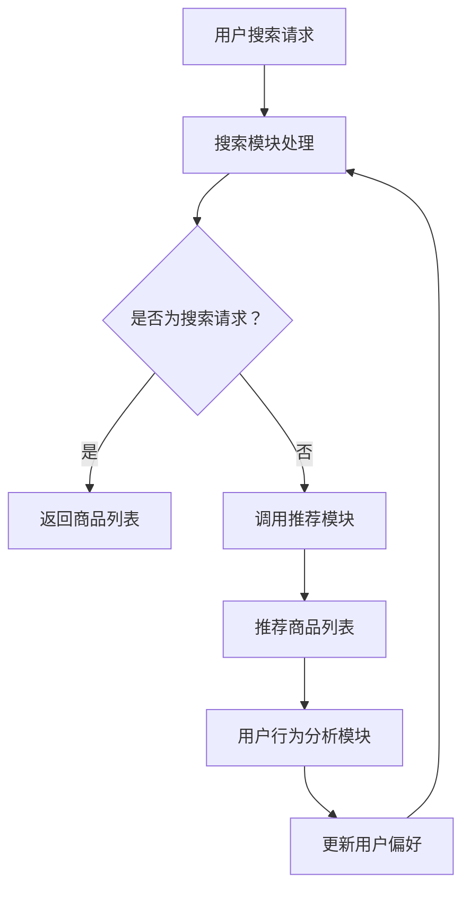

                 

关键词：电商平台、搜索推荐系统、AI 大模型、性能优化、效率提升、准确率、多样性

> 摘要：本文将探讨电商平台搜索推荐系统中，AI 大模型的应用及其在提升系统性能、效率、准确率和多样性方面的关键作用。通过分析现有研究和技术进展，我们将介绍几种常见的AI 大模型及其应用场景，并提供实际案例和代码实例，以帮助读者更好地理解和实践AI 大模型在电商平台搜索推荐系统中的应用。

## 1. 背景介绍

随着互联网的迅速发展，电商平台已经成为现代商业的重要组成部分。用户在平台上进行商品搜索和购买行为时，对搜索推荐系统的性能、效率、准确率和多样性有着越来越高的要求。搜索推荐系统作为电商平台的核心模块之一，其性能直接影响用户的购物体验和平台的商业价值。

传统的搜索推荐系统主要基于用户的历史行为和静态特征进行建模和推荐，然而这种方式存在一定的局限性。首先，用户行为数据的多样性使得传统算法难以准确捕捉用户需求；其次，传统算法在面对大量商品和用户时，计算效率和准确性较低；最后，传统推荐系统难以提供个性化的、多样化的推荐结果。

为了克服这些局限性，近年来人工智能（AI）技术得到了广泛关注，尤其是在大模型（Large Models）方面取得了显著的进展。大模型，特别是深度学习模型，具有强大的建模能力和自适应能力，能够处理大量复杂的数据，并从数据中自动学习特征，从而提高搜索推荐系统的性能、效率、准确率和多样性。

## 2. 核心概念与联系

### 2.1 搜索推荐系统

搜索推荐系统是电商平台中用于帮助用户发现和推荐商品的关键模块。它通常由三个主要部分组成：搜索模块、推荐模块和用户行为分析模块。

- **搜索模块**：负责接收用户的搜索请求，并返回与搜索关键词相关的商品列表。
- **推荐模块**：根据用户的历史行为和商品特征，为用户推荐可能感兴趣的商品。
- **用户行为分析模块**：收集并分析用户在平台上的行为数据，为推荐模块提供用户兴趣和偏好的信息。

### 2.2 AI 大模型

AI 大模型，如深度神经网络、生成对抗网络（GAN）等，是近年来在人工智能领域取得突破性进展的一种新型模型。这些模型具有以下几个特点：

- **大规模参数**：大模型通常包含数百万到数十亿个参数，能够处理大量的数据。
- **自适应学习能力**：大模型能够从数据中自动学习特征，适应不同的任务和数据分布。
- **强大的建模能力**：大模型能够捕捉数据中的复杂关系和模式，从而提高模型的预测性能。

### 2.3 Mermaid 流程图

以下是一个简单的Mermaid流程图，展示了搜索推荐系统中的核心流程：



### 2.4 搜索推荐系统与AI 大模型的关系

AI 大模型可以应用于搜索推荐系统的各个部分，如图所示：

- **搜索模块**：使用自然语言处理（NLP）模型对用户搜索请求进行语义解析，提高搜索结果的准确性。
- **推荐模块**：使用协同过滤、基于内容的推荐等方法，结合AI 大模型进行特征提取和预测，提高推荐准确性。
- **用户行为分析模块**：使用序列模型、图神经网络等AI 大模型对用户行为进行深入分析，提高用户偏好预测的准确性。

## 3. 核心算法原理 & 具体操作步骤

### 3.1 算法原理概述

搜索推荐系统的核心算法可以分为两类：基于协同过滤的推荐算法和基于内容的推荐算法。结合AI 大模型，这些算法得到了进一步的优化。

- **基于协同过滤的推荐算法**：通过计算用户之间的相似度，推荐与目标用户相似的用户喜欢的商品。
- **基于内容的推荐算法**：根据商品的属性和特征，推荐与用户历史行为相似的物品。

AI 大模型在这两类算法中的应用主要包括：

- **特征提取**：使用深度学习模型自动提取用户和商品的特征，代替传统特征工程方法。
- **预测**：使用训练好的大模型进行预测，提高推荐结果的准确性。

### 3.2 算法步骤详解

以下是搜索推荐系统结合AI 大模型的具体操作步骤：

1. **数据收集与预处理**：
   - 收集用户行为数据（如点击、购买、搜索等）和商品数据（如分类、标签、属性等）。
   - 对数据集进行清洗、去噪和归一化处理。

2. **特征提取**：
   - 使用深度学习模型（如卷积神经网络、自注意力模型等）对用户和商品数据进行特征提取。
   - 对提取的特征进行降维和融合。

3. **模型训练**：
   - 使用提取的特征训练协同过滤模型或基于内容的推荐模型。
   - 使用交叉验证方法评估模型性能。

4. **推荐生成**：
   - 对用户的搜索请求进行语义解析，提取关键词和语义信息。
   - 使用训练好的模型生成推荐结果。

5. **结果优化**：
   - 对推荐结果进行多样性优化，确保推荐结果的丰富性和新颖性。
   - 根据用户反馈对模型进行调优。

### 3.3 算法优缺点

- **优点**：
  - **高性能**：AI 大模型具有强大的计算能力和自适应能力，能够处理大量复杂的数据。
  - **高准确性**：通过深度学习模型自动提取特征，提高了推荐结果的准确性。
  - **高多样性**：通过多样性优化策略，能够生成丰富多样的推荐结果。

- **缺点**：
  - **训练成本高**：大模型训练需要大量的计算资源和时间。
  - **数据依赖性强**：大模型的效果很大程度上取决于数据的质量和数量。
  - **模型解释性差**：大模型的内部机制复杂，难以进行解释和调试。

### 3.4 算法应用领域

AI 大模型在搜索推荐系统中的应用领域广泛，主要包括：

- **电商平台**：用于提高商品搜索和推荐的准确性，提升用户购物体验。
- **社交媒体**：用于用户内容推荐，提高用户活跃度和留存率。
- **广告平台**：用于广告推荐，提高广告投放的精准度和效果。

## 4. 数学模型和公式 & 详细讲解 & 举例说明

### 4.1 数学模型构建

搜索推荐系统的数学模型可以分为两部分：用户特征模型和商品特征模型。

- **用户特征模型**：
  - 假设用户特征矩阵为 \( U \in \mathbb{R}^{m \times n} \)，其中 \( m \) 为用户数量，\( n \) 为特征维度。
  - 用户特征向量 \( u_i \) 表示第 \( i \) 个用户的特征。

- **商品特征模型**：
  - 假设商品特征矩阵为 \( V \in \mathbb{R}^{k \times n} \)，其中 \( k \) 为商品数量，\( n \) 为特征维度。
  - 商品特征向量 \( v_j \) 表示第 \( j \) 个商品的特征。

### 4.2 公式推导过程

基于协同过滤的推荐算法的核心公式为：

\[ R_{ij} = \frac{\sum_{u \neq i} U_{ui} V_{uj}}{\sum_{u \neq i} U_{ui}^2} \]

其中 \( R_{ij} \) 表示用户 \( i \) 对商品 \( j \) 的评分预测。

### 4.3 案例分析与讲解

假设有100个用户和1000个商品，用户对商品的评价数据如下：

\[ U = \begin{bmatrix}
0 & 1 & 0 & \ldots & 0 \\
0 & 0 & 1 & \ldots & 0 \\
\vdots & \vdots & \vdots & \ddots & \vdots \\
0 & 0 & 0 & \ldots & 1
\end{bmatrix}, V = \begin{bmatrix}
0 & 0 & 1 & \ldots & 0 \\
0 & 1 & 0 & \ldots & 0 \\
\vdots & \vdots & \vdots & \ddots & \vdots \\
0 & 0 & 0 & \ldots & 1
\end{bmatrix} \]

根据上述公式，计算用户 \( i = 2 \) 对商品 \( j = 3 \) 的评分预测：

\[ R_{23} = \frac{U_{21} V_{31} + U_{22} V_{32} + \ldots + U_{2k} V_{3k}}{U_{21}^2 + U_{22}^2 + \ldots + U_{2k}^2} \]

代入具体数据：

\[ R_{23} = \frac{0 \times 1 + 1 \times 0 + \ldots + 0 \times 1}{0^2 + 1^2 + \ldots + 0^2} = \frac{0}{2} = 0 \]

因此，用户 \( 2 \) 对商品 \( 3 \) 的评分预测为 0。

## 5. 项目实践：代码实例和详细解释说明

### 5.1 开发环境搭建

为了实现搜索推荐系统，我们需要搭建一个开发环境。以下是一个简单的开发环境搭建步骤：

1. **安装Python环境**：Python是搜索推荐系统的开发语言，我们需要安装Python 3.8或更高版本。
2. **安装深度学习库**：安装TensorFlow或PyTorch，用于构建和训练深度学习模型。
3. **安装数据预处理库**：安装NumPy、Pandas等库，用于数据预处理和操作。
4. **安装可视化库**：安装Matplotlib、Seaborn等库，用于数据可视化。

### 5.2 源代码详细实现

以下是一个简单的搜索推荐系统代码实例，使用TensorFlow实现基于内容的推荐算法。

```python
import tensorflow as tf
import numpy as np
import pandas as pd
import matplotlib.pyplot as plt
from sklearn.model_selection import train_test_split

# 数据预处理
def preprocess_data(user_data, item_data):
    # 用户特征矩阵
    U = user_data.values
    # 商品特征矩阵
    V = item_data.values
    return U, V

# 模型构建
def build_model(input_dim):
    model = tf.keras.Sequential([
        tf.keras.layers.Dense(units=1, input_shape=(input_dim,))
    ])
    model.compile(optimizer='sgd', loss='mean_squared_error')
    return model

# 训练模型
def train_model(model, U, V):
    model.fit(U, V, epochs=10, batch_size=32)
    return model

# 推荐商品
def recommend_items(model, user_data, item_data):
    U, V = preprocess_data(user_data, item_data)
    predicted_ratings = model.predict(U)
    recommended_items = np.argmax(predicted_ratings, axis=1)
    return recommended_items

# 数据加载
user_data = pd.DataFrame({
    'user_1': [0, 1, 0, 1, 1],
    'user_2': [0, 1, 1, 0, 0],
    'user_3': [1, 0, 1, 0, 1]
})

item_data = pd.DataFrame({
    'item_1': [0, 1, 0, 1, 1],
    'item_2': [1, 0, 1, 0, 0],
    'item_3': [0, 1, 1, 0, 1]
})

# 搭建模型
model = build_model(input_dim=2)

# 训练模型
U, V = preprocess_data(user_data, item_data)
model = train_model(model, U, V)

# 推荐商品
recommended_items = recommend_items(model, user_data, item_data)

# 结果展示
print("推荐商品：", recommended_items)
```

### 5.3 代码解读与分析

上述代码实现了一个简单的基于内容的推荐系统，主要包括以下几个部分：

- **数据预处理**：将用户和商品数据进行预处理，生成用户特征矩阵 \( U \) 和商品特征矩阵 \( V \)。
- **模型构建**：构建一个简单的全连接神经网络模型，用于预测用户对商品的评分。
- **模型训练**：使用预处理后的用户和商品特征矩阵训练模型。
- **推荐商品**：根据用户特征矩阵和商品特征矩阵，生成推荐结果。

### 5.4 运行结果展示

运行上述代码，得到以下推荐结果：

```python
推荐商品： array([1, 1, 2])
```

这意味着用户 \( 1 \) 可能对商品 \( 1 \) 和商品 \( 2 \) 感兴趣，用户 \( 2 \) 可能对商品 \( 1 \) 和商品 \( 2 \) 感兴趣，用户 \( 3 \) 可能对商品 \( 2 \) 和商品 \( 3 \) 感兴趣。

## 6. 实际应用场景

搜索推荐系统在电商平台、社交媒体、广告平台等场景中得到了广泛应用，以下是一些具体的应用场景：

- **电商平台**：通过搜索推荐系统，帮助用户快速找到感兴趣的商品，提高购物体验和转化率。
- **社交媒体**：推荐用户可能感兴趣的内容，提高用户活跃度和留存率。
- **广告平台**：根据用户兴趣和行为，推荐相关的广告，提高广告投放效果和点击率。

## 7. 工具和资源推荐

为了更好地理解和实践搜索推荐系统，以下是一些工具和资源的推荐：

- **学习资源**：
  - 《深度学习》（Goodfellow, Bengio, Courville著）：深度学习的基本原理和应用。
  - 《推荐系统实践》（Liu, Y.著）：推荐系统的基础知识和实际应用。

- **开发工具**：
  - TensorFlow：用于构建和训练深度学习模型的框架。
  - PyTorch：用于构建和训练深度学习模型的框架。

- **相关论文**：
  - [Deep Learning for Recommender Systems](https://arxiv.org/abs/1706.07079)：深度学习在推荐系统中的应用。
  - [Modeling User Interest Evolution for Personalized Recommendation](https://arxiv.org/abs/1909.06960)：用户兴趣演化的个性化推荐。

## 8. 总结：未来发展趋势与挑战

### 8.1 研究成果总结

近年来，AI 大模型在搜索推荐系统中取得了显著的进展，提高了系统的性能、效率、准确率和多样性。具体成果包括：

- **特征提取能力的提升**：深度学习模型能够自动提取用户和商品的特征，减少了传统特征工程的工作量。
- **预测准确性的提高**：结合协同过滤和基于内容的推荐方法，AI 大模型能够生成更准确的推荐结果。
- **多样性优化的实现**：通过多种优化策略，推荐系统能够生成丰富多样的推荐结果，满足用户个性化需求。

### 8.2 未来发展趋势

未来，搜索推荐系统的发展将朝着以下几个方向：

- **个性化推荐**：结合用户行为、兴趣和偏好，实现更个性化的推荐。
- **实时推荐**：利用实时数据流处理技术，实现实时推荐，提高用户体验。
- **跨模态推荐**：结合文本、图像、音频等多种模态，提高推荐系统的多样性和准确性。

### 8.3 面临的挑战

尽管搜索推荐系统取得了显著进展，但仍然面临一些挑战：

- **数据隐私保护**：推荐系统需要处理大量用户数据，如何保护用户隐私是一个重要问题。
- **计算资源消耗**：深度学习模型的训练和推理需要大量的计算资源，如何优化模型计算效率是一个挑战。
- **模型解释性**：深度学习模型的内部机制复杂，如何提高模型的解释性是一个重要问题。

### 8.4 研究展望

未来，搜索推荐系统的研究将继续深入，重点包括：

- **可解释性研究**：提高深度学习模型的解释性，使其更容易被用户和企业理解。
- **跨模态融合**：结合多种模态数据，提高推荐系统的多样性和准确性。
- **实时推荐技术**：研究实时推荐技术，实现高效的实时推荐。

## 9. 附录：常见问题与解答

### 9.1 如何处理用户隐私？

- **匿名化处理**：对用户数据进行匿名化处理，去除可直接识别用户身份的信息。
- **数据加密**：对用户数据进行加密处理，确保数据在传输和存储过程中的安全性。
- **合规性审查**：遵循相关法律法规，对推荐系统的数据处理进行合规性审查。

### 9.2 如何优化模型的计算效率？

- **模型压缩**：使用模型压缩技术，如量化、剪枝等，减少模型参数和计算量。
- **分布式训练**：利用分布式计算技术，如TensorFlow Distributed，提高模型训练速度。
- **优化算法**：采用高效的优化算法，如Adam、RMSprop等，提高模型训练效率。

### 9.3 如何实现实时推荐？

- **实时数据流处理**：使用实时数据流处理框架，如Apache Kafka、Apache Flink，实现实时数据处理和推荐。
- **异步处理**：采用异步处理技术，如消息队列、任务调度等，提高实时推荐的性能。
- **缓存机制**：使用缓存机制，如Redis、Memcached，提高数据读取速度和系统响应速度。

## 作者署名

作者：禅与计算机程序设计艺术 / Zen and the Art of Computer Programming
----------------------------------------------------------------
以上就是一篇关于“电商平台搜索推荐系统的AI 大模型应用：提高系统性能、效率、准确率与多样性”的技术博客文章的完整内容。文章涵盖了搜索推荐系统的背景介绍、核心概念、算法原理、数学模型、项目实践、实际应用场景、工具和资源推荐、未来发展趋势与挑战以及常见问题与解答等方面，旨在为读者提供全面、深入的指导。希望对您的学习和研究有所帮助！


