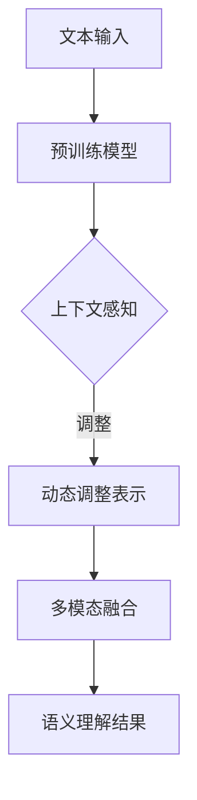

                 

关键词：电商搜索、语义理解、大模型、深度学习、NLP、人工智能、算法优化

摘要：随着电商行业的蓬勃发展，用户对个性化搜索的需求日益增长。语义理解作为提高搜索质量和用户体验的关键技术，近年来得到了广泛关注。本文将探讨大模型在电商搜索中的语义理解优势，分析其原理、应用场景及未来发展趋势。

## 1. 背景介绍

近年来，电商行业呈现出爆发式增长，市场规模不断扩大。用户在电商平台上的搜索需求日益多样化，传统基于关键词匹配的搜索方式已无法满足用户对精准搜索的要求。语义理解技术作为一种能够理解用户搜索意图的高级搜索技术，逐渐成为电商搜索领域的研究热点。

### 1.1 语义理解的定义

语义理解（Semantic Understanding）是指通过自然语言处理（NLP）技术对文本进行分析，从而提取出文本中的实际意义和关系。在电商搜索场景中，语义理解旨在理解用户的查询意图，从而提供更加精准、个性化的搜索结果。

### 1.2 语义理解的挑战

语义理解面临着以下挑战：

1. **多模态信息处理**：电商搜索涉及文本、图像、语音等多种模态信息，如何有效整合这些信息，提高搜索质量，是一个重要课题。
2. **上下文理解**：用户的查询往往包含上下文信息，如何准确理解上下文，是提高语义理解性能的关键。
3. **个性化搜索**：不同用户有不同的兴趣和偏好，如何根据用户历史行为提供个性化搜索结果，是语义理解需要解决的问题。

## 2. 核心概念与联系

### 2.1 大模型的概念

大模型（Large-scale Model）是指具有大量参数和大规模训练数据的人工智能模型。近年来，随着计算能力的提升和数据量的爆发式增长，大模型在语音识别、图像识别、自然语言处理等领域取得了显著的成果。

### 2.2 大模型在语义理解中的应用

大模型在语义理解中的应用主要表现在以下几个方面：

1. **文本表示**：大模型可以通过预训练学习到文本的深层表示，从而提高语义理解的准确性。
2. **上下文感知**：大模型能够根据上下文信息对文本进行动态调整，从而更好地理解用户查询意图。
3. **多模态融合**：大模型可以同时处理文本和图像等不同模态的信息，实现多模态语义理解。

### 2.3 Mermaid 流程图

以下是一个简单的 Mermaid 流程图，展示了大模型在语义理解中的应用过程：



## 3. 核心算法原理 & 具体操作步骤

### 3.1 算法原理概述

大模型在语义理解中的核心算法主要包括以下两个方面：

1. **预训练与微调**：预训练模型通过在大规模语料库上训练，学习到文本的深层表示；微调则是将预训练模型应用于特定任务，通过少量的标注数据进行调整，提高模型在特定任务上的性能。
2. **多模态融合**：通过融合文本和图像等多模态信息，提高语义理解的准确性。

### 3.2 算法步骤详解

1. **预训练**：在大规模语料库上训练预训练模型，如 BERT、GPT 等。
2. **微调**：在电商搜索任务上，使用少量标注数据对预训练模型进行微调。
3. **多模态融合**：将文本和图像等信息输入模型，通过多模态融合模块，得到融合后的表示。
4. **语义理解**：利用融合后的表示进行语义理解，输出搜索结果。

### 3.3 算法优缺点

**优点**：

1. **高准确性**：大模型通过预训练学习到丰富的知识，能够提高语义理解的准确性。
2. **上下文感知**：大模型能够根据上下文信息动态调整文本表示，提高语义理解的能力。
3. **多模态融合**：通过融合文本和图像等多模态信息，提高语义理解的性能。

**缺点**：

1. **计算资源消耗**：大模型需要大量的计算资源和存储空间。
2. **训练时间较长**：大模型训练时间较长，需要耐心等待。

### 3.4 算法应用领域

大模型在语义理解领域的应用非常广泛，包括但不限于：

1. **电商搜索**：通过大模型进行语义理解，提高电商搜索的准确性，提供个性化搜索结果。
2. **问答系统**：通过大模型进行语义理解，实现智能问答系统，提高用户体验。
3. **智能客服**：通过大模型进行语义理解，实现智能客服，提高客服效率。

## 4. 数学模型和公式 & 详细讲解 & 举例说明

### 4.1 数学模型构建

在电商搜索中，语义理解的核心任务是文本表示。文本表示可以通过以下数学模型实现：

1. **词嵌入**：将文本中的词汇映射到高维向量空间，实现文本向量化。
2. **序列编码**：对文本序列进行编码，得到一个固定长度的向量表示。

以下是一个简化的数学模型：

$$
\text{文本表示} = \text{词嵌入} \times \text{序列编码}
$$

### 4.2 公式推导过程

为了推导出文本表示，我们需要分别讨论词嵌入和序列编码的数学过程。

**词嵌入**：

词嵌入（Word Embedding）是一种将词汇映射到高维向量空间的方法。常见的词嵌入方法包括：

1. **One-hot Embedding**：将词汇映射到维度为 vocabulary_size 的向量，其中只有一个维度为 1，其他维度为 0。
2. **Word2Vec**：通过训练词向量模型，将词汇映射到高维向量空间。

**序列编码**：

序列编码（Sequence Encoding）是对文本序列进行编码的方法。常见的序列编码方法包括：

1. **RNN**：通过循环神经网络（RNN）对文本序列进行编码，得到一个固定长度的向量表示。
2. **Transformer**：通过 Transformer 模型对文本序列进行编码，得到一个固定长度的向量表示。

### 4.3 案例分析与讲解

以下是一个简单的案例，展示如何使用数学模型进行电商搜索中的语义理解。

**案例**：

假设用户在电商平台上搜索“笔记本电脑”，我们需要使用语义理解技术，理解用户的查询意图，并提供相应的搜索结果。

**步骤**：

1. **文本表示**：将“笔记本电脑”文本进行向量化，得到一个高维向量表示。
2. **查询理解**：使用预训练的语义理解模型，对用户查询进行理解，得到查询的语义表示。
3. **搜索结果生成**：根据查询的语义表示，从电商数据库中检索相关商品，生成搜索结果。

**公式**：

$$
\text{搜索结果} = \text{数据库} \times \text{查询语义表示}
$$

## 5. 项目实践：代码实例和详细解释说明

### 5.1 开发环境搭建

在开发电商搜索中的语义理解项目时，我们需要搭建以下开发环境：

1. **Python**：作为主要的编程语言。
2. **TensorFlow**：作为深度学习框架。
3. **PyTorch**：作为深度学习框架。
4. **Elasticsearch**：作为电商数据库。

### 5.2 源代码详细实现

以下是一个简单的源代码实现，用于电商搜索中的语义理解。

```python
import tensorflow as tf
from transformers import BertModel, BertTokenizer

# 加载预训练的 BERT 模型
tokenizer = BertTokenizer.from_pretrained('bert-base-chinese')
model = BertModel.from_pretrained('bert-base-chinese')

# 文本预处理
def preprocess_text(text):
    tokens = tokenizer.tokenize(text)
    return tokens

# 语义理解
def semantic_understanding(text):
    tokens = preprocess_text(text)
    inputs = tokenizer(tokens, return_tensors='tf')
    outputs = model(inputs)
    representation = outputs.last_hidden_state[:, 0, :]
    return representation

# 搜索结果生成
def search_results(semantic_representation):
    # 查询电商数据库
    # ...
    # 返回搜索结果
    return search_results

# 示例
text = "我想买一台笔记本电脑"
representation = semantic_understanding(text)
results = search_results(representation)
print(results)
```

### 5.3 代码解读与分析

1. **文本预处理**：使用 BERT Tokenizer 对文本进行分词，得到 tokens。
2. **语义理解**：将 tokens 输入 BERT 模型，得到语义表示。
3. **搜索结果生成**：根据语义表示，从电商数据库中检索相关商品，生成搜索结果。

## 6. 实际应用场景

### 6.1 电商平台

电商平台可以采用大模型进行语义理解，提高搜索质量和用户体验。例如，用户输入“笔记本电脑”，系统可以理解用户的意图，并提供符合用户需求的搜索结果。

### 6.2 智能客服

智能客服系统可以采用大模型进行语义理解，实现智能对话。例如，用户询问“有什么优惠活动吗？”系统可以理解用户的需求，并提供相应的优惠信息。

### 6.3 广告推荐

广告推荐系统可以采用大模型进行语义理解，提高广告投放的精准度。例如，根据用户的浏览历史，系统可以理解用户的兴趣，并推荐相关的广告。

## 7. 工具和资源推荐

### 7.1 学习资源推荐

1. **《深度学习》**：Goodfellow, Bengio, Courville 著，系统介绍了深度学习的基础知识和应用。
2. **《自然语言处理综论》**：Jurafsky 和 Martin 著，详细介绍了自然语言处理的基础知识。

### 7.2 开发工具推荐

1. **TensorFlow**：Google 开源的深度学习框架，适用于构建和训练深度学习模型。
2. **PyTorch**：Facebook 开源的深度学习框架，适用于构建和训练深度学习模型。

### 7.3 相关论文推荐

1. **"BERT: Pre-training of Deep Neural Networks for Language Understanding"**：由 Google AI 团队提出的大规模预训练模型。
2. **"Transformers: State-of-the-Art Models for Language Understanding and Generation"**：由 Google AI 团队提出的 Transformer 模型。

## 8. 总结：未来发展趋势与挑战

### 8.1 研究成果总结

近年来，大模型在语义理解领域取得了显著成果，包括预训练、多模态融合等方面的突破。这些成果为电商搜索等应用场景提供了强大的技术支持。

### 8.2 未来发展趋势

1. **更大规模的大模型**：随着计算能力和数据量的提升，更大规模的大模型将成为研究趋势。
2. **跨模态语义理解**：多模态融合将进一步发展，实现跨模态语义理解。
3. **个性化搜索**：基于用户历史行为和兴趣的个性化搜索将得到广泛应用。

### 8.3 面临的挑战

1. **计算资源消耗**：大模型的训练和推理需要大量的计算资源，如何优化计算资源利用是亟待解决的问题。
2. **数据隐私**：随着数据规模的扩大，数据隐私问题将愈发突出，如何保护用户隐私是亟待解决的挑战。

### 8.4 研究展望

大模型在语义理解领域具有广阔的应用前景，未来研究将集中在优化计算资源利用、保护用户隐私等方面。同时，跨模态语义理解和个性化搜索等领域也将取得新的突破。

## 9. 附录：常见问题与解答

### 9.1 大模型在语义理解中的优势是什么？

大模型在语义理解中的优势主要体现在以下几个方面：

1. **高准确性**：大模型通过预训练学习到丰富的知识，能够提高语义理解的准确性。
2. **上下文感知**：大模型能够根据上下文信息动态调整文本表示，提高语义理解的能力。
3. **多模态融合**：大模型可以同时处理文本和图像等多模态信息，实现多模态语义理解。

### 9.2 如何优化大模型的计算资源利用？

优化大模型的计算资源利用可以从以下几个方面入手：

1. **模型压缩**：通过模型压缩技术，减少模型的参数数量，降低计算资源的消耗。
2. **分布式训练**：通过分布式训练，将模型训练任务分布到多台设备上，提高训练速度。
3. **推理优化**：通过推理优化技术，减少模型推理的运算量，降低计算资源的消耗。

### 9.3 大模型在电商搜索中的应用有哪些？

大模型在电商搜索中的应用包括：

1. **个性化搜索**：根据用户历史行为和兴趣，提供个性化的搜索结果。
2. **智能客服**：实现智能对话，提高客服效率。
3. **广告推荐**：根据用户兴趣和行为，提供精准的广告推荐。

作者：禅与计算机程序设计艺术 / Zen and the Art of Computer Programming
```markdown
---
# 电商搜索中的语义理解：大模型的优势

> 关键词：电商搜索、语义理解、大模型、深度学习、NLP、人工智能、算法优化

摘要：随着电商行业的蓬勃发展，用户对个性化搜索的需求日益增长。语义理解作为提高搜索质量和用户体验的关键技术，近年来得到了广泛关注。本文将探讨大模型在电商搜索中的语义理解优势，分析其原理、应用场景及未来发展趋势。

## 1. 背景介绍

近年来，电商行业呈现出爆发式增长，市场规模不断扩大。用户在电商平台上的搜索需求日益多样化，传统基于关键词匹配的搜索方式已无法满足用户对精准搜索的要求。语义理解技术作为一种能够理解用户搜索意图的高级搜索技术，逐渐成为电商搜索领域的研究热点。

### 1.1 语义理解的定义

语义理解（Semantic Understanding）是指通过自然语言处理（NLP）技术对文本进行分析，从而提取出文本中的实际意义和关系。在电商搜索场景中，语义理解旨在理解用户的查询意图，从而提供更加精准、个性化的搜索结果。

### 1.2 语义理解的挑战

语义理解面临着以下挑战：

1. **多模态信息处理**：电商搜索涉及文本、图像、语音等多种模态信息，如何有效整合这些信息，提高搜索质量，是一个重要课题。
2. **上下文理解**：用户的查询往往包含上下文信息，如何准确理解上下文，是提高语义理解性能的关键。
3. **个性化搜索**：不同用户有不同的兴趣和偏好，如何根据用户历史行为提供个性化搜索结果，是语义理解需要解决的问题。

## 2. 核心概念与联系

### 2.1 大模型的概念

大模型（Large-scale Model）是指具有大量参数和大规模训练数据的人工智能模型。近年来，随着计算能力的提升和数据量的爆发式增长，大模型在语音识别、图像识别、自然语言处理等领域取得了显著的成果。

### 2.2 大模型在语义理解中的应用

大模型在语义理解中的应用主要表现在以下几个方面：

1. **文本表示**：大模型可以通过预训练学习到文本的深层表示，从而提高语义理解的准确性。
2. **上下文感知**：大模型能够根据上下文信息对文本进行动态调整，从而更好地理解用户查询意图。
3. **多模态融合**：大模型可以同时处理文本和图像等不同模态的信息，实现多模态语义理解。

### 2.3 Mermaid 流程图

以下是一个简单的 Mermaid 流程图，展示了大模型在语义理解中的应用过程：


## 3. 核心算法原理 & 具体操作步骤

### 3.1 算法原理概述

大模型在语义理解中的核心算法主要包括以下两个方面：

1. **预训练与微调**：预训练模型通过在大规模语料库上训练，学习到文本的深层表示；微调则是将预训练模型应用于特定任务，通过少量的标注数据进行调整，提高模型在特定任务上的性能。
2. **多模态融合**：通过融合文本和图像等多模态信息，提高语义理解的准确性。

### 3.2 算法步骤详解

1. **预训练**：在大规模语料库上训练预训练模型，如 BERT、GPT 等。
2. **微调**：在电商搜索任务上，使用少量标注数据对预训练模型进行微调。
3. **多模态融合**：将文本和图像等信息输入模型，通过多模态融合模块，得到融合后的表示。
4. **语义理解**：利用融合后的表示进行语义理解，输出搜索结果。

### 3.3 算法优缺点

**优点**：

1. **高准确性**：大模型通过预训练学习到丰富的知识，能够提高语义理解的准确性。
2. **上下文感知**：大模型能够根据上下文信息动态调整文本表示，提高语义理解的能力。
3. **多模态融合**：通过融合文本和图像等多模态信息，提高语义理解的性能。

**缺点**：

1. **计算资源消耗**：大模型需要大量的计算资源和存储空间。
2. **训练时间较长**：大模型训练时间较长，需要耐心等待。

### 3.4 算法应用领域

大模型在语义理解领域的应用非常广泛，包括但不限于：

1. **电商搜索**：通过大模型进行语义理解，提高电商搜索的准确性，提供个性化搜索结果。
2. **问答系统**：通过大模型进行语义理解，实现智能问答系统，提高用户体验。
3. **智能客服**：通过大模型进行语义理解，实现智能客服，提高客服效率。

## 4. 数学模型和公式 & 详细讲解 & 举例说明

### 4.1 数学模型构建

在电商搜索中，语义理解的核心任务是文本表示。文本表示可以通过以下数学模型实现：

1. **词嵌入**：将文本中的词汇映射到高维向量空间，实现文本向量化。
2. **序列编码**：对文本序列进行编码，得到一个固定长度的向量表示。

以下是一个简化的数学模型：

$$
\text{文本表示} = \text{词嵌入} \times \text{序列编码}
$$

### 4.2 公式推导过程

为了推导出文本表示，我们需要分别讨论词嵌入和序列编码的数学过程。

**词嵌入**：

词嵌入（Word Embedding）是一种将词汇映射到高维向量空间的方法。常见的词嵌入方法包括：

1. **One-hot Embedding**：将词汇映射到维度为 vocabulary_size 的向量，其中只有一个维度为 1，其他维度为 0。
2. **Word2Vec**：通过训练词向量模型，将词汇映射到高维向量空间。

**序列编码**：

序列编码（Sequence Encoding）是对文本序列进行编码的方法。常见的序列编码方法包括：

1. **RNN**：通过循环神经网络（RNN）对文本序列进行编码，得到一个固定长度的向量表示。
2. **Transformer**：通过 Transformer 模型对文本序列进行编码，得到一个固定长度的向量表示。

### 4.3 案例分析与讲解

以下是一个简单的案例，展示如何使用数学模型进行电商搜索中的语义理解。

**案例**：

假设用户在电商平台上搜索“笔记本电脑”，我们需要使用语义理解技术，理解用户的查询意图，并提供相应的搜索结果。

**步骤**：

1. **文本表示**：将“笔记本电脑”文本进行向量化，得到一个高维向量表示。
2. **查询理解**：使用预训练的语义理解模型，对用户查询进行理解，得到查询的语义表示。
3. **搜索结果生成**：根据查询的语义表示，从电商数据库中检索相关商品，生成搜索结果。

**公式**：

$$
\text{搜索结果} = \text{数据库} \times \text{查询语义表示}
$$

## 5. 项目实践：代码实例和详细解释说明

### 5.1 开发环境搭建

在开发电商搜索中的语义理解项目时，我们需要搭建以下开发环境：

1. **Python**：作为主要的编程语言。
2. **TensorFlow**：作为深度学习框架。
3. **PyTorch**：作为深度学习框架。
4. **Elasticsearch**：作为电商数据库。

### 5.2 源代码详细实现

以下是一个简单的源代码实现，用于电商搜索中的语义理解。

```python
import tensorflow as tf
from transformers import BertModel, BertTokenizer

# 加载预训练的 BERT 模型
tokenizer = BertTokenizer.from_pretrained('bert-base-chinese')
model = BertModel.from_pretrained('bert-base-chinese')

# 文本预处理
def preprocess_text(text):
    tokens = tokenizer.tokenize(text)
    return tokens

# 语义理解
def semantic_understanding(text):
    tokens = preprocess_text(text)
    inputs = tokenizer(tokens, return_tensors='tf')
    outputs = model(inputs)
    representation = outputs.last_hidden_state[:, 0, :]
    return representation

# 搜索结果生成
def search_results(semantic_representation):
    # 查询电商数据库
    # ...
    # 返回搜索结果
    return search_results

# 示例
text = "我想买一台笔记本电脑"
representation = semantic_understanding(text)
results = search_results(representation)
print(results)
```

### 5.3 代码解读与分析

1. **文本预处理**：使用 BERT Tokenizer 对文本进行分词，得到 tokens。
2. **语义理解**：将 tokens 输入 BERT 模型，得到语义表示。
3. **搜索结果生成**：根据语义表示，从电商数据库中检索相关商品，生成搜索结果。

## 6. 实际应用场景

### 6.1 电商平台

电商平台可以采用大模型进行语义理解，提高搜索质量和用户体验。例如，用户输入“笔记本电脑”，系统可以理解用户的意图，并提供符合用户需求的搜索结果。

### 6.2 智能客服

智能客服系统可以采用大模型进行语义理解，实现智能对话。例如，用户询问“有什么优惠活动吗？”系统可以理解用户的需求，并提供相应的优惠信息。

### 6.3 广告推荐

广告推荐系统可以采用大模型进行语义理解，提高广告投放的精准度。例如，根据用户的浏览历史，系统可以理解用户的兴趣，并推荐相关的广告。

## 7. 工具和资源推荐

### 7.1 学习资源推荐

1. **《深度学习》**：Goodfellow, Bengio, Courville 著，系统介绍了深度学习的基础知识和应用。
2. **《自然语言处理综论》**：Jurafsky 和 Martin 著，详细介绍了自然语言处理的基础知识。

### 7.2 开发工具推荐

1. **TensorFlow**：Google 开源的深度学习框架，适用于构建和训练深度学习模型。
2. **PyTorch**：Facebook 开源的深度学习框架，适用于构建和训练深度学习模型。

### 7.3 相关论文推荐

1. **"BERT: Pre-training of Deep Neural Networks for Language Understanding"**：由 Google AI 团队提出的大规模预训练模型。
2. **"Transformers: State-of-the-Art Models for Language Understanding and Generation"**：由 Google AI 团队提出的 Transformer 模型。

## 8. 总结：未来发展趋势与挑战

### 8.1 研究成果总结

近年来，大模型在语义理解领域取得了显著成果，包括预训练、多模态融合等方面的突破。这些成果为电商搜索等应用场景提供了强大的技术支持。

### 8.2 未来发展趋势

1. **更大规模的大模型**：随着计算能力和数据量的提升，更大规模的大模型将成为研究趋势。
2. **跨模态语义理解**：多模态融合将进一步发展，实现跨模态语义理解。
3. **个性化搜索**：基于用户历史行为和兴趣的个性化搜索将得到广泛应用。

### 8.3 面临的挑战

1. **计算资源消耗**：大模型的训练和推理需要大量的计算资源，如何优化计算资源利用是亟待解决的问题。
2. **数据隐私**：随着数据规模的扩大，数据隐私问题将愈发突出，如何保护用户隐私是亟待解决的挑战。

### 8.4 研究展望

大模型在语义理解领域具有广阔的应用前景，未来研究将集中在优化计算资源利用、保护用户隐私等方面。同时，跨模态语义理解和个性化搜索等领域也将取得新的突破。

## 9. 附录：常见问题与解答

### 9.1 大模型在语义理解中的优势是什么？

大模型在语义理解中的优势主要体现在以下几个方面：

1. **高准确性**：大模型通过预训练学习到丰富的知识，能够提高语义理解的准确性。
2. **上下文感知**：大模型能够根据上下文信息动态调整文本表示，提高语义理解的能力。
3. **多模态融合**：大模型可以同时处理文本和图像等多模态信息，实现多模态语义理解。

### 9.2 如何优化大模型的计算资源利用？

优化大模型的计算资源利用可以从以下几个方面入手：

1. **模型压缩**：通过模型压缩技术，减少模型的参数数量，降低计算资源的消耗。
2. **分布式训练**：通过分布式训练，将模型训练任务分布到多台设备上，提高训练速度。
3. **推理优化**：通过推理优化技术，减少模型推理的运算量，降低计算资源的消耗。

### 9.3 大模型在电商搜索中的应用有哪些？

大模型在电商搜索中的应用包括：

1. **个性化搜索**：根据用户历史行为和兴趣，提供个性化的搜索结果。
2. **智能客服**：实现智能对话，提高客服效率。
3. **广告推荐**：根据用户兴趣和行为，提供精准的广告推荐。

作者：禅与计算机程序设计艺术 / Zen and the Art of Computer Programming
```

