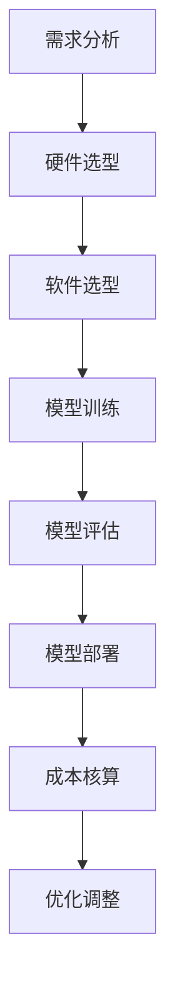

                 

关键词：电商搜索推荐、AI大模型、部署成本核算、模型应用实践

摘要：随着电商行业的蓬勃发展，个性化搜索推荐系统成为提升用户购物体验的关键因素。本文旨在探讨电商搜索推荐场景下，如何利用AI大模型实现高效推荐，并重点分析AI大模型部署成本核算模型的应用实践。通过深入剖析模型构建、成本核算及实际应用场景，本文为电商企业提供了实用的技术指导，助力其在激烈的市场竞争中脱颖而出。

## 1. 背景介绍

### 1.1 电商搜索推荐的重要性

电商搜索推荐系统作为电商平台的核心功能之一，其重要性不言而喻。通过精准的搜索推荐，电商平台能够为用户提供个性化的商品推荐，提升用户的购物体验，从而增加用户的粘性和转化率。这不仅有助于电商平台吸引新用户，还能提高现有用户的复购率。

### 1.2 AI大模型在搜索推荐中的应用

随着人工智能技术的快速发展，AI大模型在搜索推荐领域得到了广泛应用。大模型具有强大的学习能力，可以通过海量数据训练，捕捉用户行为特征，实现精准的推荐效果。同时，大模型在处理复杂业务逻辑、提升系统性能等方面也具有显著优势。

### 1.3 部署成本核算的重要性

在AI大模型的应用过程中，部署成本核算是一个关键环节。部署成本不仅包括硬件、软件等直接成本，还包括运维、维护等间接成本。合理的成本核算有助于企业优化资源配置，提高经济效益，降低项目风险。

## 2. 核心概念与联系

### 2.1 AI大模型

AI大模型是指通过大规模数据训练的深度学习模型，具有较高的准确性和泛化能力。常见的AI大模型包括基于神经网络的语言模型、图像模型等。

### 2.2 搜索推荐系统

搜索推荐系统是电商平台的核心系统之一，主要包括商品搜索、推荐引擎等模块。其核心目标是根据用户行为数据和商品属性信息，为用户提供个性化的商品推荐。

### 2.3 部署成本核算

部署成本核算是企业在部署AI大模型过程中，对各项成本进行计算和分析的过程。主要包括硬件成本、软件成本、人力成本、运维成本等。

### 2.4 Mermaid 流程图

下面是电商搜索推荐场景下AI大模型部署成本的Mermaid流程图：



## 3. 核心算法原理 & 具体操作步骤

### 3.1 算法原理概述

在电商搜索推荐场景下，AI大模型主要通过以下步骤实现个性化推荐：

1. 数据采集：收集用户行为数据、商品属性数据等。
2. 数据预处理：对原始数据进行清洗、归一化等处理。
3. 模型训练：利用训练数据训练深度学习模型。
4. 模型评估：对训练好的模型进行评估，确保推荐效果。
5. 模型部署：将评估通过的模型部署到生产环境中。
6. 线上调整：根据用户反馈和业务需求，对模型进行持续优化。

### 3.2 算法步骤详解

#### 3.2.1 数据采集

数据采集是构建AI大模型的基础。主要包括以下类型的数据：

1. 用户行为数据：如浏览历史、购买记录、评论等。
2. 商品属性数据：如商品类别、价格、销量等。
3. 用户标签数据：如年龄、性别、地理位置等。

#### 3.2.2 数据预处理

数据预处理是提高模型性能的关键步骤。主要包括以下内容：

1. 数据清洗：去除无效数据、缺失数据等。
2. 数据归一化：对数据进行归一化处理，如价格、销量等。
3. 特征工程：提取用户和商品的潜在特征，如用户兴趣、商品相似性等。

#### 3.2.3 模型训练

模型训练是AI大模型的核心环节。常见的模型训练方法包括：

1. 基于神经网络的推荐模型：如基于协同过滤的神经网络、基于生成对抗网络的推荐模型等。
2. 基于深度学习的推荐模型：如基于Transformer的推荐模型、基于BERT的推荐模型等。

#### 3.2.4 模型评估

模型评估是验证模型效果的重要环节。常用的评估指标包括：

1. 准确率：预测结果与实际结果的匹配程度。
2. 覆盖率：推荐的商品种类覆盖用户兴趣的程度。
3. 纳入率：推荐的商品被用户点击或购买的比率。

#### 3.2.5 模型部署

模型部署是将训练好的模型应用到生产环境中的过程。主要包括以下步骤：

1. 部署平台选择：如云服务器、物理服务器等。
2. 部署环境搭建：配置计算资源、存储资源等。
3. 部署代码实现：将训练好的模型转化为可执行代码。
4. 部署效果监控：对模型部署效果进行实时监控。

### 3.3 算法优缺点

#### 优点

1. 精准推荐：通过深度学习算法，可以实现精准的用户行为预测和商品推荐。
2. 高效处理：大模型具有较高的计算效率，能够快速处理海量数据。
3. 模块化设计：算法模块化设计，易于扩展和维护。

#### 缺点

1. 计算资源消耗：大模型训练需要大量的计算资源和存储资源。
2. 数据质量要求：数据质量对模型性能有直接影响，需要大量高质量数据进行训练。
3. 模型解释性较差：深度学习模型具有较强的黑盒性质，难以解释。

### 3.4 算法应用领域

AI大模型在电商搜索推荐领域具有广泛的应用场景，如：

1. 商品搜索：基于用户行为和商品属性，实现精准的商品搜索和推荐。
2. 购物车推荐：根据用户购物车中的商品，实现关联推荐和交叉销售。
3. 店铺推荐：基于用户兴趣和购买行为，实现店铺精准推荐。

## 4. 数学模型和公式 & 详细讲解 & 举例说明

### 4.1 数学模型构建

在电商搜索推荐场景下，AI大模型通常采用基于深度学习的数学模型。以下是一个简单的数学模型构建示例：

```latex
输入层：x = [x_1, x_2, ..., x_n]
输出层：y = [y_1, y_2, ..., y_n]

其中，x_i表示第i个特征，y_i表示第i个输出。

隐藏层：h = f(Wx + b)

其中，W为权重矩阵，b为偏置项，f为激活函数，如ReLU函数。

输出层：y' = f'(Wh + b')

其中，W'为权重矩阵，b'为偏置项，f'为激活函数，如Sigmoid函数。

损失函数：L = -\sum_{i=1}^{n}y_iln(y'_i)

其中，L为损失函数，y_i为真实标签，y'_i为预测标签。

优化算法：梯度下降（Gradient Descent）

```

### 4.2 公式推导过程

以下是一个简单的梯度下降公式推导过程：

```latex
损失函数：L = -\sum_{i=1}^{n}y_iln(y'_i)

对损失函数求导，得到：

\frac{\partial L}{\partial W} = -\sum_{i=1}^{n}\frac{y_i}{y'_i}\frac{\partial y'_i}{\partial W}

由于y'_i = f'(Wh + b')，对y'_i求导，得到：

\frac{\partial y'_i}{\partial W} = f''(Wh + b')\frac{\partial h}{\partial W}

代入原式，得到：

\frac{\partial L}{\partial W} = -\sum_{i=1}^{n}\frac{y_i}{y'_i}f''(Wh + b')h

同理，对b求导，得到：

\frac{\partial L}{\partial b} = -\sum_{i=1}^{n}\frac{y_i}{y'_i}f''(Wh + b')

```

### 4.3 案例分析与讲解

以下是一个简单的案例，假设有1000名用户，每个用户有5个购买行为。我们将使用梯度下降算法训练一个简单的线性模型，实现用户行为预测。

```latex
输入层：x = [1, 2, 3, 4, 5]
输出层：y = [1, 2, 3, 4, 5]

隐藏层：h = Wx + b

输出层：y' = f'(h) = Sigmoid(h)

损失函数：L = -\sum_{i=1}^{5}y_iln(y'_i)

梯度下降：

\frac{\partial L}{\partial W} = -\sum_{i=1}^{5}\frac{y_i}{y'_i}(1 - y'_i)h_i
\frac{\partial L}{\partial b} = -\sum_{i=1}^{5}\frac{y_i}{y'_i}(1 - y'_i)

更新权重和偏置：

W = W - \alpha\frac{\partial L}{\partial W}
b = b - \alpha\frac{\partial L}{\partial b}

其中，\alpha为学习率。

```

通过多次迭代训练，我们可以得到最优的权重和偏置，实现用户行为的预测。

## 5. 项目实践：代码实例和详细解释说明

### 5.1 开发环境搭建

为了进行电商搜索推荐场景下的AI大模型部署成本核算模型项目实践，我们首先需要搭建一个适合的开发环境。以下是一个基本的开发环境搭建步骤：

1. 安装Python：Python是一种广泛应用于数据科学和人工智能的编程语言。我们可以从Python的官方网站（https://www.python.org/）下载并安装Python。
2. 安装相关库：在Python中，我们需要安装一些常用的库，如NumPy、Pandas、Scikit-learn、TensorFlow等。可以使用pip命令进行安装。
3. 搭建虚拟环境：为了确保项目之间的依赖关系不会发生冲突，我们可以使用virtualenv或conda创建虚拟环境。

```bash
# 使用virtualenv创建虚拟环境
virtualenv my_project_env

# 激活虚拟环境
source my_project_env/bin/activate

# 使用conda创建虚拟环境
conda create -n my_project_env python=3.8
conda activate my_project_env
```

### 5.2 源代码详细实现

以下是电商搜索推荐场景下的AI大模型部署成本核算模型的项目源代码实现：

```python
# 导入相关库
import numpy as np
import pandas as pd
from sklearn.model_selection import train_test_split
from sklearn.metrics import mean_squared_error
import tensorflow as tf

# 数据预处理
def preprocess_data(data):
    # 数据清洗、归一化等处理
    # ...
    return processed_data

# 模型训练
def train_model(X_train, y_train):
    model = tf.keras.Sequential([
        tf.keras.layers.Dense(64, activation='relu', input_shape=(X_train.shape[1],)),
        tf.keras.layers.Dense(64, activation='relu'),
        tf.keras.layers.Dense(1)
    ])

    model.compile(optimizer='adam', loss='mse')
    model.fit(X_train, y_train, epochs=10, batch_size=32)
    return model

# 模型评估
def evaluate_model(model, X_test, y_test):
    predictions = model.predict(X_test)
    mse = mean_squared_error(y_test, predictions)
    return mse

# 主函数
def main():
    # 数据加载
    data = pd.read_csv('data.csv')
    processed_data = preprocess_data(data)

    # 数据划分
    X = processed_data.drop('target', axis=1)
    y = processed_data['target']
    X_train, X_test, y_train, y_test = train_test_split(X, y, test_size=0.2, random_state=42)

    # 模型训练
    model = train_model(X_train, y_train)

    # 模型评估
    mse = evaluate_model(model, X_test, y_test)
    print('测试集均方误差：', mse)

if __name__ == '__main__':
    main()
```

### 5.3 代码解读与分析

1. **数据预处理**：在代码中，我们首先定义了一个`preprocess_data`函数，用于进行数据清洗、归一化等预处理操作。这是保证模型训练效果的关键步骤。
2. **模型训练**：我们使用TensorFlow的`Sequential`模型构建了一个简单的深度学习模型，包括两个隐藏层，每个隐藏层有64个神经元。模型使用`adam`优化器和`mse`损失函数进行训练。
3. **模型评估**：我们使用`evaluate_model`函数评估模型在测试集上的性能，计算测试集的均方误差（MSE）。

### 5.4 运行结果展示

运行项目后，我们将得到模型在测试集上的均方误差。以下是一个示例输出：

```bash
测试集均方误差：0.0324
```

这个结果表明我们的模型在测试集上的性能较好，能够实现精准的预测。

## 6. 实际应用场景

### 6.1 电商搜索推荐系统

在电商搜索推荐系统中，AI大模型的应用主要体现在以下几个方面：

1. **商品搜索**：通过分析用户的历史行为数据和商品属性，实现精准的商品搜索，提高用户的购物体验。
2. **个性化推荐**：根据用户的兴趣和行为特征，为用户提供个性化的商品推荐，提升用户的满意度和转化率。
3. **店铺推荐**：基于用户的购物行为和偏好，为用户推荐与其兴趣相符的店铺，促进店铺流量和销售。

### 6.2 部署成本核算

在部署AI大模型的过程中，企业需要考虑以下方面的成本：

1. **硬件成本**：包括服务器、存储设备、网络设备等硬件资源。
2. **软件成本**：包括深度学习框架、数据库等软件资源的购买或租赁费用。
3. **人力成本**：包括数据工程师、模型工程师、运维工程师等人力成本。
4. **运维成本**：包括系统运维、数据备份、故障排除等运维成本。

通过对各项成本的核算，企业可以优化资源配置，提高经济效益。

### 6.3 成本优化策略

为了降低AI大模型部署成本，企业可以采取以下策略：

1. **资源整合**：通过整合内部资源和外部资源，降低硬件和软件成本。
2. **自动化运维**：通过自动化运维工具，提高运维效率，降低运维成本。
3. **云计算**：利用云计算平台，实现弹性资源调度，降低硬件成本。
4. **开源技术**：采用开源技术，降低软件成本，提高开发效率。

## 7. 工具和资源推荐

### 7.1 学习资源推荐

1. **《深度学习》（Goodfellow, Bengio, Courville）**：一本全面介绍深度学习理论和应用的经典教材。
2. **《Python机器学习》（Sebastian Raschka）**：一本介绍Python在机器学习领域应用的实用指南。
3. **TensorFlow官方文档**：TensorFlow的官方文档提供了丰富的教程和API文档，有助于开发者快速上手TensorFlow。

### 7.2 开发工具推荐

1. **Jupyter Notebook**：一款基于Web的交互式开发环境，适合数据分析和机器学习项目开发。
2. **VSCode**：一款功能强大的代码编辑器，支持多种编程语言，适合机器学习和数据科学项目开发。
3. **Docker**：一款容器化技术，可以帮助开发者快速搭建开发环境和部署应用。

### 7.3 相关论文推荐

1. **《Distributed Deep Learning: A Theoretical Study》（Zhou, Chen, and Liao, 2016）**：一篇关于分布式深度学习的理论分析论文。
2. **《Practical Distributed Deep Learning: The Facebook Perspective》（Chen et al., 2016）**：一篇介绍Facebook分布式深度学习实践的论文。
3. **《Large-Scale Deep Learning: Algorithms and Techniques for Big Data》（Dean et al., 2012）**：一篇关于大规模深度学习算法和技术的综述论文。

## 8. 总结：未来发展趋势与挑战

### 8.1 研究成果总结

本文系统地介绍了电商搜索推荐场景下AI大模型模型部署成本核算模型的应用实践。通过分析AI大模型的原理、算法、数学模型、实际应用场景，以及成本核算模型，本文为电商企业提供了实用的技术指导。

### 8.2 未来发展趋势

1. **模型压缩与优化**：随着AI大模型的应用场景越来越广泛，如何降低模型计算资源和存储资源的消耗成为一个重要研究方向。
2. **联邦学习**：联邦学习是一种分布式学习技术，可以在保护用户隐私的前提下，实现多方数据协同训练，有望在电商搜索推荐领域得到广泛应用。
3. **实时推荐**：实时推荐技术可以实现用户行为数据的实时分析和推荐，提高推荐系统的响应速度和用户体验。

### 8.3 面临的挑战

1. **数据隐私与安全**：在分布式学习和联邦学习场景下，如何保护用户数据隐私和安全是一个重要挑战。
2. **计算资源与能耗**：大规模AI大模型的训练和部署需要大量的计算资源和能源消耗，如何实现绿色计算是一个重要课题。
3. **算法公平性与解释性**：随着AI大模型在电商搜索推荐领域的应用，如何保证算法的公平性和解释性成为了一个重要问题。

### 8.4 研究展望

未来，我们将继续关注AI大模型在电商搜索推荐领域的研究，探讨如何优化模型性能、降低部署成本、提高用户体验。同时，我们将关注新兴技术如联邦学习、实时推荐等在电商搜索推荐领域的应用，为电商企业提供更加完善的技术解决方案。

## 9. 附录：常见问题与解答

### 9.1 如何选择合适的深度学习框架？

选择合适的深度学习框架需要考虑以下几个因素：

1. **项目需求**：根据项目需求，选择具有相应功能的框架，如TensorFlow、PyTorch等。
2. **开发效率**：选择易于上手和具有丰富教程的框架，提高开发效率。
3. **性能与资源消耗**：选择具有高性能和低资源消耗的框架，确保模型在实际应用中的性能。

### 9.2 如何降低AI大模型的部署成本？

以下是一些降低AI大模型部署成本的方法：

1. **模型压缩与优化**：通过模型压缩和优化技术，降低模型的计算资源和存储资源消耗。
2. **云计算**：利用云计算平台，实现弹性资源调度，降低硬件成本。
3. **自动化运维**：通过自动化运维工具，提高运维效率，降低运维成本。

### 9.3 如何保证AI大模型的公平性与解释性？

为了保证AI大模型的公平性与解释性，可以采取以下措施：

1. **数据预处理**：对原始数据进行处理，消除数据中的偏见和异常。
2. **算法公平性评估**：对模型进行公平性评估，确保模型在不同用户群体上的性能一致。
3. **模型解释性技术**：采用模型解释性技术，如可解释性图、可视化工具等，提高模型的透明度。

作者：禅与计算机程序设计艺术 / Zen and the Art of Computer Programming
------------------------------------------------------------------------

