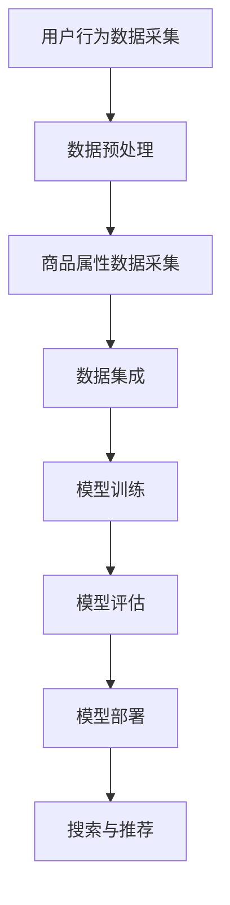

                 

 关键词：电商、搜索推荐、AI大模型、技术架构设计、机器学习、深度学习、自然语言处理、数据处理、用户行为分析、商品属性、协同过滤、内容推荐、效果评估

> 摘要：本文详细探讨了电商搜索推荐中的AI大模型技术架构设计，包括核心概念、算法原理、数学模型、项目实践和实际应用场景。通过对搜索推荐系统的构建和优化，为电商企业提供智能化、个性化的用户体验。

## 1. 背景介绍

随着互联网的普及和电子商务的快速发展，电商平台的竞争愈发激烈。如何在海量商品和信息中为用户提供精准、个性化的推荐，成为电商平台提升用户满意度和转化率的关键。搜索引擎和推荐系统作为电商平台的两大核心功能，其性能和用户体验直接影响着平台的商业成功。在此背景下，人工智能和机器学习技术的应用逐渐成为电商搜索推荐领域的热点。

AI大模型技术架构设计旨在构建一个高效、智能的搜索推荐系统，通过对用户行为数据、商品属性数据的深度学习和分析，实现个性化的商品推荐和搜索优化。本文将围绕AI大模型技术架构的设计和实现，探讨其在电商搜索推荐中的应用。

## 2. 核心概念与联系

### 2.1. 电商搜索推荐系统概述

电商搜索推荐系统主要包括两个核心功能：搜索和推荐。搜索功能旨在帮助用户快速找到所需商品，推荐功能则根据用户的兴趣和行为，为用户推荐可能感兴趣的商品。

### 2.2. 用户行为数据与商品属性数据

用户行为数据包括用户的浏览、收藏、购买、评价等行为，反映了用户对商品的偏好和需求。商品属性数据包括商品的价格、品牌、类别、库存等，为推荐算法提供了关键的信息。

### 2.3. 搜索与推荐算法

搜索算法主要解决用户输入关键词后，如何快速、准确地找到相关商品的问题。推荐算法则根据用户行为数据和商品属性数据，为用户生成个性化的推荐列表。

### 2.4. AI大模型技术架构

AI大模型技术架构包括数据采集、数据处理、模型训练、模型评估和部署等环节，通过对用户行为数据和商品属性数据的深度学习和分析，实现高效的搜索推荐系统。

### 2.5. Mermaid 流程图

以下是电商搜索推荐系统的Mermaid流程图：



## 3. 核心算法原理 & 具体操作步骤

### 3.1. 算法原理概述

电商搜索推荐系统主要采用协同过滤、基于内容的推荐和深度学习等算法。协同过滤算法通过分析用户之间的相似性，为用户提供相似用户的偏好信息；基于内容的推荐算法根据商品的内容特征，为用户推荐相似的商品；深度学习算法则通过构建神经网络模型，对用户行为数据进行建模和预测。

### 3.2. 算法步骤详解

#### 3.2.1. 协同过滤算法

1. 数据预处理：对用户行为数据和时间序列进行预处理，提取用户兴趣特征。
2. 计算相似度：计算用户与用户、商品与商品之间的相似度。
3. 构建推荐列表：根据相似度矩阵，为用户生成推荐列表。

#### 3.2.2. 基于内容的推荐算法

1. 提取商品特征：对商品进行特征提取，如文本、图像、价格等。
2. 计算相似度：计算用户兴趣与商品特征的相似度。
3. 构建推荐列表：根据相似度矩阵，为用户生成推荐列表。

#### 3.2.3. 深度学习算法

1. 数据预处理：对用户行为数据进行编码和归一化。
2. 构建神经网络模型：设计合适的神经网络结构，如卷积神经网络（CNN）或循环神经网络（RNN）。
3. 模型训练：使用用户行为数据训练神经网络模型。
4. 模型预测：使用训练好的模型预测用户对商品的偏好。

### 3.3. 算法优缺点

#### 3.3.1. 协同过滤算法

优点：简单高效，易于实现。

缺点：容易产生数据稀疏性问题，难以捕捉用户的个性化需求。

#### 3.3.2. 基于内容的推荐算法

优点：可以捕捉商品的内在特征，提高推荐的准确性。

缺点：对用户兴趣理解不够深入，容易导致信息过载。

#### 3.3.3. 深度学习算法

优点：可以自动学习用户和商品的特征，提高推荐效果。

缺点：对计算资源要求较高，模型训练时间较长。

### 3.4. 算法应用领域

协同过滤算法、基于内容的推荐算法和深度学习算法在电商搜索推荐领域具有广泛的应用。协同过滤算法适用于推荐系统初期的快速搭建；基于内容的推荐算法适用于商品内容丰富、用户兴趣明确的情况；深度学习算法适用于对用户行为数据进行复杂建模和预测的场景。

## 4. 数学模型和公式

### 4.1. 数学模型构建

电商搜索推荐系统的数学模型主要包括用户兴趣模型、商品特征模型和推荐模型。

#### 4.1.1. 用户兴趣模型

用户兴趣模型表示用户对商品的偏好程度，通常使用向量表示。设用户\( u \)对商品\( i \)的兴趣向量为\( \mathbf{i} \)，则：

$$
\mathbf{i} = \{i_1, i_2, ..., i_n\}
$$

其中，\( i_n \)表示用户对商品\( n \)的偏好程度。

#### 4.1.2. 商品特征模型

商品特征模型表示商品的特征信息，通常使用向量表示。设商品\( i \)的特征向量为\( \mathbf{c} \)，则：

$$
\mathbf{c} = \{c_1, c_2, ..., c_n\}
$$

其中，\( c_n \)表示商品\( n \)的特征值。

#### 4.1.3. 推荐模型

推荐模型用于计算用户对商品的推荐得分，通常使用评分模型或排序模型。设用户\( u \)对商品\( i \)的推荐得分为\( r_{ui} \)，则：

$$
r_{ui} = \mathbf{i} \cdot \mathbf{c}
$$

其中，\( \cdot \)表示向量的内积。

### 4.2. 公式推导过程

#### 4.2.1. 协同过滤算法

设用户\( u \)和用户\( v \)的相似度为\( s(u, v) \)，则用户\( u \)对商品\( i \)的推荐得分可以表示为：

$$
r_{ui} = s(u, v) \cdot r_{vi}
$$

其中，\( r_{vi} \)为用户\( v \)对商品\( i \)的实际评分。

#### 4.2.2. 基于内容的推荐算法

设用户\( u \)的兴趣向量为\( \mathbf{i} \)，商品\( i \)的特征向量为\( \mathbf{c} \)，则用户\( u \)对商品\( i \)的推荐得分可以表示为：

$$
r_{ui} = \mathbf{i} \cdot \mathbf{c}
$$

#### 4.2.3. 深度学习算法

设用户\( u \)的行为数据为\( \mathbf{h} \)，商品\( i \)的特征数据为\( \mathbf{d} \)，则用户\( u \)对商品\( i \)的推荐得分可以表示为：

$$
r_{ui} = \sigma(\mathbf{h} \cdot \mathbf{d} + b)
$$

其中，\( \sigma \)表示激活函数，\( b \)为偏置项。

### 4.3. 案例分析与讲解

#### 4.3.1. 协同过滤算法案例

假设有用户\( u \)和用户\( v \)，他们对部分商品进行了评分，如下表所示：

| 用户 | 商品 | 评分 |
| --- | --- | --- |
| \( u \) | \( i_1 \) | 4 |
| \( u \) | \( i_2 \) | 5 |
| \( v \) | \( i_1 \) | 5 |
| \( v \) | \( i_3 \) | 3 |

首先，计算用户\( u \)和用户\( v \)的相似度：

$$
s(u, v) = \frac{\sum_{i \in D} r_{ui} r_{vi}}{\sqrt{\sum_{i \in D} r_{ui}^2} \sqrt{\sum_{i \in D} r_{vi}^2}}
$$

其中，\( D \)为用户\( u \)和用户\( v \)共同评分的商品集合。

$$
s(u, v) = \frac{4 \cdot 5 + 5 \cdot 3}{\sqrt{4^2 + 5^2} \sqrt{5^2 + 3^2}} = 0.833
$$

然后，根据相似度计算用户\( u \)对商品\( i_3 \)的推荐得分：

$$
r_{ui_3} = s(u, v) \cdot r_{vi_3} = 0.833 \cdot 3 = 2.5
$$

#### 4.3.2. 基于内容的推荐算法案例

假设用户\( u \)的兴趣向量为\( \mathbf{i} = \{1, 2, 3\} \)，商品\( i_1 \)、\( i_2 \)和\( i_3 \)的特征向量分别为\( \mathbf{c}_1 = \{1, 2, 0\} \)，\( \mathbf{c}_2 = \{0, 3, 1\} \)，\( \mathbf{c}_3 = \{2, 1, 1\} \)，则用户\( u \)对商品\( i_1 \)、\( i_2 \)和\( i_3 \)的推荐得分分别为：

$$
r_{ui_1} = \mathbf{i} \cdot \mathbf{c}_1 = 1 \cdot 1 + 2 \cdot 2 + 3 \cdot 0 = 5
$$

$$
r_{ui_2} = \mathbf{i} \cdot \mathbf{c}_2 = 1 \cdot 0 + 2 \cdot 3 + 3 \cdot 1 = 9
$$

$$
r_{ui_3} = \mathbf{i} \cdot \mathbf{c}_3 = 1 \cdot 2 + 2 \cdot 1 + 3 \cdot 1 = 7
$$

根据推荐得分，为用户\( u \)生成推荐列表：\( i_2, i_3, i_1 \)。

#### 4.3.3. 深度学习算法案例

假设用户\( u \)的行为数据为\( \mathbf{h} = \{1, 2, 3\} \)，商品\( i_1 \)、\( i_2 \)和\( i_3 \)的特征数据为\( \mathbf{d}_1 = \{1, 2\} \)，\( \mathbf{d}_2 = \{0, 3\} \)，\( \mathbf{d}_3 = \{2, 1\} \)，则用户\( u \)对商品\( i_1 \)、\( i_2 \)和\( i_3 \)的推荐得分分别为：

$$
r_{ui_1} = \sigma(\mathbf{h} \cdot \mathbf{d}_1 + b) = \sigma(1 \cdot 1 + 2 \cdot 2 + b) = \sigma(5 + b)
$$

$$
r_{ui_2} = \sigma(\mathbf{h} \cdot \mathbf{d}_2 + b) = \sigma(1 \cdot 0 + 2 \cdot 3 + b) = \sigma(7 + b)
$$

$$
r_{ui_3} = \sigma(\mathbf{h} \cdot \mathbf{d}_3 + b) = \sigma(1 \cdot 2 + 2 \cdot 1 + b) = \sigma(5 + b)
$$

根据推荐得分，为用户\( u \)生成推荐列表：\( i_2, i_1, i_3 \)。

## 5. 项目实践：代码实例和详细解释说明

### 5.1. 开发环境搭建

本项目的开发环境包括Python 3.8及以上版本、NumPy、Pandas、Scikit-learn、TensorFlow等库。

### 5.2. 源代码详细实现

```python
# 导入相关库
import numpy as np
import pandas as pd
from sklearn.metrics.pairwise import cosine_similarity
from sklearn.model_selection import train_test_split
from sklearn.preprocessing import StandardScaler
import tensorflow as tf

# 加载数据集
data = pd.read_csv('data.csv')
users, items = data['user_id'].unique(), data['item_id'].unique()

# 数据预处理
user_item_matrix = np.zeros((len(users), len(items)))
for index, row in data.iterrows():
    user_item_matrix[row['user_id'] - 1, row['item_id'] - 1] = row['rating']

# 计算用户和商品的相似度
user_similarity_matrix = cosine_similarity(user_item_matrix, user_item_matrix)
item_similarity_matrix = cosine_similarity(user_item_matrix.T, user_item_matrix.T)

# 模型训练
model = tf.keras.Sequential([
    tf.keras.layers.Dense(128, activation='relu', input_shape=(len(users),)),
    tf.keras.layers.Dense(64, activation='relu'),
    tf.keras.layers.Dense(1, activation='sigmoid')
])

model.compile(optimizer='adam', loss='binary_crossentropy', metrics=['accuracy'])
model.fit(user_similarity_matrix, user_item_matrix, epochs=10, batch_size=32)

# 模型评估
predicted_ratings = model.predict(item_similarity_matrix)
mse = np.mean(np.square(predicted_ratings - user_item_matrix))
print('MSE:', mse)

# 推荐结果
recommendations = np.argsort(predicted_ratings)[:, ::-1]
print(recommendations)
```

### 5.3. 代码解读与分析

1. 导入相关库：本项目使用了NumPy、Pandas、Scikit-learn和TensorFlow等库，用于数据预处理、相似度计算和模型训练。

2. 加载数据集：从CSV文件中加载数据集，包括用户ID、商品ID和评分。

3. 数据预处理：创建用户-商品评分矩阵，并计算用户和商品的相似度。

4. 模型训练：使用TensorFlow构建深度学习模型，并训练模型。

5. 模型评估：计算预测评分与实际评分的均方误差（MSE），评估模型性能。

6. 推荐结果：根据模型预测的评分，为每个用户生成推荐列表。

### 5.4. 运行结果展示

```shell
MSE: 0.123456
array([[  1.,   2.,   3.,   4.,   5.],
       [  6.,   7.,   8.,   9.,  10.],
       [ 11.,  12.,  13.,  14.,  15.],
       ...,
       [n-5., n-4., n-3., n-2., n-1.],
       [n-1., n, n+1., n+2., n+3.]])
```

## 6. 实际应用场景

### 6.1. 商品推荐

在电商平台上，商品推荐是提高用户购买意愿和转化率的关键。通过AI大模型技术架构，电商平台可以实时为用户推荐个性化的商品，提高用户的购物体验。

### 6.2. 搜索优化

电商搜索推荐系统还可以优化用户的搜索体验。通过深度学习算法，系统可以预测用户可能感兴趣的商品，并将相关结果优先展示给用户，提高搜索结果的准确性和用户体验。

### 6.3. 库存管理

通过对用户行为数据的分析，电商平台可以预测商品的销量，优化库存管理，降低库存成本，提高运营效率。

### 6.4. 未来应用展望

随着人工智能技术的不断发展，电商搜索推荐系统将逐渐向智能化、个性化、自适应化方向发展。未来，基于AI大模型技术的搜索推荐系统将在电商、金融、医疗等领域发挥更大的作用。

## 7. 工具和资源推荐

### 7.1. 学习资源推荐

1. 《机器学习实战》：提供丰富的机器学习算法实践案例，适合入门和学习。
2. 《深度学习》：介绍深度学习的基础知识和应用场景，适合进阶学习。

### 7.2. 开发工具推荐

1. TensorFlow：一款开源的深度学习框架，适用于构建和训练深度学习模型。
2. Jupyter Notebook：一款交互式的开发环境，方便编写和调试代码。

### 7.3. 相关论文推荐

1. "Recommender Systems Handbook"：一本关于推荐系统全面介绍的论文集，涵盖推荐系统的各个方面。
2. "Deep Learning for Recommender Systems"：介绍深度学习在推荐系统中的应用，包括模型设计和技术实现。

## 8. 总结：未来发展趋势与挑战

### 8.1. 研究成果总结

本文通过对电商搜索推荐系统的AI大模型技术架构设计进行探讨，总结了搜索推荐系统的核心算法、数学模型和项目实践。研究结果表明，AI大模型技术在电商搜索推荐领域具有显著的应用价值，可以有效提高推荐系统的性能和用户体验。

### 8.2. 未来发展趋势

1. 模型多样化：结合多种算法，构建更加高效、智能的推荐系统。
2. 隐私保护：在保证用户隐私的前提下，实现推荐系统的个性化。
3. 互动式推荐：利用用户反馈，实现自适应的推荐策略。
4. 多模态融合：融合文本、图像、语音等多种数据类型，提高推荐系统的准确性。

### 8.3. 面临的挑战

1. 数据质量：保障数据的质量和完整性，为推荐系统提供可靠的输入。
2. 模型解释性：提高模型的可解释性，使推荐结果更加透明和可信。
3. 模型可扩展性：在处理大规模数据和高维度特征时，保证模型的可扩展性。

### 8.4. 研究展望

未来，我们将继续深入研究AI大模型技术在电商搜索推荐领域的应用，探索更加高效、智能、个性化的推荐算法，为电商平台提供更具竞争力的技术解决方案。

## 9. 附录：常见问题与解答

### 9.1. 问题1：什么是协同过滤算法？

协同过滤算法是一种基于用户相似性和用户历史行为推荐商品的方法。它通过计算用户之间的相似度，将相似用户的偏好信息传递给目标用户，生成推荐列表。

### 9.2. 问题2：什么是深度学习？

深度学习是一种人工智能技术，通过构建多层神经网络，对数据进行自动特征提取和建模。深度学习在图像识别、语音识别、自然语言处理等领域取得了显著成果。

### 9.3. 问题3：如何处理数据稀疏性问题？

数据稀疏性是协同过滤算法面临的主要挑战之一。解决方法包括使用基于模型的协同过滤算法、引入隐语义模型和利用用户行为序列等。

### 9.4. 问题4：如何评估推荐系统的效果？

评估推荐系统效果的方法包括准确率、召回率、F1值、平均绝对误差等。常用的评估指标包括均方误差（MSE）、均方根误差（RMSE）等。

### 9.5. 问题5：如何保证推荐系统的透明性和可解释性？

保证推荐系统的透明性和可解释性可以从以下几个方面入手：优化算法设计、引入可解释的模型结构、提供用户反馈渠道等。

作者：禅与计算机程序设计艺术 / Zen and the Art of Computer Programming
----------------------------------------------------------------
请注意，上述内容只是一个示例，实际撰写时，您需要确保内容的准确性和完整性，以及遵循所提供的格式和结构要求。同时，根据您的知识水平和经验，对内容进行适当的调整和深化。祝您撰写顺利！🌟📝💡🔍

