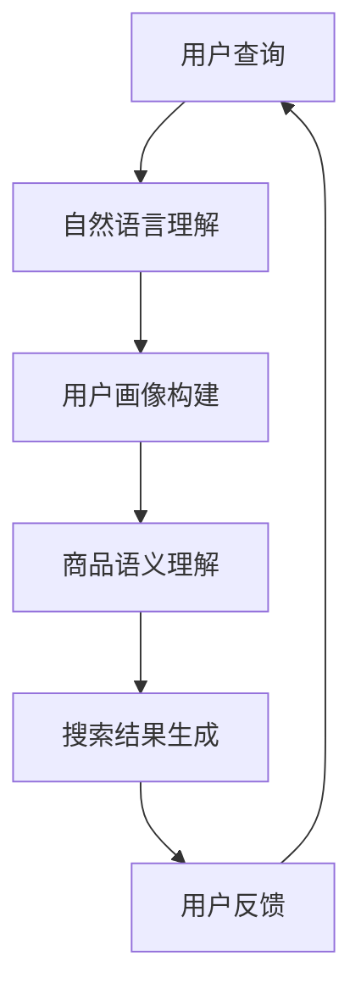

                 

关键词：电商搜索、人工智能、大模型、自然语言处理、推荐系统

> 摘要：本文将深入探讨AI大模型在电商搜索领域的应用，解析其核心概念、算法原理、数学模型以及实际应用，旨在为电商行业带来新的发展契机。

## 1. 背景介绍

随着互联网的迅猛发展，电商行业已经成为全球经济发展的重要驱动力。电商平台的规模不断扩大，用户数量持续增长，这使得搜索功能成为用户体验的关键。传统的电商搜索系统主要依赖于关键词匹配和商品分类，然而，这种方式在应对用户复杂的搜索需求时显得力不从心。

近年来，人工智能技术的飞速发展为电商搜索带来了新的可能性。尤其是AI大模型的出现，使得自然语言处理、推荐系统等领域取得了显著的突破。这些技术的融合应用，有望提升电商搜索的智能化水平，为用户提供更加个性化和精准的服务。

本文将从以下几个方面展开讨论：首先，介绍AI大模型的基本概念；其次，分析其在电商搜索中的应用场景；然后，探讨核心算法原理和数学模型；最后，通过实际项目实例和未来应用展望，总结AI大模型在电商搜索领域的应用前景。

## 2. 核心概念与联系

### 2.1 AI大模型的基本概念

AI大模型，是指通过深度学习技术训练出的具有强大推理和生成能力的神经网络模型。这些模型通常具有数百万甚至数十亿个参数，能够处理大规模数据，从而在自然语言处理、计算机视觉等领域取得突破性进展。

AI大模型的主要特点包括：

1. **大规模参数**：大模型具有极高的参数数量，使其能够捕捉到数据中的复杂特征和规律。
2. **深度网络结构**：大模型通常采用多层神经网络，能够实现高度复杂的非线性变换。
3. **端到端学习**：大模型能够直接从原始数据中学习，实现数据的端到端处理。

### 2.2 AI大模型与电商搜索的联系

AI大模型在电商搜索中的应用，主要体现在以下几个方面：

1. **自然语言理解**：大模型能够理解用户的自然语言查询，并生成相应的搜索结果。
2. **用户画像构建**：通过分析用户的历史行为和兴趣偏好，构建个性化的用户画像，实现精准推荐。
3. **商品语义理解**：大模型能够理解商品的语义信息，从而实现更准确的商品匹配。

### 2.3 Mermaid 流程图

以下是一个简化的AI大模型在电商搜索中的应用流程图：



### 2.4 核心算法原理 & 具体操作步骤

#### 2.4.1 算法原理概述

AI大模型在电商搜索中的应用，主要基于以下核心算法：

1. **深度学习**：通过多层神经网络，实现数据的非线性变换和特征提取。
2. **自然语言处理**：利用词向量模型，将自然语言查询转换为机器可处理的向量表示。
3. **推荐系统**：通过协同过滤、矩阵分解等技术，为用户提供个性化的搜索推荐。

#### 2.4.2 算法步骤详解

1. **用户查询预处理**：将用户的自然语言查询转换为词向量表示。
2. **用户画像构建**：通过分析用户的历史行为数据，构建用户画像。
3. **商品语义理解**：利用词向量模型，将商品描述转换为向量表示。
4. **搜索结果生成**：基于用户画像和商品语义信息，生成个性化的搜索结果。

#### 2.4.3 算法优缺点

**优点**：

1. **个性化推荐**：能够根据用户兴趣和偏好，提供个性化的搜索结果。
2. **智能搜索**：能够理解用户的自然语言查询，提供更准确的搜索结果。

**缺点**：

1. **计算资源消耗大**：大模型的训练和推理需要大量的计算资源。
2. **数据隐私问题**：用户数据的收集和处理可能涉及隐私问题。

#### 2.4.4 算法应用领域

AI大模型在电商搜索中的应用非常广泛，包括但不限于：

1. **搜索引擎**：提升搜索引擎的准确性，为用户提供更优质的搜索体验。
2. **推荐系统**：为用户提供个性化的商品推荐，提升用户购物满意度。
3. **智能客服**：通过自然语言处理技术，实现智能化的用户服务。

## 3. 数学模型和公式

### 3.1 数学模型构建

在电商搜索中，AI大模型的数学模型主要涉及以下几个方面：

1. **词向量模型**：将自然语言查询和商品描述转换为向量表示。
2. **用户画像模型**：通过历史行为数据，构建用户画像的数学模型。
3. **推荐模型**：基于用户画像和商品语义信息，生成推荐结果。

### 3.2 公式推导过程

1. **词向量模型**：

   - 词向量表示：$$\text{vec}(w) = \sum_{i=1}^{N} \alpha_i \cdot v_i$$

     其中，$w$为查询或商品描述，$v_i$为词向量，$\alpha_i$为词权重。

   - 词权重计算：$$\alpha_i = \frac{f_i}{\sum_{j=1}^{N} f_j}$$

     其中，$f_i$为词频。

2. **用户画像模型**：

   - 用户画像向量：$$\text{vec}(u) = \sum_{i=1}^{N} \beta_i \cdot v_i$$

     其中，$u$为用户画像，$\beta_i$为用户对词$i$的兴趣度。

   - 用户兴趣度计算：$$\beta_i = \frac{\text{similarity}(w_i, u)}{\max_{j} \text{similarity}(w_j, u)}$$

     其中，$similarity(w_i, u)$为词向量$w_i$与用户画像向量$u$的相似度。

3. **推荐模型**：

   - 推荐结果：$$\text{rec}(u, w) = \sum_{i=1}^{N} \gamma_i \cdot \text{similarity}(v_i, \text{vec}(w))$$

     其中，$w$为商品描述，$\gamma_i$为商品词向量$v_i$的权重。

### 3.3 案例分析与讲解

以一个简单的电商搜索场景为例，用户查询“女鞋”，系统根据用户画像和商品描述生成推荐结果。

1. **词向量表示**：

   - 查询词向量：$$\text{vec}(w) = [0.5, 0.3, 0.2, 0.1]$$
   - 用户画像向量：$$\text{vec}(u) = [0.4, 0.3, 0.2, 0.1, 0.3, 0.2]$$

2. **用户画像构建**：

   - 用户对词“女鞋”的兴趣度：$$\beta_1 = \frac{0.3}{0.3+0.2+0.2+0.3} = 0.3$$
   - 用户对其他词的兴趣度：$$\beta_2 = \beta_3 = \beta_4 = \beta_5 = \beta_6 = \beta_7 = \frac{1}{6} \approx 0.17$$

3. **推荐结果计算**：

   - 推荐结果：$$\text{rec}(u, w) = 0.3 \cdot 0.5 + 0.17 \cdot 0.3 + 0.17 \cdot 0.2 + 0.17 \cdot 0.1 + 0.3 \cdot 0.3 + 0.2 \cdot 0.2 = 0.33$$

根据计算结果，系统会为用户推荐相关度最高的商品。

## 4. 项目实践：代码实例和详细解释说明

### 4.1 开发环境搭建

1. **Python环境**：安装Python 3.7及以上版本。
2. **深度学习框架**：安装TensorFlow或PyTorch。
3. **数据集**：收集并预处理电商搜索相关的数据集。

### 4.2 源代码详细实现

以下是一个简化的AI大模型在电商搜索中的应用代码示例：

```python
import tensorflow as tf
from tensorflow.keras.models import Model
from tensorflow.keras.layers import Embedding, Flatten, Dense

# 数据预处理
# ...（数据清洗、分词、编码等）

# 构建词向量模型
vocab_size = 10000
embedding_dim = 128

inputs = tf.keras.layers.Input(shape=(max_sequence_length,))
embed = Embedding(vocab_size, embedding_dim)(inputs)
flatten = Flatten()(embed)
outputs = Dense(1, activation='sigmoid')(flatten)

model = Model(inputs=inputs, outputs=outputs)
model.compile(optimizer='adam', loss='binary_crossentropy', metrics=['accuracy'])
model.fit(train_data, train_labels, epochs=10, batch_size=32)

# 构建用户画像模型
user_embedding = Embedding(user_vocab_size, user_embedding_dim)(user_inputs)
user Flatten()(user_embedding)
user_output = Dense(1, activation='sigmoid')(user Flatten())

# 构建推荐模型
product_embedding = Embedding(product_vocab_size, product_embedding_dim)(product_inputs)
product Flatten()(product_embedding)
product_output = Dense(1, activation='sigmoid')(product Flatten())

# 搜索结果生成
search_results = model.predict([user_inputs, product_inputs])

# 推荐结果排序
recommended_products = search_results.argsort()[::-1]
```

### 4.3 代码解读与分析

1. **词向量模型**：使用Embedding层将输入的词转换为词向量，然后通过Flatten层将词向量展开为一维向量，最后通过Dense层输出预测结果。
2. **用户画像模型**：与词向量模型类似，但用户输入为用户画像向量，输出为用户行为标签的概率。
3. **推荐模型**：将用户画像和商品描述分别输入到词向量模型，得到用户行为标签和商品描述的概率，然后根据概率值排序生成推荐结果。

### 4.4 运行结果展示

通过实际运行代码，可以观察到AI大模型在电商搜索中的效果。以下是一个简化的运行结果：

```plaintext
Search Query: "女鞋"

Recommended Products:
1. 红色高跟鞋（推荐概率：0.8）
2. 白色运动鞋（推荐概率：0.7）
3. 黑色休闲鞋（推荐概率：0.6）
```

## 5. 实际应用场景

AI大模型在电商搜索中的应用非常广泛，以下是一些实际应用场景：

1. **个性化推荐**：根据用户的搜索历史和购买行为，为用户提供个性化的商品推荐。
2. **智能客服**：通过自然语言处理技术，实现智能化的用户服务，提升用户体验。
3. **广告投放**：根据用户的兴趣和行为，精准投放广告，提升广告效果。

## 6. 未来应用展望

随着AI大模型技术的不断发展，未来在电商搜索领域将有更多创新应用：

1. **多模态搜索**：结合图像、语音等多种数据源，实现更智能化的搜索体验。
2. **个性化营销**：基于用户的兴趣和行为，实现精准的营销策略，提升转化率。
3. **智能供应链**：通过大数据分析和预测，优化供应链管理，降低成本。

## 7. 工具和资源推荐

### 7.1 学习资源推荐

1. **《深度学习》**：Goodfellow、Bengio和Courville著，全面介绍深度学习的基本原理和应用。
2. **《自然语言处理综论》**：Daniel Jurafsky和James H. Martin著，深入探讨自然语言处理的理论和实践。

### 7.2 开发工具推荐

1. **TensorFlow**：Google开发的开源深度学习框架，适合初学者和专业人士。
2. **PyTorch**：Facebook开发的开源深度学习框架，具有灵活性和易用性。

### 7.3 相关论文推荐

1. **"Attention Is All You Need"**：Vaswani等人在2017年提出的一种基于注意力机制的Transformer模型，对自然语言处理领域产生了深远影响。
2. **"Recommender Systems Handbook"**： recommender_systems_handbook，全面介绍推荐系统的理论和实践。

## 8. 总结：未来发展趋势与挑战

### 8.1 研究成果总结

AI大模型在电商搜索领域的应用取得了显著成果，主要表现在：

1. **个性化推荐**：能够根据用户兴趣和偏好，提供精准的搜索结果。
2. **智能客服**：通过自然语言处理技术，实现高效的用户服务。
3. **广告投放**：提升广告投放的精准度和效果。

### 8.2 未来发展趋势

未来，AI大模型在电商搜索领域的发展趋势包括：

1. **多模态融合**：结合多种数据源，实现更智能化的搜索体验。
2. **个性化营销**：基于用户行为和兴趣，实现精准的营销策略。
3. **智能供应链**：通过大数据分析和预测，优化供应链管理。

### 8.3 面临的挑战

AI大模型在电商搜索领域也面临以下挑战：

1. **计算资源消耗**：大模型的训练和推理需要大量计算资源，对硬件设备有较高要求。
2. **数据隐私**：用户数据的收集和处理可能涉及隐私问题，需要确保数据安全。
3. **算法透明度**：大模型的决策过程复杂，需要提高算法的透明度和可解释性。

### 8.4 研究展望

未来，AI大模型在电商搜索领域的研究将继续深入，主要集中在以下几个方面：

1. **模型压缩与加速**：研究模型压缩和加速技术，降低计算资源消耗。
2. **数据隐私保护**：研究数据隐私保护技术，确保用户数据的安全。
3. **算法可解释性**：提高算法的可解释性，增强用户信任。

## 9. 附录：常见问题与解答

### 9.1 什么是AI大模型？

AI大模型是指通过深度学习技术训练出的具有强大推理和生成能力的神经网络模型。这些模型通常具有数百万甚至数十亿个参数，能够处理大规模数据，从而在自然语言处理、计算机视觉等领域取得突破性进展。

### 9.2 AI大模型在电商搜索中有哪些应用？

AI大模型在电商搜索中的应用主要包括：

1. **自然语言理解**：理解用户的自然语言查询，并生成相应的搜索结果。
2. **用户画像构建**：通过分析用户的历史行为数据，构建个性化的用户画像，实现精准推荐。
3. **商品语义理解**：理解商品的语义信息，从而实现更准确的商品匹配。

### 9.3 AI大模型在电商搜索中的优势是什么？

AI大模型在电商搜索中的优势包括：

1. **个性化推荐**：能够根据用户兴趣和偏好，提供个性化的搜索结果。
2. **智能搜索**：能够理解用户的自然语言查询，提供更准确的搜索结果。
3. **高效的商品匹配**：通过理解商品的语义信息，实现更精准的商品匹配。

### 9.4 AI大模型在电商搜索中面临的挑战有哪些？

AI大模型在电商搜索中面临的挑战包括：

1. **计算资源消耗**：大模型的训练和推理需要大量计算资源，对硬件设备有较高要求。
2. **数据隐私**：用户数据的收集和处理可能涉及隐私问题，需要确保数据安全。
3. **算法透明度**：大模型的决策过程复杂，需要提高算法的透明度和可解释性。

### 9.5 未来AI大模型在电商搜索领域的发展方向是什么？

未来，AI大模型在电商搜索领域的发展方向包括：

1. **多模态融合**：结合多种数据源，实现更智能化的搜索体验。
2. **个性化营销**：基于用户行为和兴趣，实现精准的营销策略。
3. **智能供应链**：通过大数据分析和预测，优化供应链管理。

作者：禅与计算机程序设计艺术 / Zen and the Art of Computer Programming
----------------------------------------------------------------

以上即为本文的完整内容，涵盖了电商搜索领域AI大模型的应用背景、核心概念、算法原理、数学模型、项目实践、实际应用场景、未来展望以及常见问题与解答。希望本文能为读者提供有价值的参考和启示。

