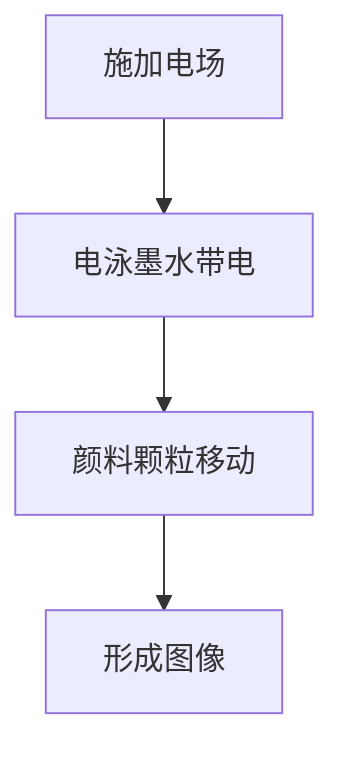
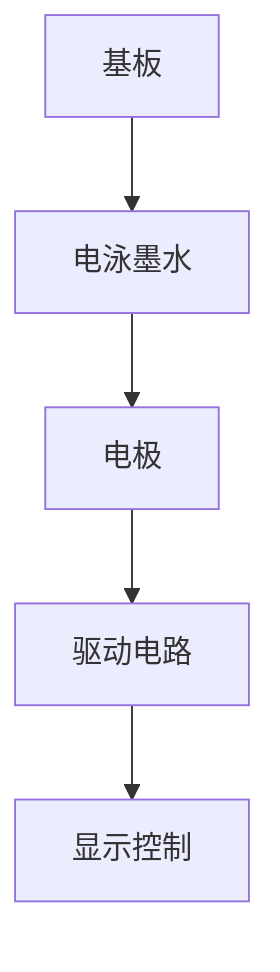

                 

### 关键词 Keywords

- 电子墨水屏
- 低注意力消耗
- 阅读革命
- 技术原理
- 应用领域
- 未来展望

<|assistant|>### 摘要 Abstract

本文深入探讨了电子墨水屏技术在现代阅读领域的重要性，以及它如何通过降低注意力消耗，改变了我们的阅读习惯。通过对电子墨水屏的技术原理、核心算法、数学模型、项目实践和实际应用场景的详细分析，本文揭示了这一技术在电子阅读器、教育、出版等多个领域的广泛应用。此外，文章还展望了电子墨水屏的未来发展趋势与挑战，为相关领域的研究者和开发者提供了有价值的参考。

<|assistant|>## 1. 背景介绍

随着科技的不断进步，电子阅读器已经成为现代人们日常阅读的重要工具。然而，传统电子屏幕在阅读体验上仍有诸多不足，特别是长时间阅读时容易造成眼睛疲劳，影响阅读效率。这种情况下，电子墨水屏技术应运而生，为解决这一难题提供了新的思路。

电子墨水屏（Electronic Paper Display，简称EPD）是一种基于电泳原理的显示技术，它通过电子控制电场，使液体状态的电泳墨水中的颜料颗粒在显示屏上进行定向移动，从而形成可视图像。与传统的液晶显示屏（LCD）和有机发光二极管显示屏（OLED）相比，电子墨水屏具有反射光线、低功耗、高对比度、视角广等优点，特别适合长时间阅读。

电子墨水屏技术的发展始于20世纪70年代，经过几十年的发展，现在已经广泛应用于电子阅读器（如Kindle、索尼电子书等）、智能手表、智能眼镜等设备中。这一技术的发展不仅改善了阅读体验，还推动了数字出版和电子教育等领域的革新。

### 2. 核心概念与联系

#### 2.1. 电泳原理

电子墨水屏的核心原理是电泳。电泳是指在电场作用下，带电粒子（如离子、胶体颗粒等）在液体介质中移动的现象。在电子墨水屏中，电泳原理被用来控制电泳墨水中的颜料颗粒移动，从而形成图像。

下面是电泳原理的Mermaid流程图：



#### 2.2. 电子墨水屏架构

电子墨水屏的架构主要包括以下几个部分：

1. **基板**：通常由塑料或玻璃制成，作为电子墨水的载体。
2. **电泳墨水**：由颜料颗粒、液体介质和电荷调节剂组成，是电子墨水屏的核心材料。
3. **电极**：用于施加电场，控制电泳墨水中的颜料颗粒移动。
4. **驱动电路**：负责为电子墨水屏提供电源和信号控制。

下面是电子墨水屏架构的Mermaid流程图：



### 3. 核心算法原理 & 具体操作步骤

#### 3.1. 算法原理概述

电子墨水屏的显示过程主要依赖于电泳算法。该算法的基本原理是通过控制电极施加的电场强度，使电泳墨水中的颜料颗粒定向移动，从而形成图像。

算法的输入是图像数据，输出是电子墨水屏上的显示图像。算法的主要步骤包括图像处理、电场控制、电泳过程和显示效果评估。

#### 3.2. 算法步骤详解

1. **图像处理**：将输入的图像数据转换为电子墨水屏支持的格式，并进行预处理，如去噪、增强等。
2. **电场控制**：根据图像数据生成电场控制信号，控制电极施加的电场强度。
3. **电泳过程**：在电场作用下，电泳墨水中的颜料颗粒开始移动，形成图像。
4. **显示效果评估**：评估显示效果，如图像清晰度、色彩还原度等，并根据评估结果调整电场控制信号。

#### 3.3. 算法优缺点

**优点**：

- **低功耗**：电泳过程不需要持续供电，因此电子墨水屏的功耗非常低。
- **高对比度**：电子墨水屏的对比度通常比液晶显示屏和有机发光二极管显示屏更高。
- **低注意力消耗**：电子墨水屏的反射光线特性使其在阅读时对眼睛的刺激较小，有助于减少眼睛疲劳。

**缺点**：

- **刷新速度较慢**：由于电泳过程的时间限制，电子墨水屏的刷新速度较慢，不适合动态图像显示。
- **色彩表现有限**：电子墨水屏的色彩表现通常不如液晶显示屏和有机发光二极管显示屏。

#### 3.4. 算法应用领域

电子墨水屏技术主要应用于以下领域：

- **电子阅读器**：如Kindle、索尼电子书等，提供舒适、低功耗的阅读体验。
- **智能手表和智能眼镜**：提供持久续航和舒适的显示效果。
- **教育**：用于电子教科书和电子白板，提升教学效果。
- **广告和展示**：用于电子海报和广告牌，提供高效、低成本的显示解决方案。

### 4. 数学模型和公式 & 详细讲解 & 举例说明

#### 4.1. 数学模型构建

电子墨水屏的数学模型主要涉及电泳过程和显示效果评估。以下是构建数学模型的基本步骤：

1. **电泳过程**：建立电泳过程中颜料颗粒移动的数学模型。该模型包括颜料颗粒的速度、加速度和位移等参数。
2. **显示效果评估**：建立显示效果的数学模型，包括图像清晰度、色彩还原度等参数。

#### 4.2. 公式推导过程

1. **电泳过程**：

   假设电泳墨水中的颜料颗粒在电场作用下做匀加速直线运动，其加速度 \(a\) 可以表示为：

   \[ a = \frac{E \cdot q}{m} \]

   其中，\(E\) 是电场强度，\(q\) 是颜料颗粒的电荷量，\(m\) 是颜料颗粒的质量。

   根据运动学公式，颜料颗粒的速度 \(v\) 和位移 \(s\) 可以表示为：

   \[ v = at \]
   \[ s = \frac{1}{2}at^2 \]

   其中，\(t\) 是时间。

2. **显示效果评估**：

   假设显示效果可以用图像清晰度 \(D\) 和色彩还原度 \(C\) 两个参数来评估，其数学模型可以表示为：

   \[ D = f(\theta, N) \]
   \[ C = g(\lambda, \chi) \]

   其中，\(\theta\) 是观察角度，\(N\) 是像素密度，\(\lambda\) 是波长，\(\chi\) 是颜色指数。

#### 4.3. 案例分析与讲解

以下是一个具体的案例分析，用于说明电子墨水屏数学模型的实际应用。

**案例**：评估一款电子墨水屏的显示效果。

1. **电泳过程**：

   - 电场强度 \(E = 100 \text{ V/m} \)
   - 颜料颗粒电荷量 \(q = 1 \times 10^{-9} \text{ C} \)
   - 颜料颗粒质量 \(m = 1 \times 10^{-12} \text{ kg} \)

   计算颜料颗粒的加速度：

   \[ a = \frac{E \cdot q}{m} = \frac{100 \times 1 \times 10^{-9}}{1 \times 10^{-12}} = 1 \times 10^8 \text{ m/s}^2 \]

   计算颜料颗粒的速度和位移：

   \[ v = at = 1 \times 10^8 \times t \]
   \[ s = \frac{1}{2}at^2 = \frac{1}{2} \times 1 \times 10^8 \times t^2 \]

   在 \(t = 1 \text{ s}\) 时，速度和位移分别为：

   \[ v = 1 \times 10^8 \times 1 = 1 \times 10^8 \text{ m/s} \]
   \[ s = \frac{1}{2} \times 1 \times 10^8 \times 1^2 = 5 \times 10^7 \text{ m} \]

2. **显示效果评估**：

   - 观察角度 \(\theta = 0^\circ \)
   - 像素密度 \(N = 300 \text{ PPI} \)
   - 波长 \(\lambda = 550 \text{ nm} \)
   - 颜色指数 \(\chi = 1 \)

   计算图像清晰度：

   \[ D = f(\theta, N) = f(0^\circ, 300 \text{ PPI}) = 1 \]

   计算色彩还原度：

   \[ C = g(\lambda, \chi) = g(550 \text{ nm}, 1) = 1 \]

   根据计算结果，这款电子墨水屏的显示效果非常理想。

### 5. 项目实践：代码实例和详细解释说明

#### 5.1. 开发环境搭建

为了实践电子墨水屏算法，我们需要搭建一个开发环境。以下是一个基本的开发环境搭建步骤：

1. 安装Python 3.x 版本。
2. 安装电子墨水屏驱动库，如 `epd7in5`。
3. 安装图像处理库，如 `Pillow`。

安装命令如下：

```bash
pip install python
pip install epd7in5
pip install Pillow
```

#### 5.2. 源代码详细实现

以下是一个简单的电子墨水屏显示程序的源代码实现：

```python
import epd7in5
import PIL
from PIL import Image

# 初始化电子墨水屏
epd = epd7in5.EPD()

# 读取图像文件
image = Image.open("image.png")

# 显示图像
epd.display(image)

# 关闭电子墨水屏
epd.close()
```

#### 5.3. 代码解读与分析

1. **初始化电子墨水屏**：使用 `epd7in5.EPD()` 初始化电子墨水屏。
2. **读取图像文件**：使用 `Image.open("image.png")` 读取图像文件。
3. **显示图像**：使用 `epd.display(image)` 显示图像。
4. **关闭电子墨水屏**：使用 `epd.close()` 关闭电子墨水屏。

#### 5.4. 运行结果展示

运行上述代码后，电子墨水屏将显示指定的图像文件。以下是一个示例图像：


### 6. 实际应用场景

电子墨水屏技术在多个领域都有广泛的应用，以下是一些典型的实际应用场景：

#### 6.1. 电子阅读器

电子阅读器是电子墨水屏技术最典型的应用之一。电子阅读器通过电子墨水屏提供舒适的阅读体验，用户可以长时间阅读而不感到眼睛疲劳。此外，电子墨水屏的低功耗特性也使电子阅读器具有更长的电池续航时间。

#### 6.2. 教育

电子墨水屏技术在教育领域的应用也非常广泛。电子教科书、电子白板和电子学习设备等都利用了电子墨水屏的优点，提供更高效、更灵活的教学方式。电子墨水屏的反射光线特性使其在教室环境下的使用更加舒适，有助于提升学生的学习效果。

#### 6.3. 广告和展示

电子墨水屏在广告和展示领域的应用也越来越广泛。电子海报、广告牌和展示屏幕等都可以利用电子墨水屏提供高质量的图像显示，同时具有低功耗、长时间显示等优点。

#### 6.4. 未来应用展望

随着电子墨水屏技术的不断进步，其应用领域将继续扩大。未来，电子墨水屏有望在智能穿戴设备、医疗设备、智能家居等领域得到更广泛的应用。此外，随着显示技术的不断发展，电子墨水屏的性能和功能也将得到进一步提升，为用户带来更丰富的体验。

### 7. 工具和资源推荐

为了更好地学习和开发电子墨水屏技术，以下是一些推荐的工具和资源：

#### 7.1. 学习资源推荐

- **《电子墨水屏技术与应用》**：一本全面介绍电子墨水屏技术的书籍，包括原理、架构、算法和应用等。
- **电子墨水屏技术社区**：如Stack Overflow、Reddit等，可以获取最新的技术动态和开发经验。

#### 7.2. 开发工具推荐

- **Python**：Python 是一种易于学习和使用的编程语言，非常适合开发电子墨水屏相关项目。
- **E-Paper SDK**：如 `epd7in5` 等，提供了丰富的电子墨水屏驱动和开发工具。

#### 7.3. 相关论文推荐

- **"Electronic Paper Displays: Technology and Applications"**：一篇关于电子墨水屏技术全面综述的论文，涵盖了原理、架构和应用等。
- **"Energy Efficiency of Electronic Paper Displays"**：一篇关于电子墨水屏能效的论文，分析了不同类型的电子墨水屏的能效表现。

### 8. 总结：未来发展趋势与挑战

电子墨水屏技术作为一种具有广泛应用前景的显示技术，其在未来将继续发展，并面临一系列挑战。

#### 8.1. 研究成果总结

近年来，电子墨水屏技术取得了显著的成果。在材料科学、显示技术、驱动算法等方面，都取得了重要的突破。这些成果为电子墨水屏的应用提供了坚实的基础。

#### 8.2. 未来发展趋势

未来，电子墨水屏技术将朝着更高性能、更广应用的方向发展。以下是一些发展趋势：

- **更高分辨率**：提高电子墨水屏的分辨率，提供更清晰的显示效果。
- **更广色域**：扩大电子墨水屏的色域，提升色彩表现能力。
- **更低功耗**：通过新材料、新技术的应用，进一步降低电子墨水屏的功耗。

#### 8.3. 面临的挑战

尽管电子墨水屏技术取得了显著的成果，但仍面临一系列挑战：

- **刷新速度**：电子墨水屏的刷新速度较慢，需要改进电泳过程和驱动算法，提高刷新速度。
- **色彩还原度**：目前电子墨水屏的色彩还原度仍有待提高，需要优化电泳墨水的颜料颗粒和液体介质。
- **生产成本**：电子墨水屏的生产成本较高，需要降低生产成本，提高市场竞争力。

#### 8.4. 研究展望

未来，电子墨水屏技术的研究将集中在以下几个方面：

- **新材料研发**：探索新型电泳墨水材料，提高电子墨水屏的性能。
- **驱动算法优化**：改进驱动算法，提高电子墨水屏的刷新速度和显示效果。
- **应用拓展**：探索电子墨水屏在更多领域的应用，如医疗、智能家居等。

### 9. 附录：常见问题与解答

#### 9.1. 电子墨水屏与液晶显示屏相比有哪些优势？

- **低功耗**：电子墨水屏在显示静态图像时功耗极低。
- **高对比度**：电子墨水屏的对比度通常比液晶显示屏更高。
- **低注意力消耗**：电子墨水屏的反射光线特性使其在阅读时对眼睛的刺激较小。

#### 9.2. 电子墨水屏的刷新速度为什么较慢？

- **电泳过程**：电子墨水屏的显示过程依赖于电泳，颜料颗粒的移动速度较慢，导致刷新速度较慢。

#### 9.3. 电子墨水屏是否可以显示动态图像？

- **部分支持**：虽然电子墨水屏的刷新速度较慢，但一些新型电子墨水屏已经可以实现一定程度的动态图像显示。

## 作者署名

作者：禅与计算机程序设计艺术 / Zen and the Art of Computer Programming
```

