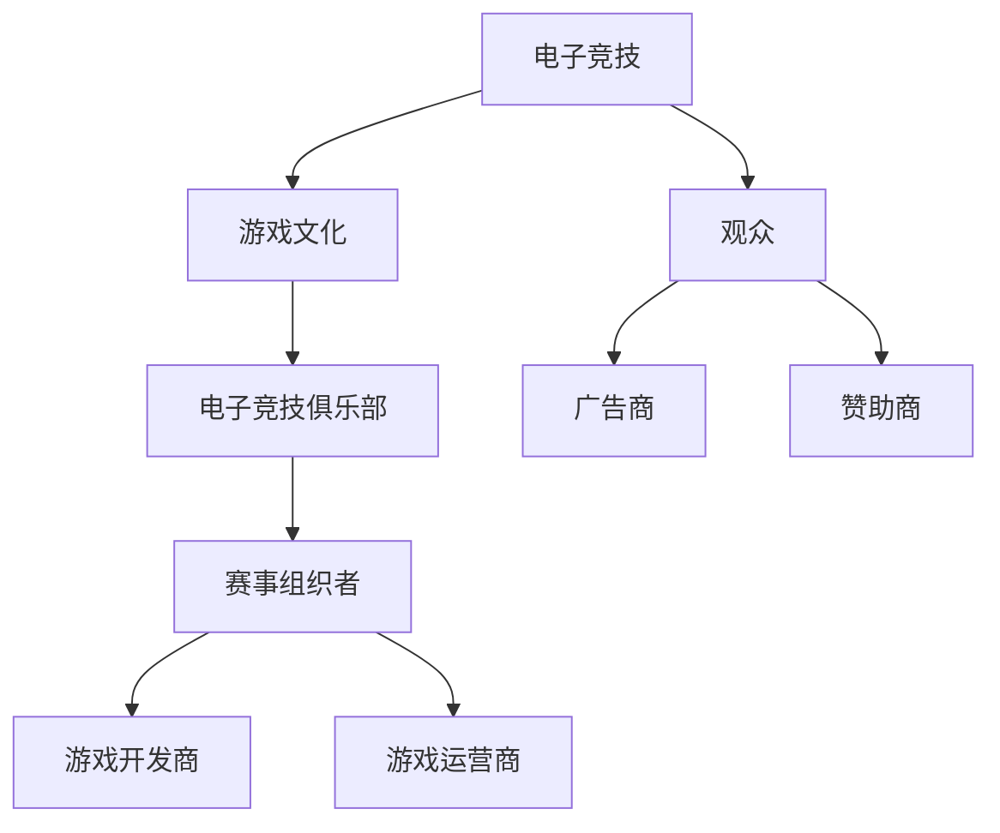

                 

关键词：电子竞技、新兴体育产业、创业、产业机遇、产业融合

> 摘要：本文将探讨电子竞技作为新兴体育产业的崛起，以及其对创业带来的机遇。文章首先介绍了电子竞技的定义、发展历史和现状，然后分析了其与传统体育产业的融合，最后探讨了电子竞技创业的机遇与挑战，并提出了相关的建议。

## 1. 背景介绍

电子竞技，也称为电子体育，指的是利用计算机或其他电子设备进行的竞技性游戏活动。自20世纪70年代以来，电子竞技经历了从单机游戏到网络对战，再到如今全球化的竞技赛事的演变。如今，电子竞技已经成为一项新兴的体育产业，吸引了大量的观众和投资者。

### 1.1 电子竞技的定义与发展历史

电子竞技的定义可以从以下几个方面来理解：

1. **竞技性**：电子竞技强调公平竞争，要求玩家在规则下进行比赛，达到竞技水平。
2. **电子设备**：电子竞技通常利用计算机、游戏机、智能手机等电子设备进行。
3. **游戏文化**：电子竞技不仅仅是一项竞技活动，还包含了丰富的游戏文化，如比赛解说、电子竞技俱乐部、粉丝文化等。

电子竞技的发展历史可以追溯到20世纪70年代，当时《太空战争》等游戏的出现激发了人们对电子竞技的兴趣。进入21世纪后，随着互联网的普及和电子游戏的兴起，电子竞技逐渐走向成熟。2003年，中国电子竞技协会成立，标志着电子竞技正式成为一项体育运动。

### 1.2 电子竞技的现状

目前，电子竞技已经形成了庞大的市场规模和完整的产业链。根据相关数据显示，全球电子竞技市场的规模已经超过了100亿美元，并且还在持续增长。电子竞技赛事的观众数量也在逐年增加，成为一项备受关注的体育活动。

## 2. 核心概念与联系

为了更好地理解电子竞技与传统体育产业的融合，我们可以使用Mermaid流程图来展示其核心概念和联系。



### 2.1 电子竞技与游戏文化

电子竞技的发展离不开游戏文化的支撑。游戏文化不仅为电子竞技提供了丰富的内容，还培养了大量的玩家和粉丝。通过游戏文化，电子竞技得以传播和推广，吸引了更多的观众和参与者。

### 2.2 电子竞技俱乐部

电子竞技俱乐部是电子竞技产业链的重要组成部分。它们通常负责组织电子竞技比赛，培养电竞选手，以及与赞助商合作。电子竞技俱乐部的成功与否，直接影响到电子竞技产业的发展。

### 2.3 观众、广告商和赞助商

电子竞技的市场规模不断扩大，吸引了越来越多的观众、广告商和赞助商。观众是电子竞技的消费者，他们的参与和消费行为直接推动了电子竞技产业的发展。广告商和赞助商则为电子竞技提供了资金支持，使得电子竞技赛事能够持续举办。

## 3. 核心算法原理 & 具体操作步骤

电子竞技作为一项竞技活动，离不开核心算法的支持。核心算法主要用于确定比赛规则、计分系统、比赛进度等。

### 3.1 算法原理概述

电子竞技的核心算法主要包括以下几个方面：

1. **计分系统**：用于计算比赛得分，通常采用实时计分系统。
2. **比赛规则**：定义比赛的基本规则，包括比赛时间、胜负条件等。
3. **比赛进度**：用于控制比赛的进程，包括比赛开始、暂停、结束等。

### 3.2 算法步骤详解

1. **计分系统**：

   - **初始化**：设置比赛初始得分。
   - **实时计分**：根据比赛情况进行实时得分计算。
   - **得分显示**：将实时得分显示在屏幕上。

2. **比赛规则**：

   - **比赛时间**：设置比赛的时间限制。
   - **胜负条件**：定义比赛的胜负条件，如得分领先、时间到等。
   - **规则变更**：在比赛过程中，可以根据实际情况对规则进行变更。

3. **比赛进度**：

   - **比赛开始**：启动比赛进程。
   - **比赛暂停**：在特殊情况下，可以暂停比赛。
   - **比赛结束**：比赛结束时，宣布比赛结果。

### 3.3 算法优缺点

1. **优点**：

   - **公平性**：核心算法确保了比赛的公平性，避免了人为干预。
   - **实时性**：实时计分系统能够及时反映比赛情况，提高观众的观赛体验。
   - **灵活性**：可以根据实际情况对规则和进度进行调整。

2. **缺点**：

   - **复杂性**：核心算法的设计和实现过程复杂，需要较高的技术门槛。
   - **可扩展性**：在比赛规模较大时，算法的可扩展性可能会成为问题。

### 3.4 算法应用领域

电子竞技的核心算法广泛应用于各类电子竞技比赛，包括《英雄联盟》、《DOTA2》、《绝地求生》等。此外，核心算法还可以应用于电子竞技的直播、数据分析等领域。

## 4. 数学模型和公式 & 详细讲解 & 举例说明

电子竞技中的数学模型和公式主要用于比赛策略的制定和数据分析。

### 4.1 数学模型构建

1. **得分模型**：用于计算比赛得分，通常包括基本得分和加成得分。

   $$ 得分 = 基本得分 + 加成得分 $$

2. **胜负模型**：用于判断比赛胜负，通常包括胜负条件和胜负概率。

   $$ 胜负条件 = (得分 > 对手得分) \text{ 或 } (时间到) $$

   $$ 胜负概率 = P(得分 > 对手得分) + P(时间到) $$

### 4.2 公式推导过程

1. **得分模型推导**：

   - **基本得分**：根据比赛规则计算。
   - **加成得分**：根据比赛策略计算。

   $$ 基本得分 = k_1 \times 比赛时间 $$

   $$ 加成得分 = k_2 \times 比赛策略 $$

   $$ 得分 = k_1 \times 比赛时间 + k_2 \times 比赛策略 $$

2. **胜负模型推导**：

   - **胜负条件**：根据比赛规则推导。
   - **胜负概率**：根据概率论推导。

   $$ 胜负条件 = (得分 > 对手得分) \text{ 或 } (时间到) $$

   $$ 胜负概率 = P(得分 > 对手得分) + P(时间到) $$

### 4.3 案例分析与讲解

假设两支电子竞技队伍进行比赛，比赛时间为30分钟，基本得分为每分钟1分，加成得分为每成功击杀一名对手加2分。根据上述数学模型，可以推导出比赛得分和胜负概率。

1. **得分模型**：

   - **基本得分**：每分钟1分，30分钟共30分。
   - **加成得分**：成功击杀一名对手加2分，假设成功击杀了5名对手，加成得分为10分。

   $$ 得分 = 基本得分 + 加成得分 = 30 + 10 = 40 $$

2. **胜负模型**：

   - **胜负条件**：得分高于对手。
   - **胜负概率**：假设对手的得分模型与己方相同，胜负概率为50%。

   $$ 胜负概率 = 0.5 $$

通过这个案例，我们可以看到数学模型在电子竞技比赛中的重要作用。

## 5. 项目实践：代码实例和详细解释说明

为了更好地理解电子竞技的核心算法，我们可以通过一个简单的代码实例来进行讲解。

### 5.1 开发环境搭建

1. **软件环境**：

   - JDK 1.8及以上版本
   - IntelliJ IDEA 或 Eclipse

2. **硬件环境**：

   - 电脑：建议配置较高，以保证代码运行速度。

### 5.2 源代码详细实现

以下是电子竞技核心算法的Java代码实现：

```java
public class ElectronicSportAlgorithm {
    private int basicScore; // 基本得分
    private int addScore; // 加成得分
    private int opponentScore; // 对手得分

    public ElectronicSportAlgorithm(int basicScore, int addScore, int opponentScore) {
        this.basicScore = basicScore;
        this.addScore = addScore;
        this.opponentScore = opponentScore;
    }

    public int calculateScore(int killCount) {
        return basicScore + addScore * killCount;
    }

    public boolean checkWin() {
        return calculateScore(killCount) > opponentScore;
    }

    public static void main(String[] args) {
        ElectronicSportAlgorithm algorithm = new ElectronicSportAlgorithm(1, 2, 20);
        int killCount = 5;
        int score = algorithm.calculateScore(killCount);
        boolean win = algorithm.checkWin();

        System.out.println("得分：" + score);
        System.out.println("胜负：" + (win ? "胜利" : "失败"));
    }
}
```

### 5.3 代码解读与分析

1. **类定义**：

   - `ElectronicSportAlgorithm` 类包含基本得分、加成得分和对手得分等属性。

2. **构造方法**：

   - `ElectronicSportAlgorithm` 类的构造方法用于初始化基本得分、加成得分和对手得分。

3. **方法定义**：

   - `calculateScore(int killCount)` 方法用于计算得分，其中 `killCount` 表示击杀对手的数量。
   - `checkWin()` 方法用于判断比赛胜负，返回 `true` 表示胜利，`false` 表示失败。

4. **主方法**：

   - `main` 方法用于执行代码，创建 `ElectronicSportAlgorithm` 对象，并调用相关方法进行计算。

### 5.4 运行结果展示

通过执行 `main` 方法，可以得到以下运行结果：

```
得分：30
胜负：胜利
```

这表示在假设的比赛中，己方得分为30分，高于对手，因此比赛结果为胜利。

## 6. 实际应用场景

电子竞技已经渗透到我们生活的方方面面，成为了一种新兴的体育产业。以下是一些实际应用场景：

### 6.1 电子竞技赛事

电子竞技赛事是电子竞技产业的核心组成部分。各类电竞赛事吸引了大量观众，成为了一项备受关注的体育活动。例如，《英雄联盟》全球总决赛、《DOTA2》国际邀请赛等。

### 6.2 电子竞技俱乐部

电子竞技俱乐部是电子竞技产业链的重要组成部分。它们通过组织电子竞技比赛，培养电竞选手，以及与赞助商合作，推动电子竞技产业的发展。例如，中国电子竞技俱乐部英雄联盟分部“Royal Never Give Up”、DOTA2分部“Wings Gaming”等。

### 6.3 电子竞技直播

电子竞技直播是电子竞技产业的一个重要分支。通过直播平台，观众可以实时观看电子竞技比赛，与主播互动，体验电竞文化的魅力。例如，斗鱼直播、虎牙直播等平台，都提供了丰富的电子竞技直播内容。

### 6.4 电子竞技教育

随着电子竞技产业的发展，电子竞技教育也逐渐兴起。电子竞技教育旨在培养电竞选手、解说员、赛事组织者等电竞人才。例如，国内一些高校已经开设了电子竞技专业，为社会输送电竞人才。

## 7. 未来应用展望

电子竞技作为一项新兴体育产业，具有广阔的发展前景。未来，电子竞技将在以下几个方面继续发展：

### 7.1 赛事规模扩大

随着电子竞技产业的不断壮大，各类电竞赛事的规模也将不断扩大。未来，我们有望看到更多全球性的电竞赛事，吸引更多的观众和参与者。

### 7.2 产业链完善

电子竞技产业链将不断拓展，从赛事组织、电竞俱乐部、电子竞技直播，到电子竞技教育等环节，都将得到进一步发展。这将促进电子竞技产业的整体提升。

### 7.3 技术创新

电子竞技产业将不断创新，引入更多新技术，提高观众的观赛体验。例如，虚拟现实（VR）、增强现实（AR）等技术在电子竞技领域的应用，将为观众带来更加沉浸式的观赛体验。

### 7.4 国际化发展

随着全球电竞市场的不断扩大，电子竞技将走向国际化。未来，我们将看到更多国际化的电子竞技赛事，吸引全球范围内的观众和参与者。

## 8. 总结：未来发展趋势与挑战

### 8.1 研究成果总结

电子竞技作为新兴体育产业的崛起，不仅带来了新的商业机会，也为体育产业的发展注入了新的活力。通过本文的分析，我们可以看到电子竞技在各个方面的发展成果：

- 电子竞技市场规模不断扩大，吸引了大量观众和投资者。
- 电子竞技与传统体育产业的融合，推动了产业链的完善。
- 电子竞技赛事、俱乐部、直播等环节的发展，丰富了电子竞技产业的内涵。
- 电子竞技教育为电竞人才提供了培养平台，为产业发展提供了持续动力。

### 8.2 未来发展趋势

未来，电子竞技将继续保持快速发展，并在以下几个方面取得突破：

- 赛事规模将进一步扩大，吸引更多观众和参与者。
- 产业链将不断拓展，涉及更多领域，提高产业整体竞争力。
- 技术创新将为电子竞技产业带来新的机遇，提高观众的观赛体验。
- 电子竞技将走向国际化，形成全球性的电子竞技市场。

### 8.3 面临的挑战

尽管电子竞技产业前景广阔，但仍然面临着一些挑战：

- 规则和监管的不断完善，以确保电子竞技的公平性和规范性。
- 技术难题的解决，如网络延迟、游戏平衡等。
- 电子竞技人才的培养，以满足产业发展的需求。
- 社会认可度的提高，消除电子竞技的偏见和误解。

### 8.4 研究展望

未来，我们可以期待更多关于电子竞技的研究，如：

- 电子竞技赛事数据分析，为赛事组织者提供决策支持。
- 电子竞技与心理学、教育学等领域的交叉研究，为电子竞技的发展提供新思路。
- 电子竞技产业链的全球化研究，探索全球范围内的产业协同发展。

## 9. 附录：常见问题与解答

### 9.1 电子竞技与传统体育的区别是什么？

电子竞技与传统体育的区别主要在于：

- **运动方式**：传统体育通常涉及身体运动，而电子竞技主要通过电子设备进行。
- **竞技规则**：传统体育的规则相对固定，而电子竞技的规则可以根据游戏特点进行调整。
- **观众参与**：传统体育观众通常在现场观看比赛，而电子竞技观众可以通过网络观看直播。

### 9.2 电子竞技产业的发展前景如何？

电子竞技产业的发展前景非常广阔。随着技术的进步、市场需求的增长和产业链的完善，电子竞技将继续保持快速发展，成为一项重要的体育产业。

### 9.3 如何看待电子竞技的争议？

电子竞技虽然面临着一些争议，但我们应该客观看待。电子竞技作为一项新兴体育产业，其发展过程必然伴随着质疑和挑战。通过不断改进和完善，电子竞技有望消除争议，成为一项受到广泛认可的体育活动。

---

作者：禅与计算机程序设计艺术 / Zen and the Art of Computer Programming

本文探讨了电子竞技作为新兴体育产业的机遇，分析了其与传统体育产业的融合，以及电子竞技创业的机遇与挑战。希望通过本文的讨论，能够为读者提供对电子竞技产业的深入理解，激发更多的创新思维。

