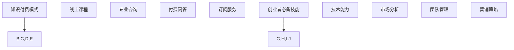

                 

在这个知识付费的时代，程序员选择创业成为了一个越来越受欢迎的选项。随着互联网和科技的迅猛发展，程序员不仅可以依靠传统的软件开发工作，还可以通过创业实现个人价值和商业成功。本文将深入探讨知识付费时代程序员的创业之路，包括创业的准备、市场分析、团队构建、产品开发、营销策略以及创业过程中可能面临的挑战和解决方案。

## 文章关键词

- **知识付费**
- **程序员创业**
- **市场分析**
- **团队构建**
- **产品开发**
- **营销策略**
- **挑战与解决方案**

## 文章摘要

本文旨在为有志于创业的程序员提供全面的指导。文章首先介绍了知识付费时代的背景和程序员的创业优势，接着详细讨论了市场分析、团队构建、产品开发和营销策略等关键环节，最后分析了创业过程中可能遇到的挑战和解决方案，为程序员创业提供实用的参考。

## 1. 背景介绍

### 1.1 知识付费时代的到来

知识付费，即用户为获取有价值的信息或知识而付费，这一现象在近年来变得越来越普遍。随着移动互联网的普及和在线教育的兴起，人们对于专业知识和技能的需求不断增加。知识付费的形式多样，包括线上课程、专业咨询、付费问答、订阅服务等。这种趋势不仅改变了传统的教育模式，也为程序员提供了新的创业机会。

### 1.2 程序员的创业优势

程序员具有独特的优势，使他们成为知识付费领域的重要参与者。首先，程序员具备较强的技术能力和解决问题的能力，这使得他们在开发具有实用价值的产品时具有优势。其次，程序员通常具有较强的自学能力和创新精神，能够快速适应市场需求和变化。此外，程序员还具备良好的团队合作精神和项目管理能力，这对于创业团队的成功至关重要。

## 2. 核心概念与联系

### 2.1 知识付费模式

知识付费模式主要包括以下几种：

- **线上课程**：用户通过在线平台付费学习专业知识。
- **专业咨询**：用户付费获取专业人士的意见和建议。
- **付费问答**：用户付费向专家提问并获取解答。
- **订阅服务**：用户通过订阅模式持续获取知识更新。

### 2.2 创业者必备技能

创业者必备的技能包括：

- **技术能力**：开发具有市场前景的产品。
- **市场分析**：了解市场需求和竞争情况。
- **团队管理**：构建和领导高效的创业团队。
- **营销策略**：制定并执行有效的营销计划。

### 2.3 Mermaid 流程图



## 3. 核心算法原理 & 具体操作步骤

### 3.1 算法原理概述

程序员在创业过程中，需要掌握一系列核心算法原理，包括：

- **数据分析算法**：用于处理和分析用户数据，提供个性化推荐。
- **机器学习算法**：用于构建智能系统，提高产品竞争力。
- **网络爬虫算法**：用于收集互联网上的信息，为产品提供内容。

### 3.2 算法步骤详解

1. **数据分析算法**：
   - **数据采集**：通过API、爬虫等技术获取用户数据。
   - **数据清洗**：去除无效数据和噪声，提高数据质量。
   - **数据可视化**：通过图表和报表展示分析结果。

2. **机器学习算法**：
   - **数据预处理**：对数据进行归一化、缺失值填充等处理。
   - **模型选择**：根据业务需求选择合适的机器学习模型。
   - **模型训练与验证**：训练模型并评估模型性能。

3. **网络爬虫算法**：
   - **目标页面定位**：通过URL解析、关键词搜索等方法定位目标页面。
   - **内容提取**：使用正则表达式、XPath等技术提取页面内容。
   - **数据存储**：将提取的数据存储到数据库或文件中。

### 3.3 算法优缺点

- **数据分析算法**：
  - 优点：能够提供用户行为分析和个性化推荐，提高用户体验。
  - 缺点：数据质量和分析方法直接影响分析结果。

- **机器学习算法**：
  - 优点：能够自动发现数据中的规律，提高产品智能化水平。
  - 缺点：模型训练和调优过程复杂，对数据量和质量要求较高。

- **网络爬虫算法**：
  - 优点：能够快速获取互联网上的信息，丰富产品内容。
  - 缺点：面临法律风险和反爬虫技术挑战。

### 3.4 算法应用领域

- **数据分析算法**：电商、金融、教育等行业。
- **机器学习算法**：智能客服、推荐系统、自动驾驶等。
- **网络爬虫算法**：内容聚合、搜索引擎等。

## 4. 数学模型和公式 & 详细讲解 & 举例说明

### 4.1 数学模型构建

在创业过程中，数学模型的应用至关重要。以下为常见数学模型及其构建方法：

1. **线性回归模型**：
   - **公式**：\(y = ax + b\)
   - **构建方法**：通过最小二乘法求解参数 \(a\) 和 \(b\)。

2. **逻辑回归模型**：
   - **公式**：\(P(y=1) = \frac{1}{1 + e^{-(ax + b)}}\)
   - **构建方法**：使用梯度下降法求解参数 \(a\) 和 \(b\)。

3. **决策树模型**：
   - **公式**：根据特征值的划分条件，递归划分数据集。
   - **构建方法**：信息增益、基尼系数等划分准则。

### 4.2 公式推导过程

以线性回归模型为例，推导过程如下：

1. **损失函数**：
   \(J(\theta) = \frac{1}{2m} \sum_{i=1}^{m} (h_\theta(x^{(i)}) - y^{(i)})^2\)

2. **梯度下降**：
   \(\theta_j := \theta_j - \alpha \frac{\partial J(\theta)}{\partial \theta_j}\)

3. **最优解**：
   \(\theta = \arg\min J(\theta)\)

### 4.3 案例分析与讲解

假设一个电商网站希望预测用户购买行为，可以使用线性回归模型进行预测。以下为具体步骤：

1. **数据准备**：
   收集用户购买历史数据，包括用户ID、商品ID、购买时间等。

2. **特征提取**：
   根据业务需求提取相关特征，如用户年龄、性别、购买频率等。

3. **数据预处理**：
   对数据进行归一化处理，消除不同特征之间的量纲影响。

4. **模型训练**：
   使用训练数据训练线性回归模型，求解参数 \(\theta\)。

5. **模型评估**：
   使用测试数据评估模型性能，调整参数以优化模型。

6. **预测应用**：
   使用训练好的模型对用户购买行为进行预测，提高销售转化率。

## 5. 项目实践：代码实例和详细解释说明

### 5.1 开发环境搭建

- **语言**：Python
- **框架**：Scikit-learn
- **依赖库**：NumPy、Pandas、Matplotlib等

```bash
pip install scikit-learn numpy pandas matplotlib
```

### 5.2 源代码详细实现

以下为使用Python实现线性回归模型的代码示例：

```python
import numpy as np
import pandas as pd
from sklearn.linear_model import LinearRegression
import matplotlib.pyplot as plt

# 数据准备
data = pd.read_csv('data.csv')
X = data[['age', 'gender', 'frequency']]
y = data['purchase']

# 数据预处理
X = (X - X.mean()) / X.std()

# 模型训练
model = LinearRegression()
model.fit(X, y)

# 模型评估
predictions = model.predict(X)
mse = np.mean((predictions - y) ** 2)
print(f'MSE: {mse}')

# 模型可视化
plt.scatter(X['age'], y)
plt.plot(X['age'], predictions, color='red')
plt.xlabel('Age')
plt.ylabel('Purchase')
plt.show()
```

### 5.3 代码解读与分析

- **数据准备**：读取数据，将特征和标签分离。
- **数据预处理**：对特征进行归一化处理。
- **模型训练**：使用Scikit-learn的LinearRegression类训练模型。
- **模型评估**：计算均方误差（MSE）评估模型性能。
- **模型可视化**：绘制特征和标签的关系图，展示模型预测结果。

### 5.4 运行结果展示

运行代码后，将显示均方误差（MSE）和特征与标签的关系图。MSE值越低，表示模型性能越好。

## 6. 实际应用场景

### 6.1 教育领域

程序员可以开发在线教育平台，提供编程课程、算法培训等知识付费服务。通过大数据分析和个性化推荐，提高用户学习效果和满意度。

### 6.2 金融领域

程序员可以开发金融咨询平台，为用户提供专业的投资建议、风险管理等服务。利用机器学习算法，预测市场走势，提高用户投资收益。

### 6.3 医疗健康

程序员可以开发健康管理平台，为用户提供健康数据监测、疾病预测等服务。通过大数据分析和人工智能技术，提高医疗服务的质量和效率。

## 7. 工具和资源推荐

### 7.1 学习资源推荐

- **书籍**：《算法导论》、《机器学习》、《深度学习》
- **在线课程**：Coursera、Udacity、edX等平台上的编程和机器学习课程
- **博客**： Medium、博客园、CSDN等平台上的技术博客

### 7.2 开发工具推荐

- **编程语言**：Python、Java、C++
- **框架**：Django、Flask、Spring Boot等
- **数据库**：MySQL、PostgreSQL、MongoDB等

### 7.3 相关论文推荐

- **大数据处理**：《Hadoop: The Definitive Guide》
- **机器学习**：《Machine Learning Yearning》
- **深度学习**：《Deep Learning Book》

## 8. 总结：未来发展趋势与挑战

### 8.1 研究成果总结

知识付费时代为程序员创业提供了丰富的机会。程序员可以通过大数据分析、机器学习和人工智能等技术，开发具有市场竞争力的产品和服务。

### 8.2 未来发展趋势

- **个性化推荐**：随着大数据技术的发展，个性化推荐将成为知识付费领域的重要趋势。
- **人工智能应用**：人工智能技术在教育、医疗、金融等领域的应用将不断扩展。
- **知识付费平台化**：知识付费平台将更加成熟，提供多样化的服务模式。

### 8.3 面临的挑战

- **技术更新**：程序员需要不断学习新技术，以适应快速变化的市场需求。
- **竞争激烈**：知识付费领域竞争激烈，程序员需要具备独特的产品优势和创新能力。
- **知识产权保护**：知识产权保护不力可能导致创业失败，程序员需要重视知识产权保护。

### 8.4 研究展望

未来，知识付费时代程序员创业将朝着更加智能化、个性化和平台化的方向发展。程序员需要不断提升自身技术能力和创新能力，抓住市场机遇，实现商业成功。

## 9. 附录：常见问题与解答

### 9.1 如何进行市场分析？

**解答**：市场分析包括了解市场需求、竞争情况、目标用户等。可以通过以下方法进行市场分析：

- **行业报告**：查阅行业报告，了解市场规模、增长趋势、竞争态势等。
- **用户调研**：通过问卷调查、访谈等方式，了解用户需求和期望。
- **竞品分析**：分析竞品的优点和不足，找到市场机会。

### 9.2 如何构建创业团队？

**解答**：构建创业团队需要遵循以下原则：

- **互补性**：团队成员在技能、经验和背景上互补。
- **共同目标**：团队成员对创业目标有共同的认识和追求。
- **沟通协作**：团队成员之间保持良好的沟通和协作。

### 9.3 如何制定营销策略？

**解答**：制定营销策略需要考虑以下因素：

- **目标用户**：明确目标用户群体，制定针对性的营销方案。
- **渠道选择**：选择合适的营销渠道，如社交媒体、广告投放等。
- **内容创意**：创造有吸引力的内容，提高用户参与度和转化率。

---

作者：禅与计算机程序设计艺术 / Zen and the Art of Computer Programming

