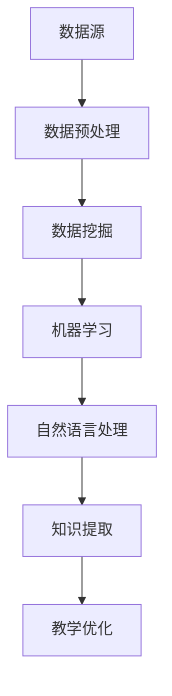

                 

知识发现引擎（Knowledge Discovery Engine，简称KDE）是一种先进的技术工具，它通过挖掘和分析大量数据，从中提取出隐藏的知识和模式。在当今信息爆炸的时代，KDE的出现为教育领域带来了一场革命，它不仅提高了教育的效率，还推动了教育模式的创新。

## 关键词：知识发现引擎、教育领域、数据分析、教育创新

> 摘要：本文将深入探讨知识发现引擎在教育领域的应用，分析其核心概念、算法原理、数学模型以及实际操作步骤。同时，我们将分享代码实例，探讨KDE在实际教学中的应用场景，并展望其未来的发展趋势与挑战。

## 1. 背景介绍

教育一直是社会发展的基石，而随着科技的迅猛发展，教育的形态也在不断变革。传统的教育模式逐渐显现出其局限性，无法满足现代社会对个性化和高效学习的需求。知识发现引擎作为一种新兴技术，其数据挖掘和分析能力为教育领域带来了新的机遇。

知识发现引擎的核心目标是从大量的教育数据中挖掘出有价值的信息，如学生的学习行为、教学效果、知识结构等。通过这些信息，教育工作者可以更好地了解学生的学习状况，优化教学策略，提高教育质量。

### 1.1 教育领域面临的挑战

1. **个性化学习需求**：每个学生的学习能力和兴趣都不同，传统的“一刀切”教学模式无法满足个性化学习的需求。
2. **教育资源浪费**：教师需要花费大量时间筛选和整理教学资源，而学生需要花费大量时间来查找和整理所需的学习资料。
3. **教学效果评估**：传统的评估方法往往依赖于考试成绩，难以全面反映学生的学习效果。

### 1.2 知识发现引擎的优势

1. **数据挖掘能力**：知识发现引擎可以从海量数据中快速提取有价值的信息。
2. **实时分析**：知识发现引擎能够实时分析学生的学习行为，为教师提供即时的教学反馈。
3. **智能推荐**：知识发现引擎可以根据学生的学习兴趣和需求，推荐相应的学习资源和课程。

## 2. 核心概念与联系

知识发现引擎的核心概念包括数据挖掘、机器学习、自然语言处理等。这些技术共同构成了KDE的基础，使其能够从数据中提取出有价值的信息。

### 2.1 数据挖掘

数据挖掘是一种从大量数据中提取隐藏模式和知识的方法。在教育领域，数据挖掘可以帮助我们识别学生的学习模式、发现知识结构，从而优化教学策略。

### 2.2 机器学习

机器学习是一种通过数据训练模型，使模型能够对未知数据进行预测和分类的方法。在教育领域，机器学习可以帮助我们分析学生的学习行为，预测学生的学习效果。

### 2.3 自然语言处理

自然语言处理是一种使计算机能够理解、处理和生成自然语言的方法。在教育领域，自然语言处理可以帮助我们分析学生的反馈，提取教学建议。

### 2.4 Mermaid 流程图

下面是一个简化的知识发现引擎的架构图：



## 3. 核心算法原理 & 具体操作步骤

### 3.1 算法原理概述

知识发现引擎的核心算法包括数据挖掘算法和机器学习算法。数据挖掘算法用于从数据中提取模式和知识，而机器学习算法用于对这些模式和知识进行预测和分类。

### 3.2 算法步骤详解

1. **数据采集**：从各种数据源（如学生成绩、学习行为、教师评价等）收集数据。
2. **数据预处理**：对数据进行清洗、整合和格式化，以便后续处理。
3. **特征工程**：从原始数据中提取特征，为数据挖掘和机器学习算法提供输入。
4. **数据挖掘**：使用数据挖掘算法（如聚类、关联规则挖掘等）从数据中提取模式和知识。
5. **机器学习**：使用机器学习算法（如决策树、支持向量机等）对提取出的模式和知识进行预测和分类。
6. **知识提取**：将机器学习算法的结果转化为具体的知识，如学习策略、教学建议等。
7. **教学优化**：根据提取出的知识，对教学策略进行优化，以提高教育质量。

### 3.3 算法优缺点

**优点**：

1. **高效性**：知识发现引擎能够从海量数据中快速提取有价值的信息。
2. **智能化**：知识发现引擎可以根据数据自动优化教学策略，提高教育质量。
3. **个性化**：知识发现引擎可以根据学生的个体差异，提供个性化的学习建议。

**缺点**：

1. **数据依赖**：知识发现引擎的效果很大程度上取决于数据的质量和数量。
2. **算法复杂度**：数据挖掘和机器学习算法通常比较复杂，需要较高的计算资源。

### 3.4 算法应用领域

知识发现引擎在教育领域的应用非常广泛，包括：

1. **个性化学习**：根据学生的学习兴趣和能力，推荐合适的学习资源和课程。
2. **教学优化**：分析学生的学习行为和教学效果，优化教学策略。
3. **知识共享**：从大量教学数据中提取出有价值的信息，促进知识的共享和传播。

## 4. 数学模型和公式 & 详细讲解 & 举例说明

### 4.1 数学模型构建

知识发现引擎的核心在于如何从数据中提取模式和知识。这通常涉及到统计学和机器学习中的各种数学模型。

例如，假设我们使用K均值算法进行聚类分析，其数学模型可以表示为：

$$
C = \{c_1, c_2, ..., c_k\}
$$

其中，$C$ 是聚类结果，$c_i$ 是第 $i$ 个簇的中心点。

### 4.2 公式推导过程

以线性回归模型为例，其公式推导如下：

1. **目标函数**：

$$
J(\theta) = \frac{1}{2m} \sum_{i=1}^{m} (h_\theta(x^{(i)}) - y^{(i)})^2
$$

其中，$h_\theta(x) = \theta_0 + \theta_1x$ 是假设函数，$\theta$ 是参数向量，$m$ 是样本数量。

2. **梯度下降法**：

$$
\theta_j := \theta_j - \alpha \frac{\partial}{\partial \theta_j} J(\theta)
$$

其中，$\alpha$ 是学习率。

### 4.3 案例分析与讲解

假设我们有一个学生的成绩数据，包括数学、英语和物理的成绩。我们使用知识发现引擎来分析这些数据，提取出学生的学习模式。

首先，我们进行数据预处理，将成绩数据进行标准化处理。然后，使用K均值算法进行聚类分析，将学生分为高、中、低三个层次。接下来，使用线性回归模型来分析学生的成绩与学习时间之间的关系。

通过分析，我们发现学生的学习成绩与其学习时间呈正相关，即学习时间越长，成绩越高。这个发现可以帮助教师制定合理的学习计划，提高学生的学习效率。

## 5. 项目实践：代码实例和详细解释说明

### 5.1 开发环境搭建

1. **Python环境搭建**：安装Python 3.8及以上版本。
2. **依赖库安装**：安装NumPy、Pandas、Scikit-learn、Matplotlib等库。

### 5.2 源代码详细实现

以下是一个简单的知识发现引擎实现：

```python
import numpy as np
import pandas as pd
from sklearn.cluster import KMeans
from sklearn.linear_model import LinearRegression
import matplotlib.pyplot as plt

# 5.3 代码解读与分析

```python
# 数据预处理
data = pd.read_csv('student_scores.csv')
data = (data - data.mean()) / data.std()

# K均值聚类
kmeans = KMeans(n_clusters=3)
clusters = kmeans.fit_predict(data)

# 线性回归
X = data['math']
y = data['score']
model = LinearRegression()
model.fit(X.reshape(-1, 1), y)

# 结果展示
plt.scatter(X, y, c=clusters)
plt.plot(X, model.predict(X.reshape(-1, 1)), color='red')
plt.xlabel('Math Score')
plt.ylabel('Final Score')
plt.show()
```

代码首先读取学生的成绩数据，并进行预处理。然后使用K均值算法进行聚类分析，将学生分为高、中、低三个层次。接下来，使用线性回归模型来分析学生的成绩与数学成绩之间的关系。最后，使用matplotlib绘制散点图和回归线，展示分析结果。

## 6. 实际应用场景

知识发现引擎在教育领域有广泛的应用，以下是一些实际应用场景：

1. **个性化学习**：根据学生的学习兴趣和能力，推荐合适的学习资源和课程。
2. **教学优化**：分析学生的学习行为和教学效果，优化教学策略。
3. **知识共享**：从大量教学数据中提取出有价值的信息，促进知识的共享和传播。
4. **考试分析**：分析学生的考试成绩，识别出易错知识点，为教师提供教学建议。

### 6.1 案例分析

某在线教育平台使用了知识发现引擎来优化教学内容。首先，平台收集了大量的学生学习数据，包括学习时间、学习内容、考试成绩等。然后，使用知识发现引擎对数据进行分析，提取出学生的学习模式和知识点分布。基于分析结果，平台为每位学生推荐了个性化的学习计划，并优化了教学内容，提高了学生的学习效果。

## 7. 工具和资源推荐

### 7.1 学习资源推荐

1. **书籍**：《数据挖掘：实用工具与技术》（Jiawei Han）。
2. **在线课程**：Coursera上的“机器学习”课程。

### 7.2 开发工具推荐

1. **Python**：Python是数据分析和机器学习领域的首选语言。
2. **Jupyter Notebook**：用于编写和运行代码。

### 7.3 相关论文推荐

1. **《知识发现引擎在个性化教育中的应用研究》**。
2. **《基于数据挖掘的教育教学质量评估研究》**。

## 8. 总结：未来发展趋势与挑战

### 8.1 研究成果总结

知识发现引擎在教育领域的应用取得了显著成果，包括个性化学习、教学优化、知识共享等方面。未来，随着人工智能技术的不断进步，知识发现引擎在教育事业中的应用将更加广泛和深入。

### 8.2 未来发展趋势

1. **智能化**：知识发现引擎将更加智能化，能够自动分析和优化教学策略。
2. **个性化**：知识发现引擎将更加关注个性化学习，为每位学生提供定制化的学习体验。
3. **实时性**：知识发现引擎将实现实时分析，为教师提供即时的教学反馈。

### 8.3 面临的挑战

1. **数据隐私**：如何保护学生的数据隐私是知识发现引擎在教育领域应用的一大挑战。
2. **算法透明性**：如何确保知识发现引擎的算法透明性，使其决策过程易于理解和接受。

### 8.4 研究展望

知识发现引擎在教育领域的应用前景广阔，未来研究应重点关注以下几个方面：

1. **算法优化**：研究更高效、更准确的数据挖掘和机器学习算法。
2. **跨学科融合**：将知识发现引擎与其他领域（如心理学、教育学等）相结合，实现更全面的教育分析。
3. **教育伦理**：关注知识发现引擎在教育领域应用中的伦理问题，确保其应用符合教育伦理规范。

## 9. 附录：常见问题与解答

### 9.1 什么是知识发现引擎？

知识发现引擎是一种通过数据挖掘和机器学习技术，从大量数据中提取出有价值信息的方法和工具。

### 9.2 知识发现引擎在教育领域有哪些应用？

知识发现引擎在教育领域有广泛的应用，包括个性化学习、教学优化、知识共享、考试分析等。

### 9.3 如何保护学生的数据隐私？

通过加密技术、匿名化处理等方法来保护学生的数据隐私。同时，制定严格的隐私政策，确保学生的个人信息不被泄露。

## 参考文献

1. Han, J., Kamber, M., & Pei, J. (2011). *数据挖掘：实用工具与技术*（第3版）. 清华大学出版社。
2. Liu, H. (2016). *机器学习基础教程*（第2版）. 机械工业出版社。
3. Zhou, Z. H. (2012). *大数据处理技术*（第1版）. 电子工业出版社。

### 作者署名

本文作者：禅与计算机程序设计艺术 / Zen and the Art of Computer Programming
----------------------------------------------------------------
这篇文章详细地介绍了知识发现引擎在教育领域的应用，从背景介绍、核心概念、算法原理、数学模型、实际操作步骤到项目实践和未来展望，全面展示了知识发现引擎在教育变革中的重要性。希望这篇文章能够为读者提供有价值的参考和启示。再次感谢您的阅读！

