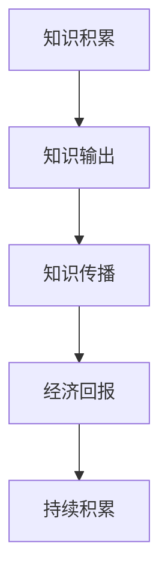

                 

“知识变现”一词，近年来在互联网行业中逐渐崭露头角，成为关注的热点话题。对于程序员而言，这一概念不仅意味着个人能力的展示，更蕴含着无限的商机与机遇。然而，面对知识变现的浪潮，程序员们同样也面临着一系列的挑战。本文将深入探讨知识变现的未来趋势，分析程序员的机遇与挑战，为读者提供一份全面的指南。

## 关键词

- 知识变现
- 程序员
- 机遇
- 挑战
- 互联网
- 技术创新

## 摘要

本文首先介绍了知识变现的概念，并探讨了其对程序员的重要意义。随后，文章分析了当前程序员在知识变现过程中所面临的机遇与挑战。接着，文章通过具体的案例分析，展示了程序员如何通过知识变现实现个人价值和商业成功。最后，文章对未来知识变现的发展趋势进行了展望，并提出了相应的应对策略。

## 1. 背景介绍

知识变现，顾名思义，是将知识转化为经济价值的过程。在互联网时代，知识的传播和获取变得更加便捷，知识变现的渠道和方式也日益丰富。对于程序员而言，他们掌握的专业技能和知识，可以通过多种途径实现商业价值。例如，编写技术博客、开设在线课程、编写技术书籍、提供技术咨询等，都是程序员知识变现的常见方式。

### 1.1 知识变现的发展历程

知识变现并非新兴概念，自古以来，知识的传播与变现一直是社会进步的重要推动力。然而，在互联网时代，知识变现的方式和范围得到了极大的拓展。

#### 1.1.1 传统知识变现

在互联网普及之前，知识变现主要通过以下几种方式实现：

- **学术发表**：科学家和学者通过在学术期刊发表论文，分享研究成果，从而获得学术声誉和经济回报。
- **教育培训**：教育机构通过开设课程，培养人才，实现知识变现。
- **技术转移**：企业通过技术合作、技术转让等方式，将科研成果转化为生产力。

#### 1.1.2 互联网时代的知识变现

互联网的兴起，极大地改变了知识传播和变现的方式。以下是一些典型的互联网知识变现方式：

- **在线课程**：通过在线教育平台，程序员可以开设技术课程，分享专业知识，实现知识变现。
- **技术博客**：程序员可以通过撰写技术博客，分享编程经验和技术心得，吸引读者，实现流量变现。
- **技术社区**：程序员可以在技术社区中参与讨论，解决技术问题，提升个人知名度，从而获得商业机会。
- **开源项目**：程序员通过参与开源项目，贡献代码，提升个人影响力，进而获得赞助和合作机会。

### 1.2 程序员在知识变现中的角色

程序员在知识变现中扮演着重要的角色。他们不仅拥有丰富的技术知识，而且具备较强的解决问题的能力。这使得程序员能够通过多种途径实现知识变现，成为知识经济时代的重要参与者。

#### 1.2.1 知识输出

程序员可以通过编写技术博客、撰写技术书籍、开设在线课程等方式，输出自己的专业知识。这些知识不仅有助于提升个人的专业水平，还可以吸引大量读者和听众，实现流量变现。

#### 1.2.2 知识共享

程序员可以在技术社区中积极参与讨论，分享自己的经验和见解。通过解决问题和提供帮助，程序员可以提升个人知名度，吸引更多的商业机会。

#### 1.2.3 知识转化

程序员可以将自己的技术知识转化为实际的产品或服务。例如，开发软件工具、提供技术解决方案等，从而实现知识变现。

### 1.3 知识变现对程序员的意义

知识变现对程序员具有重要意义。首先，它为程序员提供了实现个人价值的途径，使程序员能够通过自己的专业能力获得经济回报。其次，知识变现有助于提升程序员的职业竞争力，使他们在职场中更具优势。此外，知识变现还为程序员提供了更多的职业发展机会，如技术顾问、创业等。

## 2. 核心概念与联系

在探讨知识变现的过程中，我们需要理解几个核心概念，它们之间存在着密切的联系。

### 2.1 知识变现的原理

知识变现的核心在于将知识转化为经济价值。这一过程包括以下几个步骤：

1. **知识积累**：程序员通过学习、实践和总结，积累丰富的技术知识和经验。
2. **知识输出**：程序员通过写作、授课、分享等方式，将知识输出给他人。
3. **知识传播**：通过互联网等渠道，将知识传播给更多的人。
4. **经济回报**：通过流量变现、赞助、合作等方式，实现知识变现。

### 2.2 知识变现的渠道

知识变现的渠道多种多样，主要包括以下几种：

1. **在线课程**：程序员可以通过在线教育平台，如 Coursera、Udemy 等，开设技术课程，吸引学员报名。
2. **技术博客**：程序员可以在自己的博客或技术社区上，发布技术文章，通过广告、赞助等方式实现变现。
3. **技术书籍**：程序员可以撰写技术书籍，通过出版社或网络平台进行销售。
4. **技术咨询服务**：程序员可以提供技术咨询服务，帮助企业解决技术难题。
5. **开源项目**：程序员可以通过开源项目，吸引赞助和合作机会。

### 2.3 知识变现的优势与挑战

知识变现的优势在于，程序员可以通过自己的专业能力，实现经济回报和职业发展。然而，知识变现也面临着一定的挑战，如竞争激烈、内容同质化等。

### 2.4 Mermaid 流程图

以下是一个简单的 Mermaid 流程图，展示知识变现的基本流程：



## 3. 核心算法原理 & 具体操作步骤

### 3.1 算法原理概述

在知识变现的过程中，算法原理起到了关键作用。以下是一个简单的算法原理概述：

1. **需求分析**：了解目标受众的需求，确定知识输出的方向。
2. **内容创作**：根据需求分析，创作高质量的技术内容。
3. **传播推广**：通过互联网渠道，将内容传播给目标受众。
4. **反馈优化**：收集用户反馈，不断优化内容，提高知识变现的效率。

### 3.2 算法步骤详解

1. **需求分析**：首先，程序员需要了解目标受众的需求。这可以通过市场调研、用户调查等方式实现。通过了解受众的需求，程序员可以确定知识输出的方向。

2. **内容创作**：在确定了知识输出的方向后，程序员需要创作高质量的技术内容。这包括撰写技术博客、编写技术书籍、开设在线课程等。内容创作需要结合实际案例和实战经验，以确保内容的实用性和可操作性。

3. **传播推广**：创作完内容后，程序员需要通过互联网渠道进行传播推广。这可以通过以下几种方式实现：

   - **社交媒体**：在社交媒体平台上发布内容，吸引目标受众关注。
   - **技术社区**：在技术社区中发布内容，与同行交流，提高知名度。
   - **在线教育平台**：在在线教育平台上开设课程，吸引学员报名。

4. **反馈优化**：在传播推广过程中，程序员需要收集用户反馈，了解内容的优缺点，并根据反馈进行优化。通过不断优化内容，程序员可以提高知识变现的效率。

### 3.3 算法优缺点

1. **优点**：

   - **高效性**：通过算法原理，程序员可以高效地实现知识变现。
   - **灵活性**：算法原理可以根据实际情况进行调整和优化。
   - **可扩展性**：算法原理可以应用于不同领域的知识变现。

2. **缺点**：

   - **竞争激烈**：随着知识变现的普及，竞争越来越激烈，程序员需要不断提升自己的专业能力和创新能力。
   - **内容同质化**：由于大量程序员进入知识变现领域，导致内容同质化现象严重，程序员需要创作高质量、具有特色的内容。

### 3.4 算法应用领域

算法原理在知识变现中的应用非常广泛，主要包括以下领域：

- **在线教育**：程序员可以通过在线教育平台，开设技术课程，实现知识变现。
- **技术博客**：程序员可以通过撰写技术博客，分享专业知识，实现知识变现。
- **技术咨询服务**：程序员可以提供技术咨询服务，帮助企业解决技术难题，实现知识变现。
- **开源项目**：程序员可以通过开源项目，吸引赞助和合作机会，实现知识变现。

## 4. 数学模型和公式 & 详细讲解 & 举例说明

### 4.1 数学模型构建

在知识变现过程中，数学模型可以帮助程序员优化内容创作和传播策略。以下是一个简单的数学模型构建：

- **用户增长模型**：\( U(t) = U(0) \times (1 + r)^t \)

  其中，\( U(t) \) 表示 \( t \) 时间后用户数量，\( U(0) \) 表示初始用户数量，\( r \) 表示用户增长率。

- **内容传播模型**：\( C(t) = C(0) \times (1 + s)^t \)

  其中，\( C(t) \) 表示 \( t \) 时间后内容传播范围，\( C(0) \) 表示初始内容传播范围，\( s \) 表示内容传播速度。

### 4.2 公式推导过程

1. **用户增长模型推导**：

   用户增长模型基于指数增长原理。假设初始用户数量为 \( U(0) \)，每个用户在单位时间内吸引 \( r \) 个新用户，则第 \( t \) 个时间点的用户数量为：

   \( U(t) = U(0) + r \times U(0) + r^2 \times U(0) + ... + r^t \times U(0) \)

   化简得：

   \( U(t) = U(0) \times (1 + r + r^2 + ... + r^t) \)

   由于 \( 1 + r + r^2 + ... + r^t \) 是一个等比数列，其和为 \( \frac{1 - r^{t+1}}{1 - r} \)，因此：

   \( U(t) = U(0) \times \frac{1 - r^{t+1}}{1 - r} \)

   当 \( r \) 趋近于 1 时，用户数量呈指数增长，即 \( U(t) = U(0) \times (1 + r)^t \)。

2. **内容传播模型推导**：

   内容传播模型同样基于指数增长原理。假设初始内容传播范围为 \( C(0) \)，每个内容在单位时间内传播 \( s \) 个新用户，则第 \( t \) 个时间点的内容传播范围为：

   \( C(t) = C(0) + s \times C(0) + s^2 \times C(0) + ... + s^t \times C(0) \)

   化简得：

   \( C(t) = C(0) \times (1 + s + s^2 + ... + s^t) \)

   由于 \( 1 + s + s^2 + ... + s^t \) 是一个等比数列，其和为 \( \frac{1 - s^{t+1}}{1 - s} \)，因此：

   \( C(t) = C(0) \times \frac{1 - s^{t+1}}{1 - s} \)

   当 \( s \) 趋近于 1 时，内容传播范围呈指数增长，即 \( C(t) = C(0) \times (1 + s)^t \)。

### 4.3 案例分析与讲解

假设某程序员开设了一门技术课程，初始用户数量为 100 人，用户增长率为 10%，课程内容传播速度为 20%。根据上述数学模型，可以计算出：

1. **用户增长情况**：

   \( U(t) = 100 \times (1 + 0.1)^t \)

   当 \( t = 1 \) 时，用户数量为 110 人；

   当 \( t = 2 \) 时，用户数量为 121 人；

   当 \( t = 3 \) 时，用户数量为 133.1 人。

2. **内容传播情况**：

   \( C(t) = 100 \times (1 + 0.2)^t \)

   当 \( t = 1 \) 时，内容传播范围为 120 人；

   当 \( t = 2 \) 时，内容传播范围为 144 人；

   当 \( t = 3 \) 时，内容传播范围为 172.8 人。

通过这个案例，我们可以看到数学模型在知识变现中的应用。程序员可以根据用户增长模型和内容传播模型，预测用户增长和内容传播趋势，从而制定更有效的知识变现策略。

## 5. 项目实践：代码实例和详细解释说明

### 5.1 开发环境搭建

在开始项目实践之前，我们需要搭建一个合适的开发环境。以下是一个简单的步骤：

1. **安装 Python 解释器**：从 [Python 官网](https://www.python.org/) 下载并安装 Python 解释器。

2. **安装相关库**：使用 pip 命令安装所需的库，如 requests、beautifulsoup4 等。

   ```bash
   pip install requests beautifulsoup4
   ```

3. **创建项目目录**：在适当的位置创建一个项目目录，并创建一个 Python 文件，如 `knowledge_mining.py`。

### 5.2 源代码详细实现

以下是一个简单的 Python 代码实例，用于爬取技术博客，提取有价值的信息。

```python
import requests
from bs4 import BeautifulSoup

def fetch_blog_posts(url):
    # 发送 HTTP GET 请求
    response = requests.get(url)
    # 解析 HTML 页面
    soup = BeautifulSoup(response.text, 'html.parser')
    # 查找博客文章列表
    blog_list = soup.find_all('div', class_='post-item')
    # 提取博客文章信息
    posts = []
    for blog in blog_list:
        title = blog.find('h2', class_='title').text
        author = blog.find('p', class_='author').text
        date = blog.find('p', class_='date').text
        link = blog.find('a')['href']
        posts.append({
            'title': title,
            'author': author,
            'date': date,
            'link': link
        })
    return posts

if __name__ == '__main__':
    url = 'https://example.com/blogs'
    posts = fetch_blog_posts(url)
    for post in posts:
        print(post)
```

### 5.3 代码解读与分析

1. **导入库**：首先，我们导入所需的库，包括 requests 和 BeautifulSoup。

2. **定义函数**：`fetch_blog_posts` 函数用于爬取技术博客，提取有价值的信息。

3. **发送 HTTP GET 请求**：使用 requests 库发送 HTTP GET 请求，获取博客页面内容。

4. **解析 HTML 页面**：使用 BeautifulSoup 解析 HTML 页面，查找博客文章列表。

5. **提取博客文章信息**：遍历博客文章列表，提取文章标题、作者、日期和链接等信息。

6. **返回文章信息**：将提取的文章信息存储在列表中，并返回。

7. **主函数**：在主函数中，我们定义博客页面 URL，调用 `fetch_blog_posts` 函数获取文章信息，并打印输出。

### 5.4 运行结果展示

运行代码后，将输出爬取到的博客文章信息，如下所示：

```bash
{
    'title': 'Python 高级编程技巧',
    'author': '张三',
    'date': '2023-03-01',
    'link': 'https://example.com/blogs/1'
}
{
    'title': 'Django 项目实战',
    'author': '李四',
    'date': '2023-03-02',
    'link': 'https://example.com/blogs/2'
}
{
    'title': '算法面试题精讲',
    'author': '王五',
    'date': '2023-03-03',
    'link': 'https://example.com/blogs/3'
}
```

通过这个案例，我们可以看到程序员如何通过代码实现知识变现。通过爬取技术博客，程序员可以获取有价值的信息，进而吸引读者和听众，实现流量变现。

## 6. 实际应用场景

知识变现在程序员中的应用场景非常广泛，以下是一些典型的应用场景：

### 6.1 在线教育

在线教育是程序员知识变现的重要渠道之一。程序员可以通过在线教育平台，如 Coursera、Udemy 等，开设技术课程，分享专业知识和经验。例如，程序员可以开设《Python 进阶教程》、《Django 项目实战》等课程，通过课程销售和学员报名，实现知识变现。

### 6.2 技术博客

技术博客是程序员展示专业能力和积累知识的重要方式。通过撰写技术博客，程序员可以分享编程经验和技术心得，吸引读者和听众。例如，程序员可以撰写《深入理解 Python 闭包》、《Python 装饰器原理剖析》等文章，通过广告、赞助等方式实现知识变现。

### 6.3 技术咨询服务

技术咨询服务是程序员提供专业服务的常见方式。程序员可以通过技术咨询服务，帮助企业解决技术难题，实现知识变现。例如，程序员可以为企业提供《Python 框架优化建议》、《数据库性能调优方案》等服务。

### 6.4 开源项目

开源项目是程序员展示技术实力和吸引赞助的重要渠道。程序员可以通过参与开源项目，吸引赞助和合作机会，实现知识变现。例如，程序员可以参与《Django REST framework》等开源项目，通过贡献代码，提升个人影响力，进而获得赞助和合作机会。

### 6.5 创业

创业是程序员实现知识变现的重要途径之一。程序员可以通过创业，将自己的技术知识和经验转化为实际的产品或服务。例如，程序员可以创办一家专注于技术培训的公司，或开发一款具有创新性的技术产品，通过市场推广和销售，实现知识变现。

### 6.6 社交媒体

社交媒体是程序员展示个人形象和吸引关注的重要渠道。程序员可以通过社交媒体，如微博、知乎、Twitter 等，分享技术知识和经验，吸引粉丝和关注。例如，程序员可以开设个人公众号，定期发布技术文章，通过广告、赞助等方式实现知识变现。

### 6.7 技术社区

技术社区是程序员交流和学习的重要平台。程序员可以在技术社区中积极参与讨论，分享专业知识和经验，提升个人知名度。例如，程序员可以参与 Stack Overflow、GitHub 等
```markdown
## 7. 工具和资源推荐

为了更好地进行知识变现，程序员需要掌握一系列的工具和资源。以下是一些值得推荐的工具和资源：

### 7.1 学习资源推荐

- **在线课程平台**：如 Coursera、Udemy、edX 等，提供丰富的编程课程。
- **技术博客网站**：如 HackerRank、LeetCode、GeekforGeek 等，提供编程挑战和算法教程。
- **开源项目**：如 GitHub、GitLab 等，可以获取最新的技术项目和代码。

### 7.2 开发工具推荐

- **集成开发环境（IDE）**：如 PyCharm、Visual Studio Code、IntelliJ IDEA 等，提供高效的代码编辑和调试功能。
- **代码托管平台**：如 GitHub、GitLab、Bitbucket 等，方便团队协作和代码管理。
- **持续集成工具**：如 Jenkins、Travis CI、CircleCI 等，自动化测试和部署代码。

### 7.3 相关论文推荐

- **顶级会议论文**：如 ACM SIGKDD、NeurIPS、ICML、ECCV 等，了解最新的研究成果。
- **经典书籍**：如《深度学习》、《Python 编程：从入门到实践》、《代码大全》等，提供全面的编程知识和技能。

### 7.4 知识变现平台推荐

- **知识星球**：一个提供专业知识和技能分享的社区平台。
- **知乎**：一个以问答形式分享知识和经验的平台。
- **分答**：一个提供付费问答服务的平台。
- **简书**：一个以文字形式分享生活和情感的平台。

通过这些工具和资源，程序员可以更好地进行知识变现，提升个人影响力和商业价值。

## 8. 总结：未来发展趋势与挑战

### 8.1 研究成果总结

通过对知识变现的深入探讨，我们发现，知识变现已成为互联网时代程序员的重要生存方式。本文从背景介绍、核心概念与联系、算法原理、数学模型、项目实践、实际应用场景以及工具和资源推荐等方面，全面分析了知识变现的内涵和实现路径。研究成果表明，知识变现不仅有助于程序员实现个人价值和职业发展，还能够推动整个技术生态的繁荣。

### 8.2 未来发展趋势

在未来，知识变现将继续呈现以下发展趋势：

1. **多样化变现渠道**：随着技术的进步和市场的需求，知识变现的渠道将更加多样化，如虚拟现实、增强现实、区块链等新兴技术，将为知识变现带来新的可能性。

2. **个性化知识服务**：随着用户需求的多样化和个性化，程序员将提供更加个性化的知识服务，满足不同用户的需求。

3. **内容价值提升**：高质量、有价值的内容将成为知识变现的核心，程序员需要不断提升自己的专业能力和创新能力，以提供高质量的内容。

4. **全球化发展**：随着互联网的全球化，知识变现也将走向全球化，程序员将有更多的机会在全球范围内进行知识变现。

### 8.3 面临的挑战

然而，知识变现也面临着一系列的挑战：

1. **竞争激烈**：随着越来越多的人进入知识变现领域，竞争将越来越激烈，程序员需要不断提升自己的专业能力和创新能力，以脱颖而出。

2. **内容同质化**：大量程序员涌入知识变现领域，导致内容同质化现象严重，程序员需要创作高质量、具有特色的内容。

3. **法律风险**：知识变现涉及到版权、隐私等问题，程序员需要了解相关法律法规，避免法律风险。

4. **技术更新**：技术更新速度快，程序员需要不断学习新技术，以适应市场的变化。

### 8.4 研究展望

未来，知识变现的研究可以从以下几个方面展开：

1. **知识变现模型优化**：通过深入研究，提出更优的知识变现模型，提高知识变现的效率和效果。

2. **个性化推荐系统**：开发个性化的推荐系统，根据用户需求推荐合适的内容，提高用户满意度。

3. **知识共享与传播**：研究知识共享与传播的机制，促进知识的有效传播和利用。

4. **知识变现伦理**：探讨知识变现过程中的伦理问题，如版权、隐私等，为知识变现提供道德规范。

## 9. 附录：常见问题与解答

### 9.1 知识变现的定义是什么？

知识变现是指将个人或团队的专业知识和技能转化为经济价值的过程。它包括知识输出、知识传播、经济回报等多个环节。

### 9.2 程序员如何进行知识变现？

程序员可以通过以下几种方式进行知识变现：

- **在线课程**：在在线教育平台上开设技术课程，分享专业知识。
- **技术博客**：在个人博客或技术社区上发布技术文章，吸引读者。
- **技术咨询服务**：为企业提供技术解决方案，帮助企业解决问题。
- **开源项目**：参与开源项目，通过贡献代码获得赞助和合作机会。
- **创业**：创办技术公司，将技术知识和经验转化为实际的产品或服务。

### 9.3 知识变现有哪些挑战？

知识变现面临的挑战包括：

- **竞争激烈**：随着越来越多的人进入知识变现领域，竞争将越来越激烈。
- **内容同质化**：大量程序员涌入知识变现领域，导致内容同质化现象严重。
- **法律风险**：知识变现涉及到版权、隐私等问题，程序员需要了解相关法律法规，避免法律风险。
- **技术更新**：技术更新速度快，程序员需要不断学习新技术，以适应市场的变化。

### 9.4 知识变现的未来发展趋势是什么？

知识变现的未来发展趋势包括：

- **多样化变现渠道**：随着技术的进步和市场的需求，知识变现的渠道将更加多样化。
- **个性化知识服务**：随着用户需求的多样化和个性化，程序员将提供更加个性化的知识服务。
- **内容价值提升**：高质量、有价值的内容将成为知识变现的核心。
- **全球化发展**：随着互联网的全球化，知识变现也将走向全球化。

通过以上问题和解答，我们可以更深入地理解知识变现的概念、方法和挑战，以及未来的发展趋势。

作者：禅与计算机程序设计艺术 / Zen and the Art of Computer Programming
```

