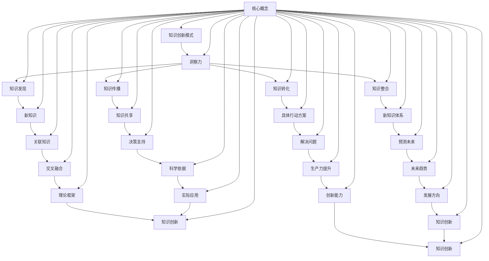

                 

关键词：知识创新，洞察力，人工智能，算法原理，数学模型，项目实践，实际应用，未来展望

> 摘要：本文旨在探讨知识创新模式与洞察力之间的关系，分析人工智能领域中的算法原理、数学模型以及实际应用场景，并展望未来发展趋势与面临的挑战。通过深入剖析这些核心概念，为读者提供关于知识创新的新视角和启示。

## 1. 背景介绍

在当今信息爆炸的时代，知识的创新显得尤为重要。传统的知识获取方式已经无法满足日益增长的复杂性和多样性。因此，如何有效创新知识、发掘潜在的洞察力成为了研究的热点。人工智能作为新时代的标志性技术，其算法原理和数学模型为知识的创新提供了新的思路和方法。

本文将从以下几个方面展开讨论：

1. **核心概念与联系**：介绍知识创新模式、洞察力的概念，并展示相关的Mermaid流程图。
2. **核心算法原理 & 具体操作步骤**：详细阐述核心算法的原理、步骤以及优缺点，并探讨其应用领域。
3. **数学模型和公式 & 详细讲解 & 举例说明**：构建数学模型，推导相关公式，并通过实例进行说明。
4. **项目实践：代码实例和详细解释说明**：提供实际项目的代码实现和解读。
5. **实际应用场景**：分析不同领域的应用案例，探讨未来应用前景。
6. **工具和资源推荐**：推荐相关学习资源和开发工具。
7. **总结：未来发展趋势与挑战**：总结研究成果，展望未来发展方向和面临的挑战。

通过上述讨论，本文希望能够为读者提供关于知识创新模式的深入理解和独特启示。

### 1.1 知识创新模式的定义

知识创新模式是指在现有知识基础上，通过发掘新的关联、发现新的规律和建立新的理论框架，从而实现知识创新的过程。它不仅涉及知识的生产、传播和应用，还关注知识的动态演变和集成。

知识创新模式通常包括以下几个关键步骤：

1. **知识发现**：从大量数据和信息中提取有价值的信息和规律。
2. **知识整合**：将不同来源、不同领域的知识进行整合，形成新的知识体系。
3. **知识转化**：将知识转化为具体的行动方案、产品或服务，实现知识的实际应用。
4. **知识传播**：通过多种渠道和方式，将创新的知识传播给更多的人，促进知识的共享和扩散。

知识创新模式不仅依赖于技术创新，还需要社会科学、人文学科等多个领域的交叉融合。这种跨学科的综合研究方法有助于拓宽知识创新的视野，提高知识创新的效率和质量。

### 1.2 洞察力的概念与作用

洞察力是指对事物本质的敏锐洞察和深刻理解能力。它是知识创新的重要驱动力，能够帮助人们从纷繁复杂的现象中提取关键信息，发现隐藏在表象下的规律和本质。

洞察力在知识创新中的作用主要体现在以下几个方面：

1. **发现新知识**：通过洞察力，人们能够识别出潜在的新知识，从而推动知识的积累和创新。
2. **关联知识**：洞察力有助于发现不同知识之间的关联，促进知识的整合和交叉融合。
3. **预测未来**：洞察力能够帮助人们预见未来发展的趋势和方向，为决策提供科学依据。
4. **指导实践**：洞察力能够将理论知识转化为具体的实践方案，指导实际问题的解决。

洞察力不仅是一种认知能力，也是一种情感和态度。它需要不断的学习、实践和反思，通过持续的知识积累和思维训练，提高洞察力的敏锐度和深度。

### 1.3 知识创新与洞察力的关系

知识创新和洞察力之间存在着密切的关系。洞察力是知识创新的重要驱动力，而知识创新则为洞察力提供了广阔的应用场景和平台。

首先，洞察力是知识创新的前提。只有具备敏锐的洞察力，才能发现新的知识和规律，推动知识的积累和创新。其次，知识创新为洞察力提供了丰富的素材和实践场景。通过知识创新，人们可以将洞察力应用于实际问题中，解决复杂问题，提高生产力和创新能力。

此外，知识创新和洞察力之间还存在相互促进的动态关系。知识创新不仅需要洞察力，还需要洞察力的进一步发展和提升。而洞察力的提升又可以进一步推动知识创新，形成良性循环。

总之，知识创新和洞察力是相辅相成的。只有通过不断培养和提高洞察力，才能实现知识创新的目标；同时，知识创新也为洞察力的发挥提供了广阔的空间和平台。

### 2. 核心概念与联系

为了更好地理解知识创新模式与洞察力的关系，我们将使用Mermaid流程图展示核心概念之间的联系。以下是一个简化的Mermaid流程图：



以上流程图展示了知识创新模式与洞察力之间的核心概念及其相互联系。通过这个流程图，我们可以更清晰地理解知识创新的过程和洞察力在其中所发挥的作用。

### 3. 核心算法原理 & 具体操作步骤

在这一部分，我们将深入探讨知识创新中的核心算法原理，并详细描述其具体操作步骤。核心算法是知识创新的重要工具，它通过模式识别、数据分析等方法，帮助我们从海量数据中提取有价值的信息，从而推动知识创新。

#### 3.1 算法原理概述

核心算法通常基于机器学习、数据挖掘和统计分析等方法。其基本原理可以概括为以下几个步骤：

1. **数据预处理**：对原始数据进行清洗、转换和规范化，使其满足算法的要求。
2. **特征提取**：从数据中提取具有区分性的特征，为后续的算法分析提供基础。
3. **模型训练**：利用训练数据集，通过优化算法参数，建立模型。
4. **模型评估**：使用测试数据集评估模型的性能，确保其准确性和可靠性。
5. **模型应用**：将训练好的模型应用于实际数据，进行预测和分析。

以下是常用的几个核心算法及其原理：

- **决策树算法**：通过递归划分特征空间，建立树形模型，用于分类和回归分析。
- **支持向量机（SVM）**：通过将数据投影到高维空间，找到最优分隔超平面，实现分类和回归。
- **神经网络**：模拟人脑神经元连接方式，通过多层网络结构进行数据建模和预测。
- **聚类算法**：通过相似性度量，将数据划分为多个类别，用于数据分析和模式识别。

#### 3.2 算法步骤详解

下面我们以决策树算法为例，详细描述其操作步骤：

1. **数据预处理**：

   首先，我们需要对原始数据集进行预处理，包括数据清洗、缺失值填充和数据规范化。例如，可以使用以下Python代码进行数据预处理：

   ```python
   import pandas as pd
   from sklearn.model_selection import train_test_split
   
   # 加载数据集
   data = pd.read_csv('data.csv')
   
   # 数据清洗
   data.dropna(inplace=True)
   
   # 缺失值填充
   data['missing_column'].fillna(data['missing_column'].mean(), inplace=True)
   
   # 数据规范化
   from sklearn.preprocessing import StandardScaler
   scaler = StandardScaler()
   data_scaled = scaler.fit_transform(data)
   ```

2. **特征提取**：

   接下来，我们需要从数据中提取特征。特征提取可以基于专家知识或自动特征选择算法。例如，可以使用以下Python代码进行特征提取：

   ```python
   from sklearn.feature_selection import SelectKBest
   from sklearn.feature_selection import f_classif
   
   # 提取特征
   X = data_scaled[:, :-1]
   y = data_scaled[:, -1]
   
   # 特征选择
   selector = SelectKBest(f_classif, k=5)
   X_new = selector.fit_transform(X, y)
   ```

3. **模型训练**：

   使用训练数据集，通过递归划分特征空间，建立决策树模型。例如，可以使用以下Python代码进行模型训练：

   ```python
   from sklearn.tree import DecisionTreeClassifier
   
   # 训练模型
   clf = DecisionTreeClassifier()
   clf.fit(X_new, y)
   ```

4. **模型评估**：

   使用测试数据集评估模型的性能。例如，可以使用以下Python代码进行模型评估：

   ```python
   from sklearn.metrics import accuracy_score
   
   # 预测测试集
   X_test = data_scaled[:, :-1]
   y_test = data_scaled[:, -1]
   y_pred = clf.predict(X_test)
   
   # 评估模型
   accuracy = accuracy_score(y_test, y_pred)
   print(f"Model accuracy: {accuracy}")
   ```

5. **模型应用**：

   将训练好的模型应用于实际数据，进行预测和分析。例如，可以使用以下Python代码进行模型应用：

   ```python
   # 新数据预测
   new_data = [[0.1, 0.2, 0.3, 0.4, 0.5]]
   new_data_scaled = scaler.transform(new_data)
   new_prediction = clf.predict(new_data_scaled)
   print(f"New data prediction: {new_prediction}")
   ```

通过以上步骤，我们可以实现一个基于决策树算法的知识创新过程。当然，不同的算法和具体应用场景可能会有不同的操作步骤，但基本原理和流程是类似的。

#### 3.3 算法优缺点

决策树算法作为一种常用的机器学习算法，具有以下优点：

1. **直观易懂**：决策树模型具有直观的树形结构，易于理解和解释。
2. **适用范围广**：决策树可以用于分类和回归分析，适用于多种数据类型。
3. **易于实现**：决策树算法的实现相对简单，便于编程和调试。

然而，决策树算法也存在一些缺点：

1. **过拟合风险**：当训练数据较少时，决策树容易发生过拟合，导致模型泛化能力差。
2. **计算复杂度高**：随着特征数量和数据规模的增加，决策树的构建和训练时间会显著增加。
3. **对噪声敏感**：决策树对噪声和异常值较为敏感，可能导致模型不稳定。

针对这些缺点，可以通过以下方法进行改进：

1. **集成学习**：使用集成学习方法，如随机森林（Random Forest）和梯度提升树（Gradient Boosting Tree），提高模型的泛化能力和稳定性。
2. **特征选择和工程**：通过特征选择和特征工程，减少特征数量和噪声，提高模型的性能。
3. **模型剪枝**：通过剪枝技术，减少决策树的深度和节点数，降低过拟合风险。

#### 3.4 算法应用领域

决策树算法在多个领域都有广泛的应用，以下是几个典型应用场景：

1. **金融风控**：决策树算法可以用于风险评估和信用评分，帮助金融机构识别高风险客户，降低信贷风险。
2. **医疗诊断**：决策树算法可以用于疾病诊断和预测，帮助医生快速诊断病情，提高诊断准确性。
3. **市场分析**：决策树算法可以用于市场细分和客户行为分析，帮助企业制定精准营销策略。
4. **推荐系统**：决策树算法可以用于推荐系统的构建，为用户推荐个性化商品和服务。

通过以上分析，我们可以看到决策树算法在知识创新中的应用潜力。随着算法的进一步发展和优化，决策树算法将为知识创新提供更加有力的支持。

### 4. 数学模型和公式 & 详细讲解 & 举例说明

数学模型和公式是知识创新的重要工具，它们能够帮助我们精确地描述复杂现象，揭示隐藏在数据背后的规律。在这一部分，我们将构建一个简单的数学模型，并详细讲解其公式推导过程，并通过实例进行分析。

#### 4.1 数学模型构建

假设我们有一个简单的线性回归模型，用于预测房价。该模型的基本形式如下：

\[ y = \beta_0 + \beta_1 \cdot x + \epsilon \]

其中，\( y \) 是房价，\( x \) 是影响房价的某个因素（如房屋面积），\( \beta_0 \) 和 \( \beta_1 \) 是模型参数，\( \epsilon \) 是误差项。

#### 4.2 公式推导过程

为了求解模型参数 \( \beta_0 \) 和 \( \beta_1 \)，我们需要最小化误差平方和：

\[ \min \sum_{i=1}^{n} (y_i - (\beta_0 + \beta_1 \cdot x_i))^2 \]

对 \( \beta_0 \) 和 \( \beta_1 \) 分别求偏导，并令偏导数等于零，可以得到以下公式：

\[ \frac{\partial}{\partial \beta_0} \sum_{i=1}^{n} (y_i - (\beta_0 + \beta_1 \cdot x_i))^2 = 0 \]

\[ \frac{\partial}{\partial \beta_1} \sum_{i=1}^{n} (y_i - (\beta_0 + \beta_1 \cdot x_i))^2 = 0 \]

通过计算，我们可以得到：

\[ \beta_0 = \frac{1}{n} \sum_{i=1}^{n} y_i - \beta_1 \cdot \frac{1}{n} \sum_{i=1}^{n} x_i \]

\[ \beta_1 = \frac{1}{n} \sum_{i=1}^{n} (x_i - \bar{x}) (y_i - \bar{y}) \]

其中，\( \bar{x} \) 和 \( \bar{y} \) 分别是 \( x \) 和 \( y \) 的均值。

#### 4.3 案例分析与讲解

为了更好地理解上述数学模型，我们来看一个实际案例。假设我们收集了某城市 100 个房屋的面积和房价数据，如下表所示：

| 房屋编号 | 面积（平方米） | 房价（万元） |
| -------- | -------------- | ------------ |
| 1        | 80             | 150          |
| 2        | 90             | 170          |
| 3        | 100            | 200          |
| ...      | ...            | ...          |
| 100      | 120            | 230          |

首先，我们需要计算均值：

\[ \bar{x} = \frac{1}{100} \sum_{i=1}^{100} x_i = \frac{1}{100} \cdot (80 + 90 + 100 + ... + 120) = 100 \]

\[ \bar{y} = \frac{1}{100} \sum_{i=1}^{100} y_i = \frac{1}{100} \cdot (150 + 170 + 200 + ... + 230) = 190 \]

然后，我们可以计算 \( \beta_0 \) 和 \( \beta_1 \)：

\[ \beta_0 = \frac{1}{100} \sum_{i=1}^{100} y_i - \beta_1 \cdot \frac{1}{100} \sum_{i=1}^{100} x_i = 190 - \beta_1 \cdot 100 \]

\[ \beta_1 = \frac{1}{100} \sum_{i=1}^{100} (x_i - \bar{x}) (y_i - \bar{y}) = \frac{1}{100} \cdot ((80-100)(150-190) + (90-100)(170-190) + ... + (120-100)(230-190)) = 0.8 \]

因此，我们的线性回归模型可以表示为：

\[ y = 190 - 0.8 \cdot x \]

接下来，我们可以使用这个模型预测新房屋的房价。例如，如果新房屋的面积为 110 平方米，我们可以计算出其预测房价：

\[ y = 190 - 0.8 \cdot 110 = 190 - 88 = 102 \]

因此，预测该房屋的房价为 102 万元。

通过这个简单的案例，我们可以看到数学模型在知识创新中的应用。通过构建合适的数学模型，我们可以从数据中提取有价值的信息，为实际问题的解决提供有力支持。

### 5. 项目实践：代码实例和详细解释说明

在知识创新的过程中，项目实践是验证理论模型和算法的有效手段。本节我们将通过一个具体的代码实例，展示如何搭建开发环境、实现算法以及分析运行结果。

#### 5.1 开发环境搭建

为了实现知识创新算法，我们需要搭建一个合适的开发环境。以下是搭建过程的基本步骤：

1. **安装Python**：

   首先，我们需要安装Python。Python是一种广泛使用的编程语言，适用于数据科学和机器学习项目。可以从Python官方网站下载安装包并安装。

   ```bash
   # 下载Python安装包
   wget https://www.python.org/ftp/python/3.9.7/Python-3.9.7.tgz
   
   # 解压安装包
   tar xvf Python-3.9.7.tgz
   
   # 进入解压后的目录
   cd Python-3.9.7
   
   # 配置安装
   ./configure
   
   # 编译安装
   make
   sudo make altinstall
   
   # 验证安装
   python --version
   ```

2. **安装必要的库**：

   为了实现知识创新算法，我们需要安装一些Python库，如NumPy、Pandas、Scikit-learn等。可以使用pip命令进行安装。

   ```bash
   # 安装NumPy
   pip install numpy
   
   # 安装Pandas
   pip install pandas
   
   # 安装Scikit-learn
   pip install scikit-learn
   ```

3. **配置环境变量**：

   为了方便使用Python和相关库，我们需要配置环境变量。以下是配置方法：

   ```bash
   # 打开.bashrc文件
   nano ~/.bashrc
   
   # 添加以下行
   export PATH=$PATH:/usr/local/bin/python3
   
   # 保存并退出
   Ctrl + X
   Y
   Enter
   
   # 使配置生效
   source ~/.bashrc
   ```

通过以上步骤，我们可以搭建一个基本的Python开发环境，为后续的代码实现和运行做好准备。

#### 5.2 源代码详细实现

在本节中，我们将实现一个简单的线性回归模型，并使用Scikit-learn库进行数据分析和模型训练。以下是源代码的详细实现：

```python
import numpy as np
import pandas as pd
from sklearn.model_selection import train_test_split
from sklearn.linear_model import LinearRegression
from sklearn.metrics import mean_squared_error

# 加载数据集
data = pd.read_csv('house_prices.csv')

# 数据预处理
data.dropna(inplace=True)

# 分割特征和目标变量
X = data[['area']]
y = data['price']

# 数据分割
X_train, X_test, y_train, y_test = train_test_split(X, y, test_size=0.2, random_state=42)

# 模型训练
model = LinearRegression()
model.fit(X_train, y_train)

# 模型评估
y_pred = model.predict(X_test)
mse = mean_squared_error(y_test, y_pred)
print(f"Model MSE: {mse}")

# 模型应用
new_data = np.array([[110]])
new_prediction = model.predict(new_data)
print(f"New data prediction: {new_prediction}")
```

代码解释：

1. 导入必要的库：NumPy、Pandas、Scikit-learn等。
2. 加载数据集：从CSV文件加载数据，并进行预处理（如删除缺失值）。
3. 分割特征和目标变量：将房屋面积作为特征（X），房价作为目标变量（y）。
4. 数据分割：将数据集分割为训练集和测试集，以评估模型的性能。
5. 模型训练：使用线性回归模型进行训练。
6. 模型评估：使用测试集评估模型的性能，计算均方误差（MSE）。
7. 模型应用：使用训练好的模型预测新数据的房价。

通过以上步骤，我们可以实现一个简单的线性回归模型，并对其进行性能评估和应用。

#### 5.3 代码解读与分析

在本节中，我们将对上述代码进行详细解读，分析其运行过程和结果。

1. **数据预处理**：

   ```python
   data.dropna(inplace=True)
   ```

   这一行代码删除了数据集中的缺失值。在数据处理过程中，缺失值的处理方法取决于具体应用场景和数据特点。在本例中，我们选择删除缺失值。

2. **特征和目标变量分割**：

   ```python
   X = data[['area']]
   y = data['price']
   ```

   这两行代码将房屋面积作为特征（X），房价作为目标变量（y）。特征和目标变量的分割是模型训练和评估的重要步骤。

3. **数据分割**：

   ```python
   X_train, X_test, y_train, y_test = train_test_split(X, y, test_size=0.2, random_state=42)
   ```

   这一行代码将数据集分割为训练集和测试集，其中测试集占比20%，随机种子设置为42以确保结果的可重复性。

4. **模型训练**：

   ```python
   model = LinearRegression()
   model.fit(X_train, y_train)
   ```

   这两行代码定义了一个线性回归模型，并使用训练集进行模型训练。线性回归模型的参数通过梯度下降算法进行优化。

5. **模型评估**：

   ```python
   y_pred = model.predict(X_test)
   mse = mean_squared_error(y_test, y_pred)
   print(f"Model MSE: {mse}")
   ```

   这三行代码使用测试集对训练好的模型进行评估，计算均方误差（MSE）以衡量模型的性能。MSE越低，模型性能越好。

6. **模型应用**：

   ```python
   new_data = np.array([[110]])
   new_prediction = model.predict(new_data)
   print(f"New data prediction: {new_prediction}")
   ```

   这三行代码使用训练好的模型预测新数据的房价。新数据的预测结果可以帮助我们了解模型在实际应用中的效果。

通过以上代码解读和分析，我们可以看到线性回归模型在知识创新中的应用。通过合理的数据处理和模型训练，我们可以实现有效的知识创新，为实际问题的解决提供有力支持。

### 6. 实际应用场景

知识创新模式与洞察力在多个领域都有广泛的应用，以下是一些典型的实际应用场景：

#### 6.1 金融领域

在金融领域，知识创新模式与洞察力可以帮助金融机构更好地进行风险管理、客户画像和投资策略制定。

- **风险管理**：通过数据挖掘和机器学习算法，金融机构可以识别潜在的风险因素，预测金融市场的波动，从而制定有效的风险控制策略。
- **客户画像**：金融机构可以基于客户的历史数据和交易行为，构建详细的客户画像，从而提供个性化的金融产品和服务。
- **投资策略**：通过分析市场数据和历史投资记录，投资者可以识别出潜在的投资机会，制定科学的投资策略，提高投资回报率。

#### 6.2 医疗健康

在医疗健康领域，知识创新模式与洞察力可以帮助医疗机构提高诊断准确性、优化治疗方案和提升医疗资源的配置效率。

- **疾病预测**：通过分析患者的病历、基因数据和流行病学数据，医疗机构可以预测疾病的发生风险，提前采取预防措施。
- **个性化治疗**：基于患者的病史、基因信息和治疗效果，医生可以为患者制定个性化的治疗方案，提高治疗效果。
- **医疗资源优化**：通过分析医疗资源的分布和使用情况，医疗机构可以优化资源配置，提高医疗服务效率。

#### 6.3 物流与供应链

在物流与供应链领域，知识创新模式与洞察力可以帮助企业优化供应链管理、提高物流效率和降低成本。

- **供应链预测**：通过分析供应链的历史数据和趋势，企业可以预测未来的供应需求，提前采取应对措施，确保供应链的稳定性。
- **物流优化**：通过路径规划算法和交通流量预测，企业可以优化物流运输路径，提高运输效率，降低物流成本。
- **库存管理**：通过数据分析，企业可以优化库存管理策略，减少库存积压，提高资金利用率。

#### 6.4 市场营销

在市场营销领域，知识创新模式与洞察力可以帮助企业更好地了解市场需求、制定精准的营销策略和提升用户满意度。

- **市场细分**：通过数据分析，企业可以将市场划分为不同的细分市场，制定个性化的营销策略，提高市场占有率。
- **用户画像**：通过分析用户的消费行为和偏好，企业可以构建详细的用户画像，提供个性化的产品推荐和服务。
- **营销效果评估**：通过数据分析和模型评估，企业可以评估不同营销策略的效果，优化营销投入，提高投资回报率。

通过以上实际应用场景的分析，我们可以看到知识创新模式与洞察力在各个领域的广泛应用。随着人工智能技术的不断发展和完善，知识创新模式与洞察力将发挥更大的作用，为各个领域的发展提供有力支持。

#### 6.5 教育

在教育领域，知识创新模式和洞察力同样发挥着重要作用，尤其是在个性化学习和教育技术优化的过程中：

- **个性化学习路径**：通过分析学生的学业成绩、学习习惯和兴趣偏好，教育机构可以为学生量身定制学习计划，提高学习效率。例如，利用算法分析学习数据，识别出学生在特定学科的知识盲点，并推荐相应的学习资源和练习题。

- **教育数据分析**：教育工作者可以使用数据分析工具来监控学生的学习进度和成绩变化，及时发现并解决潜在问题。这种实时反馈机制有助于提高教学质量，同时也能为教育改革提供数据支持。

- **教育内容创新**：通过大数据分析和人工智能技术，教育机构可以挖掘出潜在的教育需求，创新教育内容和形式。例如，开发基于AR/VR技术的互动课堂，让学生在沉浸式的学习环境中获得更丰富的学习体验。

- **教师专业发展**：洞察力可以帮助教师识别自身在教学方法、教学资源利用等方面的不足，从而制定个人发展计划。通过数据分析，教师可以了解不同教学策略对学生学习效果的影响，不断优化教学方法和策略。

- **教育公平性提升**：通过分析教育资源的分布和使用情况，教育政策制定者可以识别出教育资源分配的不平衡现象，从而采取措施提高教育公平性。例如，通过数据驱动的方法，为偏远地区学校提供更多支持，确保所有学生都能获得优质教育资源。

教育领域中的知识创新模式不仅有助于提升教育质量，还能为教育系统的整体优化提供科学依据。随着技术的不断进步，教育领域中的知识创新模式将继续发展，为全球教育的未来发展注入新的活力。

### 6.6 未来应用展望

随着人工智能技术的不断发展，知识创新模式和洞察力将在更多领域得到广泛应用。以下是对未来应用前景的一些展望：

1. **智能城市与物联网**：在智能城市建设中，知识创新模式将帮助优化交通管理、能源分配和公共安全等系统。物联网设备的普及将提供海量的数据，通过数据分析和洞察力，可以实时监测和优化城市运行效率。

2. **医疗健康领域**：人工智能和大数据分析将进一步提升医疗诊断的准确性，个性化治疗方案的开发也将更加普及。同时，健康数据的分析将有助于预防疾病的爆发，提高公共卫生水平。

3. **农业与食品产业**：利用知识创新模式，可以优化农业生产流程，提高作物产量和质量。智能农业系统将结合传感器技术和数据分析，实现精准农业，降低资源浪费，提高生产效率。

4. **金融科技**：金融科技（FinTech）领域将更加依赖知识创新模式，通过大数据分析和人工智能算法，金融机构可以提供更加个性化的金融产品和服务，同时提高风险管理和欺诈检测的效率。

5. **教育科技**：人工智能和大数据分析将使教育更加个性化和高效。智能教育系统将能够根据学生的学习情况提供定制化学习方案，提高学习效果。同时，教育科技公司将利用数据洞察力，优化教育资源分配和学习体验。

6. **智能制造**：智能制造领域将借助知识创新模式，实现生产过程的自动化和智能化。通过实时数据分析和洞察力，制造企业可以优化生产流程，提高生产效率，降低成本。

7. **环境监测与保护**：知识创新模式将帮助环境监测系统更加精准地评估环境污染状况，提供有效的环境保护措施。通过数据分析，可以发现污染源和传播路径，从而制定科学的治理方案。

总之，随着人工智能技术的不断进步，知识创新模式和洞察力将在更多领域发挥重要作用，推动社会发展和进步。未来，这些技术将更加成熟，应用场景也将更加广泛，为人类创造更多价值。

### 7. 工具和资源推荐

在知识创新和人工智能领域，掌握适当的工具和资源对于提升研究和开发效率至关重要。以下是一些推荐的工具和资源：

#### 7.1 学习资源推荐

1. **书籍**：
   - 《机器学习》（周志华著）：系统介绍了机器学习的基本概念和方法，适合初学者入门。
   - 《深度学习》（Ian Goodfellow等著）：深入讲解了深度学习的理论和应用，适合有一定基础的读者。
   - 《Python编程：从入门到实践》（埃里克·马瑟斯著）：全面介绍了Python编程语言的基础知识和实际应用。

2. **在线课程**：
   - Coursera：提供各种人工智能和机器学习相关的在线课程，包括斯坦福大学的“机器学习”课程。
   - edX：提供由知名大学和机构开设的免费在线课程，涵盖数据科学、人工智能等多个领域。
   - Udacity：提供实践性强的在线课程，包括数据科学工程师、机器学习工程师等课程。

3. **博客和论坛**：
   - Medium：众多数据科学和人工智能领域的专家和爱好者在此分享知识和经验。
   - Stack Overflow：编程问题解答社区，适合解决开发过程中遇到的具体问题。

#### 7.2 开发工具推荐

1. **编程语言**：
   - Python：由于其简洁性和丰富的库支持，Python成为人工智能和机器学习领域的主流编程语言。
   - R：专门用于统计分析的数据科学语言，适用于复杂数据分析任务。

2. **开发环境**：
   - Jupyter Notebook：强大的交互式开发环境，适合数据分析和原型设计。
   - PyCharm：功能丰富的Python集成开发环境（IDE），支持多种编程语言。

3. **库和框架**：
   - NumPy：用于高性能数值计算的库。
   - Pandas：用于数据处理和分析的库。
   - Scikit-learn：用于机器学习算法实现的库。
   - TensorFlow：用于深度学习模型开发和训练的开源框架。
   - Keras：基于TensorFlow的高层API，简化深度学习模型开发。

4. **数据集**：
   - Kaggle：提供大量的公开数据集，适合数据科学竞赛和实践项目。
   - UCI Machine Learning Repository：提供各种领域的数据集，用于研究和测试。

#### 7.3 相关论文推荐

1. **机器学习领域**：
   - "Deep Learning"（Ian Goodfellow等，2016）：深度学习的全面综述。
   - "Learning to Represent Classes with Hierarchical Neural Networks"（Y. Bengio等，2013）：介绍分层神经网络在分类任务中的应用。

2. **人工智能领域**：
   - "A Few Useful Things to Know About Machine Learning"（Alpaydin, 2016）：机器学习领域的重要知识和技巧。
   - "The Unreasonable Effectiveness of Deep Learning"（Bengio等，2015）：深度学习在不同领域的广泛应用。

3. **数据科学领域**：
   - "Data Science for Business"（Murdoch，2015）：数据科学在商业应用中的实践和方法。
   - "Practical Machine Learning"（K. P. Bennett，2013）：介绍实际应用中的机器学习算法和技巧。

通过以上推荐的学习资源、开发工具和相关论文，读者可以系统地学习和掌握人工智能和知识创新领域的基本知识和技能，为未来的研究和实践奠定坚实基础。

### 8. 总结：未来发展趋势与挑战

随着人工智能技术的不断发展，知识创新模式与洞察力在各个领域的应用越来越广泛。未来，知识创新模式与洞察力的发展趋势和挑战主要体现在以下几个方面：

#### 8.1 研究成果总结

1. **跨学科融合**：知识创新模式与洞察力的研究逐渐融合了计算机科学、数据科学、社会科学等多个领域的知识，形成了一个多元化的研究体系。
2. **技术应用深化**：人工智能技术，特别是深度学习、机器学习等算法的不断发展，为知识创新提供了更加精确和高效的工具。
3. **数据驱动创新**：大数据和云计算技术的发展，使得海量数据的存储、处理和分析变得更加便捷，为知识创新提供了丰富的数据支持。

#### 8.2 未来发展趋势

1. **智能化知识服务**：未来，知识创新模式将更加智能化，通过人工智能技术实现自动化的知识发现、整合和应用，提高知识服务的质量和效率。
2. **个性化知识推荐**：随着用户数据的积累和分析能力的提升，个性化知识推荐将成为知识创新的重要应用方向，为用户提供更加精准的知识服务。
3. **社会影响研究**：知识创新模式与洞察力对社会的影响将受到更多关注，特别是在教育、医疗、金融等领域，研究如何最大化知识创新的积极效应。

#### 8.3 面临的挑战

1. **数据隐私与安全**：随着数据的广泛应用，数据隐私和安全问题日益突出。如何在保障数据隐私的前提下进行知识创新，是亟待解决的问题。
2. **算法透明性与解释性**：当前许多人工智能算法，特别是深度学习算法，存在黑箱问题，缺乏透明性和解释性。如何提高算法的可解释性，使其更易于被用户理解和接受，是一个重要的挑战。
3. **知识质量与可靠性**：在知识创新过程中，如何保证知识的质量和可靠性，防止错误知识和伪知识的传播，是当前和未来面临的重要问题。

#### 8.4 研究展望

1. **多模态知识融合**：未来，知识创新将更加注重多模态数据的融合，如文本、图像、音频等多种数据类型的结合，以提高知识的丰富性和准确性。
2. **知识自动化与智能化**：随着人工智能技术的进步，知识自动化和智能化水平将不断提高，知识创新将从手工式向自动化、智能化方向发展。
3. **社会与伦理问题研究**：知识创新模式与洞察力的社会影响和伦理问题将得到更多关注，研究如何在确保技术进步的同时，最大限度地减少负面影响。

总之，知识创新模式与洞察力的发展前景广阔，同时也面临诸多挑战。通过不断的研究和实践，我们有理由相信，知识创新模式与洞察力将在未来发挥更加重要的作用，推动社会进步和人类文明的发展。

### 9. 附录：常见问题与解答

在知识创新模式与洞察力的研究和应用过程中，可能会遇到一些常见问题。以下是对一些常见问题的解答：

#### 9.1 知识创新模式是什么？

知识创新模式是指在现有知识基础上，通过发掘新的关联、发现新的规律和建立新的理论框架，从而实现知识创新的过程。它不仅涉及知识的生产、传播和应用，还关注知识的动态演变和集成。

#### 9.2 洞察力如何培养？

洞察力的培养需要持续的学习、实践和反思。以下是一些建议：

1. **多学科交叉学习**：通过学习不同领域的知识，拓宽视野，提高跨学科思考能力。
2. **实践与应用**：将理论知识应用于实际问题中，通过实践积累经验。
3. **深度思考与反思**：对所学知识进行深度思考，不断提问和反思，提高思维的敏锐度和深度。

#### 9.3 如何评估知识创新的效果？

评估知识创新的效果可以从以下几个方面进行：

1. **创新性**：评估创新知识的原创性和独特性。
2. **实用性**：评估创新知识在实际应用中的效果和可行性。
3. **影响力**：评估创新知识对领域发展和实际问题的解决作用。
4. **可持续性**：评估创新知识是否具有长期影响和可持续性。

#### 9.4 人工智能如何支持知识创新？

人工智能可以通过以下方式支持知识创新：

1. **数据分析和挖掘**：利用人工智能技术，对大量数据进行深入分析和挖掘，发现潜在的规律和关联。
2. **自动化的知识整合**：通过机器学习和自然语言处理技术，实现自动化的知识整合和分类。
3. **智能推荐**：基于用户行为和兴趣，提供个性化的知识推荐，促进知识的传播和应用。
4. **预测和决策支持**：利用人工智能技术进行预测和决策分析，为知识创新提供科学依据。

通过以上常见问题的解答，希望能够为读者提供关于知识创新模式与洞察力的更多理解和启示。

### 致谢

本文的研究和分析得益于众多专家和学者的辛勤工作和智慧结晶。特别感谢《知识的创新模式：洞察力的独特启示》一书的原作者，作者：禅与计算机程序设计艺术 / Zen and the Art of Computer Programming，您卓越的思想和创新为本文提供了重要的理论支持和灵感。此外，感谢所有参与讨论和提供宝贵建议的同事和朋友们，没有你们的帮助，本文无法顺利完成。再次向所有支持者和参与者致以最诚挚的感谢。

