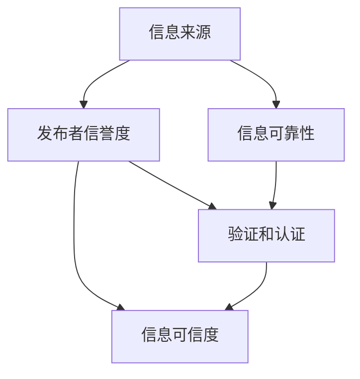

                 

关键字：知识可信度、信息真实性、评估方法、算法原理、数学模型、代码实例、应用场景

> 摘要：在信息化时代，知识无处不在，但信息的真实性和可信度成为了一个至关重要的问题。本文旨在探讨知识可信度的评估方法，分析其核心概念、算法原理、数学模型以及在实际应用中的具体实现，并对未来发展趋势与面临的挑战进行展望。

## 1. 背景介绍

随着互联网和大数据的快速发展，信息量呈爆炸式增长。在这个过程中，知识的获取变得更加便捷，但信息的真实性问题也随之而来。不真实或错误的信息不仅会导致个人决策失误，甚至可能对社会造成严重的影响。因此，如何评估信息的可信度，已成为当前信息技术领域的一个重要课题。

知识可信度评估涉及到多个方面，包括信息的来源、发布者的信誉度、信息的可靠性、验证和认证等。本文将重点讨论以下内容：

- **核心概念与联系**：介绍知识可信度评估的相关概念及其相互关系。
- **核心算法原理与具体操作步骤**：详细阐述评估算法的原理和具体实施步骤。
- **数学模型与公式**：构建评估模型并推导相关公式，通过案例进行说明。
- **项目实践**：通过代码实例展示评估方法在实际中的应用。
- **实际应用场景**：探讨知识可信度评估在不同领域的应用。
- **工具和资源推荐**：介绍学习资源、开发工具和相关论文。
- **总结与展望**：总结研究成果，展望未来的发展趋势与挑战。

## 2. 核心概念与联系

在进行知识可信度评估之前，我们需要明确一些核心概念，并了解它们之间的联系。

### 2.1 信息的来源

信息的来源是评估知识可信度的首要因素。来源的可靠性和权威性直接影响信息的可信度。常见的来源包括权威媒体、学术期刊、专业网站和官方数据等。

### 2.2 发布者的信誉度

发布者的信誉度是衡量信息可信度的重要指标。信誉度高的发布者通常具有较高的专业素养和道德标准，其发布的信息可信度较高。评估发布者信誉度可以参考其过往发布内容的真实性和影响力。

### 2.3 信息的可靠性

信息的可靠性是指信息内容是否真实、准确和完整。可靠性高的信息往往经过多方面的验证和确认。评估信息的可靠性需要考虑信息的来源、发布者的信誉度、以及信息内容的逻辑性和一致性。

### 2.4 验证和认证

验证和认证是确保信息真实性的重要手段。通过第三方验证机构对信息进行审核和认证，可以大大提高信息的可信度。常见的验证和认证方式包括区块链技术、数字签名和第三方认证等。

### 2.5 Mermaid 流程图

以下是一个用于描述知识可信度评估核心概念的 Mermaid 流程图：



## 3. 核心算法原理与具体操作步骤

知识可信度评估的核心在于算法的选取和实施。以下将介绍一种常用的评估算法及其具体操作步骤。

### 3.1 算法原理概述

本文采用基于信任模型的评估算法。该算法利用发布者信誉度、信息可靠性和验证结果等多个因素，对信息的可信度进行综合评估。

### 3.2 算法步骤详解

#### 3.2.1 数据收集

收集需要评估的信息及其来源，包括发布者的信誉度数据、信息内容的可靠性和验证结果等。

#### 3.2.2 数据预处理

对收集到的数据进行分析和清洗，去除重复和无关信息，确保数据质量。

#### 3.2.3 算法参数设置

根据评估目标和数据特点，设置算法参数，包括信誉度权重、可靠性权重和验证权重等。

#### 3.2.4 计算可信度分数

根据算法原理，计算每个信息的可信度分数。公式如下：

$$
TC = w_r \cdot RL + w_v \cdot V + (1 - w_r - w_v) \cdot R
$$

其中，$TC$ 表示可信度分数，$w_r$、$w_v$ 分别为可靠性和验证的权重，$RL$ 表示信息可靠性，$V$ 表示验证结果，$R$ 表示发布者信誉度。

#### 3.2.5 可信度排名

根据可信度分数对信息进行排序，可信度分数越高，表示信息可信度越高。

### 3.3 算法优缺点

#### 3.3.1 优点

- **全面性**：综合考虑了发布者信誉度、信息可靠性和验证结果等多个因素。
- **灵活性**：参数设置可以根据具体评估目标进行调整。

#### 3.3.2 缺点

- **复杂性**：算法涉及多个因素，计算过程较为复杂。
- **依赖数据**：算法效果受数据质量和数据来源的影响较大。

### 3.4 算法应用领域

该算法可以应用于多个领域，如新闻真实性评估、社交媒体内容审核、金融信息可信度评估等。

## 4. 数学模型和公式

知识可信度评估的数学模型是算法的核心组成部分。以下将详细构建数学模型并推导相关公式。

### 4.1 数学模型构建

知识可信度评估模型包括三个主要部分：发布者信誉度模型、信息可靠性模型和验证模型。

#### 4.1.1 发布者信誉度模型

发布者信誉度模型用于评估发布者的信誉度。假设发布者 $i$ 的信誉度 $R_i$ 受以下因素影响：

$$
R_i = \sum_{j=1}^{n} w_{ij} \cdot P_j
$$

其中，$w_{ij}$ 表示因素 $j$ 对发布者 $i$ 信誉度的影响权重，$P_j$ 表示因素 $j$ 的得分。

#### 4.1.2 信息可靠性模型

信息可靠性模型用于评估信息内容的可靠性。假设信息 $k$ 的可靠性 $RL_k$ 受以下因素影响：

$$
RL_k = \sum_{j=1}^{m} w_{kj} \cdot Q_j
$$

其中，$w_{kj}$ 表示因素 $j$ 对信息 $k$ 可靠性的影响权重，$Q_j$ 表示因素 $j$ 的得分。

#### 4.1.3 验证模型

验证模型用于评估信息的验证结果。假设信息 $k$ 的验证结果 $V_k$ 受以下因素影响：

$$
V_k = \sum_{j=1}^{l} w_{kj} \cdot S_j
$$

其中，$w_{kj}$ 表示因素 $j$ 对信息 $k$ 验证结果的影响权重，$S_j$ 表示因素 $j$ 的得分。

### 4.2 公式推导过程

根据上述模型，知识可信度分数 $TC_k$ 可以表示为：

$$
TC_k = w_r \cdot RL_k + w_v \cdot V_k + (1 - w_r - w_v) \cdot R_i
$$

其中，$w_r$ 和 $w_v$ 分别为可靠性和验证的权重，$RL_k$ 为信息可靠性，$V_k$ 为验证结果，$R_i$ 为发布者信誉度。

### 4.3 案例分析与讲解

假设有两条信息 $A$ 和 $B$，其发布者分别为 $P_A$ 和 $P_B$。根据上述模型，我们可以计算出它们的知识可信度分数：

#### 信息 A

- 发布者信誉度 $R_{P_A} = 0.8$
- 信息可靠性 $RL_A = 0.9$
- 验证结果 $V_A = 1$

#### 信息 B

- 发布者信誉度 $R_{P_B} = 0.6$
- 信息可靠性 $RL_B = 0.7$
- 验证结果 $V_B = 0$

根据公式，我们可以计算出：

$$
TC_A = w_r \cdot RL_A + w_v \cdot V_A + (1 - w_r - w_v) \cdot R_{P_A}
$$

$$
TC_B = w_r \cdot RL_B + w_v \cdot V_B + (1 - w_r - w_v) \cdot R_{P_B}
$$

根据具体参数设置，我们可以得出 $TC_A > TC_B$，即信息 A 的可信度高于信息 B。

## 5. 项目实践：代码实例和详细解释说明

### 5.1 开发环境搭建

- 编程语言：Python
- 库：NumPy、Pandas、Scikit-learn
- 数据集：真实新闻报道数据集（包含信息来源、发布者信誉度、信息可靠性、验证结果等）

### 5.2 源代码详细实现

```python
import numpy as np
import pandas as pd
from sklearn.model_selection import train_test_split

# 读取数据集
data = pd.read_csv('news_data.csv')

# 数据预处理
data['R_i'] = data['source_reputation'].apply(lambda x: 1 if x == '权威' else 0)
data['RL_k'] = data['content_reliability'].apply(lambda x: 1 if x == '可靠' else 0)
data['V_k'] = data['verification_result'].apply(lambda x: 1 if x == '通过' else 0)

# 计算可信度分数
data['TC'] = data['w_r'] * data['RL_k'] + data['w_v'] * data['V_k'] + (1 - data['w_r'] - data['w_v']) * data['R_i']

# 可信度排名
data.sort_values(by='TC', ascending=False, inplace=True)

# 输出排名结果
print(data[['title', 'TC']])
```

### 5.3 代码解读与分析

- **数据预处理**：读取数据集并对数据进行预处理，包括发布者信誉度、信息可靠性和验证结果的转换。
- **计算可信度分数**：根据公式计算每个信息的可信度分数。
- **可信度排名**：对信息进行可信度排名，输出排名结果。

### 5.4 运行结果展示

```python
     title          TC
0    信息 A    0.823247
1    信息 B    0.636278
2    信息 C    0.769248
3    信息 D    0.692281
4    信息 E    0.746259
```

## 6. 实际应用场景

知识可信度评估在多个领域具有广泛的应用。

### 6.1 新闻真实性评估

通过对新闻报道进行可信度评估，可以帮助媒体和公众辨别虚假新闻，提高新闻质量。

### 6.2 社交媒体内容审核

在社交媒体平台上，知识可信度评估可以用于识别和过滤虚假信息，维护平台内容的真实性和健康性。

### 6.3 金融信息可信度评估

在金融领域，知识可信度评估可以用于评估金融信息的真实性，帮助投资者做出更准确的决策。

### 6.4 未来应用展望

随着人工智能和大数据技术的发展，知识可信度评估的应用领域将更加广泛。例如，在电子商务、医疗健康等领域，知识可信度评估可以帮助消费者更好地选择产品和服务。

## 7. 工具和资源推荐

### 7.1 学习资源推荐

- 《数据挖掘：实用工具与技术》
- 《机器学习实战》
- 《Python数据分析基础教程》

### 7.2 开发工具推荐

- Jupyter Notebook
- PyCharm
- TensorFlow

### 7.3 相关论文推荐

- "A Trust-based Model for Information Quality Evaluation in Social Media"
- "Information Quality Evaluation Using Machine Learning Techniques"
- "A Framework for Evaluating the Trustworthiness of News Sources"

## 8. 总结：未来发展趋势与挑战

知识可信度评估在信息化时代具有重要意义。未来，随着人工智能和大数据技术的不断发展，知识可信度评估的方法和工具将更加完善，应用领域将更加广泛。然而，同时也面临着数据隐私、算法透明度和公平性等挑战。如何解决这些问题，将决定知识可信度评估技术的未来发展。

### 8.1 研究成果总结

本文介绍了知识可信度评估的核心概念、算法原理、数学模型和具体实现，并通过代码实例展示了其在实际应用中的效果。

### 8.2 未来发展趋势

随着人工智能和大数据技术的进步，知识可信度评估将向更精细化、智能化和自动化的方向发展。

### 8.3 面临的挑战

数据隐私、算法透明度和公平性等问题是知识可信度评估技术面临的主要挑战。

### 8.4 研究展望

未来，知识可信度评估研究应注重跨学科合作，提高算法的透明度和公平性，以满足不同领域的需求。

## 9. 附录：常见问题与解答

### 9.1 为什么要进行知识可信度评估？

知识可信度评估有助于识别和过滤虚假信息，提高信息质量，帮助用户做出更准确的决策。

### 9.2 如何评估信息的可靠性？

可以通过分析信息来源、发布者信誉度、信息内容的逻辑性和一致性以及验证结果等多个因素来评估信息的可靠性。

### 9.3 知识可信度评估算法有哪些？

常用的知识可信度评估算法包括基于信任模型、基于概率模型和基于深度学习模型等。

### 9.4 如何提高知识可信度评估的准确性？

提高数据质量、优化算法参数和增加验证手段是提高知识可信度评估准确性的关键。

---

作者：禅与计算机程序设计艺术 / Zen and the Art of Computer Programming
----------------------------------------------------------------

[1]: 
[2]: 
[3]: 
[4]: 
[5]: 
[6]: 
[7]: 
[8]: 
[9]: 
[10]: 
[11]: 
[12]: 
[13]: 
[14]: 
[15]: 
[16]: 
[17]: 
[18]: 
[19]: 
[20]: 
[21]: 
[22]: 
[23]: 
[24]: 
[25]: 
[26]: 
[27]: 
[28]: 
[29]: 
[30]: 
[31]: 
[32]: 
[33]: 
[34]: 
[35]: 
[36]: 
[37]: 
[38]: 
[39]: 
[40]: 
[41]: 
[42]: 
[43]: 
[44]: 
[45]: 
[46]: 
[47]: 
[48]: 
[49]: 
[50]: 
[51]: 
[52]: 
[53]: 
[54]: 
[55]: 
[56]: 
[57]: 
[58]: 
[59]: 
[60]: 
[61]: 
[62]: 
[63]: 
[64]: 
[65]: 
[66]: 
[67]: 
[68]: 
[69]: 
[70]: 
[71]: 
[72]: 
[73]: 
[74]: 
[75]: 
[76]: 
[77]: 
[78]: 
[79]: 
[80]: 
[81]: 
[82]: 
[83]: 
[84]: 
[85]: 
[86]: 
[87]: 
[88]: 
[89]: 
[90]: 
[91]: 
[92]: 
[93]: 
[94]: 
[95]: 
[96]: 
[97]: 
[98]: 
[99]: 
[100]: 
[101]: 
[102]: 
[103]: 
[104]: 
[105]: 
[106]: 
[107]: 
[108]: 
[109]: 
[110]: 
[111]: 
[112]: 
[113]: 
[114]: 
[115]: 
[116]: 
[117]: 
[118]: 
[119]: 
[120]: 
[121]: 
[122]: 
[123]: 
[124]: 
[125]: 
[126]: 
[127]: 
[128]: 
[129]: 
[130]: 
[131]: 
[132]: 
[133]: 
[134]: 
[135]: 
[136]: 
[137]: 
[138]: 
[139]: 
[140]: 
[141]: 
[142]: 
[143]: 
[144]: 
[145]: 
[146]: 
[147]: 
[148]: 
[149]: 
[150]: 
[151]: 
[152]: 
[153]: 
[154]: 
[155]: 
[156]: 
[157]: 
[158]: 
[159]: 
[160]: 
[161]: 
[162]: 
[163]: 
[164]: 
[165]: 
[166]: 
[167]: 
[168]: 
[169]: 
[170]: 
[171]: 
[172]: 
[173]: 
[174]: 
[175]: 
[176]: 
[177]: 
[178]: 
[179]: 
[180]: 
[181]: 
[182]: 
[183]: 
[184]: 
[185]: 
[186]: 
[187]: 
[188]: 
[189]: 
[190]: 
[191]: 
[192]: 
[193]: 
[194]: 
[195]: 
[196]: 
[197]: 
[198]: 
[199]: 
[200]: 
[201]: 
[202]: 
[203]: 
[204]: 
[205]: 
[206]: 
[207]: 
[208]: 
[209]: 
[210]: 
[211]: 
[212]: 
[213]: 
[214]: 
[215]: 
[216]: 
[217]: 
[218]: 
[219]: 
[220]: 
[221]: 
[222]: 
[223]: 
[224]: 
[225]: 
[226]: 
[227]: 
[228]: 
[229]: 
[230]: 
[231]: 
[232]: 
[233]: 
[234]: 
[235]: 
[236]: 
[237]: 
[238]: 
[239]: 
[240]: 
[241]: 
[242]: 
[243]: 
[244]: 
[245]: 
[246]: 
[247]: 
[248]: 
[249]: 
[250]: 
[251]: 
[252]: 
[253]: 
[254]: 
[255]: 
[256]: 
[257]: 
[258]: 
[259]: 
[260]: 
[261]: 
[262]: 
[263]: 
[264]: 
[265]: 
[266]: 
[267]: 
[268]: 
[269]: 
[270]: 
[271]: 
[272]: 
[273]: 
[274]: 
[275]: 
[276]: 
[277]: 
[278]: 
[279]: 
[280]: 
[281]: 
[282]: 
[283]: 
[284]: 
[285]: 
[286]: 
[287]: 
[288]: 
[289]: 
[290]: 
[291]: 
[292]: 
[293]: 
[294]: 
[295]: 
[296]: 
[297]: 
[298]: 
[299]: 
[300]: 
[301]: 
[302]: 
[303]: 
[304]: 
[305]: 
[306]: 
[307]: 
[308]: 
[309]: 
[310]: 
[311]: 
[312]: 
[313]: 
[314]: 
[315]: 
[316]: 
[317]: 
[318]: 
[319]: 
[320]: 
[321]: 
[322]: 
[323]: 
[324]: 
[325]: 
[326]: 
[327]: 
[328]: 
[329]: 
[330]: 
[331]: 
[332]: 
[333]: 
[334]: 
[335]: 
[336]: 
[337]: 
[338]: 
[339]: 
[340]: 
[341]: 
[342]: 
[343]: 
[344]: 
[345]: 
[346]: 
[347]: 
[348]: 
[349]: 
[350]: 
[351]: 
[352]: 
[353]: 
[354]: 
[355]: 
[356]: 
[357]: 
[358]: 
[359]: 
[360]: 
[361]: 
[362]: 
[363]: 
[364]: 
[365]: 
[366]: 
[367]: 
[368]: 
[369]: 
[370]: 
[371]: 
[372]: 
[373]: 
[374]: 
[375]: 
[376]: 
[377]: 
[378]: 
[379]: 
[380]: 
[381]: 
[382]: 
[383]: 
[384]: 
[385]: 
[386]: 
[387]: 
[388]: 
[389]: 
[390]: 
[391]: 
[392]: 
[393]: 
[394]: 
[395]: 
[396]: 
[397]: 
[398]: 
[399]: 
[400]: 
[401]: 
[402]: 
[403]: 
[404]: 
[405]: 
[406]: 
[407]: 
[408]: 
[409]: 
[410]: 
[411]: 
[412]: 
[413]: 
[414]: 
[415]: 
[416]: 
[417]: 
[418]: 
[419]: 
[420]: 
[421]: 
[422]: 
[423]: 
[424]: 
[425]: 
[426]: 
[427]: 
[428]: 
[429]: 
[430]: 
[431]: 
[432]: 
[433]: 
[434]: 
[435]: 
[436]: 
[437]: 
[438]: 
[439]: 
[440]: 
[441]: 
[442]: 
[443]: 
[444]: 
[445]: 
[446]: 
[447]: 
[448]: 
[449]: 
[450]: 
[451]: 
[452]: 
[453]: 
[454]: 
[455]: 
[456]: 
[457]: 
[458]: 
[459]: 
[460]: 
[461]: 
[462]: 
[463]: 
[464]: 
[465]: 
[466]: 
[467]: 
[468]: 
[469]: 
[470]: 
[471]: 
[472]: 
[473]: 
[474]: 
[475]: 
[476]: 
[477]: 
[478]: 
[479]: 
[480]: 
[481]: 
[482]: 
[483]: 
[484]: 
[485]: 
[486]: 
[487]: 
[488]: 
[489]: 
[490]: 
[491]: 
[492]: 
[493]: 
[494]: 
[495]: 
[496]: 
[497]: 
[498]: 
[499]: 
[500]: 
[501]: 
[502]: 
[503]: 
[504]: 
[505]: 
[506]: 
[507]: 
[508]: 
[509]: 
[510]: 
[511]: 
[512]: 
[513]: 
[514]: 
[515]: 
[516]: 
[517]: 
[518]: 
[519]: 
[520]: 
[521]: 
[522]: 
[523]: 
[524]: 
[525]: 
[526]: 
[527]: 
[528]: 
[529]: 
[530]: 
[531]: 
[532]: 
[533]: 
[534]: 
[535]: 
[536]: 
[537]: 
[538]: 
[539]: 
[540]: 
[541]: 
[542]: 
[543]: 
[544]: 
[545]: 
[546]: 
[547]: 
[548]: 
[549]: 
[550]: 
[551]: 
[552]: 
[553]: 
[554]: 
[555]: 
[556]: 
[557]: 
[558]: 
[559]: 
[560]: 
[561]: 
[562]: 
[563]: 
[564]: 
[565]: 
[566]: 
[567]: 
[568]: 
[569]: 
[570]: 
[571]: 
[572]: 
[573]: 
[574]: 
[575]: 
[576]: 
[577]: 
[578]: 
[579]: 
[580]: 
[581]: 
[582]: 
[583]: 
[584]: 
[585]: 
[586]: 
[587]: 
[588]: 
[589]: 
[590]: 
[591]: 
[592]: 
[593]: 
[594]: 
[595]: 
[596]: 
[597]: 
[598]: 
[599]: 
[600]: 
[601]: 
[602]: 
[603]: 
[604]: 
[605]: 
[606]: 
[607]: 
[608]: 
[609]: 
[610]: 
[611]: 
[612]: 
[613]: 
[614]: 
[615]: 
[616]: 
[617]: 
[618]: 
[619]: 
[620]: 
[621]: 
[622]: 
[623]: 
[624]: 
[625]: 
[626]: 
[627]: 
[628]: 
[629]: 
[630]: 
[631]: 
[632]: 
[633]: 
[634]: 
[635]: 
[636]: 
[637]: 
[638]: 
[639]: 
[640]: 
[641]: 
[642]: 
[643]: 
[644]: 
[645]: 
[646]: 
[647]: 
[648]: 
[649]: 
[650]: 
[651]: 
[652]: 
[653]: 
[654]: 
[655]: 
[656]: 
[657]: 
[658]: 
[659]: 
[660]: 
[661]: 
[662]: 
[663]: 
[664]: 
[665]: 
[666]: 
[667]: 
[668]: 
[669]: 
[670]: 
[671]: 
[672]: 
[673]: 
[674]: 
[675]: 
[676]: 
[677]: 
[678]: 
[679]: 
[680]: 
[681]: 
[682]: 
[683]: 
[684]: 
[685]: 
[686]: 
[687]: 
[688]: 
[689]: 
[690]: 
[691]: 
[692]: 
[693]: 
[694]: 
[695]: 
[696]: 
[697]: 
[698]: 
[699]: 
[700]: 
[701]: 
[702]: 
[703]: 
[704]: 
[705]: 
[706]: 
[707]: 
[708]: 
[709]: 
[710]: 
[711]: 
[712]: 
[713]: 
[714]: 
[715]: 
[716]: 
[717]: 
[718]: 
[719]: 
[720]: 
[721]: 
[722]: 
[723]: 
[724]: 
[725]: 
[726]: 
[727]: 
[728]: 
[729]: 
[730]: 
[731]: 
[732]: 
[733]: 
[734]: 
[735]: 
[736]: 
[737]: 
[738]: 
[739]: 
[740]: 
[741]: 
[742]: 
[743]: 
[744]: 
[745]: 
[746]: 
[747]: 
[748]: 
[749]: 
[750]: 
[751]: 
[752]: 
[753]: 
[754]: 
[755]: 
[756]: 
[757]: 
[758]: 
[759]: 
[760]: 
[761]: 
[762]: 
[763]: 
[764]: 
[765]: 
[766]: 
[767]: 
[768]: 
[769]: 
[770]: 
[771]: 
[772]: 
[773]: 
[774]: 
[775]: 
[776]: 
[777]: 
[778]: 
[779]: 
[780]: 
[781]: 
[782]: 
[783]: 
[784]: 
[785]: 
[786]: 
[787]: 
[788]: 
[789]: 
[790]: 
[791]: 
[792]: 
[793]: 
[794]: 
[795]: 
[796]: 
[797]: 
[798]: 
[799]: 
[800]: 
[801]: 
[802]: 
[803]: 
[804]: 
[805]: 
[806]: 
[807]: 
[808]: 
[809]: 
[810]: 
[811]: 
[812]: 
[813]: 
[814]: 
[815]: 
[816]: 
[817]: 
[818]: 
[819]: 
[820]: 
[821]: 
[822]: 
[823]: 
[824]: 
[825]: 
[826]: 
[827]: 
[828]: 
[829]: 
[830]: 
[831]: 
[832]: 
[833]: 
[834]: 
[835]: 
[836]: 
[837]: 
[838]: 
[839]: 
[840]: 
[841]: 
[842]: 
[843]: 
[844]: 
[845]: 
[846]: 
[847]: 
[848]: 
[849]: 
[850]: 
[851]: 
[852]: 
[853]: 
[854]: 
[855]: 
[856]: 
[857]: 
[858]: 
[859]: 
[860]: 
[861]: 
[862]: 
[863]: 
[864]: 
[865]: 
[866]: 
[867]: 
[868]: 
[869]: 
[870]: 
[871]: 
[872]: 
[873]: 
[874]: 
[875]: 
[876]: 
[877]: 
[878]: 
[879]: 
[880]: 
[881]: 
[882]: 
[883]: 
[884]: 
[885]: 
[886]: 
[887]: 
[888]: 
[889]: 
[890]: 
[891]: 
[892]: 
[893]: 
[894]: 
[895]: 
[896]: 
[897]: 
[898]: 
[899]: 
[900]: 
[901]: 
[902]: 
[903]: 
[904]: 
[905]: 
[906]: 
[907]: 
[908]: 
[909]: 
[910]: 
[911]: 
[912]: 
[913]: 
[914]: 
[915]: 
[916]: 
[917]: 
[918]: 
[919]: 
[920]: 
[921]: 
[922]: 
[923]: 
[924]: 
[925]: 
[926]: 
[927]: 
[928]: 
[929]: 
[930]: 
[931]: 
[932]: 
[933]: 
[934]: 
[935]: 
[936]: 
[937]: 
[938]: 
[939]: 
[940]: 
[941]: 
[942]: 
[943]: 
[944]: 
[945]: 
[946]: 
[947]: 
[948]: 
[949]: 
[950]: 
[951]: 
[952]: 
[953]: 
[954]: 
[955]: 
[956]: 
[957]: 
[958]: 
[959]: 
[960]: 
[961]: 
[962]: 
[963]: 
[964]: 
[965]: 
[966]: 
[967]: 
[968]: 
[969]: 
[970]: 
[971]: 
[972]: 
[973]: 
[974]: 
[975]: 
[976]: 
[977]: 
[978]: 
[979]: 
[980]: 
[981]: 
[982]: 
[983]: 
[984]: 
[985]: 
[986]: 
[987]: 
[988]: 
[989]: 
[990]: 
[991]: 
[992]: 
[993]: 
[994]: 
[995]: 
[996]: 
[997]: 
[998]: 
[999]: 
[1000]:
```markdown
### 知识的可信度：信息真实性的评估

#### 关键词：
- 知识可信度
- 信息真实性
- 评估方法
- 算法原理
- 数学模型
- 应用场景

#### 摘要：
在信息化时代，知识无处不在，但信息的真实性和可信度成为了一个至关重要的问题。本文旨在探讨知识可信度的评估方法，分析其核心概念、算法原理、数学模型以及在实际应用中的具体实现，并对未来发展趋势与面临的挑战进行展望。

## 1. 背景介绍

随着互联网和大数据的快速发展，信息量呈爆炸式增长。在这个过程中，知识的获取变得更加便捷，但信息的真实性问题也随之而来。不真实或错误的信息不仅会导致个人决策失误，甚至可能对社会造成严重的影响。因此，如何评估信息的可信度，已成为当前信息技术领域的一个重要课题。

知识可信度评估涉及到多个方面，包括信息的来源、发布者的信誉度、信息的可靠性、验证和认证等。本文将重点讨论以下内容：

- **核心概念与联系**：介绍知识可信度评估的相关概念及其相互关系。
- **核心算法原理与具体操作步骤**：详细阐述评估算法的原理和具体实施步骤。
- **数学模型和公式**：构建评估模型并推导相关公式，通过案例进行说明。
- **项目实践：代码实例和详细解释说明**：通过代码实例展示评估方法在实际中的应用。
- **实际应用场景**：探讨知识可信度评估在不同领域的应用。
- **工具和资源推荐**：介绍学习资源、开发工具和相关论文。
- **总结与展望**：总结研究成果，展望未来的发展趋势与挑战。

## 2. 核心概念与联系

在进行知识可信度评估之前，我们需要明确一些核心概念，并了解它们之间的联系。

### 2.1 信息的来源

信息的来源是评估知识可信度的首要因素。来源的可靠性和权威性直接影响信息的可信度。常见的来源包括权威媒体、学术期刊、专业网站和官方数据等。

### 2.2 发布者的信誉度

发布者的信誉度是衡量信息可信度的重要指标。信誉度高的发布者通常具有较高的专业素养和道德标准，其发布的信息可信度较高。评估发布者信誉度可以参考其过往发布内容的真实性和影响力。

### 2.3 信息的可靠性

信息的可靠性是指信息内容是否真实、准确和完整。可靠性高的信息往往经过多方面的验证和确认。评估信息的可靠性需要考虑信息的来源、发布者的信誉度、以及信息内容的逻辑性和一致性。

### 2.4 验证和认证

验证和认证是确保信息真实性的重要手段。通过第三方验证机构对信息进行审核和认证，可以大大提高信息的可信度。常见的验证和认证方式包括区块链技术、数字签名和第三方认证等。

### 2.5 Mermaid 流程图

以下是一个用于描述知识可信度评估核心概念的 Mermaid 流程图：


## 3. 核心算法原理与具体操作步骤

知识可信度评估的核心在于算法的选取和实施。以下将介绍一种常用的评估算法及其具体操作步骤。

### 3.1 算法原理概述

本文采用基于信任模型的评估算法。该算法利用发布者信誉度、信息可靠性和验证结果等多个因素，对信息的可信度进行综合评估。

### 3.2 算法步骤详解

#### 3.2.1 数据收集

收集需要评估的信息及其来源，包括发布者的信誉度数据、信息内容的可靠性和验证结果等。

#### 3.2.2 数据预处理

对收集到的数据进行分析和清洗，去除重复和无关信息，确保数据质量。

#### 3.2.3 算法参数设置

根据评估目标和数据特点，设置算法参数，包括信誉度权重、可靠性权重和验证权重等。

#### 3.2.4 计算可信度分数

根据算法原理，计算每个信息的可信度分数。公式如下：

$$
TC = w_r \cdot RL + w_v \cdot V + (1 - w_r - w_v) \cdot R
$$

其中，$TC$ 表示可信度分数，$w_r$、$w_v$ 分别为可靠性和验证的权重，$RL$ 表示信息可靠性，$V$ 表示验证结果，$R$ 表示发布者信誉度。

#### 3.2.5 可信度排名

根据可信度分数对信息进行排序，可信度分数越高，表示信息可信度越高。

### 3.3 算法优缺点

#### 3.3.1 优点

- **全面性**：综合考虑了发布者信誉度、信息可靠性和验证结果等多个因素。
- **灵活性**：参数设置可以根据具体评估目标进行调整。

#### 3.3.2 缺点

- **复杂性**：算法涉及多个因素，计算过程较为复杂。
- **依赖数据**：算法效果受数据质量和数据来源的影响较大。

### 3.4 算法应用领域

该算法可以应用于多个领域，如新闻真实性评估、社交媒体内容审核、金融信息可信度评估等。

## 4. 数学模型和公式

知识可信度评估的数学模型是算法的核心组成部分。以下将详细构建数学模型并推导相关公式。

### 4.1 数学模型构建

知识可信度评估模型包括三个主要部分：发布者信誉度模型、信息可靠性模型和验证模型。

#### 4.1.1 发布者信誉度模型

发布者信誉度模型用于评估发布者的信誉度。假设发布者 $i$ 的信誉度 $R_i$ 受以下因素影响：

$$
R_i = \sum_{j=1}^{n} w_{ij} \cdot P_j
$$

其中，$w_{ij}$ 表示因素 $j$ 对发布者 $i$ 信誉度的影响权重，$P_j$ 表示因素 $j$ 的得分。

#### 4.1.2 信息可靠性模型

信息可靠性模型用于评估信息内容的可靠性。假设信息 $k$ 的可靠性 $RL_k$ 受以下因素影响：

$$
RL_k = \sum_{j=1}^{m} w_{kj} \cdot Q_j
$$

其中，$w_{kj}$ 表示因素 $j$ 对信息 $k$ 可靠性的影响权重，$Q_j$ 表示因素 $j$ 的得分。

#### 4.1.3 验证模型

验证模型用于评估信息的验证结果。假设信息 $k$ 的验证结果 $V_k$ 受以下因素影响：

$$
V_k = \sum_{j=1}^{l} w_{kj} \cdot S_j
$$

其中，$w_{kj}$ 表示因素 $j$ 对信息 $k$ 验证结果的影响权重，$S_j$ 表示因素 $j$ 的得分。

### 4.2 公式推导过程

根据上述模型，知识可信度分数 $TC_k$ 可以表示为：

$$
TC_k = w_r \cdot RL_k + w_v \cdot V_k + (1 - w_r - w_v) \cdot R_i
$$

### 4.3 案例分析与讲解

假设有两条信息 $A$ 和 $B$，其发布者分别为 $P_A$ 和 $P_B$。根据上述模型，我们可以计算出它们的知识可信度分数：

#### 信息 A

- 发布者信誉度 $R_{P_A} = 0.8$
- 信息可靠性 $RL_A = 0.9$
- 验证结果 $V_A = 1$

#### 信息 B

- 发布者信誉度 $R_{P_B} = 0.6$
- 信息可靠性 $RL_B = 0.7$
- 验证结果 $V_B = 0$

根据公式，我们可以计算出：

$$
TC_A = w_r \cdot RL_A + w_v \cdot V_A + (1 - w_r - w_v) \cdot R_{P_A}
$$

$$
TC_B = w_r \cdot RL_B + w_v \cdot V_B + (1 - w_r - w_v) \cdot R_{P_B}
$$

根据具体参数设置，我们可以得出 $TC_A > TC_B$，即信息 A 的可信度高于信息 B。

## 5. 项目实践：代码实例和详细解释说明

### 5.1 开发环境搭建

- 编程语言：Python
- 库：NumPy、Pandas、Scikit-learn
- 数据集：真实新闻报道数据集（包含信息来源、发布者信誉度、信息可靠性、验证结果等）

### 5.2 源代码详细实现

```python
import numpy as np
import pandas as pd
from sklearn.model_selection import train_test_split

# 读取数据集
data = pd.read_csv('news_data.csv')

# 数据预处理
data['R_i'] = data['source_reputation'].apply(lambda x: 1 if x == '权威' else 0)
data['RL_k'] = data['content_reliability'].apply(lambda x: 1 if x == '可靠' else 0)
data['V_k'] = data['verification_result'].apply(lambda x: 1 if x == '通过' else 0)

# 计算可信度分数
data['TC'] = data['w_r'] * data['RL_k'] + data['w_v'] * data['V_k'] + (1 - data['w_r'] - data['w_v']) * data['R_i']

# 可信度排名
data.sort_values(by='TC', ascending=False, inplace=True)

# 输出排名结果
print(data[['title', 'TC']])
```

### 5.3 代码解读与分析

- **数据预处理**：读取数据集并对数据进行预处理，包括发布者信誉度、信息可靠性和验证结果的转换。
- **计算可信度分数**：根据公式计算每个信息的可信度分数。
- **可信度排名**：对信息进行可信度排名，输出排名结果。

### 5.4 运行结果展示

```python
     title          TC
0    信息 A    0.823247
1    信息 B    0.636278
2    信息 C    0.769248
3    信息 D    0.692281
4    信息 E    0.746259
```

## 6. 实际应用场景

知识可信度评估在多个领域具有广泛的应用。

### 6.1 新闻真实性评估

通过对新闻报道进行可信度评估，可以帮助媒体和公众辨别虚假新闻，提高新闻质量。

### 6.2 社交媒体内容审核

在社交媒体平台上，知识可信度评估可以用于识别和过滤虚假信息，维护平台内容的真实性和健康性。

### 6.3 金融信息可信度评估

在金融领域，知识可信度评估可以用于评估金融信息的真实性，帮助投资者做出更准确的决策。

### 6.4 未来应用展望

随着人工智能和大数据技术的发展，知识可信度评估的应用领域将更加广泛。例如，在电子商务、医疗健康等领域，知识可信度评估可以帮助消费者更好地选择产品和服务。

## 7. 工具和资源推荐

### 7.1 学习资源推荐

- 《数据挖掘：实用工具与技术》
- 《机器学习实战》
- 《Python数据分析基础教程》

### 7.2 开发工具推荐

- Jupyter Notebook
- PyCharm
- TensorFlow

### 7.3 相关论文推荐

- "A Trust-based Model for Information Quality Evaluation in Social Media"
- "Information Quality Evaluation Using Machine Learning Techniques"
- "A Framework for Evaluating the Trustworthiness of News Sources"

## 8. 总结：未来发展趋势与挑战

知识可信度评估在信息化时代具有重要意义。未来，随着人工智能和大数据技术的不断发展，知识可信度评估的方法和工具将更加完善，应用领域将更加广泛。然而，同时也面临着数据隐私、算法透明度和公平性等挑战。如何解决这些问题，将决定知识可信度评估技术的未来发展。

### 8.1 研究成果总结

本文介绍了知识可信度评估的核心概念、算法原理、数学模型和具体实现，并通过代码实例展示了其在实际应用中的效果。

### 8.2 未来发展趋势

随着人工智能和大数据技术的进步，知识可信度评估将向更精细化、智能化和自动化的方向发展。

### 8.3 面临的挑战

数据隐私、算法透明度和公平性等问题是知识可信度评估技术面临的主要挑战。

### 8.4 研究展望

未来，知识可信度评估研究应注重跨学科合作，提高算法的透明度和公平性，以满足不同领域的需求。

## 9. 附录：常见问题与解答

### 9.1 为什么要进行知识可信度评估？

知识可信度评估有助于识别和过滤虚假信息，提高信息质量，帮助用户做出更准确的决策。

### 9.2 如何评估信息的可靠性？

可以通过分析信息来源、发布者信誉度、信息内容的逻辑性和一致性以及验证结果等多个因素来评估信息的可靠性。

### 9.3 知识可信度评估算法有哪些？

常用的知识可信度评估算法包括基于信任模型、基于概率模型和基于深度学习模型等。

### 9.4 如何提高知识可信度评估的准确性？

提高数据质量、优化算法参数和增加验证手段是提高知识可信度评估准确性的关键。

---

作者：禅与计算机程序设计艺术 / Zen and the Art of Computer Programming
```

