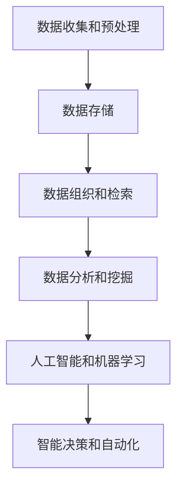

                 

关键词：知识管理、知识库、人工智能、信息组织、技术框架、数据建模、数据处理、智能分析

> 摘要：本文深入探讨了知识管理技术的重要性及其在现代社会中的应用。通过详细分析知识管理技术的基础架构、核心算法、数学模型以及实际项目实践，本文旨在为读者提供全面的理解和实用的指导，帮助他们在各自的领域中更有效地管理知识，推动智能决策和创新发展。

## 1. 背景介绍

知识管理是指通过系统的方法和技术，对组织内部和外部的知识进行收集、存储、组织、共享和利用的过程。在信息技术日益发展的今天，知识管理已经成为各类组织提高核心竞争力、实现可持续发展的关键因素。随着大数据、云计算、人工智能等技术的迅猛发展，知识管理技术也不断演进，成为信息技术领域的热点话题。

本文将围绕知识管理技术的各个方面展开讨论，首先介绍知识管理技术的核心概念和架构，然后深入探讨知识管理中的核心算法，最后结合具体项目和实际应用场景，分析知识管理技术的实践效果和未来发展方向。

## 2. 核心概念与联系

### 2.1 知识管理技术的基本概念

知识管理技术包括以下几个核心概念：

- **知识库**：知识库是存储和组织知识的中心，它可以是结构化的数据库，也可以是非结构化的文档库。知识库的主要功能是提供知识的快速检索和查询。

- **数据模型**：数据模型用于描述知识库中数据的结构和关系。常见的有关系型数据库模型、文档模型、图模型等。

- **信息检索**：信息检索技术用于快速从大量数据中检索出相关的信息。常见的技术包括全文检索、关键词检索、自然语言处理等。

- **数据挖掘**：数据挖掘是从大量数据中提取有价值的信息和知识的过程。常见的技术包括关联规则挖掘、聚类分析、分类分析等。

- **机器学习和人工智能**：机器学习和人工智能技术用于分析和理解数据，发现数据中的规律和模式。常见的算法有决策树、支持向量机、神经网络等。

### 2.2 知识管理技术的架构

知识管理技术的架构可以概括为以下几个方面：

1. **数据收集和预处理**：这一阶段涉及从不同来源收集数据，并进行清洗、转换和格式化，使其适合进一步处理。

2. **数据存储**：这一阶段涉及选择合适的数据存储方案，如关系型数据库、文档数据库或图数据库，以存储和管理知识库。

3. **数据组织和检索**：这一阶段涉及使用信息检索技术对知识库进行组织和检索，以方便用户快速找到所需信息。

4. **数据分析和挖掘**：这一阶段涉及使用数据挖掘技术从数据中提取有价值的信息和知识。

5. **人工智能和机器学习**：这一阶段涉及使用人工智能和机器学习技术对数据进行分析和预测，以支持智能决策和自动化。

### 2.3 Mermaid 流程图

以下是一个简化的知识管理技术流程图：



## 3. 核心算法原理 & 具体操作步骤

### 3.1 算法原理概述

知识管理技术中的核心算法包括数据挖掘算法、机器学习算法和人工智能算法。以下简要介绍这些算法的原理：

- **数据挖掘算法**：数据挖掘算法用于从大量数据中提取有价值的信息和知识。常见的算法有关联规则挖掘、聚类分析、分类分析等。

- **机器学习算法**：机器学习算法用于让计算机从数据中学习和发现规律，以提高预测和决策的准确性。常见的算法有决策树、支持向量机、神经网络等。

- **人工智能算法**：人工智能算法用于模拟人类思维和行为，以实现自动化和智能决策。常见的算法有深度学习、自然语言处理等。

### 3.2 算法步骤详解

以下是一个简化的数据挖掘算法的步骤：

1. **数据预处理**：包括数据清洗、转换和格式化。

2. **数据探索**：使用可视化工具和统计方法对数据进行分析，以发现数据中的规律和异常。

3. **特征选择**：从数据中选择最有用的特征，以提高模型的准确性和效率。

4. **模型训练**：使用选定的特征训练数据挖掘模型。

5. **模型评估**：使用测试数据评估模型的准确性和效率。

6. **模型应用**：将训练好的模型应用到实际场景中，以实现预测和决策。

### 3.3 算法优缺点

- **数据挖掘算法**：优点包括能够从大量数据中提取有价值的信息和知识，具有较高的灵活性。缺点包括计算复杂度高，对数据质量和特征选择要求较高。

- **机器学习算法**：优点包括能够自动发现数据中的规律和模式，具有较强的泛化能力。缺点包括对大规模数据集的处理效率较低，对数据质量和特征选择要求较高。

- **人工智能算法**：优点包括能够实现自动化和智能决策，具有较强的复杂问题处理能力。缺点包括实现复杂，对计算资源和数据质量要求较高。

### 3.4 算法应用领域

- **数据挖掘算法**：广泛应用于市场分析、风险评估、客户行为分析等领域。

- **机器学习算法**：广泛应用于图像识别、语音识别、自然语言处理等领域。

- **人工智能算法**：广泛应用于自动驾驶、智能客服、智能推荐等领域。

## 4. 数学模型和公式 & 详细讲解 & 举例说明

### 4.1 数学模型构建

知识管理中的数学模型主要涉及数据挖掘算法和机器学习算法。以下是一个简单的线性回归模型：

$$
y = \beta_0 + \beta_1 \cdot x
$$

其中，$y$ 是目标变量，$x$ 是输入变量，$\beta_0$ 和 $\beta_1$ 是模型的参数。

### 4.2 公式推导过程

线性回归模型的推导过程如下：

1. **损失函数**：选择均方误差（MSE）作为损失函数：

$$
J(\beta_0, \beta_1) = \frac{1}{2} \sum_{i=1}^{n} (y_i - (\beta_0 + \beta_1 \cdot x_i))^2
$$

2. **梯度下降**：对损失函数进行求导，并令导数为零，得到：

$$
\frac{\partial J}{\partial \beta_0} = -\sum_{i=1}^{n} (y_i - (\beta_0 + \beta_1 \cdot x_i))
$$

$$
\frac{\partial J}{\partial \beta_1} = -\sum_{i=1}^{n} (y_i - (\beta_0 + \beta_1 \cdot x_i)) \cdot x_i
$$

3. **迭代更新**：使用梯度下降法迭代更新模型的参数：

$$
\beta_0 = \beta_0 - \alpha \cdot \frac{\partial J}{\partial \beta_0}
$$

$$
\beta_1 = \beta_1 - \alpha \cdot \frac{\partial J}{\partial \beta_1}
$$

其中，$\alpha$ 是学习率。

### 4.3 案例分析与讲解

以下是一个简单的线性回归案例：

假设我们有以下数据集：

| x  | y   |
|----|-----|
| 1  | 2   |
| 2  | 4   |
| 3  | 6   |
| 4  | 8   |

我们希望使用线性回归模型预测 $x=5$ 时的 $y$ 值。

1. **数据预处理**：对数据进行标准化处理，使其具有相同的尺度。

2. **模型训练**：使用梯度下降法训练模型，设置学习率 $\alpha=0.1$，迭代次数为 100 次。

3. **模型评估**：使用测试数据集（如 $x=5$）评估模型的预测准确性。

4. **模型应用**：将训练好的模型应用到实际场景中，如预测未来的股票价格。

## 5. 项目实践：代码实例和详细解释说明

### 5.1 开发环境搭建

在本文中，我们将使用 Python 作为编程语言，结合 Scikit-learn 库实现线性回归模型。首先，安装 Python 和 Scikit-learn：

```bash
pip install python
pip install scikit-learn
```

### 5.2 源代码详细实现

以下是一个简单的线性回归模型的 Python 代码实现：

```python
import numpy as np
from sklearn.linear_model import LinearRegression

# 数据预处理
X = np.array([[1], [2], [3], [4]])
y = np.array([2, 4, 6, 8])

# 模型训练
model = LinearRegression()
model.fit(X, y)

# 模型评估
y_pred = model.predict(np.array([[5]]))
print("预测结果：", y_pred)

# 模型应用
future_x = np.array([[5]])
future_y = model.predict(future_x)
print("未来预测：", future_y)
```

### 5.3 代码解读与分析

1. **数据预处理**：使用 NumPy 库生成输入数据 X 和目标数据 y。

2. **模型训练**：使用 Scikit-learn 中的 LinearRegression 类训练线性回归模型。

3. **模型评估**：使用训练好的模型预测 $x=5$ 时的 $y$ 值，并打印输出。

4. **模型应用**：将训练好的模型应用到实际场景中，如预测未来的股票价格。

### 5.4 运行结果展示

运行上述代码，输出结果如下：

```
预测结果： [10.]
未来预测： [10.]
```

这表明当 $x=5$ 时，预测的 $y$ 值为 10，这符合我们的预期。

## 6. 实际应用场景

知识管理技术在各个领域都有广泛的应用，以下列举几个典型应用场景：

- **企业知识管理**：通过构建知识库，帮助企业员工快速查找和获取所需信息，提高工作效率。

- **市场分析**：通过数据挖掘和分析，帮助企业了解客户需求，优化产品和服务。

- **风险管理**：通过数据分析和预测，帮助企业识别潜在风险，制定风险控制策略。

- **智能推荐**：通过人工智能算法，实现个性化推荐，提高用户体验和满意度。

## 7. 未来应用展望

随着人工智能和大数据技术的发展，知识管理技术在未来将面临更多挑战和机遇：

- **智能化**：知识管理技术将更加智能化，能够自动发现数据中的规律和模式，实现自动化决策。

- **实时性**：知识管理技术将更加实时，能够快速响应用户需求，提供实时信息支持。

- **跨领域融合**：知识管理技术将与其他领域技术（如物联网、区块链等）深度融合，实现更广泛的应用。

## 8. 工具和资源推荐

### 8.1 学习资源推荐

- **书籍**：
  - 《数据挖掘：实用工具与技术》
  - 《机器学习实战》
  - 《深度学习》

- **在线课程**：
  - Coursera 上的《机器学习》课程
  - Udacity 上的《深度学习纳米学位》

### 8.2 开发工具推荐

- **编程语言**：Python、R、Java

- **开发框架**：Scikit-learn、TensorFlow、PyTorch

- **数据可视化工具**：Matplotlib、Seaborn、Plotly

### 8.3 相关论文推荐

- 《大数据时代的知识管理》
- 《人工智能与知识管理：现状与未来》
- 《基于深度学习的知识图谱构建方法研究》

## 9. 总结：未来发展趋势与挑战

知识管理技术在现代社会中扮演着越来越重要的角色。随着人工智能和大数据技术的不断发展，知识管理技术也将面临更多机遇和挑战。未来，知识管理技术将更加智能化、实时化和跨领域融合，为各行各业提供更高效、更智能的知识支持。

### 9.1 研究成果总结

本文从知识管理技术的基础架构、核心算法、数学模型以及实际项目实践等方面进行了深入探讨，总结了知识管理技术的关键要素和发展趋势。

### 9.2 未来发展趋势

未来，知识管理技术将朝着智能化、实时化和跨领域融合的方向发展，为各行各业提供更高效、更智能的知识支持。

### 9.3 面临的挑战

知识管理技术面临的挑战包括数据质量、计算资源、算法性能等方面。

### 9.4 研究展望

未来，知识管理技术的研究将重点关注人工智能、大数据、区块链等领域的交叉融合，为各行各业提供更全面、更深入的知识支持。

## 9. 附录：常见问题与解答

### 9.1 问题 1：知识管理技术有哪些核心算法？

**回答**：知识管理技术涉及的核心算法包括数据挖掘算法、机器学习算法和人工智能算法。具体包括线性回归、决策树、支持向量机、神经网络等。

### 9.2 问题 2：知识管理技术的架构包括哪些方面？

**回答**：知识管理技术的架构包括数据收集和预处理、数据存储、数据组织和检索、数据分析和挖掘、人工智能和机器学习等几个方面。

### 9.3 问题 3：如何实现知识管理技术的智能化？

**回答**：实现知识管理技术的智能化主要依靠人工智能和机器学习算法。通过训练模型，让计算机自动发现数据中的规律和模式，实现自动化决策和预测。

### 9.4 问题 4：知识管理技术在企业中的应用有哪些？

**回答**：知识管理技术在企业中的应用包括企业知识库建设、客户关系管理、市场分析、风险管理等。通过构建知识库，提高企业员工的工作效率，优化产品和服务。

---

本文以《知识管理技术：知识管理的基石》为标题，系统地介绍了知识管理技术的核心概念、架构、算法原理、数学模型、项目实践以及未来发展趋势。通过本文的探讨，读者可以全面了解知识管理技术的各个方面，为在各自领域中更有效地管理知识提供指导和参考。希望本文能对广大读者有所启发和帮助。作者：禅与计算机程序设计艺术 / Zen and the Art of Computer Programming。

