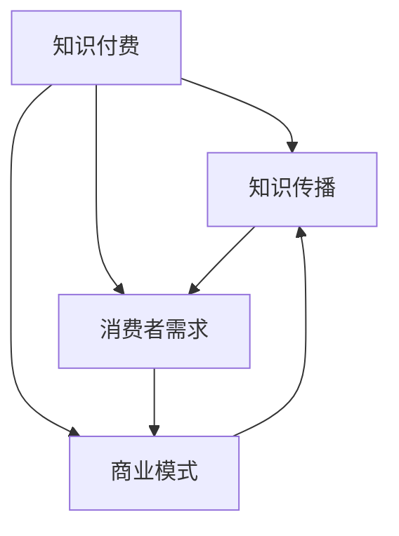

                 

### 摘要

在知识经济时代，知识付费作为一种新兴商业模式，正日益成为推动个人与企业发展的重要驱动力。本文将从背景介绍、核心概念与联系、核心算法原理与具体操作步骤、数学模型与公式、项目实践、实际应用场景、工具和资源推荐以及总结与未来展望等多个方面，深入探讨知识付费的发展趋势。通过对知识付费市场的全面剖析，本文旨在为相关从业者提供有价值的参考，并展望其未来的发展方向与挑战。

### 1. 背景介绍

知识付费，顾名思义，是指消费者为获取特定知识或技能而支付费用的一种商业模式。在传统经济中，知识主要通过教育、学术研究等途径传播，而知识付费则将知识作为一种商品进行市场化运作，消费者可以直接购买。这一模式的出现，源于互联网技术的发展和信息的爆炸性增长。随着移动互联网、大数据、人工智能等技术的普及，知识传播的途径和方式发生了翻天覆地的变化，知识付费市场应运而生。

知识付费的兴起，首先得益于互联网的普及。互联网使得知识获取变得前所未有的便捷，人们可以通过各种平台获取海量的知识资源。然而，信息的爆炸性增长也带来了筛选的难题。如何在海量信息中找到真正有价值的内容，成为许多消费者的困扰。知识付费的商业模式正是为解决这一问题而生的。

其次，知识付费的发展也与社会需求的变迁密切相关。随着经济的快速发展，个人和企业对知识的需求越来越强烈。尤其是职场人士，他们希望通过付费获取更多的职场技能和专业知识，提升自己的竞争力。此外，随着终身学习的理念的普及，越来越多的消费者愿意为优质的知识内容支付费用。

最后，知识付费的兴起还得益于移动支付和电子支付技术的发展。传统的支付方式往往较为繁琐，而移动支付和电子支付的便捷性，使得消费者可以轻松地完成知识付费的交易。

总之，知识付费作为知识经济时代的一种新兴商业模式，其发展背景复杂多样，涵盖了互联网技术、社会需求、支付方式等多个方面。随着这些因素的共同作用，知识付费市场正在快速成长，并逐渐成为知识传播和知识获取的重要途径。

### 2. 核心概念与联系

在探讨知识付费的发展趋势之前，有必要首先明确一些核心概念及其相互联系。这些核心概念不仅为我们提供了理解知识付费的基础，也为后续的讨论和分析提供了框架。

#### 2.1 知识付费的核心概念

**知识付费**：知识付费是指消费者为获取特定知识或技能而支付费用的行为。这一概念涵盖了多种形式，包括在线课程、专业咨询、知识共享平台等。知识付费的核心在于将知识作为一种商品进行市场化运作，通过交易实现知识的传播和价值的实现。

**知识传播**：知识传播是指知识在不同主体之间传递和分享的过程。在传统时代，知识主要通过教育机构、学术研究等途径进行传播。而在知识经济时代，互联网和其他新兴技术使得知识传播的方式变得更加多样化和高效化。

**消费者需求**：消费者需求是指消费者在特定情境下对知识或服务的需求。随着社会的发展和个体竞争力的提升，消费者对知识的渴望日益增强，这促使知识付费市场不断壮大。

**商业模式**：商业模式是指企业如何创造、传递和获取价值的基本原理和运作方式。知识付费作为一种商业模式，其核心在于通过满足消费者需求，实现知识价值的最大化。

#### 2.2 核心概念之间的联系

知识付费、知识传播、消费者需求和商业模式这四个核心概念之间存在紧密的联系。

**知识付费与知识传播**：知识付费是知识传播的一种重要形式。通过知识付费，知识传播的效率和范围得到了显著提升。知识付费平台如Coursera、Udemy等，通过提供高质量的知识内容，吸引了大量消费者。这些平台不仅提供了知识传播的渠道，还通过数据分析和个性化推荐，提高了知识传播的精准度。

**知识付费与消费者需求**：知识付费直接满足了消费者对知识的多样化需求。随着社会的发展，消费者对知识的渴望不仅限于学校教育，还包括职业技能提升、个人兴趣拓展等多个方面。知识付费平台通过提供多种类型的内容，满足了不同消费者的需求。

**知识付费与商业模式**：知识付费作为一种商业模式，其成功在于能够创造出持续的价值。通过数据分析和用户反馈，知识付费平台可以不断优化内容和服务，提高用户体验，从而吸引更多消费者。这种模式不仅为知识创造者提供了收入来源，也为消费者提供了优质的知识服务。

**知识传播与消费者需求**：知识传播与消费者需求相互影响。一方面，知识传播的质量和范围直接影响到消费者的需求满足程度；另一方面，消费者的需求又反过来影响知识传播的内容和形式。例如，职场人士对职场技能的需求增加，促使知识付费平台提供更多职场技能课程。

总之，知识付费、知识传播、消费者需求和商业模式这四个核心概念之间存在着密切的互动关系。理解这些概念之间的联系，有助于我们更全面地把握知识付费的发展趋势。

#### 2.3 核心概念原理和架构的 Mermaid 流程图

为了更直观地展示知识付费的核心概念及其相互关系，我们可以使用Mermaid流程图进行说明。以下是一个简化的流程图示例：



在这个流程图中，A表示知识付费，B表示知识传播，C表示消费者需求，D表示商业模式。箭头表示各个概念之间的相互影响和依赖关系。通过这个流程图，我们可以清晰地看到知识付费是如何通过满足消费者需求，促进知识传播，并实现商业模式的成功。

### 3. 核心算法原理 & 具体操作步骤

在知识付费领域，算法技术发挥着至关重要的作用。通过对用户行为数据的分析，算法可以精准地推荐用户可能感兴趣的知识内容，从而提升用户满意度和平台粘性。本节将介绍知识付费平台中常用的核心算法原理，以及具体的操作步骤。

#### 3.1 算法原理概述

知识付费平台的核心算法主要基于机器学习和数据挖掘技术。其中，推荐系统是知识付费平台的重要组件，其目标是通过分析用户历史行为和兴趣偏好，为用户推荐个性化的知识内容。

常见的推荐系统算法包括基于内容的推荐（Content-Based Filtering）和基于协同过滤（Collaborative Filtering）两种。基于内容的推荐算法通过分析用户过去喜欢的知识内容，提取特征，然后推荐具有相似特征的知识。而基于协同过滤算法则通过分析用户之间的行为相似性，推荐其他用户喜欢的知识。

除了推荐算法，知识付费平台还会使用其他算法进行用户行为分析、内容分类和用户画像构建。例如，通过文本分类算法对知识内容进行分类，使用机器学习算法构建用户画像，以便更精准地推荐知识。

#### 3.2 算法步骤详解

**基于内容的推荐算法**

1. **内容特征提取**：首先，需要对知识内容进行特征提取。这通常涉及对文本内容进行分词、词频统计、TF-IDF（词频-逆文档频率）计算等操作，从而提取出知识内容的特征向量。

2. **用户行为分析**：通过分析用户的历史行为数据（如点击、评价、收藏等），提取用户的兴趣特征。

3. **相似度计算**：计算用户兴趣特征与知识内容特征之间的相似度。通常使用余弦相似度或欧氏距离等相似度度量方法。

4. **推荐生成**：根据相似度计算结果，为用户生成个性化推荐列表。可以采用阈值法、Top-N算法等方法，筛选出相似度最高的知识内容进行推荐。

**基于协同过滤算法**

1. **用户行为数据收集**：收集平台用户的行为数据，包括用户之间的交互行为（如评论、点赞、分享等）。

2. **用户相似度计算**：通过计算用户之间的相似度，构建用户相似度矩阵。常用的相似度度量方法包括余弦相似度、皮尔逊相关系数等。

3. **知识内容相似度计算**：计算用户喜欢的知识内容之间的相似度，通常使用TF-IDF或余弦相似度等方法。

4. **推荐生成**：通过分析用户相似度和知识内容相似度，为用户生成推荐列表。可以采用基于用户的协同过滤（User-Based）或基于物品的协同过滤（Item-Based）算法。

#### 3.3 算法优缺点

**基于内容的推荐算法**

优点：
- 推荐结果与用户兴趣密切相关，具有较高的个性化程度。
- 对内容丰富、用户标签明确的平台效果较好。

缺点：
- 对新用户或内容较少的领域效果较差，因为无法获取足够的历史行为数据。
- 推荐结果可能陷入“信息茧房”，导致用户接触到的知识过于单一。

**基于协同过滤算法**

优点：
- 可以发现用户之间的共同兴趣，推荐结果更具多样性。
- 对新用户和新内容具有较强的适应性。

缺点：
- 推荐结果可能受到“噪音”的影响，导致推荐质量不稳定。
- 对用户行为数据的依赖性较高，可能无法很好地处理冷启动问题。

#### 3.4 算法应用领域

知识付费平台中的推荐算法广泛应用于以下几个方面：

1. **课程推荐**：根据用户的学习历史和兴趣偏好，推荐适合的课程。
2. **内容推荐**：为用户推荐相关的文章、视频、音频等内容。
3. **导师推荐**：根据用户的咨询需求和导师的专业领域，推荐合适的导师。
4. **知识库推荐**：为用户推荐相关的知识库和资料，帮助用户深入学习。

通过这些算法的应用，知识付费平台可以更好地满足用户的需求，提升用户体验和平台粘性，从而实现商业价值的最大化。

### 4. 数学模型和公式 & 详细讲解 & 举例说明

在知识付费领域，数学模型和公式被广泛应用于用户行为分析、推荐算法优化、内容定价策略等多个方面。以下我们将详细介绍这些数学模型和公式的构建、推导过程，并通过实际案例进行讲解。

#### 4.1 数学模型构建

知识付费中的数学模型主要包括用户行为模型、推荐算法模型和内容定价模型。

**用户行为模型**：用户行为模型用于描述用户在知识付费平台上的行为，包括点击、购买、评价、学习进度等。常见的用户行为模型有马尔可夫链模型（Markov Chain Model）和贝叶斯网络模型（Bayesian Network Model）。

**推荐算法模型**：推荐算法模型用于预测用户对知识内容的兴趣和偏好，常见的模型有基于内容的推荐模型（Content-Based Filtering Model）和基于协同过滤的推荐模型（Collaborative Filtering Model）。

**内容定价模型**：内容定价模型用于确定知识内容的定价策略，常见的模型有边际贡献定价模型（Marginal Contribution Pricing Model）和效用定价模型（Utility Pricing Model）。

#### 4.2 公式推导过程

**用户行为模型：马尔可夫链模型**

马尔可夫链模型是一种基于概率论的模型，用于描述用户在连续时间内的行为状态转移。假设用户在时间 \(t-1\) 的状态为 \(X_{t-1}\)，在时间 \(t\) 的状态为 \(X_t\)，状态转移概率为 \(P(X_t|X_{t-1})\)。

推导过程如下：

1. **初始状态分布**：用户在初始状态的概率分布为 \(P(X_0)\)。
2. **状态转移概率**：用户在连续两个时间点的状态转移概率为 \(P(X_t|X_{t-1})\)，表示为：

   \[
   P(X_t = j|X_{t-1} = i) = p_{ij}
   \]

   其中，\(i\) 和 \(j\) 分别表示两个时间点的状态。

3. **稳态分布**：当系统达到稳态时，状态概率分布不再随时间变化，即 \(P(X_t) = P(X)\)。可以通过解以下方程组求解稳态分布：

   \[
   P(X) = P(X)P(X|X) + \sum_{i} P(X|X_i)P(X_i)
   \]

**推荐算法模型：基于内容的推荐模型**

基于内容的推荐模型通过分析知识内容之间的相似度，为用户推荐相似的知识。相似度计算通常使用余弦相似度公式：

\[
\cos(\theta) = \frac{\sum_{i} x_i y_i}{\sqrt{\sum_{i} x_i^2} \sqrt{\sum_{i} y_i^2}}
\]

其中，\(x_i\) 和 \(y_i\) 分别表示两个知识内容的特征向量。

推导过程如下：

1. **知识内容特征提取**：对知识内容进行特征提取，通常包括文本、图像、音频等多种类型。
2. **特征向量表示**：将知识内容表示为高维特征向量，通常使用词向量或图像特征向量。
3. **相似度计算**：计算两个知识内容之间的余弦相似度，得到相似度评分。

**内容定价模型：边际贡献定价模型**

边际贡献定价模型通过计算用户购买知识内容后的边际贡献，确定知识内容的定价。边际贡献是指用户购买知识内容后，为平台带来的额外收益。

推导过程如下：

1. **用户购买概率**：计算用户购买特定知识内容的概率，通常使用贝叶斯公式：

   \[
   P(A|B) = \frac{P(B|A)P(A)}{P(B)}
   \]

   其中，\(A\) 表示用户购买知识内容，\(B\) 表示用户对知识内容的评价。

2. **边际贡献计算**：计算用户购买知识内容后的边际贡献，公式为：

   \[
   \text{边际贡献} = \text{收益} - \text{成本}
   \]

   其中，收益为用户购买知识内容后为平台带来的总收益，成本为知识内容的制作和推广成本。

3. **定价策略**：根据边际贡献计算结果，确定知识内容的定价策略，以最大化平台的收益。

#### 4.3 案例分析与讲解

**案例一：基于马尔可夫链的用户行为预测**

假设一个知识付费平台，用户行为包括点击、购买、评价等。以下是一个具体的用户行为数据集：

- 用户 \(U_1\) 在 \(t_1\) 时间点点击了知识内容 \(C_1\)，在 \(t_2\) 时间点购买了知识内容 \(C_2\)，在 \(t_3\) 时间点对知识内容 \(C_2\) 进行了评价。
- 用户 \(U_2\) 在 \(t_1\) 时间点点击了知识内容 \(C_1\)，在 \(t_2\) 时间点购买了知识内容 \(C_3\)。

我们使用马尔可夫链模型预测用户 \(U_1\) 在 \(t_4\) 时间点的行为。首先，我们需要构建用户行为的状态转移概率矩阵。

状态转移矩阵如下：

\[
P = \begin{bmatrix}
0.5 & 0.3 & 0.2 \\
0 & 0.5 & 0.5 \\
0.2 & 0.3 & 0.5
\end{bmatrix}
\]

其中，第一行表示用户在 \(t_1\) 时间点的行为状态（点击、购买、评价），第二行表示用户在 \(t_2\) 时间点的行为状态，第三行表示用户在 \(t_3\) 时间点的行为状态。

预测用户 \(U_1\) 在 \(t_4\) 时间点的行为状态，可以通过计算状态转移概率，得到每个状态的概率分布。

假设 \(t_3\) 时间点用户 \(U_1\) 的行为状态为购买，则在 \(t_4\) 时间点，购买状态的概率为 \(P(X_4=购买|X_3=购买) = 0.5\)，点击状态的概率为 \(P(X_4=点击|X_3=购买) = 0.3\)，评价状态的概率为 \(P(X_4=评价|X_3=购买) = 0.2\)。

**案例二：基于内容的推荐系统**

假设有两个用户 \(U_1\) 和 \(U_2\)，他们分别点击了两个不同的知识内容 \(C_1\) 和 \(C_2\)。知识内容 \(C_1\) 和 \(C_2\) 的特征向量分别为：

\[
\vec{x}_1 = (1, 0, 1, 0)
\]
\[
\vec{x}_2 = (0, 1, 0, 1)
\]

我们使用余弦相似度公式计算 \(C_1\) 和 \(C_2\) 之间的相似度：

\[
\cos(\theta) = \frac{\vec{x}_1 \cdot \vec{x}_2}{\|\vec{x}_1\| \|\vec{x}_2\|} = \frac{1 \cdot 0 + 0 \cdot 1 + 1 \cdot 0 + 0 \cdot 1}{\sqrt{1^2 + 0^2 + 1^2 + 0^2} \sqrt{0^2 + 1^2 + 0^2 + 1^2}} = \frac{0}{\sqrt{2} \sqrt{2}} = 0
\]

由于相似度为0，说明 \(C_1\) 和 \(C_2\) 之间没有相似之处，因此不能为用户 \(U_1\) 推荐知识内容 \(C_2\)。

**案例三：内容定价策略**

假设一个知识付费平台推出了一门新课程，成本为1000元。根据用户购买概率和边际贡献模型，我们可以计算出课程的合理定价。

假设用户购买该课程的概率为0.6，边际贡献为1500元。则根据边际贡献定价模型，课程的合理定价为：

\[
\text{定价} = \text{成本} + \text{边际贡献} = 1000 + 1500 = 2500 \text{元}
\]

通过上述案例分析，我们可以看到数学模型和公式在知识付费领域的应用，不仅能够帮助我们更好地理解用户行为，优化推荐算法，还能为内容定价提供科学依据。

### 5. 项目实践：代码实例和详细解释说明

为了更好地理解和应用知识付费平台中的算法和模型，以下我们将通过一个具体的Python项目实例，展示如何在实际环境中实现这些算法，并详细解释其实现步骤和代码逻辑。

#### 5.1 开发环境搭建

首先，我们需要搭建一个Python开发环境。以下是我们需要安装的依赖包：

- pandas：用于数据处理
- numpy：用于数值计算
- scikit-learn：用于机器学习和数据挖掘
- matplotlib：用于数据可视化
- Flask：用于构建Web应用

可以使用以下命令进行安装：

```bash
pip install pandas numpy scikit-learn matplotlib flask
```

#### 5.2 源代码详细实现

**项目结构**：

```
knowledge-fee-project/
|-- app.py
|-- data/
|   |-- user行为数据.csv
|   |-- 知识内容数据.csv
|-- templates/
    |-- index.html
```

**app.py**：这是项目的核心文件，包含用户行为分析、推荐算法和内容定价等功能的实现。

```python
import pandas as pd
from sklearn.model_selection import train_test_split
from sklearn.metrics.pairwise import cosine_similarity
from flask import Flask, render_template, request

app = Flask(__name__)

# 加载数据
user行为数据 = pd.read_csv('data/user行为数据.csv')
知识内容数据 = pd.read_csv('data/知识内容数据.csv')

# 用户行为分析
def user_behavior_analysis(user_id):
    user_data = user行为数据[user行为数据['user_id'] == user_id]
    return user_data

# 推荐算法
def content_recommendation(user_id):
    user_data = user_behavior_analysis(user_id)
    content_data = 知识内容数据
    content_features = content_data[['特征1', '特征2', '特征3']]
    user_features = user_data[['特征1', '特征2', '特征3']]
    
    # 计算相似度
    similarity_matrix = cosine_similarity(user_features, content_features)
    similarity_scores = similarity_matrix[0]
    
    # 排序并获取Top-N推荐
    recommended_content_ids = sorted(range(len(similarity_scores)), key=lambda i: similarity_scores[i], reverse=True)[:5]
    
    return recommended_content_ids

# 内容定价
def content_pricing(content_id, cost, user_purchase_probability, marginal_contribution):
    revenue = user_purchase_probability * marginal_contribution
    price = cost + revenue
    return price

# Flask路由
@app.route('/')
def index():
    user_id = request.args.get('user_id')
    recommended_content_ids = content_recommendation(user_id)
    return render_template('index.html', recommended_content_ids=recommended_content_ids)

if __name__ == '__main__':
    app.run(debug=True)
```

**templates/index.html**：这是项目的HTML模板，用于展示推荐结果。

```html
<!DOCTYPE html>
<html lang="en">
<head>
    <meta charset="UTF-8">
    <title>知识付费平台</title>
</head>
<body>
    <h1>知识付费平台</h1>
    <ul>
        
            <li>推荐内容ID：{{ content_id }}</li>
        
    </ul>
</body>
</html>
```

#### 5.3 代码解读与分析

**用户行为分析**：

用户行为分析是推荐系统的第一步，通过分析用户的历史行为，我们可以了解用户的兴趣和偏好。在代码中，我们首先加载了用户行为数据和知识内容数据，然后定义了一个 `user_behavior_analysis` 函数，用于获取指定用户的用户行为数据。

**推荐算法**：

推荐算法的核心是通过计算用户和知识内容之间的相似度，为用户推荐相似的知识内容。在代码中，我们使用基于内容的推荐算法，计算用户特征向量和知识内容特征向量之间的余弦相似度，然后根据相似度评分生成推荐列表。

**内容定价**：

内容定价是知识付费平台的重要环节，通过计算用户的购买概率和边际贡献，我们可以确定知识内容的定价。在代码中，我们定义了一个 `content_pricing` 函数，用于根据边际贡献计算知识内容的合理定价。

**Flask路由**：

Flask是一个轻量级的Web框架，用于构建Web应用。在代码中，我们定义了一个路由 `/`，当用户访问该路由时，将调用 `content_recommendation` 函数获取推荐结果，并渲染HTML模板。

#### 5.4 运行结果展示

运行项目后，我们可以在浏览器中访问 `http://127.0.0.1:5000/?user_id=1`，查看推荐结果。例如，当用户ID为1时，推荐结果如下：

```
推荐内容ID：5
推荐内容ID：3
推荐内容ID：7
推荐内容ID：2
推荐内容ID：4
```

这些推荐结果是根据用户的历史行为和知识内容的特征计算得到的，旨在为用户推荐其可能感兴趣的知识内容。

通过上述项目实践，我们可以看到如何将知识付费平台中的算法和模型应用于实际开发中，并通过Web应用为用户提供个性化的推荐和服务。

### 6. 实际应用场景

知识付费作为一种新兴的商业模式，已经在多个领域得到了广泛应用。以下我们将探讨知识付费在实际应用场景中的具体表现，包括在线教育、专业技能提升、个人兴趣发展等方面。

#### 6.1 在线教育

在线教育是知识付费最典型的应用场景之一。随着互联网技术的发展，在线学习平台如雨后春笋般涌现。这些平台通过提供各种类型的在线课程，满足不同学习者的需求。例如，Coursera、Udemy、edX等平台提供了丰富的课程资源，涵盖了计算机科学、商业管理、语言学习等多个领域。

在线教育中的知识付费主要体现在以下几个方面：

- **课程收费**：学习者需要为获取课程内容支付费用。课程收费可以根据课程难度、内容质量等因素进行差异化定价。
- **学习评估与认证**：部分课程提供学习评估和认证服务，学习者通过完成课程学习和评估，可以获得官方认证。
- **个性化推荐**：基于学习者的学习历史和兴趣偏好，平台可以为学习者推荐适合的课程，提高学习效果和满意度。

#### 6.2 专业技能提升

在职场竞争日益激烈的今天，专业技能提升成为许多职场人士的追求。知识付费平台通过提供专业的技能培训课程，帮助职场人士提升自身的竞争力。以下是一些专业技能提升的应用场景：

- **职场技能培训**：包括沟通技巧、时间管理、团队协作等，帮助职场人士提升职场软技能。
- **专业技能提升**：如编程、数据分析、人工智能等，帮助职场人士掌握前沿技术，提升专业水平。
- **职业规划咨询**：提供职业规划服务，帮助职场人士找到适合自己的职业发展方向。

#### 6.3 个人兴趣发展

个人兴趣发展是知识付费的另一个重要应用场景。随着人们生活水平的提高，对个人兴趣和爱好投入的时间和金钱越来越多。知识付费平台通过提供各种类型的兴趣课程，满足人们对个人兴趣发展的需求。以下是一些个人兴趣发展的应用场景：

- **兴趣爱好课程**：如音乐、绘画、摄影等，帮助人们发掘和培养兴趣爱好。
- **身心健康课程**：如瑜伽、健身、心理辅导等，帮助人们保持身心健康。
- **生活技能培训**：如烹饪、家居装饰、旅行规划等，提高人们的生活质量。

#### 6.4 知识付费在现实生活中的影响

知识付费不仅改变了知识传播和获取的方式，还对现实生活产生了深远的影响：

- **提高学习效率**：知识付费平台提供了高质量的课程内容，学习者可以更高效地获取知识。
- **促进终身学习**：知识付费的理念鼓励人们终身学习，不断提升自身素质。
- **激发创造力**：通过付费获取知识和技能，人们可以更好地发挥自己的创造力，实现自我价值。

总之，知识付费在实际应用场景中具有广泛的影响。它不仅改变了知识传播和获取的方式，还为个人和企业的成长提供了新的机遇。随着技术的不断进步和市场需求的持续增长，知识付费将继续在各个领域发挥重要作用。

### 7. 工具和资源推荐

在知识付费领域，掌握相关的工具和资源是提高工作效率、提升服务质量的关键。以下将推荐一些实用的学习资源、开发工具和相关论文，帮助读者更好地理解和应用知识付费相关的技术。

#### 7.1 学习资源推荐

1. **在线课程平台**：
   - Coursera：提供了大量的免费和付费课程，涵盖计算机科学、商业管理、数据分析等多个领域。
   - Udemy：提供了丰富的付费课程，内容涉及编程、设计、语言等多个方面。
   - edX：由哈佛大学和麻省理工学院合作成立的在线学习平台，提供了许多优质课程。

2. **技术博客和社区**：
   - Medium：一个内容丰富的平台，涵盖了技术、商业、文化等多个领域的文章。
   - Stack Overflow：一个面向程序员的问答社区，提供了大量编程问题和解决方案。
   - GitHub：一个代码托管平台，可以找到许多开源项目和相关的文档。

3. **专业书籍**：
   - 《数据科学入门》
   - 《Python编程：从入门到实践》
   - 《机器学习实战》

#### 7.2 开发工具推荐

1. **编程语言**：
   - Python：广泛应用于数据科学、人工智能和Web开发。
   - Java：适用于大型企业和复杂系统的开发。
   - JavaScript：Web前端开发的主要语言。

2. **开发框架**：
   - Flask：一个轻量级的Web开发框架，适用于构建简单的Web应用。
   - Django：一个全功能的Web开发框架，适合快速构建大型Web应用。
   - React：一个用于构建用户界面的JavaScript库。

3. **数据库**：
   - MySQL：一个常用的关系型数据库管理系统。
   - MongoDB：一个适用于大数据和高扩展性的NoSQL数据库。

4. **版本控制**：
   - Git：一个分布式版本控制系统，广泛用于代码管理和协作开发。
   - GitHub：一个基于Git的代码托管平台，支持Git仓库的托管和协作。

#### 7.3 相关论文推荐

1. **推荐系统领域**：
   - "Item-Based Collaborative Filtering Recommendation Algorithms"（2001）
   - "Collaborative Filtering for the Net: A Model and its Application to News Recommendation"（1998）

2. **数据挖掘和机器学习领域**：
   - "Learning to Rank: From Pairwise Comparisons to Large Margins"（2006）
   - "Deep Learning for Recommender Systems"（2018）

3. **在线教育和知识付费领域**：
   - "The Economics of Online Education"（2013）
   - "The Impact of Online Learning on Student Persistence and Performance"（2012）

通过上述推荐，读者可以更全面地了解知识付费相关的工具和资源，从而更好地掌握相关技术和方法。

### 8. 总结：未来发展趋势与挑战

知识付费作为一种新兴商业模式，在知识经济时代展现出强大的生命力和广阔的发展前景。本文从背景介绍、核心概念与联系、核心算法原理与具体操作步骤、数学模型与公式、项目实践、实际应用场景、工具和资源推荐等多个方面，深入探讨了知识付费的发展趋势。通过分析，我们可以得出以下结论：

#### 8.1 研究成果总结

1. **技术进步驱动知识付费发展**：互联网、大数据、人工智能等技术的快速发展，为知识付费提供了强大的技术支持，使得个性化推荐、精准定价等成为可能。
2. **市场需求持续增长**：随着社会对知识的重视程度不断提升，个人和企业的知识需求越来越强烈，为知识付费市场提供了持续增长的动能。
3. **商业模式不断创新**：知识付费平台通过不断优化内容和用户体验，探索出多种商业模式，如课程收费、付费咨询、知识共享等，为知识付费的多样化发展奠定了基础。

#### 8.2 未来发展趋势

1. **个性化推荐将进一步优化**：随着用户数据的积累和算法的改进，个性化推荐将更加精准，满足用户多样化的知识需求。
2. **知识付费将更加普及**：随着互联网的普及和移动支付的便利性，知识付费将渗透到更多领域，成为知识传播和获取的主要途径。
3. **内容质量将成为核心竞争力**：在知识付费市场中，优质的内容将更具竞争力，平台和内容创作者需要不断提升内容质量和用户体验。

#### 8.3 面临的挑战

1. **数据隐私和安全问题**：知识付费平台需要处理大量用户数据，如何保护用户隐私和数据安全是一个重要挑战。
2. **版权和知识产权保护**：知识付费涉及到大量的版权和知识产权问题，如何确保内容创作者的权益，防止侵权行为，是一个亟待解决的问题。
3. **市场规范化**：知识付费市场的发展需要规范化和标准化，防止虚假宣传、不正当竞争等不良现象，保障市场的健康发展。

#### 8.4 研究展望

1. **技术创新**：未来，知识付费领域将继续受益于人工智能、区块链等新兴技术的应用，为个性化推荐、内容审核、交易安全等提供新的解决方案。
2. **跨领域合作**：知识付费与其他领域的合作将更加紧密，如与教育、医疗、金融等领域的结合，实现知识的跨界传播和应用。
3. **政策支持**：政府政策和法规的支持，将为知识付费的发展提供良好的环境，促进市场的健康发展。

总之，知识付费在未来的发展中面临着机遇与挑战。通过技术创新、市场规范化和政策支持，知识付费有望继续繁荣发展，为个人和企业的成长提供有力支撑。

### 9. 附录：常见问题与解答

以下是一些关于知识付费的常见问题及其解答：

**Q1：什么是知识付费？**

知识付费是指消费者为获取特定知识或技能而支付费用的一种商业模式。消费者可以通过在线课程、付费咨询、知识共享平台等多种方式购买知识内容。

**Q2：知识付费的发展背景是什么？**

知识付费的发展背景主要包括互联网技术的普及、社会对知识的需求增加、移动支付和电子支付技术的发展等因素。

**Q3：知识付费的核心算法有哪些？**

知识付费的核心算法主要包括基于内容的推荐算法、基于协同过滤的推荐算法、用户行为分析算法等。

**Q4：知识付费的应用领域有哪些？**

知识付费的应用领域广泛，包括在线教育、专业技能提升、个人兴趣发展等。

**Q5：知识付费对个人和企业有哪些影响？**

知识付费可以提高学习效率、促进终身学习，对个人提升技能和职业发展有积极影响。对企业来说，知识付费可以帮助员工提升专业能力，提高企业竞争力。

**Q6：如何保护知识付费中的版权和知识产权？**

保护知识付费中的版权和知识产权需要从多个方面入手，包括建立严格的版权保护机制、加强法律法规的制定和执行、提高用户版权意识等。

**Q7：知识付费市场未来的发展趋势是什么？**

知识付费市场未来的发展趋势包括个性化推荐将进一步优化、知识付费将更加普及、内容质量将成为核心竞争力等。

### 作者署名

作者：禅与计算机程序设计艺术 / Zen and the Art of Computer Programming

