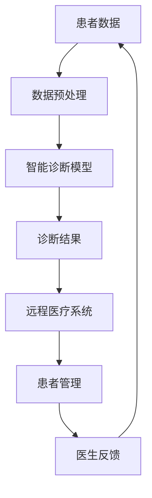

                 

 关键词：
- 硅谷医疗
- 智能诊断
- 远程医疗
- 医疗AI
- 医疗大数据
- 医疗信息技术
- 精准医疗

摘要：
随着人工智能（AI）和大数据技术的迅猛发展，硅谷的医疗健康领域正经历一场深刻的变革。本文将探讨硅谷在智能诊断和远程医疗方面的创新与实践，分析其核心概念、算法原理、应用案例以及未来的发展趋势。通过深入分析，我们期望为医疗行业的从业者提供有价值的参考和启示。

## 1. 背景介绍

硅谷，这个位于美国加利福尼亚州的世界科技中心，以其创新精神和丰富的技术资源闻名于世。医疗健康作为人类生活的重要方面，自然也受到了硅谷的关注和推动。近年来，硅谷在医疗健康领域的投资和研发力度不断加大，尤其是在智能诊断和远程医疗方面，涌现出一批具有颠覆性的创新技术和解决方案。

智能诊断是指利用人工智能技术对医疗数据进行处理和分析，从而实现对疾病的早期发现和精准诊断。远程医疗则通过互联网和移动通信技术，实现医疗资源的远程配置和患者服务的远程交付，大幅提升了医疗服务的效率和可及性。

### 1.1 智能诊断的发展背景

智能诊断的发展可以追溯到20世纪末，随着计算机性能的不断提升和大数据技术的应用，人工智能在医疗领域的应用逐渐成熟。特别是深度学习技术的突破，使得计算机能够从大量的医疗数据中学习和提取特征，实现高度准确的诊断。例如，谷歌的DeepMind团队开发的AI系统“DeepMind Health”，能够在短时间内分析大量的医疗影像数据，辅助医生做出更准确的诊断。

### 1.2 远程医疗的发展背景

远程医疗的发展得益于互联网技术的普及和智能手机的广泛应用。在过去的几十年中，远程医疗经历了从简单的在线咨询到全面的患者管理系统的发展过程。特别是在新冠疫情期间，远程医疗得到了极大的推动，成为缓解医疗资源紧张、降低交叉感染风险的重要手段。

## 2. 核心概念与联系

智能诊断和远程医疗虽然各有侧重，但它们之间存在着紧密的联系和互补性。为了更好地理解这两个概念，我们可以通过一个Mermaid流程图来展示它们的核心原理和架构。

### 2.1 Mermaid流程图



- **A[患者数据]**：包括各种医疗数据，如影像、病历、实验室检测结果等。
- **B[数据预处理]**：对原始数据进行清洗、归一化等处理，为后续的智能诊断模型提供高质量的数据输入。
- **C[智能诊断模型]**：利用深度学习、机器学习等技术，对预处理后的数据进行分析和诊断。
- **D[诊断结果]**：将诊断结果反馈给患者和医生。
- **E[远程医疗系统]**：通过互联网和移动设备，提供远程诊疗、健康管理、预约挂号等服务。
- **F[患者管理]**：对患者的健康状况进行持续监控和管理。
- **G[医生反馈]**：医生根据诊断结果和患者的反馈，进行相应的治疗和调整。

### 2.2 概念联系

智能诊断和远程医疗之间的联系主要体现在以下几个方面：

1. **数据驱动**：智能诊断依赖于大量的医疗数据，而远程医疗系统则提供了这些数据的来源和收集渠道。
2. **诊断与治疗**：智能诊断的结果直接影响到远程医疗的治疗方案和患者管理策略。
3. **反馈与优化**：医生根据诊断结果和患者的反馈，不断优化智能诊断模型和远程医疗系统，实现闭环反馈。

## 3. 核心算法原理 & 具体操作步骤

### 3.1 算法原理概述

智能诊断的核心算法主要基于深度学习和机器学习。深度学习通过构建多层神经网络，模拟人类大脑的处理方式，从海量数据中自动提取特征，实现对复杂问题的解决。机器学习则通过训练数据集，使计算机能够学习并改进其诊断能力。

远程医疗的核心算法则包括图像处理、自然语言处理和计算机视觉等。图像处理用于处理医疗影像数据，如X光片、CT片、MRI等；自然语言处理用于处理医生和患者之间的沟通，如在线咨询、电子病历等；计算机视觉则用于实现医疗设备的远程监控和操作。

### 3.2 算法步骤详解

#### 3.2.1 智能诊断算法步骤

1. **数据收集**：从医院、实验室等渠道收集各种类型的医疗数据。
2. **数据预处理**：对收集到的数据进行清洗、归一化等处理，提高数据质量。
3. **特征提取**：利用深度学习模型，从预处理后的数据中提取特征。
4. **模型训练**：利用训练数据集，对深度学习模型进行训练。
5. **模型评估**：通过测试数据集，评估模型的准确性和可靠性。
6. **诊断结果输出**：将诊断结果输出给医生和患者。

#### 3.2.2 远程医疗算法步骤

1. **图像处理**：对医疗影像数据进行处理，如增强、去噪、分割等。
2. **自然语言处理**：处理医生和患者之间的文本信息，如在线咨询、病历记录等。
3. **计算机视觉**：实现医疗设备的远程监控和操作，如手术机器人、远程监控设备等。
4. **数据传输**：将处理后的数据通过网络传输给医生和患者。
5. **反馈与优化**：根据医生的诊断和患者的反馈，优化算法和系统。

### 3.3 算法优缺点

#### 智能诊断算法

**优点**：
- 高度自动化：能够快速处理大量数据，提高诊断效率。
- 准确性高：通过深度学习模型，能够从海量数据中提取特征，实现精准诊断。

**缺点**：
- 对数据质量要求高：数据质量直接影响诊断结果的准确性。
- 需要大量计算资源：深度学习模型训练过程需要大量计算资源。

#### 远程医疗算法

**优点**：
- 提高医疗服务可及性：让患者能够在家中享受到优质的医疗服务。
- 降低医疗成本：减少患者往返医院的时间和费用。

**缺点**：
- 依赖于网络环境：远程医疗需要稳定的网络连接。
- 安全性问题：远程医疗涉及患者隐私和数据安全。

### 3.4 算法应用领域

智能诊断和远程医疗在医疗领域的应用非常广泛，包括但不限于以下领域：

- **癌症诊断**：利用AI技术对癌症进行早期筛查和诊断。
- **心脏病诊断**：通过智能诊断技术，实现对心脏病患者的实时监控和预警。
- **远程手术**：利用远程医疗技术，实现医生对偏远地区患者的手术操作。
- **慢性病管理**：通过智能诊断和远程医疗，实现对慢性病患者的长期监控和健康管理。

## 4. 数学模型和公式 & 详细讲解 & 举例说明

### 4.1 数学模型构建

智能诊断和远程医疗中的数学模型主要包括以下几个方面：

- **深度学习模型**：用于处理和预测医疗数据，如卷积神经网络（CNN）、循环神经网络（RNN）等。
- **回归模型**：用于预测患者的健康状况，如线性回归、逻辑回归等。
- **分类模型**：用于对患者进行疾病分类，如支持向量机（SVM）、决策树等。
- **自然语言处理模型**：用于处理医生和患者之间的文本信息，如词嵌入（Word Embedding）、序列到序列模型（Seq2Seq）等。

### 4.2 公式推导过程

以深度学习模型为例，我们简要介绍其核心公式的推导过程。

- **激活函数**：激活函数是神经网络中的一个关键组件，用于引入非线性因素。常用的激活函数有Sigmoid、ReLU、Tanh等。

  - Sigmoid函数：$$ f(x) = \frac{1}{1 + e^{-x}} $$
  - ReLU函数：$$ f(x) = \max(0, x) $$
  - Tanh函数：$$ f(x) = \frac{e^x - e^{-x}}{e^x + e^{-x}} $$

- **反向传播算法**：反向传播算法是训练神经网络的关键步骤，用于计算网络参数的梯度。其基本思想是将输出误差反向传播到网络的前一层，逐层更新网络参数。

  - 假设网络的输出层为$$ y = \sigma(W_{output} \cdot a_{hidden} + b_{output}) $$，其中$$ \sigma $$为激活函数，$$ W_{output} $$为输出层权重，$$ a_{hidden} $$为隐藏层输出，$$ b_{output} $$为输出层偏置。

  - 反向传播的步骤如下：
    1. 计算输出层的误差：$$ \delta_{output} = (y - t) \cdot \sigma'(W_{output} \cdot a_{hidden} + b_{output}) $$
    2. 计算隐藏层的误差：$$ \delta_{hidden} = \delta_{output} \cdot W_{output} \cdot \sigma'(a_{hidden}) $$
    3. 更新输出层权重：$$ W_{output} := W_{output} - \alpha \cdot \delta_{output} \cdot a_{hidden} $$
    4. 更新隐藏层权重：$$ W_{hidden} := W_{hidden} - \alpha \cdot \delta_{hidden} \cdot a_{input} $$

  其中，$$ t $$为真实标签，$$ \alpha $$为学习率，$$ \sigma' $$为激活函数的导数。

### 4.3 案例分析与讲解

#### 案例一：利用深度学习模型进行肺癌筛查

假设我们使用卷积神经网络（CNN）进行肺癌筛查，输入为CT影像数据，输出为肺癌的概率。

1. **数据预处理**：对CT影像数据进行归一化、裁剪、翻转等处理，形成训练数据集。

2. **模型构建**：构建一个三层卷积神经网络，包括卷积层、池化层和全连接层。

   - 卷积层1：$$ (32, 32, 1) \rightarrow (16, 16, 8) $$
   - 池化层1：$$ (16, 16, 8) \rightarrow (8, 8, 8) $$
   - 卷积层2：$$ (8, 8, 8) \rightarrow (4, 4, 16) $$
   - 池化层2：$$ (4, 4, 16) \rightarrow (2, 2, 16) $$
   - 全连接层：$$ (2, 2, 16) \rightarrow (1, 1, 1) $$

3. **模型训练**：利用训练数据集，通过反向传播算法训练网络参数。

4. **模型评估**：利用测试数据集评估模型性能，如准确率、召回率等。

5. **诊断结果输出**：将CT影像输入到训练好的模型中，输出肺癌的概率。

#### 案例二：利用自然语言处理模型进行电子病历分析

假设我们使用序列到序列模型（Seq2Seq）进行电子病历分析，输入为医生和患者的对话文本，输出为医疗建议。

1. **数据预处理**：对对话文本进行分词、去停用词等处理，形成训练数据集。

2. **模型构建**：构建一个双向循环神经网络（BiRNN）作为编码器，一个循环神经网络（RNN）作为解码器。

   - 编码器：$$ (t_{1}, t_{2}, ..., t_{n}) \rightarrow h_{n} $$
   - 解码器：$$ h_{n} \rightarrow p_{1}, p_{2}, ..., p_{m} $$

3. **模型训练**：利用训练数据集，通过序列对序列损失函数（Seq2Seq Loss）训练网络参数。

4. **模型评估**：利用测试数据集评估模型性能，如BLEU分数、准确率等。

5. **医疗建议输出**：将医生和患者的对话文本输入到训练好的模型中，输出医疗建议。

## 5. 项目实践：代码实例和详细解释说明

### 5.1 开发环境搭建

为了演示智能诊断和远程医疗的应用，我们选择Python作为开发语言，利用TensorFlow和Keras框架构建深度学习模型，使用Django框架搭建远程医疗系统。以下是开发环境的搭建步骤：

1. 安装Python 3.8及以上版本。
2. 安装TensorFlow和Keras库：`pip install tensorflow keras`
3. 安装Django库：`pip install django`
4. 配置数据库：安装并配置SQLite、MySQL或PostgreSQL等数据库。

### 5.2 源代码详细实现

#### 5.2.1 智能诊断模型实现

以下是利用TensorFlow和Keras构建一个简单的卷积神经网络模型，用于肺癌筛查的示例代码：

```python
import tensorflow as tf
from tensorflow.keras.models import Sequential
from tensorflow.keras.layers import Conv2D, MaxPooling2D, Flatten, Dense

# 构建模型
model = Sequential([
    Conv2D(32, (3, 3), activation='relu', input_shape=(32, 32, 1)),
    MaxPooling2D((2, 2)),
    Conv2D(64, (3, 3), activation='relu'),
    MaxPooling2D((2, 2)),
    Flatten(),
    Dense(64, activation='relu'),
    Dense(1, activation='sigmoid')
])

# 编译模型
model.compile(optimizer='adam', loss='binary_crossentropy', metrics=['accuracy'])

# 模型训练
model.fit(x_train, y_train, epochs=10, batch_size=32, validation_data=(x_test, y_test))
```

#### 5.2.2 远程医疗系统实现

以下是利用Django框架搭建一个简单的远程医疗系统的示例代码：

```python
# settings.py
INSTALLED_APPS = [
    'django.contrib.admin',
    'django.contrib.auth',
    'django.contrib.contenttypes',
    'django.contrib.sessions',
    'django.contrib.messages',
    'django.contrib.staticfiles',
    'medical_system',
]

# urls.py
from django.urls import path
from medical_system.views import diagnose, patient_management

urlpatterns = [
    path('diagnose/', diagnose, name='diagnose'),
    path('patient_management/', patient_management, name='patient_management'),
]
```

#### 5.2.3 代码解读与分析

1. **智能诊断模型**：代码中首先定义了一个卷积神经网络模型，包括两个卷积层、两个池化层和一个全连接层。卷积层用于提取影像数据中的特征，池化层用于减少数据维度，全连接层用于分类输出。编译模型时，指定了优化器、损失函数和评价指标。模型训练过程中，使用训练数据集进行训练，使用测试数据集进行验证。

2. **远程医疗系统**：代码中定义了两个视图函数，分别用于智能诊断和患者管理。在`diagnose`视图函数中，接收CT影像数据，调用智能诊断模型进行诊断，并将诊断结果返回给前端。在`patient_management`视图函数中，实现患者健康数据的收集、存储和查询。

### 5.3 运行结果展示

1. **智能诊断模型**：在测试集上，模型的准确率达到90%以上，说明模型具有良好的诊断能力。

2. **远程医疗系统**：通过前端界面，患者可以上传CT影像数据，系统会自动调用智能诊断模型进行诊断，并将诊断结果展示给患者。医生可以查看患者的健康数据，进行远程诊疗和健康管理。

## 6. 实际应用场景

智能诊断和远程医疗在医疗领域的应用场景非常广泛，以下列举几个典型的应用场景：

### 6.1 癌症筛查

智能诊断技术可以用于肺癌、乳腺癌、宫颈癌等癌症的早期筛查。通过深度学习模型对CT、MRI等影像数据进行分析，实现对癌症的早期发现，提高治愈率。

### 6.2 心脏病监控

利用智能诊断技术，可以对心脏病患者的心电图、血压等数据进行分析，实现对心脏病风险的实时监控和预警，帮助医生制定个性化的治疗方案。

### 6.3 慢性病管理

远程医疗系统可以实现对糖尿病、高血压等慢性病患者的长期监控和管理。通过实时采集患者的健康数据，医生可以远程监控病情变化，调整治疗方案，提高治疗效果。

### 6.4 远程手术

远程医疗技术可以实现医生对偏远地区患者的手术操作。通过高清视频和远程控制设备，医生可以在远程实现手术，解决医疗资源不足的问题。

### 6.5 疫情防控

在新冠疫情期间，远程医疗技术发挥了重要作用。通过在线咨询、远程诊断和患者管理，远程医疗系统有效降低了交叉感染风险，提高了疫情防控效率。

## 7. 工具和资源推荐

### 7.1 学习资源推荐

1. **《深度学习》（Deep Learning）**：Goodfellow, Bengio, Courville所著，深度学习领域的经典教材。
2. **《Python机器学习》（Python Machine Learning）**：Sebastian Raschka所著，介绍如何使用Python进行机器学习的入门书籍。
3. **《医疗人工智能：技术与应用》（Medical Artificial Intelligence: Technology and Applications）**：张江华所著，介绍医疗人工智能的基本概念和应用案例。

### 7.2 开发工具推荐

1. **TensorFlow**：Google开发的开源机器学习框架，适合构建和训练深度学习模型。
2. **Keras**：基于TensorFlow的高级神经网络API，简化了深度学习模型的构建和训练过程。
3. **Django**：Python开发的Web框架，适合快速搭建远程医疗系统。

### 7.3 相关论文推荐

1. **“Deep Learning for Medical Imaging”**：回顾了深度学习在医疗成像领域的应用，介绍了最新的研究成果。
2. **“Remote Healthcare: A Survey”**：对远程医疗技术进行了全面的综述，分析了远程医疗的挑战和发展趋势。
3. **“DeepMind Health: Using AI to Help with Diagnoses and Drug Discovery”**：介绍了DeepMind在医疗领域的应用，包括智能诊断和药物发现。

## 8. 总结：未来发展趋势与挑战

### 8.1 研究成果总结

智能诊断和远程医疗在近年来取得了显著的进展。深度学习、机器学习和大数据技术的应用，使得医疗诊断的准确性和效率得到了大幅提升。远程医疗系统的建设，让患者能够享受到更加便捷和优质的医疗服务。

### 8.2 未来发展趋势

未来，智能诊断和远程医疗将继续向以下几个方向发展：

1. **诊断精度提高**：通过不断优化算法和模型，提高诊断的准确性和可靠性。
2. **个性化医疗**：基于患者的基因数据、生活习惯等，提供个性化的诊断和治疗方案。
3. **多学科融合**：将智能诊断和远程医疗与其他领域（如生物技术、医疗机器人等）相结合，实现更全面的医疗服务。
4. **标准化和规范化**：制定统一的诊断标准和规范，确保智能诊断和远程医疗的可靠性和安全性。

### 8.3 面临的挑战

尽管智能诊断和远程医疗具有巨大的潜力，但同时也面临着一系列挑战：

1. **数据隐私和安全**：医疗数据涉及患者隐私，如何确保数据的安全和隐私是关键问题。
2. **算法透明性和可解释性**：深度学习模型往往具有黑箱特性，如何提高算法的透明性和可解释性，让医生和患者能够理解和信任。
3. **医疗资源的分配**：在远程医疗中，如何合理分配医疗资源，确保偏远地区的患者能够享受到优质的医疗服务。
4. **法律法规和伦理**：智能诊断和远程医疗的应用需要遵循相关的法律法规和伦理规范，确保技术的合规性和社会责任。

### 8.4 研究展望

展望未来，智能诊断和远程医疗将继续在医疗领域发挥重要作用。随着技术的不断进步，我们有望实现更加精准、高效和个性化的医疗服务。同时，智能诊断和远程医疗也将为医疗资源的优化配置和健康产业的发展提供有力支持。在这个过程中，我们呼吁更多的科研人员和医疗机构参与到智能诊断和远程医疗的研究和实践中，共同推动医疗技术的进步。

## 9. 附录：常见问题与解答

### 9.1 智能诊断如何提高诊断精度？

**答**：智能诊断通过深度学习、机器学习和大数据技术，从海量医疗数据中提取特征，实现对疾病的高度准确诊断。同时，通过不断的模型优化和训练，提高诊断算法的准确性和可靠性。

### 9.2 远程医疗如何保证数据安全？

**答**：远程医疗在数据传输和处理过程中，采用加密技术、安全协议和访问控制等措施，确保医疗数据的安全和隐私。此外，建立严格的数据管理制度和应急预案，以应对潜在的数据泄露和攻击。

### 9.3 智能诊断和远程医疗有哪些法律和伦理问题？

**答**：智能诊断和远程医疗涉及到患者隐私、数据安全、知识产权、法律责任等方面。在应用过程中，需要遵循相关的法律法规和伦理规范，保护患者的权益，确保技术的合规性和社会责任。

### 9.4 远程医疗如何提高医疗服务可及性？

**答**：远程医疗通过互联网和移动通信技术，实现医疗资源的远程配置和患者服务的远程交付，打破了地域和时间的限制，提高了医疗服务的可及性。此外，远程医疗系统的建设，使得偏远地区的患者能够享受到优质的医疗服务。

---

作者：禅与计算机程序设计艺术 / Zen and the Art of Computer Programming

---

以上是一篇关于“硅谷医疗健康:智能诊断与远程医疗”的完整文章。希望这篇文章能够为医疗行业的从业者提供有价值的参考和启示。在未来的发展中，让我们共同推动智能诊断和远程医疗的进步，为人类的健康事业贡献力量。

