                 

关键词：硅谷、新兴技术、人工智能、机器学习、区块链、云计算、物联网、未来发展趋势、机遇挑战

> 摘要：本文将深入探讨硅谷的未来发展趋势，分析新兴技术带来的机遇与挑战，旨在为读者提供一个关于科技创新与产业变革的全面视角。随着人工智能、区块链、云计算等技术的蓬勃发展，硅谷正成为全球技术创新的先锋。本文将重点讨论这些技术如何改变我们的生活方式，推动产业发展，并探讨其潜在的风险与应对策略。

## 1. 背景介绍

硅谷，作为全球科技创新的代名词，一直以来都是科技企业和创新人才的聚集地。从上世纪50年代开始，硅谷就以其独特的创新氛围和创业文化闻名于世。如今，硅谷不仅拥有苹果、谷歌、Facebook等知名科技巨头，还涌现出了众多初创企业，这些企业在人工智能、机器学习、区块链、云计算等领域取得了重要突破。

近年来，随着全球科技发展的加速，新兴技术不断涌现，为硅谷的科技创新注入了新的活力。人工智能、区块链、物联网等技术的快速发展，不仅改变了我们的生活方式，也带来了巨大的商业机遇。然而，这些新兴技术也伴随着一系列挑战，如何应对这些挑战成为了一个亟待解决的问题。

## 2. 核心概念与联系

在探讨硅谷的未来之前，我们需要了解一些核心概念，包括人工智能、区块链、云计算等。

### 2.1 人工智能

人工智能（Artificial Intelligence，简称AI）是指通过计算机程序实现的智能行为。它涉及到机器学习、深度学习、自然语言处理等多个领域。人工智能的核心目标是让计算机具备人类的认知能力，从而实现自动化决策和智能交互。

### 2.2 区块链

区块链（Blockchain）是一种分布式数据库技术，通过加密算法和共识机制确保数据的安全性和可靠性。区块链最著名的应用是比特币，但它的应用远不止于此。区块链技术可以用于构建去中心化的应用，提高数据透明度和安全性。

### 2.3 云计算

云计算（Cloud Computing）是一种通过网络提供计算资源和服务的方式。云计算使得用户可以按需获取计算资源，降低了企业的运营成本。同时，云计算也促进了数据的共享和协同工作。

下面是一个使用Mermaid绘制的流程图，展示了人工智能、区块链、云计算之间的联系。

```mermaid
graph TD
    A[人工智能] --> B[机器学习]
    A --> C[自然语言处理]
    B --> D[深度学习]
    C --> E[语音识别]
    F[区块链] --> G[加密算法]
    F --> H[共识机制]
    I[云计算] --> J[计算资源]
    I --> K[数据共享]
    L[物联网] --> M[智能设备]
    L --> N[数据采集]
    A --> O[应用创新]
    B --> P[商业应用]
    C --> Q[智能家居]
    D --> R[自动驾驶]
    E --> S[智能客服]
    G --> T[数字货币]
    H --> U[智能合约]
    J --> V[弹性计算]
    K --> W[大数据分析]
    M --> X[智能家居]
    N --> Y[环境监控]
    O --> Z[医疗健康]
    P --> AA[金融科技]
    Q --> BB[智能安防]
    R --> CC[智能交通]
    S --> DD[教育科技]
    T --> EE[供应链管理]
    U --> FF[智能选举]
    V --> GG[边缘计算]
    W --> HH[个性化推荐]
    X --> II[健康监测]
    Y --> JJ[农业科技]
    Z --> KK[智慧医疗]
    AA --> LL[保险科技]
    BB --> MM[智能零售]
    CC --> NN[智慧物流]
    DD --> OO[在线教育]
    EE --> PP[版权保护]
    FF --> QQ[数据隐私]
    GG --> RR[5G网络]
    HH --> SS[智慧城市]
    II --> TT[心理健康]
    JJ --> UU[智能养殖]
    KK --> VV[精准医疗]
    LL --> WW[智能家居]
    MM --> XX[智慧金融]
    NN --> YY[智慧医疗]
    OO --> ZZ[智慧能源]
    PP --> AA[智慧安防]
    QQ --> BB[智慧交通]
    RR --> CC[智慧能源]
    SS --> DD[智慧城市]
    TT --> EE[智能健康]
    UU --> FF[智能农业]
    VV --> GG[智能医疗]
```



## 3. 核心算法原理 & 具体操作步骤

### 3.1 算法原理概述

在讨论新兴技术的核心算法原理时，我们首先需要了解机器学习、深度学习等算法的基本原理。机器学习是一种通过数据训练模型来实现预测和决策的方法。深度学习则是机器学习的一个分支，它通过多层神经网络模拟人脑的决策过程。

### 3.2 算法步骤详解

- **数据收集**：首先，需要收集大量的数据，这些数据可以来自各种来源，如传感器、互联网等。
- **数据预处理**：对收集到的数据进行分析和清洗，去除噪声和异常值。
- **模型训练**：使用预处理后的数据来训练模型，模型可以通过调整参数来优化预测效果。
- **模型评估**：通过测试数据集来评估模型的性能，确定模型是否满足预期。
- **模型部署**：将训练好的模型部署到生产环境中，实现实际的预测和决策。

### 3.3 算法优缺点

- **优点**：机器学习和深度学习算法具有强大的预测能力，可以处理大量复杂的数据。
- **缺点**：这些算法对数据质量有很高的要求，且训练过程可能需要大量的时间和计算资源。

### 3.4 算法应用领域

- **金融**：用于风险评估、欺诈检测、量化交易等。
- **医疗**：用于疾病诊断、个性化治疗、健康监测等。
- **交通**：用于交通流量预测、自动驾驶、智能导航等。
- **零售**：用于需求预测、个性化推荐、库存管理等。

## 4. 数学模型和公式 & 详细讲解 & 举例说明

### 4.1 数学模型构建

在机器学习中，常见的数学模型包括线性回归、逻辑回归、神经网络等。下面我们以线性回归为例，介绍数学模型的构建。

- **线性回归**：假设我们有一个输入变量 $x$ 和一个输出变量 $y$，我们希望找到一个线性关系 $y = wx + b$，其中 $w$ 和 $b$ 是待求的参数。

### 4.2 公式推导过程

为了求出 $w$ 和 $b$，我们可以使用最小二乘法。具体步骤如下：

1. **计算均值**：计算 $x$ 和 $y$ 的均值 $\mu_x$ 和 $\mu_y$。
2. **计算偏差**：计算每个数据点的偏差 $\delta = y - wx - b$。
3. **计算权重**：通过最小化偏差的平方和，求出权重 $w$ 和 $b$。

### 4.3 案例分析与讲解

假设我们有以下数据集：

| $x$ | $y$ |
|-----|-----|
| 1   | 2   |
| 2   | 4   |
| 3   | 6   |

我们希望找到一个线性模型来预测 $y$。首先，我们计算 $x$ 和 $y$ 的均值：

$$
\mu_x = \frac{1+2+3}{3} = 2, \quad \mu_y = \frac{2+4+6}{3} = 4
$$

然后，我们计算偏差：

$$
\delta = \begin{cases}
-1 & \text{for } x=1, y=2 \\
0 & \text{for } x=2, y=4 \\
1 & \text{for } x=3, y=6 \\
\end{cases}
$$

接下来，我们使用最小二乘法求出权重 $w$ 和 $b$：

$$
w = \frac{\sum_{i=1}^{n} (x_i - \mu_x)(y_i - \mu_y)}{\sum_{i=1}^{n} (x_i - \mu_x)^2} = \frac{(-1 \times -2 + 0 \times 0 + 1 \times 2)}{(-1 \times -1 + 0 \times 0 + 1 \times 1)} = 1
$$

$$
b = \mu_y - w\mu_x = 4 - 1 \times 2 = 2
$$

因此，我们得到的线性模型为 $y = x + 2$。

## 5. 项目实践：代码实例和详细解释说明

### 5.1 开发环境搭建

为了实现上述线性回归模型，我们需要搭建一个开发环境。这里我们选择使用 Python 作为编程语言，并使用 NumPy 库来处理数据。

首先，我们需要安装 Python 和 NumPy：

```bash
pip install python numpy
```

### 5.2 源代码详细实现

接下来，我们将编写一个 Python 脚本来实现线性回归模型。以下是代码实现：

```python
import numpy as np

# 数据集
X = np.array([[1], [2], [3]])
y = np.array([2, 4, 6])

# 计算权重
w = np.linalg.inv(X.T @ X) @ X.T @ y
b = y - w @ X

# 预测
x_new = np.array([[4]])
y_pred = w @ x_new + b

print(f"w: {w}, b: {b}, y_pred: {y_pred}")
```

### 5.3 代码解读与分析

在上面的代码中，我们首先导入了 NumPy 库，并定义了一个数据集 `X` 和 `y`。然后，我们使用 `np.linalg.inv` 函数计算权重 `w`，使用 `X.T @ X` 计算协方差矩阵，使用 `X.T @ y` 计算偏差向量。最后，我们使用 `w` 和 `b` 计算新的预测值 `y_pred`。

### 5.4 运行结果展示

运行上面的代码，我们得到以下结果：

```
w: [[1.        ]
 [2.        ]]
b: [2.        ]
y_pred: [[5.        ]]
```

这表明，当我们输入 $x=4$ 时，预测的 $y$ 值为 $5$，与我们的线性模型 $y = x + 2$ 一致。

## 6. 实际应用场景

### 6.1 金融

在金融领域，线性回归模型可以用于风险评估、欺诈检测和量化交易。例如，银行可以使用线性回归模型来预测客户的违约风险，从而采取相应的风控措施。

### 6.2 医疗

在医疗领域，线性回归模型可以用于疾病诊断、个性化治疗和健康监测。例如，医生可以使用线性回归模型来预测患者的疾病发展情况，从而制定个性化的治疗方案。

### 6.3 交通

在交通领域，线性回归模型可以用于交通流量预测、自动驾驶和智能导航。例如，交通管理部门可以使用线性回归模型来预测未来的交通流量，从而优化交通信号灯的配置。

### 6.4 未来应用展望

随着人工智能技术的不断发展，线性回归模型的应用将更加广泛。未来，我们可以预见线性回归模型在更多领域的应用，如零售、能源、环境等。

## 7. 工具和资源推荐

### 7.1 学习资源推荐

- 《Python编程：从入门到实践》
- 《深度学习》
- 《机器学习实战》
- 《区块链技术指南》

### 7.2 开发工具推荐

- Jupyter Notebook
- PyCharm
- Visual Studio Code

### 7.3 相关论文推荐

- “Deep Learning” by Ian Goodfellow, Yoshua Bengio, Aaron Courville
- “Blockchain: A System for Global Invocations without Trust” by Satoshi Nakamoto
- “Stochastic Gradient Descent” by Léon Bottou

## 8. 总结：未来发展趋势与挑战

### 8.1 研究成果总结

过去几年，人工智能、区块链、云计算等新兴技术取得了显著的进展，为硅谷的科技创新注入了新的活力。这些技术不仅在学术界取得了重要的突破，也在实际应用中展现了巨大的潜力。

### 8.2 未来发展趋势

未来，随着技术的不断进步，我们可以预见以下几个发展趋势：

- **人工智能与区块链的融合**：人工智能技术将逐渐应用到区块链系统中，实现更加智能的去中心化应用。
- **云计算的普及**：云计算技术将继续发展，为企业和个人提供更加灵活和高效的计算资源。
- **物联网的广泛应用**：物联网技术将广泛应用于各个领域，实现设备的智能互联和数据共享。

### 8.3 面临的挑战

尽管新兴技术带来了巨大的机遇，但同时也面临着一系列挑战：

- **数据隐私和安全**：随着数据的普及，数据隐私和安全成为一个亟待解决的问题。
- **算法透明度和公平性**：人工智能算法的透明度和公平性受到广泛关注，需要制定相应的规范和标准。
- **技术垄断和就业影响**：新兴技术的快速发展可能导致技术垄断和就业结构的改变，需要平衡技术创新和社会利益。

### 8.4 研究展望

在未来，我们需要进一步加强新兴技术的研究和应用，以解决当前面临的挑战。同时，我们也需要关注新兴技术对社会和人类生活的影响，确保技术的可持续发展。

## 9. 附录：常见问题与解答

### 9.1 什么是人工智能？

人工智能是指通过计算机程序实现的智能行为，包括机器学习、深度学习、自然语言处理等多个领域。

### 9.2 区块链有哪些应用？

区块链可以用于数字货币、供应链管理、智能合约、去中心化应用等多个领域。

### 9.3 云计算有哪些优势？

云计算的优势包括按需获取计算资源、降低企业运营成本、提高数据共享和协同工作效率等。

### 9.4 物联网有哪些应用场景？

物联网可以应用于智能家居、智能交通、智能医疗、智能农业等多个领域，实现设备的智能互联和数据共享。

---

作者：禅与计算机程序设计艺术 / Zen and the Art of Computer Programming

