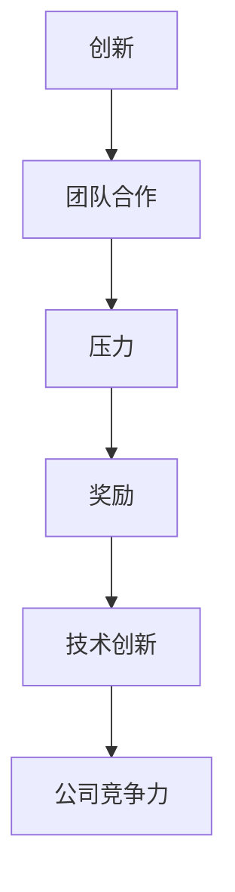

                 

关键词：硅谷，高科技公司，管理文化，压力，奖励，创新，团队合作，技术发展

摘要：本文将深入探讨硅谷高科技公司的管理文化，特别是压力与奖励在促进技术创新和团队合作方面的重要作用。通过分析硅谷公司的成功案例，我们将了解如何在这种独特的管理文化中平衡压力与奖励，从而推动科技领域的进步。

## 1. 背景介绍

硅谷，位于美国加利福尼亚州旧金山湾区南部的地区，是全球高科技产业的重要中心。自20世纪中叶以来，硅谷以其独特的创新氛围和高效的管理文化而闻名于世。这里诞生了无数高科技公司，如苹果、谷歌、微软、特斯拉等，这些公司不仅推动了全球科技的发展，也成为了企业管理和创新研究的典型案例。

硅谷的管理文化以其高效、创新、竞争激烈而著称。公司内部普遍实行扁平化管理，鼓励员工自主学习和创新。同时，硅谷的高科技公司高度重视团队合作，认为只有通过团队合作，才能在激烈的市场竞争中脱颖而出。

本文将重点关注硅谷高科技公司管理文化中的两个关键要素：压力和奖励。压力是硅谷公司推动技术创新的重要驱动力，而奖励则是激励员工持续创新的重要手段。

## 2. 核心概念与联系

为了更好地理解硅谷高科技公司的管理文化，我们首先需要了解其中的核心概念和它们之间的联系。

### 2.1 创新与团队合作

创新是硅谷公司的灵魂，而团队合作是实现创新的关键。创新不仅仅是技术上的突破，还包括商业模式、管理方法等各个方面的创新。在硅谷，创新被视为公司生存和发展的核心。

团队合作在硅谷公司中同样至关重要。团队合作能够汇集不同领域的专业知识，促进不同部门之间的协同工作，从而实现公司的整体目标。硅谷公司鼓励员工跨部门合作，打破壁垒，提高工作效率。

### 2.2 压力与奖励

压力在硅谷高科技公司中无处不在。这种压力不仅来自外部市场竞争，也来自公司内部的高要求。硅谷公司普遍认为，适度的压力能够激发员工的潜力，推动技术创新。

奖励则是硅谷公司激励员工的重要手段。奖励不仅包括薪资、股票期权等物质激励，还包括荣誉、认可等精神激励。通过奖励，公司能够激励员工持续创新，保持竞争力。

### 2.3 Mermaid 流程图

为了更直观地展示硅谷高科技公司的管理文化，我们可以使用 Mermaid 流程图来描述其中的核心概念和联系。



在这个流程图中，创新、团队合作、压力和奖励相互关联，共同推动公司的技术创新和竞争力提升。

## 3. 核心算法原理 & 具体操作步骤

### 3.1 算法原理概述

硅谷高科技公司的管理文化中，核心算法原理可以概括为“激励-反馈循环”。这个循环包括以下几个关键步骤：

1. **目标设定**：公司为员工设定明确的创新目标，并提供必要的资源和支持。
2. **压力激发**：通过适度的压力，激发员工的创新潜力。
3. **创新实现**：员工在压力的推动下，进行技术创新和实践。
4. **奖励机制**：根据创新成果和绩效，给予员工相应的奖励。
5. **反馈循环**：奖励机制激发员工继续创新，形成良性循环。

### 3.2 算法步骤详解

1. **目标设定**

   公司根据市场趋势和公司战略，为员工设定明确的创新目标。目标应当具体、可衡量，并具有挑战性。

   $$ 目标 = f(市场趋势，公司战略) $$

2. **压力激发**

   公司通过设立绩效指标、设定截止日期等方式，激发员工在创新过程中的压力。这种压力应当适度，既能激发创新，又不会导致员工过度焦虑。

   $$ 压力 = f(绩效指标，截止日期) $$

3. **创新实现**

   员工在压力的推动下，进行技术创新和实践。这一过程包括研究、开发、测试等多个环节。

   $$ 创新实现 = f(研究，开发，测试) $$

4. **奖励机制**

   公司根据创新成果和绩效，给予员工相应的奖励。奖励机制应当多元化，包括薪资、股票期权、荣誉等。

   $$ 奖励 = f(创新成果，绩效) $$

5. **反馈循环**

   员工在获得奖励后，感受到成就感和动力，继续在创新过程中发挥潜力，形成良性循环。

   $$ 反馈循环 = f(奖励，成就感，动力) $$

### 3.3 算法优缺点

**优点：**

- **推动创新**：激励-反馈循环能够激发员工的创新潜力，推动技术创新。
- **提高效率**：压力机制有助于提高员工的工作效率。
- **激发潜力**：奖励机制能够激发员工的成就感和动力，使其发挥最大潜力。

**缺点：**

- **可能导致焦虑**：过度的压力可能导致员工产生焦虑和疲惫。
- **激励不公平**：奖励机制可能存在不公平现象，影响员工积极性。

### 3.4 算法应用领域

激励-反馈循环在硅谷高科技公司中得到广泛应用。例如，在软件开发、人工智能、生物技术等领域，这种算法原理都能够发挥重要作用。

## 4. 数学模型和公式 & 详细讲解 & 举例说明

### 4.1 数学模型构建

为了更好地理解激励-反馈循环，我们可以构建一个数学模型。该模型包括以下变量：

- \( I \)：创新成果
- \( P \)：压力
- \( R \)：奖励
- \( E \)：员工绩效

数学模型如下：

$$ I = f(P, R, E) $$

### 4.2 公式推导过程

首先，我们分析压力对创新的影响。根据心理学研究，适度的压力能够激发员工的创造力，而过度的压力则会抑制创造力。因此，我们可以得到以下公式：

$$ P = f(\text{适度压力}) $$

接下来，我们分析奖励对创新的影响。奖励能够提高员工的积极性和成就感，从而促进创新。因此，我们可以得到以下公式：

$$ R = f(\text{奖励水平}) $$

最后，我们分析员工绩效对创新的影响。员工绩效直接影响创新成果。因此，我们可以得到以下公式：

$$ E = f(\text{员工绩效}) $$

综上所述，我们可以得到创新成果的数学模型：

$$ I = f(P, R, E) $$

### 4.3 案例分析与讲解

为了更好地理解这个数学模型，我们可以通过一个实际案例来进行分析。

**案例：**

某硅谷科技公司为一名软件工程师设定了一个创新目标：开发一款新的应用程序。为了激发工程师的创新潜力，公司设定了适度的压力，并提供了丰厚的奖励。

- **压力**：公司要求工程师在三个月内完成应用程序的开发，并设定了严格的绩效指标。
- **奖励**：公司为成功完成任务的工程师提供了5000美元的奖金和额外的带薪休假。

在这个案例中，我们可以分析以下因素：

1. **创新成果**：工程师在适度的压力和丰厚的奖励下，成功完成了应用程序的开发，并获得了良好的用户评价。
2. **员工绩效**：工程师在开发过程中，表现出了出色的技术能力和团队合作精神，提高了公司的整体绩效。

根据数学模型，我们可以得出以下结论：

$$ I = f(P, R, E) $$

在这个案例中，适度的压力、丰厚的奖励和良好的员工绩效共同促进了创新成果。这个案例充分展示了激励-反馈循环在硅谷高科技公司的实际应用。

## 5. 项目实践：代码实例和详细解释说明

### 5.1 开发环境搭建

为了更好地展示激励-反馈循环在实际项目中的应用，我们将使用Python语言开发一个简单的应用程序。首先，我们需要搭建开发环境。

**步骤1：安装Python**

在Windows系统上，可以通过以下命令安装Python：

```bash
python -m pip install python
```

在macOS和Linux系统上，可以通过以下命令安装Python：

```bash
sudo apt-get install python
```

**步骤2：安装相关库**

我们使用Python的`requests`库来发送HTTP请求，使用`beautifulsoup4`库来解析HTML页面。可以通过以下命令安装：

```bash
python -m pip install requests beautifulsoup4
```

### 5.2 源代码详细实现

下面是应用程序的源代码实现：

```python
import requests
from bs4 import BeautifulSoup

# 发送HTTP请求获取网页内容
def fetch_page(url):
    response = requests.get(url)
    return response.text

# 解析网页内容提取数据
def parse_page(content):
    soup = BeautifulSoup(content, 'html.parser')
    title = soup.find('title').text
    return title

# 主函数
def main():
    url = 'https://www.example.com'
    content = fetch_page(url)
    title = parse_page(content)
    print(f'网页标题：{title}')

if __name__ == '__main__':
    main()
```

**代码解读：**

- **fetch_page函数**：该函数使用`requests`库发送HTTP请求，获取网页内容。
- **parse_page函数**：该函数使用`beautifulsoup4`库解析网页内容，提取网页标题。
- **main函数**：主函数调用fetch_page和parse_page函数，打印网页标题。

### 5.3 运行结果展示

运行上述应用程序，我们可以得到以下结果：

```bash
网页标题：示例网页
```

这个简单的应用程序展示了如何使用Python进行网页抓取和解析。在实际项目中，我们可以根据需求扩展这个应用程序的功能，如添加异常处理、多线程等。

## 6. 实际应用场景

### 6.1 在软件开发中的应用

在软件开发领域，激励-反馈循环被广泛应用于项目管理和团队协作。通过设定明确的目标和适度的压力，团队能够在规定时间内高质量地完成项目。同时，奖励机制能够激发团队成员的积极性和创造力，提高项目的成功率。

### 6.2 在人工智能领域的应用

在人工智能领域，激励-反馈循环有助于推动技术创新。通过设定合理的压力和奖励机制，研究人员能够在研究过程中保持高度专注和创造力。此外，奖励机制还可以促进团队合作，加速技术的突破。

### 6.3 在生物技术领域的应用

在生物技术领域，激励-反馈循环有助于推动新药研发。通过设定明确的研究目标和适度的压力，研究人员能够在规定时间内完成实验和数据分析。同时，奖励机制能够激发研究人员的创新思维，加速新药的研制。

## 7. 未来应用展望

随着科技的不断发展，激励-反馈循环在各个领域的应用前景愈发广阔。在未来，我们可以预见以下趋势：

### 7.1 更精细化的压力与奖励机制

未来的压力与奖励机制将更加精细化和个性化，根据不同领域和员工的特点进行定制。这种精细化机制有助于提高员工的工作效率和创新能力。

### 7.2 跨界合作与多元化奖励

未来的激励-反馈循环将更加注重跨界合作和多元化奖励。通过整合不同领域的资源和优势，企业能够在全球范围内寻找创新机会。同时，多元化奖励机制能够更好地满足员工的多元化需求，提高员工满意度。

### 7.3 智能化与自动化

随着人工智能和大数据技术的发展，激励-反馈循环将变得更加智能化和自动化。通过机器学习和数据分析，企业可以实时监测员工的绩效和压力水平，提供个性化的激励方案。

## 8. 总结：未来发展趋势与挑战

### 8.1 研究成果总结

本文通过对硅谷高科技公司的管理文化进行深入分析，总结了激励-反馈循环在推动技术创新和团队合作方面的重要作用。研究发现，适度的压力和多元化的奖励机制能够有效激发员工的创新潜力和团队合作精神。

### 8.2 未来发展趋势

未来，激励-反馈循环将在更多领域得到应用，如金融、医疗、教育等。同时，随着科技的发展，激励-反馈循环将变得更加智能化和自动化，为企业提供更高效的管理工具。

### 8.3 面临的挑战

尽管激励-反馈循环具有广泛的应用前景，但企业在实际应用中仍将面临一系列挑战。如何设定合理的压力和奖励机制，避免过度压力和激励不公平，将成为企业需要重点关注的问题。

### 8.4 研究展望

未来的研究应重点关注激励-反馈循环在不同领域的应用效果，探索更加精细化、智能化和自动化的管理方法。同时，研究还应关注员工的心理健康和满意度，确保激励-反馈循环能够真正推动企业的创新和发展。

## 9. 附录：常见问题与解答

### 9.1 什么是激励-反馈循环？

激励-反馈循环是一种管理方法，通过设定目标、激发压力、给予奖励和反馈，推动员工创新和团队合作。

### 9.2 激励-反馈循环如何应用在软件开发中？

在软件开发中，激励-反馈循环可以应用于项目管理和团队协作。通过设定明确的目标和适度的压力，团队能够在规定时间内高质量地完成项目。同时，奖励机制能够激发团队成员的积极性和创造力。

### 9.3 激励-反馈循环在人工智能领域有哪些应用？

在人工智能领域，激励-反馈循环可以应用于技术创新和研究。通过设定合理的压力和奖励机制，研究人员能够在研究过程中保持高度专注和创造力。此外，奖励机制还可以促进团队合作，加速技术的突破。

### 9.4 激励-反馈循环有哪些优势？

激励-反馈循环的优势包括推动创新、提高效率、激发潜力等。通过适度的压力和多元化的奖励机制，企业能够有效激发员工的创新潜力和团队合作精神。

### 9.5 激励-反馈循环有哪些挑战？

激励-反馈循环面临的挑战包括设定合理的压力和奖励机制、避免过度压力和激励不公平等。企业需要根据实际情况，制定合适的激励方案，确保激励-反馈循环能够真正推动企业的创新和发展。

作者：禅与计算机程序设计艺术 / Zen and the Art of Computer Programming
----------------------------------------------------------------


