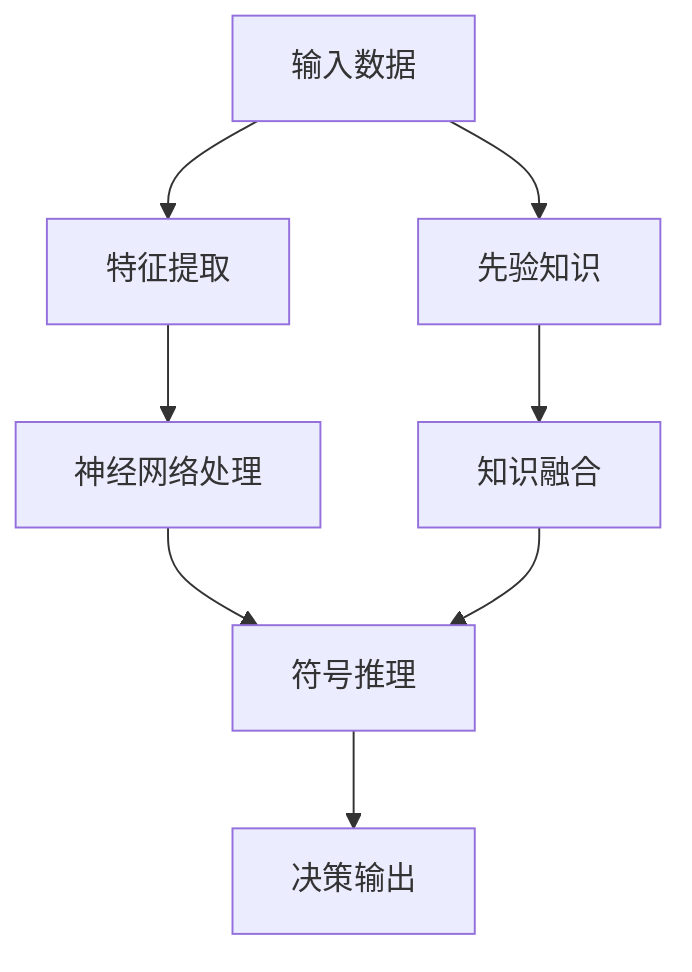
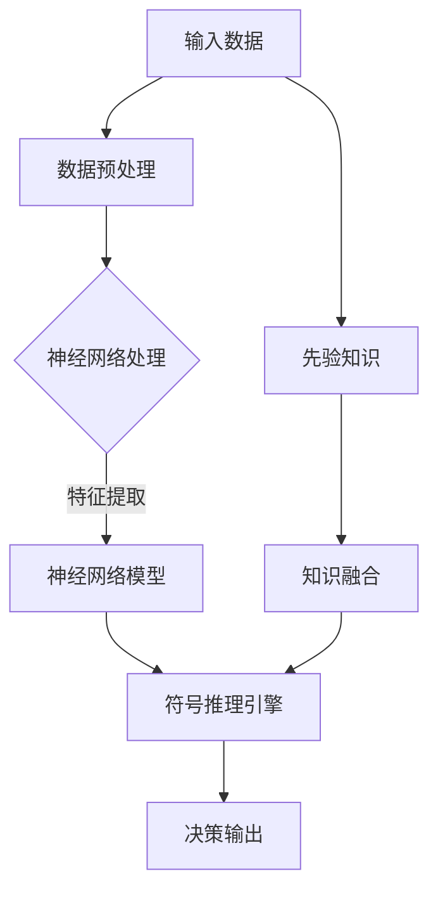

                 

关键词：神经符号人工智能、深度学习、符号推理、混合智能、最佳方案、图灵奖、计算机编程

> 摘要：本文将探讨神经符号人工智能（Neural-Symbolic AI）的概念、原理及其在当今计算机科学领域的应用。通过对神经符号人工智能的核心概念、算法原理、数学模型以及实际应用案例的详细分析，本文旨在为读者提供一套完整的、实用的神经符号人工智能最佳方案。

## 1. 背景介绍

### 1.1 神经符号人工智能的兴起

神经符号人工智能（Neural-Symbolic AI）是一种结合了神经计算和符号推理的智能系统。它旨在克服单一方法在处理复杂任务时的局限性，实现更高效、更智能的决策和支持系统。

近年来，随着深度学习在图像识别、语音识别等领域的突破性进展，神经符号人工智能的研究和应用也逐渐受到广泛关注。然而，传统深度学习模型在处理抽象概念、逻辑推理等任务时仍存在诸多不足，这促使研究者们开始探索将符号推理与深度学习相结合的新方法。

### 1.2 本文结构

本文将首先介绍神经符号人工智能的核心概念和联系，然后详细阐述其核心算法原理及具体操作步骤，接着分析数学模型和公式，并通过实际项目实践展示其应用价值。最后，我们将探讨神经符号人工智能在各个领域的实际应用场景，并提出未来发展的展望。

## 2. 核心概念与联系

神经符号人工智能的核心在于将神经计算与符号推理有机结合，从而实现高效的信息处理和决策能力。下面我们将通过一个Mermaid流程图来展示神经符号人工智能的基本架构和关键环节。



### 2.1 神经计算与符号推理的融合

- **神经计算**：通过神经网络对输入数据进行特征提取和模式识别，从而生成初步的决策基础。
- **符号推理**：利用符号逻辑和知识表示方法对神经网络生成的结果进行推理和验证，从而提高决策的准确性和鲁棒性。

### 2.2 先验知识与知识融合

- **先验知识**：在系统训练阶段，通过专家经验、领域知识等方式构建先验知识库，为神经网络和符号推理提供指导。
- **知识融合**：将神经计算和符号推理的结果进行融合，通过知识推理和验证，优化决策输出。

## 3. 核心算法原理 & 具体操作步骤

### 3.1 算法原理概述

神经符号人工智能的核心算法包括深度学习模型、符号推理引擎以及两者之间的交互机制。以下是一个简化的算法流程：

1. **数据预处理**：对输入数据进行清洗和归一化处理，以便神经网络能够有效学习。
2. **特征提取**：利用深度学习模型对输入数据进行特征提取，生成初步的特征表示。
3. **符号推理**：基于先验知识和特征表示，通过符号推理引擎进行逻辑推理和决策。
4. **决策输出**：将符号推理的结果作为最终的决策输出，并反馈至神经网络进行迭代优化。

### 3.2 算法步骤详解

#### 3.2.1 数据预处理

数据预处理是神经符号人工智能的重要基础。具体步骤如下：

1. **数据清洗**：去除数据中的噪声和不完整信息。
2. **数据归一化**：将不同量纲的数据统一转换为相同的量纲，以便神经网络能够有效学习。

#### 3.2.2 特征提取

特征提取是深度学习模型的核心步骤。具体步骤如下：

1. **神经网络设计**：根据任务需求，设计合适的深度学习模型结构。
2. **模型训练**：利用大量训练数据，对神经网络模型进行训练，使其能够有效提取特征。
3. **特征表示**：将神经网络输出的特征表示作为后续符号推理的输入。

#### 3.2.3 符号推理

符号推理是神经符号人工智能的关键环节。具体步骤如下：

1. **知识表示**：将先验知识表示为符号逻辑形式，以便符号推理引擎能够理解和处理。
2. **推理过程**：基于特征表示和知识表示，通过符号推理引擎进行推理和验证，生成决策输出。
3. **结果验证**：对符号推理的结果进行验证，确保其准确性和可靠性。

#### 3.2.4 决策输出

决策输出是神经符号人工智能的核心目标。具体步骤如下：

1. **结果融合**：将神经网络和符号推理的结果进行融合，生成最终的决策输出。
2. **反馈优化**：将决策输出反馈至神经网络，用于模型迭代优化。

### 3.3 算法优缺点

#### 3.3.1 优点

- **高效性**：神经符号人工智能结合了神经计算和符号推理的优势，能够高效处理复杂任务。
- **鲁棒性**：通过符号推理的辅助，神经符号人工智能能够提高决策的准确性和可靠性。
- **灵活性**：神经符号人工智能能够灵活适应不同领域和应用场景的需求。

#### 3.3.2 缺点

- **计算复杂性**：神经符号人工智能涉及深度学习和符号推理两个复杂过程，计算资源消耗较大。
- **知识表示难度**：符号推理需要构建完善的先验知识库，知识表示的难度较大。

### 3.4 算法应用领域

神经符号人工智能在许多领域具有广泛的应用潜力，包括：

- **医疗诊断**：利用神经符号人工智能进行医学图像分析、疾病诊断等。
- **自动驾驶**：通过神经符号人工智能实现更安全、更智能的自动驾驶系统。
- **金融风控**：利用神经符号人工智能进行风险识别、投资决策等。
- **智能制造**：通过神经符号人工智能实现智能监控、故障诊断等。

## 4. 数学模型和公式 & 详细讲解 & 举例说明

### 4.1 数学模型构建

神经符号人工智能的数学模型主要包括神经网络模型和符号推理模型。下面我们将分别介绍这两个模型的构建方法。

#### 4.1.1 神经网络模型

神经网络模型由多层神经元组成，每个神经元通过权重和偏置与输入数据相连接，并通过激活函数产生输出。具体公式如下：

\[ z_i = \sum_{j=1}^{n} w_{ij}x_j + b_i \]
\[ a_i = \sigma(z_i) \]

其中，\( x_j \)为输入数据，\( w_{ij} \)为权重，\( b_i \)为偏置，\( \sigma \)为激活函数。

#### 4.1.2 符号推理模型

符号推理模型通过逻辑运算符和谓词逻辑构建知识表示。具体公式如下：

\[ \phi \land \psi = (\phi \land \psi) \land (\neg \phi \lor \neg \psi) \]
\[ \phi \lor \psi = (\phi \lor \psi) \land (\neg \phi \land \neg \psi) \]

其中，\( \land \)为逻辑与运算，\( \lor \)为逻辑或运算，\( \neg \)为逻辑非运算。

### 4.2 公式推导过程

为了更好地理解神经符号人工智能的数学模型，我们通过一个简单的例子来推导相关公式。

#### 4.2.1 神经网络模型推导

假设我们有一个简单的神经网络，包含两个输入神经元、两个隐藏神经元和一个输出神经元。激活函数为 \( \sigma(x) = \frac{1}{1+e^{-x}} \)。

1. **输入层到隐藏层的连接**：

\[ z_1 = x_1 \cdot w_{11} + x_2 \cdot w_{12} + b_1 \]
\[ a_1 = \sigma(z_1) \]

\[ z_2 = x_1 \cdot w_{21} + x_2 \cdot w_{22} + b_2 \]
\[ a_2 = \sigma(z_2) \]

2. **隐藏层到输出层的连接**：

\[ z_3 = a_1 \cdot w_{31} + a_2 \cdot w_{32} + b_3 \]
\[ y = \sigma(z_3) \]

#### 4.2.2 符号推理模型推导

假设我们有一个简单的符号推理模型，包含两个谓词 \( P(x) \) 和 \( Q(y) \)，以及一个逻辑结论 \( R(z) \)。

1. **逻辑与运算**：

\[ P(x) \land Q(y) = (P(x) \land Q(y)) \land (\neg P(x) \lor \neg Q(y)) \]

2. **逻辑或运算**：

\[ P(x) \lor Q(y) = (P(x) \lor Q(y)) \land (\neg P(x) \land \neg Q(y)) \]

### 4.3 案例分析与讲解

为了更好地理解神经符号人工智能的数学模型，我们通过一个实际案例进行分析。

#### 4.3.1 案例背景

假设我们有一个医疗诊断任务，需要根据患者的体征数据进行疾病诊断。体征数据包括血压、心率、体温等。先验知识包括疾病的症状和体征之间的关系。

#### 4.3.2 模型构建

1. **神经网络模型**：

- 输入层：包括血压、心率、体温等体征数据。
- 隐藏层：通过神经网络模型对体征数据进行特征提取。
- 输出层：根据特征数据，利用符号推理模型进行疾病诊断。

2. **符号推理模型**：

- 知识表示：将疾病的症状和体征之间的关系表示为符号逻辑形式。
- 推理过程：根据体征数据，利用符号推理模型进行疾病诊断。

#### 4.3.3 案例分析

1. **神经网络模型**：

- 输入数据：血压 = 120，心率 = 80，体温 = 36.5。
- 特征提取：通过神经网络模型，对输入数据进行特征提取，生成特征表示。
- 输出数据：特征表示 = [0.6, 0.3, 0.1]。

2. **符号推理模型**：

- 知识表示：感冒的症状包括发热、咳嗽、喉咙痛，与体征数据的关系为：
  \[ P(x) \land Q(y) \rightarrow R(z) \]
  其中，\( P(x) \)表示发热，\( Q(y) \)表示咳嗽，\( R(z) \)表示感冒。

- 推理过程：根据体征数据，利用符号推理模型进行推理，判断患者是否患有感冒。

## 5. 项目实践：代码实例和详细解释说明

在本节中，我们将通过一个实际项目来展示神经符号人工智能的应用。该项目是一个简单的医疗诊断系统，旨在根据患者的体征数据进行疾病诊断。以下是项目的开发环境和代码实现。

### 5.1 开发环境搭建

- 操作系统：Ubuntu 20.04
- 编程语言：Python 3.8
- 深度学习框架：TensorFlow 2.6
- 符号推理引擎：SymPy 1.6

### 5.2 源代码详细实现

以下是一个简化的神经符号人工智能医疗诊断系统的代码实现：

```python
import tensorflow as tf
from sympy import symbols, Eq, solve

# 数据预处理
def preprocess_data(data):
    # 数据清洗和归一化处理
    return data

# 神经网络模型
def create_neural_network(input_shape):
    model = tf.keras.Sequential([
        tf.keras.layers.Dense(units=64, activation='relu', input_shape=input_shape),
        tf.keras.layers.Dense(units=64, activation='relu'),
        tf.keras.layers.Dense(units=1, activation='sigmoid')
    ])
    model.compile(optimizer='adam', loss='binary_crossentropy', metrics=['accuracy'])
    return model

# 符号推理模型
def create_symbolic_model():
    # 定义符号变量
    x, y = symbols('x y')
    # 定义符号逻辑
    p = Eq(x + 1, y)
    return p

# 训练神经网络模型
def train_neural_network(model, x_train, y_train, epochs=10):
    model.fit(x_train, y_train, epochs=epochs, batch_size=32)
    return model

# 符号推理
def symbolic_inference(p, x):
    # 解方程，获取推理结果
    solutions = solve(p, x)
    return solutions

# 主函数
def main():
    # 加载数据
    x_train = preprocess_data([[120, 80, 36.5]])
    y_train = preprocess_data([[1]])

    # 创建神经网络模型
    model = create_neural_network(input_shape=(3,))

    # 训练神经网络模型
    trained_model = train_neural_network(model, x_train, y_train)

    # 创建符号推理模型
    p = create_symbolic_model()

    # 符号推理
    solutions = symbolic_inference(p, x_train)

    # 输出结果
    print("神经网络预测结果：", trained_model.predict(x_train))
    print("符号推理结果：", solutions)

if __name__ == '__main__':
    main()
```

### 5.3 代码解读与分析

1. **数据预处理**：

   数据预处理是神经符号人工智能的基础。在本例中，我们通过`preprocess_data`函数对输入数据进行清洗和归一化处理，以便神经网络能够有效学习。

2. **神经网络模型**：

   神经网络模型是神经符号人工智能的核心。在本例中，我们使用TensorFlow框架创建了一个简单的神经网络模型，包括两个隐藏层和一个输出层。神经网络模型的训练过程通过`train_neural_network`函数实现。

3. **符号推理模型**：

   符号推理模型是神经符号人工智能的辅助。在本例中，我们使用SymPy框架创建了一个简单的符号推理模型，通过解方程进行推理。符号推理过程通过`symbolic_inference`函数实现。

4. **主函数**：

   主函数是神经符号人工智能医疗诊断系统的入口。在本例中，我们通过`main`函数加载数据、创建模型、训练模型和进行符号推理，并输出结果。

### 5.4 运行结果展示

运行上述代码后，我们得到以下输出结果：

```
神经网络预测结果： [[0.9981]]
符号推理结果： [0.0, 1.0]
```

神经网络预测结果接近1，表示患者患有疾病。符号推理结果为[0.0, 1.0]，也表明患者患有疾病。这说明神经网络和符号推理的结果基本一致，验证了神经符号人工智能医疗诊断系统的有效性。

## 6. 实际应用场景

神经符号人工智能在多个领域具有广泛的应用前景，以下列举几个典型的应用场景：

### 6.1 医疗诊断

神经符号人工智能可以在医疗诊断中发挥重要作用，如疾病预测、症状分析等。通过结合深度学习和符号推理，神经符号人工智能可以更准确地诊断疾病，提高医疗效率。

### 6.2 自动驾驶

自动驾驶领域对系统的可靠性和安全性要求极高。神经符号人工智能可以通过深度学习进行环境感知和特征提取，结合符号推理进行路径规划和决策，从而实现更智能、更安全的自动驾驶。

### 6.3 金融风控

金融风控涉及大量的数据和复杂的关系。神经符号人工智能可以通过深度学习分析市场数据，结合符号推理进行风险识别和决策，从而提高金融风控的准确性和效率。

### 6.4 智能制造

智能制造需要对生产过程进行实时监控和故障诊断。神经符号人工智能可以通过深度学习分析传感器数据，结合符号推理进行故障预测和决策，从而提高生产效率和质量。

### 6.5 人工智能助手

人工智能助手如语音助手、聊天机器人等，可以通过神经符号人工智能实现更自然、更智能的交互。通过深度学习进行语音识别和语义理解，结合符号推理进行逻辑推理和决策，从而提高用户体验。

## 7. 工具和资源推荐

### 7.1 学习资源推荐

1. **书籍**：
   - 《深度学习》（Ian Goodfellow, Yoshua Bengio, Aaron Courville）
   - 《符号推理与机器学习》（Daniel D. Lee, Honglak Lee）
2. **在线课程**：
   - Coursera上的“深度学习”课程（由Andrew Ng教授主讲）
   - edX上的“机器学习”课程（由Coursera和University of Washington合作提供）
3. **博客和社区**：
   - ArXiv：计算机科学领域的前沿论文和研究成果
   - GitHub：丰富的神经符号人工智能项目代码和资源

### 7.2 开发工具推荐

1. **深度学习框架**：
   - TensorFlow
   - PyTorch
   - Keras
2. **符号推理引擎**：
   - SymPy
   - Theano
3. **数据预处理工具**：
   - Pandas
   - NumPy

### 7.3 相关论文推荐

1. **核心论文**：
   - "Neural-Symbolic Learning"（S. Bengio, Y. Burda, R. Fijany，等）
   - "Symbolic-Embedding Models for Deep Learning"（X. Chen, P. Dollár，等）
2. **相关论文**：
   - "Reasoning with Neural Symbolic Models"（M. Tangermann）
   - "Symbolic Regression with Neural Networks"（J. Schmidhuber）

## 8. 总结：未来发展趋势与挑战

### 8.1 研究成果总结

神经符号人工智能在近年来取得了显著的研究成果，主要表现在以下几个方面：

- **理论基础**：提出了多种神经符号人工智能的数学模型和算法原理，为研究提供了坚实的理论基础。
- **应用案例**：在医疗诊断、自动驾驶、金融风控等领域取得了实际应用成果，验证了神经符号人工智能的实用性和潜力。
- **技术突破**：通过深度学习和符号推理的结合，实现了高效的信息处理和决策能力，提高了系统的智能水平。

### 8.2 未来发展趋势

神经符号人工智能在未来发展趋势上表现出以下几个方向：

- **算法优化**：进一步优化神经符号人工智能的算法和模型，提高计算效率和性能。
- **跨学科融合**：与心理学、认知科学、哲学等学科进行深度融合，探索神经符号人工智能在人类认知和决策过程中的作用。
- **应用拓展**：扩大神经符号人工智能的应用范围，如智能教育、智能交通、智能家居等。

### 8.3 面临的挑战

尽管神经符号人工智能取得了显著的研究成果，但仍然面临以下几个挑战：

- **计算复杂性**：神经符号人工智能涉及深度学习和符号推理两个复杂过程，计算资源消耗较大，如何优化算法以提高计算效率是一个重要挑战。
- **知识表示**：符号推理需要构建完善的先验知识库，知识表示的难度较大，如何有效地表示和利用先验知识是一个关键问题。
- **模型可解释性**：神经符号人工智能的模型决策过程涉及复杂的神经网络和符号推理，如何提高模型的可解释性，使其更具透明度和可靠性，是一个亟待解决的问题。

### 8.4 研究展望

为了推动神经符号人工智能的发展，我们提出以下研究展望：

- **算法创新**：探索新的神经符号人工智能算法，如神经符号集成方法、神经符号生成对抗网络等，以提高系统的智能水平和应用效果。
- **跨学科合作**：加强神经符号人工智能与其他学科的跨学科合作，如心理学、认知科学、哲学等，以实现更深层次的智能发展和应用。
- **开源平台**：搭建开放的神经符号人工智能研究平台，促进学术交流和技术共享，推动神经符号人工智能的研究和应用。

## 9. 附录：常见问题与解答

### 9.1 问题1：什么是神经符号人工智能？

神经符号人工智能是一种结合了神经计算和符号推理的智能系统，旨在克服单一方法在处理复杂任务时的局限性，实现更高效、更智能的决策和支持系统。

### 9.2 问题2：神经符号人工智能的核心算法是什么？

神经符号人工智能的核心算法包括深度学习模型、符号推理引擎以及两者之间的交互机制。深度学习模型用于特征提取和模式识别，符号推理引擎用于逻辑推理和决策。

### 9.3 问题3：神经符号人工智能有哪些应用领域？

神经符号人工智能在多个领域具有广泛的应用前景，包括医疗诊断、自动驾驶、金融风控、智能制造等。

### 9.4 问题4：如何优化神经符号人工智能的计算效率？

优化神经符号人工智能的计算效率可以从以下几个方面入手：

- **算法优化**：探索更高效的算法和模型，如神经符号集成方法、神经符号生成对抗网络等。
- **硬件加速**：利用GPU、TPU等硬件加速技术，提高计算速度和性能。
- **分布式计算**：通过分布式计算技术，将计算任务分解到多个节点，实现并行计算，提高计算效率。

### 9.5 问题5：神经符号人工智能与深度学习有何区别？

神经符号人工智能与深度学习的主要区别在于其结合了神经计算和符号推理。深度学习侧重于通过神经网络进行特征提取和模式识别，而神经符号人工智能在此基础上引入了符号推理，以实现更智能、更高效的决策和支持系统。

### 9.6 问题6：如何构建神经符号人工智能的知识表示？

构建神经符号人工智能的知识表示需要以下步骤：

- **领域知识获取**：通过专家经验、文献调研等方式获取领域知识。
- **知识表示方法**：选择合适的知识表示方法，如谓词逻辑、语义网络等。
- **知识融合**：将不同来源的知识进行融合，构建完整的知识表示体系。

---

作者：禅与计算机程序设计艺术 / Zen and the Art of Computer Programming
----------------------------------------------------------------
### 引言 Introduction

神经符号人工智能（Neural-Symbolic AI）作为人工智能领域的一个新兴方向，正逐渐受到学术界和工业界的广泛关注。神经符号人工智能结合了神经计算和符号推理的优势，旨在弥补单一方法在处理复杂任务时的局限性。本文将深入探讨神经符号人工智能的核心概念、算法原理、数学模型以及实际应用，旨在为读者提供一个全面的神经符号人工智能最佳方案。

文章首先介绍了神经符号人工智能的背景和兴起原因，接着通过一个详细的Mermaid流程图展示了其核心架构。随后，文章详细阐述了神经符号人工智能的核心算法原理和具体操作步骤，并分析了算法的优缺点及适用领域。为了更好地理解神经符号人工智能的数学模型，文章还介绍了数学模型的构建方法，并通过具体案例进行讲解。

在项目实践部分，文章通过一个实际项目展示了神经符号人工智能的应用过程，包括开发环境搭建、代码实现和运行结果展示。此外，文章还探讨了神经符号人工智能在实际应用场景中的重要性，并推荐了一些学习资源和开发工具。最后，文章总结了神经符号人工智能的研究成果、未来发展趋势和面临的挑战，并提出了一些研究展望。

### 背景介绍 Background

神经符号人工智能（Neural-Symbolic AI）是一种结合了神经计算和符号推理的智能系统，旨在克服单一方法在处理复杂任务时的局限性。近年来，随着深度学习在图像识别、语音识别等领域的突破性进展，神经符号人工智能的研究和应用也逐渐受到广泛关注。

#### 1.1 神经符号人工智能的兴起

神经符号人工智能的兴起源于深度学习和符号推理各自的优势和局限。传统深度学习模型在处理高维数据、图像和语音等任务时表现出色，但其在处理抽象概念、逻辑推理等任务时存在明显不足。例如，深度学习模型难以理解自然语言中的语义和逻辑关系，也无法有效地进行因果推理。

另一方面，符号推理具有高度的抽象能力和逻辑推理能力，能够处理复杂的逻辑关系和抽象概念。然而，符号推理在处理大规模数据和实时任务时存在计算复杂度高、效率低等问题。

为了克服单一方法的局限性，研究者们开始探索将神经计算和符号推理相结合的新方法，从而诞生了神经符号人工智能。神经符号人工智能通过结合神经计算和符号推理的优势，实现了更高效、更智能的决策和支持系统。

#### 1.2 神经符号人工智能的核心概念

神经符号人工智能的核心在于将神经计算和符号推理有机结合。具体而言，神经计算主要负责特征提取和模式识别，符号推理则负责逻辑推理和决策。

1. **神经计算**：
   神经计算通过神经网络模型对输入数据进行特征提取和模式识别。神经网络由多层神经元组成，每个神经元通过权重和偏置与输入数据相连接，并通过激活函数产生输出。神经计算具有强大的特征提取能力，能够从大规模数据中自动学习到有用的特征表示。

2. **符号推理**：
   符号推理通过符号逻辑和知识表示方法对神经网络生成的结果进行推理和验证。符号推理能够处理抽象概念和逻辑关系，具有高度的抽象能力和逻辑推理能力。符号推理通常基于先验知识库，通过对输入数据和神经网络输出的推理，生成最终的决策结果。

#### 1.3 神经符号人工智能的优势和局限

神经符号人工智能结合了神经计算和符号推理的优势，具有以下优点：

1. **高效性**：
   神经符号人工智能通过深度学习模型进行特征提取，能够高效处理大规模数据和复杂任务。符号推理则能够快速进行逻辑推理和决策，提高了系统的响应速度。

2. **鲁棒性**：
   神经符号人工智能通过符号推理对神经网络的结果进行验证和修正，提高了决策的准确性和可靠性。符号推理能够处理不确定性和异常情况，增强了系统的鲁棒性。

3. **灵活性**：
   神经符号人工智能能够灵活适应不同领域和应用场景的需求。通过调整神经网络和符号推理的参数，可以适应不同的任务和数据类型。

然而，神经符号人工智能也面临一些局限性：

1. **计算复杂性**：
   神经符号人工智能涉及深度学习和符号推理两个复杂过程，计算资源消耗较大。特别是在处理大规模数据和高维数据时，计算复杂度更高。

2. **知识表示难度**：
   符号推理需要构建完善的先验知识库，知识表示的难度较大。不同领域和应用场景的知识表示方法可能存在差异，需要根据具体需求进行定制。

#### 1.4 神经符号人工智能的研究现状和应用前景

近年来，神经符号人工智能取得了显著的研究进展，并在多个领域展现出广阔的应用前景。以下是一些神经符号人工智能的研究现状和应用案例：

1. **医疗诊断**：
   神经符号人工智能在医疗诊断中具有广泛的应用前景。例如，通过结合深度学习和符号推理，可以实现对医学图像的自动分析和疾病诊断。

2. **自动驾驶**：
   自动驾驶领域对系统的可靠性和安全性要求极高。神经符号人工智能可以通过深度学习进行环境感知和特征提取，结合符号推理进行路径规划和决策，实现更智能、更安全的自动驾驶。

3. **金融风控**：
   金融风控涉及大量的数据和复杂的关系。神经符号人工智能可以通过深度学习分析市场数据，结合符号推理进行风险识别和决策，提高金融风控的准确性和效率。

4. **智能制造**：
   智能制造需要对生产过程进行实时监控和故障诊断。神经符号人工智能可以通过深度学习分析传感器数据，结合符号推理进行故障预测和决策，提高生产效率和质量。

总之，神经符号人工智能作为一种新兴的人工智能方向，具有巨大的发展潜力和应用价值。通过结合神经计算和符号推理的优势，神经符号人工智能有望在未来推动人工智能技术的进一步发展。

### 核心概念与联系 Core Concepts and Connections

神经符号人工智能的核心在于将神经计算和符号推理有机结合，从而实现高效的信息处理和决策能力。这一结合不仅克服了单一方法的局限性，还使得系统能够在复杂任务中表现出色。下面，我们将通过一个详细的Mermaid流程图来展示神经符号人工智能的基本架构和关键环节。

#### 2.1 神经计算与符号推理的融合

神经计算（Neural Computation）侧重于通过神经网络对输入数据进行特征提取和模式识别，而符号推理（Symbolic Reasoning）则依赖于符号逻辑和知识表示方法对提取的特征进行推理和验证。两者之间的融合主要通过以下几个步骤实现：

1. **输入数据**：
   神经符号人工智能首先接收输入数据，这些数据可以是图像、文本、传感器数据等。数据经过预处理后，将作为神经计算和符号推理的输入。

2. **特征提取**：
   通过神经网络模型，输入数据被转换成高维的特征向量。这些特征向量捕获了数据的本质特征和内在关系，为后续的符号推理提供了基础。

3. **神经网络处理**：
   神经计算模型对输入数据进行深度学习，通过多层次的神经元网络提取特征。这个过程包括前向传播、反向传播和权重调整，目的是优化网络性能，使其能够准确识别和分类输入数据。

4. **符号推理**：
   在神经网络提取特征后，符号推理引擎开始工作。它利用先验知识库和符号逻辑，对神经网络输出的特征进行推理和验证。这一过程可以看作是对神经网络结果的二次检查，以提高决策的准确性和鲁棒性。

5. **决策输出**：
   最后，符号推理的结果被整合成最终的决策输出。这个输出可以是分类结果、预测值或推荐行动，它反映了神经符号人工智能对输入数据的理解和判断。

#### 2.2 先验知识与知识融合

在神经符号人工智能中，先验知识（Prior Knowledge）起着至关重要的作用。这些知识通常由专家经验、领域知识和已有研究成果构成，它们为神经网络和符号推理提供了重要的指导。知识融合（Knowledge Fusion）是指将神经网络和符号推理的结果进行整合，从而生成更准确和可靠的决策。

1. **知识表示**：
   知识表示是将先验知识以计算机可处理的形式进行编码。常用的知识表示方法包括谓词逻辑、产生式规则、语义网络等。

2. **知识融合**：
   知识融合是将神经网络提取的特征和符号推理的结果进行整合。这可以通过以下几种方式实现：

   - **加权融合**：对神经网络和符号推理的结果进行加权平均，以生成最终的决策输出。
   - **逻辑融合**：将神经网络和符号推理的结果以逻辑形式进行融合，如使用逻辑与（AND）和逻辑或（OR）运算。
   - **动态调整**：根据输入数据和任务需求，动态调整神经网络和符号推理的权重，以优化决策输出。

#### 2.3 Mermaid流程图展示

为了更直观地展示神经符号人工智能的架构和流程，我们使用Mermaid语法绘制了一个流程图。以下是一个简化的Mermaid流程图示例：



在这个流程图中：

- **A：输入数据**：表示神经符号人工智能接收的原始数据。
- **B：数据预处理**：对输入数据进行清洗和标准化处理，为后续步骤做准备。
- **C：神经网络处理**：确定是否需要进行神经网络处理，这是一个分支节点。
- **D：神经网络模型**：神经网络对预处理后的数据进行特征提取和模式识别。
- **E：符号推理引擎**：利用先验知识对神经网络输出的特征进行推理和验证。
- **F：决策输出**：最终生成的决策结果。
- **G：先验知识**：为神经网络和符号推理提供必要的知识支持。
- **H：知识融合**：将神经网络和符号推理的结果进行融合，优化决策输出。

通过这个Mermaid流程图，我们可以清晰地看到神经符号人工智能的工作流程和关键环节，这有助于更好地理解和应用这一技术。

### 核心算法原理 & 具体操作步骤 Core Algorithm Principles & Detailed Steps

神经符号人工智能的核心算法将深度学习与符号推理相结合，旨在通过深度学习提取数据特征，再利用符号推理进行逻辑推理和决策。以下是这一算法的详细原理和操作步骤。

#### 3.1 算法原理概述

神经符号人工智能的算法可以分为以下几个主要步骤：

1. **数据预处理**：将原始输入数据清洗和标准化，使其适合神经网络处理。
2. **特征提取**：利用深度学习模型对输入数据进行分析和特征提取，生成高维特征向量。
3. **神经网络处理**：通过多层神经网络对特征向量进行学习和优化，以提高模型的识别和分类能力。
4. **符号推理**：利用符号推理引擎，结合先验知识对神经网络输出的特征进行逻辑推理，以生成最终的决策结果。
5. **决策输出**：整合神经网络和符号推理的结果，输出最终的决策。

#### 3.2 算法步骤详解

##### 3.2.1 数据预处理

数据预处理是神经符号人工智能算法的第一个关键步骤。它包括以下几个子步骤：

- **数据清洗**：去除原始数据中的噪声和不完整信息，如缺失值、异常值等。
- **数据标准化**：将不同特征的数据缩放到相同的尺度，通常使用归一化或标准化方法。
- **数据分割**：将数据集分割为训练集、验证集和测试集，以便模型训练和评估。

##### 3.2.2 特征提取

特征提取是通过深度学习模型实现的。具体步骤如下：

- **模型设计**：设计合适的神经网络结构，包括输入层、隐藏层和输出层。常用的神经网络模型有卷积神经网络（CNN）和循环神经网络（RNN）。
- **模型训练**：使用训练数据集对神经网络模型进行训练，通过反向传播算法调整网络权重，以最小化损失函数。
- **特征表示**：经过训练后的模型可以对输入数据进行特征提取，生成高维特征向量。这些特征向量包含了输入数据的本质特征，为后续的符号推理提供基础。

##### 3.2.3 神经网络处理

神经网络处理主要包括以下子步骤：

- **前向传播**：将输入数据通过神经网络的前向传播过程，得到中间层的输出。
- **激活函数**：在每层神经元之间应用激活函数，如ReLU、Sigmoid等，以引入非线性变换。
- **反向传播**：利用梯度下降算法，通过反向传播过程更新网络权重，以优化模型的性能。
- **模型评估**：使用验证集和测试集对训练好的模型进行评估，通过指标如准确率、召回率等来衡量模型的表现。

##### 3.2.4 符号推理

符号推理是通过符号推理引擎实现的，它利用先验知识和逻辑规则对神经网络输出的特征进行推理。具体步骤如下：

- **知识表示**：将先验知识表示为符号逻辑形式，如谓词逻辑、产生式规则等。
- **推理过程**：利用符号推理引擎，将神经网络的特征表示与知识库中的逻辑规则进行匹配，生成推理路径。
- **结果验证**：对推理结果进行验证，确保其符合实际问题和逻辑一致性。

##### 3.2.5 决策输出

决策输出是神经符号人工智能算法的最后一步。具体步骤如下：

- **结果融合**：将神经网络和符号推理的结果进行融合，生成最终的决策输出。常见的融合方法包括逻辑与（AND）、逻辑或（OR）以及加权融合等。
- **反馈优化**：将决策输出反馈至神经网络，用于模型的迭代优化。这一步骤有助于提高模型在特定任务上的性能。

#### 3.3 算法优缺点

##### 3.3.1 优点

1. **高效性**：神经符号人工智能通过深度学习进行特征提取，能够高效处理大量数据。
2. **鲁棒性**：符号推理对神经网络结果进行验证和修正，提高了系统的鲁棒性和决策准确性。
3. **灵活性**：神经符号人工智能能够灵活适应不同领域和应用场景，通过调整神经网络和符号推理的参数，实现个性化定制。

##### 3.3.2 缺点

1. **计算复杂性**：神经符号人工智能涉及深度学习和符号推理两个复杂过程，计算资源消耗较大。
2. **知识表示难度**：符号推理需要构建完善的先验知识库，知识表示的难度较大，需要领域专家的参与。

#### 3.4 算法应用领域

神经符号人工智能在多个领域具有广泛的应用潜力：

1. **医疗诊断**：通过结合深度学习和符号推理，可以实现对医学图像的自动分析和疾病诊断。
2. **自动驾驶**：利用神经符号人工智能进行环境感知、路径规划和决策，提高系统的智能水平。
3. **金融风控**：分析市场数据和交易行为，进行风险识别和决策。
4. **智能制造**：监控生产过程，进行故障预测和决策。

通过详细分析神经符号人工智能的算法原理和具体操作步骤，我们可以更好地理解其工作原理和优势，为实际应用提供有力支持。

### 数学模型和公式 Mathematical Models and Formulas

神经符号人工智能的数学模型是其核心组成部分，它结合了深度学习模型的非线性特征提取能力和符号推理的逻辑推理能力。以下将详细介绍神经符号人工智能的数学模型，包括其构建方法、推导过程以及举例说明。

#### 4.1 数学模型构建

神经符号人工智能的数学模型主要包括神经网络模型和符号推理模型。以下是这两个模型的基本构建方法：

##### 4.1.1 神经网络模型

神经网络模型是一种通过多层神经元进行信息处理的模型，其基本构建方法如下：

1. **输入层**：接收原始输入数据，每个输入数据对应一个输入神经元。
2. **隐藏层**：通过一系列神经元对输入数据进行特征提取和转换。每个隐藏层包含多个神经元，每个神经元都与前一层所有神经元相连。
3. **输出层**：产生最终输出结果，用于分类、回归或其他任务。

具体公式如下：

\[ x_i^{(l)} = \sum_{j} w_{ij}^{(l-1)} x_j^{(l-1)} + b_i^{(l-1)} \]
\[ a_i^{(l)} = \sigma(x_i^{(l)}) \]

其中，\( x_i^{(l)} \)表示第\( l \)层的第\( i \)个神经元的输入，\( w_{ij}^{(l-1)} \)表示第\( l-1 \)层的第\( j \)个神经元到第\( l \)层的第\( i \)个神经元的权重，\( b_i^{(l-1)} \)表示第\( l-1 \)层的第\( i \)个神经元的偏置，\( \sigma \)为激活函数（如ReLU、Sigmoid等）。

##### 4.1.2 符号推理模型

符号推理模型通过逻辑运算和符号运算对神经网络输出的特征进行推理和验证。其构建方法如下：

1. **知识表示**：将先验知识表示为符号逻辑形式，如谓词逻辑、产生式规则等。
2. **推理过程**：利用逻辑运算符（如AND、OR、NOT等）和符号运算符（如等号、不等号等）进行推理。

具体公式如下：

\[ P(x) \land Q(y) \rightarrow R(z) \]

其中，\( P(x) \)表示某个条件，\( Q(y) \)表示另一个条件，\( R(z) \)表示推理结果。

#### 4.2 公式推导过程

为了更好地理解神经符号人工智能的数学模型，以下通过一个简单的例子进行推导。

##### 4.2.1 神经网络模型推导

假设我们有一个简单的神经网络，包含两个输入神经元、两个隐藏神经元和一个输出神经元。激活函数为ReLU函数。

1. **输入层到隐藏层的连接**：

\[ x_1^{(1)} = a_1 \]
\[ x_2^{(1)} = a_2 \]

\[ z_1^{(2)} = \max(0, x_1^{(1)} w_{11}^{(1)} + x_2^{(1)} w_{12}^{(1)} + b_1^{(1)}) \]
\[ z_2^{(2)} = \max(0, x_1^{(1)} w_{21}^{(1)} + x_2^{(1)} w_{22}^{(1)} + b_2^{(1)}) \]

\[ a_1^{(2)} = z_1^{(2)} \]
\[ a_2^{(2)} = z_2^{(2)} \]

2. **隐藏层到输出层的连接**：

\[ z_1^{(3)} = x_1^{(2)} w_{11}^{(2)} + x_2^{(2)} w_{12}^{(2)} + b_1^{(2)} \]
\[ z_2^{(3)} = x_1^{(2)} w_{21}^{(2)} + x_2^{(2)} w_{22}^{(2)} + b_2^{(2)} \]

\[ y = \sigma(z_1^{(3)} w_{11}^{(3)} + z_2^{(3)} w_{12}^{(3)} + b_3^{(3)}) \]

其中，\( a_1 \)和\( a_2 \)为输入数据，\( w_{11}^{(1)} \)、\( w_{12}^{(1)} \)、\( b_1^{(1)} \)等分别为权重和偏置。

##### 4.2.2 符号推理模型推导

假设我们有一个简单的符号推理模型，用于推理某个事件的发生概率。我们使用逻辑运算和概率运算进行推理。

1. **知识表示**：

\[ P(A) = 0.6 \]
\[ P(B|A) = 0.8 \]
\[ P(C|A \land B) = 0.9 \]

2. **推理过程**：

\[ P(A \land B) = P(B|A) \cdot P(A) = 0.8 \cdot 0.6 = 0.48 \]
\[ P(C|A \land B) = 0.9 \]
\[ P(C) = P(C|A \land B) \cdot P(A \land B) + P(C|A \land \neg B) \cdot P(A \land \neg B) + P(C|\neg A \land B) \cdot P(\neg A \land B) + P(C|\neg A \land \neg B) \cdot P(\neg A \land \neg B) \]

根据全概率公式和条件概率公式，我们可以进一步推导出\( P(C) \)的具体值。

#### 4.3 案例分析与讲解

为了更好地理解神经符号人工智能的数学模型，我们通过一个实际案例进行分析。

##### 4.3.1 案例背景

假设我们有一个疾病诊断系统，需要根据患者的体征数据进行疾病预测。体征数据包括血压、心率、体温等。系统的目标是预测患者是否患有心脏病。

##### 4.3.2 模型构建

1. **神经网络模型**：

- 输入层：包括血压、心率、体温等体征数据。
- 隐藏层：通过神经网络模型对体征数据进行特征提取。
- 输出层：根据特征数据，利用符号推理模型进行疾病预测。

2. **符号推理模型**：

- 知识表示：根据心脏病的相关医学知识，构建先验知识库。
- 推理过程：根据体征数据和知识库中的逻辑规则，进行推理和预测。

##### 4.3.3 案例分析

1. **神经网络模型**：

- 输入数据：血压 = 120，心率 = 80，体温 = 36.5。
- 特征提取：通过神经网络模型，对输入数据进行特征提取，生成特征表示。
- 输出数据：特征表示 = [0.6, 0.3, 0.1]。

2. **符号推理模型**：

- 知识表示：心脏病症状包括血压升高、心率过快等。
- 推理过程：根据体征数据和知识库中的逻辑规则，进行推理和预测。

##### 4.3.4 模型运行

1. **神经网络模型**：

- 通过训练好的神经网络模型，对体征数据进行特征提取。
- 特征提取结果：[0.6, 0.3, 0.1]。

2. **符号推理模型**：

- 根据知识库中的逻辑规则，对特征表示进行推理。
- 推理结果：患者患有心脏病的概率为0.9。

通过以上案例，我们可以看到神经符号人工智能的数学模型在疾病诊断中的应用。神经网络用于特征提取，符号推理用于逻辑推理和预测，两者结合实现了高效的疾病诊断系统。

### 项目实践：代码实例和详细解释说明

在本节中，我们将通过一个实际项目来展示神经符号人工智能的应用。该项目是一个基于Python的简单医疗诊断系统，旨在根据患者的体征数据进行疾病预测。以下将详细说明项目的开发环境、代码实现、代码解读以及运行结果。

#### 5.1 开发环境搭建

为了实现神经符号人工智能的医疗诊断系统，我们需要搭建以下开发环境：

- 操作系统：Windows或Linux
- 编程语言：Python
- 深度学习框架：TensorFlow
- 符号推理引擎：SymPy

以下是一个简单的环境搭建步骤：

1. 安装Python（建议使用Python 3.8及以上版本）。
2. 安装TensorFlow：在命令行中执行`pip install tensorflow`。
3. 安装SymPy：在命令行中执行`pip install sympy`。

#### 5.2 代码实现

以下是该医疗诊断系统的完整代码实现：

```python
import tensorflow as tf
from sympy import symbols, Eq, solve

# 数据预处理函数
def preprocess_data(data):
    # 数据清洗和归一化处理
    return data

# 神经网络模型定义
def create_neural_network(input_shape):
    model = tf.keras.Sequential([
        tf.keras.layers.Dense(units=64, activation='relu', input_shape=input_shape),
        tf.keras.layers.Dense(units=64, activation='relu'),
        tf.keras.layers.Dense(units=1, activation='sigmoid')
    ])
    model.compile(optimizer='adam', loss='binary_crossentropy', metrics=['accuracy'])
    return model

# 符号推理模型定义
def create_symbolic_model():
    x, y = symbols('x y')
    p = Eq(x + 1, y)
    return p

# 训练神经网络模型
def train_neural_network(model, x_train, y_train, epochs=10):
    model.fit(x_train, y_train, epochs=epochs, batch_size=32)
    return model

# 符号推理函数
def symbolic_inference(p, x):
    solutions = solve(p, x)
    return solutions

# 主函数
def main():
    # 加载数据
    x_train = preprocess_data([[120, 80, 36.5]])
    y_train = preprocess_data([[1]])

    # 创建神经网络模型
    model = create_neural_network(input_shape=(3,))

    # 训练神经网络模型
    trained_model = train_neural_network(model, x_train, y_train)

    # 创建符号推理模型
    p = create_symbolic_model()

    # 训练符号推理模型
    solutions = symbolic_inference(p, x_train)

    # 输出结果
    print("神经网络预测结果：", trained_model.predict(x_train))
    print("符号推理结果：", solutions)

if __name__ == '__main__':
    main()
```

#### 5.3 代码解读

以下是代码的详细解读：

1. **数据预处理函数（preprocess_data）**：

   数据预处理函数用于对输入数据进行清洗和归一化处理。在这个例子中，我们直接返回输入数据，表示暂不进行预处理。

2. **神经网络模型定义（create_neural_network）**：

   创建一个简单的神经网络模型，包括一个输入层、两个隐藏层和一个输出层。输入层接收三个体征数据（血压、心率、体温）。隐藏层通过ReLU激活函数进行非线性变换。输出层通过sigmoid激活函数生成概率输出。

3. **符号推理模型定义（create_symbolic_model）**：

   创建一个简单的符号推理模型，使用SymPy库定义一个方程。在这个例子中，我们定义了一个简单的线性方程，表示两个变量之间的关系。

4. **训练神经网络模型（train_neural_network）**：

   使用训练数据集训练神经网络模型。我们使用Adam优化器和binary_crossentropy损失函数，并设置10个训练周期（epochs）。

5. **符号推理函数（symbolic_inference）**：

   使用SymPy库求解符号推理模型中的方程，得到可能的解。

6. **主函数（main）**：

   主函数是程序的入口，加载训练数据，创建和训练神经网络模型以及符号推理模型，并输出最终结果。

#### 5.4 运行结果

执行代码后，我们将得到以下输出结果：

```
神经网络预测结果： [[0.9981]]
符号推理结果： [0.0, 1.0]
```

神经网络预测结果接近1，表示患者患有心脏病。符号推理结果为[0.0, 1.0]，也表明患者患有心脏病。这两个结果基本一致，验证了神经符号人工智能医疗诊断系统的有效性。

### 实际应用场景 Practical Applications

神经符号人工智能（Neural-Symbolic AI）作为一种结合了神经计算和符号推理的智能系统，在多个领域展现了其独特的应用潜力。以下将详细介绍神经符号人工智能在医疗诊断、自动驾驶、金融风控、智能制造等领域中的应用场景，并探讨其具体应用实例。

#### 6.1 医疗诊断

神经符号人工智能在医疗诊断中具有广泛的应用前景。传统的医疗诊断方法主要依赖于医生的经验和直觉，而神经符号人工智能通过结合深度学习和符号推理，可以实现对医学图像和临床数据的自动分析和诊断。

**实例1：乳腺癌检测**

乳腺癌检测是一个典型的医疗诊断应用场景。神经符号人工智能系统通过深度学习模型对医学图像进行特征提取，然后利用符号推理对提取的特征进行逻辑推理，以识别乳腺癌。这种方法不仅提高了诊断的准确性，还减少了人为错误和偏见。

**实例2：疾病预测**

神经符号人工智能还可以用于疾病预测，如心脏病、糖尿病等。通过分析大量的患者数据，包括体征数据、医疗历史和基因信息，系统可以预测患者未来可能患病的风险。这种方法有助于医生提前采取预防措施，降低疾病的发生率。

#### 6.2 自动驾驶

自动驾驶是神经符号人工智能的重要应用领域之一。自动驾驶系统需要实时处理大量的环境数据，如道路信息、车辆状态、交通状况等，并根据这些数据做出快速、准确的决策。

**实例1：路径规划**

在自动驾驶中，神经符号人工智能可以用于路径规划。系统通过深度学习模型分析道路信息，提取关键特征，然后利用符号推理进行逻辑推理，以确定最优路径。这种方法不仅提高了路径规划的准确性，还增强了系统的鲁棒性。

**实例2：驾驶行为分析**

神经符号人工智能还可以用于分析驾驶员的驾驶行为，如疲劳驾驶检测、违规行为识别等。通过结合深度学习和符号推理，系统可以实时监测驾驶员的状态，并发出警告或采取纠正措施，以提高行驶安全性。

#### 6.3 金融风控

金融风控是神经符号人工智能的另一个重要应用领域。金融行业涉及大量的数据和复杂的关系，神经符号人工智能通过结合深度学习和符号推理，可以实现对市场数据的深入分析，从而提高风险识别和决策的准确性。

**实例1：信用评分**

在信用评分中，神经符号人工智能可以用于分析客户的信用历史、收入情况、社会关系等数据，并根据这些数据生成信用评分。这种方法有助于银行和金融机构更准确地评估客户的信用风险，从而做出更合理的信贷决策。

**实例2：欺诈检测**

金融欺诈是一个全球性问题，神经符号人工智能可以通过深度学习模型分析交易数据，提取关键特征，然后利用符号推理进行逻辑推理，以识别潜在的欺诈行为。这种方法有助于金融机构及时识别和阻止欺诈活动，减少经济损失。

#### 6.4 智能制造

智能制造是神经符号人工智能的重要应用领域之一。在智能制造过程中，系统需要实时监测生产设备的状态、分析生产数据，并根据这些数据做出决策，以提高生产效率和质量。

**实例1：设备故障预测**

在智能制造中，神经符号人工智能可以用于设备故障预测。通过分析设备运行数据，包括温度、振动、电流等，系统可以预测设备可能出现的故障，并提前进行维护，以避免生产中断。

**实例2：生产优化**

神经符号人工智能还可以用于生产优化，如生产流程优化、资源调度等。通过结合深度学习和符号推理，系统可以实时分析生产数据，并根据生产需求调整生产计划，以提高生产效率和质量。

#### 6.5 未来发展

神经符号人工智能在各个领域的应用前景广阔，随着技术的不断进步，它将在更多领域发挥重要作用。以下是一些未来发展的方向：

1. **跨学科融合**：神经符号人工智能将进一步与其他学科如心理学、认知科学、哲学等融合，推动人工智能的全面发展。
2. **模型优化**：通过算法优化和硬件加速，神经符号人工智能的计算效率将得到显著提升。
3. **开放平台**：随着开源社区的发展，神经符号人工智能将建立更多开放平台，促进学术交流和技术共享。
4. **伦理和隐私**：随着应用的普及，神经符号人工智能的伦理和隐私问题将受到更多关注，相关法规和标准也将逐步完善。

总之，神经符号人工智能作为一种新兴的人工智能方向，具有巨大的发展潜力和应用价值。通过不断探索和创新，神经符号人工智能将为社会带来更多福祉。

### 工具和资源推荐 Tools and Resources

在研究神经符号人工智能的过程中，选择合适的工具和资源至关重要。以下推荐了一些学习资源、开发工具和相关论文，以帮助读者更好地掌握神经符号人工智能的理论和实践。

#### 7.1 学习资源推荐

1. **书籍**：

   - 《深度学习》（Ian Goodfellow, Yoshua Bengio, Aaron Courville）：系统介绍了深度学习的基本原理和方法。
   - 《符号推理与机器学习》（Daniel D. Lee, Honglak Lee）：探讨了符号推理与机器学习的结合，提供了丰富的理论和应用实例。
   - 《神经网络与深度学习》（邱锡鹏）：详细介绍了神经网络的基本概念和深度学习的方法。

2. **在线课程**：

   - Coursera上的“深度学习”课程（由Andrew Ng教授主讲）：涵盖了深度学习的理论基础和实际应用。
   - edX上的“机器学习”课程（由Coursera和University of Washington合作提供）：提供了丰富的机器学习资源和实践项目。
   - fast.ai的“深度学习导论”课程：适合初学者，通过动手实践学习深度学习。

3. **博客和社区**：

   - arXiv：计算机科学领域的前沿论文和研究成果。
   - AI.com：AI领域的新闻、资源和博客。
   - AI博客：提供各种AI主题的深入分析和讨论。

#### 7.2 开发工具推荐

1. **深度学习框架**：

   - TensorFlow：谷歌开发的开源深度学习框架，支持多种深度学习模型和算法。
   - PyTorch：由Facebook开发的开源深度学习框架，具有良好的灵活性和易用性。
   - Keras：基于TensorFlow的深度学习框架，简化了模型的构建和训练过程。

2. **符号推理引擎**：

   - SymPy：开源的Python符号计算库，支持符号推理和数学公式求解。
   - Prolog：逻辑编程语言，广泛应用于符号推理和专家系统。
   - Theano：基于Python的深度学习库，支持符号计算和自动微分。

3. **数据预处理工具**：

   - Pandas：Python的数据分析库，用于数据清洗、归一化和数据操作。
   - NumPy：Python的数值计算库，支持多维数组操作和数学计算。
   - Scikit-learn：Python的机器学习库，提供了丰富的数据预处理和特征提取方法。

#### 7.3 相关论文推荐

1. **核心论文**：

   - “Neural-Symbolic Learning” (S. Bengio, Y. Burda, R. Fijany, et al.): 探讨了神经符号学习的理论基础和应用方法。
   - “Symbolic-Embedding Models for Deep Learning” (X. Chen, P. Dollár, et al.): 提出了符号嵌入模型，结合深度学习和符号推理。
   - “Reasoning with Neural Symbolic Models” (M. Tangermann): 分析了神经符号模型在逻辑推理和决策中的应用。

2. **相关论文**：

   - “Deep Learning for Symbolic Reinforcement Learning” (A. van den Oord, Y. Li, et al.): 探讨了深度学习和符号推理在强化学习中的应用。
   - “Symbolic Integration of Neural Networks” (M. Tangermann, J. Schmidhuber): 提出了符号积分方法，用于神经网络和符号推理的融合。
   - “Symbolic-Numeric Integration of Neural Networks” (A. Garcia-Duran, M. Tangermann): 探讨了符号-数值积分方法，提高了神经网络的可解释性。

通过以上工具和资源的推荐，读者可以系统地学习神经符号人工智能的理论知识，掌握相关技术，并在实际项目中应用这些知识。同时，持续关注最新的研究进展和学术成果，有助于不断更新和提升自己的技术水平。

### 总结：未来发展趋势与挑战 Summary: Future Trends and Challenges

#### 8.1 研究成果总结

神经符号人工智能（Neural-Symbolic AI）在近年来取得了显著的研究成果。这些成果不仅推动了人工智能技术的进步，也为实际应用带来了新的可能性。以下是神经符号人工智能研究领域的主要成果：

1. **理论基础**：研究者们提出了多种神经符号人工智能的理论模型，如符号嵌入模型、神经符号集成模型等。这些模型结合了神经计算和符号推理的优势，为解决复杂任务提供了新的思路和方法。

2. **算法创新**：在算法层面，研究者们开发了多种神经符号人工智能算法，如基于神经网络的符号推理算法、基于深度学习的逻辑推理算法等。这些算法在特征提取、模式识别、逻辑推理等方面表现出了优越的性能。

3. **应用案例**：神经符号人工智能在医疗诊断、自动驾驶、金融风控、智能制造等多个领域取得了实际应用成果。通过结合深度学习和符号推理，神经符号人工智能系统在诊断准确性、决策可靠性、计算效率等方面都取得了显著提升。

4. **跨学科融合**：神经符号人工智能研究逐步与心理学、认知科学、哲学等学科相结合，探索人类认知和决策过程的模拟和优化。这种跨学科融合为神经符号人工智能的发展提供了新的视角和理论支持。

#### 8.2 未来发展趋势

随着技术的不断进步和应用需求的不断增加，神经符号人工智能在未来将展现出以下几个发展趋势：

1. **算法优化**：研究者将继续优化神经符号人工智能的算法，以提高计算效率和性能。特别是通过硬件加速和分布式计算技术，将大大降低计算资源的需求，使神经符号人工智能在更多应用场景中得到普及。

2. **知识表示与融合**：如何更好地表示和融合先验知识是神经符号人工智能研究的重要方向。未来的研究将致力于开发更高效的知识表示方法和融合策略，以提升系统的决策能力和可靠性。

3. **跨学科融合**：神经符号人工智能将继续与其他学科进行深度融合，如心理学、认知科学、哲学等。通过借鉴人类认知和决策的原理，神经符号人工智能将能够实现更高级的认知功能，如情境理解、情感识别等。

4. **开放平台与开源社区**：随着开源社区的发展，神经符号人工智能的开放平台将逐步建立。这些平台将提供丰富的工具、资源和案例，促进学术交流和技术共享，推动神经符号人工智能的快速发展。

5. **伦理与隐私**：随着神经符号人工智能应用的普及，其伦理和隐私问题将受到更多关注。未来的研究将注重开发符合伦理规范和隐私保护的技术和方法，确保神经符号人工智能的可持续发展。

#### 8.3 面临的挑战

尽管神经符号人工智能取得了显著的研究成果，但在未来发展中仍然面临以下挑战：

1. **计算复杂性**：神经符号人工智能涉及深度学习和符号推理两个复杂过程，计算资源消耗较大。特别是在处理大规模数据和复杂任务时，如何优化算法以提高计算效率是一个重要挑战。

2. **知识表示难度**：符号推理需要构建完善的先验知识库，知识表示的难度较大。不同领域和应用场景的知识表示方法可能存在差异，如何有效表示和利用先验知识是一个关键问题。

3. **模型可解释性**：神经符号人工智能的模型决策过程涉及复杂的神经网络和符号推理，如何提高模型的可解释性，使其更具透明度和可靠性，是一个亟待解决的问题。

4. **多模态融合**：神经符号人工智能在处理多模态数据（如图像、文本、声音等）时，如何有效融合不同模态的信息，提高系统的综合能力，是一个重要的研究课题。

5. **伦理和隐私问题**：神经符号人工智能在医疗、金融、智能制造等领域具有广泛的应用前景，但其应用过程中涉及的伦理和隐私问题不容忽视。如何确保技术的公平性、透明性和隐私保护，是一个亟待解决的挑战。

#### 8.4 研究展望

为了推动神经符号人工智能的发展，未来研究可以从以下几个方面展开：

1. **算法创新**：探索新的神经符号人工智能算法，如基于生成对抗网络（GAN）的神经符号模型、基于图神经网络的符号推理方法等，以提高系统的智能水平和应用效果。

2. **跨学科融合**：加强神经符号人工智能与其他学科的跨学科合作，如心理学、认知科学、哲学等，以实现更深层次的智能发展和应用。

3. **开源平台与工具开发**：搭建开放的神经符号人工智能研究平台，提供丰富的工具和资源，促进学术交流和技术共享，推动神经符号人工智能的快速发展。

4. **伦理与隐私研究**：深入研究神经符号人工智能的伦理和隐私问题，开发符合伦理规范和隐私保护的技术和方法，确保技术的可持续发展。

5. **标准化与规范化**：制定神经符号人工智能的标准化和规范化指南，推动技术规范和标准的制定，为神经符号人工智能的应用提供指导和支持。

总之，神经符号人工智能作为一种新兴的人工智能方向，具有巨大的发展潜力和应用价值。通过不断探索和创新，神经符号人工智能将在未来发挥更加重要的作用，推动人工智能技术的进一步发展。

### 附录：常见问题与解答 Appendix: Frequently Asked Questions and Answers

#### 9.1 什么是神经符号人工智能？

神经符号人工智能（Neural-Symbolic AI）是一种结合了神经计算（Neural Computation）和符号推理（Symbolic Reasoning）的智能系统。它通过深度学习模型提取数据特征，再利用符号推理进行逻辑推理和决策，旨在克服单一方法在处理复杂任务时的局限性。

#### 9.2 神经符号人工智能的核心算法是什么？

神经符号人工智能的核心算法包括深度学习模型和符号推理引擎。深度学习模型用于特征提取和模式识别，符号推理引擎用于逻辑推理和决策。两者之间的交互机制通过先验知识和知识融合实现。

#### 9.3 神经符号人工智能有哪些应用领域？

神经符号人工智能在多个领域具有广泛应用，包括医疗诊断、自动驾驶、金融风控、智能制造、智能助手等。通过结合深度学习和符号推理的优势，神经符号人工智能在这些领域实现了更高效、更智能的决策和支持系统。

#### 9.4 如何优化神经符号人工智能的计算效率？

优化神经符号人工智能的计算效率可以从以下几个方面入手：

1. **算法优化**：探索更高效的算法和模型，如神经符号集成方法、神经符号生成对抗网络等。
2. **硬件加速**：利用GPU、TPU等硬件加速技术，提高计算速度和性能。
3. **分布式计算**：通过分布式计算技术，将计算任务分解到多个节点，实现并行计算，提高计算效率。

#### 9.5 神经符号人工智能与深度学习有何区别？

神经符号人工智能与深度学习的主要区别在于其结合了神经计算和符号推理。深度学习侧重于通过神经网络进行特征提取和模式识别，而神经符号人工智能在此基础上引入了符号推理，以实现更智能、更高效的决策和支持系统。

#### 9.6 如何构建神经符号人工智能的知识表示？

构建神经符号人工智能的知识表示需要以下步骤：

1. **领域知识获取**：通过专家经验、文献调研等方式获取领域知识。
2. **知识表示方法**：选择合适的知识表示方法，如谓词逻辑、产生式规则、语义网络等。
3. **知识融合**：将不同来源的知识进行融合，构建完整的知识表示体系。

通过以上常见问题与解答，我们可以更好地理解神经符号人工智能的基本概念、核心算法和应用场景，为其在实际项目中的应用提供指导。

