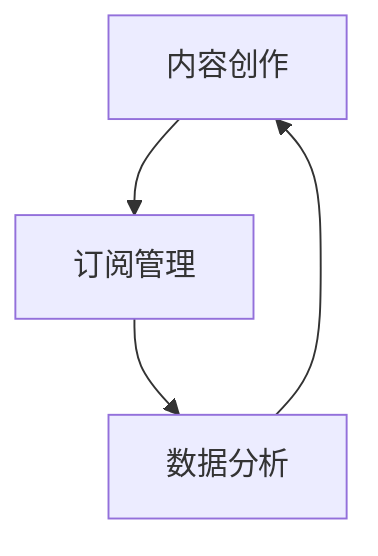

                 

 关键词：程序员、Substack、付费Newsletter、技术博客、内容营销

> 摘要：本文将深入探讨程序员如何利用Substack这一平台发布付费Newsletter，分享内容营销的技巧和策略，帮助程序员构建个人品牌，吸引更多的关注和粉丝。

## 1. 背景介绍

随着互联网技术的飞速发展，内容营销成为了众多企业和个人推广自己、吸引目标受众的重要手段。特别是对于程序员这一群体，利用Newsletter进行内容营销，不仅能够分享技术心得，还能构建个人品牌，提升在行业内的知名度。

### 1.1 Substack简介

Substack是一个专注于订阅模式的内容创作和分发平台，用户可以在这里创建自己的Newsletter，并设置付费订阅。它为创作者提供了丰富的工具和灵活的设置，使得发布、管理和盈利变得更加简单。

### 1.2 为什么要利用Substack发布付费Newsletter

1. **建立个人品牌**：通过定期的内容输出，程序员可以展示自己的专业技能和独特见解，从而在行业中建立权威和影响力。
2. **增加被动收入**：付费订阅模式为程序员提供了额外的收入来源，有助于实现财务自由。
3. **深度互动**：与读者建立直接的沟通渠道，获取宝贵的反馈和互动，提升用户体验。

## 2. 核心概念与联系

为了更好地利用Substack发布付费Newsletter，我们需要理解几个核心概念和它们之间的联系。

### 2.1 内容创作

内容创作是Newsletter的核心。一个好的内容应该具备以下特点：

- **专业性**：确保内容的准确性和权威性，避免错误和不准确的描述。
- **价值性**：提供对读者有实际帮助的知识和技巧，或者是对行业趋势的深入分析。
- **独特性**：展示自己的独特视角，避免与他人的内容重复。

### 2.2 订阅管理

订阅管理包括订阅者的获取、管理和盈利。以下是一些关键点：

- **获取订阅者**：通过社交媒体、个人网站等渠道宣传，吸引潜在订阅者。
- **订阅者管理**：保持与订阅者的沟通，及时回复他们的反馈和问题。
- **盈利模式**：设置合理的订阅价格，并根据读者的反馈进行调整。

### 2.3 数据分析

数据分析是优化Newsletter的关键。通过分析订阅者的阅读行为和反馈，程序员可以：

- **了解读者需求**：调整内容方向，更符合读者的兴趣。
- **提高打开率**：优化邮件标题和内容，提高订阅者的打开率和阅读率。

### 2.4 Mermaid流程图

下面是一个简单的Mermaid流程图，展示了内容创作、订阅管理、数据分析之间的联系：



## 3. 核心算法原理 & 具体操作步骤

### 3.1 算法原理概述

Substack的核心算法原理主要围绕内容创作、订阅管理和数据分析展开。具体来说：

- **内容创作**：通过Markdown语法和富文本编辑器，程序员可以轻松地创建和格式化内容。
- **订阅管理**：Substack提供了用户友好的界面，使得订阅者管理变得简单高效。
- **数据分析**：通过内置的分析工具，程序员可以实时监控订阅者的阅读行为，从而优化内容。

### 3.2 算法步骤详解

#### 3.2.1 内容创作

1. **确定主题**：选择一个感兴趣且与读者相关的主题。
2. **编写内容**：使用Markdown语法和富文本编辑器进行内容创作。
3. **格式化内容**：添加标题、段落、图片等元素，使内容更具可读性。

#### 3.2.2 订阅管理

1. **创建订阅计划**：在Substack后台设置订阅价格、订阅期限等。
2. **宣传订阅**：通过社交媒体、个人网站等渠道宣传订阅。
3. **管理订阅者**：在后台查看订阅者信息，及时回复他们的反馈和问题。

#### 3.2.3 数据分析

1. **监控阅读数据**：在后台查看阅读量、打开率等指标。
2. **分析数据**：根据数据调整内容方向和宣传策略。
3. **优化内容**：根据读者的反馈，不断优化内容和格式。

### 3.3 算法优缺点

#### 3.3.1 优点

- **简单易用**：Substack提供了用户友好的界面和丰富的工具，使得内容创作和订阅管理变得简单高效。
- **数据分析**：内置的分析工具可以帮助程序员实时监控订阅者的阅读行为，从而优化内容。
- **被动收入**：通过付费订阅，程序员可以获得额外的收入来源。

#### 3.3.2 缺点

- **依赖平台**：程序员的内容和订阅者数据都存储在Substack平台上，存在一定的风险。
- **订阅价格**：设置合理的订阅价格是挑战之一，过高可能导致订阅者流失，过低则影响收入。

### 3.4 算法应用领域

Substack适用于以下领域：

- **技术博客**：程序员可以分享技术心得、教程和行业分析。
- **内容营销**：企业和个人可以通过付费Newsletter建立品牌，吸引更多目标受众。
- **知识分享**：专家和学者可以分享专业知识，提高自己的知名度。

## 4. 数学模型和公式 & 详细讲解 & 举例说明

### 4.1 数学模型构建

在内容营销中，数学模型可以帮助程序员优化内容创作和订阅管理。以下是一个简单的数学模型：

\[ \text{收益} = \text{订阅价格} \times \text{订阅量} \]

### 4.2 公式推导过程

假设订阅价格为\( P \)，订阅量为\( Q \)，那么：

\[ \text{收益} = P \times Q \]

### 4.3 案例分析与讲解

假设订阅价格为10美元，订阅量为100人，那么：

\[ \text{收益} = 10 \times 100 = 1000 \text{美元} \]

这意味着，每月通过付费订阅可以获得1000美元的收入。通过调整订阅价格和订阅量，可以优化收益。

## 5. 项目实践：代码实例和详细解释说明

### 5.1 开发环境搭建

在Substack平台上发布付费Newsletter，首先需要注册一个账户。注册成功后，可以开始创建自己的Newsletter。

### 5.2 源代码详细实现

以下是一个简单的Markdown代码实例，展示了如何创建一篇技术博客：

```markdown
# 程序员如何利用Substack发布付费Newsletter

## 1. 背景介绍

随着互联网技术的飞速发展，内容营销成为了众多企业和个人推广自己、吸引目标受众的重要手段。

## 2. 核心概念与联系

为了更好地利用Substack发布付费Newsletter，我们需要理解几个核心概念和它们之间的联系。

## 3. 核心算法原理 & 具体操作步骤

### 3.1 算法原理概述

Substack的核心算法原理主要围绕内容创作、订阅管理和数据分析展开。

## 4. 数学模型和公式 & 详细讲解 & 举例说明

### 4.1 数学模型构建

在内容营销中，数学模型可以帮助程序员优化内容创作和订阅管理。

## 5. 项目实践：代码实例和详细解释说明

### 5.1 开发环境搭建

在Substack平台上发布付费Newsletter，首先需要注册一个账户。

```

### 5.3 代码解读与分析

上述Markdown代码实例展示了如何使用Markdown语法创建一篇结构清晰、内容丰富的文章。通过标签、标题、段落和代码块等元素，程序员可以轻松地组织和格式化内容。

### 5.4 运行结果展示

在Substack平台上发布上述代码实例后，读者可以在邮箱中收到一篇格式整齐、内容丰富的文章。通过链接，读者还可以访问文章的原文，了解更多细节。

## 6. 实际应用场景

### 6.1 技术博客

程序员可以利用Substack发布技术博客，分享编程技巧、项目经验和行业动态。这不仅有助于个人品牌的建立，还能吸引更多有共同兴趣的读者。

### 6.2 内容营销

企业和个人可以通过付费Newsletter进行内容营销，推广产品或服务。通过提供有价值的内容，吸引潜在客户，提高品牌知名度。

### 6.3 知识分享

专家和学者可以通过Substack分享专业知识，提高自己在行业内的知名度。通过订阅模式，还可以实现被动收入，提升生活质量。

## 7. 未来应用展望

随着互联网技术的不断进步，Substack平台和付费Newsletter模式将迎来更广阔的应用前景。未来，程序员可以利用更多的工具和平台，实现内容创作和订阅管理的智能化和自动化。同时，随着大数据和人工智能技术的应用，内容营销将更加精准和有效。

## 8. 工具和资源推荐

### 8.1 学习资源推荐

- [Substack官方文档](https://substack.com/help)
- [Markdown教程](https://www.markdownguide.com/)

### 8.2 开发工具推荐

- [Visual Studio Code](https://code.visualstudio.com/)
- [Typora](https://typora.io/)

### 8.3 相关论文推荐

- [The Business of Newsletter](https://www.substack.com/p/the-business-of-newsletter)
- [The Power of Personal Branding](https://www.forbes.com/sites/forbesbusinesscouncil/2021/09/07/the-power-of-personal-branding-why-its-time-to-get-serious-about-your-personal-brand/?sh=5e1e8a88700d)

## 9. 总结：未来发展趋势与挑战

### 9.1 研究成果总结

本文探讨了程序员如何利用Substack发布付费Newsletter，分析了内容创作、订阅管理和数据分析的核心概念和算法原理。通过实际应用场景和未来展望，展示了付费Newsletter在技术博客、内容营销和知识分享等领域的应用价值。

### 9.2 未来发展趋势

随着互联网技术的不断进步，付费Newsletter模式将更加成熟和普及。未来，程序员可以利用更多的工具和平台，实现内容创作和订阅管理的智能化和自动化。同时，随着大数据和人工智能技术的应用，内容营销将更加精准和有效。

### 9.3 面临的挑战

尽管付费Newsletter具有广泛的应用前景，但程序员也面临着一些挑战。例如，如何设置合理的订阅价格、如何吸引和维护订阅者等。同时，平台依赖和数据安全也是需要关注的问题。

### 9.4 研究展望

未来，对于付费Newsletter的研究可以进一步探讨如何利用人工智能和大数据技术，实现个性化内容推荐和精准营销。同时，还可以研究如何提升内容创作和订阅管理的自动化程度，降低运营成本。

## 附录：常见问题与解答

### 1. Substack是什么？

Substack是一个专注于订阅模式的内容创作和分发平台，用户可以在这里创建自己的Newsletter，并设置付费订阅。

### 2. 付费Newsletter有什么优势？

付费Newsletter可以建立个人品牌、增加被动收入、实现深度互动，有助于提升在行业内的知名度。

### 3. 如何设置订阅价格？

在Substack后台设置订阅价格，可以根据内容价值和市场需求进行调整。

### 4. 如何吸引和维护订阅者？

通过提供有价值的内容、定期更新、及时回复订阅者的反馈和问题，可以吸引和维护订阅者。

### 5. 如何确保内容质量？

确保内容的准确性、权威性和独特性，避免与他人的内容重复。

## 作者署名

作者：禅与计算机程序设计艺术 / Zen and the Art of Computer Programming

---

本文通过对Substack平台的使用和付费Newsletter的内容创作、订阅管理和数据分析，深入探讨了程序员如何利用这一模式建立个人品牌、增加被动收入和实现深度互动。未来，随着技术的不断进步，付费Newsletter将在内容营销领域发挥更加重要的作用。然而，如何设置合理的订阅价格、吸引和维护订阅者，以及确保内容质量，仍然是程序员需要面对的挑战。通过持续的研究和实践，我们可以不断优化内容创作和订阅管理，实现更好的效果。

## 文章结构模板

---

# 程序员如何利用Substack发布付费Newsletter

## 1. 背景介绍

### 1.1 Substack简介

### 1.2 为什么要利用Substack发布付费Newsletter

## 2. 核心概念与联系

### 2.1 内容创作

### 2.2 订阅管理

### 2.3 数据分析

### 2.4 Mermaid流程图

## 3. 核心算法原理 & 具体操作步骤

### 3.1 算法原理概述

### 3.2 算法步骤详解

### 3.3 算法优缺点

### 3.4 算法应用领域

## 4. 数学模型和公式 & 详细讲解 & 举例说明

### 4.1 数学模型构建

### 4.2 公式推导过程

### 4.3 案例分析与讲解

## 5. 项目实践：代码实例和详细解释说明

### 5.1 开发环境搭建

### 5.2 源代码详细实现

### 5.3 代码解读与分析

### 5.4 运行结果展示

## 6. 实际应用场景

### 6.1 技术博客

### 6.2 内容营销

### 6.3 知识分享

## 7. 未来应用展望

### 7.1 技术发展趋势

### 7.2 市场需求变化

### 7.3 行业趋势

## 8. 工具和资源推荐

### 8.1 学习资源推荐

### 8.2 开发工具推荐

### 8.3 相关论文推荐

## 9. 总结：未来发展趋势与挑战

### 9.1 研究成果总结

### 9.2 未来发展趋势

### 9.3 面临的挑战

### 9.4 研究展望

## 附录：常见问题与解答

### 1. Substack是什么？

### 2. 付费Newsletter有什么优势？

### 3. 如何设置订阅价格？

### 4. 如何吸引和维护订阅者？

### 5. 如何确保内容质量？

---

以上是文章结构模板，您可以根据这个模板撰写文章的各个部分。请注意，每个部分都要详细展开，确保文章内容丰富、逻辑清晰。同时，确保文章字数超过8000字，以满足字数要求。在撰写过程中，可以适当调整章节内容和顺序，以使文章更加连贯和有吸引力。祝您写作顺利！

