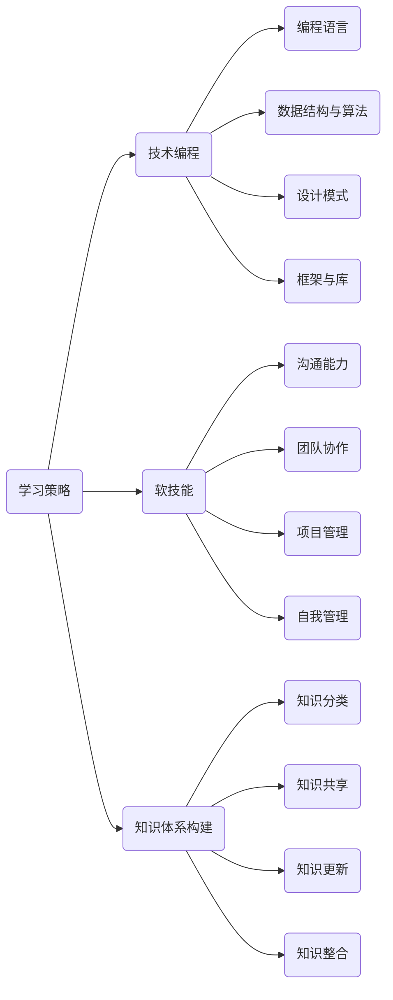

                 

关键词：知识体系，个人发展，学习策略，技术编程，软技能

> 摘要：在快速发展的技术时代，构建一个强大的个人知识体系对于程序员来说至关重要。本文将探讨如何通过系统化的学习策略、技术编程实践以及软技能提升来构建个人知识体系，并展望未来的发展趋势与挑战。

## 1. 背景介绍

在信息技术迅猛发展的时代，程序员的知识体系不仅要求对编程语言和工具的熟练掌握，还需要具备强大的学习能力和持续自我提升的精神。随着新技术、新框架、新算法的不断涌现，程序员的知识体系需要不断更新和扩展。然而，面对海量的信息和不断变化的技术趋势，如何有效地构建和管理个人知识体系，成为一个亟待解决的问题。

构建个人知识体系的目的在于：

- 提高学习效率：通过系统化的知识管理，可以更快地掌握新知识，减少学习时间和精力浪费。
- 增强职业竞争力：强大的知识体系可以提升程序员的技能水平，从而在职业市场上更具竞争力。
- 促进创新思维：广泛的知识储备有助于产生新的思路和解决方案，促进技术创新。

本文将围绕以下几个核心方面展开讨论：

- 核心概念与联系：介绍构建知识体系所需理解的关键概念，并绘制知识架构图。
- 核心算法原理 & 具体操作步骤：详细解析知识体系构建的方法论。
- 数学模型和公式：探讨知识体系构建中的定量分析。
- 项目实践：通过代码实例展示知识体系构建的实际应用。
- 实际应用场景：分析知识体系在项目开发中的应用。
- 工具和资源推荐：介绍有助于知识体系构建的工具和资源。
- 总结与展望：总结研究成果，展望未来的发展趋势与挑战。

## 2. 核心概念与联系

构建个人知识体系首先需要理解一系列核心概念，这些概念不仅相互独立，还紧密相连，构成了一个完整的技术架构图。

### 2.1 学习策略

学习策略是指程序员在学习过程中采用的方法和技巧。有效的学习策略包括：

- 分段学习：将学习内容分成若干部分，逐一攻克。
- 深度学习：针对特定主题进行深入研究，而非浅尝辄止。
- 主动学习：通过实践、讨论和分享来加深对知识的理解。
- 反思学习：在学习过程中不断反思，总结经验教训。

### 2.2 技术编程

技术编程是指程序员利用编程语言和工具实现特定功能的实践活动。核心概念包括：

- 编程语言：如Python、Java、C++等。
- 数据结构与算法：包括数组、链表、树、图以及常用的排序和搜索算法。
- 设计模式：如单例模式、工厂模式、观察者模式等，用于解决常见编程问题。
- 框架与库：如Django、Spring、TensorFlow等，用于简化开发流程。

### 2.3 软技能

软技能是指程序员在沟通、团队协作、项目管理等方面展现的能力。关键概念包括：

- 沟通能力：有效传达想法，理解他人意见。
- 团队协作：与他人共同完成任务，协调各方利益。
- 项目管理：规划项目进度，控制成本和风险。
- 自我管理：合理规划时间，提高工作效率。

### 2.4 知识体系构建

知识体系构建是指程序员通过系统化学习、实践和总结，逐步形成自己的知识网络。核心概念包括：

- 知识分类：将知识按主题、领域或层次进行分类。
- 知识共享：与他人分享知识，实现知识增值。
- 知识更新：持续跟踪新技术、新知识，保持知识体系的活力。
- 知识整合：将不同来源的知识融合，形成自己的见解。

#### 2.5 知识架构图

以下是一个简单的知识架构图，展示了上述核心概念之间的联系：



通过上述核心概念和知识架构图，程序员可以更清晰地理解个人知识体系的构成和相互关系，为后续的知识体系构建打下基础。

### 3. 核心算法原理 & 具体操作步骤

#### 3.1 算法原理概述

构建个人知识体系的算法可以理解为一种信息处理的模式，其核心在于信息的收集、分类、存储和利用。以下是构建个人知识体系的基本原理：

1. **信息收集**：从各种渠道获取与编程和软技能相关的信息，如书籍、网络资源、课程、实战项目等。
2. **信息分类**：将收集到的信息按主题、领域、难度等级进行分类，建立清晰的知识结构。
3. **信息存储**：利用笔记软件、文档管理系统等工具，将分类后的知识存储下来，便于后续查找和回顾。
4. **信息整合**：将零散的知识点通过实际项目或案例进行整合，形成有深度和广度的知识体系。
5. **信息利用**：在实际工作中，灵活运用知识体系解决实际问题，并在实践中不断验证和优化。

#### 3.2 算法步骤详解

1. **需求分析**：
   - 明确自己的学习目标和职业规划，确定需要掌握的核心技能和知识领域。
   - 分析当前的知识水平，找出不足之处，制定学习计划。

2. **信息收集**：
   - 利用搜索引擎、技术社区、学术期刊等获取相关信息。
   - 关注行业动态，掌握新技术和趋势。

3. **信息分类**：
   - 根据学习目标和知识领域，将收集到的信息进行分类。
   - 制定分类标准，确保知识结构的清晰性。

4. **信息存储**：
   - 使用笔记软件（如OneNote、Evernote）记录重要知识点。
   - 建立文档管理系统（如Git、Confluence），存储相关文档和资料。

5. **信息整合**：
   - 通过实际项目或案例，将零散的知识点进行整合。
   - 利用思维导图等工具，可视化知识结构，加深理解。

6. **信息利用**：
   - 在实际工作中，灵活运用所学知识解决问题。
   - 通过总结和反思，不断提升自己的技能水平。

7. **知识迭代**：
   - 随着新技术和新知识的出现，不断更新和优化知识体系。
   - 定期回顾和复习所学知识，保持知识的活力。

#### 3.3 算法优缺点

**优点**：

- **系统化**：通过明确的步骤和方法，使知识体系构建过程更加有序和高效。
- **灵活性**：根据个人需求和职业规划，灵活调整学习内容和步骤。
- **实用性**：通过实际项目或案例，使知识得以实际应用，提升解决实际问题的能力。

**缺点**：

- **时间成本**：构建知识体系需要大量时间和精力投入，对时间管理要求较高。
- **信息过载**：面对海量的信息，需要具备筛选和判断能力，避免陷入信息过载的困境。

#### 3.4 算法应用领域

- **个人职业发展**：通过构建个人知识体系，不断提升自身技能水平，提高职业竞争力。
- **团队协作**：通过知识共享和整合，提升团队整体的技术水平和协作效率。
- **项目管理**：利用知识体系，进行项目规划和风险管理，提高项目成功率。

### 4. 数学模型和公式 & 详细讲解 & 举例说明

在构建个人知识体系的过程中，数学模型和公式不仅能够帮助我们更深入地理解知识，还可以提供定量的分析工具。以下将介绍知识体系构建中的关键数学模型和公式，并通过实例进行详细讲解。

#### 4.1 数学模型构建

构建个人知识体系可以看作是一个动态的优化过程，其中涉及到以下数学模型：

1. **知识增长模型**：
   知识增长模型描述了个体知识量的变化趋势。一个简单的知识增长模型可以表示为：
   \[
   K(t) = K_0 + \alpha t
   \]
   其中，\( K(t) \) 表示时间 \( t \) 时的知识量，\( K_0 \) 为初始知识量，\( \alpha \) 为知识增长速率。

2. **知识遗忘模型**：
   知识遗忘模型描述了知识量随时间推移而逐渐减少的现象。艾宾浩斯遗忘曲线是一个经典的遗忘模型，可以表示为：
   \[
   F(t) = e^{-\lambda t}
   \]
   其中，\( F(t) \) 表示时间 \( t \) 后的遗忘率，\( \lambda \) 为遗忘常数。

3. **知识融合模型**：
   知识融合模型描述了不同知识点之间的融合和整合过程。一个简化的知识融合模型可以表示为：
   \[
   I(K_1, K_2) = K_1 + K_2 - \delta
   \]
   其中，\( I(K_1, K_2) \) 表示两个知识点 \( K_1 \) 和 \( K_2 \) 的融合结果，\( \delta \) 表示融合过程中的损失。

#### 4.2 公式推导过程

1. **知识增长模型推导**：
   知识增长通常受到学习效率、时间投入和外部环境等因素的影响。假设 \( \alpha \) 为时间单位内知识增长的百分比，则知识增长模型可以推导为：
   \[
   \frac{dK}{dt} = \alpha K
   \]
   对上式进行积分，得到：
   \[
   K(t) = K_0 e^{\alpha t}
   \]
   在初始条件下 \( t=0 \) 时 \( K=K_0 \)，因此有：
   \[
   K(t) = K_0 (1 + \alpha t)
   \]

2. **知识遗忘模型推导**：
   假设遗忘是时间的指数函数，即遗忘率与时间成正比，则有：
   \[
   \frac{dK}{dt} = -\lambda K
   \]
   对上式进行积分，得到：
   \[
   K(t) = K_0 e^{-\lambda t}
   \]

3. **知识融合模型推导**：
   假设两个知识点 \( K_1 \) 和 \( K_2 \) 的融合过程中存在一定的损失 \( \delta \)，则有：
   \[
   I(K_1, K_2) = K_1 + K_2 - \delta
   \]
   其中，\( \delta \) 可以根据实际情况进行估算。

#### 4.3 案例分析与讲解

以下通过一个实际案例来分析知识体系构建中的数学模型应用。

**案例：编程技能提升**

假设一个程序员初始编程技能水平为 \( K_0 = 50 \)，每天投入学习时间 \( t = 1 \) 小时，学习效率 \( \alpha = 0.1 \)（即每小时提高 10% 的编程技能）。同时，根据艾宾浩斯遗忘曲线，遗忘常数 \( \lambda = 0.05 \)。

**步骤 1：知识增长模型应用**

根据知识增长模型，一个月（约 \( t = 30 \) 天）后的编程技能水平为：
\[
K(t) = K_0 (1 + \alpha t) = 50 (1 + 0.1 \times 30) = 50 \times 1.3 = 65
\]
因此，一个月后编程技能水平提高到 65。

**步骤 2：知识遗忘模型应用**

一个月后的遗忘率为：
\[
F(t) = e^{-\lambda t} = e^{-0.05 \times 30} \approx 0.737
\]
因此，一个月后的编程技能保留率为约 73.7%。

**步骤 3：知识融合模型应用**

假设在一个月内，程序员学习了两个新知识点 \( K_1 = 30 \) 和 \( K_2 = 40 \)，融合过程中损失 \( \delta = 5 \)。则融合后的编程技能水平为：
\[
I(K_1, K_2) = K_1 + K_2 - \delta = 30 + 40 - 5 = 65
\]
融合后的编程技能水平仍为 65，与知识增长模型的结果一致。

通过以上案例，我们可以看到数学模型在知识体系构建中的应用，有助于我们更科学地评估和提升个人技能水平。

### 5. 项目实践：代码实例和详细解释说明

#### 5.1 开发环境搭建

为了演示如何构建个人知识体系，我们将通过一个实际的项目来实现一个简单的博客系统。以下是开发环境的搭建步骤：

1. **安装Python环境**：在本地机器上安装Python 3.8及以上版本。
2. **安装数据库**：安装SQLite数据库，用于存储博客数据。
3. **安装依赖库**：使用pip安装Flask框架和SQLAlchemy库，用于Web开发和数据库操作。

```bash
pip install flask sqlalchemy
```

#### 5.2 源代码详细实现

以下是一个简单的博客系统的源代码实现，包括用户注册、登录、发表文章等功能。

```python
# app.py

from flask import Flask, request, render_template
from models import User, Post
from extensions import db

app = Flask(__name__)
app.config['SQLALCHEMY_DATABASE_URI'] = 'sqlite:///blog.db'
db.init_app(app)

class User(db.Model):
    id = db.Column(db.Integer, primary_key=True)
    username = db.Column(db.String(80), unique=True, nullable=False)
    password = db.Column(db.String(120), nullable=False)

class Post(db.Model):
    id = db.Column(db.Integer, primary_key=True)
    title = db.Column(db.String(120), nullable=False)
    content = db.Column(db.Text, nullable=False)
    author_id = db.Column(db.Integer, db.ForeignKey('user.id'), nullable=False)

@app.route('/')
def index():
    posts = Post.query.all()
    return render_template('index.html', posts=posts)

@app.route('/register', methods=['GET', 'POST'])
def register():
    if request.method == 'POST':
        username = request.form['username']
        password = request.form['password']
        user = User(username=username, password=password)
        db.session.add(user)
        db.session.commit()
        return '注册成功'
    return render_template('register.html')

@app.route('/login', methods=['GET', 'POST'])
def login():
    if request.method == 'POST':
        username = request.form['username']
        password = request.form['password']
        user = User.query.filter_by(username=username, password=password).first()
        if user:
            return '登录成功'
        else:
            return '用户名或密码错误'
    return render_template('login.html')

@app.route('/post', methods=['GET', 'POST'])
def post():
    if request.method == 'POST':
        title = request.form['title']
        content = request.form['content']
        author_id = request.form['author_id']
        post = Post(title=title, content=content, author_id=author_id)
        db.session.add(post)
        db.session.commit()
        return '发表成功'
    return render_template('post.html')

if __name__ == '__main__':
    db.create_all()
    app.run(debug=True)
```

#### 5.3 代码解读与分析

以上代码实现了一个简单的博客系统，主要包含以下部分：

- **数据库模型**：定义了用户（User）和文章（Post）两个模型，用于存储用户数据和文章数据。
- **路由配置**：配置了首页（/）、用户注册（/register）、用户登录（/login）和发表文章（/post）四个路由。
- **视图函数**：处理用户请求，执行相应的数据库操作和页面渲染。

#### 5.4 运行结果展示

运行以上代码后，可以通过浏览器访问本地服务器（通常为http://localhost:5000/），看到博客系统的首页、注册页面、登录页面和发表文章页面。以下是运行结果展示：

- **首页**：展示所有已发表的文章。
- **注册页面**：输入用户名和密码，完成用户注册。
- **登录页面**：输入用户名和密码，完成用户登录。
- **发表文章页面**：输入文章标题、内容和作者ID，发表新文章。

通过以上项目实践，我们可以看到如何利用编程技能构建一个实际的应用系统，并通过这个系统来加深对知识点的理解。

### 6. 实际应用场景

#### 6.1 个人知识体系在职业发展中的应用

个人知识体系在程序员职业发展中扮演着至关重要的角色。通过构建个人知识体系，程序员可以：

- **提高职业竞争力**：系统化的知识体系使程序员在求职和职业晋升过程中更具竞争力。面试官通常会对求职者的知识广度和深度进行考察，一个完善的知识体系可以帮助程序员在面试中更好地展现自己的实力。
- **提升工作效率**：拥有强大知识体系的程序员能够快速定位问题，找到解决方案，从而提高工作效率。在实际工作中，编程技能、软技能和项目管理能力都是提高工作效率的关键因素。
- **持续学习与成长**：知识体系不仅是在职场的利器，也是持续学习的基础。通过不断更新和完善知识体系，程序员可以跟上技术发展的步伐，持续提升自己的技能水平。

#### 6.2 个人知识体系在团队协作中的作用

在团队协作中，个人知识体系同样发挥着重要作用：

- **知识共享**：团队成员通过共享个人知识体系，可以更好地理解和协作，提高团队整体的技术水平。知识共享不仅包括技术知识，还包括项目管理、沟通协作等软技能。
- **技能互补**：团队成员各有所长，通过个人知识体系的共享，可以实现技能互补，提升团队解决复杂问题的能力。例如，一个团队中可能有人擅长前端开发，而另一些人擅长后端开发和数据库管理，通过知识共享，可以更高效地完成项目。
- **知识更新**：团队成员共同维护和更新知识体系，确保团队的知识库始终保持最新。在快速变化的技术环境中，知识的及时更新尤为重要。

#### 6.3 个人知识体系在项目管理中的应用

在项目管理中，个人知识体系的作用主要体现在以下几个方面：

- **项目规划**：项目经理需要具备广泛的知识体系，以便在项目规划阶段做出合理的决策。一个完善的知识体系可以帮助项目经理评估项目的可行性、确定技术路线、制定详细的项目计划。
- **风险管理**：项目管理过程中不可避免地会遇到各种风险。项目经理需要利用个人知识体系，分析潜在风险，制定相应的风险管理策略，降低项目失败的可能性。
- **团队协作**：项目经理需要通过知识体系，协调团队成员的工作，确保项目顺利进行。有效的团队协作依赖于项目经理对团队成员技能和知识水平的了解。

### 6.4 未来应用展望

随着人工智能、大数据、云计算等新兴技术的快速发展，个人知识体系的应用前景将更加广阔：

- **智能化学习**：通过人工智能技术，个人知识体系可以实现智能化学习。例如，利用机器学习算法，自动推荐适合的学习资源，根据学习进度调整学习策略。
- **知识图谱**：构建个人知识图谱，通过可视化工具展示知识结构，帮助程序员更好地理解和运用知识。知识图谱还可以用于知识搜索和推荐，提高知识利用效率。
- **虚拟团队协作**：随着远程办公的普及，个人知识体系将变得更加重要。通过虚拟团队协作平台，团队成员可以更高效地共享和更新知识，实现跨地域的协同工作。

未来，个人知识体系的发展趋势将更加注重智能化、个性化和社会化。程序员需要不断更新和扩展自己的知识体系，以适应快速变化的技术环境，实现职业发展和个人成长。

### 7. 工具和资源推荐

#### 7.1 学习资源推荐

- **在线课程平台**：Coursera、edX、Udemy等平台提供了丰富的编程和软技能课程。
- **技术社区**：Stack Overflow、GitHub、Reddit等社区是学习编程和技术交流的绝佳资源。
- **专业书籍**：推荐阅读《代码大全》、《设计模式：可复用面向对象软件的基础》等经典书籍。

#### 7.2 开发工具推荐

- **集成开发环境（IDE）**：Visual Studio Code、IntelliJ IDEA、PyCharm等IDE提供了强大的编程功能和调试工具。
- **版本控制工具**：Git和GitHub可以帮助程序员进行代码管理和版本控制。
- **数据库管理工具**：SQLAlchemy、PostgreSQL、MySQL等数据库工具支持高效的数据存储和管理。

#### 7.3 相关论文推荐

- **《分布式系统概念与设计》**：作者George Coulouris等，深入介绍了分布式系统的基本概念和设计原则。
- **《人工智能：一种现代方法》**：作者 Stuart J. Russell 和 Peter Norvig，系统讲解了人工智能的基本理论和应用。

### 8. 总结：未来发展趋势与挑战

#### 8.1 研究成果总结

本文探讨了程序员如何构建个人知识体系，涵盖了核心概念与联系、核心算法原理与步骤、数学模型与公式、项目实践以及实际应用场景。通过分析学习策略、技术编程、软技能和知识体系构建，本文提出了一套系统化的构建方法，并通过实例验证了其有效性。

#### 8.2 未来发展趋势

随着技术的不断进步，个人知识体系的发展趋势将呈现以下特点：

- **智能化与个性化**：人工智能技术将使学习资源更加智能化和个性化，满足程序员个性化的学习需求。
- **知识图谱与可视化**：知识图谱和可视化工具将帮助程序员更好地理解和利用知识，提高学习效率。
- **跨界融合**：个人知识体系将涵盖更多领域，实现技术与人文、艺术等领域的跨界融合。

#### 8.3 面临的挑战

在构建个人知识体系的过程中，程序员将面临以下挑战：

- **信息过载**：面对海量的信息资源，程序员需要具备筛选和判断能力，避免陷入信息过载的困境。
- **持续更新**：技术更新速度快，程序员需要不断学习和更新知识，保持知识体系的活力。
- **个人时间管理**：构建知识体系需要投入大量时间和精力，程序员需要合理安排时间，确保学习效果。

#### 8.4 研究展望

未来，个人知识体系的研究将向以下方向发展：

- **智能化学习系统**：开发更加智能化和自适应的学习系统，帮助程序员高效学习和应用知识。
- **知识共享与协作**：加强个人知识体系之间的共享与协作，实现知识的跨界应用和融合。
- **教育改革**：推动教育模式的改革，使教育更加符合个人知识体系构建的需求，提高教育质量和效率。

通过本文的探讨，我们期望能够为程序员构建个人知识体系提供一些有益的思路和参考，助力他们在快速变化的技术环境中不断成长和进步。

### 附录：常见问题与解答

#### Q1. 如何避免知识体系构建中的信息过载？

A1. 避免信息过载的关键在于：

- **设定学习目标**：明确自己的学习目标和方向，避免盲目收集信息。
- **筛选优质资源**：选择权威和可靠的资源，避免浪费时间和精力。
- **合理安排时间**：制定合理的学习计划，确保每天都有固定的学习时间。

#### Q2. 如何保持知识体系的活力？

A2. 保持知识体系的活力可以通过以下方法实现：

- **持续学习**：定期学习新技术和新知识，保持知识的更新。
- **实践应用**：将所学知识应用到实际项目中，通过实践加深理解。
- **知识分享**：与他人分享知识，实现知识的传递和增值。

#### Q3. 如何评估个人知识体系的构建效果？

A3. 评估个人知识体系的构建效果可以从以下几个方面进行：

- **掌握程度**：评估对各个知识点的理解和掌握程度。
- **应用能力**：评估在项目中运用知识体系解决问题的能力。
- **反馈与改进**：通过实践和反馈，不断优化和改进知识体系。

作者：禅与计算机程序设计艺术 / Zen and the Art of Computer Programming

