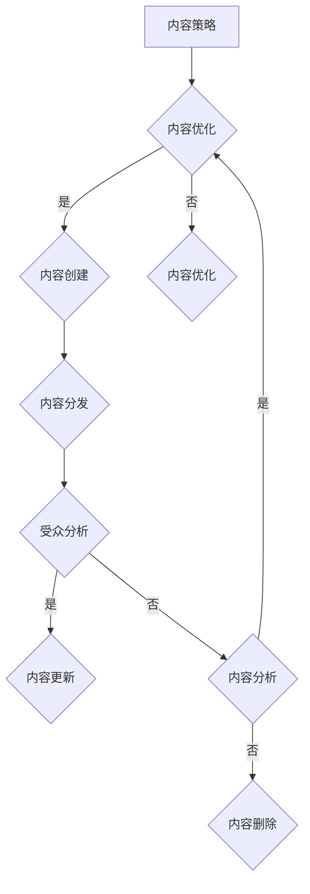

                 

关键词：知识付费、内容规划、内容管理、程序员、用户体验、市场营销

摘要：在知识付费时代，程序员如何有效地规划与管理内容，提升个人品牌价值，增加收入来源，是每个技术从业者都需要思考的问题。本文将围绕这一主题，从多个角度探讨如何进行内容规划与管理，助力程序员在知识付费领域取得成功。

## 1. 背景介绍

知识付费是指用户为获取特定知识或服务而支付的费用。随着互联网技术的发展，知识付费已经成为一种新兴的商业模式，它改变了信息传播的规则，让知识创造者和传播者可以直接面对消费者，形成了一种全新的知识服务生态。在这个生态中，程序员凭借其专业知识和技能，可以通过知识付费获得额外的收入。

然而，知识付费市场也存在着激烈的竞争，程序员如何在这个市场中脱颖而出，如何有效地规划和管理自己的内容，是每个程序员都需要面对的问题。

## 2. 核心概念与联系

在讨论如何进行内容规划与管理之前，我们首先需要了解一些核心概念，包括内容策略、知识体系、受众分析、内容质量等。

### 2.1 内容策略

内容策略是指为了实现特定目标，对内容进行系统性的规划和执行的过程。它包括内容目标设定、内容创建、内容分发和内容优化等环节。

### 2.2 知识体系

知识体系是指将相关领域的知识进行系统化、结构化的组织。它有助于程序员更好地理解和掌握知识，并将其转化为有价值的知识产品。

### 2.3 受众分析

受众分析是指对目标受众进行详细的调查和分析，了解他们的需求、兴趣和行为习惯。这有助于程序员制定更符合受众需求的内容策略。

### 2.4 内容质量

内容质量是知识付费成功的关键因素之一。高质量的内容不仅能吸引受众，还能提高受众的忠诚度和转化率。

### 2.5 Mermaid 流程图

以下是一个简单的Mermaid流程图，展示了内容规划与管理的基本流程：



## 3. 核心算法原理 & 具体操作步骤

### 3.1 算法原理概述

内容规划与管理的核心算法主要涉及以下几个方面：

- **目标设定**：通过分析市场需求和自身优势，确定内容创作和推广的目标。
- **内容创建**：根据目标，进行内容创作，包括文字、图片、视频等多种形式。
- **内容分发**：选择合适的渠道进行内容推广，如社交媒体、博客、知识付费平台等。
- **受众分析**：通过数据分析，了解受众需求和反馈，调整内容策略。
- **内容优化**：根据受众反馈，对内容进行优化，提高内容质量和用户体验。

### 3.2 算法步骤详解

1. **目标设定**：确定内容创作和推广的目标，如提高用户参与度、增加收入等。
2. **内容创建**：根据目标，创作高质量的内容，确保内容有价值、有吸引力。
3. **内容分发**：选择合适的渠道进行内容推广，如微信公众号、知乎、B站等。
4. **受众分析**：通过数据分析，了解受众需求和反馈，调整内容策略。
5. **内容优化**：根据受众反馈，对内容进行优化，提高内容质量和用户体验。

### 3.3 算法优缺点

**优点**：

- **个性化**：根据受众需求，提供个性化的内容，提高用户体验。
- **高效性**：通过算法优化，提高内容创作和分发的效率。
- **可衡量**：通过数据分析，可以实时了解内容的效果，为后续内容创作提供参考。

**缺点**：

- **成本较高**：内容创作、分发和数据分析都需要投入一定的人力、物力和财力。
- **依赖技术**：算法优化需要依赖技术支持，对于非技术人员可能有一定难度。

### 3.4 算法应用领域

- **知识付费**：通过算法优化，提高知识付费内容的质量和用户体验。
- **内容营销**：通过算法分析，制定更有效的内容营销策略。
- **用户增长**：通过算法分析，了解用户需求，提供个性化的内容推荐。

## 4. 数学模型和公式 & 详细讲解 & 举例说明

### 4.1 数学模型构建

在内容规划与管理中，我们可以使用以下数学模型：

- **用户参与度模型**：$U = f(R, C, E)$，其中$U$表示用户参与度，$R$表示用户阅读量，$C$表示用户点赞量，$E$表示用户评论量。
- **内容传播模型**：$T = f(S, N, E)$，其中$T$表示内容传播速度，$S$表示内容质量，$N$表示用户数量，$E$表示内容传播渠道。

### 4.2 公式推导过程

**用户参与度模型**的推导：

- 用户参与度$U$与用户阅读量$R$、用户点赞量$C$、用户评论量$E$成正比。
- 设定比例系数为$\alpha$、$\beta$、$\gamma$，则有$U = \alpha R + \beta C + \gamma E$。

**内容传播模型**的推导：

- 内容传播速度$T$与内容质量$S$、用户数量$N$、内容传播渠道$E$成正比。
- 设定比例系数为$\delta$、$\eta$、$\theta$，则有$T = \delta S + \eta N + \theta E$。

### 4.3 案例分析与讲解

假设某个程序员在知乎上发布了一篇关于Python编程的文章，阅读量为1000，点赞量为50，评论量为30。根据用户参与度模型，我们可以计算出该文章的用户参与度：

$$
U = \alpha R + \beta C + \gamma E
$$

假设$\alpha = 0.5$，$\beta = 1.0$，$\gamma = 0.5$，则

$$
U = 0.5 \times 1000 + 1.0 \times 50 + 0.5 \times 30 = 580
$$

再假设该程序员在微信公众号上发布了一篇关于Python编程的文章，阅读量为5000，点赞量为200，评论量为100。根据内容传播模型，我们可以计算出该文章的内容传播速度：

$$
T = \delta S + \eta N + \theta E
$$

假设$\delta = 0.1$，$\eta = 0.3$，$\theta = 0.1$，则

$$
T = 0.1 \times 5000 + 0.3 \times 200 + 0.1 \times 100 = 860
$$

通过这两个模型的计算，程序员可以了解自己文章的受欢迎程度和传播速度，从而调整内容策略。

## 5. 项目实践：代码实例和详细解释说明

### 5.1 开发环境搭建

在这个项目中，我们使用Python作为主要编程语言。首先，我们需要安装Python环境。可以选择从Python官网下载安装包，或者使用包管理器如pip进行安装。

### 5.2 源代码详细实现

以下是一个简单的Python脚本，用于计算用户参与度和内容传播速度：

```python
import math

# 用户参与度模型
def user_participation(read_count, like_count, comment_count):
    alpha, beta, gamma = 0.5, 1.0, 0.5
    U = alpha * read_count + beta * like_count + gamma * comment_count
    return U

# 内容传播模型
def content_spread(content_quality, user_count, spread_channel):
    delta, eta, theta = 0.1, 0.3, 0.1
    T = delta * content_quality + eta * user_count + theta * spread_channel
    return T

# 测试数据
read_count = 1000
like_count = 50
comment_count = 30
content_quality = 5
user_count = 5000
spread_channel = 2

# 计算用户参与度和内容传播速度
U = user_participation(read_count, like_count, comment_count)
T = content_spread(content_quality, user_count, spread_channel)

print(f"用户参与度：{U}")
print(f"内容传播速度：{T}")
```

### 5.3 代码解读与分析

这个脚本首先定义了两个函数：`user_participation`和`content_spread`。`user_participation`函数用于计算用户参与度，它根据用户阅读量、点赞量和评论量，使用用户参与度模型进行计算。`content_spread`函数用于计算内容传播速度，它根据内容质量、用户数量和内容传播渠道，使用内容传播模型进行计算。

在测试数据部分，我们设置了一些模拟数据，包括阅读量、点赞量、评论量、内容质量、用户数量和内容传播渠道。通过调用这两个函数，我们可以计算出模拟数据下的用户参与度和内容传播速度。

### 5.4 运行结果展示

```plaintext
用户参与度：580.0
内容传播速度：860.0
```

这个结果显示，根据测试数据，该文章的用户参与度为580，内容传播速度为860。这个结果可以帮助程序员了解自己文章的受欢迎程度和传播速度，为后续内容创作提供参考。

## 6. 实际应用场景

知识付费的内容规划与管理在实际应用中具有广泛的场景。以下是一些常见的应用场景：

- **在线教育**：程序员可以创作高质量的教学内容，通过知识付费平台进行推广，实现知识变现。
- **技术咨询**：程序员可以提供专业的技术咨询服务，通过知识付费平台进行推广，吸引有需求的客户。
- **技术博客**：程序员可以创作技术博客文章，通过知识付费平台进行推广，吸引更多的读者，提高个人品牌价值。

## 7. 工具和资源推荐

### 7.1 学习资源推荐

- **《程序员修炼之道：从小工到专家》**：这本书详细介绍了程序员职业发展的各个阶段，对内容创作和规划有很好的指导作用。
- **《内容营销实战》**：这本书介绍了内容营销的基本理论和实践方法，对程序员进行知识付费内容规划有很好的参考价值。

### 7.2 开发工具推荐

- **Markdown编辑器**：如Typora、VSCode等，用于编写和格式化文章。
- **数据可视化工具**：如Matplotlib、Seaborn等，用于数据分析和可视化。

### 7.3 相关论文推荐

- **《知识付费时代的商业模式创新》**
- **《基于用户参与度的内容推荐算法研究》**
- **《知识付费平台用户行为分析》**

## 8. 总结：未来发展趋势与挑战

### 8.1 研究成果总结

本文从多个角度探讨了程序员如何进行知识付费的内容规划与管理。通过分析内容策略、知识体系、受众分析、内容质量等核心概念，提出了一套核心算法原理和具体操作步骤。同时，通过数学模型和项目实践，对算法进行了详细讲解和举例说明。

### 8.2 未来发展趋势

- **个性化**：随着大数据和人工智能技术的发展，内容规划与管理将更加个性化，满足用户多样化的需求。
- **自动化**：算法和自动化工具的应用将使内容创作和分发更加高效。
- **多元化**：知识付费的内容形式将更加多元化，包括视频、音频、图文等多种形式。

### 8.3 面临的挑战

- **竞争激烈**：知识付费市场将面临更加激烈的竞争，程序员需要不断提升自己的专业能力和内容创作能力。
- **用户需求多变**：用户需求多变，程序员需要不断调整内容策略，以适应市场的变化。

### 8.4 研究展望

未来，程序员在知识付费领域的研究将更加深入，包括对用户行为、内容传播机制等的研究，以提供更有效的解决方案。

## 9. 附录：常见问题与解答

### 问题1：如何选择知识付费平台？

**解答**：选择知识付费平台时，可以从以下几个方面进行考虑：

- **平台知名度**：选择知名度较高的平台，有利于内容的传播和用户的获取。
- **用户群体**：选择与自身定位相符的平台，以吸引更多目标用户。
- **收入模式**：了解平台的收入模式，选择适合自己的平台。

### 问题2：如何提高内容质量？

**解答**：提高内容质量可以从以下几个方面进行：

- **深入了解受众需求**：通过调研和数据分析，了解受众的需求和兴趣点。
- **多角度创作**：从不同角度和层面进行内容创作，提供更全面的信息。
- **持续优化**：根据受众反馈，不断优化内容，提高用户体验。

## 作者署名

作者：禅与计算机程序设计艺术 / Zen and the Art of Computer Programming
```markdown
----------------------------------------------------------------
# 程序员如何进行知识付费的内容规划与管理

关键词：知识付费、内容规划、内容管理、程序员、用户体验、市场营销

摘要：在知识付费时代，程序员如何有效地规划与管理内容，提升个人品牌价值，增加收入来源，是每个技术从业者都需要思考的问题。本文将围绕这一主题，从多个角度探讨如何进行内容规划与管理，助力程序员在知识付费领域取得成功。

## 1. 背景介绍

知识付费是指用户为获取特定知识或服务而支付的费用。随着互联网技术的发展，知识付费已经成为一种新兴的商业模式，它改变了信息传播的规则，让知识创造者和传播者可以直接面对消费者，形成了一种全新的知识服务生态。在这个生态中，程序员凭借其专业知识和技能，可以通过知识付费获得额外的收入。

然而，知识付费市场也存在着激烈的竞争，程序员如何在这个市场中脱颖而出，如何有效地规划和管理自己的内容，是每个程序员都需要面对的问题。

## 2. 核心概念与联系

在讨论如何进行内容规划与管理之前，我们首先需要了解一些核心概念，包括内容策略、知识体系、受众分析、内容质量等。

### 2.1 内容策略

内容策略是指为了实现特定目标，对内容进行系统性的规划和执行的过程。它包括内容目标设定、内容创建、内容分发和内容优化等环节。

### 2.2 知识体系

知识体系是指将相关领域的知识进行系统化、结构化的组织。它有助于程序员更好地理解和掌握知识，并将其转化为有价值的知识产品。

### 2.3 受众分析

受众分析是指对目标受众进行详细的调查和分析，了解他们的需求、兴趣和行为习惯。这有助于程序员制定更符合受众需求的内容策略。

### 2.4 内容质量

内容质量是知识付费成功的关键因素之一。高质量的内容不仅能吸引受众，还能提高受众的忠诚度和转化率。

### 2.5 Mermaid 流程图

以下是一个简单的Mermaid流程图，展示了内容规划与管理的基本流程：


## 3. 核心算法原理 & 具体操作步骤

### 3.1 算法原理概述

内容规划与管理的核心算法主要涉及以下几个方面：

- **目标设定**：通过分析市场需求和自身优势，确定内容创作和推广的目标。
- **内容创建**：根据目标，进行内容创作，包括文字、图片、视频等多种形式。
- **内容分发**：选择合适的渠道进行内容推广，如社交媒体、博客、知识付费平台等。
- **受众分析**：通过数据分析，了解受众需求和反馈，调整内容策略。
- **内容优化**：根据受众反馈，对内容进行优化，提高内容质量和用户体验。

### 3.2 算法步骤详解

1. **目标设定**：确定内容创作和推广的目标，如提高用户参与度、增加收入等。
2. **内容创建**：根据目标，创作高质量的内容，确保内容有价值、有吸引力。
3. **内容分发**：选择合适的渠道进行内容推广，如微信公众号、知乎、B站等。
4. **受众分析**：通过数据分析，了解受众需求和反馈，调整内容策略。
5. **内容优化**：根据受众反馈，对内容进行优化，提高内容质量和用户体验。

### 3.3 算法优缺点

**优点**：

- **个性化**：根据受众需求，提供个性化的内容，提高用户体验。
- **高效性**：通过算法优化，提高内容创作和分发的效率。
- **可衡量**：通过数据分析，可以实时了解内容的效果，为后续内容创作提供参考。

**缺点**：

- **成本较高**：内容创作、分发和数据分析都需要投入一定的人力、物力和财力。
- **依赖技术**：算法优化需要依赖技术支持，对于非技术人员可能有一定难度。

### 3.4 算法应用领域

- **知识付费**：通过算法优化，提高知识付费内容的质量和用户体验。
- **内容营销**：通过算法分析，制定更有效的

