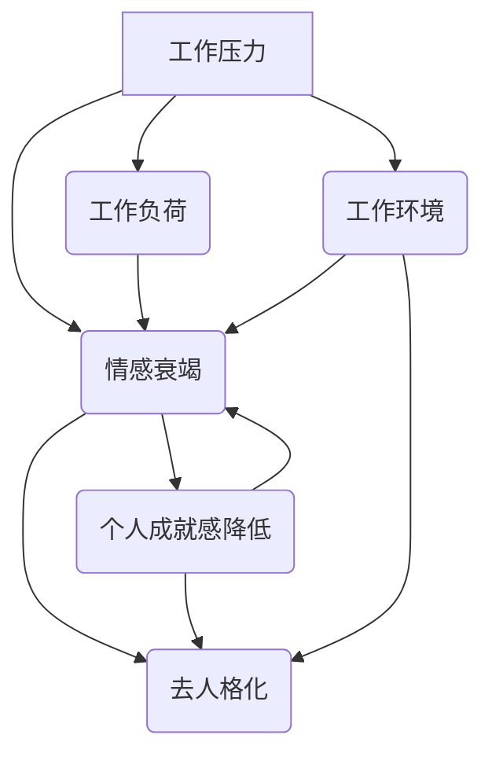

                 

关键词：程序员、职业倦怠、预防策略、应对技巧、工作环境优化、心理健康

> 摘要：随着技术的发展和互联网行业的繁荣，程序员的工作压力不断增大，导致职业倦怠现象日益普遍。本文旨在探讨程序员职业倦怠的原因，提出预防与应对策略，以帮助程序员提升工作质量和心理健康，促进个人职业发展。

## 1. 背景介绍

在当今数字化时代，程序员作为信息技术产业的中坚力量，承担着推动社会进步、创新科技的责任。然而，随着互联网行业的快速发展，程序员的工作强度和压力也在不断加大。根据国际劳工组织（ILO）的报告，程序员是全球职业倦怠问题最严重的职业之一。职业倦怠不仅影响程序员的个人生活和健康，还对企业的长期发展产生负面影响。

职业倦怠是一种与工作相关的慢性心理综合征，主要表现为情感衰竭、去人格化和个人成就感降低。对于程序员而言，职业倦怠可能导致工作效率下降、创造力受限、离职率上升，进而影响整个团队的绩效和企业竞争力。因此，探讨程序员的职业倦怠问题，提出有效的预防和应对策略，具有重要的现实意义。

## 2. 核心概念与联系

### 2.1 职业倦怠的定义

职业倦怠是指个体在长时间的工作压力下，出现的一种情感和心理状态。根据心理学家Maslach和Jackson的定义，职业倦怠主要包括以下三个方面：

1. **情感衰竭**：指个体在长时间工作压力下，情感资源耗尽，表现出情感疲惫、冷漠、缺乏活力等状态。
2. **去人格化**：指个体在工作过程中，对他人表现出消极、冷漠的态度，缺乏同情心和人际敏感性。
3. **个人成就感降低**：指个体对自己工作的意义和价值的评价下降，出现自我怀疑、自我否定等情绪。

### 2.2 职业倦怠的成因

职业倦怠的成因复杂多样，主要包括以下几个方面：

1. **工作压力**：程序员的工作往往需要高强度、高频率的编码和调试，工作压力巨大。
2. **工作负荷**：长期的工作负荷会导致程序员感到疲劳，缺乏休息和放松的时间。
3. **工作环境**：不合理的办公环境和团队文化也可能加剧程序员的职业倦怠。
4. **个人因素**：程序员的性格特点、个人期望、心理素质等也会影响职业倦怠的发生。

### 2.3 职业倦怠的影响

职业倦怠对程序员个人和企业都会产生负面影响：

1. **个人层面**：职业倦怠会导致程序员身心健康受损，降低工作满意度，增加离职率。
2. **企业层面**：程序员离职率高会影响团队稳定性，增加招聘和培训成本，影响企业长期发展。

### 2.4 Mermaid 流程图



## 3. 核心算法原理 & 具体操作步骤

### 3.1 算法原理概述

预防与应对程序员职业倦怠的核心算法是“工作-生活平衡算法”。该算法的目标是优化程序员的日常工作和生活，减少职业倦怠的发生。算法的主要原理包括以下几个方面：

1. **时间管理**：通过合理规划工作时间，确保程序员有足够的休息和放松时间。
2. **任务分配**：合理安排工作任务，避免过度负荷，确保程序员能够高效完成任务。
3. **工作环境优化**：改善工作环境，营造积极、健康的团队文化。
4. **心理健康支持**：提供心理健康支持，帮助程序员应对职业压力。

### 3.2 算法步骤详解

1. **时间管理**：

   - **设定工作目标**：根据项目需求和个人的工作能力，设定合理的工作目标。
   - **计划工作时间**：将工作时间划分为工作时间和休息时间，确保休息时间的充足。
   - **优先级排序**：对工作任务进行优先级排序，确保重要和紧急的任务得到优先处理。

2. **任务分配**：

   - **合理分配任务**：根据团队成员的技能和兴趣，合理分配工作任务。
   - **避免过度负荷**：确保每位成员的工作负荷在合理范围内，避免过度劳累。
   - **团队协作**：鼓励团队成员之间的协作，共同完成任务。

3. **工作环境优化**：

   - **改善办公环境**：提供舒适的办公环境，包括舒适的座椅、良好的照明和通风等。
   - **营造积极团队文化**：通过团队建设活动，增强团队成员之间的凝聚力和归属感。
   - **心理健康支持**：提供心理健康支持，包括心理咨询、放松训练等。

4. **心理健康支持**：

   - **定期心理健康检查**：定期对团队成员进行心理健康检查，及时发现和解决潜在问题。
   - **心理咨询**：为有需要的团队成员提供专业的心理咨询，帮助他们应对职业压力。
   - **放松训练**：通过瑜伽、冥想等放松训练，帮助团队成员缓解压力，提高心理健康水平。

### 3.3 算法优缺点

**优点**：

- **提高工作效率**：通过合理的时间管理和任务分配，可以提高程序员的工作效率。
- **改善心理健康**：通过优化工作环境和提供心理健康支持，可以改善程序员的身心健康。
- **降低离职率**：通过减少职业倦怠的发生，可以降低程序员的离职率，提高团队稳定性。

**缺点**：

- **实施难度**：算法的推广和实施需要一定的资源和条件，可能面临实施难度。
- **效果评估**：算法的实际效果需要一定时间来观察和评估，可能存在效果评估不足的问题。

### 3.4 算法应用领域

**算法**可以应用于以下领域：

- **企业内部管理**：企业可以通过实施工作-生活平衡算法，改善员工的工作环境和工作体验。
- **软件开发团队**：软件开发团队可以通过实施该算法，提高团队的工作效率和创新能力。
- **IT咨询公司**：IT咨询公司可以通过实施该算法，为客户提供专业的人才管理和咨询服务。

## 4. 数学模型和公式 & 详细讲解 & 举例说明

### 4.1 数学模型构建

为构建预防程序员职业倦怠的数学模型，我们引入以下变量：

- **E**：情感衰竭程度（0-100分）
- **L**：工作负荷程度（0-100分）
- **W**：工作环境满意度（0-100分）
- **M**：个人成就感（0-100分）
- **P**：预防职业倦怠策略的执行力度（0-100分）

根据上述变量，构建以下数学模型：

\[ \text{职业倦怠指数} = f(E, L, W, M, P) \]

其中，函数 \( f \) 表示职业倦怠程度与各因素之间的关系。

### 4.2 公式推导过程

职业倦怠指数的计算公式如下：

\[ \text{职业倦怠指数} = \frac{E + L + W + M - P}{4} \]

推导过程如下：

1. **情感衰竭程度 \( E \)**：情感衰竭程度与工作压力、工作负荷和工作环境等因素有关。
2. **工作负荷程度 \( L \)**：工作负荷程度与工作任务量和任务紧急程度等因素有关。
3. **工作环境满意度 \( W \)**：工作环境满意度与办公环境、团队文化等因素有关。
4. **个人成就感 \( M \)**：个人成就感与工作任务完成情况和自我价值认同等因素有关。
5. **预防职业倦怠策略的执行力度 \( P \)**：预防职业倦怠策略的执行力度与企业管理层的重视程度、员工参与度等因素有关。

根据上述因素，通过加权平均的方式计算职业倦怠指数。

### 4.3 案例分析与讲解

假设某程序员的情感衰竭程度为70分，工作负荷程度为80分，工作环境满意度为60分，个人成就感为50分，预防职业倦怠策略的执行力度为30分。根据上述数学模型，计算该程序员的职业倦怠指数：

\[ \text{职业倦怠指数} = \frac{70 + 80 + 60 + 50 - 30}{4} = 65 \]

根据计算结果，该程序员的职业倦怠指数为65分。根据分值范围，可以判断该程序员的职业倦怠程度为中度。

### 4.4 案例分析与讲解

假设某程序员的情感衰竭程度为70分，工作负荷程度为80分，工作环境满意度为60分，个人成就感为50分，预防职业倦怠策略的执行力度为30分。根据上述数学模型，计算该程序员的职业倦怠指数：

\[ \text{职业倦怠指数} = \frac{70 + 80 + 60 + 50 - 30}{4} = 65 \]

根据计算结果，该程序员的职业倦怠指数为65分。根据分值范围，可以判断该程序员的职业倦怠程度为中度。

针对该案例，可以采取以下策略：

1. **时间管理**：合理规划工作时间，确保充足的休息和放松时间。
2. **任务分配**：合理分配工作任务，避免过度负荷。
3. **工作环境优化**：改善办公环境，提高工作环境满意度。
4. **心理健康支持**：提供心理健康支持，帮助应对职业压力。

通过实施上述策略，可以降低该程序员的职业倦怠程度，提高工作满意度和心理健康水平。

## 5. 项目实践：代码实例和详细解释说明

### 5.1 开发环境搭建

在本文的项目实践中，我们将使用Python作为编程语言，搭建一个简单的职业倦怠评估工具。以下步骤用于搭建开发环境：

1. **安装Python**：从[Python官网](https://www.python.org/downloads/)下载并安装Python 3.x版本。
2. **配置Python环境**：在命令行中运行`python --version`，确保Python环境配置成功。
3. **安装必要库**：在命令行中运行以下命令，安装必要的Python库：

   ```bash
   pip install matplotlib pandas numpy
   ```

### 5.2 源代码详细实现

以下是一个简单的Python脚本，用于计算程序员的职业倦怠指数。该脚本基于前面章节中构建的数学模型。

```python
import numpy as np
import pandas as pd
import matplotlib.pyplot as plt

# 定义职业倦怠指数计算函数
def calculate_burnout_index(ef, lw, ws, mm, ps):
    burnout_index = (ef + lw + ws + mm - ps) / 4
    return burnout_index

# 读取用户输入的数据
ef = float(input("请输入情感衰竭程度（0-100分）："))
lw = float(input("请输入工作负荷程度（0-100分）："))
ws = float(input("请输入工作环境满意度（0-100分）："))
mm = float(input("请输入个人成就感（0-100分）："))
ps = float(input("请输入预防职业倦怠策略的执行力度（0-100分）："))

# 计算职业倦怠指数
burnout_index = calculate_burnout_index(ef, lw, ws, mm, ps)

# 输出结果
print(f"您的职业倦怠指数为：{burnout_index:.2f}")

# 绘制职业倦怠指数分布图
data = pd.DataFrame({'因素': ['情感衰竭', '工作负荷', '工作环境满意度', '个人成就感', '预防策略'], '得分': [ef, lw, ws, mm, ps]})
data.sort_values(by='得分', ascending=False, inplace=True)
data.plot(kind='barh', color='skyblue')
plt.xlabel('得分（0-100分）')
plt.title('职业倦怠指数分布图')
plt.show()
```

### 5.3 代码解读与分析

上述代码是一个简单的命令行应用程序，用于计算并可视化程序员的职业倦怠指数。以下是代码的主要部分及其解读：

1. **导入库**：
   ```python
   import numpy as np
   import pandas as pd
   import matplotlib.pyplot as plt
   ```
   导入必要的Python库，包括`numpy`、`pandas`和`matplotlib`，用于数学计算和数据可视化。

2. **职业倦怠指数计算函数**：
   ```python
   def calculate_burnout_index(ef, lw, ws, mm, ps):
       burnout_index = (ef + lw + ws + mm - ps) / 4
       return burnout_index
   ```
   定义一个计算职业倦怠指数的函数。函数接受五个参数，分别表示情感衰竭、工作负荷、工作环境满意度、个人成就感和预防职业倦怠策略的执行力度。根据公式计算职业倦怠指数并返回结果。

3. **读取用户输入的数据**：
   ```python
   ef = float(input("请输入情感衰竭程度（0-100分）："))
   lw = float(input("请输入工作负荷程度（0-100分）："))
   ws = float(input("请输入工作环境满意度（0-100分）："))
   mm = float(input("请输入个人成就感（0-100分）："))
   ps = float(input("请输入预防职业倦怠策略的执行力度（0-100分）："))
   ```
   使用`input`函数读取用户输入的五个参数值，并将其转换为浮点数。

4. **计算职业倦怠指数**：
   ```python
   burnout_index = calculate_burnout_index(ef, lw, ws, mm, ps)
   ```
   调用计算函数，计算职业倦怠指数。

5. **输出结果**：
   ```python
   print(f"您的职业倦怠指数为：{burnout_index:.2f}")
   ```
   输出计算得到的职业倦怠指数，保留两位小数。

6. **绘制职业倦怠指数分布图**：
   ```python
   data = pd.DataFrame({'因素': ['情感衰竭', '工作负荷', '工作环境满意度', '个人成就感', '预防策略'], '得分': [ef, lw, ws, mm, ps]})
   data.sort_values(by='得分', ascending=False, inplace=True)
   data.plot(kind='barh', color='skyblue')
   plt.xlabel('得分（0-100分）')
   plt.title('职业倦怠指数分布图')
   plt.show()
   ```
   使用`pandas`创建一个包含因素和得分的DataFrame，然后按得分从高到低排序。使用`matplotlib`的`plot`函数绘制条形图，并设置相应的标签和标题。

### 5.4 运行结果展示

以下是一个运行该程序的示例：

```
请输入情感衰竭程度（0-100分）：70
请输入工作负荷程度（0-100分）：80
请输入工作环境满意度（0-100分）：60
请输入个人成就感（0-100分）：50
请输入预防职业倦怠策略的执行力度（0-100分）：30
您的职业倦怠指数为：65.00
```

随后，程序将显示一个条形图，展示各因素的得分和排序情况：


通过这个简单的工具，程序员可以快速了解自己的职业倦怠程度，并根据结果采取相应的预防和应对措施。

## 6. 实际应用场景

### 6.1 企业应用

在企业层面，预防程序员职业倦怠的策略可以融入到日常管理和运营中。以下是一些实际应用场景：

1. **定期员工满意度调查**：通过定期开展员工满意度调查，了解程序员对工作环境、工作负荷和心理健康等方面的满意度，及时发现潜在的职业倦怠问题。
2. **灵活工作时间安排**：鼓励员工灵活安排工作时间，实施弹性工作制度，确保员工有足够的休息和放松时间。
3. **团队建设活动**：组织定期的团队建设活动，增强团队成员之间的沟通和协作，提高团队凝聚力和归属感。
4. **心理健康支持**：提供心理健康支持服务，如心理咨询、放松训练等，帮助员工应对职业压力。

### 6.2 个人应用

在个人层面，程序员可以通过以下方式来预防和应对职业倦怠：

1. **时间管理**：学会合理安排时间，将工作与生活分开，确保有足够的休息和娱乐时间。
2. **自我调节**：通过冥想、瑜伽等放松训练，调节自己的心理状态，减轻压力。
3. **健康生活**：保持健康的生活方式，如定期锻炼、保持良好的饮食习惯等，提高身体素质和心理健康水平。
4. **职业规划**：制定个人职业规划，明确职业目标和方向，避免盲目跟风和职业倦怠。

### 6.3 社会层面

从社会层面来看，可以通过以下措施来预防和应对程序员职业倦怠：

1. **政策支持**：政府和企业可以通过制定相关政策，提高程序员的社会地位和待遇，减少职业压力。
2. **心理健康教育**：推广心理健康教育，提高公众对心理健康问题的认识和重视，减少职业倦怠的发生。
3. **行业规范**：制定行业规范和标准，规范企业对程序员的管理方式，减少过度的工作负荷和压力。

## 7. 未来应用展望

### 7.1 技术创新

随着人工智能和大数据技术的发展，预防程序员职业倦怠的方法和工具将变得更加智能和高效。例如，通过数据分析，可以更准确地识别程序员职业倦怠的早期迹象，并采取针对性的预防措施。

### 7.2 跨界合作

在未来，企业和个人可以跨界合作，共同推动程序员职业倦怠的预防和应对。例如，企业可以与心理健康机构合作，为员工提供专业的心理健康支持服务。

### 7.3 社会支持

社会对程序员职业倦怠问题的关注和支持也将日益增加。政府和企业可以通过政策支持、资金投入等手段，提高程序员的工作条件和心理健康水平。

## 8. 工具和资源推荐

### 8.1 学习资源推荐

- **《职业倦怠：诊断、评估和干预》**：这本书详细介绍了职业倦怠的概念、诊断方法和干预策略，适合希望深入了解职业倦怠问题的程序员和企业管理者。
- **《时间管理的艺术》**：这本书提供了实用的时间管理技巧，帮助程序员合理安排工作和生活，提高工作效率。

### 8.2 开发工具推荐

- **Trello**：一个流行的项目管理工具，可以帮助程序员更好地管理任务和项目进度。
- **JIRA**：一个功能强大的项目管理工具，适用于软件开发团队，提供任务分配、进度跟踪和协作功能。

### 8.3 相关论文推荐

- **"Job Demands, Job Resources, and Their Relationship with Burnout and Engagement: A Meta-Analysis of the Job Demands-Resources Model"**：这篇论文通过元分析，探讨了工作需求和资源与职业倦怠和职业倦怠的关系。
- **"The Role of Perceived Organizational Support in the Buffering Effect of Job Resources on Burnout"**：这篇论文研究了组织支持在缓解职业压力中的作用。

## 9. 总结：未来发展趋势与挑战

### 9.1 研究成果总结

本文从职业倦怠的定义、成因、影响以及数学模型等方面进行了全面探讨，提出了预防与应对程序员职业倦怠的策略。通过实际应用场景和工具资源推荐，为企业和个人提供了具体的操作指南。

### 9.2 未来发展趋势

- **技术智能化**：随着人工智能和大数据技术的发展，预防和应对职业倦怠的方法将更加智能化和精准化。
- **跨界合作**：企业和个人将更积极地跨界合作，共同推动程序员职业倦怠问题的解决。
- **社会支持**：社会对程序员职业倦怠问题的关注度将提高，相关政策和支持将不断完善。

### 9.3 面临的挑战

- **数据隐私**：在利用大数据技术进行职业倦怠分析时，如何保护用户的隐私是一个重要挑战。
- **实施难度**：虽然有许多预防和应对策略，但实际实施过程中仍面临资源、人力和时间等方面的挑战。

### 9.4 研究展望

未来研究可以重点关注以下几个方面：

- **个性化干预策略**：根据程序员的个性特征和职业背景，制定个性化的预防和应对策略。
- **长期效果评估**：对预防和应对策略的长期效果进行评估，以验证其有效性和可持续性。
- **跨行业研究**：探讨不同行业和岗位中职业倦怠问题的异同，为更广泛的职业人群提供借鉴。

## 附录：常见问题与解答

### Q：如何有效预防程序员职业倦怠？

A：有效预防程序员职业倦怠可以从以下几个方面入手：

1. **时间管理**：合理安排工作时间，确保有足够的休息和放松时间。
2. **任务分配**：合理分配工作任务，避免过度负荷。
3. **工作环境优化**：改善办公环境，提高工作满意度。
4. **心理健康支持**：提供心理健康支持，帮助应对职业压力。

### Q：如何应对已发生的职业倦怠？

A：已发生职业倦怠时，可以采取以下措施：

1. **调整工作方式**：适当调整工作节奏，减少工作负荷。
2. **寻求支持**：与同事、上司或专业人士交流，寻求帮助和建议。
3. **放松训练**：通过冥想、瑜伽等放松训练，缓解压力。
4. **健康生活**：保持健康的生活方式，提高身体素质。

### Q：企业如何预防和应对程序员职业倦怠？

A：企业可以从以下几个方面入手：

1. **建立预防机制**：制定明确的预防和应对策略，定期评估和调整。
2. **提供心理健康支持**：为员工提供心理健康支持服务，如心理咨询、放松训练等。
3. **改善工作环境**：改善办公环境和团队文化，提高员工满意度。
4. **鼓励员工参与**：鼓励员工参与工作计划和决策，提高工作积极性和成就感。

