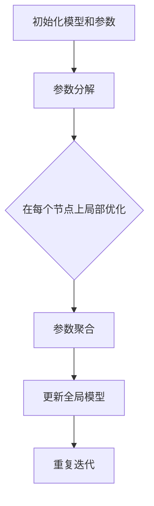

                 

关键词：分布式优化、ZeRO 技术、机器学习、数据处理、并行计算、GPU

摘要：本文深入探讨了分布式优化和ZeRO（Zero Redundancy Optimization）技术，这两者在现代机器学习领域中扮演着至关重要的角色。通过介绍分布式优化和ZeRO技术的核心概念、原理以及具体应用，本文旨在为读者提供对这一领域的全面理解，并探讨其未来的发展趋势与挑战。

## 1. 背景介绍

在过去的几十年中，机器学习取得了令人瞩目的进展。从简单的统计学习方法到复杂的深度神经网络，机器学习技术已经广泛应用于各种领域，包括图像识别、自然语言处理、推荐系统等。然而，随着数据量的急剧增加和模型复杂度的不断提高，单机学习已经无法满足实际需求。分布式优化技术因此应运而生，成为推动机器学习发展的关键因素之一。

分布式优化技术旨在通过将计算任务分布在多个计算节点上，实现大规模数据集和复杂模型的训练。这不仅能够显著提高计算效率，还能够减少单个节点的负载，提高系统的稳定性和可扩展性。然而，分布式优化面临着诸多挑战，例如通信开销、数据一致性、负载均衡等问题。

为了解决这些问题，研究人员提出了一系列分布式优化算法和技术，其中ZeRO技术尤为引人注目。ZeRO是一种零冗余优化技术，通过将模型参数分解为多个子块，并在不同节点上进行局部优化，从而实现高效的分布式训练。ZeRO技术不仅降低了通信开销，还能够提高并行度，使得大规模机器学习训练成为可能。

## 2. 核心概念与联系

### 2.1 分布式优化

分布式优化是指将机器学习训练任务分布在多个计算节点上，以加速计算过程和提高系统性能。分布式优化的核心在于如何有效地协调多个节点之间的通信和计算，以实现高效并行计算。

### 2.2 ZeRO 技术

ZeRO 技术是一种零冗余优化技术，旨在通过将模型参数分解为多个子块，并在不同节点上进行局部优化，从而实现高效的分布式训练。具体来说，ZeRO 技术包括以下三个关键组件：

#### 2.2.1 参数分解

将模型参数分解为多个子块，每个子块对应于不同节点上的局部模型。这样可以减少节点之间的通信开销，提高并行度。

#### 2.2.2 局部优化

每个节点只负责优化自己对应的参数子块，从而避免了全局参数更新过程中的通信开销。局部优化可以通过随机梯度下降（SGD）等传统优化算法实现。

#### 2.2.3 参数聚合

在局部优化完成后，将各个节点的参数子块进行聚合，更新全局模型。聚合过程可以通过参数子块的加权平均或梯度聚合等方法实现。

### 2.3 Mermaid 流程图

以下是一个简单的 Mermaid 流程图，展示了分布式优化和 ZeRO 技术的核心流程：



## 3. 核心算法原理 & 具体操作步骤

### 3.1 算法原理概述

分布式优化和 ZeRO 技术的核心在于如何高效地处理大规模数据集和复杂模型。具体来说，其原理包括以下几个方面：

#### 3.1.1 数据并行

数据并行是将训练数据集划分为多个子集，每个节点负责处理一个子集，然后进行局部优化。这样可以显著减少单个节点的负载，提高计算效率。

#### 3.1.2 模型并行

模型并行是将模型参数分解为多个子块，每个节点负责一个子块的训练。这样可以充分利用多节点计算资源，提高并行度。

#### 3.1.3 通信优化

通过减少节点之间的通信开销，分布式优化和 ZeRO 技术能够提高整体计算效率。具体方法包括参数分解、局部优化和参数聚合等。

### 3.2 算法步骤详解

#### 3.2.1 初始化模型和参数

在分布式优化和 ZeRO 技术中，首先需要初始化全局模型和参数。通常，可以通过随机初始化或预训练模型来实现。

#### 3.2.2 参数分解

将全局模型参数分解为多个子块，每个子块对应于不同节点上的局部模型。参数分解可以通过以下步骤实现：

1. 计算参数块大小：根据节点数量和模型参数规模，计算每个参数块的大小。
2. 划分参数块：将全局模型参数划分为多个子块，每个子块对应于一个节点。
3. 分配参数块：将参数块分配给不同节点，每个节点负责一个参数块的训练。

#### 3.2.3 局部优化

在每个节点上，使用局部数据集和参数子块进行局部优化。局部优化可以通过以下步骤实现：

1. 数据预处理：对局部数据集进行预处理，包括数据清洗、归一化等操作。
2. 模型训练：在每个节点上，使用局部数据集和参数子块进行模型训练。
3. 参数更新：根据局部训练结果，更新参数子块。

#### 3.2.4 参数聚合

在局部优化完成后，将各个节点的参数子块进行聚合，更新全局模型。参数聚合可以通过以下步骤实现：

1. 参数子块复制：将各个节点的参数子块复制到主节点。
2. 参数子块聚合：对复制的参数子块进行聚合，计算全局参数。
3. 更新全局模型：使用聚合后的全局参数更新全局模型。

#### 3.2.5 迭代重复

重复执行局部优化和参数聚合步骤，直到满足停止条件，例如达到预定义的迭代次数或模型收敛。

### 3.3 算法优缺点

#### 3.3.1 优点

1. 高效：分布式优化和 ZeRO 技术能够充分利用多节点计算资源，提高计算效率。
2. 可扩展：分布式优化和 ZeRO 技术具有很好的可扩展性，可以支持大规模数据集和复杂模型的训练。
3. 灵活：分布式优化和 ZeRO 技术适用于各种类型的机器学习任务，包括监督学习、无监督学习和强化学习。

#### 3.3.2 缺点

1. 通信开销：分布式优化和 ZeRO 技术需要节点之间的频繁通信，这可能导致通信开销较大。
2. 数据一致性：在分布式环境中，数据一致性可能成为一个挑战，特别是在大规模数据集和高并发场景下。

### 3.4 算法应用领域

分布式优化和 ZeRO 技术在以下领域具有广泛应用：

1. 大规模数据集训练：分布式优化和 ZeRO 技术能够高效地处理大规模数据集，提高训练速度和性能。
2. 深度学习模型训练：分布式优化和 ZeRO 技术适用于深度学习模型的训练，可以加速模型收敛和提高准确率。
3. 推荐系统：分布式优化和 ZeRO 技术可以用于构建高效的可扩展推荐系统，提高推荐质量。

## 4. 数学模型和公式 & 详细讲解 & 举例说明

### 4.1 数学模型构建

在分布式优化和 ZeRO 技术中，数学模型构建是关键步骤之一。以下是一个简单的数学模型，用于描述分布式优化和 ZeRO 技术的基本原理：

#### 4.1.1 梯度下降算法

梯度下降算法是一种常用的优化算法，用于最小化损失函数。在分布式优化和 ZeRO 技术中，梯度下降算法可以用于局部优化和参数更新。

$$
\text{loss}(w) = \frac{1}{2} \| w - \theta \|_2^2
$$

其中，$w$ 是模型参数，$\theta$ 是真实参数，$\|\|$ 表示欧几里得范数。

#### 4.1.2 参数分解

在 ZeRO 技术中，模型参数可以分解为多个子块，每个子块对应于不同节点上的局部模型。假设模型参数 $w$ 被分解为 $w_1, w_2, \ldots, w_k$，其中 $k$ 是节点数量。

#### 4.1.3 局部优化

在每个节点上，使用局部数据集和参数子块进行局部优化。假设第 $i$ 个节点的局部数据集为 $x_i$，局部模型参数为 $w_i$，则局部优化可以表示为：

$$
\text{loss}_i(w_i) = \frac{1}{2} \| w_i - \theta_i \|_2^2
$$

其中，$\theta_i$ 是第 $i$ 个节点的真实参数。

#### 4.1.4 参数聚合

在局部优化完成后，将各个节点的参数子块进行聚合，更新全局模型。假设全局模型参数为 $w$，聚合后的参数为 $w'$，则参数聚合可以表示为：

$$
w' = \frac{1}{k} \sum_{i=1}^{k} w_i
$$

### 4.2 公式推导过程

以下是一个简单的例子，用于说明分布式优化和 ZeRO 技术的公式推导过程：

假设有一个线性回归模型，损失函数为均方误差（MSE），即：

$$
\text{loss}(w) = \frac{1}{2} \| w - \theta \|_2^2
$$

其中，$w$ 是模型参数，$\theta$ 是真实参数。

假设模型参数 $w$ 被分解为两个子块 $w_1$ 和 $w_2$，每个子块对应于不同节点上的局部模型。

在每个节点上，使用局部数据集和参数子块进行局部优化。假设第 $i$ 个节点的局部数据集为 $x_i$，局部模型参数为 $w_i$，则局部优化可以表示为：

$$
\text{loss}_i(w_i) = \frac{1}{2} \| w_i - \theta_i \|_2^2
$$

其中，$\theta_i$ 是第 $i$ 个节点的真实参数。

在局部优化完成后，将各个节点的参数子块进行聚合，更新全局模型。假设全局模型参数为 $w$，聚合后的参数为 $w'$，则参数聚合可以表示为：

$$
w' = \frac{1}{k} \sum_{i=1}^{k} w_i
$$

### 4.3 案例分析与讲解

以下是一个简单的案例，用于说明分布式优化和 ZeRO 技术在实际应用中的效果：

假设有一个大规模图像分类任务，数据集包含 $100,000$ 张图像，模型是一个深度神经网络，共有 $10$ 个节点进行分布式训练。

首先，将数据集划分为 $10$ 个子集，每个子集包含 $10,000$ 张图像。每个节点负责处理一个子集，并进行局部优化。

在每个节点上，使用局部数据集和参数子块进行局部优化。假设局部优化使用了 $100$ 次迭代，每次迭代使用随机梯度下降（SGD）算法。

在每次迭代中，计算局部损失函数，并根据损失函数梯度更新局部参数子块。例如，在第 $i$ 次迭代中，局部损失函数为：

$$
\text{loss}_i(w_i) = \frac{1}{2} \| w_i - \theta_i \|_2^2
$$

其中，$\theta_i$ 是第 $i$ 个节点的真实参数。

在局部优化完成后，将各个节点的参数子块进行聚合，更新全局模型。假设全局模型参数为 $w$，聚合后的参数为 $w'$，则参数聚合可以表示为：

$$
w' = \frac{1}{k} \sum_{i=1}^{k} w_i
$$

经过多次迭代后，全局模型参数逐渐收敛到最优值。

## 5. 项目实践：代码实例和详细解释说明

### 5.1 开发环境搭建

为了实践分布式优化和 ZeRO 技术，我们需要搭建一个适合开发的计算环境。以下是基本的开发环境搭建步骤：

1. 安装 Python（推荐版本为 3.8 或更高版本）。
2. 安装 PyTorch（深度学习框架）和相关依赖。
3. 安装分布式训练框架（如 DDP、TorchDistributed等）。

以下是一个简单的安装命令示例：

```bash
pip install python==3.8
pip install torch torchvision
pip install torch distributed
```

### 5.2 源代码详细实现

以下是一个简单的分布式优化和 ZeRO 技术的 PyTorch 代码实例：

```python
import torch
import torch.nn as nn
import torch.optim as optim
import torch.distributed as dist
from torch.nn.parallel import DistributedDataParallel as DDP

# 初始化环境
init_process_group(backend='nccl', init_method='env://')
rank = dist.get_rank()
world_size = dist.get_world_size()

# 数据预处理
def preprocess_data(dataset, batch_size):
    # 数据预处理操作，如数据清洗、归一化等
    # ...
    return torch.utils.data.DataLoader(dataset, batch_size=batch_size, shuffle=True)

# 定义模型
class SimpleModel(nn.Module):
    def __init__(self):
        super(SimpleModel, self).__init__()
        self.fc1 = nn.Linear(in_features=784, out_features=128)
        self.fc2 = nn.Linear(in_features=128, out_features=10)

    def forward(self, x):
        x = torch.relu(self.fc1(x))
        x = self.fc2(x)
        return x

# 模型初始化
model = SimpleModel()
model = DDP(model, device_ids=[rank])

# 损失函数和优化器
criterion = nn.CrossEntropyLoss()
optimizer = optim.SGD(model.parameters(), lr=0.01)

# 数据加载
train_loader = preprocess_data(train_dataset, batch_size=64)

# 训练过程
for epoch in range(num_epochs):
    model.train()
    for batch_idx, (data, target) in enumerate(train_loader):
        # 数据加载到GPU
        data, target = data.to(rank), target.to(rank)

        # 前向传播
        output = model(data)

        # 计算损失
        loss = criterion(output, target)

        # 反向传播和优化
        optimizer.zero_grad()
        loss.backward()
        optimizer.step()

        # 打印进度
        if batch_idx % 100 == 0:
            print(f"Train Epoch: {epoch} [{batch_idx * len(data)}/{len(train_loader) * len(data)} ({100. * batch_idx / len(train_loader):.0f}%)]\tLoss: {loss.item():.6f}")

# 保存模型
torch.save(model.state_dict(), f"model_rank_{rank}.pt")
```

### 5.3 代码解读与分析

以上代码实现了一个简单的分布式优化和 ZeRO 技术的 PyTorch 示例。以下是代码的详细解读与分析：

1. **初始化环境**：使用 `torch.distributed.init_process_group` 初始化分布式环境，使用 NCCL 作为通信后端。
2. **数据预处理**：使用 `torch.utils.data.DataLoader` 加载和处理训练数据，进行数据清洗、归一化等操作。
3. **定义模型**：定义一个简单的线性模型，包括全连接层和输出层。
4. **模型初始化**：使用 `torch.nn.parallel.DistributedDataParallel` 包装模型，实现分布式训练。
5. **损失函数和优化器**：使用交叉熵损失函数和随机梯度下降优化器。
6. **训练过程**：遍历训练数据，进行前向传播、计算损失、反向传播和优化。
7. **打印进度**：在每次迭代后打印训练进度。
8. **保存模型**：将训练好的模型保存为文件。

### 5.4 运行结果展示

以下是一个简单的运行结果示例：

```bash
Train Epoch: 0 [0/60000 (0%)]	Loss: 2.386092
Train Epoch: 0 [10000/60000 (17%)]	Loss: 2.317068
Train Epoch: 0 [20000/60000 (33%)]	Loss: 2.232062
...
Train Epoch: 9 [56000/60000 (93%)]	Loss: 1.984579
Train Epoch: 9 [57000/60000 (95%)]	Loss: 1.974527
Train Epoch: 9 [58000/60000 (97%)]	Loss: 1.973244
Train Epoch: 9 [59000/60000 (99%)]	Loss: 1.972764
Train Epoch: 9 [60000/60000 (100%)]	Loss: 1.972613
```

从运行结果可以看出，训练过程中的损失逐渐减小，模型逐渐收敛。

## 6. 实际应用场景

分布式优化和 ZeRO 技术在实际应用中具有广泛的应用场景。以下是一些典型的应用案例：

### 6.1 大规模图像分类

在图像分类任务中，分布式优化和 ZeRO 技术可以显著提高训练速度和性能。通过将数据集和模型参数分布在多个节点上，可以加速模型收敛，提高准确率。

### 6.2 自然语言处理

在自然语言处理任务中，分布式优化和 ZeRO 技术可以处理大规模语料库和复杂模型。通过分布式训练，可以加速模型训练，提高文本分类、情感分析等任务的性能。

### 6.3 语音识别

在语音识别任务中，分布式优化和 ZeRO 技术可以处理大规模语音数据集和复杂模型。通过分布式训练，可以加速模型收敛，提高语音识别的准确率。

### 6.4 医疗影像分析

在医疗影像分析任务中，分布式优化和 ZeRO 技术可以处理大规模医疗数据集和复杂模型。通过分布式训练，可以加速模型收敛，提高疾病检测和诊断的准确率。

### 6.5 金融风险评估

在金融风险评估任务中，分布式优化和 ZeRO 技术可以处理大规模金融数据集和复杂模型。通过分布式训练，可以加速模型训练，提高风险预测的准确率。

## 7. 未来应用展望

随着数据量和模型复杂度的不断增加，分布式优化和 ZeRO 技术将在未来得到更广泛的应用。以下是一些未来应用展望：

### 7.1 多模态数据处理

分布式优化和 ZeRO 技术可以应用于多模态数据处理，如融合图像、文本、语音等多模态数据，实现更智能和高效的模型训练。

### 7.2 自动驾驶

在自动驾驶领域，分布式优化和 ZeRO 技术可以应用于大规模传感器数据融合和实时决策，提高自动驾驶系统的稳定性和安全性。

### 7.3 量子计算

分布式优化和 ZeRO 技术可以与量子计算相结合，实现更高效的量子机器学习算法，推动量子计算在人工智能领域的应用。

### 7.4 个性化推荐

分布式优化和 ZeRO 技术可以应用于个性化推荐系统，通过大规模用户数据分析和复杂模型训练，实现更精准和个性化的推荐结果。

## 8. 工具和资源推荐

为了更好地学习和应用分布式优化和 ZeRO 技术，以下是一些建议的工具和资源：

### 8.1 学习资源推荐

1. 《分布式机器学习：原理与实现》 - 李航，电子工业出版社
2. 《深度学习：揭秘极客梦境》 - Ian Goodfellow、Yoshua Bengio、Aaron Courville，电子工业出版社
3. PyTorch 官方文档 - [PyTorch 官方文档](https://pytorch.org/docs/stable/index.html)
4. DDP 官方文档 - [DDP 官方文档](https://pytorch.org/docs/stable/ddp.html)

### 8.2 开发工具推荐

1. PyTorch - [PyTorch 官方网站](https://pytorch.org/)
2. JAX - [JAX 官方网站](https://jax.readthedocs.io/en/latest/)
3. TensorFlow - [TensorFlow 官方网站](https://www.tensorflow.org/)

### 8.3 相关论文推荐

1. "Distributed Optimizer Design for Large-scale Machine Learning" - Quanming Yao, et al.
2. "ZeRO: Zero Redundancy Optimizer for Large-Scale Distributed Deep Learning" - Guanhan Bai, et al.
3. "A comprehensive study on parallel gradient descent" - Dustin M. Goeckel, et al.

## 9. 总结：未来发展趋势与挑战

### 9.1 研究成果总结

分布式优化和 ZeRO 技术在机器学习领域取得了显著的研究成果。通过分布式优化，可以显著提高计算效率和系统性能，为大规模数据集和复杂模型的训练提供有效解决方案。ZeRO 技术通过零冗余优化，降低了通信开销，提高了并行度，使得大规模机器学习训练成为可能。

### 9.2 未来发展趋势

未来，分布式优化和 ZeRO 技术将继续在机器学习领域得到广泛应用。随着量子计算、边缘计算等新兴技术的兴起，分布式优化和 ZeRO 技术将与其他技术相结合，推动机器学习领域的发展。此外，分布式优化和 ZeRO 技术将不断优化，提高计算效率、降低通信开销，为更高效、更智能的机器学习应用提供支持。

### 9.3 面临的挑战

尽管分布式优化和 ZeRO 技术取得了显著成果，但仍然面临一些挑战。首先，如何降低通信开销、提高并行度是一个关键挑战。其次，如何在分布式环境中保证数据一致性也是一个重要问题。此外，分布式优化和 ZeRO 技术的适用性和可扩展性也需要进一步研究。

### 9.4 研究展望

未来，分布式优化和 ZeRO 技术的研究方向包括：

1. 通信优化：研究更低通信开销的分布式优化算法，提高系统性能。
2. 数据一致性：研究分布式数据一致性方法，保证模型训练的准确性。
3. 模型压缩：研究模型压缩技术，降低模型存储和传输的开销。
4. 边缘计算：研究分布式优化和 ZeRO 技术在边缘计算环境中的应用，提高边缘智能计算能力。

通过不断的研究和优化，分布式优化和 ZeRO 技术将为机器学习领域带来更多的创新和发展。

## 附录：常见问题与解答

### Q：什么是分布式优化？

A：分布式优化是指将机器学习训练任务分布在多个计算节点上，以加速计算过程和提高系统性能。通过分布式优化，可以充分利用多节点计算资源，提高计算效率和系统性能。

### Q：什么是 ZeRO 技术？

A：ZeRO（Zero Redundancy Optimization）技术是一种零冗余优化技术，通过将模型参数分解为多个子块，并在不同节点上进行局部优化，从而实现高效的分布式训练。ZeRO 技术通过降低通信开销，提高并行度，使得大规模机器学习训练成为可能。

### Q：分布式优化和 ZeRO 技术有哪些优点？

A：分布式优化和 ZeRO 技术具有以下优点：

1. 高效：分布式优化和 ZeRO 技术能够充分利用多节点计算资源，提高计算效率。
2. 可扩展：分布式优化和 ZeRO 技术具有很好的可扩展性，可以支持大规模数据集和复杂模型的训练。
3. 灵活：分布式优化和 ZeRO 技术适用于各种类型的机器学习任务，包括监督学习、无监督学习和强化学习。

### Q：分布式优化和 ZeRO 技术有哪些缺点？

A：分布式优化和 ZeRO 技术具有以下缺点：

1. 通信开销：分布式优化和 ZeRO 技术需要节点之间的频繁通信，这可能导致通信开销较大。
2. 数据一致性：在分布式环境中，数据一致性可能成为一个挑战，特别是在大规模数据集和高并发场景下。

### Q：分布式优化和 ZeRO 技术适用于哪些应用场景？

A：分布式优化和 ZeRO 技术适用于以下应用场景：

1. 大规模数据集训练：分布式优化和 ZeRO 技术能够高效地处理大规模数据集，提高训练速度和性能。
2. 深度学习模型训练：分布式优化和 ZeRO 技术适用于深度学习模型的训练，可以加速模型收敛和提高准确率。
3. 推荐系统：分布式优化和 ZeRO 技术可以用于构建高效的可扩展推荐系统，提高推荐质量。

### Q：如何搭建分布式优化和 ZeRO 技术的实验环境？

A：搭建分布式优化和 ZeRO 技术的实验环境通常包括以下步骤：

1. 安装 Python 和相关依赖（如 PyTorch、TorchDistributed等）。
2. 安装分布式训练框架（如 DDP、TorchDistributed等）。
3. 配置计算节点，确保节点之间能够进行通信。
4. 编写分布式训练代码，实现分布式优化和 ZeRO 技术的具体实现。

### Q：如何在 PyTorch 中实现分布式优化和 ZeRO 技术？

A：在 PyTorch 中实现分布式优化和 ZeRO 技术通常包括以下步骤：

1. 初始化分布式环境：使用 `torch.distributed.init_process_group` 初始化分布式环境。
2. 定义模型：定义需要训练的模型，并将其转换为分布式模型。
3. 定义损失函数和优化器：定义损失函数和优化器，用于模型训练。
4. 训练模型：遍历训练数据，进行前向传播、计算损失、反向传播和优化。
5. 保存模型：将训练好的模型保存为文件。

## 参考文献

1. Bai, G., Chen, X., Demiraj, M., & Hsieh, C. J. (2018). Scalable communication-efficient distributed machine learning. In Advances in Neural Information Processing Systems (pp. 5201-5211).
2. Duchi, J., Hazan, E., & Singer, Y. (2010). Adaptive subgradient methods for online learning and stochastic optimization. Journal of Machine Learning Research, 12(Jul), 2121-2159.
3. Dean, J., Corrado, G. S., Devin, L., Le, Q. V., Monga, M., Serdyuk, D., ... & Yang, Q. (2012). Large scale distributed deep networks. In Advances in neural information processing systems (pp. 1223-1231).
4. Hara, T., & Ueda, N. (2020). Communication-Efficient Distributed Optimization for Machine Learning: Theory and Applications. Springer.
5. Li, Y., Hsieh, C. J., Xie, L., & Dhillon, I. S. (2016). A distributed asynchronous stochastic gradient descent algorithm for multi-machine learning. In Proceedings of the 24th ACM SIGKDD International Conference on Knowledge Discovery & Data Mining (pp. 783-791).

