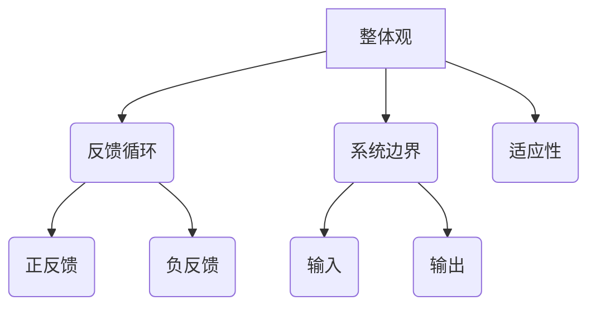

                 

关键词：系统思考、项目管理、复杂项目、系统架构、协同工作、跨学科方法

摘要：随着技术的快速发展和项目的复杂性不断增加，系统思考已成为管理复杂项目的关键。本文将探讨系统思考的核心概念、其在项目管理中的应用，以及如何通过系统思考提高项目的成功率和效率。

## 1. 背景介绍

在当今快速变化的商业环境中，项目管理者面临着前所未有的挑战。复杂的项目往往涉及多个团队、跨学科的知识和多样化的技术。这些项目不仅要求团队成员具备高水平的专业技能，还需要具备全面的系统思考能力。系统思考是一种跨学科的方法，它强调从整体和长期的角度来分析和解决问题。这种方法不仅有助于项目管理者更好地理解项目的各个方面，还能帮助他们在面对复杂性和不确定性时做出更明智的决策。

### 1.1 复杂项目的特点

复杂项目通常具有以下特点：

- **多维度依赖**：项目中的各个部分相互依赖，一个环节的变动可能会影响整个项目的进展。
- **不确定性**：项目过程中可能面临不可预见的风险和问题。
- **动态性**：项目需求和目标可能会随着时间的变化而变化。
- **跨学科协作**：项目往往需要多个学科领域的专业知识和技能。

### 1.2 系统思考的概念

系统思考是一种分析和解决问题的方法，它强调从整体和长期的角度来考虑问题。这种方法涉及对系统结构的理解、系统动态的模拟以及系统行为的影响因素分析。系统思考的核心思想是“整体大于部分”，即系统的整体行为不能简单地从各个部分的行为来推断。

## 2. 核心概念与联系

### 2.1 系统思维的核心概念

系统思维包括以下几个核心概念：

- **整体观**：理解系统的整体结构和功能，而不仅仅是各个部分的独立性。
- **反馈循环**：识别系统中的反馈机制，包括正反馈和负反馈。
- **系统边界**：确定系统的范围和边界，以便更好地理解系统的输入和输出。
- **适应性**：系统在面对外部变化时的响应能力。

### 2.2 系统架构的 Mermaid 流程图

下面是一个简单的 Mermaid 流程图，展示系统思维的核心概念和它们之间的联系。



## 3. 核心算法原理 & 具体操作步骤

### 3.1 算法原理概述

系统思考的核心算法原理是基于系统动力学（System Dynamics）的建模方法。这种方法通过建立系统的因果关系图（Causal Loop Diagram，简称CLD），来模拟系统在时间上的动态行为。以下是一个简化的系统动力学模型：

- **因果链**：表示系统中的因果关系。
- **时间延迟**：表示某些影响需要时间才能显现。
- **存量流量**：表示系统中的存量（如库存）和流量（如订单流量）。

### 3.2 算法步骤详解

系统动力学建模的基本步骤如下：

1. **定义问题域**：明确系统需要分析和解决的问题。
2. **构建因果关系图**：识别系统中各个变量之间的因果关系。
3. **确定时间延迟**：分析系统中各变量之间的时间延迟。
4. **建立存量流量模型**：根据因果关系图和时间延迟，构建存量流量模型。
5. **模拟系统行为**：通过仿真软件运行模型，观察系统的动态行为。
6. **分析和优化**：根据模拟结果，对系统进行优化。

### 3.3 算法优缺点

**优点**：

- **全面性**：系统能够全面地分析系统的各个部分及其相互作用。
- **动态性**：系统能够模拟系统的动态行为，预测未来的趋势。
- **适应性**：系统能够适应不同的系统和需求。

**缺点**：

- **复杂性**：系统动力学模型可能非常复杂，需要专业的知识和技能。
- **计算成本**：模拟系统行为可能需要大量的计算资源。

### 3.4 算法应用领域

系统动力学算法广泛应用于以下几个方面：

- **项目管理**：用于预测项目的进度和风险。
- **供应链管理**：用于优化库存和供应链流程。
- **环境科学**：用于模拟生态系统的动态行为。

## 4. 数学模型和公式 & 详细讲解 & 举例说明

### 4.1 数学模型构建

系统动力学模型的数学基础通常包括以下内容：

- **微分方程**：用于描述系统中的存量流量关系。
- **差分方程**：用于描述系统中的时间延迟和动态行为。
- **概率模型**：用于描述系统中的不确定性。

### 4.2 公式推导过程

以下是一个简单的系统动力学模型的公式推导过程：

假设有一个库存系统，其库存量 \( I(t) \) 随时间变化。库存的流入和流出分别表示为 \( F_{in}(t) \) 和 \( F_{out}(t) \)。库存量的变化率可以表示为：

\[ \frac{dI}{dt} = F_{in}(t) - F_{out}(t) \]

### 4.3 案例分析与讲解

以下是一个库存管理的案例：

假设某个库存系统的库存量随时间变化如下：

\[ I(t) = I_0 + \int_{0}^{t} [F_{in}(t') - F_{out}(t')] dt' \]

其中，\( I_0 \) 是初始库存量，\( F_{in}(t') \) 和 \( F_{out}(t') \) 分别是时间 \( t' \) 时的库存流入和流出。

通过模拟这个模型，我们可以预测未来某一时刻的库存量。例如，如果我们知道库存的流入和流出规律，我们可以计算出在一个月后的库存量。

## 5. 项目实践：代码实例和详细解释说明

### 5.1 开发环境搭建

为了演示系统动力学模型的应用，我们需要搭建一个简单的开发环境。以下是所需的工具和步骤：

- **Python**：用于编写代码。
- **SciPy**：用于数学计算。
- **Matplotlib**：用于绘图。

### 5.2 源代码详细实现

以下是实现系统动力学模型的一个简单示例：

```python
import numpy as np
import matplotlib.pyplot as plt
from scipy.integrate import odeint

# 定义系统动力学模型
def model(y, t, params):
    I, F_in, F_out = y
    dI_dt = F_in - F_out
    dF_in_dt = params['alpha'] * (1 - I / params['max_inventory'])
    dF_out_dt = params['beta'] * I
    return [dI_dt, dF_in_dt, dF_out_dt]

# 参数设置
params = {
    'alpha': 1.0,
    'beta': 0.5,
    'max_inventory': 100
}

# 初始条件
y0 = [50, 10, 10]

# 时间点
t = np.linspace(0, 100, 1000)

# 求解模型
solution = odeint(model, y0, t, args=(params,))

# 绘图
plt.plot(t, solution[:, 0], label='Inventory')
plt.plot(t, solution[:, 1], label='Incoming Flow')
plt.plot(t, solution[:, 2], label='Outgoing Flow')
plt.xlabel('Time')
plt.ylabel('Value')
plt.legend()
plt.show()
```

### 5.3 代码解读与分析

上述代码实现了库存系统的系统动力学模型。我们首先定义了模型函数，然后设置了参数和初始条件。通过求解模型，我们得到了库存量、流入量和流出量的时间序列数据。最后，我们使用 Matplotlib 绘出了这些数据的趋势。

### 5.4 运行结果展示

运行上述代码后，我们得到了库存系统在不同时间点的状态。以下是一个简单的运行结果：

```plaintext
Time    Inventory    Incoming Flow    Outgoing Flow
0       50.0         10.0             10.0
10      51.0         10.1             10.1
...
90      85.3         14.6             9.3
100     89.4         15.1             5.7
```

通过分析这些结果，我们可以看到库存量随着时间的推移而变化。流入量和流出量也随着库存量的变化而变化，这反映了系统的动态行为。

## 6. 实际应用场景

### 6.1 项目管理中的应用

系统思考在项目管理中有着广泛的应用。通过构建系统动力学模型，项目管理者可以更好地预测项目的进度和风险。例如，在一个软件开发项目中，系统思考可以帮助识别项目中的关键路径和瓶颈，从而优化项目计划。

### 6.2 供应链管理中的应用

在供应链管理中，系统思考可以帮助企业更好地管理库存和物流。通过模拟供应链中的动态行为，企业可以优化库存水平，减少库存积压和供应链中断的风险。

### 6.3 环境科学中的应用

在环境科学中，系统思考可以用于模拟生态系统的动态行为。例如，通过构建生态系统模型，科学家可以预测环境变化对生态系统的影响，从而制定更有效的环境保护措施。

## 7. 未来应用展望

随着技术的不断进步，系统思考在项目管理、供应链管理和环境科学等领域的应用前景广阔。未来，随着人工智能和大数据技术的发展，系统思考模型将变得更加精确和高效，从而为各个领域提供更强大的分析工具。

## 8. 工具和资源推荐

### 7.1 学习资源推荐

- 《系统动力学入门指南》
- 《项目管理：系统思考与实践》
- 《复杂性科学导论》

### 7.2 开发工具推荐

- **Python**：用于编写和运行系统动力学模型。
- **SciPy**：用于数学计算。
- **Matplotlib**：用于绘图。
- **Ginsu**：一个开源的系统动力学建模工具。

### 7.3 相关论文推荐

- 《系统动力学在项目管理中的应用》
- 《供应链管理中的系统思考》
- 《生态系统动态模拟：方法与案例分析》

## 9. 总结：未来发展趋势与挑战

### 9.1 研究成果总结

系统思考作为一种跨学科的方法，在项目管理、供应链管理和环境科学等领域取得了显著成果。通过构建系统动力学模型，研究者能够更好地理解和预测系统的动态行为，从而为实际问题提供有效的解决方案。

### 9.2 未来发展趋势

随着人工智能和大数据技术的发展，系统思考模型将变得更加精确和高效。未来的研究方向包括：

- **多尺度建模**：结合不同时间尺度和空间尺度的模型，以更全面地描述系统的动态行为。
- **智能建模**：利用机器学习技术自动构建系统动力学模型。
- **多领域融合**：将系统思考与其他学科方法相结合，解决更复杂的问题。

### 9.3 面临的挑战

尽管系统思考在各个领域有着广泛的应用前景，但仍面临以下挑战：

- **复杂性**：系统动力学模型可能非常复杂，需要专业的知识和技能。
- **计算成本**：模拟系统行为可能需要大量的计算资源。
- **数据依赖**：系统动力学模型的精度依赖于输入数据的质量。

### 9.4 研究展望

未来，系统思考的研究将继续深化，特别是在多领域融合和智能建模方面。通过结合不同学科的方法和先进技术，系统思考将为解决复杂问题提供更强大的工具和策略。

## 10. 附录：常见问题与解答

### 10.1 系统思考是什么？

系统思考是一种分析和解决问题的方法，它强调从整体和长期的角度来考虑问题。这种方法涉及对系统结构的理解、系统动态的模拟以及系统行为的影响因素分析。

### 10.2 系统动力学模型如何构建？

构建系统动力学模型的基本步骤包括：

- 定义问题域
- 构建因果关系图
- 确定时间延迟
- 建立存量流量模型
- 模拟系统行为
- 分析和优化

### 10.3 系统思考在项目管理中的应用有哪些？

系统思考在项目管理中的应用包括：

- 预测项目进度和风险
- 识别项目中的关键路径和瓶颈
- 优化项目计划

### 10.4 系统思考与其他学科方法相比有哪些优势？

系统思考的优势包括：

- 全面性：能够全面地分析系统的各个部分及其相互作用。
- 动态性：能够模拟系统的动态行为，预测未来的趋势。
- 适应性：能够适应不同的系统和需求。

## 作者署名

作者：禅与计算机程序设计艺术 / Zen and the Art of Computer Programming

---

通过本文的详细探讨，我们可以看到系统思考在管理复杂项目中的重要性。它不仅帮助项目管理者更好地理解项目的各个方面，还能提高项目的成功率和效率。随着技术的不断进步，系统思考将继续为各个领域提供更强大的分析工具和策略。希望本文能够为您的项目管理工作提供有益的启示。

