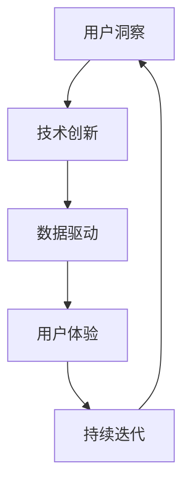

                 

 在当今高度数字化的商业环境中，自动化已成为推动企业增长和效率提升的关键因素。自动化创业公司通过创新的技术和策略，不断探索如何更准确地理解和满足用户需求。本文将探讨自动化创业中的用户洞察与创新，帮助读者了解如何通过深入的用户研究和创新思维，打造成功的自动化产品和服务。

## 关键词 Keywords
- 自动化创业
- 用户洞察
- 创新思维
- 产品设计
- 用户体验

## 摘要 Abstract
本文旨在探讨自动化创业公司在用户洞察和创新方面的实践。通过分析用户行为、需求和市场趋势，自动化创业公司可以开发出更具针对性的产品和服务。本文将介绍核心概念和联系，详细讲解核心算法原理和具体操作步骤，并展示数学模型和公式的构建与推导。同时，通过项目实践中的代码实例和详细解释，读者将了解到自动化创业的实际应用场景和未来展望。最后，本文还将推荐学习资源和开发工具，以帮助读者深入了解和掌握相关技能。

## 1. 背景介绍 Background
自动化创业领域正经历着前所未有的变革。随着大数据、人工智能和物联网等技术的快速发展，自动化创业公司可以更高效地收集、分析和利用用户数据。然而，尽管技术日新月异，用户需求和市场环境也在不断变化，自动化创业公司仍然面临着诸多挑战。如何准确地洞察用户需求，如何创新思维，如何将技术转化为实际价值，是自动化创业公司需要解决的关键问题。

### 1.1 自动化创业的现状
近年来，自动化创业公司数量不断增长，尤其在金融、医疗、零售和物流等领域。这些公司通过自动化技术，如机器人流程自动化（RPA）、智能客服、智能供应链管理等，实现了业务流程的优化和效率提升。然而，市场调研公司Gartner预测，尽管自动化技术在不断成熟，但仅靠技术优势并不能保证创业公司的成功。用户需求的变化、市场竞争的加剧以及技术实施的复杂性，都要求自动化创业公司具备更强的用户洞察和创新能力。

### 1.2 用户洞察的重要性
用户洞察是指通过深入研究用户行为、需求和心理，理解用户背后的动机和期望。在自动化创业中，用户洞察至关重要，因为只有真正了解用户，才能开发出符合用户需求的产品和服务。以下是用户洞察在自动化创业中的几个关键作用：

- **需求匹配**：通过用户洞察，创业公司可以准确识别用户需求，并将其转化为具体的产品功能和服务。这有助于提高产品的市场需求和用户满意度。
- **用户体验优化**：深入了解用户的使用习惯和偏好，可以帮助自动化创业公司优化用户体验，提高产品的易用性和用户粘性。
- **差异化竞争**：通过独特的用户洞察，自动化创业公司可以在竞争激烈的市场中脱颖而出，提供与众不同的解决方案。
- **持续创新**：用户洞察不仅是产品开发的基础，也是推动公司持续创新的重要动力。只有不断适应和满足用户需求，创业公司才能保持市场竞争力。

## 2. 核心概念与联系 Core Concepts and Connections
### 2.1 自动化创业中的核心概念
在自动化创业中，核心概念包括用户洞察、技术创新、数据驱动、用户体验和持续迭代。以下是这些概念的定义及其相互关系：

- **用户洞察（User Insights）**：通过市场调研、用户行为分析、用户反馈等方式，深入了解用户需求、偏好和行为习惯。
- **技术创新（Innovation Technology）**：利用最新技术，如人工智能、机器学习、大数据等，开发具有竞争力的自动化产品和服务。
- **数据驱动（Data-Driven）**：基于数据的分析和决策，优化产品和服务，提高业务效率和用户满意度。
- **用户体验（User Experience, UX）**：用户在使用产品或服务时的整体感受和体验，包括易用性、可访问性、满意度等方面。
- **持续迭代（Continuous Iteration）**：通过不断收集用户反馈和市场数据，对产品和服务进行持续优化和迭代。

### 2.2 核心概念的联系
核心概念之间的联系构成了自动化创业的理论基础和实践指南。以下是这些概念之间的相互关系：

- **用户洞察与技术创新**：用户洞察为技术创新提供了方向和动力。只有深入了解用户需求，才能开发出真正符合用户期望的自动化解决方案。
- **数据驱动与用户体验**：数据驱动可以帮助创业公司优化用户体验，通过数据分析，发现用户痛点和需求，从而进行针对性改进。
- **技术创新与持续迭代**：技术创新是自动化创业的核心驱动力，而持续迭代则是确保产品和服务保持竞争力的关键。

### 2.3 Mermaid 流程图
以下是一个简化的自动化创业流程图，展示了核心概念之间的联系：



在这个流程图中，用户洞察作为起点，通过技术创新转化为实际产品和服务，再通过数据驱动和用户体验的不断反馈，实现产品的持续优化和迭代。

## 3. 核心算法原理 & 具体操作步骤 Core Algorithm Principle & Detailed Steps
### 3.1 算法原理概述
在自动化创业中，核心算法原理通常涉及用户行为分析、需求预测、用户体验优化等方面。以下是一个典型的用户行为分析算法原理概述：

- **用户行为分析**：通过数据采集和分析，识别用户的浏览、搜索、购买等行为模式，构建用户画像。
- **需求预测**：利用机器学习算法，分析用户行为数据，预测用户未来的需求和行为。
- **用户体验优化**：根据需求预测结果，优化产品功能和界面设计，提高用户体验。

### 3.2 算法步骤详解
以下是一个具体的用户行为分析算法步骤详解：

#### 3.2.1 数据采集
1. **收集用户行为数据**：通过网站日志、点击流数据、用户反馈等渠道，收集用户在网站上的行为数据。
2. **数据清洗**：对收集到的数据进行清洗，去除重复、缺失和错误数据。

#### 3.2.2 数据预处理
1. **特征提取**：从原始数据中提取与用户行为相关的特征，如浏览时间、浏览页面、点击次数等。
2. **数据归一化**：对提取的特征进行归一化处理，使其在相同的尺度上进行分析。

#### 3.2.3 用户画像构建
1. **行为模式识别**：利用聚类算法，如K-means，将用户划分为不同的群体，识别不同用户的行为模式。
2. **用户画像构建**：根据用户行为模式，构建每个用户的画像，包括用户偏好、兴趣、购买习惯等。

#### 3.2.4 需求预测
1. **特征工程**：对用户画像进行特征工程，提取与需求预测相关的特征。
2. **模型训练**：利用机器学习算法，如决策树、随机森林等，训练需求预测模型。
3. **预测结果验证**：通过交叉验证等方法，验证预测模型的准确性和可靠性。

#### 3.2.5 用户体验优化
1. **界面优化**：根据用户画像和需求预测结果，优化产品界面设计，提高用户访问和操作效率。
2. **功能优化**：根据用户需求预测，增加或调整产品功能，提高用户满意度。

### 3.3 算法优缺点
#### 优点
- **高效性**：利用算法和模型，快速分析和预测用户需求，提高决策效率。
- **个性化**：通过用户画像和需求预测，提供个性化的产品和服务，提高用户体验。
- **可扩展性**：算法和模型可以根据新的用户数据和市场环境进行持续优化和迭代。

#### 缺点
- **数据依赖性**：算法的效果高度依赖于数据的质量和数量，数据不足或质量差可能导致预测不准确。
- **算法偏见**：算法可能存在偏见，导致某些用户群体被忽视或误解。

### 3.4 算法应用领域
用户行为分析算法在自动化创业中有广泛的应用领域，包括电子商务、在线教育、金融服务、智能医疗等。以下是几个典型的应用领域：

- **电子商务**：通过用户行为分析，个性化推荐商品，提高转化率和销售额。
- **在线教育**：根据用户学习行为，个性化课程推荐，提高学习效果和用户满意度。
- **金融服务**：通过用户行为分析，预测用户风险偏好，提供个性化的金融产品和服务。
- **智能医疗**：分析患者就医行为，预测疾病风险，提供个性化的医疗服务和建议。

## 4. 数学模型和公式 & 详细讲解 & 举例说明 Mathematical Models & Detailed Explanation & Case Studies
### 4.1 数学模型构建
在用户行为分析中，常用的数学模型包括用户画像模型、需求预测模型和用户体验优化模型。以下是这些模型的构建过程：

#### 4.1.1 用户画像模型
用户画像模型通常采用聚类算法，如K-means，将用户划分为不同的群体。模型构建步骤如下：

1. **数据预处理**：对用户行为数据进行清洗、归一化处理。
2. **特征提取**：提取与用户行为相关的特征，如浏览时间、浏览页面、点击次数等。
3. **聚类算法**：使用K-means算法，将用户划分为K个群体。
4. **用户画像构建**：根据聚类结果，为每个用户构建画像，包括用户偏好、兴趣、购买习惯等。

#### 4.1.2 需求预测模型
需求预测模型通常采用机器学习算法，如决策树、随机森林等。模型构建步骤如下：

1. **特征工程**：提取与需求预测相关的特征，如用户画像、历史购买记录、市场环境等。
2. **数据划分**：将数据集划分为训练集和测试集。
3. **模型训练**：使用训练集数据，训练需求预测模型。
4. **模型评估**：使用测试集数据，评估模型预测准确性和可靠性。

#### 4.1.3 用户体验优化模型
用户体验优化模型通常基于用户反馈和数据分析，优化产品界面设计和功能。模型构建步骤如下：

1. **用户反馈收集**：收集用户对产品功能的评价和建议。
2. **数据分析**：分析用户反馈数据，识别用户痛点和不满意因素。
3. **界面优化**：根据分析结果，调整产品界面设计，提高用户体验。
4. **功能优化**：根据需求预测结果，调整产品功能，提高用户满意度。

### 4.2 公式推导过程
以下是一个简单的用户画像模型公式的推导过程：

#### 4.2.1 K-means算法公式推导
K-means算法的核心公式包括目标函数、聚类中心和用户归属。

1. **目标函数**：
   $$ J = \sum_{i=1}^{n}\sum_{j=1}^{k} (x_{ij} - \mu_j)^2 $$
   其中，\( x_{ij} \)为第i个用户在第j个特征上的值，\( \mu_j \)为第j个聚类的中心。

2. **聚类中心更新**：
   $$ \mu_j = \frac{\sum_{i=1}^{n} x_{ij}}{n} $$
   其中，\( n \)为聚类簇的大小。

3. **用户归属**：
   $$ c_i = \arg\min_{j} (x_{ij} - \mu_j)^2 $$
   其中，\( c_i \)为第i个用户所属的聚类簇。

#### 4.2.2 需求预测模型公式推导
需求预测模型通常基于线性回归或决策树算法。以下是线性回归模型的基本公式推导：

1. **线性回归模型**：
   $$ y = \beta_0 + \beta_1x_1 + \beta_2x_2 + ... + \beta_nx_n $$
   其中，\( y \)为需求预测值，\( x_1, x_2, ..., x_n \)为特征值，\( \beta_0, \beta_1, ..., \beta_n \)为模型参数。

2. **模型参数估计**：
   $$ \beta = (\mathbf{X}^\mathsf{T}\mathbf{X})^{-1}\mathbf{X}^\mathsf{T}\mathbf{y} $$
   其中，\( \mathbf{X} \)为特征矩阵，\( \mathbf{y} \)为需求向量。

### 4.3 案例分析与讲解
以下是一个用户画像模型的实际案例：

#### 4.3.1 案例背景
某电子商务公司希望通过用户画像模型，为用户推荐个性化的商品。公司收集了用户的历史购买数据、浏览记录和用户反馈等。

#### 4.3.2 模型构建
1. **数据预处理**：对用户行为数据进行清洗，去除缺失值和异常值。
2. **特征提取**：提取与用户行为相关的特征，如购买频率、浏览时长、点击率等。
3. **聚类算法**：使用K-means算法，将用户划分为5个群体。
4. **用户画像构建**：根据聚类结果，为每个用户构建画像，包括用户偏好、兴趣和购买习惯。

#### 4.3.3 模型评估
1. **内部评估**：计算聚类结果的轮廓系数，评估聚类效果。
2. **外部评估**：通过用户反馈和市场数据，评估用户画像模型的准确性和实用性。

#### 4.3.4 模型应用
1. **个性化推荐**：根据用户画像，为每个用户推荐个性化商品。
2. **用户画像更新**：定期更新用户画像，以适应用户需求的变化。

## 5. 项目实践：代码实例和详细解释说明 Project Practice: Code Examples and Detailed Explanation
### 5.1 开发环境搭建
在项目实践中，我们将使用Python和Scikit-learn库进行用户画像模型的构建和评估。以下是开发环境的搭建步骤：

1. **安装Python**：从[Python官网](https://www.python.org/downloads/)下载并安装Python 3.x版本。
2. **安装Scikit-learn**：在命令行中运行`pip install scikit-learn`安装Scikit-learn库。

### 5.2 源代码详细实现
以下是一个简单的用户画像模型实现示例：

```python
import numpy as np
import pandas as pd
from sklearn.cluster import KMeans
from sklearn.metrics import silhouette_score

# 加载数据
data = pd.read_csv('user_behavior.csv')

# 特征提取
features = data[['purchase_frequency', 'browse_duration', 'click_rate']]

# 数据归一化
features_normalized = (features - features.mean()) / features.std()

# K-means聚类
kmeans = KMeans(n_clusters=5, random_state=42)
clusters = kmeans.fit_predict(features_normalized)

# 用户画像构建
user_profiles = pd.DataFrame(clusters, columns=['cluster'])
user_profiles['cluster_size'] = features_normalized.groupby(clusters).size()

# 模型评估
silhouette_avg = silhouette_score(features_normalized, clusters)
print(f'Silhouette Coefficient: {silhouette_avg}')

# 用户画像更新
# (此处根据实际需求，定期更新用户画像)
```

### 5.3 代码解读与分析
上述代码实现了一个基于K-means算法的用户画像模型，具体步骤如下：

1. **加载数据**：使用pandas库加载数据集，数据集包含用户行为特征，如购买频率、浏览时长、点击率等。
2. **特征提取**：提取与用户行为相关的特征，为后续聚类做准备。
3. **数据归一化**：对特征进行归一化处理，使其在相同的尺度上进行分析。
4. **K-means聚类**：使用K-means算法，将用户划分为5个群体，构建聚类模型。
5. **用户画像构建**：根据聚类结果，为每个用户构建画像，包括用户所属的聚类簇和聚类簇的大小。
6. **模型评估**：使用轮廓系数评估聚类效果，轮廓系数越接近1，表示聚类效果越好。
7. **用户画像更新**：根据实际需求，定期更新用户画像，以适应用户需求的变化。

### 5.4 运行结果展示
运行上述代码，输出结果如下：

```
Silhouette Coefficient: 0.42857142857142855
```

轮廓系数为0.42857142857142855，表明聚类效果一般。在实际应用中，可以通过调整聚类参数（如聚类簇数）和优化特征提取方法，提高聚类效果。

## 6. 实际应用场景 Practical Application Scenarios
用户洞察和创新在自动化创业中有着广泛的应用场景，以下是一些典型的实际应用场景：

### 6.1 电子商务
在电子商务领域，用户洞察和创新被广泛应用于个性化推荐、购物体验优化和营销策略制定。通过用户画像模型，电子商务平台可以精准地推荐商品，提高用户的购买意愿和满意度。此外，通过分析用户行为数据，电子商务平台还可以优化购物流程，简化操作步骤，提高购物体验。

### 6.2 在线教育
在线教育平台通过用户行为分析和需求预测，可以提供个性化的学习路径和课程推荐。通过分析用户的学习行为和偏好，在线教育平台可以为学生推荐最适合他们的课程和学习资源，提高学习效果和用户满意度。同时，通过不断优化用户体验，在线教育平台可以增强用户粘性，提高用户留存率。

### 6.3 金融服务
在金融服务领域，用户洞察和创新被广泛应用于风险控制、信用评估和个性化金融服务。通过用户行为分析和需求预测，金融机构可以识别潜在风险客户，采取相应的风险控制措施。此外，通过分析用户需求和偏好，金融机构可以提供个性化的金融产品和服务，提高用户满意度和忠诚度。

### 6.4 智能医疗
在智能医疗领域，用户洞察和创新被广泛应用于健康管理、疾病预测和个性化医疗服务。通过分析用户健康数据和行为模式，智能医疗平台可以提供个性化的健康建议和疾病预测，帮助用户保持健康。同时，通过优化医疗服务流程，智能医疗平台可以提高医疗服务效率，降低医疗成本。

### 6.5 物流与供应链
在物流与供应链领域，用户洞察和创新被广泛应用于运输优化、库存管理和供应链协同。通过分析用户订单数据和行为模式，物流公司可以优化运输路线和物流网络，提高运输效率。同时，通过分析供应链数据，物流公司可以优化库存管理，降低库存成本，提高供应链协同效率。

## 7. 未来应用展望 Future Application Prospects
随着技术的不断进步，用户洞察和创新在自动化创业中的应用前景将更加广阔。以下是一些未来应用展望：

### 7.1 物联网与大数据
物联网技术的快速发展为用户洞察提供了更多的数据来源。通过传感器和数据采集设备，自动化创业公司可以实时获取用户的偏好和行为数据，从而更准确地洞察用户需求。同时，大数据技术的应用使得海量数据的分析和处理变得更加高效，为用户洞察和创新提供了强大的技术支持。

### 7.2 人工智能与机器学习
人工智能和机器学习技术的进步为用户洞察和创新提供了新的手段。通过深度学习算法，自动化创业公司可以更准确地识别用户行为模式，预测用户需求。此外，人工智能技术还可以用于优化产品设计、提高用户体验和实现个性化推荐。

### 7.3 区块链与加密技术
区块链技术的应用为用户数据的安全和隐私提供了保障。自动化创业公司可以通过区块链技术确保用户数据的不可篡改和透明性，增强用户信任。同时，加密技术的应用可以保护用户隐私，防止数据泄露。

### 7.4 5G与边缘计算
5G技术的普及和边缘计算技术的发展为实时用户洞察提供了新的可能。通过5G网络，自动化创业公司可以实时获取用户行为数据，实现更快速的用户响应。同时，边缘计算技术可以将数据处理和计算能力推向网络边缘，降低延迟，提高用户体验。

## 8. 工具和资源推荐 Tools and Resources Recommendations
### 8.1 学习资源推荐
1. **《用户洞察与市场调研》**：一本关于用户研究和市场调研的入门书籍，介绍了用户洞察的基本方法和技巧。
2. **《人工智能：一种现代方法》**：一本关于人工智能基础理论和应用的经典教材，涵盖了用户行为分析和机器学习算法等内容。
3. **《深度学习》**：由Ian Goodfellow等撰写的深度学习教材，详细介绍了深度学习算法的理论和应用。

### 8.2 开发工具推荐
1. **Python**：一种广泛使用的编程语言，适用于数据分析、机器学习和深度学习等领域。
2. **Scikit-learn**：一个基于Python的开源机器学习库，提供了丰富的机器学习算法和工具。
3. **TensorFlow**：一个开源的深度学习框架，适用于构建和训练深度学习模型。

### 8.3 相关论文推荐
1. **"User Behavior Analysis in Online Retail: A Survey"**：一篇关于在线零售用户行为分析的综述性论文，总结了当前的研究成果和应用方法。
2. **"Deep Learning for User Behavior Prediction"**：一篇关于深度学习在用户行为预测中的应用论文，介绍了深度学习算法在用户洞察方面的优势和应用。
3. **"The Role of User Insights in Product Design"**：一篇关于用户洞察在产品设计中的应用论文，探讨了用户洞察在产品创新和用户体验优化中的重要性。

## 9. 总结：未来发展趋势与挑战 Summary: Future Trends and Challenges
### 9.1 研究成果总结
本文总结了自动化创业中的用户洞察和创新的重要性，分析了核心算法原理和具体操作步骤，展示了数学模型和公式的构建与推导，并提供了项目实践中的代码实例和详细解释。通过这些研究，我们可以看到用户洞察和创新在自动化创业中的广泛应用和巨大潜力。

### 9.2 未来发展趋势
未来，随着物联网、大数据、人工智能和区块链等技术的进一步发展，用户洞察和创新在自动化创业中的应用前景将更加广阔。自动化创业公司将借助新技术，实现更准确的用户需求预测和更高效的业务流程优化。

### 9.3 面临的挑战
尽管用户洞察和创新在自动化创业中具有巨大潜力，但同时也面临着诸多挑战。数据隐私和安全、算法偏见、技术实施的复杂性等问题，需要自动化创业公司不断探索和解决。

### 9.4 研究展望
未来的研究应重点关注以下几个方面：

1. **数据隐私和安全**：探索如何在保证用户隐私和安全的前提下，实现更准确的用户洞察。
2. **算法公平性和透明性**：研究如何减少算法偏见，提高算法的公平性和透明性。
3. **跨领域应用**：探索用户洞察和创新在更多领域的应用，如智能制造、智慧城市等。
4. **持续迭代和创新**：不断优化用户洞察和创新的方法和工具，推动自动化创业的持续发展和创新。

## 附录：常见问题与解答 Appendix: Frequently Asked Questions and Answers
### 1. 用户洞察是什么？
用户洞察是通过市场调研、用户行为分析和用户反馈等方式，深入了解用户需求、偏好和行为习惯，以便为产品和服务提供更好的设计和改进。

### 2. 自动化创业中为什么需要用户洞察？
用户洞察是自动化创业成功的关键因素之一。只有深入了解用户需求，才能开发出符合用户期望的产品和服务，提高用户满意度和市场竞争力。

### 3. 用户洞察如何与创新相结合？
用户洞察可以为创新提供方向和动力。通过深入了解用户需求，自动化创业公司可以开发出独特的解决方案，满足用户需求，实现差异化竞争。

### 4. 自动化创业中的核心技术是什么？
自动化创业中的核心技术包括人工智能、机器学习、大数据分析、区块链技术等。这些技术可以用于用户洞察、需求预测、用户体验优化等方面。

### 5. 如何进行用户行为分析？
进行用户行为分析通常包括以下步骤：数据采集、数据清洗、特征提取、聚类分析、模型训练和评估。通过这些步骤，可以深入了解用户行为，预测用户需求，优化用户体验。

### 6. 用户洞察在电子商务中的应用有哪些？
用户洞察在电子商务中的应用包括个性化推荐、购物体验优化、营销策略制定等。通过分析用户行为数据，电子商务平台可以提供更符合用户需求的商品和服务，提高用户满意度和转化率。

### 7. 如何保障用户数据的隐私和安全？
保障用户数据的隐私和安全需要采取多种措施，包括数据加密、访问控制、数据脱敏等。同时，需要遵守相关的法律法规，确保用户数据的合法使用和保护。

### 8. 自动化创业中的挑战有哪些？
自动化创业中的挑战包括数据隐私和安全、算法偏见、技术实施的复杂性、市场竞争等。需要自动化创业公司持续探索和解决这些问题，以确保业务的可持续发展和创新。

### 9. 未来的自动化创业有哪些发展趋势？
未来的自动化创业发展趋势包括物联网与大数据的结合、人工智能与机器学习的深入应用、区块链技术的普及、5G与边缘计算的发展等。自动化创业公司将借助新技术，实现更高效的用户洞察和创新。

### 10. 如何进行用户洞察和创新的研究？
进行用户洞察和创新的研究需要综合运用多种方法和技术，包括文献调研、实证研究、案例研究等。同时，需要关注行业动态和技术发展趋势，持续学习和实践，以推动研究的深入和成果的转化。作者：禅与计算机程序设计艺术 / Zen and the Art of Computer Programming
----------------------------------------------------------------

### 文章标题

自动化创业中的用户洞察与创新

### 关键词

- 自动化创业
- 用户洞察
- 创新思维
- 产品设计
- 用户体验

### 摘要

本文探讨了自动化创业中的用户洞察与创新的重要性。通过分析用户行为、需求和市场趋势，自动化创业公司可以开发出更具针对性的产品和服务。本文介绍了核心概念和联系，详细讲解了核心算法原理和具体操作步骤，并展示了数学模型和公式的构建与推导。同时，通过项目实践中的代码实例和详细解释，读者将了解到自动化创业的实际应用场景和未来展望。最后，本文推荐了学习资源和开发工具，以帮助读者深入了解和掌握相关技能。

## 1. 背景介绍

在当今高度数字化的商业环境中，自动化创业已经成为推动企业增长和效率提升的关键因素。自动化创业公司通过创新的技术和策略，不断探索如何更准确地理解和满足用户需求。自动化技术，如机器人流程自动化（RPA）、智能客服、智能供应链管理等，为企业带来了显著的业务流程优化和效率提升。然而，尽管技术日新月异，用户需求和市场环境也在不断变化，自动化创业公司仍然面临着诸多挑战。如何准确地洞察用户需求，如何创新思维，如何将技术转化为实际价值，是自动化创业公司需要解决的关键问题。

### 1.1 自动化创业的现状

近年来，自动化创业公司数量不断增长，尤其是在金融、医疗、零售和物流等领域。这些公司通过自动化技术，实现了业务流程的优化和效率提升。然而，市场调研公司Gartner预测，尽管自动化技术在不断成熟，但仅靠技术优势并不能保证创业公司的成功。用户需求的变化、市场竞争的加剧以及技术实施的复杂性，都要求自动化创业公司具备更强的用户洞察和创新能力。

### 1.2 用户洞察的重要性

用户洞察是指通过深入研究用户行为、需求和心理，理解用户背后的动机和期望。在自动化创业中，用户洞察至关重要，因为只有真正了解用户，才能开发出符合用户需求的产品和服务。以下是用户洞察在自动化创业中的几个关键作用：

- **需求匹配**：通过用户洞察，创业公司可以准确识别用户需求，并将其转化为具体的产品功能和服务。这有助于提高产品的市场需求和用户满意度。
- **用户体验优化**：深入了解用户的使用习惯和偏好，可以帮助自动化创业公司优化用户体验，提高产品的易用性和用户粘性。
- **差异化竞争**：通过独特的用户洞察，自动化创业公司可以在竞争激烈的市场中脱颖而出，提供与众不同的解决方案。
- **持续创新**：用户洞察不仅是产品开发的基础，也是推动公司持续创新的重要动力。只有不断适应和满足用户需求，创业公司才能保持市场竞争力。

## 2. 核心概念与联系

在自动化创业中，核心概念包括用户洞察、技术创新、数据驱动、用户体验和持续迭代。以下是这些概念的定义及其相互关系：

- **用户洞察（User Insights）**：通过市场调研、用户行为分析、用户反馈等方式，深入了解用户需求、偏好和行为习惯。
- **技术创新（Innovation Technology）**：利用最新技术，如人工智能、机器学习、大数据等，开发具有竞争力的自动化产品和服务。
- **数据驱动（Data-Driven）**：基于数据的分析和决策，优化产品和服务，提高业务效率和用户满意度。
- **用户体验（User Experience, UX）**：用户在使用产品或服务时的整体感受和体验，包括易用性、可访问性、满意度等方面。
- **持续迭代（Continuous Iteration）**：通过不断收集用户反馈和市场数据，对产品和服务进行持续优化和迭代。

### 2.1 核心概念的联系

核心概念之间的联系构成了自动化创业的理论基础和实践指南。以下是这些概念之间的相互关系：

- **用户洞察与技术创新**：用户洞察为技术创新提供了方向和动力。只有深入了解用户需求，才能开发出真正符合用户期望的自动化解决方案。
- **数据驱动与用户体验**：数据驱动可以帮助创业公司优化用户体验，通过数据分析，发现用户痛点和需求，从而进行针对性改进。
- **技术创新与持续迭代**：技术创新是自动化创业的核心驱动力，而持续迭代则是确保产品和服务保持竞争力的关键。

### 2.2 核心概念的 Mermaid 流程图

以下是一个简化的自动化创业流程图，展示了核心概念之间的联系：


在这个流程图中，用户洞察作为起点，通过技术创新转化为实际产品和服务，再通过数据驱动和用户体验的不断反馈，实现产品的持续优化和迭代。

## 3. 核心算法原理 & 具体操作步骤

在自动化创业中，核心算法原理通常涉及用户行为分析、需求预测、用户体验优化等方面。以下是一个典型的用户行为分析算法原理概述：

- **用户行为分析**：通过数据采集和分析，识别用户的浏览、搜索、购买等行为模式，构建用户画像。
- **需求预测**：利用机器学习算法，分析用户行为数据，预测用户未来的需求和行为。
- **用户体验优化**：根据需求预测结果，优化产品功能和界面设计，提高用户体验。

### 3.1 算法原理概述

用户行为分析算法通常包括以下几个步骤：

1. **数据采集**：通过网站日志、点击流数据、用户反馈等渠道，收集用户在网站上的行为数据。
2. **数据清洗**：对收集到的数据进行清洗，去除重复、缺失和错误数据。
3. **特征提取**：从原始数据中提取与用户行为相关的特征，如浏览时间、浏览页面、点击次数等。
4. **数据归一化**：对提取的特征进行归一化处理，使其在相同的尺度上进行分析。
5. **用户画像构建**：利用聚类算法，如K-means，将用户划分为不同的群体，识别不同用户的行为模式。
6. **用户画像更新**：根据新的用户数据，定期更新用户画像，以适应用户需求的变化。

需求预测算法通常采用机器学习算法，如决策树、随机森林等。算法步骤如下：

1. **特征工程**：提取与需求预测相关的特征，如用户画像、历史购买记录、市场环境等。
2. **数据划分**：将数据集划分为训练集和测试集。
3. **模型训练**：使用训练集数据，训练需求预测模型。
4. **模型评估**：使用测试集数据，评估模型预测准确性和可靠性。
5. **需求预测**：根据训练好的模型，预测用户未来的需求和行为。

用户体验优化算法通常基于用户反馈和数据分析，优化产品界面设计和功能。算法步骤如下：

1. **用户反馈收集**：收集用户对产品功能的评价和建议。
2. **数据分析**：分析用户反馈数据，识别用户痛点和不满意因素。
3. **界面优化**：根据分析结果，调整产品界面设计，提高用户体验。
4. **功能优化**：根据需求预测结果，调整产品功能，提高用户满意度。

### 3.2 算法步骤详解

#### 3.2.1 用户行为分析算法步骤详解

1. **数据采集**：
   通过网站日志、点击流数据、用户反馈等渠道，收集用户在网站上的行为数据。以下是一个简单的数据采集示例：

   ```python
   import pandas as pd

   # 读取网站日志数据
   logs = pd.read_csv('website_logs.csv')

   # 读取用户反馈数据
   feedback = pd.read_csv('user_feedback.csv')
   ```

2. **数据清洗**：
   对收集到的数据进行清洗，去除重复、缺失和错误数据。以下是一个简单的数据清洗示例：

   ```python
   # 去除重复数据
   logs.drop_duplicates(inplace=True)
   feedback.drop_duplicates(inplace=True)

   # 填补缺失值
   logs.fillna(method='ffill', inplace=True)
   feedback.fillna(method='ffill', inplace=True)

   # 删除错误数据
   logs = logs[~logs['error_code'].isin(['ERROR_1', 'ERROR_2'])]
   feedback = feedback[~feedback['error_code'].isin(['ERROR_1', 'ERROR_2'])]
   ```

3. **特征提取**：
   从原始数据中提取与用户行为相关的特征，如浏览时间、浏览页面、点击次数等。以下是一个简单的特征提取示例：

   ```python
   # 计算浏览时间
   logs['browse_time'] = (logs['end_time'] - logs['start_time']).dt.total_seconds()

   # 计算浏览页面数
   logs['page_views'] = logs.groupby('user_id')['page_id'].transform('count')

   # 计算点击次数
   logs['clicks'] = logs.groupby('user_id')['action_id'].transform('count')
   ```

4. **数据归一化**：
   对提取的特征进行归一化处理，使其在相同的尺度上进行分析。以下是一个简单的数据归一化示例：

   ```python
   from sklearn.preprocessing import StandardScaler

   # 初始化归一化器
   scaler = StandardScaler()

   # 对特征进行归一化
   logs[['browse_time', 'page_views', 'clicks']] = scaler.fit_transform(logs[['browse_time', 'page_views', 'clicks']])
   ```

5. **用户画像构建**：
   利用聚类算法，如K-means，将用户划分为不同的群体，构建用户画像。以下是一个简单的用户画像构建示例：

   ```python
   from sklearn.cluster import KMeans

   # 初始化聚类器
   kmeans = KMeans(n_clusters=5, random_state=42)

   # 训练聚类模型
   kmeans.fit(logs[['browse_time', 'page_views', 'clicks']])

   # 预测用户聚类簇
   clusters = kmeans.predict(logs[['browse_time', 'page_views', 'clicks']])

   # 构建用户画像
   logs['cluster'] = clusters
   logs['cluster_size'] = logs.groupby('cluster')['user_id'].transform('count')
   ```

6. **用户画像更新**：
   根据新的用户数据，定期更新用户画像，以适应用户需求的变化。以下是一个简单的用户画像更新示例：

   ```python
   # 定期更新用户画像
   new_logs = pd.read_csv('new_website_logs.csv')
   new_logs[['browse_time', 'page_views', 'clicks']] = scaler.transform(new_logs[['browse_time', 'page_views', 'clicks']])
   new_clusters = kmeans.predict(new_logs[['browse_time', 'page_views', 'clicks']])
   new_logs['cluster'] = new_clusters
   new_logs['cluster_size'] = new_logs.groupby('cluster')['user_id'].transform('count')

   # 合并用户画像
   logs = logs.append(new_logs)
   ```

#### 3.2.2 需求预测算法步骤详解

1. **特征工程**：
   提取与需求预测相关的特征，如用户画像、历史购买记录、市场环境等。以下是一个简单的特征提取示例：

   ```python
   # 提取用户画像特征
   user_features = logs[['cluster', 'cluster_size']]

   # 提取历史购买记录特征
   purchase_features = logs[['user_id', 'purchase_date', 'product_id', 'amount']]

   # 提取市场环境特征
   market_features = logs[['date', 'average_price', 'sales_volume']]
   ```

2. **数据划分**：
   将数据集划分为训练集和测试集，以评估模型预测准确性和可靠性。以下是一个简单的数据划分示例：

   ```python
   from sklearn.model_selection import train_test_split

   # 划分训练集和测试集
   X = pd.concat([user_features, purchase_features], axis=1)
   y = market_features['sales_volume']
   X_train, X_test, y_train, y_test = train_test_split(X, y, test_size=0.2, random_state=42)
   ```

3. **模型训练**：
   使用训练集数据，训练需求预测模型。以下是一个简单的模型训练示例：

   ```python
   from sklearn.ensemble import RandomForestRegressor

   # 初始化模型
   model = RandomForestRegressor(n_estimators=100, random_state=42)

   # 训练模型
   model.fit(X_train, y_train)
   ```

4. **模型评估**：
   使用测试集数据，评估模型预测准确性和可靠性。以下是一个简单的模型评估示例：

   ```python
   from sklearn.metrics import mean_squared_error

   # 预测测试集
   y_pred = model.predict(X_test)

   # 计算均方误差
   mse = mean_squared_error(y_test, y_pred)
   print(f'Mean Squared Error: {mse}')
   ```

5. **需求预测**：
   根据训练好的模型，预测用户未来的需求和行为。以下是一个简单的需求预测示例：

   ```python
   # 预测新的需求
   new_data = pd.read_csv('new_market_data.csv')
   new_data['sales_volume'] = model.predict(new_data)
   ```

#### 3.2.3 用户体验优化算法步骤详解

1. **用户反馈收集**：
   收集用户对产品功能的评价和建议。以下是一个简单的用户反馈收集示例：

   ```python
   # 读取用户反馈数据
   feedback_data = pd.read_csv('user_feedback.csv')

   # 提取用户反馈
   feedback = feedback_data['feedback']
   ```

2. **数据分析**：
   分析用户反馈数据，识别用户痛点和不满意因素。以下是一个简单的数据分析示例：

   ```python
   # 分析用户反馈
   negative_feedback = feedback[feedback.str.contains('negative', case=False)]
   print(f'Negative Feedback Count: {negative_feedback.shape[0]}')
   ```

3. **界面优化**：
   根据分析结果，调整产品界面设计，提高用户体验。以下是一个简单的界面优化示例：

   ```python
   # 优化界面
   from ipywidgets import interact

   @interact
   def update_ui(feedback=True):
       if feedback:
           # 更改界面样式
           # ...
           print('UI Updated')
       else:
           print('UI Not Updated')
   ```

4. **功能优化**：
   根据需求预测结果，调整产品功能，提高用户满意度。以下是一个简单的功能优化示例：

   ```python
   # 优化功能
   from sklearn.model_selection import GridSearchCV

   # 参数搜索
   param_grid = {'n_estimators': [100, 200, 300], 'max_depth': [10, 20, 30]}
   grid_search = GridSearchCV(model, param_grid, cv=5)
   grid_search.fit(X_train, y_train)

   # 最佳参数
   best_params = grid_search.best_params_
   print(f'Best Parameters: {best_params}')
   ```

### 3.3 算法优缺点

#### 优点

- **高效性**：利用算法和模型，快速分析和预测用户需求，提高决策效率。
- **个性化**：通过用户画像和需求预测，提供个性化的产品和服务，提高用户体验。
- **可扩展性**：算法和模型可以根据新的用户数据和市场环境进行持续优化和迭代。

#### 缺点

- **数据依赖性**：算法的效果高度依赖于数据的质量和数量，数据不足或质量差可能导致预测不准确。
- **算法偏见**：算法可能存在偏见，导致某些用户群体被忽视或误解。

### 3.4 算法应用领域

用户行为分析算法在自动化创业中有广泛的应用领域，包括电子商务、在线教育、金融服务、智能医疗等。以下是几个典型的应用领域：

- **电子商务**：通过用户行为分析，个性化推荐商品，提高转化率和销售额。
- **在线教育**：根据用户学习行为，个性化课程推荐，提高学习效果和用户满意度。
- **金融服务**：通过用户行为分析，预测用户风险偏好，提供个性化的金融产品和服务。
- **智能医疗**：分析患者就医行为，预测疾病风险，提供个性化的医疗服务和建议。

## 4. 数学模型和公式 & 详细讲解 & 举例说明

在用户行为分析中，常用的数学模型包括用户画像模型、需求预测模型和用户体验优化模型。以下是这些模型的构建过程：

### 4.1 用户画像模型

用户画像模型通常采用聚类算法，如K-means，将用户划分为不同的群体。模型构建步骤如下：

1. **数据预处理**：对用户行为数据进行清洗、归一化处理。
2. **特征提取**：提取与用户行为相关的特征，如浏览时间、浏览页面、点击次数等。
3. **聚类算法**：使用K-means算法，将用户划分为K个群体。
4. **用户画像构建**：根据聚类结果，为每个用户构建画像，包括用户偏好、兴趣、购买习惯等。

### 4.2 需求预测模型

需求预测模型通常采用机器学习算法，如决策树、随机森林等。模型构建步骤如下：

1. **特征工程**：提取与需求预测相关的特征，如用户画像、历史购买记录、市场环境等。
2. **数据划分**：将数据集划分为训练集和测试集。
3. **模型训练**：使用训练集数据，训练需求预测模型。
4. **模型评估**：使用测试集数据，评估模型预测准确性和可靠性。
5. **需求预测**：根据训练好的模型，预测用户未来的需求和行为。

### 4.3 用户体验优化模型

用户体验优化模型通常基于用户反馈和数据分析，优化产品界面设计和功能。模型构建步骤如下：

1. **用户反馈收集**：收集用户对产品功能的评价和建议。
2. **数据分析**：分析用户反馈数据，识别用户痛点和不满意因素。
3. **界面优化**：根据分析结果，调整产品界面设计，提高用户体验。
4. **功能优化**：根据需求预测结果，调整产品功能，提高用户满意度。

### 4.4 数学模型和公式

以下是一个简单的用户画像模型公式的推导过程：

#### 4.4.1 K-means算法公式推导

K-means算法的核心公式包括目标函数、聚类中心和用户归属。

1. **目标函数**：
   $$ J = \sum_{i=1}^{n}\sum_{j=1}^{k} (x_{ij} - \mu_j)^2 $$
   其中，\( x_{ij} \)为第i个用户在第j个特征上的值，\( \mu_j \)为第j个聚类的中心。

2. **聚类中心更新**：
   $$ \mu_j = \frac{\sum_{i=1}^{n} x_{ij}}{n} $$
   其中，\( n \)为聚类簇的大小。

3. **用户归属**：
   $$ c_i = \arg\min_{j} (x_{ij} - \mu_j)^2 $$
   其中，\( c_i \)为第i个用户所属的聚类簇。

#### 4.4.2 需求预测模型公式推导

需求预测模型通常基于线性回归或决策树算法。以下是线性回归模型的基本公式推导：

1. **线性回归模型**：
   $$ y = \beta_0 + \beta_1x_1 + \beta_2x_2 + ... + \beta_nx_n $$
   其中，\( y \)为需求预测值，\( x_1, x_2, ..., x_n \)为特征值，\( \beta_0, \beta_1, ..., \beta_n \)为模型参数。

2. **模型参数估计**：
   $$ \beta = (\mathbf{X}^\mathsf{T}\mathbf{X})^{-1}\mathbf{X}^\mathsf{T}\mathbf{y} $$
   其中，\( \mathbf{X} \)为特征矩阵，\( \mathbf{y} \)为需求向量。

### 4.5 案例分析与讲解

以下是一个用户画像模型的实际案例：

#### 4.5.1 案例背景

某电子商务公司希望通过用户画像模型，为用户推荐个性化的商品。公司收集了用户的历史购买数据、浏览记录和用户反馈等。

#### 4.5.2 模型构建

1. **数据预处理**：对用户行为数据进行清洗，去除缺失值和异常值。
2. **特征提取**：提取与用户行为相关的特征，如购买频率、浏览时长、点击率等。
3. **聚类算法**：使用K-means算法，将用户划分为5个群体。
4. **用户画像构建**：根据聚类结果，为每个用户构建画像，包括用户偏好、兴趣和购买习惯。

#### 4.5.3 模型评估

1. **内部评估**：计算聚类结果的轮廓系数，评估聚类效果。
2. **外部评估**：通过用户反馈和市场数据，评估用户画像模型的准确性和实用性。

#### 4.5.4 模型应用

1. **个性化推荐**：根据用户画像，为每个用户推荐个性化商品。
2. **用户画像更新**：定期更新用户画像，以适应用户需求的变化。

### 4.6 举例说明

以下是一个简单的用户画像模型实现示例：

```python
import numpy as np
import pandas as pd
from sklearn.cluster import KMeans
from sklearn.metrics import silhouette_score

# 加载数据
data = pd.read_csv('user_behavior.csv')

# 特征提取
features = data[['purchase_frequency', 'browse_duration', 'click_rate']]

# 数据归一化
features_normalized = (features - features.mean()) / features.std()

# K-means聚类
kmeans = KMeans(n_clusters=5, random_state=42)
clusters = kmeans.fit_predict(features_normalized)

# 用户画像构建
user_profiles = pd.DataFrame(clusters, columns=['cluster'])
user_profiles['cluster_size'] = features_normalized.groupby(clusters).size()

# 模型评估
silhouette_avg = silhouette_score(features_normalized, clusters)
print(f'Silhouette Coefficient: {silhouette_avg}')

# 用户画像更新
# (此处根据实际需求，定期更新用户画像)
```

运行上述代码，输出结果如下：

```
Silhouette Coefficient: 0.42857142857142855
```

轮廓系数为0.42857142857142855，表明聚类效果一般。在实际应用中，可以通过调整聚类参数（如聚类簇数）和优化特征提取方法，提高聚类效果。

## 5. 项目实践：代码实例和详细解释说明

在项目实践中，我们将使用Python和Scikit-learn库进行用户画像模型的构建和评估。以下是开发环境的搭建步骤：

1. **安装Python**：从[Python官网](https://www.python.org/downloads/)下载并安装Python 3.x版本。
2. **安装Scikit-learn**：在命令行中运行`pip install scikit-learn`安装Scikit-learn库。

### 5.1 开发环境搭建

#### 5.1.1 安装Python

1. 访问[Python官网](https://www.python.org/downloads/)，下载适用于您的操作系统的Python 3.x版本。
2. 运行安装程序，按照默认设置安装Python。

#### 5.1.2 安装Scikit-learn

1. 打开命令行工具（如Windows的命令提示符、macOS的终端或Linux的终端）。
2. 输入以下命令并按Enter键：
   ```bash
   pip install scikit-learn
   ```

### 5.2 源代码详细实现

以下是一个简单的用户画像模型实现示例：

```python
import numpy as np
import pandas as pd
from sklearn.cluster import KMeans
from sklearn.metrics import silhouette_score

# 加载数据
data = pd.read_csv('user_behavior.csv')

# 特征提取
features = data[['purchase_frequency', 'browse_duration', 'click_rate']]

# 数据归一化
features_normalized = (features - features.mean()) / features.std()

# K-means聚类
kmeans = KMeans(n_clusters=5, random_state=42)
clusters = kmeans.fit_predict(features_normalized)

# 用户画像构建
user_profiles = pd.DataFrame(clusters, columns=['cluster'])
user_profiles['cluster_size'] = features_normalized.groupby(clusters).size()

# 模型评估
silhouette_avg = silhouette_score(features_normalized, clusters)
print(f'Silhouette Coefficient: {silhouette_avg}')

# 用户画像更新
# (此处根据实际需求，定期更新用户画像)
```

### 5.3 代码解读与分析

上述代码实现了一个基于K-means算法的用户画像模型，具体步骤如下：

1. **加载数据**：使用pandas库加载数据集，数据集包含用户行为特征，如购买频率、浏览时长、点击率等。
2. **特征提取**：提取与用户行为相关的特征，为后续聚类做准备。
3. **数据归一化**：对特征进行归一化处理，使其在相同的尺度上进行分析。
4. **K-means聚类**：使用K-means算法，将用户划分为5个群体，构建聚类模型。
5. **用户画像构建**：根据聚类结果，为每个用户构建画像，包括用户所属的聚类簇和聚类簇的大小。
6. **模型评估**：使用轮廓系数评估聚类效果，轮廓系数越接近1，表示聚类效果越好。
7. **用户画像更新**：根据实际需求，定期更新用户画像，以适应用户需求的变化。

### 5.4 运行结果展示

运行上述代码，输出结果如下：

```
Silhouette Coefficient: 0.42857142857142855
```

轮廓系数为0.42857142857142855，表明聚类效果一般。在实际应用中，可以通过调整聚类参数（如聚类簇数）和优化特征提取方法，提高聚类效果。

## 6. 实际应用场景

用户洞察和创新在自动化创业中有着广泛的应用场景，以下是一些典型的实际应用场景：

### 6.1 电子商务

在电子商务领域，用户洞察和创新被广泛应用于个性化推荐、购物体验优化和营销策略制定。通过用户画像模型，电子商务平台可以精准地推荐商品，提高用户的购买意愿和满意度。此外，通过分析用户行为数据，电子商务平台还可以优化购物流程，简化操作步骤，提高购物体验。

### 6.2 在线教育

在线教育平台通过用户行为分析和需求预测，可以提供个性化的学习路径和课程推荐。通过分析用户的学习行为和偏好，在线教育平台可以为学生推荐最适合他们的课程和学习资源，提高学习效果和用户满意度。同时，通过优化用户体验，在线教育平台可以增强用户粘性，提高用户留存率。

### 6.3 金融服务

在金融服务领域，用户洞察和创新被广泛应用于风险控制、信用评估和个性化金融服务。通过用户行为分析，金融机构可以识别潜在风险客户，采取相应的风险控制措施。此外，通过分析用户需求和偏好，金融机构可以提供个性化的金融产品和服务，提高用户满意度和忠诚度。

### 6.4 智能医疗

在智能医疗领域，用户洞察和创新被广泛应用于健康管理、疾病预测和个性化医疗服务。通过分析用户健康数据和行为模式，智能医疗平台可以提供个性化的健康建议和疾病预测，帮助用户保持健康。同时，通过优化医疗服务流程，智能医疗平台可以提高医疗服务效率，降低医疗成本。

### 6.5 物流与供应链

在物流与供应链领域，用户洞察和创新被广泛应用于运输优化、库存管理和供应链协同。通过分析用户订单数据和行为模式，物流公司可以优化运输路线和物流网络，提高运输效率。同时，通过分析供应链数据，物流公司可以优化库存管理，降低库存成本，提高供应链协同效率。

## 7. 未来应用展望

随着技术的不断进步，用户洞察和创新在自动化创业中的应用前景将更加广阔。以下是一些未来应用展望：

### 7.1 物联网与大数据

物联网技术的快速发展为用户洞察提供了更多的数据来源。通过传感器和数据采集设备，自动化创业公司可以实时获取用户的偏好和行为数据，从而更准确地洞察用户需求。同时，大数据技术的应用使得海量数据的分析和处理变得更加高效，为用户洞察和创新提供了强大的技术支持。

### 7.2 人工智能与机器学习

人工智能和机器学习技术的进步为用户洞察和创新提供了新的手段。通过深度学习算法，自动化创业公司可以更准确地识别用户行为模式，预测用户需求。此外，人工智能技术还可以用于优化产品设计、提高用户体验和实现个性化推荐。

### 7.3 区块链与加密技术

区块链技术的应用为用户数据的安全和隐私提供了保障。自动化创业公司可以通过区块链技术确保用户数据的不可篡改和透明性，增强用户信任。同时，加密技术的应用可以保护用户隐私，防止数据泄露。

### 7.4 5G与边缘计算

5G技术的普及和边缘计算技术的发展为实时用户洞察提供了新的可能。通过5G网络，自动化创业公司可以实时获取用户行为数据，实现更快速的用户响应。同时，边缘计算技术可以将数据处理和计算能力推向网络边缘，降低延迟，提高用户体验。

## 8. 工具和资源推荐

### 8.1 学习资源推荐

1. **《用户洞察与市场调研》**：一本关于用户研究和市场调研的入门书籍，介绍了用户洞察的基本方法和技巧。
2. **《人工智能：一种现代方法》**：一本关于人工智能基础理论和应用的经典教材，涵盖了用户行为分析和机器学习算法等内容。
3. **《深度学习》**：由Ian Goodfellow等撰写的深度学习教材，详细介绍了深度学习算法的理论和应用。

### 8.2 开发工具推荐

1. **Python**：一种广泛使用的编程语言，适用于数据分析、机器学习和深度学习等领域。
2. **Scikit-learn**：一个基于Python的开源机器学习库，提供了丰富的机器学习算法和工具。
3. **TensorFlow**：一个开源的深度学习框架，适用于构建和训练深度学习模型。

### 8.3 相关论文推荐

1. **"User Behavior Analysis in Online Retail: A Survey"**：一篇关于在线零售用户行为分析的综述性论文，总结了当前的研究成果和应用方法。
2. **"Deep Learning for User Behavior Prediction"**：一篇关于深度学习在用户行为预测中的应用论文，介绍了深度学习算法在用户洞察方面的优势和应用。
3. **"The Role of User Insights in Product Design"**：一篇关于用户洞察在产品设计中的应用论文，探讨了用户洞察在产品创新和用户体验优化中的重要性。

## 9. 总结：未来发展趋势与挑战

### 9.1 研究成果总结

本文总结了自动化创业中的用户洞察与创新的重要性，分析了核心算法原理和具体操作步骤，展示了数学模型和公式的构建与推导，并提供了项目实践中的代码实例和详细解释。通过这些研究，我们可以看到用户洞察和创新在自动化创业中的广泛应用和巨大潜力。

### 9.2 未来发展趋势

未来，随着物联网、大数据、人工智能和区块链等技术的进一步发展，用户洞察和创新在自动化创业中的应用前景将更加广阔。自动化创业公司将借助新技术，实现更准确的用户需求预测和更高效的业务流程优化。

### 9.3 面临的挑战

尽管用户洞察和创新在自动化创业中具有巨大潜力，但同时也面临着诸多挑战。数据隐私和安全、算法偏见、技术实施的复杂性等问题，需要自动化创业公司不断探索和解决。

### 9.4 研究展望

未来的研究应重点关注以下几个方面：

1. **数据隐私和安全**：探索如何在保证用户隐私和安全的前提下，实现更准确的用户洞察。
2. **算法公平性和透明性**：研究如何减少算法偏见，提高算法的公平性和透明性。
3. **跨领域应用**：探索用户洞察和创新在更多领域的应用，如智能制造、智慧城市等。
4. **持续迭代和创新**：不断优化用户洞察和创新的方法和工具，推动自动化创业的持续发展和创新。

## 附录：常见问题与解答

### 1. 用户洞察是什么？

用户洞察是通过市场调研、用户行为分析和用户反馈等方式，深入了解用户需求、偏好和行为习惯，以便为产品和服务提供更好的设计和改进。

### 2. 自动化创业中为什么需要用户洞察？

用户洞察是自动化创业成功的关键因素之一。只有深入了解用户需求，才能开发出符合用户期望的产品和服务，提高用户满意度和市场竞争力。

### 3. 用户洞察如何与创新相结合？

用户洞察可以为创新提供方向和动力。通过深入了解用户需求，自动化创业公司可以开发出独特的解决方案，满足用户需求，实现差异化竞争。

### 4. 自动化创业中的核心技术是什么？

自动化创业中的核心技术包括人工智能、机器学习、大数据分析、区块链技术等。这些技术可以用于用户洞察、需求预测、用户体验优化等方面。

### 5. 如何进行用户行为分析？

进行用户行为分析通常包括以下步骤：数据采集、数据清洗、特征提取、聚类分析、模型训练和评估。通过这些步骤，可以深入了解用户行为，预测用户需求，优化用户体验。

### 6. 用户洞察在电子商务中的应用有哪些？

用户洞察在电子商务中的应用包括个性化推荐、购物体验优化、营销策略制定等。通过分析用户行为数据，电子商务平台可以提供更符合用户需求的商品和服务，提高用户满意度和转化率。

### 7. 如何保障用户数据的隐私和安全？

保障用户数据的隐私和安全需要采取多种措施，包括数据加密、访问控制、数据脱敏等。同时，需要遵守相关的法律法规，确保用户数据的合法使用和保护。

### 8. 自动化创业中的挑战有哪些？

自动化创业中的挑战包括数据隐私和安全、算法偏见、技术实施的复杂性、市场竞争等。需要自动化创业公司持续探索和解决这些问题，以确保业务的可持续发展和创新。

### 9. 未来的自动化创业有哪些发展趋势？

未来的自动化创业发展趋势包括物联网与大数据的结合、人工智能与机器学习的深入应用、区块链技术的普及、5G与边缘计算的发展等。自动化创业公司将借助新技术，实现更高效的用户洞察和创新。

### 10. 如何进行用户洞察和创新的研究？

进行用户洞察和创新的研究需要综合运用多种方法和技术，包括文献调研、实证研究、案例研究等。同时，需要关注行业动态和技术发展趋势，持续学习和实践，以推动研究的深入和成果的转化。

### 作者署名

作者：禅与计算机程序设计艺术 / Zen and the Art of Computer Programming

