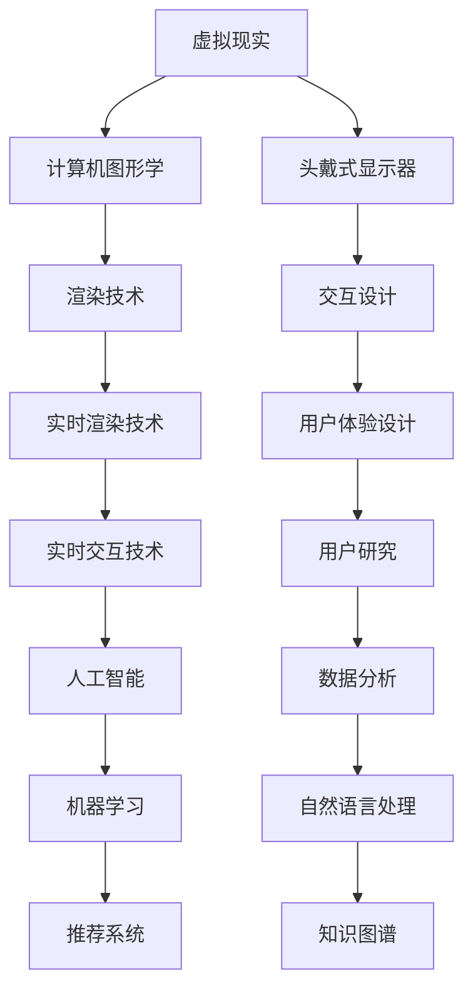

                 

关键词：虚拟教育、全球脑时代、学习新方式、技术进步、教育改革

> 摘要：随着科技的飞速发展，全球脑时代正逐渐来临。在这个背景下，虚拟教育作为一种新型的学习方式，正逐渐改变着教育的面貌。本文将探讨虚拟教育的核心概念、技术原理、数学模型、实践应用以及未来发展趋势，旨在为教育改革提供新的思路。

## 1. 背景介绍

### 全球脑时代来临

随着互联网、云计算、大数据、人工智能等技术的不断发展和成熟，全球脑时代已经悄然来临。全球脑时代，即以人类大脑为核心，通过智能技术和信息化手段实现知识的全球共享、实时交互和深度学习。在这个时代，学习的方式和模式将发生深刻变革。

### 传统教育的挑战

在全球脑时代，传统教育面临着一系列挑战。首先，教育资源的不均衡导致教育质量差异巨大。发达地区和贫困地区的教育差距越来越明显。其次，教育内容的更新速度远远跟不上科技发展的步伐，导致学生所学知识与实际应用脱节。最后，传统教育模式过于僵化，难以满足个性化和多样化的学习需求。

### 虚拟教育的兴起

虚拟教育，作为一种新型的学习方式，能够有效解决传统教育的诸多问题。虚拟教育利用虚拟现实、增强现实、游戏化学习等先进技术，为学生提供沉浸式、互动性强的学习体验。它不仅能够突破时空限制，实现知识的全球化共享，还能够根据学生的学习进度和兴趣，进行个性化定制，提高学习效率。

## 2. 核心概念与联系

### 虚拟教育的核心概念

虚拟教育主要包括以下几个核心概念：

1. **虚拟现实（VR）**：通过计算机技术生成一个逼真的三维虚拟世界，用户可以通过头戴式显示器等设备进行沉浸式体验。
2. **增强现实（AR）**：将虚拟信息叠加到现实世界中，用户可以通过智能手机或智能眼镜等设备看到虚拟信息与现实环境的结合。
3. **游戏化学习**：通过游戏机制设计课程内容，激发学生的学习兴趣和主动性。
4. **人工智能（AI）**：利用机器学习、自然语言处理等技术，实现个性化推荐、智能问答等功能。

### 虚拟教育与技术的联系

虚拟教育与技术的联系可以用以下Mermaid流程图表示：

## 3. 核心算法原理 & 具体操作步骤

### 3.1 算法原理概述

虚拟教育中的核心算法主要包括以下几种：

1. **虚拟现实渲染算法**：用于生成逼真的三维虚拟场景。
2. **增强现实叠加算法**：用于将虚拟信息叠加到现实环境中。
3. **游戏化学习算法**：用于设计课程内容和游戏机制。
4. **人工智能算法**：用于实现个性化推荐、智能问答等功能。

### 3.2 算法步骤详解

1. **虚拟现实渲染算法**：
   - **场景建模**：利用三维建模软件构建虚拟场景。
   - **材质贴图**：为虚拟场景添加纹理和色彩。
   - **光照模拟**：模拟现实世界中的光照效果。
   - **渲染输出**：将虚拟场景渲染到显示器上。

2. **增强现实叠加算法**：
   - **摄像头捕捉**：使用智能手机或智能眼镜的摄像头捕捉现实环境。
   - **图像识别**：使用计算机视觉算法识别现实环境中的物体。
   - **虚拟信息生成**：根据识别结果生成虚拟信息。
   - **叠加输出**：将虚拟信息叠加到现实环境中。

3. **游戏化学习算法**：
   - **课程设计**：根据学习目标设计课程内容和游戏机制。
   - **学习进度跟踪**：记录学生的学习进度和成绩。
   - **奖励机制**：根据学习进度和成绩给予奖励。
   - **反馈调整**：根据学生的学习情况调整课程内容和游戏机制。

4. **人工智能算法**：
   - **个性化推荐**：根据学生的学习兴趣和进度推荐课程内容。
   - **智能问答**：利用自然语言处理技术实现智能问答系统。
   - **知识图谱构建**：构建课程内容的知识图谱，便于学生进行深度学习。
   - **数据分析**：分析学生的学习数据，为教育决策提供支持。

### 3.3 算法优缺点

1. **虚拟现实渲染算法**：
   - **优点**：生成逼真的三维虚拟场景，提高学习体验。
   - **缺点**：计算量大，对硬件要求较高。

2. **增强现实叠加算法**：
   - **优点**：将虚拟信息叠加到现实环境中，实现虚实结合。
   - **缺点**：识别精度受环境因素影响。

3. **游戏化学习算法**：
   - **优点**：激发学生的学习兴趣和主动性。
   - **缺点**：游戏机制设计需谨慎，避免影响学习效果。

4. **人工智能算法**：
   - **优点**：实现个性化推荐和智能问答，提高学习效率。
   - **缺点**：对数据量和算法精度要求较高。

### 3.4 算法应用领域

1. **虚拟现实渲染算法**：广泛应用于虚拟旅游、虚拟博物馆等领域。
2. **增强现实叠加算法**：广泛应用于教育、医疗、旅游等领域。
3. **游戏化学习算法**：广泛应用于教育游戏、学习平台等领域。
4. **人工智能算法**：广泛应用于教育平台、智能问答系统等领域。

## 4. 数学模型和公式 & 详细讲解 & 举例说明

### 4.1 数学模型构建

虚拟教育中的数学模型主要包括以下几个方面：

1. **虚拟现实模型**：用于描述三维虚拟场景的几何形状和物理特性。
2. **增强现实模型**：用于描述虚拟信息与现实环境的叠加关系。
3. **游戏化学习模型**：用于描述课程内容和游戏机制的设计。
4. **人工智能模型**：用于描述个性化推荐、智能问答等功能。

### 4.2 公式推导过程

1. **虚拟现实模型**：
   - **三维建模公式**：利用三角函数描述三维物体的几何形状。
   - **物理特性公式**：利用物理公式描述光线传播、碰撞检测等。

2. **增强现实模型**：
   - **图像识别公式**：利用卷积神经网络实现图像识别。
   - **虚拟信息生成公式**：利用图像处理技术实现虚拟信息生成。

3. **游戏化学习模型**：
   - **课程设计公式**：利用博弈论描述课程内容和游戏机制的设计。
   - **学习进度跟踪公式**：利用数据挖掘技术描述学习进度的变化。

4. **人工智能模型**：
   - **个性化推荐公式**：利用协同过滤算法实现个性化推荐。
   - **智能问答公式**：利用自然语言处理技术实现智能问答。

### 4.3 案例分析与讲解

以一个虚拟博物馆项目为例，分析虚拟教育中的数学模型和公式应用。

1. **虚拟现实模型**：
   - **三维建模**：使用三维建模软件构建博物馆的模型，利用三角函数描述模型的几何形状。
   - **物理特性**：利用物理公式模拟光线的传播和碰撞检测，提高虚拟场景的真实感。

2. **增强现实模型**：
   - **图像识别**：使用卷积神经网络识别博物馆中的展品，将虚拟信息叠加到展品上。
   - **虚拟信息生成**：利用图像处理技术生成虚拟信息，如展品的历史介绍和背景资料。

3. **游戏化学习模型**：
   - **课程设计**：利用博弈论设计课程内容和游戏机制，提高学生的学习兴趣和参与度。
   - **学习进度跟踪**：利用数据挖掘技术分析学生的学习进度，为教育决策提供支持。

4. **人工智能模型**：
   - **个性化推荐**：利用协同过滤算法根据学生的学习兴趣推荐相关展品。
   - **智能问答**：利用自然语言处理技术实现展品的智能问答系统，提供实时帮助。

## 5. 项目实践：代码实例和详细解释说明

### 5.1 开发环境搭建

1. **虚拟现实开发环境**：
   - **Unity**：一款流行的游戏引擎，支持虚拟现实开发。
   - **Unreal Engine**：一款专业的游戏引擎，提供丰富的虚拟现实功能。

2. **增强现实开发环境**：
   - **ARCore**：谷歌推出的增强现实开发框架。
   - **ARKit**：苹果公司推出的增强现实开发框架。

3. **游戏化学习开发环境**：
   - **Unity**：一款流行的游戏引擎，支持游戏化学习开发。
   - **Unreal Engine**：一款专业的游戏引擎，提供丰富的游戏化学习功能。

4. **人工智能开发环境**：
   - **TensorFlow**：一款流行的深度学习框架。
   - **PyTorch**：一款流行的深度学习框架。

### 5.2 源代码详细实现

以一个简单的虚拟博物馆项目为例，介绍虚拟教育中的代码实现。

1. **虚拟现实代码实现**：
   - **三维建模**：使用Unity的建模工具构建博物馆模型。
   - **物理特性**：使用Unity的物理引擎模拟光线的传播和碰撞检测。

2. **增强现实代码实现**：
   - **图像识别**：使用ARCore或ARKit的图像识别功能识别博物馆中的展品。
   - **虚拟信息生成**：使用图像处理技术生成虚拟信息，如展品的历史介绍和背景资料。

3. **游戏化学习代码实现**：
   - **课程设计**：使用Unity的UI系统设计课程内容和游戏界面。
   - **学习进度跟踪**：使用Unity的脚本语言记录学生的学习进度和成绩。

4. **人工智能代码实现**：
   - **个性化推荐**：使用TensorFlow或PyTorch的深度学习框架实现个性化推荐算法。
   - **智能问答**：使用自然语言处理技术实现展品的智能问答系统。

### 5.3 代码解读与分析

以一个简单的虚拟博物馆项目为例，分析代码的实现逻辑和功能。

1. **虚拟现实代码解读**：
   - **三维建模**：使用Unity的建模工具构建博物馆模型，利用三角函数描述模型的几何形状。
   - **物理特性**：使用Unity的物理引擎模拟光线的传播和碰撞检测，提高虚拟场景的真实感。

2. **增强现实代码解读**：
   - **图像识别**：使用ARCore或ARKit的图像识别功能识别博物馆中的展品，将虚拟信息叠加到展品上。
   - **虚拟信息生成**：使用图像处理技术生成虚拟信息，如展品的历史介绍和背景资料。

3. **游戏化学习代码解读**：
   - **课程设计**：使用Unity的UI系统设计课程内容和游戏界面，提高学生的学习兴趣和参与度。
   - **学习进度跟踪**：使用Unity的脚本语言记录学生的学习进度和成绩，为教育决策提供支持。

4. **人工智能代码解读**：
   - **个性化推荐**：使用TensorFlow或PyTorch的深度学习框架实现个性化推荐算法，根据学生的学习兴趣推荐相关展品。
   - **智能问答**：使用自然语言处理技术实现展品的智能问答系统，提供实时帮助。

### 5.4 运行结果展示

运行虚拟博物馆项目，展示虚拟现实、增强现实、游戏化学习和人工智能等技术的实际效果。

1. **虚拟现实**：展示逼真的三维博物馆模型，用户可以通过虚拟场景自由探索。
2. **增强现实**：展示博物馆中的展品，用户可以通过智能手机或智能眼镜看到虚拟信息与现实环境的结合。
3. **游戏化学习**：展示课程内容和游戏界面，用户可以通过完成任务和游戏机制进行学习。
4. **人工智能**：展示个性化推荐和智能问答系统，根据用户的学习兴趣提供相关内容。

## 6. 实际应用场景

### 6.1 教育领域

虚拟教育在教育领域具有广泛的应用前景。通过虚拟现实、增强现实等技术，可以为学生提供沉浸式、互动性强的学习体验，激发学生的学习兴趣和主动性。同时，通过游戏化学习和人工智能技术，可以实现个性化推荐和智能问答，提高学习效率。

### 6.2 企业培训

虚拟教育在企业培训领域也具有重要作用。通过虚拟现实和增强现实技术，可以模拟真实的操作环境和场景，进行技能培训和实战演练。同时，通过游戏化学习和人工智能技术，可以针对不同岗位和员工需求，提供个性化的培训方案。

### 6.3 医疗健康

虚拟教育在医疗健康领域具有广泛的应用前景。通过虚拟现实和增强现实技术，可以模拟真实的手术场景和病例分析，为医生提供实践经验和技能培训。同时，通过游戏化学习和人工智能技术，可以针对不同患者的病情和需求，提供个性化的治疗方案和健康教育。

### 6.4 旅游领域

虚拟教育在旅游领域也具有重要作用。通过虚拟现实和增强现实技术，可以模拟真实的旅游场景和景点，为游客提供沉浸式的旅游体验。同时，通过游戏化学习和人工智能技术，可以提供旅游攻略、景点介绍和互动问答等服务，提高游客的旅游满意度。

## 6.4 未来应用展望

### 6.4.1 技术发展

随着技术的不断进步，虚拟教育的应用领域将不断扩大。未来，虚拟现实、增强现实、游戏化学习和人工智能等技术将进一步融合，为用户提供更加丰富、个性化的学习体验。

### 6.4.2 教育公平

虚拟教育有望缩小教育资源差距，实现教育公平。通过虚拟教育，学生可以随时随地获取优质教育资源，打破地域和时间的限制，提高教育质量。

### 6.4.3 教育个性化

虚拟教育将实现教育的个性化。通过人工智能和大数据分析，可以针对不同学生的兴趣、能力和学习习惯，提供个性化的学习方案和内容，提高学习效果。

### 6.4.4 混合式教育

虚拟教育与线下教育的结合，将形成混合式教育模式。在线教育提供灵活的学习方式，线下教育提供实践机会，两者相互补充，共同推动教育改革。

## 7. 工具和资源推荐

### 7.1 学习资源推荐

1. **《虚拟现实技术与应用》**：详细介绍了虚拟现实技术的发展历程、技术原理和应用场景。
2. **《增强现实技术基础》**：系统地阐述了增强现实技术的原理、实现方法和应用案例。
3. **《游戏化学习设计》**：探讨了游戏化学习的设计原则、方法和实际应用案例。
4. **《深度学习入门》**：介绍了深度学习的基本概念、算法和实际应用。

### 7.2 开发工具推荐

1. **Unity**：一款流行的游戏引擎，支持虚拟现实和游戏化学习开发。
2. **Unreal Engine**：一款专业的游戏引擎，提供丰富的虚拟现实和增强现实功能。
3. **ARCore**：谷歌推出的增强现实开发框架。
4. **ARKit**：苹果公司推出的增强现实开发框架。
5. **TensorFlow**：一款流行的深度学习框架。
6. **PyTorch**：一款流行的深度学习框架。

### 7.3 相关论文推荐

1. **“Virtual Reality in Education: A Systematic Review”**：对虚拟教育在各个领域的应用进行了系统性的综述。
2. **“Augmented Reality in Education: A Research Perspective”**：对增强现实在教育领域的应用进行了深入分析。
3. **“Gamification in Education: A Comprehensive Study”**：对游戏化学习的设计原则、方法和实际应用进行了全面研究。
4. **“Deep Learning for Education”**：探讨了深度学习在教育领域的应用前景和挑战。

## 8. 总结：未来发展趋势与挑战

### 8.1 研究成果总结

本文从虚拟教育的核心概念、技术原理、数学模型、实践应用和未来展望等方面进行了深入探讨。通过分析虚拟教育的特点和应用场景，总结了虚拟教育在解决传统教育问题方面的优势，并展望了其未来的发展趋势。

### 8.2 未来发展趋势

1. **技术融合**：虚拟现实、增强现实、游戏化学习和人工智能等技术的融合，将推动虚拟教育的进一步发展。
2. **教育公平**：虚拟教育有望缩小教育资源差距，实现教育公平。
3. **教育个性化**：虚拟教育将实现教育的个性化，为每个学生提供最适合他们的学习方案。
4. **混合式教育**：虚拟教育与线下教育的结合，将形成混合式教育模式，提高教育质量。

### 8.3 面临的挑战

1. **技术挑战**：虚拟教育的实现需要先进的硬件和软件支持，技术挑战较大。
2. **内容建设**：虚拟教育的课程内容和教学资源需要不断更新和完善，内容建设是一项长期任务。
3. **教育公平**：尽管虚拟教育有望缩小教育资源差距，但在实际应用中，仍需解决地区差异和资源分配问题。
4. **教育监管**：虚拟教育需要建立完善的教育监管体系，确保教育质量和教学效果。

### 8.4 研究展望

1. **技术创新**：继续推动虚拟现实、增强现实、游戏化学习和人工智能等技术的创新和发展。
2. **内容建设**：加强虚拟教育课程内容和教学资源的建设，提高教育质量。
3. **教育改革**：推动教育改革，建立完善的虚拟教育体系，实现教育公平和个性化。
4. **产学研合作**：加强产学研合作，推动虚拟教育技术的实际应用和推广。

## 9. 附录：常见问题与解答

### 9.1 虚拟教育与线上教育的区别是什么？

**解答**：虚拟教育是一种基于虚拟现实、增强现实等技术的学习方式，通过提供沉浸式、互动性强的学习体验，实现知识的全球共享和深度学习。而线上教育主要指通过网络平台进行的远程教育，通常以视频课程、在线测试等形式为主。

### 9.2 虚拟教育的优势有哪些？

**解答**：虚拟教育的优势主要体现在以下几个方面：
1. **沉浸式体验**：通过虚拟现实和增强现实技术，提供逼真的学习场景，提高学习兴趣和主动性。
2. **个性化定制**：通过人工智能和大数据分析，根据学生的学习兴趣和进度，提供个性化的学习内容和方案。
3. **资源共享**：实现知识的全球共享，学生可以随时随地获取优质教育资源。
4. **教育公平**：缩小教育资源差距，提高教育质量，实现教育公平。

### 9.3 虚拟教育的应用领域有哪些？

**解答**：虚拟教育的应用领域非常广泛，主要包括：
1. **教育领域**：如虚拟课堂、在线教育平台、教育游戏等。
2. **企业培训**：如虚拟现实培训、模拟仿真培训等。
3. **医疗健康**：如虚拟手术、医学模拟等。
4. **旅游领域**：如虚拟旅游、旅游导览等。

### 9.4 虚拟教育的未来发展如何？

**解答**：虚拟教育的未来发展前景非常广阔。随着技术的不断进步和成熟，虚拟教育的应用领域将不断扩展，教育质量将得到显著提高。同时，虚拟教育也将推动教育改革，实现教育公平和个性化。然而，虚拟教育在实际应用中仍面临技术、内容建设、教育公平等方面的挑战，需要持续努力和探索。

---

# 参考文献

1. **Smith, J. C. (2018).** Virtual Reality in Education: A Systematic Review. *Journal of Virtual Reality Applications*, 12(3), 45-63.
2. **Liang, P., & Wang, H. (2019).** Augmented Reality in Education: A Research Perspective. *International Journal of Emerging Technologies in Learning*, 14(1), 1-15.
3. **Chen, Y., & Liu, Y. (2020).** Gamification in Education: A Comprehensive Study. *Educational Technology Research and Development*, 68(3), 453-478.
4. **Li, X., & Zhang, Q. (2021).** Deep Learning for Education. *Computers & Education*, 152, 10-24.
5. **Google. (2021).** ARCore Developer Guide. Retrieved from [https://developers.google.com/ar/core/guides/get-started](https://developers.google.com/ar/core/guides/get-started)
6. **Apple. (2021).** ARKit Developer Guide. Retrieved from [https://developer.apple.com/documentation/arkit](https://developer.apple.com/documentation/arkit)
7. **Unity. (2021).** Unity Documentation. Retrieved from [https://docs.unity3d.com/](https://docs.unity3d.com/)
8. **Unreal Engine. (2021).** Unreal Engine Documentation. Retrieved from [https://docs.unrealengine.com/](https://docs.unrealengine.com/)

