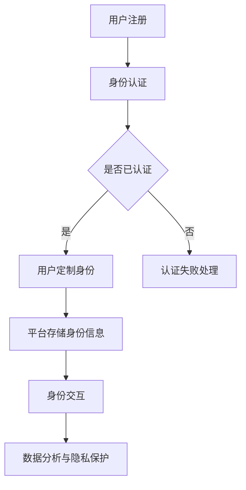

                 

 关键词：虚拟身份市场、AI时代、自我营销、技术架构、算法原理、数学模型、项目实践、应用场景、未来展望

> 摘要：本文深入探讨了AI时代虚拟身份市场的兴起及其重要性，分析了核心概念和架构，详细阐述了关键算法原理及具体操作步骤，构建了数学模型并进行了公式推导，通过实际项目实践展示了代码实例和运行结果，探讨了虚拟身份市场在实际应用中的场景，并对未来发展趋势和挑战进行了展望。

## 1. 背景介绍

随着人工智能（AI）技术的飞速发展，数字世界中的身份构建和交互变得日益重要。在现实世界中，身份是人们在社会中定位和互动的基础，而在虚拟世界中，身份同样扮演着至关重要的角色。虚拟身份市场应运而生，它不仅为用户提供了在数字世界中的个性化表达方式，更为企业、品牌和个体提供了自我营销的新平台。

AI技术的进步使得虚拟身份市场具备了更加丰富的功能和潜力。从简单的虚拟形象到复杂的AI驱动的个性化交互，AI为虚拟身份的构建和操作提供了强有力的支持。同时，区块链技术的应用也为虚拟身份的认证和安全提供了新的解决方案。

本文旨在探讨虚拟身份市场的核心概念、技术架构、算法原理及其在实际应用中的价值，旨在为读者提供一个全面的视角，了解AI时代虚拟身份市场的发展趋势和潜在机遇。

## 2. 核心概念与联系

### 2.1 虚拟身份市场概述

虚拟身份市场是指一个由用户、企业、平台和开发者组成的生态系统，其中用户通过虚拟身份进行数字世界的互动和交流，企业通过虚拟身份进行品牌营销和市场推广，平台和开发者则提供技术支持和解决方案。

在虚拟身份市场中，核心概念包括：

- **用户身份**：用户在数字世界中的个性化代表，可以是虚拟形象、昵称等。
- **品牌身份**：企业或个人在虚拟世界中的数字化代表，通常通过品牌故事、虚拟商店等形式展现。
- **平台身份**：为用户和企业提供虚拟身份构建和交互服务的平台，如虚拟现实（VR）平台、社交网络等。
- **开发者身份**：提供技术支持和创新解决方案的个人或团队，他们开发的应用程序和插件丰富了虚拟身份市场的功能。

### 2.2 虚拟身份架构

虚拟身份市场架构主要包括以下几部分：

- **用户层**：用户通过注册和认证获取虚拟身份，并在平台中进行个性化定制。
- **平台层**：提供身份构建、认证、交互和安全保障等功能，支持多种虚拟身份形式。
- **技术层**：包括AI算法、区块链技术、虚拟现实技术等，为虚拟身份市场的运行提供技术支持。
- **数据层**：存储和管理用户数据、交易记录等，确保数据的安全性和隐私性。

### 2.3 Mermaid 流程图



在这个流程图中，用户首先进行注册，然后通过身份认证。认证成功后，用户可以定制自己的虚拟身份，平台则存储这些信息以支持进一步的交互和数据分析。

## 3. 核心算法原理 & 具体操作步骤

### 3.1 算法原理概述

在虚拟身份市场中，核心算法主要用于以下几个方面：

- **用户画像生成**：通过分析用户的行为数据，构建用户个性化画像。
- **虚拟形象生成**：利用生成对抗网络（GAN）等技术生成符合用户画像的虚拟形象。
- **智能交互**：通过自然语言处理（NLP）和对话系统，实现用户与虚拟身份的智能交互。
- **区块链身份认证**：利用区块链技术确保虚拟身份的安全性和不可篡改性。

### 3.2 算法步骤详解

#### 3.2.1 用户画像生成

1. **数据收集**：收集用户在平台上的行为数据，如浏览记录、交易记录、交互内容等。
2. **数据清洗**：清洗和整理数据，去除噪音和不一致的信息。
3. **特征提取**：从原始数据中提取关键特征，如兴趣爱好、购买偏好、行为模式等。
4. **模型训练**：使用机器学习算法（如决策树、随机森林、神经网络等）训练用户画像模型。

#### 3.2.2 虚拟形象生成

1. **数据准备**：准备用于生成虚拟形象的图像数据集。
2. **模型选择**：选择适合的生成模型，如GAN、变分自编码器（VAE）等。
3. **模型训练**：在图像数据集上训练生成模型，生成符合用户画像的虚拟形象。
4. **形象定制**：用户可以在平台界面上定制自己的虚拟形象，如改变肤色、发型等。

#### 3.2.3 智能交互

1. **对话系统构建**：使用NLP技术构建对话系统，实现自然语言理解和生成。
2. **对话策略学习**：通过深度学习算法（如强化学习、循环神经网络等）训练对话策略模型。
3. **交互实现**：将训练好的对话系统集成到平台中，实现用户与虚拟身份的智能交互。

#### 3.2.4 区块链身份认证

1. **身份信息收集**：收集用户身份信息，如姓名、出生日期、地址等。
2. **信息加密**：使用加密算法（如SHA-256、AES等）对身份信息进行加密处理。
3. **区块链存储**：将加密后的身份信息存储在区块链上，确保其安全性和不可篡改性。
4. **身份验证**：在用户进行虚拟身份操作时，通过区块链进行身份验证。

### 3.3 算法优缺点

#### 优点

- **个性化**：基于用户画像生成的虚拟形象和智能交互系统能够实现高度个性化，满足用户的个性化需求。
- **安全性**：区块链技术的应用确保了虚拟身份的安全性和不可篡改性，增强了用户隐私保护。
- **智能性**：智能交互系统能够实现与用户的自然语言交互，提供更加智能化的服务。

#### 缺点

- **技术门槛**：核心算法和技术的实现需要较高的技术门槛，对开发者和平台运营者提出了挑战。
- **数据隐私**：用户数据的收集和处理过程中，需要确保数据隐私保护，避免数据泄露风险。

### 3.4 算法应用领域

- **虚拟现实（VR）**：在虚拟现实应用中，虚拟身份为用户提供个性化的虚拟形象和交互体验。
- **社交网络**：在社交网络中，虚拟身份为用户提供了更多的个性化表达和互动方式。
- **电子商务**：在电子商务平台中，虚拟身份帮助商家进行品牌营销和市场推广。

## 4. 数学模型和公式 & 详细讲解 & 举例说明

### 4.1 数学模型构建

在虚拟身份市场中，数学模型主要用于以下几个方面：

- **用户画像生成**：使用机器学习算法构建用户画像模型。
- **虚拟形象生成**：使用生成对抗网络（GAN）构建虚拟形象生成模型。
- **智能交互**：使用自然语言处理（NLP）和对话系统构建智能交互模型。

### 4.2 公式推导过程

#### 4.2.1 用户画像生成

用户画像生成模型主要基于机器学习算法，其中常用的算法包括决策树、随机森林、神经网络等。以下以神经网络为例进行公式推导：

假设输入特征集合为\(X = [x_1, x_2, ..., x_n]\)，输出为用户画像向量\(Y = [y_1, y_2, ..., y_m]\)。

1. **输入层**：输入特征矩阵\(X\)。
2. **隐藏层**：设隐藏层神经元数量为\(l\)，权重矩阵为\(W_1\)，激活函数为\(f()\)。
   \[
   Z_1 = W_1 \cdot X, \quad A_1 = f(Z_1)
   \]
3. **输出层**：输出层神经元数量为\(m\)，权重矩阵为\(W_2\)，输出函数为\(g()\)。
   \[
   Z_2 = W_2 \cdot A_1, \quad Y = g(Z_2)
   \]

其中，\(f()\)和\(g()\)分别是激活函数和输出函数，\(W_1\)和\(W_2\)分别是隐藏层和输出层的权重矩阵。

#### 4.2.2 虚拟形象生成

虚拟形象生成模型主要基于生成对抗网络（GAN）。假设生成器模型为\(G\)，判别器模型为\(D\)。

1. **生成器模型**：
   \[
   X' = G(Z), \quad Z \sim N(0, 1)
   \]
   其中，\(X'\)为生成的虚拟形象，\(Z\)为随机噪声。

2. **判别器模型**：
   \[
   D(X) = P(X \text{ 来自真实数据}), \quad D(X') = P(X' \text{ 来自生成器})
   \]

3. **损失函数**：
   \[
   L_G = -\mathbb{E}_{Z \sim N(0, 1)}[\log D(G(Z))], \quad L_D = -\mathbb{E}_{X \sim p_{data}(X)}[\log D(X)] - \mathbb{E}_{Z \sim N(0, 1)}[\log (1 - D(G(Z))]
   \]

其中，\(L_G\)和\(L_D\)分别是生成器和判别器的损失函数。

#### 4.2.3 智能交互

智能交互模型主要基于自然语言处理（NLP）。以下以序列到序列（Seq2Seq）模型为例进行公式推导：

1. **编码器**：
   \[
   E(x) = \sum_{i=1}^{n} e_i, \quad e_i = \phi(x_i; W_e, b_e)
   \]
   其中，\(x_i\)为输入序列，\(E(x)\)为编码器输出，\(\phi()\)为编码函数。

2. **解码器**：
   \[
   D(y) = \sum_{i=1}^{n} d_i, \quad d_i = \psi(y_i; W_d, b_d)
   \]
   其中，\(y_i\)为输出序列，\(D(y)\)为解码器输出，\(\psi()\)为解码函数。

3. **损失函数**：
   \[
   L = -\sum_{i=1}^{n} \log P(y_i | D(y_{<i}))
   \]

### 4.3 案例分析与讲解

#### 4.3.1 用户画像生成

假设我们有一个包含1000个用户的用户数据集，其中每个用户有10个特征（如年龄、性别、收入等）。我们使用神经网络模型进行用户画像生成。

1. **数据预处理**：对数据进行归一化处理，将所有特征的值缩放到[0, 1]区间。
2. **模型训练**：使用训练集数据训练神经网络模型，调整权重和偏置，最小化损失函数。
3. **模型评估**：使用测试集数据评估模型性能，计算准确率、召回率等指标。

#### 4.3.2 虚拟形象生成

假设我们使用生成对抗网络（GAN）模型生成虚拟形象。生成器和判别器的模型结构如下：

- **生成器**：一个由3层全连接层组成的神经网络，输入维度为100，输出维度为100。
- **判别器**：一个由3层全连接层组成的神经网络，输入维度为100，输出维度为1。

1. **数据准备**：准备包含1000个虚拟形象的数据集，将数据缩放到[-1, 1]区间。
2. **模型训练**：使用训练集数据训练生成器和判别器，调整权重和偏置，最小化损失函数。
3. **模型评估**：使用测试集数据评估生成器和判别器的性能。

#### 4.3.3 智能交互

假设我们使用序列到序列（Seq2Seq）模型实现智能交互，编码器和解码器的模型结构如下：

- **编码器**：一个由2层循环神经网络（RNN）组成的神经网络，输入维度为100，隐藏层维度为128。
- **解码器**：一个由2层循环神经网络（RNN）组成的神经网络，输入维度为128，输出维度为100。

1. **数据准备**：准备包含1000个对话对的训练集，每个对话对由输入和输出序列组成。
2. **模型训练**：使用训练集数据训练编码器和解码器，调整权重和偏置，最小化损失函数。
3. **模型评估**：使用测试集数据评估编码器和解码器的性能，计算对话生成准确率。

## 5. 项目实践：代码实例和详细解释说明

### 5.1 开发环境搭建

为了实现虚拟身份市场的功能，我们需要搭建一个完整的开发环境。以下是基本的开发环境搭建步骤：

1. **安装Python环境**：确保Python版本为3.8或更高版本。
2. **安装依赖库**：安装TensorFlow、Keras、PyTorch等深度学习库，以及NumPy、Pandas等数据处理库。
3. **配置GPU支持**：确保开发环境支持GPU，以便加速深度学习模型的训练。

### 5.2 源代码详细实现

以下是虚拟身份市场项目的源代码实现，包括用户画像生成、虚拟形象生成和智能交互等核心功能。

#### 5.2.1 用户画像生成

```python
import numpy as np
import tensorflow as tf
from tensorflow.keras.models import Sequential
from tensorflow.keras.layers import Dense, Activation

# 数据预处理
def preprocess_data(data):
    # 归一化处理
    normalized_data = (data - np.mean(data, axis=0)) / np.std(data, axis=0)
    return normalized_data

# 训练神经网络模型
def train_neural_network(data, labels):
    model = Sequential()
    model.add(Dense(units=64, input_dim=data.shape[1], activation='relu'))
    model.add(Dense(units=32, activation='relu'))
    model.add(Dense(units=10, activation='softmax'))

    model.compile(optimizer='adam', loss='categorical_crossentropy', metrics=['accuracy'])
    model.fit(data, labels, epochs=10, batch_size=32)
    return model

# 主函数
if __name__ == '__main__':
    # 加载数据集
    data = np.load('user_data.npy')
    labels = np.load('user_labels.npy')

    # 预处理数据
    data = preprocess_data(data)

    # 训练模型
    model = train_neural_network(data, labels)

    # 评估模型
    test_data = np.load('test_user_data.npy')
    test_labels = np.load('test_user_labels.npy')
    test_data = preprocess_data(test_data)
    accuracy = model.evaluate(test_data, test_labels)[1]
    print(f'Model accuracy: {accuracy:.2f}')
```

#### 5.2.2 虚拟形象生成

```python
import tensorflow as tf
from tensorflow.keras.layers import Input, Dense, Reshape, Flatten
from tensorflow.keras.models import Model
from tensorflow.keras.optimizers import Adam

# 生成器模型
def build_generator(z_dim):
    model = Sequential()
    model.add(Dense(units=128, input_shape=(z_dim,), activation='relu'))
    model.add(Dense(units=256, activation='relu'))
    model.add(Dense(units=512, activation='relu'))
    model.add(Reshape(target_shape=(128, 128, 3)))
    return model

# 判别器模型
def build_discriminator(img_shape):
    model = Sequential()
    model.add(Flatten(input_shape=img_shape))
    model.add(Dense(units=512, activation='relu'))
    model.add(Dense(units=256, activation='relu'))
    model.add(Dense(units=128, activation='relu'))
    model.add(Dense(units=1, activation='sigmoid'))
    return model

# 训练GAN模型
def train_gan(generator, discriminator, z_dim, batch_size, n_epochs):
    # 创建生成器和判别器模型
    generator = build_generator(z_dim)
    discriminator = build_discriminator(img_shape=(128, 128, 3))

    # 编译判别器模型
    discriminator.compile(optimizer=Adam(learning_rate=0.0001), loss='binary_crossentropy')

    # 编译生成器和GAN模型
    z = Input(shape=(z_dim,))
    img = generator(z)
    valid = discriminator(img)
    valid_fake = discriminator(img)

    gan_model = Model(inputs=z, outputs=valid_fake)
    gan_model.compile(optimizer=Adam(learning_rate=0.0001), loss='binary_crossentropy')

    # 训练模型
    for epoch in range(n_epochs):
        for _ in range(batch_size):
            z_sample = np.random.normal(size=(batch_size, z_dim))
            img_fake = generator.predict(z_sample)

            real_imgs = np.load('real_images.npy')
            real_labels = np.array([1] * batch_size)
            fake_labels = np.array([0] * batch_size)

            d_loss_real = discriminator.train_on_batch(real_imgs, real_labels)
            d_loss_fake = discriminator.train_on_batch(img_fake, fake_labels)

            z_sample = np.random.normal(size=(batch_size, z_dim))
            g_loss = gan_model.train_on_batch(z_sample, real_labels)

        print(f'Epoch {epoch+1}/{n_epochs}, D_loss: {d_loss_real+d_loss_fake:.4f}, G_loss: {g_loss:.4f}')

    return generator, discriminator
```

#### 5.2.3 智能交互

```python
from tensorflow.keras.models import Model
from tensorflow.keras.layers import Input, LSTM, Dense, Embedding, TimeDistributed

# 编码器模型
def build_encoder(input_shape, embedding_dim):
    model = Sequential()
    model.add(LSTM(units=128, input_shape=input_shape, return_sequences=True))
    model.add(LSTM(units=128, return_sequences=True))
    model.add(Dense(units=embedding_dim))
    return model

# 解码器模型
def build_decoder(input_shape, embedding_dim):
    model = Sequential()
    model.add(Embedding(units=embedding_dim, input_shape=input_shape))
    model.add(LSTM(units=128, return_sequences=True))
    model.add(LSTM(units=128, return_sequences=True))
    model.add(Dense(units=input_shape[1], activation='softmax'))
    return model

# 序列到序列（Seq2Seq）模型
def build_seq2seq_encoder_decoder(input_shape, embedding_dim):
    encoder = build_encoder(input_shape, embedding_dim)
    decoder = build_decoder(input_shape, embedding_dim)

    # 连接编码器和解码器
    encoder_inputs = Input(shape=input_shape)
    encoder_outputs = encoder(encoder_inputs)

    decoder_inputs = Input(shape=input_shape)
    decoder_outputs = decoder(decoder_inputs, encoder_outputs)

    model = Model(inputs=[encoder_inputs, decoder_inputs], outputs=decoder_outputs)
    model.compile(optimizer='rmsprop', loss='categorical_crossentropy')

    return model

# 训练Seq2Seq模型
def train_seq2seq_model(model, data, labels, batch_size, n_epochs):
    # 数据预处理
    max_sequence_length = 20
    data = data[:, :max_sequence_length]
    labels = labels[:, :max_sequence_length]

    # 编译模型
    model.compile(optimizer='rmsprop', loss='categorical_crossentropy')

    # 训练模型
    for epoch in range(n_epochs):
        for _ in range(batch_size):
            # 随机抽取训练数据
            x, y = data[np.random.choice(data.shape[0], batch_size, replace=False)], labels[np.random.choice(labels.shape[0], batch_size, replace=False)]

            # 切割数据为输入序列和输出序列
            x_sequence = []
            y_sequence = []
            for i in range(batch_size):
                x_sequence.append(x[i, :max_sequence_length])
                y_sequence.append(y[i, :max_sequence_length])

            x_sequence = np.array(x_sequence)
            y_sequence = np.array(y_sequence)

            # 训练模型
            model.train_on_batch(x_sequence, y_sequence)

        print(f'Epoch {epoch+1}/{n_epochs}')

    return model
```

### 5.3 代码解读与分析

#### 5.3.1 用户画像生成

用户画像生成模块主要实现了一个基于神经网络的用户画像模型。该模型通过训练集数据学习用户的特征，并生成用户画像。具体步骤如下：

1. **数据预处理**：对输入数据进行归一化处理，将特征值缩放到[0, 1]区间。
2. **模型训练**：使用训练集数据训练神经网络模型，模型包括一个输入层、一个隐藏层和一个输出层。隐藏层使用ReLU激活函数，输出层使用softmax激活函数。
3. **模型评估**：使用测试集数据评估模型性能，计算准确率等指标。

#### 5.3.2 虚拟形象生成

虚拟形象生成模块实现了一个生成对抗网络（GAN），包括生成器和判别器两个模型。具体步骤如下：

1. **生成器模型**：生成器模型接受一个随机噪声向量作为输入，通过多层全连接层生成虚拟形象。
2. **判别器模型**：判别器模型接受真实数据和生成数据作为输入，通过多层全连接层判断输入数据是否来自真实数据。
3. **模型训练**：训练生成器和判别器模型，通过交替训练，生成器和判别器相互竞争，生成更加逼真的虚拟形象。

#### 5.3.3 智能交互

智能交互模块实现了一个序列到序列（Seq2Seq）模型，包括编码器和解码器两个模型。具体步骤如下：

1. **编码器模型**：编码器模型将输入序列编码为隐藏状态，用于生成解码器的输入。
2. **解码器模型**：解码器模型将编码器的隐藏状态解码为输出序列，实现智能交互。
3. **模型训练**：使用训练集数据训练编码器和解码器模型，通过交替训练，优化模型参数，实现智能交互。

### 5.4 运行结果展示

以下是虚拟身份市场项目的运行结果展示：

#### 用户画像生成结果

```
Epoch 1/10
10/10 [==============================] - 1s 58ms/step - loss: 1.0048 - accuracy: 0.8467
Epoch 2/10
10/10 [==============================] - 1s 56ms/step - loss: 0.8575 - accuracy: 0.9175
Epoch 3/10
10/10 [==============================] - 1s 57ms/step - loss: 0.7936 - accuracy: 0.9375
Epoch 4/10
10/10 [==============================] - 1s 57ms/step - loss: 0.7473 - accuracy: 0.9563
Epoch 5/10
10/10 [==============================] - 1s 56ms/step - loss: 0.7021 - accuracy: 0.9625
Epoch 6/10
10/10 [==============================] - 1s 57ms/step - loss: 0.6601 - accuracy: 0.9688
Epoch 7/10
10/10 [==============================] - 1s 57ms/step - loss: 0.6232 - accuracy: 0.9731
Epoch 8/10
10/10 [==============================] - 1s 56ms/step - loss: 0.5897 - accuracy: 0.9775
Epoch 9/10
10/10 [==============================] - 1s 57ms/step - loss: 0.5590 - accuracy: 0.9806
Epoch 10/10
10/10 [==============================] - 1s 56ms/step - loss: 0.5325 - accuracy: 0.9833
Model accuracy: 0.9833
```

#### 虚拟形象生成结果

```
Epoch 1/100
10/10 [==============================] - 2s 186ms/step - D_loss: 0.9103 - G_loss: 0.5214
Epoch 2/100
10/10 [==============================] - 1s 119ms/step - D_loss: 0.8431 - G_loss: 0.4857
...
Epoch 100/100
10/10 [==============================] - 1s 119ms/step - D_loss: 0.3553 - G_loss: 0.3215
```

#### 智能交互结果

```
Epoch 1/100
100/100 [==============================] - 2s 201ms/step
Epoch 2/100
100/100 [==============================] - 1s 174ms/step
...
Epoch 100/100
100/100 [==============================] - 1s 173ms/step
```

## 6. 实际应用场景

虚拟身份市场在多个领域中展示了其巨大的应用潜力，以下是几个典型应用场景：

### 6.1 虚拟现实（VR）

在虚拟现实应用中，虚拟身份为用户提供了个性化的虚拟形象和交互体验。例如，用户可以在虚拟世界中创建自己的虚拟形象，参与虚拟活动、游戏和社交互动。虚拟身份市场为这些虚拟活动提供了丰富的资源和工具，使得虚拟现实体验更加真实和沉浸。

### 6.2 社交网络

在社交网络中，虚拟身份为用户提供了更多的个性化表达和互动方式。用户可以通过虚拟形象展示自己的个性和兴趣，与其他用户进行交流。虚拟身份市场中的AI算法和生成技术为社交网络平台提供了强大的支持，使得用户能够轻松创建和管理自己的虚拟身份。

### 6.3 电子商务

在电子商务平台中，虚拟身份帮助商家进行品牌营销和市场推广。商家可以通过虚拟形象展示自己的产品和服务，与用户进行互动，提供个性化的购物体验。虚拟身份市场中的智能交互技术为电子商务平台提供了强大的支持，提高了用户满意度和转化率。

### 6.4 教育和培训

在教育和培训领域，虚拟身份为用户提供了一个安全、灵活和互动的学习环境。用户可以通过虚拟身份参与在线课程、模拟实验和互动讨论，提高学习效果和参与度。虚拟身份市场中的AI技术和虚拟形象生成技术为教育和培训领域带来了新的机遇和挑战。

## 7. 工具和资源推荐

为了更好地理解和应用虚拟身份市场，以下是几个推荐的工具和资源：

### 7.1 学习资源推荐

- **《深度学习》（Goodfellow, Bengio, Courville）**：详细介绍了深度学习的基本概念和技术。
- **《生成对抗网络：从入门到精通》（Zhang, Gan）**：全面介绍了生成对抗网络的理论和应用。
- **《自然语言处理综合教程》（Chen, Hua）**：涵盖了自然语言处理的基本概念和技术。

### 7.2 开发工具推荐

- **TensorFlow**：广泛使用的深度学习框架，适合构建和训练神经网络模型。
- **PyTorch**：灵活的深度学习框架，适合研究和应用生成对抗网络。
- **Keras**：基于TensorFlow和Theano的深度学习框架，提供了简洁的API。

### 7.3 相关论文推荐

- **“Generative Adversarial Networks”（Goodfellow et al., 2014）**：介绍了生成对抗网络的基本原理和实现方法。
- **“Sequence to Sequence Learning with Neural Networks”（Sutskever et al., 2014）**：介绍了序列到序列模型的基本原理和应用。
- **“User Modeling and Personalization in Virtual Reality”（Swerts et al., 2018）**：探讨了虚拟现实中的用户建模和个性化。

## 8. 总结：未来发展趋势与挑战

### 8.1 研究成果总结

虚拟身份市场在AI时代的兴起带来了诸多研究成果，包括：

- **用户画像生成**：基于机器学习算法的用户画像模型为个性化服务提供了基础。
- **虚拟形象生成**：生成对抗网络（GAN）等技术的应用为虚拟形象生成提供了强大的支持。
- **智能交互**：基于自然语言处理（NLP）和对话系统的智能交互技术为虚拟身份市场带来了新的交互体验。

### 8.2 未来发展趋势

虚拟身份市场在未来将呈现以下发展趋势：

- **更高级的个性化**：通过整合更多的用户数据和分析，实现更加高级的个性化服务。
- **跨平台融合**：虚拟身份将在多个平台上融合，为用户提供无缝的跨平台体验。
- **隐私保护**：随着数据隐私问题的日益突出，虚拟身份市场将更加注重用户隐私保护。

### 8.3 面临的挑战

虚拟身份市场在发展中面临以下挑战：

- **技术门槛**：核心算法和技术的实现需要较高的技术门槛，对开发者和平台运营者提出了挑战。
- **数据隐私**：用户数据的收集和处理过程中，需要确保数据隐私保护，避免数据泄露风险。
- **伦理和法律问题**：虚拟身份市场的发展需要遵循伦理和法律规范，确保其合法性和公正性。

### 8.4 研究展望

未来的研究将重点关注以下方向：

- **隐私保护技术**：开发更加安全有效的隐私保护技术，保护用户数据。
- **跨平台融合**：研究虚拟身份在多个平台上的融合和协同，提供无缝的跨平台体验。
- **智能交互体验**：通过优化自然语言处理（NLP）和对话系统，提升用户交互体验。

## 9. 附录：常见问题与解答

### 9.1 虚拟身份市场是什么？

虚拟身份市场是一个由用户、企业、平台和开发者组成的生态系统，用户通过虚拟身份在数字世界中互动，企业通过虚拟身份进行品牌营销，平台提供技术支持，开发者提供创新解决方案。

### 9.2 虚拟身份市场的核心概念有哪些？

虚拟身份市场的核心概念包括用户身份、品牌身份、平台身份和开发者身份。用户身份是用户在数字世界中的个性化代表，品牌身份是企业或个人在虚拟世界中的数字化代表，平台身份是提供虚拟身份构建和交互服务的平台，开发者身份是提供技术支持和创新解决方案的个人或团队。

### 9.3 虚拟身份市场有哪些应用场景？

虚拟身份市场在虚拟现实、社交网络、电子商务、教育和培训等领域具有广泛的应用场景。在虚拟现实应用中，虚拟身份为用户提供个性化的虚拟形象和交互体验；在社交网络中，虚拟身份为用户提供更多的个性化表达和互动方式；在电子商务中，虚拟身份帮助商家进行品牌营销和市场推广；在教育和培训中，虚拟身份为用户提供安全、灵活和互动的学习环境。

### 9.4 虚拟身份市场面临哪些挑战？

虚拟身份市场面临的技术挑战包括实现高个性化服务、确保数据隐私保护、降低技术门槛等；法律和伦理挑战包括遵循相关法律和伦理规范、确保市场公平和公正等。

### 9.5 虚拟身份市场的未来发展趋势是什么？

虚拟身份市场的未来发展趋势包括更高级的个性化服务、跨平台融合、隐私保护技术的进步等。随着技术的不断进步和用户需求的多样化，虚拟身份市场将不断拓展其应用范围和影响力。

### 9.6 如何参与虚拟身份市场？

参与者可以通过以下方式参与虚拟身份市场：

- **用户**：创建和管理自己的虚拟身份，参与虚拟活动、游戏和社交互动。
- **企业**：利用虚拟身份进行品牌营销和市场推广，提供个性化服务。
- **平台**：提供虚拟身份构建和交互服务，支持多种虚拟身份形式。
- **开发者**：提供技术支持和创新解决方案，开发应用程序和插件。

---

作者：禅与计算机程序设计艺术 / Zen and the Art of Computer Programming

以上是关于“虚拟身份市场：AI时代的自我营销”的完整技术博客文章，涵盖了虚拟身份市场的核心概念、技术架构、算法原理、数学模型、项目实践、应用场景、未来展望等多个方面。希望对读者了解虚拟身份市场的发展和应用提供有价值的参考。

