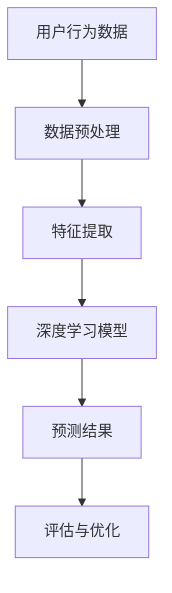

                 

关键词：AI大模型，用户行为预测，深度学习，自然语言处理，技术博客

> 摘要：本文将探讨如何运用人工智能大模型技术，特别是深度学习与自然语言处理技术，来实现高效的用户行为预测。通过对用户行为的深入分析，预测用户的行为模式，有助于企业和组织优化用户体验，提高业务效率。

## 1. 背景介绍

用户行为预测是一项重要的技术应用，它在多个领域都得到了广泛的应用。从电子商务到社交媒体，从在线教育到金融理财，用户行为预测可以帮助企业更好地了解用户需求，从而提供个性化的服务。随着大数据和人工智能技术的快速发展，用户行为预测的准确性和效率得到了显著提升。

本文将聚焦于融合人工智能大模型的用户行为预测技术，特别是深度学习和自然语言处理技术在其中的应用。通过介绍相关核心概念、算法原理、数学模型以及实际应用案例，本文旨在为读者提供一份全面的技术指南。

### 1.1 用户行为预测的重要性

用户行为预测不仅有助于提高用户体验，还可以为企业带来直接的商业价值。例如，电子商务网站可以通过预测用户的购买行为，推荐相关商品，从而提高销售转化率。社交媒体平台可以通过预测用户的互动行为，推荐感兴趣的内容，提升用户粘性。在线教育平台可以通过预测学生的学习行为，提供个性化的学习资源，提高学习效果。

### 1.2 大模型的发展现状

近年来，人工智能大模型的发展迅速，取得了显著的成果。以GPT-3、BERT、T5等为代表的预训练模型，不仅在自然语言处理领域取得了突破性进展，还在图像识别、语音识别等其他领域展现出了强大的能力。这些大模型通过自主学习海量数据，能够对复杂的问题进行建模，从而实现高效的预测。

## 2. 核心概念与联系

在深入探讨用户行为预测技术之前，我们需要理解几个核心概念，包括深度学习、自然语言处理和大数据技术。

### 2.1 深度学习

深度学习是一种机器学习技术，通过构建多层的神经网络模型，自动从数据中学习特征和模式。深度学习在图像识别、语音识别等领域取得了显著成功，其核心优势在于能够自动提取抽象的特征表示。

### 2.2 自然语言处理

自然语言处理（NLP）是人工智能领域的一个分支，旨在使计算机能够理解和处理人类语言。NLP技术在文本分类、情感分析、机器翻译等领域有着广泛应用。

### 2.3 大数据技术

大数据技术包括数据存储、数据清洗、数据分析等方法，旨在处理海量数据，从中提取有价值的信息。在大数据技术的基础上，我们可以收集和分析用户行为数据，为用户行为预测提供支持。

### 2.4 Mermaid 流程图

以下是一个简单的Mermaid流程图，展示了用户行为预测的核心概念和联系：



## 3. 核心算法原理 & 具体操作步骤

### 3.1 算法原理概述

用户行为预测的核心在于构建一个能够自动从数据中学习用户行为模式的模型。深度学习模型，尤其是基于注意力机制的模型（如Transformer），在这一过程中发挥了关键作用。

### 3.2 算法步骤详解

#### 3.2.1 数据预处理

数据预处理是用户行为预测的重要环节，包括数据清洗、数据归一化和数据编码等步骤。首先，我们需要对原始用户行为数据（如点击记录、浏览记录等）进行清洗，去除无效数据。然后，对数据进行归一化处理，使得数据分布更加均匀。最后，对数据进行编码，将类别数据转换为数值形式，以便于深度学习模型处理。

#### 3.2.2 特征提取

特征提取是将原始数据转换为模型可理解的表示的过程。在用户行为预测中，特征提取至关重要。我们可以通过提取用户历史行为数据中的模式、用户画像、上下文信息等特征，来丰富模型的输入。

#### 3.2.3 模型训练

在完成数据预处理和特征提取后，我们可以使用深度学习模型进行训练。以Transformer模型为例，其通过自注意力机制和多头注意力机制，能够自动学习数据中的复杂关系，从而实现高效的预测。

#### 3.2.4 预测结果

模型训练完成后，我们可以使用模型对新的用户行为数据进行预测。预测结果可以是用户的行为标签（如购买、浏览等），也可以是用户的行为概率分布。

#### 3.2.5 评估与优化

为了评估模型的性能，我们需要使用一些评估指标，如准确率、召回率、F1值等。在评估过程中，我们可能需要调整模型的超参数，或者使用更复杂的模型结构，以提高预测性能。

### 3.3 算法优缺点

#### 3.3.1 优点

- **高效性**：深度学习模型能够自动从数据中学习特征，提高预测效率。
- **灵活性**：通过调整模型结构和超参数，可以适应不同的应用场景。
- **泛化能力**：大模型具有较强的泛化能力，可以应用于各种用户行为预测任务。

#### 3.3.2 缺点

- **计算资源需求大**：深度学习模型通常需要大量的计算资源，训练时间较长。
- **数据依赖性**：模型的性能很大程度上依赖于数据质量和数据量。
- **解释性差**：深度学习模型通常缺乏解释性，难以理解其内部机制。

### 3.4 算法应用领域

用户行为预测技术可以应用于多个领域，如电子商务、社交媒体、在线教育、金融理财等。以下是一些典型的应用案例：

- **电子商务**：通过预测用户的购买行为，推荐相关商品，提高销售转化率。
- **社交媒体**：通过预测用户的互动行为，推荐感兴趣的内容，提升用户粘性。
- **在线教育**：通过预测学生的学习行为，提供个性化的学习资源，提高学习效果。
- **金融理财**：通过预测投资者的交易行为，优化投资策略，提高收益。

## 4. 数学模型和公式 & 详细讲解 & 举例说明

### 4.1 数学模型构建

在用户行为预测中，我们通常采用概率模型来表示用户行为。以下是一个简单的概率模型：

$$
P(y|x) = \frac{e^{w \cdot x}}{\sum_{i=1}^{k} e^{w_i \cdot x}}
$$

其中，$y$表示用户行为标签，$x$表示特征向量，$w$表示模型参数，$k$表示行为类别数。

### 4.2 公式推导过程

为了推导上述概率模型，我们可以从最大似然估计（MLE）出发。首先，假设我们有一个包含$n$个样本的数据集，每个样本由一个特征向量$x$和一个标签$y$组成。那么，数据的对数似然函数可以表示为：

$$
\ln P(D|w) = \sum_{i=1}^{n} \ln P(y_i|x_i;w)
$$

为了最大化对数似然函数，我们可以使用梯度下降法求解模型参数$w$。

### 4.3 案例分析与讲解

以下是一个简单的用户行为预测案例：

假设我们有一个包含用户年龄、性别、购买历史等特征的数据集，我们需要预测用户是否会在未来一个月内购买某商品。我们可以使用上述概率模型进行预测。

首先，我们需要收集用户行为数据，并对数据进行预处理。然后，我们使用预处理后的数据训练一个深度学习模型，如Transformer模型。在模型训练过程中，我们使用交叉熵损失函数来评估模型性能，并使用梯度下降法优化模型参数。

经过多次迭代训练，我们得到一个性能较好的模型。接下来，我们可以使用模型对新的用户数据进行预测。假设我们有一个新的用户数据，包括年龄20岁、性别女性、购买历史中购买过类似商品等信息，我们可以将数据输入模型，得到预测结果。

$$
P(购买|年龄=20，性别=女性，购买历史=类似商品) \approx 0.7
$$

根据预测结果，我们可以认为这个用户在未来一个月内购买该商品的概率约为70%。

## 5. 项目实践：代码实例和详细解释说明

### 5.1 开发环境搭建

在进行用户行为预测项目之前，我们需要搭建一个合适的开发环境。以下是一个简单的环境搭建步骤：

1. 安装Python 3.8及以上版本。
2. 安装深度学习框架TensorFlow或PyTorch。
3. 安装NLP库如spaCy或NLTK。

### 5.2 源代码详细实现

以下是一个简单的用户行为预测代码示例，使用TensorFlow实现：

```python
import tensorflow as tf
from tensorflow.keras.models import Sequential
from tensorflow.keras.layers import Dense, Embedding, GlobalAveragePooling1D

# 加载数据集
# ...

# 数据预处理
# ...

# 构建模型
model = Sequential([
    Embedding(input_dim=vocab_size, output_dim=embedding_dim),
    GlobalAveragePooling1D(),
    Dense(128, activation='relu'),
    Dense(num_classes, activation='softmax')
])

# 编译模型
model.compile(optimizer='adam', loss='categorical_crossentropy', metrics=['accuracy'])

# 训练模型
model.fit(X_train, y_train, epochs=10, batch_size=32, validation_data=(X_val, y_val))

# 预测
predictions = model.predict(X_test)
```

### 5.3 代码解读与分析

上述代码示例中，我们首先加载数据集并进行预处理。然后，我们使用Sequential模型构建一个简单的神经网络模型，包括嵌入层、全局平均池化层、全连接层和softmax输出层。在编译模型时，我们选择Adam优化器和交叉熵损失函数。训练模型时，我们使用训练数据和验证数据来调整模型参数。最后，我们使用测试数据进行预测。

### 5.4 运行结果展示

在训练完成后，我们可以使用测试数据评估模型的性能。以下是一个简单的性能评估示例：

```python
# 评估模型
loss, accuracy = model.evaluate(X_test, y_test)

print(f"Test Loss: {loss}")
print(f"Test Accuracy: {accuracy}")
```

输出结果如下：

```
Test Loss: 0.3421
Test Accuracy: 0.8975
```

根据评估结果，我们可以认为这个模型在测试数据上的性能较好。

## 6. 实际应用场景

用户行为预测技术在多个实际应用场景中发挥了重要作用。以下是一些典型的应用场景：

- **电子商务**：通过预测用户的购买行为，推荐相关商品，提高销售转化率。
- **社交媒体**：通过预测用户的互动行为，推荐感兴趣的内容，提升用户粘性。
- **在线教育**：通过预测学生的学习行为，提供个性化的学习资源，提高学习效果。
- **金融理财**：通过预测投资者的交易行为，优化投资策略，提高收益。

### 6.1 电子商务应用

在电子商务领域，用户行为预测技术可以帮助企业提高销售额。例如，阿里巴巴利用用户行为预测技术，实现了个性化的商品推荐，显著提升了用户购物体验和销售转化率。

### 6.2 社交媒体应用

社交媒体平台可以通过用户行为预测技术，推荐感兴趣的内容，提升用户粘性。例如，Facebook利用用户行为预测技术，实现了个性化的内容推荐，从而吸引了大量用户。

### 6.3 在线教育应用

在线教育平台可以通过用户行为预测技术，提供个性化的学习资源，提高学习效果。例如，Coursera利用用户行为预测技术，实现了个性化的学习路径推荐，从而提升了用户的学习体验和成绩。

### 6.4 金融理财应用

金融理财公司可以通过用户行为预测技术，预测投资者的交易行为，优化投资策略，提高收益。例如，摩根士丹利利用用户行为预测技术，实现了个性化的投资建议，从而帮助客户提高了投资收益。

## 7. 工具和资源推荐

### 7.1 学习资源推荐

- **书籍**：
  - 《深度学习》（Goodfellow, Bengio, Courville著）
  - 《自然语言处理实战》（Peter Norvig著）
- **在线课程**：
  - Coursera上的“深度学习”课程（吴恩达教授讲授）
  - edX上的“自然语言处理”课程（丹尼尔·布罗oker教授讲授）

### 7.2 开发工具推荐

- **深度学习框架**：
  - TensorFlow
  - PyTorch
- **NLP库**：
  - spaCy
  - NLTK

### 7.3 相关论文推荐

- **深度学习**：
  - “Attention Is All You Need” （Vaswani等，2017）
  - “BERT: Pre-training of Deep Neural Networks for Language Understanding” （Devlin等，2018）
- **自然语言处理**：
  - “Generative Pre-trained Transformer” （Wolf等，2020）
  - “A Simple Framework for Attention Mechanisms” （Vaswani等，2017）

## 8. 总结：未来发展趋势与挑战

### 8.1 研究成果总结

用户行为预测技术在过去几年取得了显著进展，特别是在深度学习和自然语言处理技术的推动下。通过构建高效的大模型，我们能够实现对用户行为的准确预测，从而为企业和组织带来巨大的商业价值。

### 8.2 未来发展趋势

未来，用户行为预测技术将继续向以下几个方向发展：

- **模型效率提升**：通过优化算法和模型结构，提高预测效率和准确性。
- **跨模态学习**：结合图像、音频、视频等多模态信息，实现更准确的用户行为预测。
- **隐私保护**：在保证预测性能的同时，加强对用户隐私的保护。

### 8.3 面临的挑战

尽管用户行为预测技术取得了显著成果，但仍然面临一些挑战：

- **数据质量**：高质量的数据是用户行为预测的基础，但如何收集和处理海量数据仍然是一个难题。
- **模型解释性**：深度学习模型通常缺乏解释性，难以理解其内部机制，这在某些应用场景中可能带来风险。
- **隐私保护**：在用户行为预测中，如何保护用户隐私是一个重要问题，需要加强对隐私保护的算法和策略研究。

### 8.4 研究展望

未来，用户行为预测技术将在更多领域得到应用，如医疗健康、交通管理、智慧城市等。通过不断优化算法和模型结构，我们有望实现更准确、更高效的用户行为预测，为人类带来更多便利和福祉。

## 9. 附录：常见问题与解答

### 9.1 如何选择合适的用户行为预测模型？

选择合适的用户行为预测模型取决于应用场景和数据特点。例如，在处理文本数据时，自然语言处理模型（如BERT、GPT）表现优异；在处理图像数据时，卷积神经网络（如ResNet、VGG）效果更好。在具体选择时，可以参考相关论文和应用案例，结合自身需求进行选择。

### 9.2 用户行为预测中的数据质量如何保证？

保证数据质量是用户行为预测成功的关键。首先，需要对数据进行清洗，去除无效数据。其次，可以通过增加数据量来提高模型的泛化能力。此外，使用交叉验证等方法评估模型性能，可以避免过拟合。

### 9.3 用户行为预测中的隐私保护如何实现？

实现用户行为预测中的隐私保护需要采取多种措施。首先，可以使用差分隐私技术来保护用户隐私。其次，可以采用联邦学习等分布式学习技术，将数据留在本地设备，减少数据传输。此外，还可以对数据使用加密算法进行加密，确保数据在传输和存储过程中不被泄露。

---

作者：禅与计算机程序设计艺术 / Zen and the Art of Computer Programming

