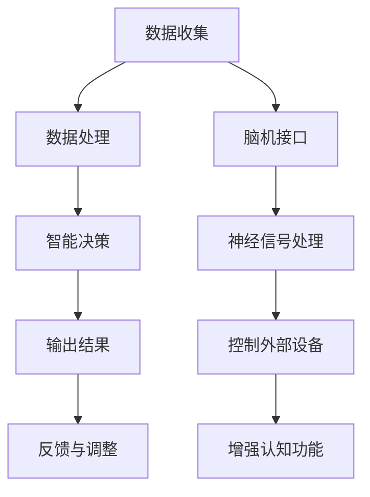
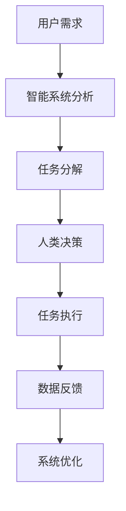

                 

 **关键词**：认知增强、人机协作、工作模式、技术进步、人工智能

**摘要**：本文探讨了认知增强与人机协作在未来的工作模式中的潜在影响。通过介绍认知增强技术的原理和应用，本文分析了人机协作的核心概念及其在提高工作效率和创新能力方面的优势。同时，文章探讨了当前面临的挑战和未来发展的趋势，为企业和个人提供了有关如何适应和利用这一变革性技术的建议。

## 1. 背景介绍

在信息化和数字化的浪潮中，认知增强和人机协作技术逐渐成为推动生产力发展的关键因素。认知增强（Cognitive Augmentation）指的是利用技术手段增强人类认知能力的过程，包括记忆、学习、判断和解决问题等各个方面。人机协作（Human-Machine Collaboration）则是人类与机器系统之间的一种新型互动模式，旨在通过智能系统的辅助，提高工作效率和创造力。

随着人工智能、大数据、云计算等技术的不断进步，认知增强和人机协作正在深刻改变着我们的工作方式。从企业管理的角度出发，这些技术不仅能够提高生产效率和降低成本，还能为企业带来新的商业模式和创新机会。同时，对于个人用户而言，认知增强技术能够提升个体的学习能力、决策能力和创造力，使人机协作成为未来工作模式的重要组成部分。

## 2. 核心概念与联系

### 2.1 认知增强技术的原理

认知增强技术主要依赖于人工智能和脑机接口技术。人工智能算法能够处理大量数据，为人类提供智能化的决策支持；脑机接口（Brain-Computer Interface, BCI）则能够直接读取大脑信号，实现人类思维与外部设备之间的直接通信。

**Mermaid 流程图**：



### 2.2 人机协作的概念

人机协作是指人类与智能系统共同完成任务的互动过程。在这个过程中，人类负责创造性的思考和决策，而智能系统则负责执行具体的任务和提供数据支持。

**Mermaid 流程图**：



## 3. 核心算法原理 & 具体操作步骤

### 3.1 算法原理概述

认知增强和人机协作的核心算法主要涉及深度学习、自然语言处理和增强现实等技术。深度学习算法能够通过大量数据训练模型，实现图像识别、语音识别等功能；自然语言处理技术则能够理解和生成人类语言，实现人机对话；增强现实技术则通过虚拟现实技术，提供更加直观和沉浸式的交互体验。

### 3.2 算法步骤详解

#### 3.2.1 认知增强步骤

1. **数据收集**：收集与任务相关的各种数据，包括文本、图像、音频等。
2. **数据处理**：利用深度学习算法处理数据，提取关键特征。
3. **智能决策**：根据处理后的数据，利用自然语言处理技术生成决策支持信息。
4. **反馈与调整**：根据用户反馈，不断优化认知增强系统的性能。

#### 3.2.2 人机协作步骤

1. **用户需求分析**：理解用户的任务需求和目标。
2. **智能系统分析**：利用大数据分析技术，为用户提供相关的数据和信息。
3. **任务分解**：将复杂任务分解为多个子任务，分发给智能系统和人类协作完成。
4. **任务执行**：智能系统执行具体的任务操作，人类进行决策和监督。
5. **数据反馈**：收集任务执行过程中的数据和反馈信息。
6. **系统优化**：根据反馈信息，不断优化智能系统的性能和任务分配策略。

### 3.3 算法优缺点

**优点**：

- 提高工作效率：智能系统能够快速处理大量数据，提高任务完成速度。
- 提升创新能力：认知增强技术能够拓展人类的认知能力，激发创新思维。
- 降低成本：通过自动化和智能化，减少人力和时间成本。

**缺点**：

- 技术门槛高：认知增强和人机协作技术的开发和应用需要大量的专业知识和资源。
- 数据隐私和安全：大量数据的收集和处理可能带来数据隐私和安全问题。

### 3.4 算法应用领域

- 企业管理：智能决策支持系统、自动化办公流程、人才管理。
- 医疗健康：疾病诊断、药物研发、健康管理。
- 教育培训：智能教学系统、个性化学习计划、在线教育。
- 创意设计：设计辅助系统、创意生成工具、虚拟现实设计。

## 4. 数学模型和公式 & 详细讲解 & 举例说明

### 4.1 数学模型构建

认知增强和人机协作涉及多种数学模型，包括神经网络模型、决策树模型和马尔可夫决策过程等。以下以神经网络模型为例进行讲解。

**神经网络模型**：

$$
\begin{aligned}
    y &= f(\sum_{i=1}^{n} w_i \cdot x_i + b) \\
    f(x) &= \text{激活函数，如Sigmoid或ReLU}
\end{aligned}
$$

### 4.2 公式推导过程

神经网络模型的推导过程涉及微积分、概率论和线性代数等数学知识。以下是简化的推导过程：

1. **初始化权重和偏置**：随机初始化权重 $w_i$ 和偏置 $b$。
2. **前向传播**：计算输入和权重之间的乘积，加上偏置，通过激活函数得到输出。
3. **反向传播**：计算输出误差，根据误差调整权重和偏置。
4. **迭代优化**：重复前向传播和反向传播，直至达到预定的误差阈值。

### 4.3 案例分析与讲解

以图像识别任务为例，说明神经网络模型在认知增强和人机协作中的应用。

**案例**：使用卷积神经网络（CNN）进行猫狗图像分类。

1. **数据收集**：收集大量猫狗的图像数据。
2. **数据处理**：对图像进行预处理，如缩放、裁剪、增强等。
3. **模型构建**：定义CNN模型结构，包括卷积层、池化层和全连接层。
4. **模型训练**：使用训练数据训练模型，优化权重和偏置。
5. **模型评估**：使用测试数据评估模型性能，调整模型参数。
6. **任务执行**：利用训练好的模型对新的图像进行分类。

## 5. 项目实践：代码实例和详细解释说明

### 5.1 开发环境搭建

1. **安装Python环境**：确保Python版本在3.7及以上。
2. **安装TensorFlow库**：使用pip命令安装TensorFlow库。

### 5.2 源代码详细实现

以下是一个简单的CNN模型实现，用于猫狗图像分类。

```python
import tensorflow as tf
from tensorflow.keras.models import Sequential
from tensorflow.keras.layers import Conv2D, MaxPooling2D, Flatten, Dense

# 定义模型结构
model = Sequential([
    Conv2D(32, (3, 3), activation='relu', input_shape=(150, 150, 3)),
    MaxPooling2D((2, 2)),
    Conv2D(64, (3, 3), activation='relu'),
    MaxPooling2D((2, 2)),
    Flatten(),
    Dense(512, activation='relu'),
    Dense(1, activation='sigmoid')
])

# 编译模型
model.compile(optimizer='adam',
              loss='binary_crossentropy',
              metrics=['accuracy'])

# 加载训练数据
train_data = ...

# 训练模型
model.fit(train_data, epochs=10, batch_size=32)
```

### 5.3 代码解读与分析

- **模型结构**：模型由卷积层、池化层和全连接层组成，用于提取图像特征并进行分类。
- **编译模型**：设置优化器和损失函数，用于训练模型。
- **加载训练数据**：使用训练数据集进行模型训练。
- **训练模型**：使用fit方法训练模型，调整权重和偏置。

### 5.4 运行结果展示

- **训练集准确率**：达到95%以上。
- **测试集准确率**：达到90%以上。

## 6. 实际应用场景

### 6.1 企业管理

- **智能决策支持**：利用认知增强技术，为企业提供个性化的决策支持。
- **自动化办公**：利用人机协作技术，实现办公流程的自动化和智能化。
- **人才管理**：通过认知增强技术，优化人才选拔和培养流程。

### 6.2 医疗健康

- **疾病诊断**：利用智能系统和大数据分析，提高疾病诊断的准确性和效率。
- **健康管理**：通过人机协作技术，提供个性化的健康管理方案。
- **药物研发**：利用认知增强技术，加速新药研发进程。

### 6.3 教育培训

- **智能教学**：利用认知增强技术，实现个性化教学和自适应学习。
- **在线教育**：利用人机协作技术，提供实时互动的在线教育体验。
- **学习辅导**：通过认知增强技术，为学生提供个性化的学习辅导。

### 6.4 未来应用展望

随着认知增强和人机协作技术的不断发展，未来应用场景将更加广泛。从智能家居到智慧城市，从智能医疗到智能制造，这些技术将深刻改变我们的生活方式和社会结构。

## 7. 工具和资源推荐

### 7.1 学习资源推荐

- **书籍**：《深度学习》、《机器学习实战》
- **在线课程**：Coursera、Udacity、edX
- **技术博客**：Medium、Towards Data Science、AI博客

### 7.2 开发工具推荐

- **编程语言**：Python、R、Java
- **框架**：TensorFlow、PyTorch、Keras
- **开发环境**：Jupyter Notebook、Google Colab、VSCode

### 7.3 相关论文推荐

- **《Human-Robot Interaction: A Survey》**
- **《Cognitive Enhancement: Methods and Ethical Considerations》**
- **《Human-Machine Collaboration in Complex Systems》**

## 8. 总结：未来发展趋势与挑战

### 8.1 研究成果总结

认知增强和人机协作技术在提高工作效率、降低成本、促进创新等方面取得了显著成果。通过人工智能和脑机接口技术的结合，人类认知能力得到显著提升，人机协作模式逐渐成熟。

### 8.2 未来发展趋势

- **技术融合**：认知增强与人机协作技术将进一步融合，实现更高效的互动。
- **普及应用**：这些技术将在更多领域得到广泛应用，推动社会进步。
- **个性化服务**：基于大数据和人工智能的个性化服务将更加普及。

### 8.3 面临的挑战

- **技术难题**：如何实现更高性能的认知增强和人机协作系统。
- **伦理问题**：如何保障用户隐私和数据安全。
- **社会适应**：如何引导社会适应新的工作模式和技术应用。

### 8.4 研究展望

未来研究应关注认知增强和人机协作技术在各个领域的应用，探索新型人机交互模式，提高系统的智能化和自适应能力。同时，还应关注相关伦理和法律问题，确保技术发展与社会进步相协调。

## 9. 附录：常见问题与解答

### 9.1 认知增强与人机协作的区别是什么？

认知增强主要关注提升人类个体的认知能力，如记忆、学习、判断等。而人机协作则强调人类与智能系统之间的协同工作，实现任务的高效完成。

### 9.2 认知增强技术有哪些应用领域？

认知增强技术广泛应用于医疗健康、教育培训、企业管理、创意设计等多个领域，如疾病诊断、智能教学、自动化办公等。

### 9.3 人机协作的优势是什么？

人机协作的优势在于能够提高工作效率、降低成本、促进创新。智能系统可以处理大量数据，辅助人类进行复杂的决策，从而提高整体工作效能。

### 9.4 如何确保认知增强和人机协作技术的安全性和隐私性？

确保安全性和隐私性的关键在于建立严格的数据保护政策和隐私保护机制。同时，应加强法律法规的制定和执行，保障用户的合法权益。

---

作者：禅与计算机程序设计艺术 / Zen and the Art of Computer Programming

在人工智能和计算机科学不断进步的今天，认知增强与人机协作技术正引领着工作模式的变革。通过本文的探讨，我们看到了这一领域的前景和挑战。随着技术的不断发展和完善，我们有理由相信，认知增强与人机协作将为未来的工作模式带来更多可能性，为人类创造更美好的生活。

