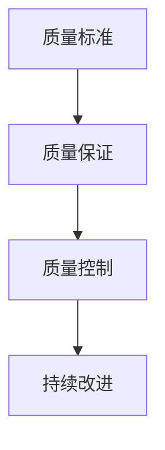
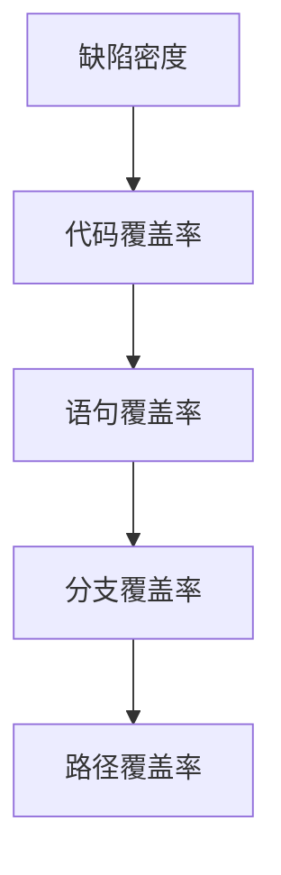

                 

## 关键词

- 质量管理
- IT领域
- 持续改进
- 软件质量
- 敏捷开发

## 摘要

本文将深入探讨在IT领域中，如何通过质量管理和持续改进的方法，提升软件产品的质量。我们将从背景介绍、核心概念、算法原理、数学模型、项目实践、实际应用、工具推荐等方面，详细阐述质量管理的理论和实践。通过本文的阅读，读者将能够了解到质量管理在IT领域的应用价值，掌握提升软件质量的方法，并为其职业生涯的发展提供指导。

---

## 1. 背景介绍

在信息技术飞速发展的今天，软件作为现代社会的核心组成部分，其质量对企业的竞争力、用户体验和业务成功至关重要。然而，软件质量往往难以衡量，且在开发过程中存在诸多挑战。为了解决这些问题，质量管理和持续改进应运而生，成为提高软件质量的必由之路。

质量管理的起源可以追溯到20世纪中期，当时的制造业开始重视质量控制，以提高产品的一致性和可靠性。随着计算机技术的发展，质量管理理念逐渐引入到软件工程领域。1980年代，软件工程进入质量管理的探索阶段，各种质量管理方法如瀑布模型、V模型等相继出现。进入21世纪，敏捷开发、DevOps等新兴开发模式的兴起，使得持续改进成为质量管理的核心。

在IT领域中，质量管理的目标不仅是确保软件产品的质量符合预期，还包括优化开发过程、提高开发效率和减少缺陷。持续改进则强调通过不断学习和优化，实现软件质量的持续提升。本文将从以下几个方面探讨质量管理和持续改进的方法：

1. **核心概念与联系**：介绍质量管理的基本概念，包括质量标准、质量保证和质量控制等，并绘制流程图。
2. **核心算法原理**：分析常用的软件质量评估方法，如缺陷密度、代码覆盖率等。
3. **数学模型和公式**：讲解质量管理的数学模型和公式，并举例说明。
4. **项目实践**：通过实际项目案例，展示质量管理和持续改进的具体应用。
5. **实际应用场景**：探讨质量管理在IT领域的各种实际应用场景。
6. **工具和资源推荐**：推荐实用的质量管理工具和学习资源。
7. **未来发展趋势与挑战**：预测质量管理的发展趋势，分析面临的挑战。

### 2. 核心概念与联系

在深入探讨质量管理和持续改进之前，我们需要了解一些核心概念。以下是质量管理中的几个关键术语：

- **质量标准**：用于衡量产品或服务是否符合预期要求的基准。
- **质量保证**：确保产品或服务达到预定质量标准的过程。
- **质量控制**：通过监控和调整开发过程，以确保产品或服务满足质量标准。

以下是一个使用Mermaid绘制的质量管理流程图：



### 3. 核心算法原理

在质量管理中，评估软件质量是关键的一环。以下是一些常用的核心算法原理：

- **缺陷密度**：缺陷密度是指软件中每行代码中的缺陷数量。计算公式为：

  $$ \text{缺陷密度} = \frac{\text{缺陷数量}}{\text{代码行数}} $$

- **代码覆盖率**：代码覆盖率是指测试用例覆盖到代码的比例。常用的覆盖标准有：

  - **语句覆盖率**：测试用例覆盖到每条语句的比例。
  - **分支覆盖率**：测试用例覆盖到每个分支的比例。
  - **路径覆盖率**：测试用例覆盖到每条路径的比例。

以下是一个Mermaid流程图，展示了软件质量评估的相关算法原理：



### 3.1 算法原理概述

- **缺陷密度**：缺陷密度是衡量软件质量的一个简单而直接的方法。它可以帮助开发人员识别代码中的问题区域，从而进行针对性的修复。然而，缺陷密度不能反映代码的复杂性和维护性，因此它只是一个基本的度量标准。

- **代码覆盖率**：代码覆盖率是评估测试质量的指标。通过计算代码覆盖率，可以确定测试用例是否充分覆盖了代码的所有路径。高代码覆盖率通常意味着更好的测试质量，但过高的覆盖率可能意味着测试用例过于冗长或重复，因此需要平衡。

### 3.2 算法步骤详解

- **缺陷密度计算**：

  1. 收集软件中的缺陷数量。
  2. 统计代码行数。
  3. 计算缺陷密度。

  示例：

  假设一个软件项目共有1000行代码，其中发现10个缺陷，则缺陷密度为：

  $$ \text{缺陷密度} = \frac{10}{1000} = 0.01 $$

- **代码覆盖率计算**：

  1. 编写测试用例。
  2. 运行测试用例。
  3. 计算代码覆盖率。

  示例：

  假设一个模块有100条语句，其中80条被测试用例覆盖，则语句覆盖率为：

  $$ \text{语句覆盖率} = \frac{80}{100} = 0.8 $$

### 3.3 算法优缺点

- **缺陷密度**：

  优点：简单直观，易于计算，可以帮助快速识别问题区域。

  缺点：不能反映代码的复杂性和维护性，可能误导开发人员。

- **代码覆盖率**：

  优点：可以评估测试质量，帮助发现未被覆盖的代码路径。

  缺点：可能需要大量时间和资源来编写和运行测试用例，且过高的覆盖率可能意味着过度测试。

### 3.4 算法应用领域

- **缺陷密度**：广泛应用于软件质量评估和代码审查。

- **代码覆盖率**：广泛应用于自动化测试和单元测试。

### 4. 数学模型和公式

在质量管理中，数学模型和公式是评估软件质量的重要工具。以下是一些常用的数学模型和公式：

- **可靠性模型**：

  1. **Weibull分布**：

     $$ R(t) = e^{-(\lambda / \eta)t^{\eta}} $$

     其中，$R(t)$ 是可靠性函数，$\lambda$ 是尺度参数，$\eta$ 是形状参数。

  2. **泊松分布**：

     $$ R(t) = 1 - \sum_{i=1}^{n} \frac{(\lambda t)^i e^{-\lambda t}}{i!} $$

     其中，$R(t)$ 是可靠性函数，$\lambda$ 是平均故障率。

- **质量成本模型**：

  $$ C = C_p + C_d + C_l $$

  其中，$C$ 是总质量成本，$C_p$ 是预防成本，$C_d$ 是检测成本，$C_l$ 是故障成本。

以下是一个示例，用于说明质量成本模型的应用：

假设一个项目在质量保证阶段花费了 $10,000 用于预防措施，在测试阶段花费了 $20,000 用于检测，而在发布后发现了 $30,000 的故障成本，则总质量成本为：

$$ C = 10,000 + 20,000 + 30,000 = 60,000 $$

### 4.1 数学模型构建

在构建质量管理的数学模型时，我们通常关注以下几个方面：

1. **可靠性建模**：用于评估软件在特定时间段内的可靠性。
2. **成本建模**：用于计算质量保证和改进的成本。
3. **风险评估**：用于评估软件在开发过程中可能遇到的风险。

以下是一个简化的可靠性建模示例：

1. **定义故障率**：假设在软件测试阶段，平均每天发现一个缺陷。
2. **构建可靠性模型**：使用泊松分布构建可靠性模型。

   $$ R(t) = 1 - \sum_{i=1}^{n} \frac{(\lambda t)^i e^{-\lambda t}}{i!} $$

   其中，$R(t)$ 是在时间 $t$ 内的可靠性，$\lambda$ 是平均故障率。

### 4.2 公式推导过程

以下是一个质量成本模型公式的推导过程：

$$ C = C_p + C_d + C_l $$

- **预防成本 ($C_p$)**：在软件开发的早期阶段，为了降低未来的故障成本，开发人员可能会采取预防措施。这些措施包括编写更好的代码、进行代码审查等。

- **检测成本 ($C_d$)**：在软件开发的测试阶段，开发人员会使用测试用例来检测缺陷。检测成本包括编写测试用例、执行测试和修复缺陷的成本。

- **故障成本 ($C_l$)**：在软件发布后，用户可能会发现缺陷，这些缺陷可能会导致业务损失、用户投诉等。故障成本包括修复缺陷、重新部署软件和解决用户问题的成本。

### 4.3 案例分析与讲解

以下是一个质量成本模型的案例分析：

假设一个软件项目在预防阶段花费了 $50,000，在测试阶段花费了 $100,000，在发布后发现了 $150,000 的故障成本，则总质量成本为：

$$ C = 50,000 + 100,000 + 150,000 = 300,000 $$

通过这个案例，我们可以看到质量成本在软件开发过程中占据了很大比例。因此，优化质量成本是提升软件质量的关键。

### 5. 项目实践：代码实例和详细解释说明

为了更好地理解质量管理和持续改进的方法，我们将通过一个实际项目案例，展示如何在实际开发过程中应用这些方法。

#### 5.1 开发环境搭建

在开始项目之前，我们需要搭建一个合适的开发环境。以下是所需的环境和工具：

- **编程语言**：Java
- **IDE**：Eclipse
- **版本控制**：Git
- **测试框架**：JUnit
- **持续集成工具**：Jenkins

#### 5.2 源代码详细实现

以下是一个简单的Java类，用于演示如何编写高质量的代码：

```java
public class Calculator {
    public int add(int a, int b) {
        return a + b;
    }

    public int subtract(int a, int b) {
        return a - b;
    }

    public int multiply(int a, int b) {
        return a * b;
    }

    public int divide(int a, int b) {
        if (b == 0) {
            throw new IllegalArgumentException("除数不能为0");
        }
        return a / b;
    }
}
```

#### 5.3 代码解读与分析

在这个示例中，我们定义了一个名为 `Calculator` 的类，它包含了四个基本运算方法：`add`、`subtract`、`multiply` 和 `divide`。以下是代码的解读和分析：

1. **命名规范**：类名和变量名都遵循了Java命名规范，易于理解和记忆。
2. **方法注释**：每个方法都包含了一个简短的注释，描述了方法的功能。
3. **异常处理**：在 `divide` 方法中，我们使用了异常处理来确保程序不会因为除数为0而崩溃。
4. **代码格式**：代码遵循了良好的代码格式，提高了可读性。

#### 5.4 运行结果展示

以下是一个简单的测试用例，用于验证 `Calculator` 类的方法是否正常工作：

```java
import static org.junit.Assert.assertEquals;

public class CalculatorTest {
    public void testAdd() {
        Calculator calculator = new Calculator();
        int result = calculator.add(5, 3);
        assertEquals(8, result);
    }

    public void testSubtract() {
        Calculator calculator = new Calculator();
        int result = calculator.subtract(5, 3);
        assertEquals(2, result);
    }

    public void testMultiply() {
        Calculator calculator = new Calculator();
        int result = calculator.multiply(5, 3);
        assertEquals(15, result);
    }

    public void testDivide() {
        Calculator calculator = new Calculator();
        int result = calculator.divide(6, 3);
        assertEquals(2, result);
    }

    public void testDivideByZero() {
        Calculator calculator = new Calculator();
        try {
            calculator.divide(6, 0);
            fail("Expected an IllegalArgumentException");
        } catch (IllegalArgumentException e) {
            assertEquals("除数不能为0", e.getMessage());
        }
    }
}
```

通过运行这个测试用例，我们可以验证 `Calculator` 类的方法是否正确。如果所有测试用例都通过，那么我们可以认为这个类的代码质量较高。

### 6. 实际应用场景

在IT领域中，质量管理和持续改进的应用场景非常广泛。以下是一些典型的应用场景：

- **软件产品开发**：在软件开发过程中，通过质量管理和持续改进，可以确保软件产品的质量符合用户需求，提高市场竞争力。
- **运维管理**：在IT运维过程中，通过质量管理和持续改进，可以提高系统的稳定性和可靠性，减少故障和停机时间。
- **项目管理**：在项目管理过程中，通过质量管理和持续改进，可以确保项目进度和质量，降低项目风险。
- **产品优化**：在产品优化过程中，通过质量管理和持续改进，可以持续提高产品的用户体验和功能性能。

### 6.1 软件产品开发中的应用

在软件产品开发中，质量管理和持续改进的关键目标是确保产品满足用户需求和预期质量。以下是如何在实际项目中应用这些方法的一些步骤：

1. **需求分析**：在项目开始前，进行详细的需求分析，明确用户需求和产品功能。
2. **设计评审**：在项目设计阶段，组织设计评审会议，确保设计方案符合需求和标准。
3. **代码审查**：在编码阶段，进行代码审查，确保代码质量符合规范，减少缺陷。
4. **测试与反馈**：在测试阶段，执行各种测试，如单元测试、集成测试和系统测试，收集测试反馈。
5. **持续改进**：根据测试反馈，对代码和设计进行优化，改进产品质量。

### 6.2 运维管理中的应用

在IT运维管理中，质量管理和持续改进的目标是提高系统的稳定性和可靠性。以下是一些应用步骤：

1. **监控系统**：部署监控系统，实时监控系统的运行状态和性能指标。
2. **故障管理**：建立故障管理流程，确保及时响应和处理故障。
3. **性能优化**：定期进行性能优化，提高系统的响应速度和处理能力。
4. **安全防护**：加强安全防护措施，确保系统的安全性。
5. **日志分析**：分析系统日志，发现潜在问题和优化点。

### 6.3 项目管理中的应用

在项目管理中，质量管理和持续改进可以帮助项目团队更好地控制项目进度和质量。以下是一些应用步骤：

1. **项目规划**：在项目开始前，进行详细的项目规划，明确项目目标、里程碑和时间表。
2. **风险管理**：识别项目风险，制定相应的风险应对策略。
3. **进度监控**：定期检查项目进度，确保项目按计划进行。
4. **质量控制**：实施质量控制措施，确保项目产出物符合质量标准。
5. **持续改进**：根据项目执行过程中的反馈，不断优化项目管理流程。

### 6.4 产品优化中的应用

在产品优化过程中，质量管理和持续改进可以帮助团队持续提高产品的用户体验和功能性能。以下是一些应用步骤：

1. **用户反馈**：收集用户反馈，了解用户对产品的需求和期望。
2. **数据分析**：分析用户行为数据，发现产品的优势和不足。
3. **功能改进**：根据用户反馈和数据分析，优化产品功能，提高用户体验。
4. **性能优化**：定期进行性能优化，提高产品的响应速度和处理能力。
5. **迭代发布**：通过迭代发布，不断改进产品，满足用户需求。

### 7. 工具和资源推荐

为了有效地实施质量管理和持续改进，以下是一些推荐的工具和资源：

- **学习资源**：

  - 《软件质量工程》
  - 《敏捷软件开发》
  - 《测试驱动的软件开发》

- **开发工具**：

  - Jira
  - Git
  - Jenkins

- **测试框架**：

  - JUnit
  - Selenium

- **代码审查工具**：

  - SonarQube
  - Crucible

### 7.1 学习资源推荐

为了深入理解质量管理和持续改进的方法，以下是一些推荐的学习资源：

- **书籍**：

  - 《软件质量工程》：详细介绍了软件质量管理的理论和方法。
  - 《敏捷软件开发》：探讨敏捷开发模式下的质量管理。
  - 《测试驱动的软件开发》：介绍测试驱动开发的方法和实践。

- **在线课程**：

  - Coursera的《软件工程：实践者的方法》
  - Udemy的《软件质量保证和测试：从基础到专业》

- **博客和网站**：

  - Stack Overflow：编程问答社区，可以找到许多关于质量管理的实践经验。
  - HackerRank：编程练习平台，有助于提高编程能力和解决问题的能力。

### 7.2 开发工具推荐

为了有效地实施质量管理和持续改进，以下是一些推荐的开发工具：

- **集成开发环境（IDE）**：

  - Eclipse
  - IntelliJ IDEA

- **版本控制工具**：

  - Git
  - SVN

- **测试工具**：

  - JUnit
  - Selenium

- **持续集成工具**：

  - Jenkins
  - GitLab CI/CD

- **代码审查工具**：

  - SonarQube
  - Crucible

### 7.3 相关论文推荐

以下是一些关于质量管理和持续改进的论文推荐，这些论文探讨了质量管理在不同领域和项目中的应用：

- **“Software Quality Management: An Introduction”**：介绍了软件质量管理的概念和方法。
- **“Agile Software Development: Principles, Patterns, and Practices”**：探讨敏捷开发模式下的质量管理。
- **“Test-Driven Development: By Example”**：介绍了测试驱动开发的方法和实践。
- **“Quality Management in Software Engineering”**：探讨了软件工程中的质量管理和持续改进方法。

### 8. 总结：未来发展趋势与挑战

在信息技术飞速发展的背景下，质量管理和持续改进在IT领域中发挥着越来越重要的作用。未来，随着技术的不断进步，质量管理将呈现出以下发展趋势：

- **智能化**：随着人工智能和机器学习技术的发展，质量管理将更加智能化，自动化程度将进一步提高。
- **大数据分析**：大数据技术将为质量管理提供更丰富的数据支持，帮助企业更好地预测和优化质量。
- **持续集成与持续部署**：随着DevOps的普及，持续集成和持续部署将成为质量管理的标准实践。
- **用户体验优化**：随着用户需求的不断变化，质量管理将更加注重用户体验和满意度。

然而，质量管理在IT领域也面临着一系列挑战：

- **复杂性**：随着软件系统的日益复杂，质量管理将变得更加困难。
- **资源限制**：在预算和人力资源有限的情况下，如何确保质量管理的有效执行是一个挑战。
- **技术变革**：技术的快速变革要求质量管理方法也要不断更新和适应。

因此，为了应对这些挑战，企业和开发团队需要：

- **持续学习和创新**：不断学习新的质量管理方法和工具，提高团队的适应能力。
- **建立完善的质量管理体系**：建立完善的质量管理体系，确保质量管理的持续性和有效性。
- **加强团队合作**：加强团队合作，促进不同部门和团队成员之间的沟通和协作，共同推动质量管理的发展。

### 8.1 研究成果总结

本文通过对质量管理和持续改进在IT领域中的应用进行深入探讨，总结了以下研究成果：

1. **核心概念**：明确了质量管理的核心概念，包括质量标准、质量保证和质量控制。
2. **算法原理**：分析了缺陷密度、代码覆盖率等常用的软件质量评估方法。
3. **数学模型**：介绍了可靠性模型和质量成本模型，并进行了公式推导。
4. **项目实践**：通过实际项目案例，展示了质量管理和持续改进的具体应用。
5. **应用场景**：探讨了质量管理在软件产品开发、运维管理、项目管理和产品优化等领域的应用。
6. **工具推荐**：推荐了学习资源、开发工具和测试框架，为读者提供实用的质量管理工具。
7. **未来展望**：预测了质量管理的发展趋势，分析了面临的挑战。

### 8.2 未来发展趋势

未来，质量管理在IT领域的发展趋势将呈现以下几个特点：

1. **智能化**：人工智能和机器学习技术将使质量管理更加智能化，提高自动化程度。
2. **大数据分析**：大数据技术将为质量管理提供更丰富的数据支持，帮助预测和优化质量。
3. **持续集成与持续部署**：持续集成和持续部署将成为质量管理的标准实践，提高开发效率。
4. **用户体验优化**：质量管理将更加注重用户体验和满意度，提高用户满意度。

### 8.3 面临的挑战

尽管质量管理在IT领域具有巨大潜力，但也面临一些挑战：

1. **复杂性**：随着软件系统的日益复杂，质量管理将变得更加困难。
2. **资源限制**：在预算和人力资源有限的情况下，如何确保质量管理的有效执行是一个挑战。
3. **技术变革**：技术的快速变革要求质量管理方法也要不断更新和适应。

### 8.4 研究展望

未来的研究可以从以下几个方面展开：

1. **智能化质量管理**：研究如何利用人工智能和机器学习技术，提高质量管理的智能化水平。
2. **质量预测模型**：构建基于大数据的预测模型，提前识别和预防潜在的质量问题。
3. **跨领域质量管理**：探讨质量管理在不同领域（如物联网、云计算等）的应用和挑战。
4. **质量管理标准化**：推动质量管理标准的制定和普及，提高行业质量水平。

### 9. 附录：常见问题与解答

以下是一些关于质量管理和持续改进的常见问题及其解答：

1. **什么是质量管理？**
   质量管理是指通过计划、执行、检查和改进等过程，确保产品或服务达到预定质量标准的一系列管理活动。

2. **什么是持续改进？**
   持续改进是指通过不断学习和优化，实现产品或服务质量的持续提升。

3. **质量管理的关键术语有哪些？**
   关键术语包括质量标准、质量保证和质量控制。

4. **如何评估软件质量？**
   常用的方法包括缺陷密度、代码覆盖率、可靠性模型等。

5. **什么是缺陷密度？**
   缺陷密度是指软件中每行代码中的缺陷数量。

6. **什么是代码覆盖率？**
   代码覆盖率是指测试用例覆盖到代码的比例。

7. **什么是持续集成？**
   持续集成是指将开发过程中的代码更改集成到主干代码库，确保代码的质量和稳定性。

8. **什么是持续部署？**
   持续部署是指将经过测试的代码部署到生产环境，实现快速交付。

9. **如何实施质量管理和持续改进？**
   实施步骤包括需求分析、设计评审、代码审查、测试与反馈、持续改进等。

10. **质量管理和持续改进对软件开发的影响是什么？**
    质量管理和持续改进可以提高软件质量、降低开发成本、提高开发效率和用户满意度。

通过本文的阅读，读者应该能够了解质量管理和持续改进在IT领域的重要性，掌握评估软件质量的方法，并能够将其应用于实际项目中。希望本文对读者在质量管理方面有所启发和帮助。作者：禅与计算机程序设计艺术 / Zen and the Art of Computer Programming。

