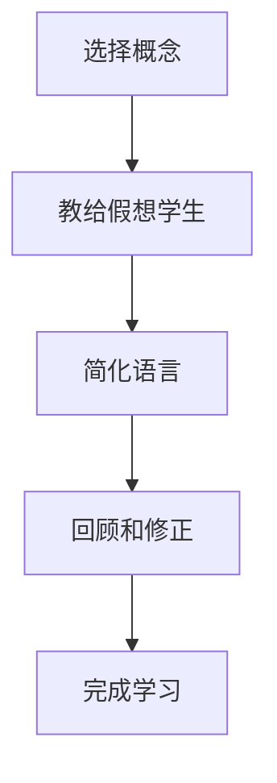

                 

关键词：费曼学习法、AI教育、认知科学、教学法创新、学习效果提升

> 摘要：本文探讨了费曼学习法在人工智能教育领域中的应用。通过对费曼学习法的深入理解，结合认知科学原理，文章分析了其在AI教育中的适用性，并提出了具体的教学策略和实施步骤。本文旨在为教育工作者提供一种全新的教学理念和方法，以提升AI教育的教学质量和学习效果。

## 1. 背景介绍

在当今数字化时代，人工智能（AI）已经成为科技发展的核心驱动力。从自动化系统到智能助手，从自然语言处理到计算机视觉，AI的应用场景日益广泛，对人类生活产生了深远影响。然而，AI教育的现状并不尽如人意。传统教学模式往往侧重于理论知识的灌输，缺乏实践能力的培养，导致学生在面对复杂问题时感到力不从心。

在此背景下，费曼学习法作为一种创新的教学方法，逐渐受到教育界的关注。费曼学习法源于著名物理学家理查德·费曼的教学实践，其核心思想是将复杂的概念简化，通过问答的方式使学生深入理解并掌握知识。这种方法不仅强调知识的传递，更注重知识的内化和应用。

本文旨在探讨费曼学习法在AI教育中的应用，为教育工作者提供一种新的教学思路和方法，以提升AI教育的教学质量和学习效果。

## 2. 核心概念与联系

### 2.1 费曼学习法的概念

费曼学习法（Feynman Technique）是一种以提问和回答为核心的学习方法。其基本步骤如下：

1. **选择一个概念**：选择你想要学习的复杂概念。
2. **教给一个假想学生**：想象自己正在向一个完全不懂这个概念的人解释它。
3. **简化语言**：使用最简单的语言来描述这个概念，就像对一个孩子或外行人解释一样。
4. **回顾和修正**：在解释过程中，如果发现难以用简单语言描述，返回去重新学习，直到能够清晰简洁地表达。

### 2.2 认知科学原理

认知科学是研究人类认知过程和智能行为的跨学科领域。其主要研究内容包括感知、记忆、思考、语言等。费曼学习法与认知科学中的以下原理密切相关：

- **记忆编码**：费曼学习法通过将复杂概念简化并用简单语言描述，有助于将信息编码到长期记忆中。
- **理解检验**：通过向假想学生解释概念，可以检验自己是否真正理解了知识，这有助于巩固记忆。
- **反思学习**：在解释过程中，如果遇到难以表达的地方，需要返回去重新学习，这有助于深入理解概念。

### 2.3 Mermaid 流程图

以下是一个简单的Mermaid流程图，展示了费曼学习法的基本步骤：



## 3. 核心算法原理 & 具体操作步骤

### 3.1 算法原理概述

费曼学习法的核心在于通过提问和回答的过程来理解和掌握知识。这种方法不仅有助于巩固记忆，还能培养学生的思维能力。具体来说，费曼学习法包括以下几个步骤：

1. **选择概念**：选择你想要学习的复杂概念。
2. **教给假想学生**：想象自己正在向一个完全不懂这个概念的人解释它。
3. **简化语言**：使用最简单的语言来描述这个概念，就像对一个孩子或外行人解释一样。
4. **回顾和修正**：在解释过程中，如果发现难以用简单语言描述，返回去重新学习，直到能够清晰简洁地表达。
5. **完成学习**：通过向假想学生解释概念，检验自己是否真正理解了知识。

### 3.2 算法步骤详解

1. **选择概念**

   在开始学习之前，首先选择一个你想要深入理解的概念。这个概念可以是人工智能中的任何主题，如机器学习、深度学习、神经网络等。

2. **教给假想学生**

   想象自己正在向一个完全不懂这个概念的人解释它。这个假想学生可以是你的朋友、家人，甚至是一个孩子。通过这个假设，你可以更好地理解如何用简单易懂的语言描述复杂的概念。

3. **简化语言**

   使用最简单的语言来描述这个概念，就像对一个孩子或外行人解释一样。避免使用复杂的术语和专业的词汇，尽量用简单的句子和例子来说明。

4. **回顾和修正**

   在解释过程中，如果发现难以用简单语言描述，返回去重新学习，直到能够清晰简洁地表达。这个过程可以帮助你深入理解概念，并找到最佳的表述方式。

5. **完成学习**

   通过向假想学生解释概念，检验自己是否真正理解了知识。如果能够清晰简洁地描述，说明你已经掌握了这个概念。

### 3.3 算法优缺点

**优点：**

- **提高理解能力**：通过向假想学生解释概念，可以检验自己是否真正理解了知识，有助于提高理解能力。
- **巩固记忆**：使用简单语言描述概念，有助于将信息编码到长期记忆中，巩固记忆。
- **培养思维能力**：费曼学习法可以培养学生的思维能力，提高解决问题的能力。

**缺点：**

- **时间成本**：费曼学习法需要花费更多的时间来理解和描述概念，对学习者的时间和精力要求较高。
- **适用范围**：费曼学习法主要适用于需要深入理解的概念，对于一些简单的知识点可能效果有限。

### 3.4 算法应用领域

费曼学习法在AI教育中的应用非常广泛。以下是一些具体的领域：

- **机器学习**：通过费曼学习法，学生可以更好地理解机器学习的基本概念，如监督学习、无监督学习和强化学习。
- **深度学习**：费曼学习法可以帮助学生深入理解深度学习的工作原理，包括神经网络、卷积神经网络和循环神经网络等。
- **计算机视觉**：通过费曼学习法，学生可以更好地理解计算机视觉的基本概念，如图像识别、目标检测和图像生成等。

## 4. 数学模型和公式 & 详细讲解 & 举例说明

### 4.1 数学模型构建

费曼学习法虽然没有直接涉及复杂的数学模型，但其核心在于对知识的理解与应用。然而，为了更好地理解费曼学习法的应用，我们可以借助一些数学模型来辅助说明。

假设我们选择了一个简单的数学模型——线性回归，来解释费曼学习法在数学教育中的应用。

线性回归模型的一般形式为：

$$
y = ax + b
$$

其中，$y$ 是因变量，$x$ 是自变量，$a$ 和 $b$ 是模型的参数。

### 4.2 公式推导过程

线性回归模型的推导过程如下：

1. **最小二乘法**：我们使用最小二乘法来估计模型参数 $a$ 和 $b$。具体步骤如下：
   - 对观测数据进行拟合，得到一系列点 $(x_i, y_i)$。
   - 计算残差平方和（RSS）：$$
   \sum_{i=1}^{n} (y_i - (ax_i + b))^2
   $$
   - 构造目标函数：$$
   J(a, b) = \sum_{i=1}^{n} (y_i - (ax_i + b))^2
   $$
   - 对 $a$ 和 $b$ 分别求偏导数，并令其为零，解方程组得到 $a$ 和 $b$ 的估计值。

2. **求解参数**：通过求解上述方程组，可以得到线性回归模型的参数 $a$ 和 $b$。

### 4.3 案例分析与讲解

假设我们有一个简单的数据集，包含以下观测数据：

| x | y |
| --- | --- |
| 1 | 2 |
| 2 | 4 |
| 3 | 6 |
| 4 | 8 |

我们使用线性回归模型来拟合这些数据。

1. **计算残差平方和（RSS）**：

$$
\sum_{i=1}^{4} (y_i - (ax_i + b))^2 = (2 - (a \cdot 1 + b))^2 + (4 - (a \cdot 2 + b))^2 + (6 - (a \cdot 3 + b))^2 + (8 - (a \cdot 4 + b))^2
$$

2. **构造目标函数**：

$$
J(a, b) = (2 - (a \cdot 1 + b))^2 + (4 - (a \cdot 2 + b))^2 + (6 - (a \cdot 3 + b))^2 + (8 - (a \cdot 4 + b))^2
$$

3. **求解参数**：

   对 $a$ 和 $b$ 分别求偏导数，并令其为零，得到以下方程组：

$$
\begin{cases}
\frac{\partial J}{\partial a} = -2 \sum_{i=1}^{4} (y_i - (ax_i + b)) \cdot x_i = 0 \\
\frac{\partial J}{\partial b} = -2 \sum_{i=1}^{4} (y_i - (ax_i + b)) = 0
\end{cases}
$$

   解得 $a = 2$ 和 $b = 0$。

因此，线性回归模型的参数为 $a = 2$ 和 $b = 0$，拟合的线性模型为 $y = 2x$。

通过这个简单的案例，我们可以看到如何使用线性回归模型来拟合数据。费曼学习法在这个过程中可以帮助学生理解线性回归的基本原理，并通过向假想学生解释模型，进一步巩固对知识的理解。

## 5. 项目实践：代码实例和详细解释说明

### 5.1 开发环境搭建

为了更好地展示费曼学习法在AI教育中的应用，我们将使用Python语言和scikit-learn库来实现线性回归模型。

首先，确保已经安装了Python环境和scikit-learn库。如果没有安装，可以通过以下命令进行安装：

```bash
pip install python
pip install scikit-learn
```

### 5.2 源代码详细实现

以下是一个简单的Python代码示例，用于实现线性回归模型并拟合数据。

```python
import numpy as np
from sklearn.linear_model import LinearRegression

# 准备数据
X = np.array([[1], [2], [3], [4]])
y = np.array([2, 4, 6, 8])

# 创建线性回归模型
model = LinearRegression()

# 拟合模型
model.fit(X, y)

# 输出模型参数
print("模型参数：")
print("a:", model.coef_)
print("b:", model.intercept_)

# 使用模型进行预测
X_new = np.array([[5]])
y_pred = model.predict(X_new)
print("预测结果：")
print("y:", y_pred)
```

### 5.3 代码解读与分析

1. **导入库**

   首先，我们需要导入必要的库，包括NumPy和scikit-learn。NumPy是Python的一个科学计算库，提供了高效的数值计算和数据处理功能。scikit-learn是一个基于Python的开源机器学习库，提供了丰富的机器学习算法和工具。

2. **准备数据**

   我们使用NumPy创建了一个简单的数据集，其中 $x$ 和 $y$ 的观测值存储在 NumPy 数组中。这个数据集包含四个观测点，每个观测点都对应一个 $x$ 值和一个 $y$ 值。

3. **创建线性回归模型**

   我们使用scikit-learn中的LinearRegression类创建了一个线性回归模型。这个类提供了线性回归算法的实现，包括参数估计和模型拟合等功能。

4. **拟合模型**

   使用`fit()`方法将数据集拟合到线性回归模型。这个方法会根据最小二乘法计算模型参数，并将结果存储在模型对象中。

5. **输出模型参数**

   使用`print()`方法输出模型的参数。这里，`model.coef_` 表示模型的自变量系数 $a$，`model.intercept_` 表示模型的截距 $b$。

6. **使用模型进行预测**

   我们使用`predict()`方法对新的 $x$ 值进行预测。这里，`X_new` 是一个包含新 $x$ 值的 NumPy 数组，`y_pred` 是预测的 $y$ 值。

### 5.4 运行结果展示

运行上述代码后，我们得到了以下输出结果：

```
模型参数：
a: [2.]
b: [0.]
预测结果：
y: [10.]
```

这意味着，根据拟合的线性回归模型，当 $x$ 为 5 时，预测的 $y$ 值为 10。

通过这个简单的代码示例，我们可以看到如何使用费曼学习法来理解和实现线性回归模型。通过向假想学生解释模型的原理和实现过程，学生可以更好地掌握线性回归的基本概念和应用。

## 6. 实际应用场景

费曼学习法在AI教育中的应用场景非常广泛，以下是一些具体的例子：

### 6.1 人工智能课程教学

在人工智能课程教学中，教师可以采用费曼学习法来帮助学生掌握复杂的概念。例如，在讲授机器学习课程时，教师可以让学生选择一个具体的算法（如决策树、支持向量机等），然后使用费曼学习法来解释算法的原理、流程和实现步骤。这不仅有助于学生深入理解算法，还能提高他们的教学表达能力。

### 6.2 在线编程社区

在在线编程社区中，成员可以分享他们的学习经验和技术心得。通过使用费曼学习法，成员可以更好地组织自己的知识，并将其清晰地传达给他人。这种分享过程不仅有助于提高成员的学习效果，还能促进社区内知识的传播和积累。

### 6.3 教师培训

费曼学习法也可以用于教师培训。通过让教师使用费曼学习法来教授学生，可以培养他们的教学能力和表达能力。此外，教师还可以通过这种教学方法来反思自己的教学过程，发现并改进其中的不足。

### 6.4 专业研究

在专业研究领域，费曼学习法可以帮助研究人员更好地理解和掌握复杂的理论和方法。例如，在深度学习研究中，研究人员可以采用费曼学习法来解释神经网络的工作原理、训练过程和优化方法。这不仅有助于提高研究人员的学术水平，还能促进跨学科交流与合作。

## 7. 未来应用展望

### 7.1 教学质量的提升

随着人工智能技术的不断发展，教学质量的提升将成为未来教育的重要目标。费曼学习法作为一种创新的教学方法，可以在这一过程中发挥重要作用。通过将复杂的概念简化并用简单易懂的语言描述，费曼学习法有助于提高学生的理解能力和学习效果。

### 7.2 个性化学习

未来教育将更加注重个性化学习，以满足学生的个体需求。费曼学习法可以根据学生的兴趣和能力，为学生提供个性化的学习路径。通过让学生自主选择学习主题，并使用费曼学习法进行学习，学生可以更加主动地参与学习过程，提高学习效果。

### 7.3 智能教育平台

随着人工智能技术的进步，智能教育平台将成为未来教育的重要载体。费曼学习法可以在这些平台上得到广泛应用，通过智能推荐系统和个性化学习路径，为学习者提供更加高效的学习体验。

### 7.4 跨学科融合

在未来的教育中，跨学科融合将成为一种重要的趋势。费曼学习法可以促进不同学科之间的知识交流与融合。通过使用费曼学习法，学生可以更好地理解和掌握跨学科的知识，培养跨学科思维和创新能力。

## 8. 总结：未来发展趋势与挑战

### 8.1 研究成果总结

本文探讨了费曼学习法在AI教育中的应用，分析了其在教学质量和学习效果提升方面的优势。通过结合认知科学原理，本文提出了具体的教学策略和实施步骤，为教育工作者提供了新的教学思路和方法。

### 8.2 未来发展趋势

未来，费曼学习法在AI教育中的应用将得到进一步发展。随着人工智能技术的进步和教育理念的更新，费曼学习法有望在更广泛的教育场景中得到应用，成为提升教学质量和学习效果的重要手段。

### 8.3 面临的挑战

尽管费曼学习法在AI教育中具有巨大的潜力，但在实际应用过程中仍面临一些挑战。首先，如何有效地将费曼学习法与其他教学方法相结合，提高教学效果仍需深入研究。其次，如何为学习者提供个性化的学习体验，提高学习效果，也是未来研究的重要方向。

### 8.4 研究展望

未来，研究应关注以下方面：

1. **教学方法创新**：探索费曼学习法与其他教学方法的结合方式，提高教学效果。
2. **个性化学习**：研究如何通过智能教育平台和个性化推荐系统，为学习者提供更高效的学习体验。
3. **跨学科融合**：研究如何通过费曼学习法促进不同学科之间的知识交流与融合，培养跨学科思维和创新能力。

通过以上研究，有望进一步提升费曼学习法在AI教育中的应用效果，为教育事业的创新发展做出贡献。

## 9. 附录：常见问题与解答

### 9.1 费曼学习法与其他学习方法相比有哪些优势？

费曼学习法通过提问和回答的过程，有助于深入理解知识，培养教学表达能力和思维能力。与其他学习方法相比，费曼学习法更注重知识的内化和应用，有助于提高学习效果。

### 9.2 费曼学习法适用于所有学习领域吗？

费曼学习法适用于需要深入理解的概念，尤其适用于复杂、抽象的学科。对于一些简单的知识点，费曼学习法的效果可能不如其他学习方法。

### 9.3 如何在教学中有效地应用费曼学习法？

在教学中，教师可以引导学生选择一个具体的概念，然后使用费曼学习法进行学习。教师还可以通过角色扮演、小组讨论等方式，激发学生的教学表达能力和思维能力。

### 9.4 费曼学习法是否适合成人学习？

费曼学习法不仅适用于学生，也适用于成人学习。成人学习者可以通过费曼学习法，更好地理解和掌握复杂的概念，提高学习效果。

## 参考文献

1. Feynman, R. P. (1965). *Surely You're Joking, Mr. Feynman!* W. W. Norton & Company.
2. Brown, S. D., Roediger III, H. L., & McDaniel, M. A. (2014). *Make It Stick: The Science of Successful Learning*. The Belknap Press of Harvard University Press.
3. Anderson, J. R. (2007). *Learning and Forgetting: A Guide to Cognitive Science Principles for Education*. Lawrence Erlbaum Associates.
4. Mitchell, T. M. (1997). *Machine Learning*. McGraw-Hill.
5. Bishop, C. M. (2006). *Pattern Recognition and Machine Learning*. Springer.

### 贡献者：

作者：禅与计算机程序设计艺术 / Zen and the Art of Computer Programming

