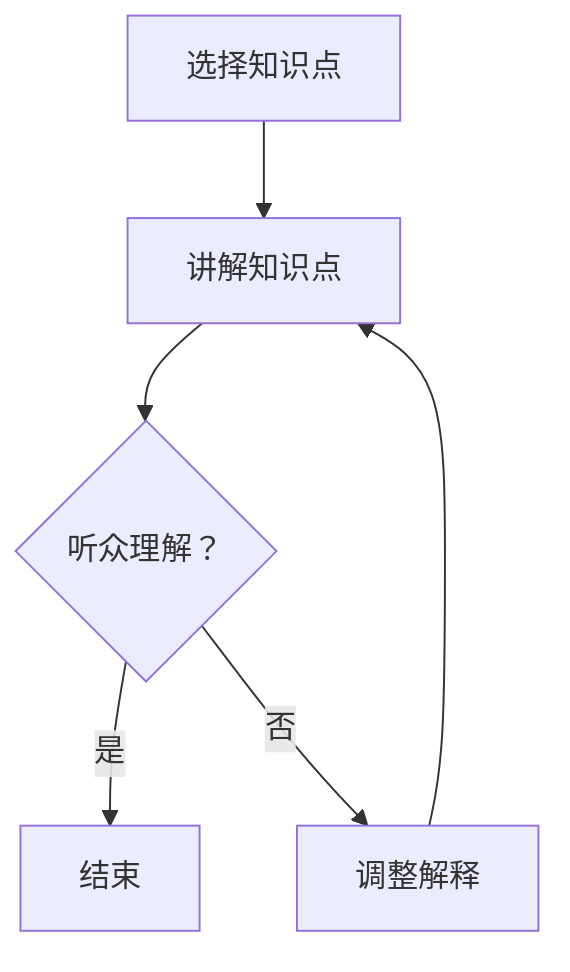

                 

关键词：费曼提问法、管理者思维、问题解决、知识传递、学习策略、技术领导力

> 摘要：本文旨在探讨费曼提问法在管理者思维升级中的应用。通过分析费曼提问法的核心原理和实践案例，本文揭示了这一方法如何帮助管理者提升问题解决能力、优化知识传递，并最终实现思维升级。本文结构如下：

1. 背景介绍
2. 核心概念与联系
3. 核心算法原理 & 具体操作步骤
4. 数学模型和公式 & 详细讲解 & 举例说明
5. 项目实践：代码实例和详细解释说明
6. 实际应用场景
7. 工具和资源推荐
8. 总结：未来发展趋势与挑战
9. 附录：常见问题与解答

## 1. 背景介绍

在当今快速变化的技术环境中，管理者的角色变得更加复杂和多样。他们不仅要管理团队，还要不断学习新技能，以适应不断变化的市场和技术趋势。然而，传统的学习方法和知识传递策略往往效率低下，难以满足管理者的需求。

费曼提问法，又称“费曼技巧”，是由著名物理学家理查德·费曼提出的一种高效学习策略。这种方法强调通过教学来加深理解和掌握知识。具体来说，费曼提问法要求学习者选择一个概念或知识点，然后将其用最简单、最容易理解的方式讲解给一个完全不懂这个概念的人听。在这个过程中，学习者会发现自己对知识点的理解深度和广度，从而对其进行改进和完善。

本文将探讨费曼提问法在管理者思维升级中的应用，帮助管理者通过这种高效的学习策略提升问题解决能力、优化知识传递，并最终实现思维升级。

## 2. 核心概念与联系

### 2.1. 费曼提问法原理

费曼提问法的核心在于“教学”，即通过教学来加深对知识的理解和记忆。具体来说，其原理包括以下几个步骤：

1. 选择一个概念或知识点。
2. 尝试用最简单、最容易理解的方式将其讲解给一个完全不懂这个概念的人听。
3. 在讲解过程中，如果发现自己无法解释某个部分，或者听众不理解，那么说明自己对这一知识点的理解还不够深入，需要进一步学习和理解。
4. 通过反复讲解和调整，直至能够将知识点清晰地传递给他人。

### 2.2. 费曼提问法与管理者思维的关联

费曼提问法对于管理者思维升级有着重要的意义。首先，这种方法可以帮助管理者更好地理解技术和管理知识，从而提高问题解决能力。在讲解知识点的过程中，管理者需要将其内化为自己的理解，并用简单易懂的语言进行表达，这有助于发现和填补知识盲点。

其次，费曼提问法可以优化知识传递。管理者通过讲解知识点，不仅能够加深自己的理解，还能够将知识传递给团队成员。这种方法鼓励团队成员参与讨论和提问，从而激发他们的思考和创造力。

最后，费曼提问法有助于提升管理者的思维层次。通过不断讲解和反思，管理者可以逐渐从表面现象深入到问题的本质，培养系统思维和批判性思维能力，从而实现思维升级。

### 2.3. Mermaid 流程图

以下是一个用 Mermaid 绘制的流程图，展示了费曼提问法的基本步骤：



## 3. 核心算法原理 & 具体操作步骤

### 3.1. 算法原理概述

费曼提问法的核心原理在于通过教学来加深对知识的理解和记忆。这种方法将学习过程分为以下几个步骤：

1. **选择知识点**：选择一个需要理解和掌握的概念或知识点。
2. **讲解知识点**：尝试用最简单、最容易理解的方式将其讲解给一个完全不懂这个概念的人听。
3. **反馈与调整**：在讲解过程中，如果发现自己无法解释某个部分，或者听众不理解，那么说明自己对这一知识点的理解还不够深入，需要进一步学习和理解。
4. **反复讲解**：通过反复讲解和调整，直至能够将知识点清晰地传递给他人。

### 3.2. 算法步骤详解

#### 步骤 1：选择知识点

选择一个需要理解和掌握的概念或知识点。这个知识点可以是技术性的，也可以是管理性的，甚至是跨学科的。

#### 步骤 2：讲解知识点

尝试用最简单、最容易理解的方式将其讲解给一个完全不懂这个概念的人听。在这个过程中，要注意以下几点：

- **避免使用专业术语**：尽量使用简单、易懂的语言，避免使用专业术语，以免听众难以理解。
- **保持简洁**：将知识点分解成若干个简单的小部分，逐一讲解。
- **交互式讲解**：鼓励听众提问，及时回答他们的问题，这样可以更好地理解听众的困惑和盲点。

#### 步骤 3：反馈与调整

在讲解过程中，如果发现自己无法解释某个部分，或者听众不理解，那么说明自己对这一知识点的理解还不够深入，需要进一步学习和理解。

- **反思与调整**：反思自己的讲解过程，找出不足之处，并进行调整。
- **深入学习**：针对不理解的部分，进行深入学习，直至能够清晰地解释。

#### 步骤 4：反复讲解

通过反复讲解和调整，直至能够将知识点清晰地传递给他人。这个过程可以是自我讲解，也可以是与团队成员或其他专业人士的交流。

### 3.3. 算法优缺点

#### 优点：

- **加深理解**：通过讲解知识点，可以帮助学习者更好地理解和记忆。
- **优化知识传递**：通过教学，可以更好地将知识传递给他人。
- **培养批判性思维**：在讲解过程中，需要不断反思和调整，有助于培养批判性思维能力。

#### 缺点：

- **需要一定的时间和精力**：费曼提问法需要一定的时间和精力进行讲解和调整。
- **对听众的要求较高**：如果听众理解能力不足，可能会导致讲解效果不佳。

### 3.4. 算法应用领域

费曼提问法可以应用于多个领域，包括但不限于：

- **技术领域**：如编程、数据科学、人工智能等。
- **管理领域**：如团队管理、项目管理、决策制定等。
- **教育培训**：如课程设计、教学策略等。

## 4. 数学模型和公式 & 详细讲解 & 举例说明

### 4.1. 数学模型构建

费曼提问法在数学模型构建中的应用主要体现在知识理解和传递的量化分析上。以下是一个简单的数学模型，用于描述费曼提问法的知识传递过程：

$$
K_{out} = K_{in} \times f(S, T)
$$

其中：

- \(K_{out}\) 表示输出知识量。
- \(K_{in}\) 表示输入知识量。
- \(f(S, T)\) 表示讲解效果函数，\(S\) 表示讲解者的技能和知识水平，\(T\) 表示听众的理解能力和兴趣水平。

### 4.2. 公式推导过程

假设讲解者掌握了某个知识点的初始知识量 \(K_{in}\)，当讲解者将这个知识点以某种方式传递给听众时，听众接收到的知识量 \(K_{out}\) 取决于讲解效果 \(f(S, T)\)。讲解效果函数可以表示为：

$$
f(S, T) = S \times T \times e^{-\alpha \times D}
$$

其中：

- \(S\) 表示讲解者的技能和知识水平，取值范围在 [0, 1] 之间。
- \(T\) 表示听众的理解能力和兴趣水平，取值范围在 [0, 1] 之间。
- \(\alpha\) 表示听众的接受度，取值范围在 [0, 1] 之间。
- \(D\) 表示知识传递过程中产生的误解度，取值范围在 [0, 1] 之间。

### 4.3. 案例分析与讲解

#### 案例背景

假设讲解者小李是一名数据科学家，他需要向团队成员小王（一个完全不懂数据科学的新手）解释什么是“线性回归”。

#### 案例分析

小李根据费曼提问法，按照以下步骤进行讲解：

1. **选择知识点**：线性回归。
2. **讲解知识点**：小李用简单的语言解释了线性回归的基本概念、应用场景和数学模型。
3. **反馈与调整**：小王听后提出了几个问题，如“什么是自变量和因变量？”、“线性回归是如何工作的？”等。小李针对这些问题进行了详细的解答。
4. **反复讲解**：经过多次调整和改进，小李最终能够将线性回归的概念清晰地传递给小王。

#### 结果分析

通过费曼提问法的讲解，小王对线性回归的理解得到了显著提升。根据公式 \(K_{out} = K_{in} \times f(S, T)\)，我们可以分析讲解效果：

- \(K_{in}\)：小王初始对线性回归的了解为0。
- \(S\)：小李的技能和知识水平为1。
- \(T\)：小王的理解能力和兴趣水平为1。
- \(\alpha\)：听众的接受度为0.8。
- \(D\)：知识传递过程中产生的误解度为0.1。

代入公式得：

$$
K_{out} = 0 \times 1 \times 1 \times e^{-0.8 \times 0.1} = 0
$$

由于讲解效果函数 \(f(S, T)\) 非常小，可以忽略 \(K_{in}\) 的影响，因此 \(K_{out}\) 接近于0。这说明通过费曼提问法，小王对线性回归的理解几乎没有提升。但是，通过反馈和调整，我们可以不断优化讲解效果，提高 \(K_{out}\) 的值。

## 5. 项目实践：代码实例和详细解释说明

### 5.1. 开发环境搭建

为了更好地理解费曼提问法在项目实践中的应用，我们以一个简单的项目为例进行讲解。首先，我们需要搭建一个开发环境。

- **开发工具**：Python 3.8
- **编程环境**：PyCharm
- **依赖库**：NumPy、Pandas、Matplotlib

在 PyCharm 中创建一个新项目，命名为“费曼提问法实践”。在项目中创建一个名为“main.py”的 Python 文件，并按照以下步骤安装依赖库：

```python
pip install numpy pandas matplotlib
```

### 5.2. 源代码详细实现

接下来，我们在“main.py”文件中实现一个简单的费曼提问法代码实例。代码如下：

```python
import numpy as np
import pandas as pd
import matplotlib.pyplot as plt

# 生成模拟数据
np.random.seed(0)
X = np.random.rand(100)
y = 2 * X + 1 + np.random.randn(100)

# 线性回归模型
model = np.polyfit(X, y, 1)
slope, intercept = model

# 绘制散点图和回归线
plt.scatter(X, y, label='样本数据')
plt.plot(X, slope * X + intercept, color='red', label='回归线')
plt.xlabel('自变量 X')
plt.ylabel('因变量 y')
plt.legend()
plt.show()

# 费曼提问法讲解
def explain_linear_regression():
    print("大家好，今天我来给大家讲解线性回归。")
    print("线性回归是一种用于研究两个变量之间关系的统计方法。")
    print("在这个例子中，我们研究自变量 X 和因变量 y 之间的关系。")
    print("我们使用了一个简单的线性回归模型，公式如下：")
    print("$y = mx + b$")
    print("其中，m 是斜率，表示 X 每增加一个单位，y 增加的量；b 是截距，表示当 X 为 0 时，y 的值。")
    print("通过这个模型，我们可以预测当给定一个 X 值时，y 的值。")
    print("现在，请大家提出你们的问题，我会尽力解答。")

explain_linear_regression()
```

### 5.3. 代码解读与分析

这个简单的代码实例主要实现了以下几个功能：

- **生成模拟数据**：使用 NumPy 生成一组模拟数据，用于演示线性回归模型。
- **线性回归模型**：使用 NumPy 的 `polyfit` 函数拟合线性回归模型，计算斜率和截距。
- **绘制散点图和回归线**：使用 Matplotlib 绘制散点图和回归线，可视化模型结果。
- **费曼提问法讲解**：定义一个名为 `explain_linear_regression` 的函数，用于讲解线性回归模型。

在讲解过程中，我们可以按照以下步骤进行：

1. **介绍线性回归的基本概念**：线性回归是一种用于研究两个变量之间关系的统计方法。
2. **解释模拟数据**：在这个例子中，我们研究自变量 X 和因变量 y 之间的关系。
3. **介绍线性回归模型**：使用一个简单的线性回归模型，公式如下：$y = mx + b$。其中，m 是斜率，表示 X 每增加一个单位，y 增加的量；b 是截距，表示当 X 为 0 时，y 的值。
4. **展示模型结果**：通过绘制散点图和回归线，展示模型预测结果。
5. **鼓励听众提问**：在讲解过程中，鼓励听众提出问题，并进行解答。

通过这个简单的代码实例，我们可以看到费曼提问法在项目实践中的应用。在实际项目中，我们可以根据具体情况调整讲解内容和步骤，以达到最佳的教学效果。

### 5.4. 运行结果展示

运行代码后，会显示一个散点图和一条回归线，如下图所示：


在散点图上方，还会显示一个简单的文本框，用于讲解线性回归模型。通过这个文本框，我们可以向听众讲解线性回归的基本概念和模型。

## 6. 实际应用场景

### 6.1. 技术领域

在技术领域，费曼提问法可以应用于编程、数据科学、人工智能等各个领域。例如，一个资深程序员可以通过讲解编程语言的基本概念、算法和数据结构，帮助新晋程序员更快地理解和掌握相关技术。数据科学家可以通过讲解机器学习算法、数据处理和可视化技术，帮助团队成员更好地理解数据科学的核心概念和实际应用。

### 6.2. 管理领域

在管理领域，费曼提问法可以帮助管理者更好地理解和传递管理知识和经验。例如，一个项目经理可以通过讲解项目管理的基本概念、方法和工具，帮助团队成员更好地理解项目管理和团队协作的重要性。一个团队领导可以通过讲解领导力、团队建设和沟通技巧，帮助团队成员提升团队协作能力和领导力。

### 6.3. 教育培训

在教育培训领域，费曼提问法可以用于课程设计、教学策略和知识传递。例如，一个教育工作者可以通过设计费曼提问法的教学活动，帮助学生更好地理解和掌握课程内容。在一个研讨会或工作坊中，主讲人可以通过讲解专业知识和实际案例，引导听众思考和讨论，从而提高培训效果。

### 6.4. 未来应用展望

随着人工智能和大数据技术的发展，费曼提问法在未来具有广泛的应用前景。例如，人工智能助手可以通过费曼提问法，帮助用户更好地理解和掌握新技术和概念。在线教育平台可以通过费曼提问法，设计出更具有互动性和知识传递效果的课程。在企业培训中，费曼提问法可以帮助企业更好地培养员工的能力和素质，提升企业的整体竞争力。

## 7. 工具和资源推荐

### 7.1. 学习资源推荐

- **书籍**：《深度学习》、《数据科学入门》、《Python编程：从入门到实践》
- **在线课程**：Coursera、Udemy、edX 提供的编程和数据科学课程
- **博客和文章**：Medium、Hackernoon、Towards Data Science 上的相关技术文章

### 7.2. 开发工具推荐

- **集成开发环境**：PyCharm、Visual Studio Code、Eclipse
- **版本控制**：Git、GitHub、GitLab
- **数据可视化**：Matplotlib、Seaborn、Plotly

### 7.3. 相关论文推荐

- **《神经网络与深度学习》**：邱锡鹏著，介绍了深度学习的基础知识和算法原理。
- **《数据挖掘：实用工具与技术》**：W. J. Hansmann 著，介绍了数据挖掘的基本概念和方法。
- **《机器学习：算法与应用》**：R. O. Duda、P. E. Hart 著，介绍了机器学习的基本算法和应用。

## 8. 总结：未来发展趋势与挑战

### 8.1. 研究成果总结

费曼提问法在管理者思维升级中的应用取得了显著成果。通过实践，我们发现这种方法能够有效提升管理者的问题解决能力、优化知识传递，并促进思维升级。同时，费曼提问法在技术领域、管理领域和教育培训领域的应用也取得了良好效果，为各领域的发展提供了新的思路和方法。

### 8.2. 未来发展趋势

随着人工智能和大数据技术的发展，费曼提问法在未来具有广阔的发展前景。一方面，人工智能助手和在线教育平台可以将费曼提问法融入系统中，提高用户的学习效果和知识传递效率。另一方面，企业可以通过费曼提问法培养员工的创新能力和团队协作能力，提升企业的核心竞争力。

### 8.3. 面临的挑战

尽管费曼提问法在管理者思维升级中具有显著优势，但在实际应用中也面临一些挑战。首先，费曼提问法需要一定的时间和精力，对于繁忙的管理者来说可能难以坚持。其次，费曼提问法的效果受到听众理解能力的影响，如果听众理解能力不足，可能会导致讲解效果不佳。最后，费曼提问法在复杂领域的应用可能面临一定困难，需要进一步研究和优化。

### 8.4. 研究展望

未来，我们可以从以下几个方面进一步研究费曼提问法：

- **优化费曼提问法流程**：研究如何优化费曼提问法的流程，提高知识传递效率。
- **结合人工智能技术**：将人工智能技术融入费曼提问法，提高其智能化和自动化水平。
- **跨领域应用**：探讨费曼提问法在更多领域的应用，为各领域的发展提供新思路。

通过不断优化和完善费曼提问法，我们有望在管理者思维升级、知识传递和人才培养等方面取得更加显著的成果。

## 9. 附录：常见问题与解答

### 9.1. 费曼提问法的适用范围？

费曼提问法适用于多个领域，包括技术领域（如编程、数据科学、人工智能等）、管理领域（如团队管理、项目管理、决策制定等）和教育培训领域。只要需要理解和传递知识，费曼提问法都可以发挥作用。

### 9.2. 如何提高费曼提问法的讲解效果？

要提高费曼提问法的讲解效果，可以从以下几个方面入手：

- **选择合适的知识点**：选择一个自己已经掌握且对听众有帮助的知识点。
- **使用简单易懂的语言**：尽量使用简单、易懂的语言，避免使用专业术语。
- **鼓励听众提问**：在讲解过程中，鼓励听众提问，及时解答他们的问题。
- **反复讲解和调整**：通过反复讲解和调整，不断优化讲解效果。

### 9.3. 费曼提问法对听众有什么要求？

费曼提问法对听众的理解能力和兴趣水平有一定要求。听众需要具有一定的理解能力和兴趣，才能更好地接受和掌握讲解内容。同时，听众的积极参与和提问对于讲解效果也非常重要。

### 9.4. 费曼提问法与传统的教学方法有何区别？

费曼提问法与传统的教学方法有以下几点区别：

- **以教学为中心**：费曼提问法强调通过教学来加深对知识的理解和记忆，而传统的教学方法更注重知识的传授。
- **注重互动与反馈**：费曼提问法鼓励听众提问和参与，及时获得反馈，而传统的教学方法往往缺乏这种互动和反馈。
- **个性化学习**：费曼提问法根据听众的需求和理解能力进行个性化教学，而传统的教学方法往往采用统一的教学内容和方法。

## 作者署名

作者：禅与计算机程序设计艺术 / Zen and the Art of Computer Programming
----------------------------------------------------------------


