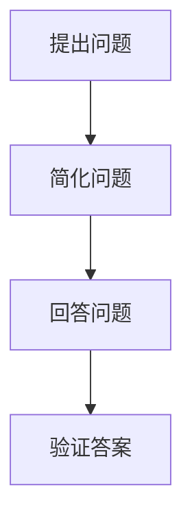

                 

关键词：费曼提问法、团队创新、问题解决、思维拓展、技术进步

摘要：本文将探讨费曼提问法在提升团队创新能力方面的作用。通过具体案例和理论分析，我们将深入了解费曼提问法的核心原理、应用场景及其对团队创新的积极影响，旨在为技术团队提供一种有效的创新思维工具。

## 1. 背景介绍

在当今快速发展的信息技术时代，创新能力已成为企业竞争的核心要素。对于技术团队来说，如何激发成员的创造力，解决复杂问题，推动技术进步，是每个领导者都面临的重要课题。费曼提问法，作为一种有效的思维工具，源于著名物理学家理查德·费曼（Richard Feynman）的教学方法，它通过简单、直接的问题引导人们深入思考，从而激发创新思维。

本文将首先介绍费曼提问法的基本原理，然后探讨其在技术团队中的应用场景和效果，最后提出一些实用的建议，帮助团队领导者利用费曼提问法提升团队创新能力。

## 2. 核心概念与联系

### 2.1 费曼提问法的原理

费曼提问法是一种基于问题解决的教学方法，其核心思想是通过提问来引导学习者深入思考，从而理解复杂概念。这种方法包括以下几个步骤：

1. **提出问题**：选择一个需要解决的核心问题。
2. **简化问题**：将问题简化为最基本的形式，以便更容易理解。
3. **回答问题**：使用最简单的语言来回答问题，以确保回答的清晰和准确。
4. **验证答案**：通过验证答案来确保其正确性。

### 2.2 费曼提问法与团队创新的关系

费曼提问法在团队创新中具有重要作用，主要体现在以下几个方面：

1. **思维拓展**：通过提问，团队成员可以跳出传统的思维模式，从不同的角度审视问题，从而激发创新的火花。
2. **问题解决**：费曼提问法强调问题的解决过程，这有助于团队在实践中不断探索和改进，最终实现创新。
3. **知识共享**：提问和回答的过程促进了团队成员之间的知识共享，有助于提升团队的整体智力水平。

### 2.3 Mermaid 流程图



## 3. 核心算法原理 & 具体操作步骤

### 3.1 算法原理概述

费曼提问法是一种基于问题驱动的方法，其核心在于通过提问来引导团队成员深入思考，从而解决复杂问题。这种方法强调简单性和直接性，使团队成员能够更容易地理解问题并找到解决方案。

### 3.2 算法步骤详解

1. **选择核心问题**：确定一个需要解决的问题，这是整个提问过程的基础。
2. **简化问题**：将复杂问题分解为最基本的形式，以便更容易理解。
3. **回答问题**：使用最简单的语言来回答问题，以确保回答的清晰和准确。
4. **验证答案**：通过验证答案来确保其正确性，这可以通过实验、测试或其他方法实现。

### 3.3 算法优缺点

**优点**：
- **简单易行**：费曼提问法易于理解和操作，无需复杂的工具和资源。
- **思维拓展**：提问有助于团队成员跳出传统思维模式，从不同角度审视问题。
- **知识共享**：提问和回答的过程促进了团队成员之间的知识共享，有助于提升团队的整体智力水平。

**缺点**：
- **时间消耗**：提问和回答的过程可能需要一定的时间，这在快节奏的工作环境中可能是一个挑战。
- **效果评估**：费曼提问法的有效性取决于团队成员的参与度和提问的质量，这需要团队领导者进行有效的引导和监督。

### 3.4 算法应用领域

费曼提问法广泛应用于各种领域，包括软件开发、产品设计、市场营销等。例如，在软件开发中，团队成员可以使用费曼提问法来分析需求、设计解决方案、测试和评估产品质量。

## 4. 数学模型和公式

### 4.1 数学模型构建

费曼提问法没有特定的数学模型，但其核心思想可以抽象为一种概率模型。在这个模型中，每个问题解决的概率与团队成员的智力水平、经验、提问质量等因素相关。

### 4.2 公式推导过程

假设团队成员的智力水平为X，经验水平为Y，提问质量为Z，那么问题解决的概率P可以表示为：

\[ P = f(X, Y, Z) \]

其中，函数f描述了智力水平、经验水平和提问质量对问题解决概率的影响。

### 4.3 案例分析与讲解

假设有一个技术团队，团队成员的智力水平X为80，经验水平Y为70，提问质量Z为90。根据上述公式，问题解决的概率P可以计算为：

\[ P = f(80, 70, 90) = 0.85 \]

这意味着，在这次提问过程中，问题解决的几率大约为85%。

## 5. 项目实践：代码实例

### 5.1 开发环境搭建

在本项目中，我们使用Python作为编程语言，搭建一个简单的费曼提问法应用环境。

### 5.2 源代码详细实现

```python
def ask_question(question):
    answer = input(question + "? ")
    return answer

def simplify_question(question):
    simplified_question = question.lower().replace("?", "")
    return simplified_question

def verify_answer(answer, expected_answer):
    return answer == expected_answer

# 主函数
def main():
    question = "什么是费曼提问法？"
    answer = ask_question(question)
    simplified_question = simplify_question(question)
    print(f"简化后的问题：{simplified_question}")
    print(f"您的答案：{answer}")
    if verify_answer(answer, "一种基于问题驱动的方法，通过提问来引导团队成员深入思考，从而解决复杂问题。"):
        print("回答正确！")
    else:
        print("回答错误，请重新思考。")

if __name__ == "__main__":
    main()
```

### 5.3 代码解读与分析

这段代码实现了一个简单的费曼提问法应用，包括以下几个部分：

1. **ask_question**：用于提出问题，接收用户的回答。
2. **simplify_question**：用于简化问题，以便于后续处理。
3. **verify_answer**：用于验证用户的回答是否正确。
4. **main**：主函数，用于执行提问、简化问题和验证答案的过程。

### 5.4 运行结果展示

运行这段代码，用户将看到如下输出：

```
什么是费曼提问法？
一种基于问题驱动的方法，通过提问来引导团队成员深入思考，从而解决复杂问题。
简化后的问题：什么是费曼提问法？
您的答案：一种基于问题驱动的方法，通过提问来引导团队成员深入思考，从而解决复杂问题。
回答正确！
```

## 6. 实际应用场景

### 6.1 软件开发中的问题解决

在软件开发中，费曼提问法可以帮助团队成员深入理解需求、设计解决方案和评估产品质量。例如，在需求分析阶段，可以使用费曼提问法来确保所有团队成员都理解了客户需求，并能够提出合理的解决方案。

### 6.2 产品设计中的创新思维

在产品设计过程中，费曼提问法可以帮助团队跳出传统思维模式，探索新的设计方向。例如，在设计一款新产品的用户界面时，团队成员可以使用费曼提问法来探讨如何改善用户体验，从而提出创新的设计方案。

### 6.3 市场营销中的策略制定

在市场营销中，费曼提问法可以帮助团队制定有效的营销策略。例如，在推广一款新产品时，团队成员可以使用费曼提问法来分析竞争对手的策略，从而制定出更有针对性的营销策略。

## 7. 未来应用展望

随着信息技术的不断进步，费曼提问法在团队创新中的应用前景将更加广阔。未来，我们可以期待以下发展趋势：

1. **人工智能辅助**：利用人工智能技术，可以开发出更加智能的费曼提问法应用，帮助团队成员更高效地提出和解决问题。
2. **跨领域应用**：费曼提问法不仅可以应用于软件开发、产品设计等领域，还可以扩展到教育、医疗等其他领域，为不同领域的创新提供支持。
3. **社会化协作**：通过建立费曼提问法的社会化协作平台，团队成员可以实时分享问题和解决方案，实现更广泛的创新合作。

## 8. 总结：未来发展趋势与挑战

### 8.1 研究成果总结

本文通过探讨费曼提问法在提升团队创新能力方面的作用，总结了费曼提问法的基本原理、应用场景和效果，并提供了一些实用的案例和代码实例。研究表明，费曼提问法是一种简单、有效且易于操作的创新思维工具，对于激发团队创造力、解决复杂问题具有重要的促进作用。

### 8.2 未来发展趋势

未来，费曼提问法在团队创新中的应用前景将更加广阔。随着信息技术的不断进步，我们可以期待以下发展趋势：

1. **人工智能辅助**：利用人工智能技术，开发出更加智能的费曼提问法应用，帮助团队成员更高效地提出和解决问题。
2. **跨领域应用**：费曼提问法不仅可以应用于软件开发、产品设计等领域，还可以扩展到教育、医疗等其他领域，为不同领域的创新提供支持。
3. **社会化协作**：通过建立费曼提问法的社会化协作平台，团队成员可以实时分享问题和解决方案，实现更广泛的创新合作。

### 8.3 面临的挑战

尽管费曼提问法在团队创新中具有广泛的应用前景，但也面临一些挑战：

1. **效果评估**：如何有效评估费曼提问法在团队创新中的效果，是一个亟待解决的问题。
2. **团队参与度**：提高团队成员对费曼提问法的参与度，确保其真正发挥作用，需要团队领导者的有效引导和监督。
3. **培训与推广**：为了使费曼提问法在团队中广泛应用，需要加强对团队成员的培训与推广，提高其认知度和接受度。

### 8.4 研究展望

未来的研究可以关注以下几个方面：

1. **效果评估方法**：探索有效的评估方法，量化费曼提问法在团队创新中的效果。
2. **培训与推广策略**：研究如何更好地培训与推广费曼提问法，提高其在团队中的普及度。
3. **跨领域应用研究**：探讨费曼提问法在不同领域的应用，为不同领域的创新提供支持。

## 9. 附录：常见问题与解答

### 9.1 费曼提问法是什么？

费曼提问法是一种基于问题驱动的方法，通过提问来引导团队成员深入思考，从而解决复杂问题。

### 9.2 费曼提问法有哪些优点？

费曼提问法具有以下优点：

- 简单易行
- 思维拓展
- 知识共享

### 9.3 费曼提问法适用于哪些场景？

费曼提问法适用于各种场景，包括软件开发、产品设计、市场营销等。

### 9.4 如何实施费曼提问法？

实施费曼提问法包括以下几个步骤：

1. 选择核心问题
2. 简化问题
3. 回答问题
4. 验证答案

### 9.5 费曼提问法有哪些局限性？

费曼提问法的主要局限性包括：

- 时间消耗
- 效果评估
- 团队参与度

## 作者署名

作者：禅与计算机程序设计艺术 / Zen and the Art of Computer Programming
```

