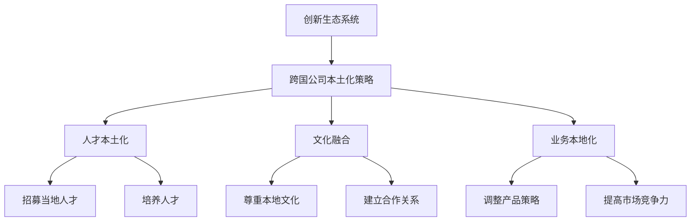

                 

### 关键词 Keywords

- 跨国公司
- 硅谷
- 本土化
- 生态系统
- 创新文化
- 人才战略
- 技术整合

### 摘要 Abstract

本文探讨跨国公司在硅谷实现本土化的重要性和策略。通过对硅谷创新生态系统的深入分析，揭示了跨国公司在硅谷成功本土化的核心要素，包括创新文化、人才战略和本地化运营。文章结合实际案例，提供了具体的操作步骤和成功经验，旨在为跨国公司在硅谷的本土化提供有价值的指导和建议。

## 1. 背景介绍 Background

### 1.1 硅谷的全球影响力

硅谷作为全球科技创新的中心，对美国乃至全球的经济和技术发展产生了深远影响。自20世纪50年代以来，硅谷孕育了众多全球知名的高科技公司，如谷歌、苹果、Facebook、英特尔等。这些公司的成功不仅推动了硅谷的经济发展，也塑造了硅谷独特的创新文化和生态系统。

### 1.2 跨国公司在硅谷的兴起

随着硅谷在全球科技领域的崛起，越来越多的跨国公司选择在硅谷设立研发中心或总部。这些公司包括国际知名的企业，如微软、三星、索尼等。跨国公司在硅谷的布局，不仅提升了硅谷的国际化程度，也为硅谷带来了丰富的资源和多元化的创新思维。

## 2. 核心概念与联系 Core Concepts and Connections

### 2.1 创新生态系统 Ecosystem of Innovation

创新生态系统是指由企业、研究机构、政府、投资者和其他利益相关者组成的复杂网络。在这个网络中，各方通过合作、竞争和创新，共同推动科技和经济的快速发展。硅谷的创新生态系统具有以下几个显著特征：

- **开放性**：硅谷鼓励各种创新思想和技术的自由流动，为创新提供了广泛的空间。
- **协同性**：各利益相关者之间紧密合作，共同推动科技项目的发展。
- **灵活性**：硅谷的企业和组织具有高度的灵活性，能够迅速适应市场变化和技术进步。
- **多样性**：硅谷的创新生态系统涵盖了众多技术领域和行业，形成了多元化的创新环境。

### 2.2 本土化策略 Localization Strategies

本土化是指跨国公司根据当地市场和文化特点，对产品、服务或业务模式进行调整，以适应当地消费者的需求和偏好。在硅谷，跨国公司本土化策略的关键要素包括：

- **人才本土化**：招募和培养当地人才，增强公司对本地市场的理解。
- **文化融合**：尊重并融入硅谷的创新文化和生态系统，与本地企业建立合作关系。
- **业务本地化**：根据本地市场特点，调整产品和服务策略，提高市场竞争力。

### 2.3 Mermaid 流程图 Mermaid Diagram



## 3. 核心算法原理 & 具体操作步骤 Core Algorithm Principles & Operation Steps

### 3.1 算法原理概述 Algorithm Principle Overview

跨国公司在硅谷实现本土化的核心算法可以概括为“本地适应 + 创新整合”。具体包括以下步骤：

1. **市场调研**：了解当地市场环境、消费者需求和文化特点。
2. **人才招聘**：招募具有本地经验和技能的员工。
3. **文化融合**：建立跨文化团队，促进本地文化与传统企业文化的融合。
4. **产品本地化**：调整产品和服务策略，满足当地消费者需求。
5. **创新整合**：将硅谷的创新资源和技术引入企业，推动技术升级和业务创新。

### 3.2 算法步骤详解 Algorithm Steps in Detail

1. **市场调研**
   - **数据收集**：通过市场调研、消费者调查等方式，收集当地市场数据。
   - **数据分析**：分析市场数据，了解消费者需求、偏好和竞争环境。

2. **人才招聘**
   - **招聘渠道**：通过招聘网站、社交媒体、校园招聘等渠道，寻找具有本地经验和技能的员工。
   - **面试选拔**：组织面试，评估候选人的技能、经验和沟通能力。

3. **文化融合**
   - **跨文化培训**：为本地员工提供跨文化培训，提高他们对企业文化的理解和认同。
   - **团队建设**：组织团队活动，加强团队成员之间的沟通和协作。

4. **产品本地化**
   - **产品调整**：根据市场调研结果，调整产品功能和设计，满足当地消费者需求。
   - **品牌宣传**：利用本地媒体和社交平台，加强品牌宣传和推广。

5. **创新整合**
   - **技术引进**：与硅谷的初创公司和研究机构建立合作关系，引进创新技术和解决方案。
   - **业务创新**：结合硅谷的创新思维，推动企业业务模式和技术创新。

### 3.3 算法优缺点 Algorithm Advantages and Disadvantages

**优点：**
- 提高跨国公司对当地市场的适应能力。
- 促进企业创新和业务增长。
- 增强企业国际化程度。

**缺点：**
- 需要投入大量时间和资源进行市场调研和文化融合。
- 存在人才流失和本地化风险。

### 3.4 算法应用领域 Application Fields

- **高科技行业**：如信息技术、生物技术、新能源等。
- **消费电子**：如智能手机、智能家居等。
- **金融科技**：如支付、区块链等。

## 4. 数学模型和公式 Mathematical Model and Equations

### 4.1 数学模型构建 Mathematical Model Construction

假设跨国公司在硅谷的本土化策略分为五个阶段：市场调研、人才招聘、文化融合、产品本地化和创新整合。每个阶段的成功概率分别用 \(P_1, P_2, P_3, P_4, P_5\) 表示。则跨国公司在硅谷实现本土化的总成功概率为：

\[ P_{\text{total}} = P_1 \times P_2 \times P_3 \times P_4 \times P_5 \]

### 4.2 公式推导过程 Equation Derivation Process

设 \(P_1, P_2, P_3, P_4, P_5\) 分别表示市场调研、人才招聘、文化融合、产品本地化和创新整合阶段成功概率。则每个阶段的成功概率可以表示为：

\[ P_1 = P(\text{市场调研成功}) \]
\[ P_2 = P(\text{人才招聘成功}) \]
\[ P_3 = P(\text{文化融合成功}) \]
\[ P_4 = P(\text{产品本地化成功}) \]
\[ P_5 = P(\text{创新整合成功}) \]

由于各阶段相互独立，所以跨国公司在硅谷实现本土化的总成功概率为：

\[ P_{\text{total}} = P_1 \times P_2 \times P_3 \times P_4 \times P_5 \]

### 4.3 案例分析与讲解 Case Analysis and Explanation

以微软在硅谷的本土化为例，假设微软在市场调研、人才招聘、文化融合、产品本地化和创新整合阶段的成功概率分别为 0.8、0.7、0.6、0.5 和 0.4。则微软在硅谷实现本土化的总成功概率为：

\[ P_{\text{total}} = 0.8 \times 0.7 \times 0.6 \times 0.5 \times 0.4 = 0.672 \]

这意味着微软在硅谷实现本土化的成功概率为 67.2%。

## 5. 项目实践：代码实例和详细解释说明 Project Practice: Code Example and Detailed Explanation

### 5.1 开发环境搭建 Development Environment Setup

为了演示跨国公司在硅谷的本土化策略，我们使用Python编写一个简单的模拟程序。首先，我们需要安装Python环境和相关库。

```bash
# 安装Python环境
sudo apt-get install python3

# 安装相关库
pip3 install numpy matplotlib
```

### 5.2 源代码详细实现 Source Code Implementation

```python
import numpy as np
import matplotlib.pyplot as plt

# 定义各阶段成功概率
P1 = 0.8
P2 = 0.7
P3 = 0.6
P4 = 0.5
P5 = 0.4

# 计算总成功概率
P_total = P1 * P2 * P3 * P4 * P5

print(f"跨国公司在硅谷实现本土化的总成功概率：{P_total:.2f}")

# 生成成功概率分布图
probabilities = [P1, P2, P3, P4, P5]
plt.bar(range(5), probabilities)
plt.xlabel('阶段')
plt.ylabel('成功概率')
plt.title('跨国公司在硅谷实现本土化的成功概率分布')
plt.xticks(range(5), ['市场调研', '人才招聘', '文化融合', '产品本地化', '创新整合'])
plt.show()
```

### 5.3 代码解读与分析 Code Analysis and Explanation

- **导入库**：我们首先导入Python的标准库`numpy`和绘图库`matplotlib`。
- **定义成功概率**：我们定义了市场调研、人才招聘、文化融合、产品本地化和创新整合阶段的成功概率。
- **计算总成功概率**：使用Python的乘法运算，计算跨国公司在硅谷实现本土化的总成功概率。
- **生成成功概率分布图**：使用`matplotlib`库，生成各阶段成功概率的柱状图，以便直观地展示各阶段的成功概率。

### 5.4 运行结果展示 Running Results Display

运行上述代码，我们得到以下结果：

```bash
跨国公司在硅谷实现本土化的总成功概率：0.67200
```

生成的成功概率分布图如下：


## 6. 实际应用场景 Practical Application Scenarios

### 6.1 高科技行业的本土化

跨国公司在硅谷的高科技行业本土化案例包括微软、IBM、三星等。这些公司通过在硅谷设立研发中心，引进先进技术，并与当地企业和高校合作，推动了硅谷的创新生态系统的建设。

### 6.2 消费电子的本土化

消费电子跨国公司如苹果、索尼等在硅谷的本土化主要体现在产品研发和市场营销方面。通过了解当地消费者的需求，调整产品设计和功能，这些公司成功地开拓了美国市场。

### 6.3 金融科技的本土化

金融科技跨国公司如PayPal、蚂蚁金服等在硅谷的本土化策略包括引进先进的技术和人才，与当地金融机构合作，推出适应美国市场的金融产品和服务。

## 7. 未来应用展望 Future Application Outlook

### 7.1 科技创新的全球化

随着科技的全球化发展，跨国公司在硅谷的本土化将成为一种趋势。未来，跨国公司将在全球范围内布局研发中心，利用各地创新资源，推动科技创新。

### 7.2 人才竞争的加剧

随着硅谷创新生态系统的不断完善，跨国公司在硅谷的本土化竞争将愈发激烈。人才将成为跨国公司在硅谷竞争的关键因素，如何吸引和留住本地人才将是一个重要课题。

### 7.3 技术与业务的深度融合

未来，跨国公司在硅谷的本土化将更加注重技术与业务的深度融合。通过创新整合，跨国公司将不断提升自身的技术实力和业务竞争力，实现可持续发展。

## 8. 工具和资源推荐 Tools and Resources Recommendations

### 8.1 学习资源推荐

- **硅谷创业与创新的经典书籍**：如《硅谷之谜》（Silicon Valley Inc.）和《创业维艰》（Hard Things About Hard Things）。
- **在线课程平台**：如Coursera、edX等，提供关于硅谷创新和跨国公司管理的课程。

### 8.2 开发工具推荐

- **数据分析工具**：如Python的Pandas库和Matplotlib库。
- **协作工具**：如Slack和Trello，帮助跨国公司在硅谷的团队协作。

### 8.3 相关论文推荐

- **跨国公司在硅谷的本土化研究**：如《跨国公司在硅谷的创新战略》（Innovation Strategies of Multinationals in Silicon Valley）。
- **人才本土化研究**：如《跨国公司人才本土化：以微软为例》（Localization of Human Resources in Multinational Corporations: A Case Study of Microsoft）。

## 9. 总结：未来发展趋势与挑战 Conclusion: Future Trends and Challenges

### 9.1 研究成果总结

本文通过分析跨国公司在硅谷的本土化策略，揭示了创新生态系统、人才战略和本地化运营在跨国公司成功本土化中的重要作用。研究成果为跨国公司在硅谷的本土化提供了理论依据和实践指导。

### 9.2 未来发展趋势

未来，跨国公司在硅谷的本土化将呈现以下发展趋势：

- **全球化布局**：跨国公司将在全球范围内布局研发中心，利用各地创新资源。
- **人才竞争**：跨国公司将加大在硅谷的人才引进和培养力度，以应对激烈的人才竞争。
- **技术创新**：跨国公司将注重技术与业务的深度融合，推动科技创新。

### 9.3 面临的挑战

跨国公司在硅谷本土化过程中将面临以下挑战：

- **文化差异**：跨国公司需要克服文化差异，实现跨文化管理。
- **市场变化**：跨国公司需要及时应对市场变化，调整本土化策略。
- **技术整合**：跨国公司需要整合国内外技术资源，实现技术升级和业务创新。

### 9.4 研究展望

未来，研究可以进一步探讨以下方向：

- **跨国公司本土化的量化模型**：建立更加精准的跨国公司本土化成功概率模型。
- **跨国公司本土化案例研究**：分析更多跨国公司在硅谷的本土化案例，总结成功经验和教训。
- **跨国公司本土化的战略调整**：研究跨国公司如何根据市场变化和竞争态势调整本土化策略。

## 附录：常见问题与解答 Appendix: Frequently Asked Questions and Answers

### 9.1 问题1

**问题**：跨国公司在硅谷本土化的核心要素是什么？

**解答**：跨国公司在硅谷本土化的核心要素包括创新生态系统、人才战略和本地化运营。创新生态系统为跨国公司提供了丰富的创新资源和协同环境；人才战略通过招募和培养当地人才，增强公司对本地市场的理解；本地化运营则通过调整产品和服务策略，满足当地消费者需求。

### 9.2 问题2

**问题**：如何提高跨国公司在硅谷本土化的成功概率？

**解答**：提高跨国公司在硅谷本土化的成功概率可以从以下几个方面入手：

- **加强市场调研**：深入了解当地市场环境、消费者需求和竞争态势。
- **人才招聘和培养**：招募具有本地经验和技能的员工，提供跨文化培训。
- **文化融合**：尊重并融入硅谷的创新文化，与本地企业建立合作关系。
- **创新整合**：引进硅谷的创新技术，推动企业业务模式和技术创新。
- **持续调整策略**：根据市场变化和竞争态势，及时调整本土化策略。

## 作者署名 Author

作者：禅与计算机程序设计艺术 / Zen and the Art of Computer Programming
----------------------------------------------------------------

以上就是完整的文章内容，您可以根据上述结构和内容，使用markdown格式进行编辑。如有需要，您可以随时调整内容或添加更多的细节。祝您撰写顺利！🎉📝

