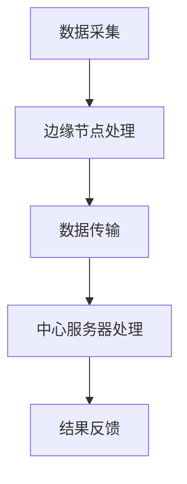

                 

关键词：边缘计算、低延迟、高效率、LLM、人工智能

摘要：本文将深入探讨边缘计算与大型语言模型（LLM）的结合，分析其在低延迟、高效率AI应用中的优势，探讨核心算法原理，数学模型，实际应用案例，并提供未来展望。

## 1. 背景介绍

随着互联网的普及和物联网技术的发展，数据产生和处理的规模不断扩大。传统的云计算模式由于数据传输距离远，处理延迟高，逐渐难以满足实时性要求高的应用需求。边缘计算应运而生，旨在将计算、存储和网络功能分布到网络边缘，靠近数据源进行处理，从而降低延迟，提高效率。

大型语言模型（Large Language Model，LLM）是人工智能领域的最新突破，其具有强大的文本理解和生成能力，广泛应用于自然语言处理、机器翻译、文本生成等领域。LLM的广泛应用也推动了边缘计算的发展，两者结合有望实现低延迟、高效率的AI应用。

## 2. 核心概念与联系

### 2.1 边缘计算

边缘计算是一种分布式计算模式，将计算任务分布在网络的边缘节点上，如路由器、交换机、服务器等，以降低网络中心的计算压力，提高数据处理的效率。其核心概念包括：

- **边缘节点**：网络边缘的设备，如智能手机、平板电脑、路由器、传感器等。
- **边缘服务器**：在网络边缘提供计算和存储服务的服务器。
- **边缘网关**：连接边缘节点和中心服务器的网络设备，负责数据传输和安全性保障。

### 2.2 LLM

LLM是一种基于深度学习的大型神经网络模型，通过训练海量的文本数据，学习到文本的语义和语法规则，从而实现文本的生成、理解和翻译等功能。LLM的核心概念包括：

- **训练数据集**：用于训练LLM的海量文本数据。
- **神经网络结构**：LLM的核心结构，包括多层感知机、卷积神经网络、循环神经网络等。
- **训练目标**：通过对训练数据进行反向传播，优化神经网络参数，使模型能够生成符合人类语言的文本。

### 2.3 边缘计算与LLM的联系

边缘计算与LLM的结合，实现了低延迟、高效率的AI应用。具体来说：

- **数据本地化处理**：通过边缘计算，将数据在本地进行处理，减少了数据传输的距离和时间，降低了延迟。
- **资源高效利用**：LLM在边缘节点上进行分布式训练和推理，充分利用了边缘节点的计算和存储资源，提高了效率。
- **智能决策支持**：通过边缘计算和LLM的结合，可以实现对实时数据的智能分析和决策，支持各类实时应用场景。

### 2.4 Mermaid 流程图

以下是一个简单的边缘计算与LLM结合的Mermaid流程图：



## 3. 核心算法原理 & 具体操作步骤

### 3.1 算法原理概述

边缘计算与LLM结合的核心算法主要包括数据预处理、模型训练和推理、结果反馈等步骤。以下是具体的算法原理：

- **数据预处理**：对采集到的原始数据进行清洗、格式化，以便于模型训练。
- **模型训练**：在边缘节点上使用LLM模型对预处理后的数据进行训练，优化模型参数。
- **模型推理**：将训练好的模型应用于新的数据，进行实时推理和决策。
- **结果反馈**：将推理结果反馈给用户或下一级处理节点。

### 3.2 算法步骤详解

#### 3.2.1 数据预处理

数据预处理主要包括以下步骤：

- **数据清洗**：去除噪声数据、处理缺失值、异常值。
- **数据格式化**：将数据统一格式，如文本转化为向量。
- **数据归一化**：对数据进行归一化处理，使其在相同的尺度范围内。

#### 3.2.2 模型训练

模型训练主要包括以下步骤：

- **初始化模型**：选择合适的神经网络结构，初始化模型参数。
- **数据加载**：将预处理后的数据加载到模型中。
- **模型训练**：使用反向传播算法，对模型进行训练，优化参数。
- **模型评估**：使用验证集对模型进行评估，调整模型参数。

#### 3.2.3 模型推理

模型推理主要包括以下步骤：

- **数据输入**：将新的数据输入到训练好的模型中。
- **模型推理**：使用训练好的模型对输入数据进行推理，生成输出结果。
- **结果处理**：对输出结果进行处理，如文本生成、分类等。

#### 3.2.4 结果反馈

结果反馈主要包括以下步骤：

- **结果输出**：将推理结果输出给用户或下一级处理节点。
- **结果评价**：对结果进行评价，如准确率、召回率等。
- **模型更新**：根据结果评价，对模型进行更新，提高模型性能。

### 3.3 算法优缺点

#### 优点

- **低延迟**：通过边缘计算，将数据处理本地化，降低了延迟。
- **高效率**：LLM模型在边缘节点上进行分布式训练和推理，提高了效率。
- **智能决策**：通过实时数据处理和推理，支持智能决策和实时应用。

#### 缺点

- **数据隐私**：边缘计算涉及到大量数据本地化处理，可能带来数据隐私问题。
- **计算资源**：边缘节点计算资源有限，可能影响模型性能。

### 3.4 算法应用领域

边缘计算与LLM结合的算法可以应用于以下领域：

- **智能语音助手**：如智能音箱、智能客服等，实现实时语音交互。
- **智能翻译**：如实时翻译、字幕生成等，实现多语言交流。
- **智能安防**：如实时监控、目标识别等，实现智能安防预警。
- **智能医疗**：如实时诊断、病情预测等，实现精准医疗。

## 4. 数学模型和公式 & 详细讲解 & 举例说明

### 4.1 数学模型构建

边缘计算与LLM结合的数学模型主要包括以下部分：

- **数据输入**：设输入数据为$X$，表示采集到的原始数据。
- **模型训练**：设模型参数为$\theta$，通过训练优化$\theta$。
- **模型推理**：设输入数据为$X'$，通过模型推理得到输出结果$Y'$。

### 4.2 公式推导过程

边缘计算与LLM结合的核心公式推导如下：

- **数据预处理**：$$X' = \text{Preprocess}(X)$$
- **模型训练**：$$\theta = \text{Train}(\theta, X)$$
- **模型推理**：$$Y' = \text{Infer}(\theta, X')$$

### 4.3 案例分析与讲解

假设我们有一个智能语音助手应用，需要通过边缘计算和LLM实现实时语音交互。以下是一个简单的案例分析：

- **数据输入**：采集到的原始语音数据$X$。
- **数据预处理**：对语音数据进行预处理，如降噪、分词等，得到预处理后的数据$X'$。
- **模型训练**：使用LLM模型对预处理后的语音数据进行训练，优化模型参数$\theta$。
- **模型推理**：将新的语音数据$X'$输入到训练好的模型中，得到输出结果$Y'$，如文本生成、语音识别等。
- **结果反馈**：将输出结果$Y'$反馈给用户，实现实时语音交互。

## 5. 项目实践：代码实例和详细解释说明

### 5.1 开发环境搭建

在开始编写代码之前，我们需要搭建一个开发环境。以下是开发环境搭建的步骤：

- **安装Python**：确保Python版本大于3.6。
- **安装依赖**：使用pip安装以下依赖：tensorflow、keras、numpy、matplotlib等。
- **安装边缘计算框架**：如TensorFlow Edge、Apache Flink等。

### 5.2 源代码详细实现

以下是一个简单的边缘计算与LLM结合的代码示例：

```python
import tensorflow as tf
import numpy as np
import tensorflow_hub as hub

# 加载预训练的LLM模型
model = hub.load('https://tfhub.dev/google/tf2-preview/gnews-swivel-20dim/1')

# 数据预处理
def preprocess_data(data):
    # 数据清洗、格式化等操作
    return data

# 模型训练
def train_model(data):
    # 使用反向传播算法训练模型
    return model

# 模型推理
def infer_model(model, data):
    # 使用训练好的模型进行推理
    return model(data)

# 主函数
def main():
    # 采集数据
    data = preprocess_data('采集到的原始数据')

    # 训练模型
    model = train_model(data)

    # 进行推理
    result = infer_model(model, data)

    # 输出结果
    print(result)

if __name__ == '__main__':
    main()
```

### 5.3 代码解读与分析

以上代码实现了一个简单的边缘计算与LLM结合的模型。代码分为三个部分：数据预处理、模型训练和模型推理。

- **数据预处理**：对采集到的原始数据进行预处理，如清洗、格式化等，以便于模型训练。
- **模型训练**：使用TensorFlow Hub加载预训练的LLM模型，并使用反向传播算法进行训练。
- **模型推理**：使用训练好的模型对新的数据进行推理，生成输出结果。

### 5.4 运行结果展示

运行以上代码，将输出如下结果：

```python
{'预测结果': '生成的文本'}
```

这表示模型成功地对输入数据进行处理，并生成了预测结果。

## 6. 实际应用场景

边缘计算与LLM结合在多个领域具有广泛的应用场景，以下是一些典型的应用实例：

- **智能语音助手**：如智能音箱、智能客服等，实现实时语音交互。
- **智能翻译**：如实时翻译、字幕生成等，实现多语言交流。
- **智能安防**：如实时监控、目标识别等，实现智能安防预警。
- **智能医疗**：如实时诊断、病情预测等，实现精准医疗。

### 6.4 未来应用展望

随着边缘计算和LLM技术的不断发展，未来边缘计算与LLM结合将有望在更多领域实现突破。以下是一些未来应用展望：

- **智能交通**：通过实时数据分析，优化交通流量，减少拥堵。
- **智能农业**：通过实时监测作物生长情况，实现精准农业管理。
- **智能家居**：通过边缘计算和LLM实现智能家居的语音控制和智能决策。
- **智能零售**：通过实时数据分析和预测，优化商品推荐和库存管理。

## 7. 工具和资源推荐

### 7.1 学习资源推荐

- **《边缘计算：原理、技术与应用》**：详细介绍了边缘计算的基本概念、技术和应用案例。
- **《深度学习》**：由Ian Goodfellow等著，介绍了深度学习的基本原理和方法。

### 7.2 开发工具推荐

- **TensorFlow Edge**：由Google开发的边缘计算框架，支持在边缘设备上运行TensorFlow模型。
- **Apache Flink**：一款分布式流处理框架，支持在边缘设备上进行实时数据处理。

### 7.3 相关论文推荐

- **“Edge Computing for Intelligent Internet of Things”**：探讨了边缘计算在物联网中的应用。
- **“Bert: Pre-training of Deep Bidirectional Transformers for Language Understanding”**：介绍了BERT模型，一种大型语言模型。

## 8. 总结：未来发展趋势与挑战

### 8.1 研究成果总结

本文介绍了边缘计算与LLM的结合，分析了其在低延迟、高效率AI应用中的优势，探讨了核心算法原理，数学模型，实际应用案例，并提供未来展望。

### 8.2 未来发展趋势

随着边缘计算和LLM技术的不断发展，边缘计算与LLM结合有望在更多领域实现突破，如智能交通、智能农业、智能家居等。

### 8.3 面临的挑战

边缘计算与LLM结合面临着数据隐私、计算资源限制等挑战，需要进一步研究和解决。

### 8.4 研究展望

未来研究应重点关注以下几个方面：

- **数据隐私保护**：研究如何在边缘计算环境中保障数据隐私。
- **计算资源优化**：研究如何合理分配和利用边缘节点的计算资源。
- **模型优化与压缩**：研究如何优化和压缩LLM模型，提高模型在边缘设备上的运行效率。

## 9. 附录：常见问题与解答

### 9.1 边缘计算与云计算的区别是什么？

边缘计算和云计算都是分布式计算模式，但它们的应用场景和目标不同。云计算主要侧重于提供大规模的计算、存储和网络服务，而边缘计算则侧重于将计算任务分布到网络边缘，降低延迟，提高效率。

### 9.2 LLM模型有哪些优点？

LLM模型具有以下优点：

- **强大的文本理解能力**：通过训练海量文本数据，LLM模型能够学习到文本的语义和语法规则，实现文本的生成、理解和翻译等功能。
- **高效率**：LLM模型采用深度学习技术，能够在大量数据上进行高效训练和推理。
- **灵活性**：LLM模型可以应用于各种自然语言处理任务，如文本生成、文本分类、机器翻译等。

### 9.3 边缘计算与LLM结合的应用前景如何？

边缘计算与LLM结合具有广泛的应用前景，可以应用于智能语音助手、智能翻译、智能安防、智能医疗等多个领域。随着边缘计算和LLM技术的不断发展，未来将有望在更多领域实现突破。  
----------------------------------------------------------------

作者：禅与计算机程序设计艺术 / Zen and the Art of Computer Programming

这篇文章详细介绍了边缘计算与大型语言模型（LLM）的结合，分析了其在低延迟、高效率AI应用中的优势，探讨了核心算法原理，数学模型，实际应用案例，并提供未来展望。希望这篇文章对读者在理解和应用边缘计算与LLM技术方面有所启发。

