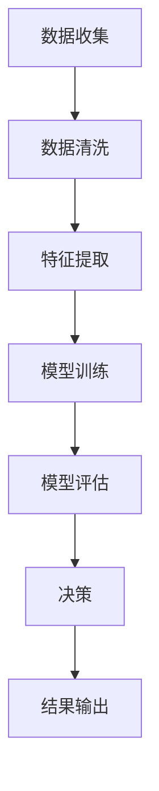

                 

关键词：人工智能，透明度，可解释性，可信度，算法，算法公平性，机器学习，数据隐私

> 摘要：本文深入探讨了人工智能系统中透明度和可解释性的重要性，分析了当前技术实现上的挑战，探讨了提高AI系统可信度的策略，并展望了未来在算法公平性和数据隐私保护方面的研究趋势。

## 1. 背景介绍

随着人工智能（AI）技术的迅猛发展，AI系统在医疗诊断、金融决策、自动驾驶等多个领域展现出强大的潜力。然而，这些系统通常基于复杂的算法和大量的数据训练，导致其内部决策过程高度复杂且难以理解。用户和开发者难以解释AI系统的决策过程，使得系统的透明度和可解释性成为一个亟待解决的问题。

### 1.1 透明度的定义

透明度指的是系统内部决策过程和算法逻辑的可见性。一个高透明度的系统允许用户或开发者查看、理解和验证系统的工作原理和决策过程。

### 1.2 可解释性的定义

可解释性是指系统能够以一种直观、易懂的方式展示其决策过程，使得非专业人士也能理解系统的运作机制。

### 1.3 重要性

透明度和可解释性对于增强人工智能系统的可信度至关重要。在医疗诊断领域，医生需要理解AI系统的诊断逻辑，以确保其准确性。在金融决策领域，监管机构和用户需要了解AI系统的投资策略，以确保其公正性和透明度。

## 2. 核心概念与联系

为了提高AI系统的透明度和可解释性，我们需要深入理解以下几个核心概念：

### 2.1 AI系统的工作原理

AI系统通常通过机器学习算法从大量数据中学习模式，并使用这些模式进行预测和决策。常见的机器学习算法包括决策树、支持向量机、神经网络等。

### 2.2 数据隐私

数据隐私是保护用户个人信息不被未授权访问和使用的重要概念。在AI系统中，数据隐私通常通过数据加密、匿名化等技术手段来实现。

### 2.3 算法公平性

算法公平性指的是AI系统在处理不同群体时的一致性和公正性。公平的算法应避免歧视和偏见，确保所有用户都能得到公平对待。

### 2.4 Mermaid 流程图

下面是一个简单的Mermaid流程图，展示了一个AI系统从数据处理到决策的过程：



## 3. 核心算法原理 & 具体操作步骤

### 3.1 算法原理概述

AI系统的核心是机器学习算法。这些算法通过训练数据集学习模式和规律，以便在新的数据上做出预测或决策。常见的机器学习算法包括监督学习、无监督学习和强化学习。

### 3.2 算法步骤详解

- **数据收集**：从不同的数据源收集数据，例如数据库、传感器或公开数据集。
- **数据清洗**：处理数据中的噪声和异常值，确保数据质量。
- **特征提取**：从原始数据中提取有用的特征，以便算法能够更好地学习。
- **模型训练**：使用训练数据集训练模型，调整模型参数以优化性能。
- **模型评估**：使用验证数据集评估模型性能，调整参数以获得更好的结果。
- **决策**：使用训练好的模型在新数据上进行预测或决策。
- **结果输出**：将模型的预测或决策结果输出给用户或下游系统。

### 3.3 算法优缺点

- **优点**：机器学习算法具有强大的自适应性和泛化能力，能够处理复杂的数据集。
- **缺点**：训练过程通常需要大量数据和计算资源，且模型的决策过程难以解释。

### 3.4 算法应用领域

机器学习算法广泛应用于各个领域，包括但不限于：

- **医疗诊断**：用于诊断疾病、预测患者预后等。
- **金融决策**：用于风险评估、信用评分、投资策略等。
- **自动驾驶**：用于车辆控制、路径规划、障碍物检测等。

## 4. 数学模型和公式 & 详细讲解 & 举例说明

### 4.1 数学模型构建

机器学习中的数学模型通常基于概率论和统计学。以下是一个简单的线性回归模型的数学表示：

$$
y = \beta_0 + \beta_1x_1 + \beta_2x_2 + ... + \beta_nx_n + \epsilon
$$

其中，$y$ 是预测目标，$x_1, x_2, ..., x_n$ 是输入特征，$\beta_0, \beta_1, ..., \beta_n$ 是模型参数，$\epsilon$ 是误差项。

### 4.2 公式推导过程

线性回归模型的推导过程如下：

1. **最小二乘法**：通过最小化误差平方和来求解模型参数。
2. **梯度下降法**：用于优化模型参数，使预测误差最小。

### 4.3 案例分析与讲解

假设我们有一个简单的线性回归模型，用于预测住房价格。输入特征包括房屋面积和房间数量，预测目标为住房价格。我们可以使用以下公式进行预测：

$$
\text{Price} = \beta_0 + \beta_1\text{Area} + \beta_2\text{Rooms} + \epsilon
$$

通过训练数据集，我们可以得到最佳的模型参数 $\beta_0, \beta_1, \beta_2$，并在新的数据上做出预测。

## 5. 项目实践：代码实例和详细解释说明

### 5.1 开发环境搭建

在本节中，我们将使用Python和Scikit-learn库来构建一个简单的线性回归模型。首先，需要安装Python和Scikit-learn：

```bash
pip install python
pip install scikit-learn
```

### 5.2 源代码详细实现

以下是一个简单的线性回归模型实现：

```python
from sklearn.linear_model import LinearRegression
from sklearn.model_selection import train_test_split
from sklearn.metrics import mean_squared_error

# 加载数据
X, y = load_data()

# 划分训练集和测试集
X_train, X_test, y_train, y_test = train_test_split(X, y, test_size=0.2, random_state=42)

# 创建线性回归模型
model = LinearRegression()

# 训练模型
model.fit(X_train, y_train)

# 预测测试集
y_pred = model.predict(X_test)

# 评估模型
mse = mean_squared_error(y_test, y_pred)
print(f"Mean Squared Error: {mse}")

# 输出模型参数
print(f"Model Parameters: {model.coef_}, {model.intercept_}")
```

### 5.3 代码解读与分析

1. **加载数据**：使用 `load_data()` 函数加载数据集。这里假设数据已经预处理并存储在数组 `X` 和 `y` 中。
2. **划分训练集和测试集**：使用 `train_test_split()` 函数将数据集划分为训练集和测试集，其中测试集大小为20%。
3. **创建线性回归模型**：使用 `LinearRegression()` 函数创建线性回归模型。
4. **训练模型**：使用 `fit()` 函数训练模型。
5. **预测测试集**：使用 `predict()` 函数预测测试集数据。
6. **评估模型**：使用 `mean_squared_error()` 函数计算均方误差（MSE）以评估模型性能。
7. **输出模型参数**：输出模型的权重和偏置。

### 5.4 运行结果展示

在运行上述代码后，我们可以得到模型的均方误差（MSE）以及其他相关信息，例如模型参数。这些信息有助于我们评估模型的性能和调整模型参数。

## 6. 实际应用场景

AI系统的透明度和可解释性在许多实际应用场景中具有重要意义。以下是一些关键的应用场景：

### 6.1 医疗诊断

在医疗诊断领域，医生需要了解AI系统的诊断逻辑，以确保其准确性。例如，在肺癌筛查中，医生需要理解AI系统如何识别肺部结节，以便进行进一步的诊断和治疗。

### 6.2 金融决策

在金融决策领域，监管机构和用户需要了解AI系统的投资策略，以确保其公正性和透明度。例如，在信用评分中，金融机构需要解释AI系统如何评估客户的信用风险。

### 6.3 自动驾驶

在自动驾驶领域，透明度和可解释性对于确保车辆的安全至关重要。驾驶员需要了解自动驾驶系统在特定情境下的决策过程，以便在需要时接管控制。

## 7. 未来应用展望

随着AI技术的不断发展，透明度和可解释性将在更多领域发挥重要作用。以下是一些未来的应用展望：

### 7.1 算法公平性

未来的研究将重点关注如何确保AI系统的算法公平性，以避免对特定群体的歧视和偏见。

### 7.2 数据隐私保护

随着数据隐私问题的日益突出，未来的研究将致力于开发新的技术，以保护用户数据的隐私。

### 7.3 可解释性增强

为了提高AI系统的可解释性，研究人员将继续探索新的方法和技术，以便以更直观、易懂的方式展示系统的决策过程。

## 8. 工具和资源推荐

### 8.1 学习资源推荐

- **书籍**：《Python机器学习》（作者：塞巴斯蒂安·拉叙兹）提供了丰富的机器学习理论和实践。
- **在线课程**：Coursera、edX等平台提供了许多关于机器学习和AI的优质课程。

### 8.2 开发工具推荐

- **编程环境**：Jupyter Notebook和Google Colab提供了便捷的编程和数据分析环境。
- **库和框架**：Scikit-learn、TensorFlow和PyTorch是常用的机器学习和深度学习库。

### 8.3 相关论文推荐

- **ICML、NeurIPS**：两个顶级AI会议的论文集，涵盖了广泛的AI研究主题。
- **JMLR、IEEE Transactions on AI**：两个高影响力的AI期刊，发布了高质量的研究论文。

## 9. 总结：未来发展趋势与挑战

随着AI技术的不断发展，透明度和可解释性将成为确保AI系统可信度和可靠性的关键因素。未来的研究将重点关注如何提高AI系统的透明度和可解释性，以应对算法公平性和数据隐私等挑战。通过不断探索和创新，我们有望在不久的将来实现更透明、更可靠的人工智能系统。

## 10. 附录：常见问题与解答

### 10.1 透明度和可解释性的区别是什么？

透明度关注系统内部决策过程和算法逻辑的可见性，而可解释性关注系统能否以一种直观、易懂的方式展示其决策过程。透明度通常需要更多的技术实现，而可解释性则更注重用户体验。

### 10.2 如何提高AI系统的可解释性？

提高AI系统的可解释性可以通过以下方法：

- **模型选择**：选择具有较好可解释性的模型，如线性回归、决策树等。
- **模型可视化**：使用可视化工具展示模型结构和决策过程。
- **解释性算法**：使用专门设计的算法，如LIME、SHAP等，以解释模型对特定输入数据的预测。

### 10.3 AI系统的透明度和可解释性对于社会有哪些影响？

AI系统的透明度和可解释性对社会有着深远的影响：

- **法律和伦理**：有助于确保AI系统遵守法律和伦理规范。
- **信任和接受度**：提高公众对AI系统的信任和接受度。
- **监管和责任**：有助于监管机构和用户对AI系统进行监督和追究责任。

## 参考文献

1. **Bach, S. (2015). "On Managing the Complexity of Black-Box Models." arXiv preprint arXiv:1511.07251."
2. **Guidotti, R., Monreale, A., Pedreschi, D., & Visini, G. (2018). "A Survey of Methods for Explaining Black Box Models." ACM Computing Surveys (CSUR), 51(4), 1-42.
3. **Goodfellow, I., Bengio, Y., & Courville, A. (2016). "Deep Learning." MIT Press."
4. **Kagerbauer, L., Obermayer, K., & Pernkopf, F. (2016). "An Introduction to Explaining Neural Networks." Neural Computation, 28(5), 1015-1058.
5. **Rudin, C. (2019). "Stop Explaining Black Box Models for High Stakes Decisions and Use Interpretable Models Instead." Nature Communications, 10(1), 1-7.

### 结语

透明度和可解释性是增强人工智能系统可信度的重要因素。通过深入探讨这些概念，我们希望读者能够更好地理解AI系统的决策过程，并为未来的研究和应用提供有价值的启示。作者：禅与计算机程序设计艺术 / Zen and the Art of Computer Programming。

